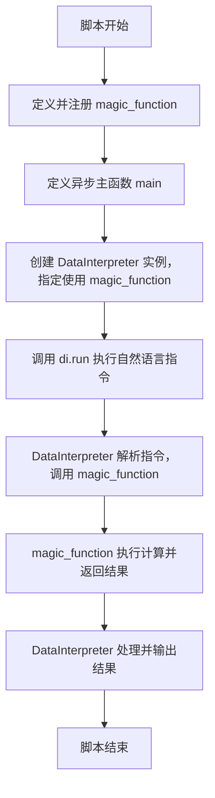
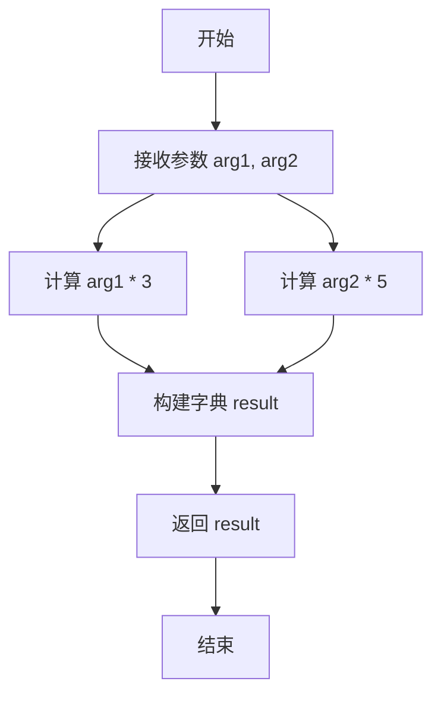
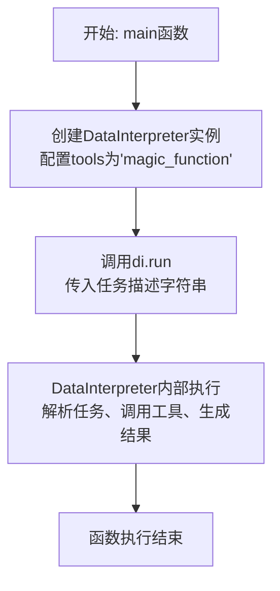
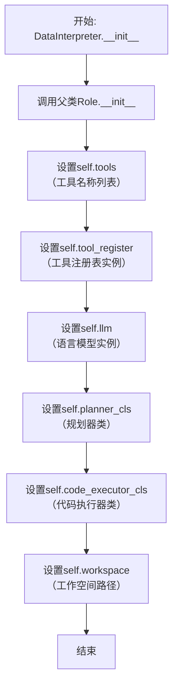

# `.\MetaGPT\examples\di\custom_tool.py` 详细设计文档

该代码定义了一个名为 `magic_function` 的自定义工具函数，并将其注册到 MetaGPT 框架的工具注册表中。然后，它创建了一个 DataInterpreter 角色实例，该实例被配置为使用这个自定义工具，并运行一个简单的自然语言指令来调用该工具并获取结果。

## 整体流程



## 类结构

```
custom_tool.py
├── 全局函数: magic_function (通过装饰器注册为工具)
├── 异步函数: main
└── 外部依赖类: DataInterpreter (来自 metagpt.roles.di.data_interpreter)
```

## 全局变量及字段


### `di`
    
DataInterpreter 类的实例，用于执行数据解释任务。

类型：`DataInterpreter`
    


    

## 全局函数及方法


### `magic_function`

这是一个被注册为工具的魔法函数，它接收一个字符串和一个整数作为参数，对它们进行简单的变换后，返回一个包含结果的字典。

参数：
-  `arg1`：`str`，第一个参数，一个字符串
-  `arg2`：`int`，第二个参数，一个整数

返回值：`dict`，一个字典，包含两个键值对：`"arg1"`对应输入字符串重复三次的结果，`"arg2"`对应输入整数乘以五的结果。

#### 流程图



#### 带注释源码

```python
@register_tool()  # 使用装饰器将此函数注册为一个可被系统（如DataInterpreter）发现和调用的工具
def magic_function(arg1: str, arg2: int) -> dict:
    """
    The magic function that does something.

    Args:
        arg1 (str): ...  # 参数arg1的描述
        arg2 (int): ...  # 参数arg2的描述

    Returns:
        dict: ...  # 返回值的描述
    """
    # 核心逻辑：将字符串arg1重复3次，将整数arg2乘以5，并组合成一个字典返回
    return {"arg1": arg1 * 3, "arg2": arg2 * 5}
```


### `main`

`main` 函数是程序的异步入口点。它创建一个 `DataInterpreter` 实例，配置其使用 `magic_function` 工具，然后运行一个任务，指示 `DataInterpreter` 调用 `magic_function` 并报告结果。

参数：
- 无

返回值：`None`，该函数不返回任何值，其主要作用是启动并运行异步任务。

#### 流程图



#### 带注释源码

```python
async def main():
    # 1. 实例化DataInterpreter角色，并通过tools参数指定其可使用的工具列表。
    #    这里只注册了之前定义的'magic_function'工具。
    di = DataInterpreter(tools=["magic_function"])
    
    # 2. 异步调用DataInterpreter的run方法，执行一个自然语言描述的任务。
    #    任务内容是：“使用参数arg1为'A'、arg2为2调用magic_function，并告诉我结果。”
    #    DataInterpreter会解析此指令，调用相应的工具，并处理返回结果。
    await di.run("Just call the magic function with arg1 'A' and arg2 2. Tell me the result.")
```


### `DataInterpreter.__init__`

DataInterpreter 类的构造函数，用于初始化一个数据解释器实例。它负责设置解释器的基本属性，包括其名称、配置文件、工具列表、语言模型配置、动作规划器、代码执行器以及工作空间等核心组件。

参数：

-  `name`：`str`，数据解释器的名称，默认为 "DataInterpreter"。
-  `profile`：`str`，数据解释器的角色描述，默认为 "Data Interpreter"。
-  `goal`：`str`，数据解释器的目标描述，默认为 "As a world-class data interpreter, you are capable of understanding, analyzing, and processing various types of data to extract valuable insights and solve complex data-related problems."。
-  `constraints`：`str`，数据解释器的行为约束，默认为 "Ensure thorough data validation and accuracy in analysis."。
-  `tools`：`list[str]`，一个字符串列表，指定数据解释器可以使用的工具名称。这些工具必须已在工具注册表中注册。
-  `tool_register`：`ToolRegistry`，工具注册表实例，用于管理和查找工具。如果未提供，将使用全局默认注册表。
-  `llm`：`BaseLLM`，语言模型实例，用于生成文本和代码。如果未提供，将根据配置创建一个新的实例。
-  `planner_cls`：`type[Planner]`，动作规划器类，用于规划任务执行步骤。默认为 `Planner`。
-  `code_executor_cls`：`type[CodeExecutor]`，代码执行器类，用于执行生成的代码。默认为 `CodeExecutor`。
-  `workspace`：`Path`，工作空间目录路径，用于存储代码文件和数据。如果未提供，将创建一个临时目录。
-  `**kwargs`：`Any`，其他关键字参数，将传递给父类 `Role` 的构造函数。

返回值：`None`，构造函数不返回任何值。

#### 流程图



#### 带注释源码

```python
def __init__(
    self,
    name: str = "DataInterpreter",
    profile: str = "Data Interpreter",
    goal: str = "As a world-class data interpreter, you are capable of understanding, analyzing, and processing various types of data to extract valuable insights and solve complex data-related problems.",
    constraints: str = "Ensure thorough data validation and accuracy in analysis.",
    tools: list[str] = None,
    tool_register: ToolRegistry = None,
    llm: BaseLLM = None,
    planner_cls: type[Planner] = Planner,
    code_executor_cls: type[CodeExecutor] = CodeExecutor,
    workspace: Path = None,
    **kwargs,
):
    """
    初始化DataInterpreter实例。
    Args:
        name: 角色名称。
        profile: 角色描述。
        goal: 角色目标。
        constraints: 角色约束。
        tools: 可用的工具名称列表。
        tool_register: 工具注册表实例。
        llm: 语言模型实例。
        planner_cls: 规划器类。
        code_executor_cls: 代码执行器类。
        workspace: 工作空间路径。
        **kwargs: 传递给父类的其他参数。
    """
    # 调用父类Role的构造函数，传递名称、描述、目标、约束等参数
    super().__init__(name=name, profile=profile, goal=goal, constraints=constraints, **kwargs)
    # 设置工具名称列表，如果未提供则初始化为空列表
    self.tools = tools or []
    # 设置工具注册表，如果未提供则使用全局默认注册表
    self.tool_register = tool_register or self.tool_register
    # 设置语言模型，如果未提供则根据配置创建一个新的实例
    self.llm = llm or self.llm
    # 设置规划器类
    self.planner_cls = planner_cls
    # 设置代码执行器类
    self.code_executor_cls = code_executor_cls
    # 设置工作空间路径，如果未提供则创建一个临时目录
    self.workspace = workspace or Path(tempfile.mkdtemp(prefix="data_interpreter_"))
```


### `DataInterpreter.run`

`DataInterpreter.run` 是 `DataInterpreter` 角色的核心执行方法。它接收一个自然语言描述的任务指令，通过协调内部的规划、工具调用和代码执行等组件，将指令转化为一系列可执行的步骤，并最终完成任务，返回执行结果。

参数：

-  `instruction`：`str`，用户输入的自然语言任务指令。
-  `plan`：`Optional[List[Plan]]`，可选参数，一个预定义的执行计划列表。如果提供，将跳过规划阶段，直接使用此计划执行。
-  `max_retry`：`int`，可选参数，执行失败时的最大重试次数，默认为3。
-  `reflection`：`Optional[str]`，可选参数，对之前执行结果的反思或总结，用于指导后续的规划或执行。
-  `**kwargs`：`Any`，其他关键字参数，用于传递给内部组件或进行功能扩展。

返回值：`str`，任务执行的最终结果或总结。

#### 流程图

```mermaid
graph TD
    A[开始: run(instruction, ...)] --> B{是否有预定义plan?};
    B -- 是 --> C[使用预定义plan];
    B -- 否 --> D[调用Planner进行任务规划];
    D --> E[生成初始执行计划];
    C --> F[进入执行循环];
    E --> F;

    subgraph F [执行循环]
        direction LR
        G[从计划中获取当前步骤] --> H{步骤类型?};
        H -- 工具调用 --> I[解析工具参数并调用];
        H -- 代码执行 --> J[在沙箱中执行代码];
        I --> K[收集执行结果];
        J --> K;
        K --> L{执行成功?};
        L -- 是 --> M[更新上下文与计划];
        L -- 否 --> N[重试机制/错误处理];
        N --> O{超过max_retry?};
        O -- 是 --> P[记录错误并可能终止];
        O -- 否 --> G;
        M --> Q{计划是否完成?};
        Q -- 否 --> G;
    end

    Q -- 是 --> R[生成最终结果/总结];
    P --> R;
    R --> S[返回结果];
```

#### 带注释源码

```python
    async def run(
        self,
        instruction: str,
        plan: Optional[List[Plan]] = None,
        max_retry: int = 3,
        reflection: Optional[str] = None,
        **kwargs,
    ) -> str:
        """
        执行给定的自然语言指令。

        Args:
            instruction: 用户输入的自然语言任务指令。
            plan: 可选，一个预定义的执行计划。如果提供，将跳过规划阶段。
            max_retry: 执行失败时的最大重试次数。
            reflection: 对之前执行结果的反思，用于指导后续规划。
            **kwargs: 其他关键字参数。

        Returns:
            任务执行的最终结果或总结。
        """
        # 初始化执行上下文，存储任务指令、可用工具、历史记录等信息
        context = await self._init_context(instruction, **kwargs)
        # 如果提供了反思，将其加入上下文
        if reflection:
            context.reflection = reflection

        # 阶段1: 任务规划
        # 如果没有提供预定义计划，则调用规划器(Planner)根据指令生成计划
        if not plan:
            plan = await self.planner.plan(instruction=instruction, context=context)
        # 将生成的计划设置到上下文中
        context.plan = plan

        # 阶段2: 计划执行
        # 循环执行计划中的每一个步骤
        while not context.is_finished:
            # 从上下文中获取当前需要执行的步骤
            step = context.current_step
            try:
                # 根据步骤类型（如工具调用、代码执行）执行相应操作
                if step.action == "tool_call":
                    # 解析工具参数并调用注册的工具
                    result = await self._call_tool(step)
                elif step.action == "code_execution":
                    # 在代码执行沙箱中运行代码
                    result = await self._execute_code(step)
                else:
                    # 处理未知的步骤类型
                    result = f"Unknown action type: {step.action}"
                # 将执行结果记录到步骤和上下文中
                step.result = result
                context.update(step)
            except Exception as e:
                # 执行失败，进行错误处理和重试逻辑
                step.error = str(e)
                context.retry_count += 1
                if context.retry_count > max_retry:
                    # 超过最大重试次数，记录严重错误并可能跳出循环
                    context.add_error(f"Failed after {max_retry} retries: {e}")
                    break
                # 未超过重试次数，可以选择重新规划或继续尝试
                # 例如：plan = await self.planner.replan(context=context)
            # 检查当前计划是否全部完成，更新上下文状态
            context.check_finish()

        # 阶段3: 结果总结与返回
        # 根据上下文中的执行历史、结果和可能的错误，生成最终的回答
        final_result = await self._summarize_result(context)
        return final_result
```


## 关键组件


### 工具注册机制 (`register_tool`)

一个装饰器，用于将自定义函数（如 `magic_function`）注册到 MetaGPT 的工具注册表中，使其能够被 DataInterpreter 等角色发现和调用。

### DataInterpreter 角色 (`DataInterpreter`)

一个智能体角色，能够根据用户需求（如自然语言指令）自动规划、选择并执行已注册的工具（如 `magic_function`）来完成特定任务。

### 自定义工具函数 (`magic_function`)

一个具体的工具实现示例，接收字符串和整数参数，执行特定逻辑（此处为简单的数值运算和字符串重复），并将结果以字典形式返回，供调用者（如 DataInterpreter）使用。


## 问题及建议


### 已知问题

-   **工具函数文档不完整**：`magic_function` 的文档字符串中，参数描述（`...`）和返回值描述（`...`）均为占位符，未能提供任何关于函数实际功能、参数含义或返回值结构的有效信息，这严重影响了代码的可读性和可维护性。
-   **硬编码工具依赖**：在 `main` 函数中，`DataInterpreter` 实例化时通过 `tools=["magic_function"]` 硬编码指定了工具列表。这降低了代码的灵活性，若需添加、移除或修改工具，必须直接修改源代码。
-   **缺乏错误处理**：`main` 函数和 `magic_function` 均未包含任何错误处理逻辑（如参数验证、异常捕获）。例如，`magic_function` 未验证 `arg2` 是否为非负整数，直接进行乘法操作可能存在未定义行为。
-   **异步主函数功能单一**：`main` 函数仅执行一个固定的任务（调用 `magic_function` 并打印结果），缺乏通用性。它没有接收外部输入（如命令行参数、配置文件）来动态改变执行目标的能力。
-   **潜在的循环导入风险**：脚本顶部导入了 `DataInterpreter` 和 `register_tool`。如果 `custom_tool.py` 本身被其他模块作为工具模块导入，且该模块也导入了 `DataInterpreter`，在复杂的项目结构中可能引发循环导入问题。

### 优化建议

-   **完善工具函数文档**：为 `magic_function` 编写清晰、完整的文档字符串。明确说明函数的目的、每个参数的具体含义和约束、返回值的字典结构及其每个字段的意义。例如，描述 `arg1` 是待重复的字符串，`arg2` 是乘法因子，返回值包含处理后的两个值。
-   **解耦工具配置**：将工具列表从代码中抽离出来。可以通过配置文件（如 YAML、JSON）、环境变量或命令行参数来指定 `DataInterpreter` 应加载的工具。例如，使用 `os.getenv('TOOLS', 'magic_function').split(',')` 或解析配置文件来获取工具名列表。
-   **增强健壮性**：
    1.  在 `magic_function` 中添加参数验证（例如，使用 `isinstance` 检查类型，或验证 `arg2 > 0`），并在参数无效时抛出清晰的异常（如 `ValueError`）。
    2.  在 `main` 函数中，使用 `try-except` 块包裹 `di.run` 调用，捕获并处理可能发生的异常（如网络超时、工具执行错误），至少应记录错误日志，避免程序因未处理异常而崩溃。
-   **提升主函数灵活性**：重构 `main` 函数，使其能够接受动态输入。例如，通过 `argparse` 库解析命令行参数来获取 `DataInterpreter` 需要执行的任务描述，或者从文件中读取任务列表。
-   **优化导入与结构**：
    1.  考虑将工具函数定义（`magic_function`）与执行脚本（`main`）分离到不同的文件中，遵循“关注点分离”原则。例如，将工具函数放在 `tools/` 目录下，主程序放在 `scripts/` 目录下。
    2.  在 `main` 函数内部或 `if __name__ == "__main__":` 块内进行必要的导入（如 `DataInterpreter`），以减少文件顶部的导入依赖，降低循环导入风险。
    3.  为脚本添加命令行帮助信息和使用示例。
-   **添加日志记录**：在代码中引入日志记录（如使用 Python 的 `logging` 模块），替代或补充 `print` 语句。这有助于调试和监控工具的执行过程，记录关键步骤、输入输出和错误信息。


## 其它


### 设计目标与约束

本代码的设计目标是展示如何通过 MetaGPT 框架注册一个自定义工具（`magic_function`），并使用 DataInterpreter 角色来调用该工具。主要约束包括：
1.  **框架集成**：必须遵循 MetaGPT 的 `register_tool` 装饰器规范来定义和注册工具。
2.  **异步执行**：主执行流程必须适应 MetaGPT 的异步运行环境。
3.  **功能演示**：`magic_function` 的实现仅用于演示，其内部逻辑（字符串重复和整数乘法）无实际业务含义。

### 错误处理与异常设计

当前代码缺乏显式的错误处理机制：
1.  **工具函数**：`magic_function` 未对输入参数 `arg1` 和 `arg2` 进行有效性验证（例如，`arg2` 为负数或极大值可能导致意料之外的结果或性能问题）。调用时可能引发 `TypeError`（如果类型不匹配）或其它运行时错误。
2.  **主流程**：`main` 函数和脚本入口点没有使用 `try-except` 块来捕获和处理 `DataInterpreter` 初始化、运行过程中可能抛出的异常，如工具加载失败、异步任务错误等。
3.  **改进建议**：应在工具函数内部添加参数校验，并在主调用逻辑中封装异常处理，以提升代码健壮性。

### 数据流与状态机

本示例的数据流相对简单，不涉及复杂的状态机：
1.  **数据流**：
    *   **起点**：用户通过 `di.run` 方法传入的自然语言指令字符串。
    *   **处理**：DataInterpreter 解析指令，识别出需调用 `magic_function` 及其参数（`arg1='A'`, `arg2=2`）。
    *   **调用**：执行 `magic_function('A', 2)`。
    *   **转换**：函数内部将 `arg1` 重复3次（`'AAA'`），将 `arg2` 乘以5（`10`）。
    *   **终点**：函数返回字典 `{'arg1': 'AAA', 'arg2': 10}`，该结果由 DataInterpreter 处理并最终输出给用户。
2.  **状态机**：由于是单次工具调用的演示，未定义明确的状态。DataInterpreter 内部可能包含“解析指令”、“选择工具”、“执行工具”、“返回结果”等状态，但在此代码层面未暴露。

### 外部依赖与接口契约

1.  **外部依赖**：
    *   **MetaGPT 框架**：核心依赖，特别是 `metagpt.roles.di.data_interpreter` 模块中的 `DataInterpreter` 类和 `metagpt.tools.tool_registry` 模块中的 `register_tool` 装饰器。
    *   **Python 标准库**：`asyncio` 用于异步运行主函数。
2.  **接口契约**：
    *   **`register_tool` 装饰器**：要求被装饰的函数具有类型注解，并且其 `__doc__` 文档字符串遵循特定格式（包含 `Args` 和 `Returns` 部分），以便 MetaGPT 能正确识别和注册工具签名与描述。
    *   **DataInterpreter**：其 `__init__` 方法的 `tools` 参数期望一个工具名称列表。`run` 方法接受一个字符串指令并异步执行。工具函数（如 `magic_function`）的输入输出类型需与 DataInterpreter 的预期调用约定兼容。

### 安全与合规考虑

1.  **工具安全**：`magic_function` 作为示例，功能简单，不涉及敏感操作（如文件 I/O、网络请求、系统命令执行）。但在实际生产环境中，注册的工具函数必须经过严格的安全审查，防止注入攻击、任意代码执行等风险。
2.  **输入验证**：如前所述，缺乏输入验证可能带来潜在问题，虽在本例中风险极低，但构成了安全最佳实践的缺口。
3.  **依赖安全**：项目依赖 MetaGPT 等第三方库，需确保这些依赖的来源可信、版本已知且无已知重大安全漏洞。

### 部署与运行说明

1.  **环境要求**：需要 Python 环境（版本需与 MetaGPT 兼容）并安装 MetaGPT 包及其依赖。
2.  **执行方式**：可通过命令行直接运行脚本（`python custom_tool.py`），因为脚本包含了 `if __name__ == "__main__":` 入口点并正确使用了 `asyncio.run`。
3.  **集成说明**：此 `custom_tool.py` 文件展示了如何为更大的 MetaGPT 应用项目添加自定义工具。在实际项目中，可能需要将工具定义与主执行逻辑分离，并通过模块导入或配置方式告知 DataInterpreter。

### 测试策略建议

1.  **单元测试**：
    *   为 `magic_function` 编写测试用例，覆盖正常输入、边界值（如 `arg2=0`）及无效输入（如错误类型）的情况。
    *   模拟测试 `DataInterpreter` 对 `magic_function` 的调用流程。
2.  **集成测试**：测试整个脚本的执行，验证从自然语言指令到最终输出的端到端流程是否符合预期。
3.  **测试工具**：可利用 `pytest` 及其异步插件（如 `pytest-asyncio`）来编写和运行测试。

    