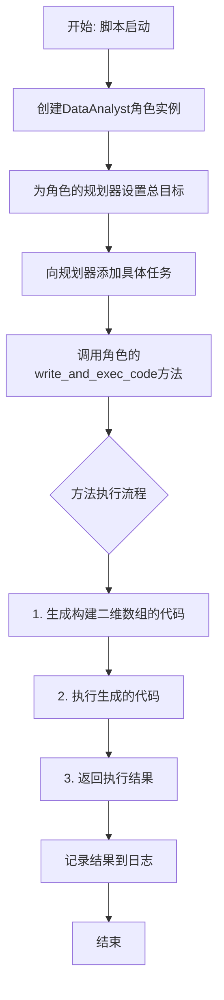
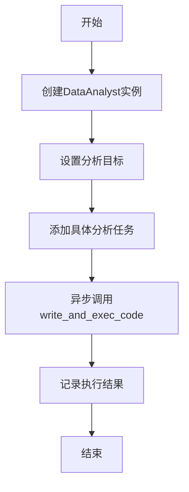
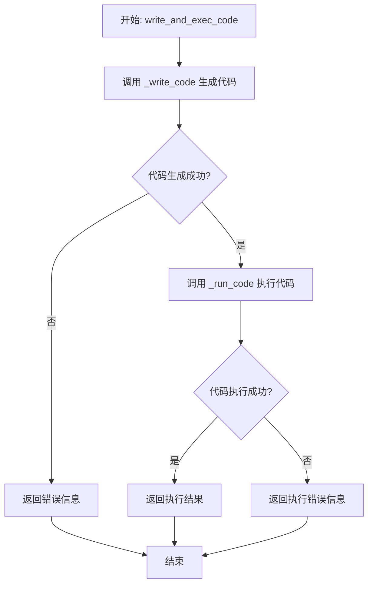
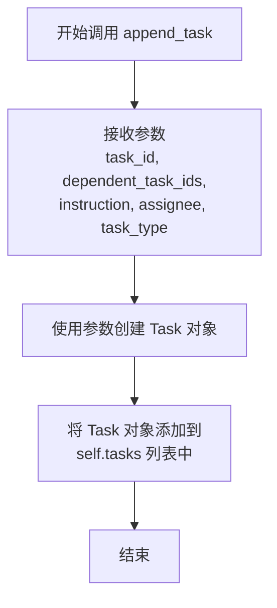

# `.\MetaGPT\examples\di\data_analyst_write_code.py` 详细设计文档

该代码是MetaGPT框架的一个示例脚本，核心功能是创建一个数据分析师角色，为其规划一个“构建二维数组”的任务，然后执行代码生成与运行，并记录结果。它展示了如何通过高层抽象（角色、规划器）来编排和执行一个具体的代码生成任务。

## 整体流程



## 类结构

```
外部依赖
├── fire (CLI框架)
├── metagpt.logs.logger (日志模块)
└── metagpt.roles.di.data_analyst.DataAnalyst (数据分析师角色类)
主脚本
└── main (异步主函数)
```

## 全局变量及字段


### `analyst`
    
DataAnalyst角色的实例，负责数据分析和代码生成任务

类型：`DataAnalyst`
    


### `result`
    
存储write_and_exec_code方法执行后返回的结果，通常是代码执行的输出

类型：`Any`
    


### `DataAnalyst.planner`
    
DataAnalyst内部的规划器组件，用于管理和执行任务计划

类型：`Planner`
    


### `Plan (通过analyst.planner.plan访问).goal`
    
计划的主要目标，描述需要完成的核心任务

类型：`str`
    
    

## 全局函数及方法

### `main`

该函数是程序的入口点，负责初始化一个`DataAnalyst`角色，为其设置一个“构建二维数组”的目标，并添加一个具体的分析任务。然后，它调用`DataAnalyst`的`write_and_exec_code`方法来生成并执行相应的代码，最后记录执行结果。

参数：
- 无

返回值：`None`，该函数不返回任何值，其主要功能是执行一系列操作并记录日志。

#### 流程图



#### 带注释源码

```python
import fire

from metagpt.logs import logger
from metagpt.roles.di.data_analyst import DataAnalyst


async def main():
    # 创建一个DataAnalyst角色的实例
    analyst = DataAnalyst()

    # 为规划器设置主要目标 - 构建一个二维数组
    analyst.planner.plan.goal = "construct a two-dimensional array"

    # 向规划器添加一个具体的任务，包含详细参数：
    # - task_id: 任务的唯一标识符
    # - dependent_task_ids: 需要在此任务之前完成的任务列表（此处为空）
    # - instruction: 需要完成的任务描述
    # - assignee: 任务的执行者（David）
    # - task_type: 任务的类别（DATA_ANALYSIS）
    analyst.planner.plan.append_task(
        task_id="1",
        dependent_task_ids=[],
        instruction="construct a two-dimensional array",
        assignee="David",
        task_type="DATA_ANALYSIS",
    )

    # 执行用于创建二维数组的代码生成和执行
    # write_and_exec_code方法将：
    # 1. 生成创建二维数组所需的代码
    # 2. 执行生成的代码
    # 3. 返回执行结果
    result = await analyst.write_and_exec_code("construct a two-dimensional array")

    # 记录代码执行的结果
    logger.info(result)


if __name__ == "__main__":
    # 使用fire库将main函数暴露为命令行接口
    fire.Fire(main)
```

### `DataAnalyst.write_and_exec_code`

该方法负责根据给定的指令生成相应的代码，执行该代码，并返回执行结果。它整合了代码生成、执行和结果捕获的完整流程。

参数：
- `instruction`：`str`，描述需要执行的代码功能的自然语言指令。

返回值：`str`，代码执行后返回的结果字符串。

#### 流程图



#### 带注释源码

```python
async def write_and_exec_code(self, instruction: str) -> str:
    """
    根据指令生成并执行代码，返回执行结果。
    
    该方法首先调用 `_write_code` 方法根据指令生成代码字符串，
    然后调用 `_run_code` 方法执行生成的代码，并捕获执行结果或异常。
    
    Args:
        instruction (str): 描述所需代码功能的自然语言指令。
        
    Returns:
        str: 代码执行后的输出结果。如果生成或执行失败，则返回错误信息。
    """
    # 步骤1: 根据指令生成代码
    code = await self._write_code(instruction=instruction)
    
    # 步骤2: 执行生成的代码并获取结果
    result = await self._run_code(code=code)
    
    # 步骤3: 返回执行结果
    return result
```

### `analyst.planner.plan.append_task`

该方法用于向计划中添加一个新的任务。它接收任务的详细信息，包括任务ID、依赖任务、指令、执行者和任务类型，并将这些信息封装成一个任务对象，然后添加到计划的任务列表中。

参数：

- `task_id`：`str`，任务的唯一标识符。
- `dependent_task_ids`：`List[str]`，此任务所依赖的其他任务的ID列表。这些任务需要在此任务开始之前完成。
- `instruction`：`str`，任务的详细描述或指令，说明需要完成什么工作。
- `assignee`：`str`，被分配执行此任务的成员名称。
- `task_type`：`str`，任务的类型分类，例如“DATA_ANALYSIS”。

返回值：`None`，此方法不返回任何值，其作用是将任务对象添加到内部列表中。

#### 流程图



#### 带注释源码

```python
def append_task(
    self,
    task_id: str,
    dependent_task_ids: List[str],
    instruction: str,
    assignee: str,
    task_type: str,
):
    """
    向计划中添加一个新任务。

    Args:
        task_id (str): 任务的唯一标识符。
        dependent_task_ids (List[str]): 此任务所依赖的任务ID列表。
        instruction (str): 任务的详细描述或指令。
        assignee (str): 被分配执行此任务的成员。
        task_type (str): 任务的类型。
    """
    # 使用传入的参数创建一个新的 Task 对象
    task = Task(
        id=task_id,
        dependent_task_ids=dependent_task_ids,
        instruction=instruction,
        assignee=assignee,
        task_type=task_type,
    )
    # 将新创建的任务对象添加到计划的任务列表（self.tasks）中
    self.tasks.append(task)
```

## 关键组件


### DataAnalyst 角色

负责数据分析和代码生成的核心角色，封装了从任务规划到代码执行的全流程。

### Planner 组件

负责任务规划和管理，包含任务的目标设定、任务列表的维护以及任务依赖关系的处理。

### Task 管理

负责单个任务的创建和管理，包括任务ID、依赖任务、指令描述、执行者和任务类型等元数据。

### 代码生成与执行引擎

负责根据任务指令生成相应的可执行代码，并安全地执行该代码以获取结果。

### 日志系统

负责记录系统运行过程中的关键信息和执行结果，用于调试和监控。


## 问题及建议


### 已知问题

-   **硬编码任务参数**：`main` 函数中创建任务时，任务ID、指令、执行者等参数均为硬编码字符串。这使得代码不灵活，难以复用或根据动态需求调整任务。
-   **缺乏错误处理**：`main` 函数直接调用 `await analyst.write_and_exec_code(...)` 并记录结果，但没有对可能发生的异常（如代码生成失败、执行错误）进行捕获和处理，程序可能因未处理的异常而崩溃。
-   **目标与任务指令重复**：`analyst.planner.plan.goal` 和 `analyst.planner.plan.append_task` 中的 `instruction` 参数被设置为相同的字符串 `"construct a two-dimensional array"`，存在数据冗余，可能导致维护不一致。
-   **同步与异步混合使用的风险**：`main` 函数被定义为 `async`，但通过 `fire.Fire(main)` 调用。虽然 `fire` 可能支持异步函数，但这种用法不够明确，且在某些环境下可能导致未预期的行为或需要额外的异步运行器。
-   **日志级别不明确**：使用 `logger.info(result)` 记录结果，但如果 `result` 包含大量数据（如大型数组），可能会产生冗长的日志输出。同时，对于执行过程中的关键步骤（如任务开始、代码生成成功/失败）缺乏更细粒度的日志记录。

### 优化建议

-   **参数化与配置化**：将任务参数（如 `task_id`, `instruction`, `assignee`）提取为函数参数、配置文件或命令行参数，使用 `fire` 库的特性来接收用户输入，提高代码的灵活性和可配置性。
-   **增强错误处理**：在 `main` 函数中使用 `try-except` 块包裹 `write_and_exec_code` 的调用，捕获可能抛出的异常，并根据异常类型进行适当的错误处理、日志记录（如使用 `logger.error`）和用户反馈。
-   **消除数据冗余**：可以只设置 `plan.goal`，然后让任务指令从目标派生，或者反之。确保单一数据源，避免重复定义相同的业务逻辑。
-   **明确异步执行上下文**：如果项目主要运行在异步环境中，确保入口点正确初始化异步事件循环。例如，可以将 `main` 函数改为同步函数，内部使用 `asyncio.run` 来调用异步逻辑，或者使用支持异步的 `fire` 调用方式（如 `fire.FireAsync`）。
-   **优化日志记录**：为关键操作步骤添加更详细的日志（如 `DEBUG` 或 `INFO` 级别），例如“开始生成代码”、“代码执行成功”。对于可能很大的 `result`，考虑记录其摘要（如类型、形状）而非全部内容，或者仅在调试模式下记录完整结果。
-   **考虑任务依赖的显式管理**：当前示例中 `dependent_task_ids` 为空。在实际复杂场景中，应考虑如何更清晰、可维护地定义和管理任务间的依赖关系。
-   **代码可测试性**：将业务逻辑（如任务创建和执行）从 `main` 函数中分离出来，使其更容易进行单元测试。`main` 函数应尽可能薄，只负责解析参数和协调调用。


## 其它


### 设计目标与约束

本代码的设计目标是提供一个高层级的接口，用于驱动一个名为`DataAnalyst`的角色，以完成特定的数据分析任务（此处为“构造一个二维数组”）。其核心约束在于：
1.  **异步执行**：主函数`main`被定义为`async`，要求运行在异步环境中，这约束了程序的执行上下文（如需要`asyncio`事件循环）。
2.  **框架依赖**：代码严重依赖于`MetaGPT`框架（特别是`metagpt.roles.di.data_analyst.DataAnalyst`类）和`fire`命令行库。其功能边界由这些外部库定义。
3.  **任务驱动模型**：执行流程遵循`DataAnalyst`角色内部的任务规划（`planner.plan`）与执行模型。用户通过配置任务目标（`goal`）和添加具体任务项来驱动整个过程。
4.  **示例性质**：当前代码是一个硬编码的示例，其任务目标、任务详情和输入指令都是固定的，不具备通用性或交互性。

### 错误处理与异常设计

当前代码中显式的错误处理机制较为薄弱：
1.  **缺乏异常捕获**：`main`函数中的关键操作，如`analyst.write_and_exec_code`，没有使用`try-except`块进行包裹。如果代码生成或执行过程中出现异常（例如，生成的代码有语法错误、运行时错误，或底层依赖服务不可用），异常将直接抛出，导致程序崩溃。
2.  **日志记录有限**：仅在成功执行后使用`logger.info`记录结果。对于错误、警告或调试信息，没有相应的日志记录点。
3.  **依赖框架的错误处理**：实际的错误处理责任被委托给了`DataAnalyst`类及其内部组件（如`write_and_exec_code`方法）。代码的健壮性取决于这些底层实现的质量。例如，`write_and_exec_code`方法内部可能包含对生成代码的异常处理，但调用方（本脚本）并未做进一步处理。

### 数据流与状态机

1.  **数据流**：
    *   **输入**：硬编码的字符串指令`“construct a two-dimensional array”`，它被同时设置为`plan.goal`、`append_task`的`instruction`参数以及`write_and_exec_code`方法的参数。
    *   **处理**：指令被传递给`DataAnalyst`实例。该实例内部的任务规划器（`planner`）根据目标创建或管理任务。`write_and_exec_code`方法触发代码生成与执行流程。
    *   **输出**：`write_and_exec_code`方法的返回值`result`被记录到日志中。`result`的具体内容和结构由`DataAnalyst`类的实现决定，可能包含执行结果、状态信息或错误详情。

2.  **状态机（隐含）**：
    虽然代码中没有显式的状态变量，但`DataAnalyst`角色及其内部的`plan`和`planner`很可能维护着一个任务状态机。典型状态可能包括：`PENDING`（任务已创建）、`EXECUTING`（正在生成/执行代码）、`SUCCESS`（执行成功并返回结果）、`FAILED`（执行失败）。本脚本通过`append_task`添加任务并立即调用`write_and_exec_code`，隐式地触发了状态从`PENDING`到`EXECUTING`，最终到`SUCCESS`或`FAILED`的变迁。

### 外部依赖与接口契约

1.  **外部库依赖**：
    *   `fire`：用于将`main`函数自动转换为命令行工具。契约：`main`函数需能被`fire.Fire()`调用。
    *   `metagpt`：核心功能依赖。
        *   `metagpt.logs.logger`：用于日志记录的接口。契约：提供`info`等方法。
        *   `metagpt.roles.di.data_analyst.DataAnalyst`：核心角色类。契约：
            *   拥有`planner.plan.goal`（可设置的字符串属性）。
            *   拥有`planner.plan.append_task`方法（用于添加任务）。
            *   拥有异步方法`write_and_exec_code(instruction: str)`，接受指令字符串并返回结果。

2.  **接口契约**：
    *   `main()`函数：是一个无参数的异步函数，返回`None`。它定义了脚本的启动逻辑。
    *   `write_and_exec_code`方法：是本脚本与`DataAnalyst`角色交互的核心接口。其调用成功与否及返回值的含义构成了双方的主要契约。

3.  **环境依赖**：需要一个支持异步操作的Python运行时环境（通常意味着需要`asyncio`）。如果`DataAnalyst`的代码生成或执行依赖于特定解释器（如IPython）、第三方包（如`numpy`）或外部服务，那么这些也是隐含的环境依赖。

    