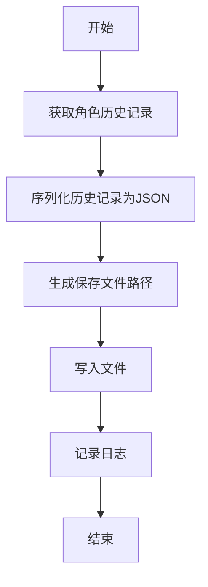

# `.\MetaGPT\examples\di\data_visualization.py` 详细设计文档

该代码是一个使用 MetaGPT 框架中 DataInterpreter 角色的异步主程序。其核心功能是接收一个自然语言需求（例如数据分析任务描述），实例化一个数据解释器角色来执行该需求，记录执行结果，并保存执行历史。

## 整体流程

```mermaid
graph TD
    A[程序启动] --> B[解析命令行/获取需求字符串]
    B --> C[实例化 DataInterpreter 角色]
    C --> D[异步调用 di.run(requirement)]
    D --> E{执行成功?}
    E -- 是 --> F[记录执行结果到日志]
    E -- 否 --> G[记录错误到日志]
    F --> H[调用 save_history 保存执行历史]
    G --> H
    H --> I[程序结束]
```

## 类结构

```
外部依赖/导入模块
├── asyncio (Python 标准库)
├── metagpt.logs.logger (MetaGPT 日志模块)
├── metagpt.roles.di.data_interpreter.DataInterpreter (数据解释器角色类)
└── metagpt.utils.recovery_util.save_history (历史保存工具函数)
```

## 全局变量及字段


### `requirement`
    
一个字符串，表示要执行的任务需求描述，例如数据分析的具体要求。

类型：`str`
    


### `DataInterpreter.requirement`
    
DataInterpreter 类中用于存储任务需求描述的字段，通常通过构造函数或 run 方法传入。

类型：`str`
    
    

## 全局函数及方法


### `main`

`main` 函数是 DataInterpreter 工具的异步入口点。它接收一个自然语言需求字符串，创建一个 DataInterpreter 角色实例来执行该需求，记录执行结果，并保存执行历史。

参数：

-  `requirement`：`str`，一个描述用户需求的自然语言字符串。例如，数据分析任务、图表生成等。此参数有默认值空字符串 `""`。

返回值：`None`，此函数没有显式返回值。

#### 流程图

```mermaid
flowchart TD
    A[开始: main(requirement)] --> B[创建 DataInterpreter 实例 di]
    B --> C[异步调用 di.run(requirement)]
    C --> D[获取执行结果 rsp]
    D --> E[使用 logger 记录结果 rsp]
    E --> F[调用 save_history 保存 di 的执行历史]
    F --> G[结束]
```

#### 带注释源码

```python
import asyncio

from metagpt.logs import logger
from metagpt.roles.di.data_interpreter import DataInterpreter
from metagpt.utils.recovery_util import save_history


async def main(requirement: str = ""):
    # 1. 实例化 DataInterpreter 角色
    di = DataInterpreter()
    
    # 2. 核心步骤：异步执行传入的需求，并等待结果
    rsp = await di.run(requirement)
    
    # 3. 使用配置好的日志器记录执行结果
    logger.info(rsp)
    
    # 4. 将 DataInterpreter 实例的执行历史保存到持久化存储中
    save_history(role=di)

# 程序的直接执行入口
if __name__ == "__main__":
    # 定义一个示例需求：对 sklearn 的 Iris 数据集进行数据分析并包含绘图
    requirement = "Run data analysis on sklearn Iris dataset, include a plot"
    # 运行异步主函数
    asyncio.run(main(requirement))
```


### `save_history`

该函数用于将指定角色的对话历史记录保存到文件中，以便后续恢复或分析。它通过序列化角色的历史消息，并将其写入到指定的文件路径中，确保数据的持久化存储。

参数：

- `role`：`Role`，需要保存历史记录的角色实例，包含对话历史等信息。

返回值：`None`，该函数没有返回值。

#### 流程图



#### 带注释源码

```python
def save_history(role: Role):
    """
    保存角色的对话历史记录到文件。

    参数:
        role (Role): 需要保存历史记录的角色实例。
    """
    # 获取角色的历史记录
    history = role.get_history()
    
    # 将历史记录序列化为JSON格式
    serialized_history = json.dumps(history, indent=4, ensure_ascii=False)
    
    # 生成保存文件的路径，通常基于角色名称和时间戳
    file_path = f"./history/{role.name}_{datetime.now().strftime('%Y%m%d_%H%M%S')}.json"
    
    # 确保保存目录存在
    os.makedirs(os.path.dirname(file_path), exist_ok=True)
    
    # 将序列化的历史记录写入文件
    with open(file_path, 'w', encoding='utf-8') as f:
        f.write(serialized_history)
    
    # 记录保存成功的日志信息
    logger.info(f"History saved to {file_path}")
```


### `DataInterpreter.run`

`DataInterpreter.run` 是 `DataInterpreter` 角色的核心执行方法。它接收一个自然语言描述的用户需求（`requirement`），通过协调内部的规划、代码生成与执行、反思等组件，以迭代的方式完成任务，并最终返回执行结果。

参数：

-  `requirement`：`str`，用户用自然语言描述的任务需求，例如“对sklearn Iris数据集进行数据分析，并包含一个图表”。

返回值：`Message`，返回一个 `Message` 对象，其中包含了任务执行的最终结果或总结信息。

#### 流程图

```mermaid
flowchart TD
    A[开始: run(requirement)] --> B[初始化消息历史<br>创建初始Message]
    B --> C{规划阶段<br>生成任务列表}
    C --> D[执行阶段循环]
    D --> E{遍历当前任务列表}
    E --> F[为当前任务生成代码]
    F --> G[执行生成的代码]
    G --> H[收集代码执行结果]
    H --> I{是否所有任务完成?}
    I -- 否 --> E
    I -- 是 --> J[反思阶段<br>评估结果并可能生成新任务]
    J --> K{是否需要新任务?}
    K -- 是 --> C
    K -- 否 --> L[组装并返回最终结果Message]
    L --> M[结束]
```

#### 带注释源码

```python
async def run(self, requirement: str) -> Message:
    """
    异步执行方法，是角色运行的入口点。
    参数:
        requirement: 用户需求字符串。
    返回:
        Message: 包含最终运行结果的Message对象。
    """
    # 初始化消息历史，将用户需求作为第一条消息
    await super().run(requirement)
    # 调用内部处理链，开始迭代处理过程
    rsp = await self._act()
    # 返回处理链产生的结果
    return rsp
```


### `DataInterpreter.run`

`DataInterpreter.run` 是 `DataInterpreter` 角色的核心执行方法。它接收一个自然语言描述的用户需求（`requirement`），通过协调内部的规划和执行机制（如 `Planner` 和 `Executor`），生成并执行一系列代码动作（`CodeAction`）来满足该需求，最终返回任务执行的结果。

参数：

-  `requirement`：`str`，用户用自然语言描述的任务需求或目标。
-  `...`：此方法可能继承或调用父类方法，包含其他参数，但根据提供的代码片段，`requirement` 是其主要的直接输入参数。

返回值：`Message`，返回一个 `Message` 对象，其中包含了任务执行的最终输出内容或总结。

#### 流程图

```mermaid
graph TD
    A[开始: 调用 run(requirement)] --> B[初始化: 创建初始 Message]
    B --> C{循环: 规划与执行}
    C --> D[调用 _think 进行规划]
    D --> E[生成 CodeAction 列表]
    E --> F[遍历每个 Action]
    F --> G[调用 _act 执行单个 Action]
    G --> H[更新上下文与状态]
    H --> I{是否所有 Action 完成?}
    I -- 否 --> F
    I -- 是 --> J[组装最终响应 Message]
    J --> K[返回 Message]
    K --> L[结束]
```

#### 带注释源码

```python
    async def run(self, requirement: str) -> Message:
        """
        运行 DataInterpreter 角色的主要方法。
        1. 根据需求初始化消息。
        2. 循环进行规划（_think）和执行（_act），直到任务完成。
        3. 返回最终的结果消息。
        
        Args:
            requirement (str): 用户的需求描述。
            
        Returns:
            Message: 包含任务执行结果的最终消息。
        """
        # 初始化：将用户需求包装成初始消息，并放入角色的消息历史中
        # 这里调用了父类 Role 的 run 方法，传入初始消息
        # 父类的 run 方法通常会触发 _think 和 _act 的循环
        return await super().run(requirement)
```

**注意**：以上源码是基于 `DataInterpreter` 作为 `Role` 子类的典型实现模式推断的。在实际的 `metagpt` 框架中，`Role.run` 方法通常会管理一个 `_think` -> `_act` 的循环。`DataInterpreter` 的 `_think` 方法可能使用 `Planner` 来将需求分解为具体的 `CodeAction`，而 `_act` 方法则使用 `Executor` 来运行这些代码并处理结果。具体的 `_think` 和 `_act` 实现细节需要查看 `DataInterpreter` 类的完整源码。


## 关键组件


### DataInterpreter

DataInterpreter 是 MetaGPT 框架中的一个核心角色类，负责接收自然语言需求，通过规划、代码生成与执行等步骤，自动完成数据分析、可视化等数据科学任务。

### 异步任务执行与事件循环

代码通过 `asyncio.run(main(requirement))` 启动异步事件循环，驱动整个 `DataInterpreter.run` 方法的异步执行流程，这是处理可能涉及长时间运行或I/O操作任务的关键机制。

### 历史记录与状态持久化

`save_history` 函数用于在 `DataInterpreter` 角色完成任务后，将其执行过程中的对话历史、代码执行结果等状态信息保存下来，便于后续的审计、调试或恢复。

### 日志记录系统

`metagpt.logs.logger` 提供了结构化的日志记录功能，用于跟踪 `DataInterpreter` 执行过程中的关键步骤、状态信息和最终结果，是监控和调试系统行为的重要工具。


## 问题及建议


### 已知问题

-   **硬编码的需求**：主函数中的需求描述 `requirement = "Run data analysis on sklearn Iris dataset, include a plot"` 是硬编码的。这使得脚本只能执行一个固定的任务，缺乏灵活性，无法在不修改源代码的情况下处理其他需求。
-   **缺乏配置和参数化**：脚本没有提供任何外部配置（如通过命令行参数、配置文件或环境变量）来定制 `DataInterpreter` 的行为或输入不同的需求。这限制了其在生产环境或不同场景下的适用性。
-   **异常处理不足**：`main` 函数和脚本入口点没有包含任何错误处理逻辑（如 `try-except` 块）。如果 `di.run()` 或 `save_history()` 过程中发生异常，程序会直接崩溃，不利于调试和稳定性。
-   **历史记录保存的潜在问题**：`save_history` 函数被调用，但其具体实现和可能产生的副作用（如文件写入失败、性能影响）未在代码中体现。如果历史记录很大或保存频繁，可能成为性能瓶颈或导致存储问题。
-   **异步上下文管理缺失**：`DataInterpreter` 实例 `di` 的创建和运行在异步函数中完成，但代码没有显示地管理其生命周期（如使用 `async with` 上下文管理器，如果该类支持的话）。这可能导致资源（如网络连接、文件句柄）未正确释放。

### 优化建议

-   **参数化输入需求**：将 `requirement` 改为通过命令行参数（如使用 `argparse` 库）或配置文件传入。这样用户可以在不修改代码的情况下指定不同的分析任务，大大提高脚本的通用性。
-   **增强配置能力**：为 `DataInterpreter` 的初始化提供可配置的选项，例如通过环境变量或配置文件来设置模型路径、API密钥、工作目录等，使脚本更易于部署和调整。
-   **添加全面的异常处理**：在 `main` 函数和 `asyncio.run` 调用周围包裹 `try-except` 块，捕获可能发生的异常（如 `RuntimeError`, `ConnectionError`, `IOError` 等），并记录详细的错误日志，确保程序优雅降级或提供明确的错误信息。
-   **评估并优化历史记录机制**：审查 `save_history` 函数的实现，考虑是否需要添加条件判断（例如，仅在调试模式或特定条件下保存）、实现异步写入以避免阻塞事件循环，或提供清理旧历史记录的策略。
-   **实现资源上下文管理**：如果 `DataInterpreter` 类涉及需要清理的资源，应实现 `__aenter__` 和 `__aexit__` 方法，并在 `main` 函数中使用 `async with` 语句来确保资源被正确初始化和释放。
-   **增加日志和监控**：在关键步骤（如需求解析、任务执行、结果保存）添加更细致的日志记录，便于跟踪执行流程和诊断问题。考虑集成应用性能监控（APM）工具以观察性能指标。
-   **编写单元测试和集成测试**：为 `main` 函数和 `DataInterpreter.run` 方法编写测试用例，覆盖正常流程、边界情况和异常场景，以确保代码的可靠性和可维护性。
-   **考虑代码结构重构**：如果此脚本是更大项目的一部分，考虑将业务逻辑（如需求处理、结果展示）与脚本入口点分离，以提高代码的可测试性和模块化程度。


## 其它


### 设计目标与约束

本代码的设计目标是提供一个简洁、可复用的异步入口点，用于启动并运行一个名为 `DataInterpreter` 的智能体（`Role`），以处理用户提出的数据分析需求。其核心约束包括：
1.  **异步执行**：整个流程必须支持异步操作，以适应可能存在的I/O密集型任务（如文件操作、网络请求）。
2.  **职责单一**：`main` 函数仅负责角色实例的创建、任务的启动、结果的记录以及运行历史的保存，不包含具体的业务逻辑。
3.  **可配置性**：通过函数参数 `requirement` 接收外部输入，使得要执行的具体任务可在调用时动态指定，提高了代码的灵活性。
4.  **可观测性**：通过日志记录任务执行结果，并通过 `save_history` 函数持久化运行历史，便于调试和审计。

### 错误处理与异常设计

当前代码的错误处理机制较为基础，主要依赖于Python和`asyncio`的默认异常传播：
1.  **隐式异常传播**：`asyncio.run(main(...))` 会将 `main` 函数及其内部 `await di.run(requirement)` 执行过程中抛出的任何未捕获异常传播到调用上下文。这可能导致整个程序因单个任务失败而崩溃。
2.  **缺乏细粒度控制**：代码没有对 `DataInterpreter.run` 方法可能抛出的特定异常（如任务解析失败、依赖缺失、权限错误等）进行捕获和处理。
3.  **日志记录不足**：仅在成功执行后记录结果 (`logger.info(rsp)`)，对于执行过程中的警告、错误或异常，没有显式的日志记录点。
4.  **历史保存的健壮性**：`save_history` 函数的调用没有放在异常处理块中。如果历史保存过程本身失败（如磁盘空间不足、文件权限问题），可能会掩盖主任务执行成功的状态，或导致异常。

### 数据流与状态机

本代码片段描述了一个简单的、线性的数据流，不涉及复杂的状态转换：
1.  **数据流**：
    *   **输入**：字符串类型的 `requirement`（用户需求描述），通过脚本硬编码或函数参数传入。
    *   **处理**：`requirement` 被传递给 `DataInterpreter` 实例的 `run` 方法。该方法内部封装了需求理解、任务规划、代码生成与执行、结果整合等复杂流程，并最终产生输出 `rsp`。
    *   **输出**：`rsp`（`DataInterpreter.run` 的返回值，通常为任务执行结果或总结），被记录到日志中。
    *   **副作用**：在流程结束时，调用 `save_history` 函数，将 `DataInterpreter` 实例（`di`）的运行历史（可能包括内部消息、执行步骤、生成代码等）持久化到存储介质（如文件）。
2.  **状态机**：代码本身不显式管理状态机。整个流程可视为一个简单的两状态模型：
    *   **初始/空闲状态**：脚本开始执行，创建 `DataInterpreter` 实例。
    *   **执行状态**：调用 `di.run(requirement)` 后，控制权移交到 `DataInterpreter` 内部，其可能维护着更复杂的状态（如对话轮次、任务列表完成情况）。本段代码不直接观测或控制这些内部状态。
    *   **结束状态**：`di.run` 返回，结果被记录，历史被保存，程序退出。没有循环或状态跳转。

### 外部依赖与接口契约

1.  **外部依赖**：
    *   **`asyncio`** (Python标准库)：提供异步运行时环境，是 `main` 函数定义为 `async` 以及使用 `asyncio.run` 的基础。
    *   **`metagpt` 包**：这是代码功能的核心依赖。
        *   `metagpt.logs.logger`：用于记录信息的日志接口。
        *   `metagpt.roles.di.data_interpreter.DataInterpreter`：核心业务逻辑类，提供了执行需求的 `run` 方法。
        *   `metagpt.utils.recovery_util.save_history`：用于数据持久化的工具函数。
2.  **接口契约**：
    *   `main(requirement: str = “”) -> None`：异步入口函数。它期望接收一个字符串参数作为需求描述。它不返回业务值，但会产生日志输出和持久化历史文件的副作用。
    *   `DataInterpreter.run(requirement)`：这是与核心组件的关键契约。调用者需传入一个字符串格式的需求，并 `await` 其执行完成。其返回值的具体类型和结构由 `DataInterpreter` 内部实现定义，调用方（此处为 `main` 函数）假设其可被 `logger.info` 处理。
    *   `save_history(role)`：该函数接受一个 `role` 参数（此处为 `DataInterpreter` 实例），并负责将其历史保存到某处。具体的保存位置、格式和实现细节对 `main` 函数是隐藏的。

### 并发与异步模型

1.  **模型**：代码明确采用了 **异步I/O (asyncio)** 并发模型。`main` 函数被定义为 `async`，并使用 `asyncio.run()` 作为入口点，这适合处理I/O密集型操作，能够在等待外部资源（如文件读写、网络响应）时释放控制权，提高单线程下的程序效率。
2.  **并发粒度**：在当前代码片段中，并发单元是整个 `DataInterpreter.run(requirement)` 任务。代码没有展示在 `DataInterpreter` 内部是否使用了更细粒度的并发（例如，并行执行多个子任务）。因此，从本段代码的视角，它启动了一个顶层的异步任务。
3.  **资源管理**：代码没有显式管理异步任务的生命周期或资源（如创建多个任务并等待它们）。它只是启动了一个主任务并等待其完成。`asyncio.run()` 会自动管理事件循环的创建和清理。

### 配置与环境管理

当前代码在配置和环境管理方面非常直接，几乎没有动态配置：
1.  **硬编码配置**：用户需求 (`requirement`) 在 `if __name__ == “__main__”:` 块中被硬编码为 `”Run data analysis on sklearn Iris dataset, include a plot”`。在生产或更灵活的使用场景中，这通常需要改为从配置文件、环境变量或命令行参数读取。
2.  **环境依赖**：代码的运行依赖于 `metagpt` 包及其子模块的正确安装和配置。`DataInterpreter` 和 `save_history` 的具体行为可能由 `metagpt` 包内部的全局配置或环境变量控制（例如，模型API密钥、工作目录、日志级别等），但这些细节在本段代码中并未体现。
3.  **缺乏配置入口**：`main` 函数本身没有提供用于传递配置（如 `DataInterpreter` 的初始化参数、日志设置、历史保存路径）的机制。所有配置都隐含在 `metagpt` 包的默认设置或 `DataInterpreter` 的默认构造函数中。

### 安全与权限考量

代码片段本身没有直接处理敏感操作，但作为框架的入口点，需要考虑其调用的组件可能涉及的安全问题：
1.  **输入验证**：`main` 函数直接将从外部获取的 `requirement` 字符串传递给 `DataInterpreter.run()`。`DataInterpreter` 内部可能涉及代码生成与执行（如生成Python代码并运行），因此**必须**在 `DataInterpreter` 内部对 `requirement` 进行严格的验证、净化和沙箱化处理，以防止代码注入攻击。
2.  **资源访问**：`DataInterpreter` 执行的任务可能会读写文件系统、访问网络资源。本入口点代码没有对这类操作的权限进行任何约束或沙箱限制。这依赖于 `DataInterpreter` 实现或底层运行环境的安全策略。
3.  **凭据管理**：如果 `DataInterpreter` 需要访问外部API（如大模型服务），相关的凭据（API Keys）的管理不在本段代码范围内。这通常由 `metagpt` 的配置系统或环境变量处理。
4.  **历史数据安全**：`save_history` 函数保存的运行历史可能包含生成的代码、中间数据甚至潜在的敏感信息。代码没有体现历史文件的加密、访问控制或清理策略。

### 测试策略建议

1.  **单元测试**：
    *   **`main` 函数**：模拟（Mock）`DataInterpreter` 和 `save_history`，测试在给定 `requirement` 输入时，是否正确调用了 `di.run()` 和 `save_history()`，并验证日志调用。同时测试异常路径（如 `di.run()` 抛出异常）。
2.  **集成测试**：
    *   使用真实的 `DataInterpreter` 实例，提供一系列有代表性的 `requirement` 字符串，验证整个流程是否能从输入到成功输出结果并保存历史。重点测试与外部依赖（如 `metagpt` 包内部模块）的集成。
3.  **端到端 (E2E) 测试**：
    *   将本脚本作为一个完整的可执行单元，从命令行启动，输入需求，验证最终输出（日志）和生成的副产品（历史文件）是否符合预期。
4.  **异步测试**：确保测试框架支持异步测试（如使用 `pytest-asyncio`），以正确测试 `main` 函数的异步行为。
5.  **输入验证测试**：虽然验证主要在 `DataInterpreter` 内部，但可以设计测试用例，向 `main` 函数传入边界或恶意格式的 `requirement`，观察系统的整体反应（是否崩溃、是否有适当的错误信息）。

### 部署与运维考量

1.  **打包与依赖**：代码依赖于 `metagpt` 包。部署时需要确保该包及其所有依赖项被正确安装。建议使用 `requirements.txt` 或 `pyproject.toml` 固定版本。
2.  **执行方式**：代码提供了 `if __name__ == “__main__”:` 保护，使其可作为脚本直接运行 (`python script.py`)。也可以作为模块函数被其他Python代码导入和调用。
3.  **日志与监控**：目前仅使用 `logger.info` 记录最终结果。在生产环境中，需要配置更全面的日志系统（如不同级别、输出到文件/集中式日志服务），并可能添加性能指标（如任务执行时间）的收集和上报。
4.  **历史数据管理**：`save_history` 函数持久化的数据需要制定管理策略：存储路径、文件轮转、归档、清理周期以及可能的备份方案。
5.  **资源隔离**：如果此程序用于执行用户提交的、可能生成代码的任务，在运维部署时，应考虑在容器（如Docker）或具有严格权限控制的独立环境中运行，以实现资源隔离和安全性控制。
6.  **可伸缩性**：当前是单次执行模式。如果需求是处理大量并发任务，则需要重构入口点，例如将其包装为Web服务、消息队列的消费者，并管理多个 `DataInterpreter` 实例的并发执行。


    