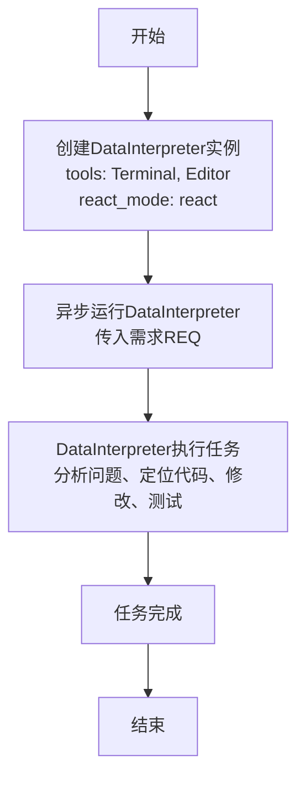
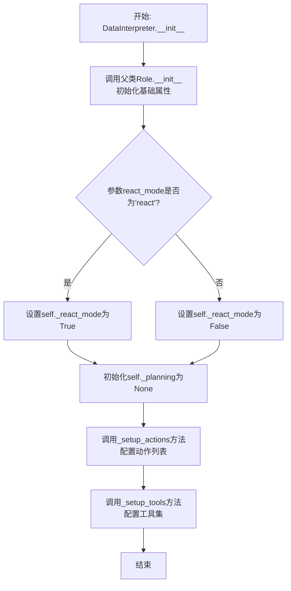
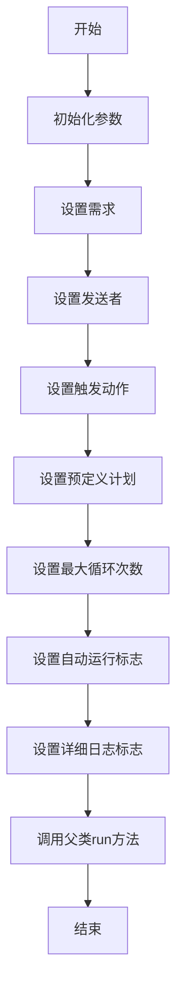

# `.\MetaGPT\examples\di\fix_github_issue.py` 详细设计文档

该代码是一个演示DataInterpreter（数据解释器）能力的示例，它模拟了一个来自MetaGPT项目的真实bug修复场景。核心功能是：创建一个DataInterpreter角色实例，并让其异步执行一个需求（REQ），该需求要求DataInterpreter理解并修复一个名为`extract_state_value_from_output`的函数在处理输入`"-1"`时返回`1`的bug，该bug会导致react模式下的无限循环。修复过程包括使用提供的工具（终端和编辑器）定位、理解、修改代码，并编写测试文件进行验证。

## 整体流程

```mermaid
graph TD
    A[开始: 运行主程序] --> B[创建DataInterpreter实例]
    B --> C[异步调用di.run(REQ)]
    C --> D{DataInterpreter内部流程}
    D --> E[解析需求REQ]
    E --> F[使用Editor工具搜索并理解extract_state_value_from_output函数]
    F --> G[修改相关代码以修复bug]
    G --> H[使用Editor编写测试文件test.py]
    H --> I[使用Terminal运行test.py验证修复]
    I --> J{测试通过?}
    J -- 是 --> K[任务完成]
    J -- 否 --> F
    K --> L[结束]
```

## 类结构

```
代码结构
├── 全局导入 (import asyncio, from metagpt.roles.di.data_interpreter import DataInterpreter)
├── 全局常量 (REQ: str)
└── 全局函数 (main: async def, __main__ 入口)
```

## 全局变量及字段


### `REQ`
    
一个包含需求描述的字符串，用于指导DataInterpreter修复MetaGPT项目中extract_state_value_from_output函数的bug。

类型：`str`
    


    

## 全局函数及方法


### `main`

这是一个异步主函数，它创建了一个配置了特定工具的 `DataInterpreter` 实例，并运行一个修复代码缺陷的需求任务。

参数：
-  `无`：此函数不接受任何显式参数。

返回值：`None`，此函数不返回任何值。

#### 流程图



#### 带注释源码

```python
async def main():
    # 1. 实例化DataInterpreter角色
    #    配置其可用的工具为“Terminal”（终端）和“Editor”（代码编辑器）
    #    设置其推理模式为“react”（一种特定的问题解决模式）
    di = DataInterpreter(tools=["Terminal", "Editor"], react_mode="react")
    
    # 2. 异步运行DataInterpreter的`run`方法
    #    传入一个预定义的需求字符串`REQ`，该需求描述了一个需要修复的代码缺陷
    #    DataInterpreter将根据此需求，利用配置的工具进行代码分析、定位、修改和测试
    await di.run(REQ)
```


### `DataInterpreter.__init__`

DataInterpreter 类的构造函数，用于初始化一个 DataInterpreter 实例。它负责设置智能体的核心属性，包括其名称、配置文件、语言模型、记忆系统、动作列表、反应模式以及可用的工具集。

参数：

-  `name`：`str`，智能体的名称，默认为 "DataInterpreter"。
-  `profile`：`str`，智能体的配置文件或描述，默认为 "DataInterpreter"。
-  `goal`：`str`，智能体的目标描述，默认为空字符串。
-  `constraints`：`str`，智能体的行为约束描述，默认为空字符串。
-  `desc`：`str`，智能体的详细描述，默认为空字符串。
-  `llm`：`BaseLLM`，智能体使用的语言模型实例。如果为 None，则使用默认配置创建。
-  `is_human`：`bool`，指示智能体是否为人类用户，默认为 False。
-  `code_engine`：`CodeEngine`，智能体使用的代码引擎实例。如果为 None，则使用默认配置创建。
-  `memory`：`Memory`，智能体的记忆系统实例。如果为 None，则创建一个新的 Memory 实例。
-  `actions`：`list[Action]`，智能体可执行的动作列表。如果为 None，则创建一个包含 WriteAnalysis、WriteCode、RunCode 动作的列表。
-  `react_mode`：`str`，智能体的反应模式，例如 "plan" 或 "react"。默认为 "plan"。
-  `auto_run`：`bool`，指示智能体是否自动运行，默认为 True。
-  `tools`：`list[str]`，智能体可用的工具名称列表，例如 ["Terminal", "Editor"]。默认为空列表。
-  `tool_selector`：`ToolSelector`，工具选择器实例。如果为 None，则根据 `tools` 参数创建一个新的 ToolSelector。
-  `**kwargs`：`Any`，其他传递给父类 Role 构造函数的任意关键字参数。

返回值：`None`，构造函数不返回任何值。

#### 流程图



#### 带注释源码

```python
def __init__(
    self,
    name: str = "DataInterpreter",
    profile: str = "DataInterpreter",
    goal: str = "",
    constraints: str = "",
    desc: str = "",
    llm: BaseLLM = None,
    is_human: bool = False,
    code_engine: CodeEngine = None,
    memory: Memory = None,
    actions: list[Action] = None,
    react_mode: str = "plan",
    auto_run: bool = True,
    tools: list[str] = None,
    tool_selector: ToolSelector = None,
    **kwargs,
):
    """
    初始化 DataInterpreter 实例。
    Args:
        name (str): 智能体名称。
        profile (str): 智能体配置文件。
        goal (str): 智能体目标。
        constraints (str): 智能体约束。
        desc (str): 智能体描述。
        llm (BaseLLM): 语言模型实例。
        is_human (bool): 是否为人类用户。
        code_engine (CodeEngine): 代码引擎实例。
        memory (Memory): 记忆系统实例。
        actions (list[Action]): 动作列表。
        react_mode (str): 反应模式 ('plan' 或 'react')。
        auto_run (bool): 是否自动运行。
        tools (list[str]): 可用工具名称列表。
        tool_selector (ToolSelector): 工具选择器实例。
        **kwargs: 其他关键字参数。
    """
    # 调用父类 Role 的构造函数，初始化基础角色属性
    super().__init__(
        name=name,
        profile=profile,
        goal=goal,
        constraints=constraints,
        desc=desc,
        llm=llm,
        is_human=is_human,
        memory=memory,
        code_engine=code_engine,
        **kwargs,
    )
    # 根据 react_mode 参数设置内部反应模式标志
    self._react_mode = react_mode == "react"
    # 初始化规划器为 None，后续可能根据模式进行设置
    self._planning = None
    # 设置是否自动运行的标志
    self._auto_run = auto_run
    # 初始化工具列表
    self._tools = tools or []
    # 存储工具选择器实例
    self._tool_selector = tool_selector

    # 设置智能体的动作列表
    self._setup_actions(actions)
    # 根据提供的工具名称列表设置具体的工具实例
    self._setup_tools(tools)
```


### `DataInterpreter.run`

该方法用于执行DataInterpreter角色的主要工作流程，处理给定的需求（REQ），通过调用工具（如Terminal和Editor）来分析和解决问题，最终完成任务。

参数：

- `requirements`：`str`，描述需要解决的问题或任务的需求文本。
- `sender`：`Union[str, Role]`，发送请求的角色或标识符，默认为空字符串。
- `cause_by`：`Type[Action]`，触发此运行的动作类型，默认为`UserRequirement`。
- `predefined_plan`：`List[Plan]`，预定义的计划列表，默认为空列表。
- `max_react_loop`：`int`，最大反应循环次数，默认为100。
- `auto_run`：`bool`，是否自动运行，默认为True。
- `verbose`：`bool`，是否输出详细日志，默认为False。

返回值：`None`，无返回值。

#### 流程图



#### 带注释源码

```python
async def run(
    self,
    requirements: str,
    sender: Union[str, Role] = "",
    cause_by: Type[Action] = UserRequirement,
    predefined_plan: List[Plan] = [],
    max_react_loop: int = 100,
    auto_run: bool = True,
    verbose: bool = False,
):
    """
    执行DataInterpreter的主要工作流程。
    
    参数:
        requirements (str): 需求文本。
        sender (Union[str, Role]): 发送请求的角色或标识符。
        cause_by (Type[Action]): 触发此运行的动作类型。
        predefined_plan (List[Plan]): 预定义的计划列表。
        max_react_loop (int): 最大反应循环次数。
        auto_run (bool): 是否自动运行。
        verbose (bool): 是否输出详细日志。
    """
    # 调用父类的run方法，传递所有参数
    await super().run(
        requirements,
        sender,
        cause_by,
        predefined_plan,
        max_react_loop,
        auto_run,
        verbose,
    )
```

## 关键组件


### DataInterpreter

DataInterpreter 是 MetaGPT 框架中的一个核心角色，负责通过结合代码编辑、终端执行等工具来理解和执行用户需求，特别是针对代码修复和调试任务。

### 异步任务执行框架

代码通过 `asyncio.run(main())` 启动一个异步事件循环，驱动 `DataInterpreter` 实例运行，这构成了处理长时间运行、可能涉及多步工具调用的交互式任务的基础执行模型。

### 工具集成系统

`DataInterpreter` 在初始化时集成了 `Editor`（代码编辑器）和 `Terminal`（终端）等工具，使其能够执行读取、修改源代码以及运行测试脚本等关键操作，以完成代码修复工作流。

### 需求解析与任务分解

`DataInterpreter` 接收包含问题描述（Issue）和操作指令（如“搜索函数”、“修改代码”、“编写测试”）的格式化需求（`REQ`），并将其分解为一系列可执行的原子步骤，指导工具调用的顺序和逻辑。

### 测试驱动修复流程

解决方案明确要求编写独立的测试文件（`test.py`）来验证修复效果，这体现了测试驱动开发（TDD）或至少是验证驱动的修复模式，确保代码修改的正确性。


## 问题及建议


### 已知问题

-   **代码示例本身不包含可执行的修复逻辑**：提供的代码是一个用于启动 `DataInterpreter` 来修复另一个文件中 `extract_state_value_from_output` 函数的测试脚本。它本身不包含任何业务逻辑或待修复的函数实现，因此无法直接分析 `extract_state_value_from_output` 函数的具体问题（如将字符串 `"-1"` 错误地处理为 `1` 的逻辑缺陷）。
-   **依赖外部手动修改**：脚本运行的前提是需要用户手动将已知的 Bug 代码添加回本地的 `metagpt/utils/repair_llm_raw_output.py` 文件中。这增加了测试的复杂性和出错概率，不是一个自包含的、可复现的测试用例。
-   **`react_mode` 参数使用不当**：在创建 `DataInterpreter` 实例时，传递了 `react_mode="react"`。根据问题描述，正是 `react` 模式下的 `extract_state_value_from_output` 函数缺陷导致了无限循环。在旨在修复此问题的测试脚本中，使用可能导致问题的模式来驱动修复过程，存在逻辑矛盾，可能干扰修复代理的正确行为或测试。
-   **缺乏错误处理与验证**：主函数 `main` 和脚本入口直接运行 `di.run(REQ)`，没有对 `DataInterpreter` 执行过程中可能出现的异常（如工具执行失败、代码修改错误等）进行捕获和处理，也没有对最终的修复结果进行自动化断言验证，仅依赖人工观察终端输出。

### 优化建议

-   **重构为自包含的测试用例**：将待修复的 `extract_state_value_from_output` 函数的错误版本直接内嵌在测试脚本中（例如，作为一个模拟的模块或函数），而不是依赖外部文件的手动修改。这样可以使测试环境完全独立、可复现，便于CI/CD集成。
-   **明确修复与测试的上下文**：在启动 `DataInterpreter` 时，应使用一个不会触发待修复Bug的模式（例如 `react_mode` 设为其他值或默认值），或者确保 `DataInterpreter` 的内部机制在分析阶段不会受到该Bug的影响。更好的做法是，在需求描述 `REQ` 中更清晰地隔离“分析问题”和“应用修复”的上下文。
-   **增强健壮性与验证**：
    -   在 `main` 函数中添加 `try-except` 块，捕获并记录 `asyncio.run` 或 `di.run` 可能抛出的异常。
    -   在 `DataInterpreter` 执行完成后，添加自动化验证步骤。例如，可以编写一个小的验证脚本，导入修复后的函数，使用断言（`assert`）检查 `extract_state_value_from_output("-1")` 的返回值是否符合预期（例如应该是 `-1` 或引发特定异常，而不是 `1`），并自动运行该验证脚本。
-   **改进需求描述（REQ）的清晰度**：`REQ` 中的指令“Don't write all codes in one response, each time, just write code for one step.”是针对 `DataInterpreter` 的交互式工作流的，但对于静态分析而言，可以补充更明确的目标：例如“最终必须生成一个通过所有测试用例的修复版本，并确保 `extract_state_value_from_output("-1")` 返回 `-1`”。
-   **考虑模拟工具交互**：对于单元测试或更快速的验证，可以考虑模拟（Mock）`Editor` 和 `Terminal` 工具的行为，而不是实际执行文件编辑和系统命令，从而提高测试速度与可靠性。


## 其它


### 设计目标与约束

本代码的核心设计目标是演示 DataInterpreter 角色在给定具体需求（修复一个已知的 GitHub Issue）下的自动化问题解决能力。主要约束包括：1) 必须使用 `Terminal` 和 `Editor` 工具进行操作；2) 必须遵循 `react` 模式进行交互式问题解决；3) 修复过程需分步进行，不能一次性输出所有代码；4) 最终需要通过编写并运行测试文件来验证修复的有效性。

### 错误处理与异常设计

代码本身作为演示入口，未包含复杂的业务逻辑错误处理。其错误处理主要依赖于：1) `asyncio.run()` 对异步主函数 `main()` 的封装，会捕获并传播 `main()` 函数中未处理的异常。2) `DataInterpreter` 类内部应实现其工具调用（`Terminal`, `Editor`）和 `react` 模式执行过程中的异常处理机制，例如命令执行失败、文件读写错误、LLM响应解析错误等，确保单个步骤的失败不会导致整个进程崩溃，并能通过 `react` 模式进行反馈和调整。本示例未展示这些内部细节。

### 数据流与状态机

1.  **初始化流**: 脚本启动 -> 解析 `REQ` 需求字符串 -> 实例化 `DataInterpreter` (配置工具和模式) -> 进入异步主循环。
2.  **任务执行流 (DataInterpreter.run)**: 这是一个基于 `react` 模式的状态机循环。
    *   **状态**: 等待指令、分析需求、规划步骤、执行工具（编辑/终端命令）、评估结果、判断任务完成。
    *   **数据流**: 用户需求 (`REQ`) 作为初始输入 -> `DataInterpreter` 内部 LLM 分析生成动作规划 -> 调用 `Editor` 修改代码或 `Terminal` 运行测试 -> 获取工具执行结果（代码变更、测试输出）-> 结果作为新上下文反馈给 LLM -> LLM 判断下一步动作，循环直至任务完成或达到终止条件。
    *   **输出**: 最终的代码修改和验证通过的测试结果。

### 外部依赖与接口契约

1.  **MetaGPT 框架**: 核心依赖，提供了 `DataInterpreter` 角色类以及 `Terminal`, `Editor` 等工具的实现。
2.  **`metagpt.roles.di.data_interpreter.DataInterpreter` 类**: 主要外部接口。其 `__init__` 方法契约要求传入 `tools` 列表和 `react_mode` 参数。`run` 方法契约为异步方法，接受任务描述字符串，并执行自动化问题解决流程。
3.  **`asyncio` 库**: 用于支持异步执行，是运行 `DataInterpreter` 异步方法的必要依赖。
4.  **底层 LLM 服务**: `DataInterpreter` 内部依赖的 LLM（通过 MetaGPT 配置），是其分析和规划能力的核心外部服务，需保证其可用性和响应格式符合预期。
5.  **系统环境**: `Terminal` 工具的执行依赖于宿主机的 Shell 环境和 Python 解释器。`Editor` 工具依赖于文件系统的读写权限。

### 安全与权限考虑

1.  **代码修改权限**: `Editor` 工具将直接修改项目源代码文件，需确保运行脚本的用户对目标文件有写权限，且修改范围受控，避免意外损坏其他文件。
2.  **命令执行权限**: `Terminal` 工具将执行任意生成的 Shell 或 Python 命令，存在安全风险（如 `rm -rf`, 访问敏感数据）。在真实生产或敏感环境中使用，必须对可执行的命令进行严格沙箱化或白名单过滤。本示例为演示，隐含了在受控环境运行的假设。
3.  **依赖安装**: 如果修复过程涉及 `pip install`，可能需要管理员权限，并可能影响系统级或用户级的 Python 环境。
4.  **信息泄露**: 运行过程中，代码上下文、错误信息可能被发送至外部 LLM 服务，需注意是否包含敏感信息。

### 部署与运行配置

1.  **环境准备**: 需要预先安装 MetaGPT 及其所有依赖。需要手动复现 Issue 中描述的 Bug（即修改 `metagpt/utils/repair_llm_raw_output.py` 文件）。
2.  **运行方式**: 通过命令行执行 `python <本脚本文件名>.py`。
3.  **配置点**: `DataInterpreter` 的初始化参数（如 `tools`, `react_mode`）是主要的运行配置。更深层的配置（如 LLM API Key、模型选择、超参数）通过 MetaGPT 的全局配置机制管理。
4.  **资源需求**: 取决于 LLM 调用频率和复杂度，需要可用的网络连接以访问 LLM API，以及足够的本地计算资源处理中间结果。

### 测试策略

1.  **集成测试 (本脚本)**: 本脚本本身是一个端到端的集成测试用例。它验证了 `DataInterpreter` 在接收到一个具体问题描述后，能否通过一系列自动化操作成功修复 Bug。
2.  **验证方式**: 成功的标准是 `DataInterpreter` 在运行过程中，通过 `Editor` 正确修复了目标函数，并通过 `Terminal` 运行自建的 `test.py` 后，测试用例通过（即函数行为符合预期，修复了 `-1` 被错误转换的问题）。
3.  **测试覆盖局限性**: 本演示仅针对特定 Issue。`DataInterpreter` 自身的健壮性、对不同类型问题的泛化能力、工具调用的可靠性等，需要更全面的测试套件进行覆盖。

    