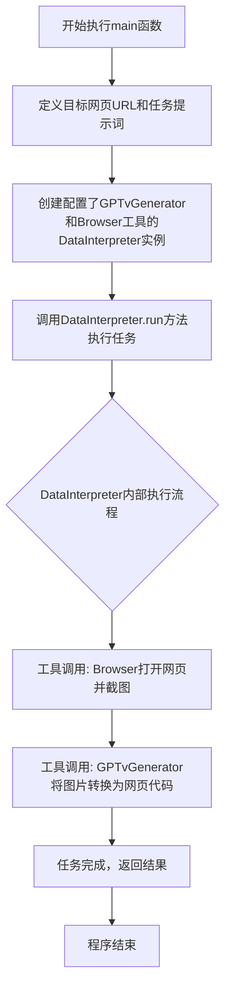
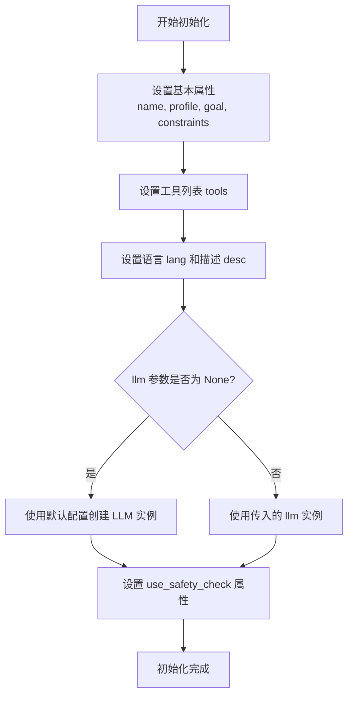

# `.\MetaGPT\examples\di\imitate_webpage.py` 详细设计文档

该代码是一个使用DataInterpreter角色的异步脚本，其核心功能是：给定一个网页URL（例如https://pytorch.org/），通过调用配置了特定工具（GPTvGenerator和Browser）的DataInterpreter，执行一个包含两个步骤的指令：1. 打开该网页并截图；2. 将截图转换成一个包含HTML、CSS和JavaScript的完整网页。

## 整体流程



## 类结构

```
外部依赖/导入模块
├── asyncio (Python标准库)
└── metagpt.roles.di.data_interpreter
    └── DataInterpreter (核心角色类)
用户定义部分
├── main (异步入口函数)
└── __main__ 代码块 (程序执行入口)
```

## 全局变量及字段


### `web_url`
    
目标网页的URL地址，用于指定要模仿的网页

类型：`str`
    


### `prompt`
    
给DataInterpreter的指令，描述了从截图到生成网页的完整任务流程

类型：`str`
    


### `di`
    
DataInterpreter角色实例，配置了GPTvGenerator和Browser工具，用于执行网页模仿任务

类型：`DataInterpreter`
    


    

## 全局函数及方法


### `main`

该函数是程序的异步入口点，其核心功能是创建一个`DataInterpreter`角色实例，并驱动它根据给定的提示词（`prompt`）执行任务。提示词要求`DataInterpreter`访问指定的网页（PyTorch官网），先截图，然后将截图转换成一个包含HTML、CSS和JavaScript的完整网页。

参数：
- 无显式参数。

返回值：`None`，该函数不返回任何值。

#### 流程图

```mermaid
flowchart TD
    A[开始: main函数] --> B[定义目标网页URL和任务提示词prompt]
    B --> C[创建DataInterpreter实例<br>配置工具: GPTvGenerator, Browser]
    C --> D[异步调用di.run(prompt)<br>执行任务]
    D --> E[任务执行完毕]
    E --> F[结束]
```

#### 带注释源码

```python
#!/usr/bin/env python
# -*- coding: utf-8 -*-
"""
@Time    : 2024/01/15
@Author  : mannaandpoem
@File    : imitate_webpage.py
"""
from metagpt.roles.di.data_interpreter import DataInterpreter


async def main():
    # 定义目标网页的URL
    web_url = "https://pytorch.org/"
    # 构造任务提示词，明确指定两个步骤：1. 打开网页并截图 2. 将图片转换为网页
    prompt = f"""This is a URL of webpage: '{web_url}' .
Firstly, open the page and take a screenshot of the page. 
Secondly, convert the image to a webpage including HTML, CSS and JS in one go.
Note: All required dependencies and environments have been fully installed and configured."""
    # 实例化DataInterpreter角色，并为其配置执行任务所需的工具
    # `GPTvGenerator` 可能用于生成代码或内容，`Browser` 用于网页交互和截图
    di = DataInterpreter(tools=["GPTvGenerator", "Browser"])

    # 异步执行任务，将提示词传递给DataInterpreter
    await di.run(prompt)


if __name__ == "__main__":
    import asyncio
    # 程序入口：运行异步主函数
    asyncio.run(main())
```


### `DataInterpreter.__init__`

该方法用于初始化 `DataInterpreter` 类的实例，设置其核心属性，包括角色名称、描述、使用的工具列表、语言模型配置以及是否在代码执行时使用安全模式。

参数：

- `self`：`DataInterpreter`，`DataInterpreter` 类的实例
- `name`：`str`，角色的名称，默认为 "David"
- `profile`：`str`，角色的描述，默认为 "Data Interpreter"
- `goal`：`str`，角色的目标，默认为 "To interpret data and code"
- `constraints`：`str`，角色的约束条件，默认为 "Ensure the code and results are correct and accurate"
- `tools`：`list[str]`，角色可使用的工具名称列表，默认为空列表
- `lang`：`str`，角色使用的语言，默认为 "en"
- `desc`：`str`，角色的详细描述，默认为空字符串
- `llm`：`BaseLLM`，语言模型实例，默认为 `None`，若未提供则使用默认配置
- `use_safety_check`：`bool`，是否在代码执行时使用安全模式，默认为 `True`

返回值：`None`，无返回值

#### 流程图



#### 带注释源码

```python
def __init__(
    self,
    name: str = "David",
    profile: str = "Data Interpreter",
    goal: str = "To interpret data and code",
    constraints: str = "Ensure the code and results are correct and accurate",
    tools: list[str] = [],
    lang: str = "en",
    desc: str = "",
    llm: BaseLLM = None,
    use_safety_check: bool = True,
):
    """
    初始化 DataInterpreter 实例。
    设置角色的基本属性、工具、语言模型以及安全模式选项。
    """
    # 调用父类 Role 的初始化方法，传入基本角色属性
    super().__init__(name, profile, goal, constraints)
    # 设置角色可使用的工具列表
    self._tools = tools
    # 设置角色使用的语言
    self._lang = lang
    # 设置角色的详细描述
    self._desc = desc
    # 如果未提供语言模型实例，则使用默认配置创建一个
    self._llm = llm or LLM()
    # 设置是否在代码执行时启用安全模式
    self.use_safety_check = use_safety_check
```

### `DataInterpreter.run`

该方法是一个异步方法，是DataInterpreter角色的核心执行入口。它接收一个自然语言指令（`prompt`），通过调用内部的大语言模型（LLM）来解析指令、规划任务、生成并执行相应的代码（利用其配置的工具集），最终完成任务目标。其核心流程是“思考-行动-观察”的循环，直到任务完成或达到停止条件。

参数：

-  `message`：`str`，用户输入的自然语言指令或任务描述，用于驱动DataInterpreter执行任务。

返回值：`None`，此方法为异步执行方法，不直接返回结果，执行过程中的输出（如代码执行结果、最终生成的文件等）会通过控制台打印或写入文件系统。

#### 流程图

```mermaid
graph TD
    A[开始: run(message)] --> B[初始化消息历史<br/>将用户消息加入历史]
    B --> C{循环条件: <br/>未达到停止条件?}
    C -- 是 --> D[调用_think方法<br/>分析历史，生成下一步Action]
    D --> E{Action类型?}
    E -- Message --> F[调用_act方法<br/>将Message加入历史]
    F --> C
    E -- Action/Code<br/>ToolCall --> G[调用_act方法<br/>执行代码/调用工具]
    G --> H[获取执行结果Observation]
    H --> I[调用_observe方法<br/>将Observation加入历史]
    I --> C
    C -- 否 --> J[结束循环]
    J --> K[返回None]
```

#### 带注释源码

```python
async def run(self, message: str):
    """
    异步运行DataInterpreter的核心方法。
    处理用户输入的消息，通过LLM进行任务分解、代码生成和执行，循环直到任务完成。

    Args:
        message (str): 用户输入的任务描述或指令。
    """
    # 初始化或重置消息历史，将用户的初始指令作为第一条消息加入历史记录。
    await self.reset()
    await self._observe(message)

    # 进入主循环，持续进行“思考-行动-观察”直到满足停止条件（如任务完成、出错、达到最大步数）。
    while not self._is_stopped():
        # 思考阶段：基于当前消息历史，让LLM分析并决定下一步要做什么（回复消息、运行代码、调用工具）。
        rsp = await self._think()
        # 行动阶段：执行思考阶段决定的动作。这可能包括生成代码、调用工具或直接回复。
        result = await self._act(rsp)
        if result:
            # 观察阶段：将行动产生的结果（如代码执行输出、工具调用结果）作为新的观察信息加入历史。
            await self._observe(result)
    # 循环结束，方法返回None。
    return None
```

## 关键组件


### DataInterpreter

一个用于执行数据解释任务的角色类，它封装了与特定工具（如GPTvGenerator和Browser）交互的逻辑，以处理用户提供的自然语言指令（prompt），并协调工具完成网页截图与转换等任务。

### GPTvGenerator

一个工具组件，推测其功能是基于给定的输入（如图像）生成相应的网页代码（HTML, CSS, JS），实现从视觉内容到可执行前端代码的转换。

### Browser

一个工具组件，用于模拟或控制浏览器行为，核心功能包括打开指定的网页URL并捕获其屏幕截图。


## 问题及建议


### 已知问题

-   **工具选择硬编码**：`DataInterpreter` 实例化时，工具列表 `["GPTvGenerator", "Browser"]` 被硬编码在代码中。这降低了代码的灵活性和可配置性，若需更换或增减工具，必须修改源代码。
-   **URL与提示词硬编码**：目标网页URL (`web_url`) 和任务提示词 (`prompt`) 直接写在 `main` 函数内部。这使得脚本难以复用，每次针对不同网页或任务都需要修改代码。
-   **缺乏错误处理与日志记录**：代码中没有对 `di.run(prompt)` 可能抛出的异常（如网络错误、工具执行失败、OpenAI API调用异常等）进行捕获和处理。同时，缺乏运行日志，不利于调试和监控任务执行状态。
-   **依赖特定环境假设**：提示词中声明“All required dependencies and environments have been fully installed and configured”，但脚本本身并未验证此假设。如果环境未正确配置，运行时将失败，且错误信息可能不直观。
-   **单次执行模式**：脚本设计为单次执行，处理一个固定的URL。无法以批处理或交互式模式运行，限制了其应用场景。

### 优化建议

-   **参数化配置**：将工具列表、目标URL、任务提示词模板等作为命令行参数或配置文件（如YAML、JSON）的输入。这能提升脚本的灵活性和可重用性。
-   **增强健壮性**：
    -   在 `main` 函数或 `di.run` 调用周围添加 `try...except` 块，捕获并处理可能出现的异常，提供清晰的错误信息。
    -   集成日志库（如Python内置的`logging`），在关键步骤（如开始任务、调用工具、完成任务、发生错误）输出不同级别的日志。
-   **环境预检**：在任务开始前，添加一个环境检查步骤，验证关键依赖（如浏览器驱动、必要的Python包）是否可用，并给出明确的指引。
-   **扩展功能模式**：
    -   支持从文件读取URL列表进行批处理。
    -   设计交互模式，允许用户输入URL或选择预设任务。
-   **代码结构优化**：考虑将核心执行逻辑封装到一个独立的函数或类中，使 `main` 函数仅负责参数解析和流程调度，提高代码的可测试性和模块化程度。


## 其它


### 设计目标与约束

本代码的设计目标是利用DataInterpreter角色，通过自然语言指令驱动自动化工具，完成从指定网页URL截图到生成模拟网页代码（HTML、CSS、JS）的端到端流程。核心约束包括：1) 依赖外部工具（GPTvGenerator, Browser）的具体实现与可用性；2) 执行环境需预先配置好所有必要的依赖；3) 流程为异步执行，要求运行在支持asyncio的环境中。

### 错误处理与异常设计

当前代码未显式包含错误处理逻辑。潜在的异常点包括：1) `DataInterpreter`初始化时，若指定的工具名称无效或工具实例化失败；2) `di.run(prompt)`执行过程中，工具调用失败（如网络请求超时、GPT生成错误、浏览器操作异常等）；3) 异步事件循环管理异常。改进方向是增加try-except块来捕获`Exception`或更具体的异常（如`asyncio.TimeoutError`），并记录或输出有意义的错误信息，确保程序不会因单点故障而静默崩溃。

### 数据流与状态机

数据流始于硬编码的`web_url`和据此构建的`prompt`字符串。`prompt`作为输入传递给`DataInterpreter`实例的`run`方法。`DataInterpreter`内部解析指令，按顺序调用两个工具：1) `Browser`工具：接收URL，输出网页截图（图像数据）；2) `GPTvGenerator`工具：接收图像数据，输出合成的网页代码（HTML、CSS、JS）。该流程构成一个简单的线性状态机：`初始` -> `执行Browser工具` -> `执行GPTvGenerator工具` -> `完成`。状态转换由DataInterpreter内部逻辑驱动，当前代码未暴露中间状态。

### 外部依赖与接口契约

1.  **`metagpt.roles.di.data_interpreter.DataInterpreter` 类**：核心外部依赖。契约要求其`__init__`方法接受`tools`参数（工具名称列表），`run`方法为异步方法，接受字符串指令并执行。
2.  **工具`"Browser"`**：契约要求该工具能根据URL打开网页并生成截图（图像数据），具体接口由DataInterpreter定义和调用。
3.  **工具`"GPTvGenerator"`**：契约要求该工具能根据输入的图像数据，生成对应的网页前端代码，具体接口由DataInterpreter定义和调用。
4.  **`asyncio` 模块**：Python标准库，用于运行异步主函数`main()`。
代码的成功执行强依赖于这些外部组件的正确实现、可用性及它们之间的协作契约。

### 安全与合规考虑

1.  **网页访问**：访问外部URL (`https://pytorch.org/`) 可能涉及网络策略限制、内容合规性审查。代码未处理访问权限或内容过滤。
2.  **内容生成**：使用`GPTvGenerator`生成代码，需考虑生成内容的版权、合规性及潜在的安全漏洞（如生成的JS代码可能不安全）。
3.  **资源消耗**：自动化浏览器操作和大型模型调用可能消耗大量计算资源与时间，代码未设置超时或资源限制。
4.  **数据隐私**：如果处理的URL包含敏感信息，截图和生成的代码可能造成数据泄露。当前代码未包含数据清理或隐私保护机制。

    