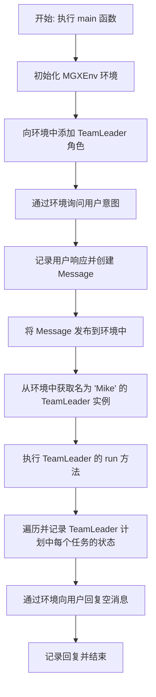
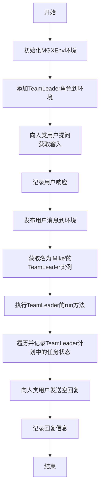
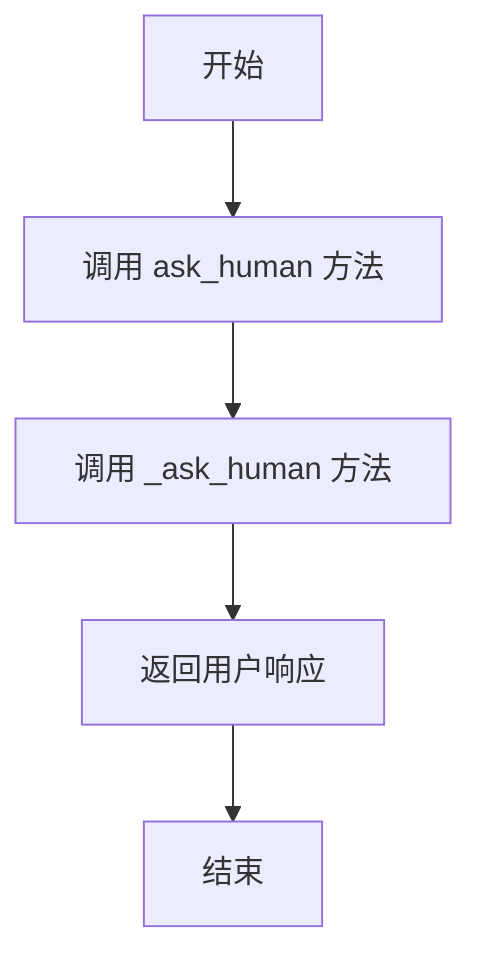
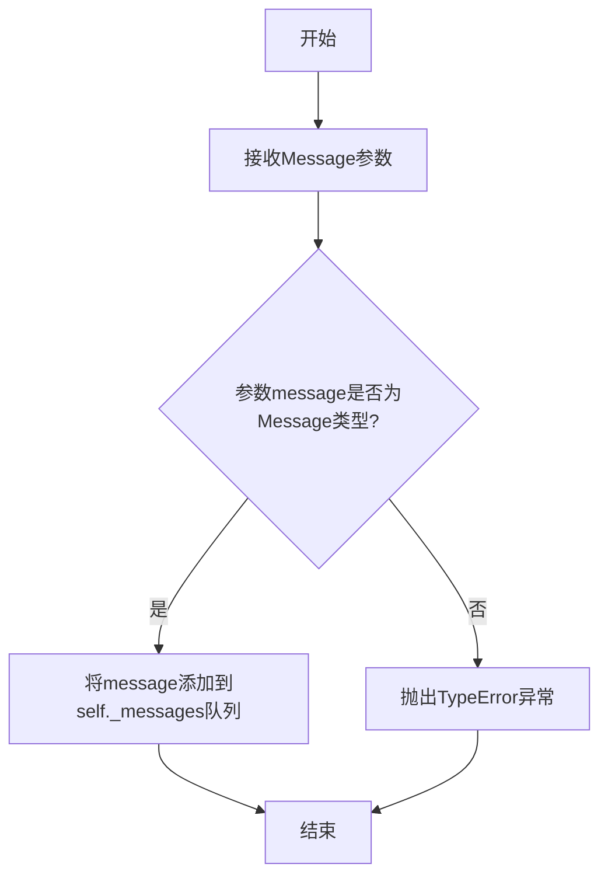
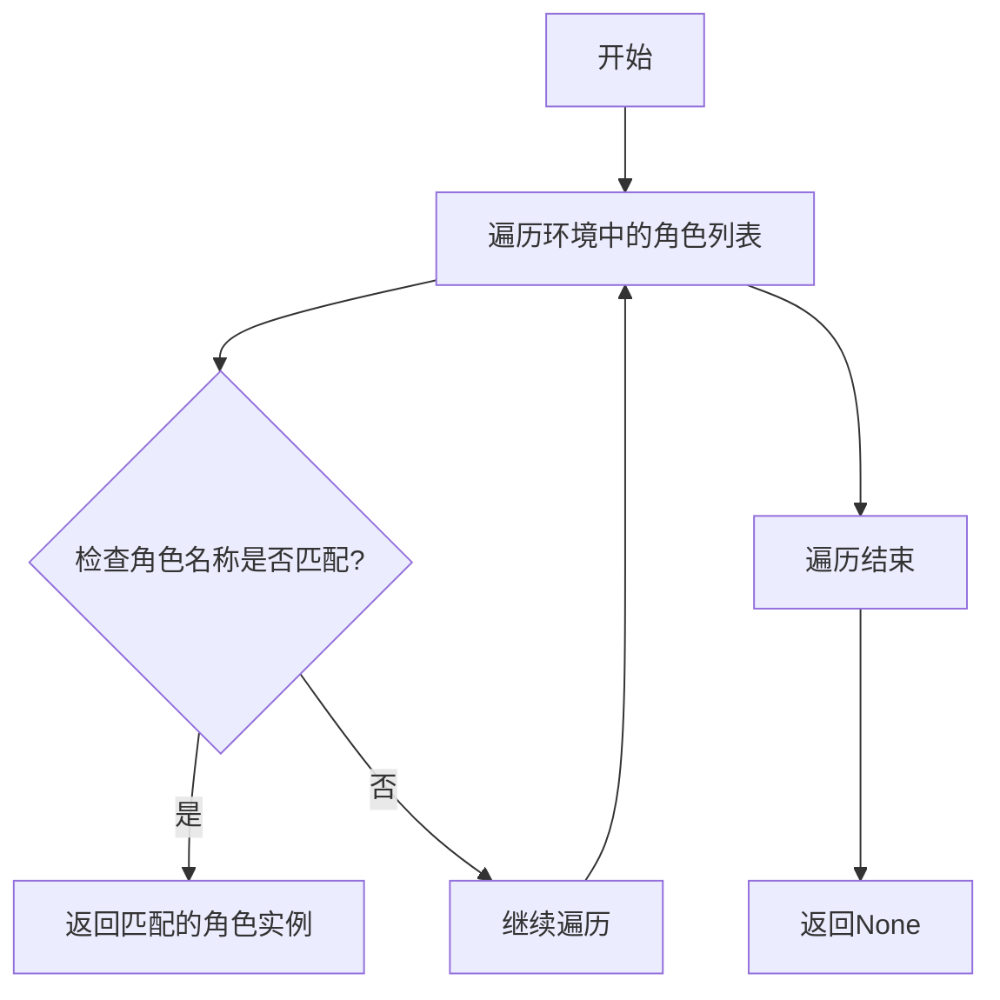
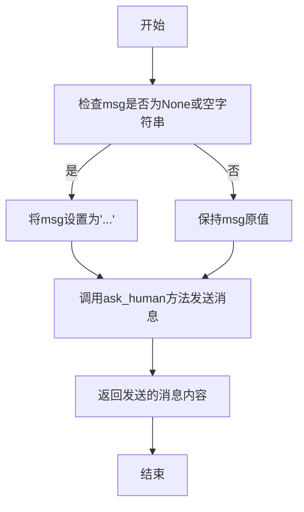
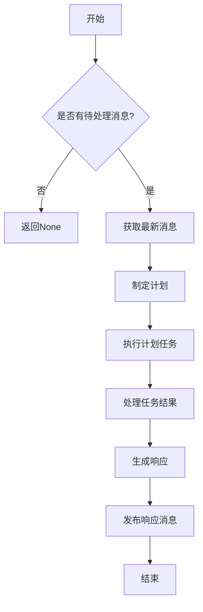

# `.\MetaGPT\examples\di\interacting_with_human.py` 详细设计文档

该代码是一个基于MetaGPT框架的简单交互式应用入口。它初始化一个多智能体环境（MGXEnv），添加一个团队领导（TeamLeader）角色，然后通过环境与人类用户进行交互：首先询问用户意图，将用户输入作为消息发布到环境中，触发团队领导角色执行其规划的任务，最后将执行结果（一个空响应）返回给用户并记录日志。

## 整体流程



## 类结构

```
外部依赖/导入模块
├── fire (命令行工具)
├── metagpt.environment.mgx.mgx_env.MGXEnv (环境类)
├── metagpt.logs.logger (日志记录器)
├── metagpt.roles.di.team_leader.TeamLeader (角色类)
└── metagpt.schema.Message (消息类)
```

## 全局变量及字段


### `env`
    
MetaGPT环境实例，用于管理角色、消息传递和人机交互

类型：`MGXEnv`
    


### `human_rsp`
    
从用户处获取的输入响应，表示用户想要执行的任务

类型：`str`
    


### `tl`
    
名为'Mike'的TeamLeader角色实例，负责执行任务规划和管理

类型：`TeamLeader`
    


### `resp`
    
发送给用户的空响应，用于完成交互循环

类型：`str`
    


### `TeamLeader.planner`
    
TeamLeader内部的规划器组件，负责管理和跟踪任务计划

类型：`Planner`
    


### `Message.content`
    
消息的内容，存储用户输入或系统生成的信息

类型：`str`
    


### `Message.role`
    
消息的发送者角色标识，如'user'表示用户消息

类型：`str`
    
    

## 全局函数及方法

### `main`

该函数是MetaGPT应用的主要入口点，负责初始化环境、接收用户输入、驱动TeamLeader角色执行任务，并最终向用户回复执行结果。它是一个异步函数，通过`fire`库被调用，实现了从用户交互到AI角色执行任务的完整工作流。

参数：
- 无

返回值：`None`，无返回值

#### 流程图



#### 带注释源码

```python
async def main():
    # 初始化MetaGPT环境
    env = MGXEnv()
    # 向环境中添加一个TeamLeader角色
    env.add_roles([TeamLeader()])

    # 向人类用户提问，获取其想要执行的操作
    human_rsp = await env.ask_human("What do you want to do？")

    # 记录人类用户的响应，用于追踪
    logger.info(human_rsp)
    # 在环境中创建并发布一条包含用户响应的消息
    env.publish_message(Message(content=human_rsp, role="user"))

    # 从环境中获取名为'Mike'的TeamLeader角色实例
    tl = env.get_role("Mike")
    # 执行TeamLeader角色的任务
    await tl.run()

    # 遍历TeamLeader计划中的所有任务，并记录其状态
    for task in tl.planner.plan.tasks:
        logger.info(f"- {task.task_id}: {task.instruction} (Completed: {task.is_finished})")

    # 向人类用户发送一个空回复，并记录该回复
    resp = await env.reply_to_human("")
    logger.info(resp)
```

### `MGXEnv.add_roles`

该方法用于向`MGXEnv`环境实例中添加一个或多个角色（`Role`）对象。它会遍历传入的角色列表，将每个角色注册到环境中，并建立角色与环境的双向关联。

参数：

- `roles`：`List[Role]`，一个包含要添加到环境中的`Role`对象实例的列表。

返回值：`None`，此方法不返回任何值。

#### 流程图

```mermaid
flowchart TD
    A[开始: add_roles(roles)] --> B{遍历 roles 列表};
    B --> C[获取当前角色 role];
    C --> D[将 role 添加到 self._roles 字典<br>key: role.profile, value: role];
    D --> E[调用 role.set_env(self)<br>建立角色与环境的关联];
    E --> F{是否还有下一个角色?};
    F -- 是 --> C;
    F -- 否 --> G[结束];
```

#### 带注释源码

```python
def add_roles(self, roles: List[Role]):
    """
    向环境中添加角色。
    遍历角色列表，将每个角色注册到环境并建立双向关联。
    Args:
        roles (List[Role]): 要添加的角色对象列表。
    """
    # 遍历传入的角色列表
    for role in roles:
        # 将角色以其 profile 属性（如角色名）为键，存储到环境的 _roles 字典中
        self._roles[role.profile] = role
        # 调用角色的 set_env 方法，将当前环境实例（self）传递给角色
        # 这建立了角色对环境的引用，使角色能感知和交互于其所在环境
        role.set_env(self)
```

### `MGXEnv.ask_human`

该方法用于在MGX环境中向人类用户发起询问，获取用户的输入。它通过异步方式调用底层的`_ask_human`方法，并返回用户的响应字符串。

参数：
- `question`：`str`，向人类用户提出的问题文本。

返回值：`str`，人类用户对问题的回答文本。

#### 流程图



#### 带注释源码

```python
async def ask_human(self, question: str) -> str:
    """
    向人类用户提问并获取回答。

    Args:
        question (str): 向人类用户提出的问题。

    Returns:
        str: 人类用户的回答。
    """
    # 调用底层的 _ask_human 方法，传入问题参数，并返回用户的响应
    return await self._ask_human(question)
```

### `MGXEnv.publish_message`

该方法用于在MGX环境中发布一条消息，将消息添加到环境的内部消息队列中，以便后续由其他角色或组件处理。

参数：

- `message`：`Message`，要发布的消息对象，包含消息内容、发送者角色等信息。

返回值：`None`，该方法不返回任何值。

#### 流程图



#### 带注释源码

```python
def publish_message(self, message: Message):
    """
    在环境中发布一条消息。
    
    该方法将传入的Message对象添加到环境的内部消息队列中。
    这是环境内部通信机制的一部分，允许角色之间交换信息。
    
    Args:
        message (Message): 要发布的消息对象。
        
    Raises:
        TypeError: 如果message参数不是Message类型。
    """
    # 参数类型检查：确保传入的是Message对象
    if not isinstance(message, Message):
        raise TypeError(f"Expected Message type, got {type(message)}")
    
    # 将消息添加到环境的内部消息队列
    # self._messages是一个列表，用于存储所有待处理的消息
    self._messages.append(message)
    
    # 可选：可以在这里添加消息发布后的回调或通知机制
    # 例如：self._notify_observers(message)
```

### `MGXEnv.get_role`

该方法用于从MGXEnv环境中根据角色名称获取对应的角色实例。

参数：

- `role_name`：`str`，要获取的角色名称

返回值：`Role`，返回与指定名称匹配的角色实例，如果未找到则返回None

#### 流程图



#### 带注释源码

```python
def get_role(self, role_name: str) -> Role:
    """
    根据角色名称获取对应的角色实例
    
    Args:
        role_name: 要获取的角色名称
        
    Returns:
        与指定名称匹配的角色实例，如果未找到则返回None
    """
    # 遍历环境中的所有角色
    for role in self.roles:
        # 检查角色名称是否匹配
        if role.name == role_name:
            # 返回匹配的角色实例
            return role
    # 如果未找到匹配的角色，返回None
    return None
```

### `MGXEnv.reply_to_human`

该方法用于向人类用户发送回复消息，并返回发送的消息内容。

参数：
- `msg`：`str`，要发送给人类用户的回复消息内容。

返回值：`str`，返回发送给人类用户的回复消息内容。

#### 流程图



#### 带注释源码

```python
async def reply_to_human(self, msg: str) -> str:
    """
    向人类用户发送回复消息。

    如果msg为None或空字符串，则将其设置为'...'，然后调用ask_human方法发送消息。

    Args:
        msg (str): 要发送给人类用户的回复消息内容。

    Returns:
        str: 返回发送给人类用户的回复消息内容。
    """
    # 检查msg是否为None或空字符串，如果是则设置为'...'
    if not msg:
        msg = "..."
    # 调用ask_human方法发送消息，并返回发送的消息内容
    return await self.ask_human(msg)
```

### `TeamLeader.run`

该方法用于执行团队领导者的核心工作流程。它首先检查是否有待处理的消息，然后根据消息内容制定计划，接着执行计划中的任务，最后处理任务结果并生成响应。

参数：
- 无显式参数（实例方法，通过 `self` 访问实例属性）

返回值：`None`，无返回值

#### 流程图



#### 带注释源码

```python
async def run(self) -> None:
    """
    团队领导者的主要执行方法。
    1. 检查是否有待处理的消息
    2. 获取最新消息并制定计划
    3. 执行计划中的任务
    4. 处理任务结果并生成响应
    """
    # 检查是否有待处理的消息
    if not self.rc.msg_buffer:
        return
    
    # 获取最新消息
    msg = self.rc.msg_buffer.pop()
    
    # 制定计划
    plan = await self.planner.plan(msg.content)
    
    # 执行计划中的任务
    for task in plan.tasks:
        result = await self.execute_task(task)
        # 处理任务结果
        await self.process_task_result(task, result)
    
    # 生成响应并发布消息
    response = await self.generate_response(plan)
    await self.rc.env.publish_message(
        Message(content=response, role=self.profile)
    )
```

## 关键组件


### MGXEnv

MGXEnv 是 MetaGPT 框架中的核心环境类，负责管理角色、处理消息传递以及协调人机交互。

### TeamLeader

TeamLeader 是一个具体的角色类，负责接收用户需求、制定任务计划并协调其他角色执行任务。

### Message

Message 是消息传递的载体，用于在环境与角色之间或角色与角色之间传递信息，包含内容、发送者等元数据。

### Planner

Planner 是 TeamLeader 内部用于制定和管理任务计划的组件，包含一系列任务及其状态。

### fire

fire 是一个命令行工具库，用于将 Python 函数或类快速转换为命令行接口，简化脚本的调用方式。


## 问题及建议


### 已知问题

-   **硬编码的角色名称**：代码中通过 `env.get_role("Mike")` 获取角色实例，角色名称 `"Mike"` 被硬编码在脚本中。这降低了代码的灵活性，如果环境中添加的角色名称不是 `"Mike"`，或者未来需要动态指定角色，此代码将无法正常工作。
-   **缺乏错误处理**：代码在执行关键操作（如 `env.get_role("Mike")`、`await tl.run()`）时，没有进行异常捕获和处理。如果环境初始化失败、找不到指定角色或角色执行过程中出错，程序会直接崩溃，缺乏健壮性。
-   **潜在的异步执行问题**：`main` 函数被标记为 `async`，并通过 `fire.Fire(main)` 调用。虽然 `fire` 库支持异步函数，但在某些运行环境下（如标准的脚本执行），直接调用异步入口点可能导致未处理的协程或执行问题，需要确保事件循环被正确管理。
-   **任务完成状态日志的时机可能不准确**：在 `await tl.run()` 之后立即遍历 `tl.planner.plan.tasks` 并记录其完成状态。如果 `tl.run()` 内部的任务执行是异步且非阻塞的，或者任务状态在 `run()` 方法返回后仍在更新，此时记录的状态可能不是最终状态。
-   **向用户回复空内容**：代码中 `resp = await env.reply_to_human("")` 向用户发送了一个空字符串作为回复。这可能导致用户体验不佳，或者在某些前端实现中引发问题。回复内容应根据执行结果动态生成。

### 优化建议

-   **将角色名称参数化**：建议通过命令行参数、配置文件或环境变量来指定要获取和执行的角色名称，而不是硬编码。例如，可以使用 `fire` 库将角色名称作为 `main` 函数的参数。
-   **增加异常处理逻辑**：在 `main` 函数中，使用 `try...except` 块包裹核心业务逻辑，捕获可能出现的异常（如 `KeyError`、`RuntimeError` 等），并记录详细的错误日志，或向用户返回友好的错误信息，确保程序优雅降级。
-   **明确异步执行上下文**：如果此脚本作为独立入口点运行，建议使用 `asyncio.run(main())` 来显式启动和运行异步主函数，以确保事件循环被正确创建和清理。检查 `fire` 库与 `asyncio.run` 的兼容性，或调整调用方式。
-   **确保状态同步后再记录**：如果任务完成状态在 `tl.run()` 返回后可能异步更新，建议在记录任务状态前，通过等待某个信号（如所有任务完成的 `Future`）或检查更可靠的状态标志来确保获取的是最终状态。或者，将状态记录逻辑移至 `tl.run()` 方法内部或由它触发的回调中。
-   **生成有意义的回复内容**：`env.reply_to_human` 的调用应基于 `tl.run()` 的执行结果或任务完成情况，构造一个信息丰富的回复消息（例如，总结执行了哪些任务、最终结果如何），而不是发送空字符串。这可以提升交互的有效性和用户体验。


## 其它


### 设计目标与约束

本代码的设计目标是构建一个基于MetaGPT框架的简单交互式应用，允许人类用户通过自然语言输入一个目标，并由一个名为“Mike”的团队领导者角色（TeamLeader）来规划并执行任务以达成该目标。核心约束包括：1）依赖MetaGPT框架提供的环境（MGXEnv）、角色（Role）和消息（Message）等基础组件；2）采用异步编程模型（async/await）；3）使用fire库作为简单的命令行接口；4）设计为单次交互的脚本，启动后执行一轮“人类提问-角色执行-结果展示”的流程。

### 错误处理与异常设计

当前代码中显式的错误处理机制较为薄弱。主要依赖于Python和所使用库（如fire, asyncio）的默认异常传播。潜在的风险点包括：1）`env.ask_human`可能因I/O问题失败；2）`env.get_role("Mike")`在环境中不存在名为“Mike”的角色时会返回None，导致后续`await tl.run()`调用失败（AttributeError）；3）`tl.planner.plan`可能为None，导致迭代时出错。建议增加try-except块来捕获关键步骤的异常，并提供更友好的错误提示或默认行为。

### 数据流与状态机

1.  **数据流**：流程始于人类输入（字符串），被包装成`Message`对象并发布到`MGXEnv`。环境将消息传递给订阅它的角色（此处为TeamLeader）。TeamLeader内部处理消息，生成任务计划（`tl.planner.plan.tasks`）。代码最后读取并展示这些任务的状态，但未将执行结果反馈给环境或人类。数据流本质上是单向的：用户输入 -> 环境消息总线 -> 角色消费与处理 -> 控制台输出。
2.  **状态机**：脚本本身是线性的，没有复杂的状态循环。但`MGXEnv`和`TeamLeader`角色内部可能维护着状态（如消息历史、任务完成状态）。脚本执行后，`TeamLeader`的`planner.plan.tasks`中各个任务的`is_finished`标志反映了执行后的状态。

### 外部依赖与接口契约

1.  **外部库**：
    *   `fire`：用于生成命令行接口，将`main`函数映射为命令。
    *   `metagpt`：核心框架，代码重度依赖其`MGXEnv`、`TeamLeader`、`Message`、`logger`等模块。版本变更可能导致接口不兼容。
2.  **接口契约**：
    *   `MGXEnv.ask_human(prompt)`: 异步方法，预期返回用户输入的字符串。
    *   `MGXEnv.publish_message(message)`: 将消息发布到环境总线上。
    *   `MGXEnv.get_role(role_name)`: 返回指定名称的角色实例。
    *   `MGXEnv.reply_to_human(response)`: 异步方法，用于向用户发送回复。
    *   `TeamLeader.run()`: 异步方法，触发角色开始处理消息和执行计划。
    *   `TeamLeader.planner.plan.tasks`: 属性，预期是一个包含任务对象的可迭代结构，每个任务应有`task_id`, `instruction`, `is_finished`属性。
3.  **隐式依赖**：代码假设环境中已通过`env.add_roles([TeamLeader()])`添加了一个`TeamLeader`实例，并且该实例在环境内部的名称是“Mike”。这是一个脆弱的隐式约定。

### 安全与合规考虑

1.  **输入安全**：代码直接接收并处理来自命令行的人类输入（`human_rsp`），并将其内容放入`Message`。如果该输入被用于构造后续的系统命令、数据库查询或其它敏感操作，存在注入攻击风险。当前上下文未显示具体用途，但需警示。
2.  **数据隐私**：`logger.info`记录了人类输入和最终回复。需确保日志配置不会将敏感信息泄露到不安全的位置。
3.  **资源管理**：脚本使用异步IO，但未显示关闭环境或清理资源（如数据库连接、网络会话）的逻辑。在长期运行或集成到更大系统时需注意。

### 部署与运行配置

1.  **运行方式**：通过`python script_name.py`直接运行，或使用`fire`生成的命令行参数（尽管本例`main`函数无参数）。
2.  **环境要求**：需要Python环境，并安装`fire`和`metagpt`包及其所有依赖。
3.  **配置**：代码中无配置文件或环境变量读取逻辑。所有行为（如角色名称“Mike”）均硬编码。扩展性差，适应不同场景需要修改源码。
4.  **日志**：使用`metagpt.logs.logger`，但其输出格式、级别和目的地取决于MetaGPT框架的默认配置或全局设置。

### 测试策略建议

1.  **单元测试**：难以直接测试，因为重度依赖外部框架环境（`MGXEnv`）和异步操作。可考虑使用mock对象模拟`MGXEnv`和`TeamLeader`的行为，验证主流程的逻辑正确性，例如验证消息发布和角色获取的调用。
2.  **集成测试**：作为整体测试MetaGPT框架功能的一部分。可以模拟用户输入，检查`TeamLeader`是否被正确触发，以及任务列表是否被生成和记录。
3.  **端到端测试**：通过命令行调用脚本，提供预设输入，验证最终的日志输出是否符合预期。
由于当前脚本是演示或一次性用途，可能未配备测试套件。

    