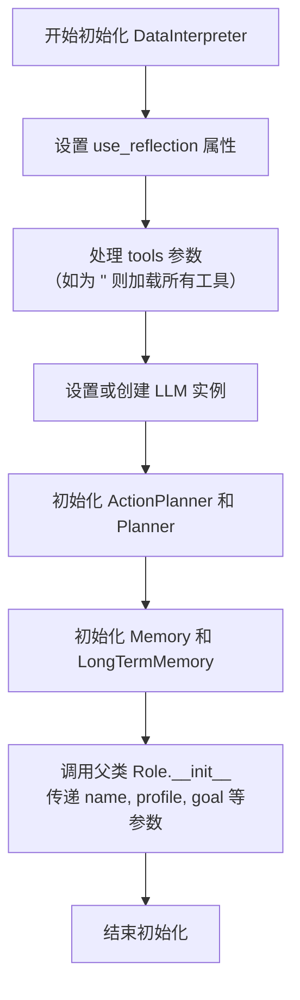

# `.\MetaGPT\examples\di\machine_learning_with_tools.py` 详细设计文档

该代码是一个基于MetaGPT框架的数据分析任务执行脚本。它通过创建一个具备反思能力和全工具集的DataInterpreter角色，接收一个关于泰坦尼克号乘客生存预测的详细需求描述，然后异步地运行该角色以自动完成从数据分析、预处理、特征工程到建模预测及评估的完整机器学习工作流。

## 整体流程

```mermaid
graph TD
    A[开始: 定义数据路径] --> B[构建任务需求字符串]
    B --> C[创建DataInterpreter角色实例]
    C --> D[异步运行角色: role.run(requirement)]
    D --> E{DataInterpreter内部执行流程}
    E --> F[解析需求，规划任务]
    F --> G[选择并调用工具执行子任务]
    G --> H[进行反思与迭代]
    H --> I{任务是否完成?}
    I -- 否 --> G
    I -- 是 --> J[输出最终结果与评估报告]
    J --> K[结束]
```

## 类结构

```
外部依赖
├── asyncio (Python标准库)
└── metagpt.roles.di.data_interpreter
    └── DataInterpreter (主执行角色类)
```

## 全局变量及字段


### `data_path`
    
泰坦尼克号数据集的基础文件路径。

类型：`str`
    


### `train_path`
    
训练数据集的完整文件路径，由 data_path 拼接而成。

类型：`str`
    


### `eval_path`
    
评估数据集的完整文件路径，由 data_path 拼接而成。

类型：`str`
    


### `requirement`
    
一个描述性字符串，定义了数据解释器（DataInterpreter）需要完成的具体任务目标、数据位置和评估标准。

类型：`str`
    


### `role`
    
DataInterpreter 角色的实例，是执行需求分析、规划、代码生成和执行的核心对象。

类型：`DataInterpreter`
    


### `DataInterpreter.(来自metagpt库，具体字段需查看源码)`
    
DataInterpreter 类的内部字段，具体定义需查阅 metagpt 库的源码。

类型：`未知`
    
    

## 全局函数及方法


### `main`

该函数是DataInterpreter角色的异步入口点，用于启动一个数据解释任务。它接收一个描述任务的字符串，创建一个配置好的DataInterpreter角色实例，并运行该角色来处理给定的需求。

参数：

-  `requirement`：`str`，一个描述数据科学任务的字符串，包含任务目标、数据路径等信息。

返回值：`None`，该函数不返回任何值。

#### 流程图

```mermaid
flowchart TD
    A[开始: main(requirement)] --> B[创建DataInterpreter角色实例<br/>use_reflection=True, tools="<all>"]
    B --> C[异步运行角色: await role.run(requirement)]
    C --> D[任务执行完成]
    D --> E[结束]
```

#### 带注释源码

```python
async def main(requirement: str):
    # 1. 实例化DataInterpreter角色。
    #    参数`use_reflection=True`启用自我反思机制。
    #    参数`tools=["<all>"]`允许角色使用所有可用的工具。
    role = DataInterpreter(use_reflection=True, tools=["<all>"])
    
    # 2. 异步运行角色的主要逻辑，传入用户需求。
    #    这将触发DataInterpreter的完整工作流，包括：
    #    - 需求分析与规划
    #    - 代码生成与执行（利用工具）
    #    - 结果验证与自我反思（如果启用）
    #    - 最终输出结果报告
    await role.run(requirement)
    # 函数无返回值
```


### `DataInterpreter.__init__`

`DataInterpreter` 类的构造函数，用于初始化一个数据解释器角色实例。它负责设置角色的核心属性，包括是否启用自我反思机制、可使用的工具列表、语言模型配置、动作规划器、记忆系统以及角色名称和配置文件等。

参数：

-  `use_reflection`：`bool`，指示是否启用自我反思机制。当设置为 `True` 时，角色在执行任务后会回顾和分析自己的行动与结果，以改进后续决策。
-  `tools`：`List[str]`，指定角色可以使用的工具列表。列表中的字符串可以是具体的工具名称，也可以是特殊标记如 `"<all>"` 表示使用所有可用工具。
-  `llm`：`BaseLLM`，语言模型实例，用于生成自然语言响应和执行认知任务。如果未提供，将使用默认配置创建。
-  `name`：`str`，角色的名称，默认为 `"DataInterpreter"`。
-  `profile`：`str`，角色的简要描述或配置文件，默认为 `"Data Interpreter"`。
-  `goal`：`str`，角色的长期目标，默认为 `"Interpret data and provide insights"`。
-  `constraints`：`str`，角色在行动中必须遵守的约束条件，默认为 `""`。
-  `desc`：`str`，角色的详细描述，默认为空字符串。
-  `**kwargs`：`Any`，其他关键字参数，用于传递给父类 `Role` 的构造函数，允许进一步的定制。

返回值：`None`，构造函数不返回任何值。

#### 流程图



#### 带注释源码

```python
def __init__(
    self,
    use_reflection: bool = False,
    tools: List[str] = None,
    llm: BaseLLM = None,
    name: str = "DataInterpreter",
    profile: str = "Data Interpreter",
    goal: str = "Interpret data and provide insights",
    constraints: str = "",
    desc: str = "",
    **kwargs,
):
    """
    初始化 DataInterpreter 角色。

    Args:
        use_reflection (bool): 是否启用自我反思。
        tools (List[str]): 可用的工具列表，'<all>' 表示所有工具。
        llm (BaseLLM): 语言模型实例。
        name (str): 角色名称。
        profile (str): 角色简介。
        goal (str): 角色目标。
        constraints (str): 行动约束。
        desc (str): 详细描述。
        **kwargs: 传递给父类的额外参数。
    """
    # 设置自我反思标志
    self.use_reflection = use_reflection

    # 处理工具列表：如果指定为 '<all>'，则加载所有可用工具
    if tools == ["<all>"]:
        tools = []
    self.tools = tools

    # 如果没有提供 LLM，则使用默认配置创建一个
    self.llm = llm or LLM()

    # 初始化动作规划器，用于将目标分解为具体的可执行动作
    self.planner = ActionPlanner(tools=self.tools, llm=self.llm)

    # 初始化规划器（可能用于更高层次的战略规划），这里暂时与动作规划器相同
    self._init_planner = self.planner

    # 初始化记忆系统，用于存储和检索任务执行过程中的信息
    self.memory = Memory()
    self.long_term_memory = LongTermMemory()

    # 调用父类 Role 的构造函数，传递基本角色属性
    super().__init__(
        name=name,
        profile=profile,
        goal=goal,
        constraints=constraints,
        desc=desc,
        **kwargs,
    )
```


### `DataInterpreter.run`

该方法是一个异步方法，用于启动并执行DataInterpreter角色的核心工作流。它接收一个用户需求字符串，并协调内部组件（如规划器、执行器、反思器等）来理解需求、制定计划、执行任务（如数据分析、预处理、建模），并最终生成结果报告。

参数：
- `message`：`str`，描述用户需求或任务的字符串，例如要求对泰坦尼克号数据集进行分析和预测。

返回值：`None`，此方法不返回任何值，其主要作用是通过异步执行产生副作用（如输出结果、保存文件）。

#### 流程图

```mermaid
flowchart TD
    A[开始: run(message)] --> B[初始化: 将message转换为Message对象]
    B --> C{是否启用反思?}
    C -- 是 --> D[调用带反思的工作流]
    C -- 否 --> E[调用标准工作流]
    D --> F[规划器制定计划]
    E --> F
    F --> G[执行器按计划执行任务]
    G --> H[收集执行结果]
    H --> I{是否启用反思?}
    I -- 是 --> J[反思器评估结果并优化]
    J --> K[生成新的或调整后的计划]
    K --> G
    I -- 否 --> L[生成最终输出/报告]
    L --> M[结束]
```

#### 带注释源码

```python
    async def run(self, message: str) -> None:
        """
        运行DataInterpreter的核心异步方法。
        参数:
            message: 用户的需求描述。
        返回值:
            None
        """
        # 1. 将输入的字符串需求转换为内部使用的Message对象
        msg = Message(content=message)
        
        # 2. 根据初始化配置（use_reflection）决定调用哪个工作流
        #    - 如果启用反思，则调用`_run_reflection`，该流程包含计划评估与优化循环
        #    - 否则，调用`_run`，执行一次标准的“规划-执行”流程
        if self.use_reflection:
            await self._run_reflection(msg)
        else:
            await self._run(msg)
        # 方法执行完毕，无返回值
```

## 关键组件


### DataInterpreter 角色

一个能够执行数据解释任务的智能体角色，它集成了反思机制并可以调用所有可用工具来处理复杂的数据分析、预处理、特征工程和建模需求。

### 异步任务执行与事件循环

利用 Python 的 `asyncio` 库来异步执行 `DataInterpreter` 角色的 `run` 方法，以高效处理可能涉及长时间运行或I/O密集型操作的数据科学任务。

### 工具调用系统

通过 `tools=["<all>"]` 参数配置，使 `DataInterpreter` 能够动态访问和使用其环境中的所有可用工具，以完成数据加载、分析、转换和模型训练等多样化子任务。

### 端到端机器学习工作流编排

代码定义了一个从需求分析到模型评估的完整机器学习流水线，包括数据加载、探索性数据分析、数据预处理、特征工程、模型训练及在评估集上的性能报告。


## 问题及建议


### 已知问题

-   **硬编码的数据路径和需求**：代码中`data_path`、`train_path`、`eval_path`和`requirement`字符串都是硬编码的。这使得代码不灵活，无法轻松应用于其他数据集或任务，每次修改都需要直接改动源代码。
-   **工具配置的模糊性**：`tools=["<all>"]`这种配置方式含义模糊。它可能意味着加载所有可用工具，但这可能导致加载不必要的工具，增加初始化开销和潜在的安全风险（如果环境中有危险工具）。同时，这也使得代码的实际依赖和运行时行为不透明。
-   **缺乏配置化和错误处理**：代码作为一个入口脚本，没有提供任何外部配置方式（如配置文件、环境变量、命令行参数）。同时，整个执行流程包裹在`asyncio.run(main(requirement))`中，缺乏对运行时错误（如文件不存在、`DataInterpreter`初始化或运行失败）的捕获和处理，可能导致程序崩溃且无明确错误信息。
-   **潜在的资源管理问题**：代码没有展示`DataInterpreter`实例在使用后是否有明确的清理或关闭机制。在长期运行或多次调用的场景下，可能会存在资源（如内存、线程、子进程）泄漏的风险。

### 优化建议

-   **参数化输入**：将数据路径、需求描述等可变部分改为通过命令行参数、配置文件或环境变量传入。例如，使用`argparse`库解析命令行参数，使脚本可重用。
-   **明确工具依赖**：避免使用`["<all>"]`这种模糊配置。应根据任务需求，显式列出所需的具体工具列表。这可以提高性能、安全性和可维护性。
-   **增强健壮性**：
    -   在`main`函数和脚本入口处添加`try...except`块，捕获并记录可能发生的异常，提供友好的错误信息。
    -   在调用前，可以添加对输入文件路径（`train_path`, `eval_path`）是否存在的基础验证。
-   **改进代码结构**：将脚本逻辑封装到一个更规范的函数或类中，分离配置、初始化和运行逻辑。考虑将`DataInterpreter`的配置选项（如`use_reflection`）也作为可配置项。
-   **考虑资源生命周期**：查阅`DataInterpreter`的文档，确认其是否有`close`、`aclose`或类似的方法需要在任务结束后调用。如果有，应在`main`函数中使用`async with`上下文管理器或`try...finally`块确保资源被正确释放。
-   **添加日志记录**：引入日志记录（如Python的`logging`模块）来替代或补充`print`语句，可以更灵活地控制输出级别和格式，便于调试和监控。


## 其它


### 设计目标与约束

本代码的设计目标是创建一个基于`DataInterpreter`角色的自动化数据科学工作流执行器。其核心是接收一个用自然语言描述的数据科学任务需求，自动完成从数据分析、预处理、特征工程到建模预测的全过程，并输出评估结果。主要约束包括：1) 依赖`metagpt`框架及其`DataInterpreter`角色的具体实现；2) 任务执行是异步的，需要运行在支持`asyncio`的环境中；3) 工具集配置为`["<all>"]`，其具体能力和范围由底层框架定义；4) 输入需求（`requirement`）的格式和清晰度直接影响任务解析与执行的准确性。

### 错误处理与异常设计

当前代码层面的显式错误处理较为简单。主要依赖于Python和`asyncio`的默认异常传播机制，以及`metagpt`框架内部`DataInterpreter.run`方法的错误处理。潜在异常点包括：1) 文件路径错误导致的`FileNotFoundError`；2) `DataInterpreter`初始化或运行过程中，因工具加载失败、任务解析失败、代码执行错误等引发的框架自定义异常或标准异常（如`ValueError`, `RuntimeError`）；3) `asyncio.run()`执行时的异步相关异常。代码未包含`try-except`块，意味着任何未捕获的异常都将导致程序崩溃。建议在生产环境中增加顶层异常捕获和日志记录，以提供更友好的错误信息和系统稳定性。

### 数据流与状态机

数据流始于硬编码的`requirement`字符串，其中包含了任务描述和关键数据路径（`train_path`, `eval_path`）。该字符串作为输入传递给`main`函数。在`main`函数内部，`DataInterpreter`角色实例被创建并启动。`DataInterpreter.run`方法作为核心状态机，其内部逻辑（未在代码中展示）驱动着整个数据科学流水线：解析需求 -> 规划步骤 -> 选择并执行工具（如读取数据、分析、转换、训练模型）-> 可能进行反思（`use_reflection=True`）以改进计划 -> 生成最终结果（如预测准确率报告）。数据（如`DataFrame`、模型对象、评估指标）在`DataInterpreter`内部的状态和各个工具调用之间流动。最终输出（如打印到控制台的报告）是数据流的终点。程序本身没有持久化状态，每次运行都是独立的。

### 外部依赖与接口契约

1.  **外部依赖**:
    *   **`metagpt`库**: 核心依赖，特别是其中的`metagpt.roles.di.data_interpreter.DataInterpreter`类。版本和内部实现细节直接影响功能。
    *   **`asyncio`库**: 用于支持异步执行，是Python标准库的一部分。
    *   **工具依赖**: `DataInterpreter`配置了`tools=["<all>"]`，这意味着其背后可能依赖一系列用于数据操作（如`pandas`, `numpy`）、机器学习（如`scikit-learn`）等的第三方库。这些依赖由`metagpt`框架管理或隐式要求。
    *   **数据文件**: 依赖外部数据文件（`split_train.csv`, `split_eval.csv`），其格式（如CSV）、结构（包含`Survived`列）和可访问性是执行的前提。

2.  **接口契约**:
    *   `main(requirement: str) -> None`: 异步函数，接受任务描述字符串，无返回值，通过副作用（如控制台输出）呈现结果。
    *   `DataInterpreter.__init__(use_reflection: bool, tools: list)`: 构造函数，接受反射启用标志和工具列表。
    *   `DataInterpreter.run(requirement: str) -> None`: 异步方法，启动角色执行给定需求的核心接口。
    *   与数据文件的契约：假设文件存在、路径正确、格式为CSV且包含任务描述中指定的列。

### 安全与合规考虑

1.  **代码执行安全**: `DataInterpreter`的核心能力之一是动态生成和执行代码以完成任务。这带来了潜在的安全风险（如代码注入、执行恶意指令）。当前代码将工具集设置为`["<all>"]`，风险较高。应在可信环境中运行，并考虑限制可用工具集（`tools`参数）或对生成的代码进行安全沙箱隔离。
2.  **数据隐私**: 程序会读取和处理可能包含个人敏感信息的数据集（如泰坦尼克号数据集虽已脱敏，但此模式可用于其他数据）。需确保输入数据的使用符合相关数据保护法规（如GDPR），并注意在日志或输出中避免泄露敏感信息。
3.  **依赖安全**: 所依赖的`metagpt`及其间接依赖的众多第三方库需要保持更新，以避免已知的安全漏洞。
4.  **资源消耗**: 自动化机器学习流程可能消耗大量计算资源（CPU、内存）和时间，尤其是处理大规模数据或复杂模型时。代码中没有资源限制或监控机制，可能导致系统过载。

### 部署与运行环境

1.  **环境要求**: 需要Python 3.7+环境（支持`asyncio`），并安装`metagpt`及其所有依赖。建议使用虚拟环境（如`venv`, `conda`）进行隔离。
2.  **运行方式**: 作为独立的Python脚本运行（`python script.py`）。入口点为`__main__`块。
3.  **配置管理**: 当前所有配置（如数据路径、`DataInterpreter`参数）均硬编码在脚本中，缺乏灵活性。改进方向包括通过环境变量、配置文件或命令行参数来管理这些配置项。
4.  **日志与监控**: 代码未配置显式日志。`metagpt`框架可能提供内部日志，但为了运维和调试，建议集成标准日志库（如`logging`）来记录任务开始、结束、关键步骤、警告和错误。
5.  **可扩展性**: 当前脚本针对单一任务。若要处理多个任务或集成到更大系统中，需要重构，例如将`main`函数封装为可调用组件，并设计任务队列、结果存储等机制。

    