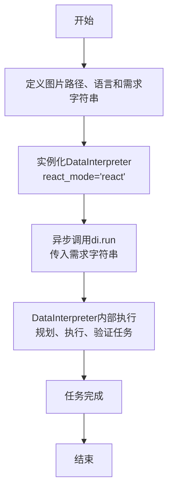
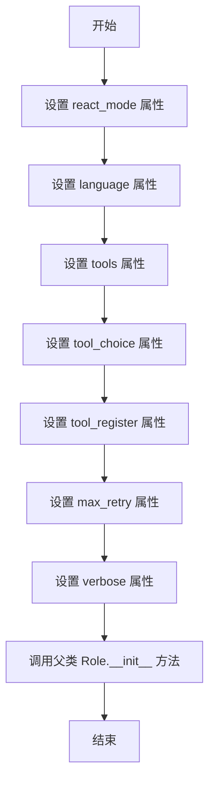

# `.\MetaGPT\examples\di\ocr_receipt.py` 详细设计文档

该代码是一个基于MetaGPT框架的数据解释器（DataInterpreter）示例，其核心功能是接收一个包含英文收据图片路径和处理要求的自然语言指令，自动执行OCR文字识别、提取文本内容、识别总金额，并将结果保存为CSV表格。

## 整体流程

```mermaid
graph TD
    A[开始: 定义图片路径和需求] --> B[创建DataInterpreter实例]
    B --> C[调用di.run(requirement)执行任务]
    C --> D{DataInterpreter内部流程}
    D --> E[解析需求，规划任务]
    E --> F[执行OCR识别]
    F --> G[提取文本，丢弃坐标和置信度]
    G --> H[从文本中识别总金额]
    H --> I[将结果保存为CSV文件]
    I --> J[任务完成，返回结果]
```

## 类结构

```
外部依赖与调用关系
├── DataInterpreter (来自 metagpt.roles.di.data_interpreter)
│   └── 内部可能包含:
│       ├── 需求解析器
│       ├── 任务规划器
│       ├── 工具执行器 (如调用PaddleOCR)
│       └── 结果处理器
├── 全局异步函数: main
└── 入口点: __main__
```

## 全局变量及字段


### `EXAMPLE_DATA_PATH`
    
一个指向项目示例数据目录的路径对象，用于定位示例文件。

类型：`pathlib.Path`
    


### `image_path`
    
存储待处理的收据图片文件的具体路径。

类型：`pathlib.Path`
    


### `language`
    
一个字符串，用于指定收据图像上文本的语言（例如“English”），为OCR处理提供上下文。

类型：`str`
    


### `requirement`
    
一个详细描述任务的字符串，包含目标（OCR、提取总金额、保存为CSV）、输入图像路径和语言信息，作为DataInterpreter的输入指令。

类型：`str`
    


### `di`
    
DataInterpreter类的一个实例，是执行代码生成与任务解决的核心代理对象。

类型：`DataInterpreter`
    


### `DataInterpreter.react_mode`
    
DataInterpreter实例化时传入的参数，用于指定其推理和行动模式（例如“react”模式）。

类型：`str`
    
    

## 全局函数及方法

### `main`

这是一个异步入口函数，用于演示和启动一个数据解释器（DataInterpreter）任务。其主要功能是加载一张示例收据图片，构建一个包含OCR识别、文本提取、总金额识别和结果保存为CSV的复杂需求，然后实例化并运行DataInterpreter来处理该需求。

参数：
- 无

返回值：`None`，无返回值

#### 流程图



#### 带注释源码

```python
async def main():
    # Notice: pip install metagpt[ocr] before using this example
    # 定义示例收据图片的路径，使用项目常量EXAMPLE_DATA_PATH
    image_path = EXAMPLE_DATA_PATH / "di/receipt_shopping.jpg"
    # 指定收据的语言为英文
    language = "English"
    # 构建一个详细的需求描述字符串，指导DataInterpreter执行一系列任务：
    # 1. 使用PaddleOCR对图片进行OCR识别。
    # 2. 从OCR结果中提取纯文本内容，丢弃坐标和置信度信息。
    # 3. 从提取的文本中识别出总金额。
    # 4. 将最终结果保存为CSV表格。
    # 同时，明确告知环境已准备就绪。
    requirement = f"""This is a {language} receipt image.
    Your goal is to perform OCR on images using PaddleOCR, output text content from the OCR results and discard 
    coordinates and confidence levels, then recognize the total amount from ocr text content, and finally save as csv table. 
    Image path: {image_path}.
    NOTE: The environments for Paddle and PaddleOCR are all ready and has been fully installed."""
    # 实例化DataInterpreter角色，指定其反应模式为'react'（一种规划-执行-验证的循环模式）
    di = DataInterpreter(react_mode="react")
    # 异步运行DataInterpreter，将构建好的需求字符串传入，启动整个任务处理流程
    await di.run(requirement)
```

### `DataInterpreter.__init__`

该方法用于初始化 `DataInterpreter` 类的实例，设置其基本属性和配置，包括反应模式、语言、工具配置等。

参数：

- `self`：`DataInterpreter`，当前实例
- `react_mode`：`str`，反应模式，默认为 "react"
- `language`：`str`，语言，默认为 "en"
- `tools`：`list[str]`，工具列表，默认为空列表
- `tool_choice`：`str`，工具选择模式，默认为 "auto"
- `tool_register`：`ToolRegister`，工具注册器，默认为 `None`
- `max_retry`：`int`，最大重试次数，默认为 3
- `verbose`：`bool`，是否启用详细输出，默认为 `True`
- `**kwargs`：`dict`，其他关键字参数

返回值：`None`，无返回值

#### 流程图



#### 带注释源码

```python
def __init__(
    self,
    react_mode: str = "react",
    language: str = "en",
    tools: list[str] = [],
    tool_choice: str = "auto",
    tool_register: ToolRegister = None,
    max_retry: int = 3,
    verbose: bool = True,
    **kwargs,
):
    """
    初始化 DataInterpreter 实例。

    Args:
        react_mode (str): 反应模式，默认为 "react"。
        language (str): 语言，默认为 "en"。
        tools (list[str]): 工具列表，默认为空列表。
        tool_choice (str): 工具选择模式，默认为 "auto"。
        tool_register (ToolRegister): 工具注册器，默认为 None。
        max_retry (int): 最大重试次数，默认为 3。
        verbose (bool): 是否启用详细输出，默认为 True。
        **kwargs: 其他关键字参数，传递给父类 Role 的初始化方法。
    """
    # 设置实例属性
    self.react_mode = react_mode
    self.language = language
    self.tools = tools
    self.tool_choice = tool_choice
    self.tool_register = tool_register
    self.max_retry = max_retry
    self.verbose = verbose

    # 调用父类 Role 的初始化方法，传递其他参数
    super().__init__(**kwargs)
```


### `DataInterpreter.run`

`DataInterpreter.run` 是 `DataInterpreter` 角色的核心执行方法。它接收一个自然语言描述的任务需求，通过智能体（Agent）的推理和规划能力，将其分解为一系列可执行的步骤（Actions），并协调这些步骤的执行，最终完成用户指定的数据处理或分析任务。该方法实现了从高层需求到具体代码执行的自动化转换。

参数：

-  `requirement`：`str`，用户用自然语言描述的任务需求或指令。
-  `*args`：`Any`，可变位置参数，用于传递给底层执行框架。
-  `**kwargs`：`Any`，可变关键字参数，用于传递给底层执行框架。

返回值：`None`，此方法为异步执行方法，不直接返回结果，任务执行的结果（如生成的文件、数据等）会通过其他方式（如写入文件、更新状态）体现。

#### 流程图

```mermaid
flowchart TD
    A[开始: run(requirement)] --> B[初始化: 设置角色状态与消息历史]
    B --> C{需求是否明确?}
    C -- 否 --> D[调用_think方法进行需求分析与规划]
    D --> E[生成初始动作计划]
    C -- 是 --> E
    E --> F[进入循环: 执行计划中的动作]
    F --> G[执行当前动作<br>（如运行代码、调用工具）]
    G --> H{动作执行成功?}
    H -- 是 --> I[观察动作结果<br>更新上下文]
    H -- 否 --> J[处理执行错误<br>（记录、重试或调整计划）]
    I --> K{任务目标是否达成?}
    J --> K
    K -- 否 --> L[调用_think方法<br>基于新结果重新规划]
    L --> F
    K -- 是 --> M[结束循环]
    M --> N[清理资源/生成最终报告]
    N --> O[结束]
```

#### 带注释源码

```python
    async def run(self, requirement: str, *args, **kwargs) -> None:
        """
        运行DataInterpreter角色的主要异步方法。
        处理用户需求，通过思考和行动循环来执行任务。
        
        Args:
            requirement (str): 用户用自然语言描述的任务需求。
            *args, **kwargs: 传递给底层框架的额外参数。
        """
        # 初始化：将用户需求设置为角色的初始目标，并准备消息历史。
        await super().run(requirement, *args, **kwargs)

        # 进入“思考-行动-观察”的ReAct循环。
        # 循环持续进行，直到任务完成或达到停止条件。
        while True:
            # 1. 思考 (Think): 分析当前状态（目标、历史、上下文），决定下一步行动。
            #    _think方法可能会生成一个新的动作计划，或决定任务已完成。
            await self._think()

            # 检查思考后是否生成了待执行的动作。如果没有，通常意味着任务完成或无法继续。
            if not self.rc.todo:
                break

            # 2. 行动 (Act): 执行_think方法规划出的动作。
            #    _act方法负责运行具体的代码、调用工具等，并返回执行结果。
            await self._act()

        # 循环结束，任务执行流程完成。
        # 具体的输出（如文件、数据）可能在_act过程中已经产生。
```


## 关键组件


### DataInterpreter

DataInterpreter 是 MetaGPT 框架中负责执行数据解释任务的智能体角色，它能够理解自然语言需求，并自动规划、执行和验证一系列数据处理步骤（例如本例中的 OCR 文本提取、金额识别和 CSV 导出）。

### PaddleOCR 集成

代码通过 `requirement` 字符串显式指定使用 PaddleOCR 进行光学字符识别（OCR），表明系统集成了此外部库来处理图像中的文本提取任务，并强调需要预先安装好相关环境。

### 异步任务执行引擎

代码通过 `asyncio.run(main())` 和 `await di.run(requirement)` 展示了整个任务在一个异步执行环境中运行。这暗示了 DataInterpreter 内部可能包含一个基于异步 I/O 的任务规划与执行引擎，用于高效处理可能涉及网络请求（如调用模型）或文件 I/O 的操作。

### 基于示例数据的路径管理

代码使用 `metagpt.const.EXAMPLE_DATA_PATH` 来定位示例图像文件（`receipt_shopping.jpg`），这体现了项目通过集中化的常量配置来管理示例或测试数据路径的模式，有利于维护和跨环境部署。


## 问题及建议


### 已知问题

-   **硬编码的依赖路径**：代码中使用了 `EXAMPLE_DATA_PATH` 来定位示例图片。如果项目结构发生变化或需要在不同环境中部署，此硬编码路径可能导致文件找不到的错误。
-   **缺乏输入验证**：`main` 函数直接使用外部常量 `EXAMPLE_DATA_PATH` 和硬编码的图片文件名 `"di/receipt_shopping.jpg"`，没有检查文件是否存在或路径是否有效，可能导致运行时异常。
-   **同步与异步混合**：脚本的入口点 `if __name__ == "__main__":` 使用了 `asyncio.run(main())` 来运行异步函数。虽然这是标准做法，但在某些复杂的嵌套异步环境中（例如，如果此脚本被另一个异步程序导入并调用），可能会遇到事件循环管理的问题。
-   **环境依赖假设**：代码注释中提到了 `pip install metagpt[ocr]` 和 `NOTE: The environments for Paddle and PaddleOCR are all ready...`，这表明它严重依赖于特定的、可能较难安装或配置的外部环境（PaddlePaddle, PaddleOCR）。如果环境未正确设置，代码将无法运行，且错误信息可能不够清晰。
-   **单次执行，缺乏灵活性**：当前脚本设计为执行一次固定的OCR任务。`requirement` 字符串是硬编码的，图片路径和语言也是固定的。这限制了代码的复用性，无法方便地处理不同的图片或需求。

### 优化建议

-   **参数化输入**：将图片路径、语言等配置项改为通过命令行参数、配置文件或函数参数传入。这可以大大提高代码的灵活性和可重用性。例如，使用 `argparse` 库来接收命令行参数。
-   **增加健壮性检查**：在尝试处理图片之前，应验证 `image_path` 是否存在且是一个有效的文件。可以添加 `os.path.exists()` 检查并提供清晰的错误提示。
-   **解耦业务逻辑与配置**：将 `DataInterpreter` 的初始化参数（如 `react_mode`）和核心的业务需求字符串（`requirement`）从主函数中抽离。可以考虑将它们放入一个配置类或字典中，便于管理和修改。
-   **改进错误处理与日志**：在 `main` 函数或 `di.run` 周围添加更详细的异常捕获和日志记录。这有助于在PaddleOCR环境问题或处理过程中出现错误时进行诊断。
-   **考虑提供同步接口**：虽然异步处理对于IO密集型任务（如OCR）有好处，但也可以考虑在 `DataInterpreter` 类或一个包装函数中提供一个同步的 `run_sync` 方法，以简化在某些简单脚本中的使用。
-   **依赖管理文档化**：将环境准备步骤（安装PaddleOCR等）从代码注释移至更正式的文档（如README.md），并考虑在代码启动时进行简单的环境检测，给出友好的提示信息。
-   **功能模块化**：将整个流程（加载图片、OCR、文本提取、金额识别、保存CSV）分解为更小的、可测试的函数或类方法。这样不仅使代码结构更清晰，也便于单元测试和未来的功能扩展。


## 其它


### 设计目标与约束

本代码的设计目标是提供一个简洁、可复用的示例，展示如何使用 MetaGPT 框架中的 DataInterpreter 角色，通过自然语言指令驱动，完成从图像中提取文本、识别总金额并保存为结构化数据的端到端流程。主要约束包括：1) 依赖外部 OCR 服务（PaddleOCR），需确保环境已正确安装；2) 处理流程为异步执行，需在支持 asyncio 的环境中运行；3) 输入为固定的示例图像和指令模板，旨在演示核心功能而非构建通用系统。

### 错误处理与异常设计

代码中显式的错误处理逻辑较少，主要依赖 MetaGPT 框架内部及 PaddleOCR 库自身的异常机制。潜在的异常点包括：1) 图像文件路径不存在或无法读取；2) PaddleOCR 环境未正确安装或初始化失败；3) OCR 处理过程中出现运行时错误；4) 异步任务执行被中断。当前设计未包含针对这些异常的捕获和处理，在生产环境中需要增强鲁棒性，例如添加 try-catch 块、记录日志、提供用户友好的错误信息或降级方案。

### 数据流与状态机

数据流遵循一个清晰的线性管道：1) **输入**：自然语言指令（包含图像路径和任务描述）作为起点。2) **处理**：DataInterpreter 接收指令，将其解析为可执行的动作序列（计划），可能包括调用 OCR 工具、文本解析、金额提取、数据格式化等步骤。每个动作的执行结果作为下一个动作的输入。3) **输出**：最终生成一个 CSV 文件，包含从图像中提取的文本内容及识别出的总金额。整个过程由 DataInterpreter 内部的“思考-行动-观察”循环（ReAct 模式）驱动，但其对外呈现为一个从指令到结果的黑盒流程，没有暴露复杂的状态转移。

### 外部依赖与接口契约

1.  **MetaGPT 框架**：核心依赖，特别是 `metagpt.roles.di.data_interpreter.DataInterpreter` 类。契约是调用其 `run` 方法并传入自然语言需求，以异步方式执行任务。
2.  **PaddleOCR**：关键功能依赖，用于执行光学字符识别。契约是通过 MetaGPT 框架内集成的工具或动作进行调用，输入图像路径，返回文本、坐标和置信度信息。
3.  **Python 标准库**：`asyncio` 用于异步执行。
4.  **隐式依赖**：`pip install metagpt[ocr]` 所安装的额外依赖包，确保 PaddleOCR 及其底层环境（如 PaddlePaddle）可用。
代码与这些依赖的接口主要通过导入语句和函数调用实现，对 PaddleOCR 的具体调用细节被封装在 DataInterpreter 内部。

    