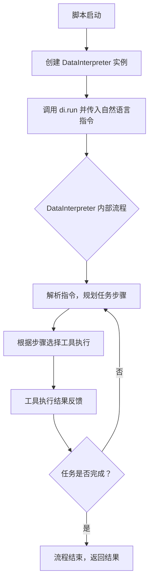
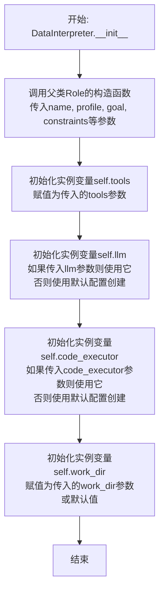

# `.\MetaGPT\examples\di\run_flask.py` 详细设计文档

该代码是一个使用 MetaGPT 框架的 DataInterpreter 角色的异步脚本。其核心功能是接收一个自然语言指令（要求创建一个 Flask 服务、配置 Conda 环境并验证接口），然后通过 DataInterpreter 代理，利用其集成的工具（如终端和编辑器）以分步、交互式的方式自动执行该复杂任务。

## 整体流程



## 类结构

```
main.py (入口脚本)
├── 全局常量: USE_GOT_REPO_REQ
├── 全局异步函数: main
└── 外部依赖类: DataInterpreter (来自 metagpt.roles.di.data_interpreter)
```

## 全局变量及字段


### `USE_GOT_REPO_REQ`
    
一个包含多行指令的字符串常量，用于定义DataInterpreter需要执行的任务：创建一个使用Flask的服务，配置Conda环境并运行服务，最后调用接口进行验证。

类型：`str`
    


    

## 全局函数及方法


### `main`

该函数是程序的异步入口点，它创建了一个`DataInterpreter`角色实例，并驱动其执行一个特定的任务请求。该请求要求使用Flask编写一个服务，创建并运行一个conda环境，并调用服务接口进行验证。

参数：
- 无显式参数。

返回值：`None`，该函数不返回任何值，其主要作用是启动并运行异步任务。

#### 流程图

```mermaid
flowchart TD
    A[程序入口: __name__ == '__main__'] --> B[调用 asyncio.run(main)]
    B --> C[进入 main 函数]
    C --> D[创建 DataInterpreter 实例 di]
    D --> E[调用 di.run 并传入任务请求]
    E --> F[DataInterpreter 执行任务<br>（可能涉及多步代码生成与执行）]
    F --> G[main 函数结束]
    G --> H[程序结束]
```

#### 带注释源码

```python
import asyncio

from metagpt.roles.di.data_interpreter import DataInterpreter

# 定义一个任务请求字符串，描述了需要DataInterpreter完成的具体任务。
USE_GOT_REPO_REQ = """
Write a service using Flask, create a conda environment and run it, and call the service's interface for validation.
Notice: Don't write all codes in one response, each time, just write code for one step.
"""
# 如果已经创建了conda环境，可以提示DataInterpreter使用该环境。
# I have created the conda environment '{env_name}', please use this environment to execute.


async def main():
    # 实例化DataInterpreter角色，并指定其可用的工具为“终端”和“编辑器”。
    di = DataInterpreter(tools=["Terminal", "Editor"])
    # 异步调用DataInterpreter的run方法，传入定义好的任务请求字符串，启动任务执行流程。
    await di.run(USE_GOT_REPO_REQ)


if __name__ == "__main__":
    # 程序主入口：使用asyncio.run来运行异步的main函数。
    asyncio.run(main())
```


### `DataInterpreter.__init__`

`DataInterpreter` 类的构造函数，用于初始化一个数据解释器实例。它负责设置解释器的基本属性，包括其名称、描述、使用的工具列表、语言模型配置、代码执行器配置以及工作目录等。

参数：

-  `name`：`str`，数据解释器的名称，默认为 "DataInterpreter"。
-  `profile`：`str`，数据解释器的角色描述，默认为 "Data Interpreter"。
-  `goal`：`str`，数据解释器的目标描述，默认为 "Interpret data and generate code."。
-  `constraints`：`str`，数据解释器的约束条件，默认为 "Ensure code is correct and efficient."。
-  `tools`：`list[str]`，数据解释器可使用的工具名称列表，例如 `["Terminal", "Editor"]`。
-  `llm`：`BaseLLM`，用于驱动数据解释器的语言模型实例，如果未提供，将使用默认配置创建。
-  `code_executor`：`BaseCodeExecutor`，用于执行生成代码的代码执行器实例，如果未提供，将使用默认配置创建。
-  `work_dir`：`str`，数据解释器的工作目录路径，用于存储生成的代码文件等。
-  `**kwargs`：`dict`，其他传递给父类 `Role` 构造函数的可选关键字参数。

返回值：`None`，构造函数不返回任何值。

#### 流程图



#### 带注释源码

```python
def __init__(
    self,
    name: str = "DataInterpreter",
    profile: str = "Data Interpreter",
    goal: str = "Interpret data and generate code.",
    constraints: str = "Ensure code is correct and efficient.",
    tools: list[str] = None,
    llm: BaseLLM = None,
    code_executor: BaseCodeExecutor = None,
    work_dir: str = None,
    **kwargs,
):
    """
    初始化DataInterpreter实例。

    Args:
        name (str): 解释器的名称，默认为"DataInterpreter"。
        profile (str): 解释器的角色描述，默认为"Data Interpreter"。
        goal (str): 解释器的目标描述，默认为"Interpret data and generate code."。
        constraints (str): 解释器的约束条件，默认为"Ensure code is correct and efficient."。
        tools (list[str]): 解释器可使用的工具列表，例如["Terminal", "Editor"]。
        llm (BaseLLM): 语言模型实例。如果为None，将使用默认配置创建。
        code_executor (BaseCodeExecutor): 代码执行器实例。如果为None，将使用默认配置创建。
        work_dir (str): 工作目录路径。如果为None，将使用默认值。
        **kwargs: 其他传递给父类Role构造函数的参数。
    """
    # 调用父类Role的构造函数，传递基本角色属性
    super().__init__(name=name, profile=profile, goal=goal, constraints=constraints, **kwargs)

    # 初始化工具列表。如果未提供tools参数，则初始化为空列表。
    self.tools = tools if tools is not None else []

    # 初始化语言模型。
    # 如果调用者提供了llm实例，则直接使用它。
    # 否则，使用默认配置创建一个新的LLM实例。
    self.llm = llm if llm is not None else LLM()

    # 初始化代码执行器。
    # 如果调用者提供了code_executor实例，则直接使用它。
    # 否则，使用默认配置创建一个新的代码执行器实例。
    self.code_executor = (
        code_executor if code_executor is not None else CodeExecutor()
    )

    # 设置工作目录。
    # 如果调用者提供了work_dir，则使用它。
    # 否则，使用默认的工作目录路径。
    self.work_dir = work_dir if work_dir is not None else WORKSPACE_ROOT / "di_workspace"
```


### `DataInterpreter.run`

该方法是一个异步方法，是`DataInterpreter`角色的核心执行入口。它接收一个自然语言描述的任务需求，通过协调内部的工作流、工具（如终端、编辑器）和智能体（如`Planner`和`Coder`）来逐步分解、规划并执行任务，最终完成任务目标。其执行过程是一个循环的计划-执行-反思的迭代过程。

参数：

-  `instruction`：`str`，一个描述任务目标的自然语言字符串。例如，要求创建一个Flask服务并验证其接口。

返回值：`None`，此方法不返回任何值，其主要作用是通过执行一系列操作来完成指令。

#### 流程图

```mermaid
flowchart TD
    A[开始: run(instruction)] --> B[初始化消息历史<br>添加用户指令]
    B --> C{循环条件: 任务未完成?}
    C -- 是 --> D[调用Planner<br>生成或更新计划]
    D --> E[调用Coder<br>根据计划生成代码]
    E --> F[执行生成的代码<br>使用工具如Terminal, Editor]
    F --> G[收集执行结果<br>更新消息历史]
    G --> H[反思执行结果<br>判断任务是否完成]
    H --> C
    C -- 否 --> I[结束]
```

#### 带注释源码

```python
async def run(self, instruction: str) -> None:
    """
    异步执行方法，是DataInterpreter角色的主要运行逻辑。
    它处理用户指令，通过迭代的计划-执行-反思循环来完成任务。

    Args:
        instruction (str): 用户提供的任务描述。
    """
    # 1. 初始化消息历史，将用户指令作为第一条消息加入。
    self._init_actions([Planner, Coder])  # 初始化Planner和Coder动作
    self._set_state(0)  # 设置初始状态
    self.working_memory.add(Message(role="user", content=instruction, cause_by=UserRequirement))

    # 2. 进入主循环，持续执行直到任务被标记为完成。
    while not self.working_memory.is_idle:
        # 2.1 触发Planner动作，根据当前上下文（消息历史）生成或细化任务执行计划。
        plan = await self.planner.run(with_messages=self.working_memory.get())
        # 将Planner生成的计划添加到工作记忆中。
        self.working_memory.add(plan)

        # 2.2 触发Coder动作，根据Planner生成的计划，编写具体的可执行代码。
        code = await self.coder.run(with_messages=self.working_memory.get())
        # 将Coder生成的代码添加到工作记忆中。
        self.working_memory.add(code)

        # 2.3 执行Coder生成的代码。这里会调用配置的工具（如Terminal执行命令，Editor编辑文件）。
        result = await self.execute_code(code)
        # 将代码执行的结果添加到工作记忆中，作为下一步规划的上下文。
        self.working_memory.add(result)

        # 2.4 反思阶段：评估当前执行结果，判断任务是否完成或是否需要调整计划。
        # 例如，检查服务是否成功启动，接口调用是否返回预期结果。
        # 这个判断逻辑可能内嵌在`self.working_memory.is_idle`的状态更新中，
        # 或者由某个特定的消息（如包含“任务完成”标识）来触发循环结束。
        # 代码示例中未展示具体反思逻辑，但这是循环能结束的关键。
```


## 关键组件


### DataInterpreter

一个基于智能体（Agent）的代码生成与执行框架，它接收自然语言需求，通过规划、工具调用（如终端命令、代码编辑）和迭代执行来完成任务。

### asyncio 异步事件循环

Python 内置的异步 I/O 库，用于管理 DataInterpreter 的异步执行流程，确保在等待工具调用（如长时间运行的终端命令）时不会阻塞主线程。

### Terminal 工具

DataInterpreter 可调用的工具之一，用于在宿主操作系统的终端中执行 shell 命令，例如创建 Conda 环境、安装依赖或启动服务。

### Editor 工具

DataInterpreter 可调用的工具之一，用于在项目文件中创建、读取、修改和保存代码文件，例如编写 Flask 应用代码或配置文件。


## 问题及建议


### 已知问题

-   **硬编码的工具列表**：`DataInterpreter` 实例化时，工具列表 `["Terminal", "Editor"]` 被硬编码在代码中。这降低了代码的灵活性和可配置性，如果需要更换或增减工具，必须修改源代码。
-   **缺乏错误处理机制**：`main` 函数和 `di.run` 调用周围没有 `try-except` 块。如果异步任务执行过程中出现异常（例如，工具执行失败、网络问题、环境配置错误），程序会直接崩溃，无法提供有意义的错误信息或进行优雅的降级处理。
-   **需求字符串冗长且内嵌**：需求描述 `USE_GOT_REPO_REQ` 作为多行字符串直接写在代码文件中。对于复杂或频繁变更的需求，这种方式难以维护，也不利于将需求与代码逻辑分离。
-   **潜在的异步任务管理问题**：代码使用 `asyncio.run(main())` 启动事件循环。如果 `DataInterpreter.run` 内部启动了长时间运行或未正确管理的后台任务，在主任务完成后，这些任务可能无法被正确清理，导致资源泄漏或程序无法正常退出。

### 优化建议

-   **将工具配置外部化**：建议将工具列表（如 `["Terminal", "Editor"]`）移至配置文件（如 YAML、JSON）或通过环境变量注入。这样可以在不修改代码的情况下调整 `DataInterpreter` 的能力，便于不同环境（开发、测试、生产）的差异化配置。
-   **增强异常处理与日志记录**：在 `main` 函数中包裹 `try-except` 块，捕获可能发生的异常，并记录详细的错误日志（包括堆栈信息）。对于可预见的错误（如特定工具不可用），可以提供更友好的提示或执行备用方案。
-   **分离需求描述**：考虑将 `USE_GOT_REPO_REQ` 这类需求描述移至独立的文档文件（如 `requirements.md` 或 `prompts/` 目录下）。代码通过读取文件来获取需求，提高可维护性，并支持动态加载不同的需求。
-   **改进异步任务生命周期管理**：确保 `DataInterpreter.run` 方法内部启动的所有异步任务都能被正确追踪和等待。在 `main` 函数中，可以考虑使用 `asyncio.gather` 或类似机制来管理多个任务，并确保在程序退出前所有任务都已妥善完成或取消。对于长时间运行的服务，实现优雅关闭（Graceful Shutdown）的信号处理逻辑。
-   **添加代码注释与类型提示**：虽然当前代码简单，但为函数（尤其是 `main`）和关键变量添加清晰的注释和类型提示，可以提高代码的可读性和可维护性，便于其他开发者理解。


## 其它


### 设计目标与约束

本代码的设计目标是创建一个能够根据自然语言指令（`USE_GOT_REPO_REQ`）自动执行复杂任务（如创建Flask服务、管理Conda环境）的代理程序。其核心约束包括：1) 采用异步编程模型以提高I/O密集型任务（如工具调用）的效率；2) 通过`DataInterpreter`角色将高层指令分解为可执行的原子步骤；3) 依赖外部工具（`Terminal`, `Editor`）来执行具体的系统操作和代码编辑；4) 遵循“分步执行”的原则，每次只生成并执行一个步骤的代码，以实现可控的迭代过程。

### 错误处理与异常设计

代码的顶层错误处理依赖于`asyncio.run()`，它会捕获并处理主协程`main()`中未处理的异常。在`DataInterpreter.run()`方法内部，预期会包含对工具调用失败、指令解析错误、环境操作异常（如Conda环境创建失败）等情况的处理逻辑。然而，当前代码片段并未显式展示错误处理机制，这构成了一个潜在的技术债务。理想情况下，应设计重试机制、用户友好的错误信息反馈以及任务状态的回滚或恢复策略。

### 数据流与状态机

数据流始于用户提供的自然语言指令`USE_GOT_REPO_REQ`。`DataInterpreter`作为核心处理器，接收该指令，并将其解析、规划成一系列有序的“动作”（Action）。每个动作对应一个工具（如`Terminal.execute`, `Editor.edit`）的调用，并附带具体参数。工具执行后产生结果（输出、状态码、文件变更等），该结果作为上下文反馈给`DataInterpreter`，用于生成下一个动作，形成一个“规划-执行-观察”的循环，直至任务被判定为完成或失败。`DataInterpreter`内部应维护一个任务执行的状态机，跟踪当前步骤、历史动作和累积的上下文。

### 外部依赖与接口契约

1.  **外部工具**：代码显式依赖`Terminal`和`Editor`工具。这些工具需要提供稳定的接口（如`execute(command: str) -> str`， `edit(file_path: str, content: str) -> bool`）供`DataInterpreter`调用，并能够在其执行环境中可靠运行。
2.  **异步运行时**：依赖Python的`asyncio`库作为异步任务的基础运行时环境。
3.  **`DataInterpreter`类**：作为来自`metagpt`框架的核心组件，它遵循一个隐含的接口契约：必须实现一个异步的`run(instruction: str)`方法，该方法接受指令并驱动整个任务执行流程。
4.  **系统环境**：任务执行依赖于底层的操作系统（支持Conda和Flask）和Python环境。`USE_GOT_REPO_REQ`中的提示表明，代码期望能与用户进行关于Conda环境名称的交互，这定义了一个简单的人机交互契约。

### 安全与权限考量

代码通过`Terminal`工具执行任意Shell命令，这带来了显著的安全风险（如命令注入）。当前设计未显示任何输入验证、命令白名单或权限隔离机制。在生产环境中，必须考虑在沙箱环境（如Docker容器）中运行此类代理，严格限制其可访问的系统资源和可执行的命令范围，并对用户指令和生成的命令进行安全审计。

### 配置与可扩展性

系统的行为主要通过两个入口配置：1) 传递给`DataInterpreter`构造函数的`tools`列表，决定了代理可用的能力集；2) `USE_GOT_REPO_REQ`指令文本，定义了具体任务。这种设计提供了基础的可扩展性：可以通过开发并注册新的工具类来扩展代理的能力。然而，`DataInterpreter`本身的规划与决策逻辑（如如何分解指令、选择工具）很可能是硬编码或通过模型驱动的，其可配置性和可调优性未在代码中体现。

    