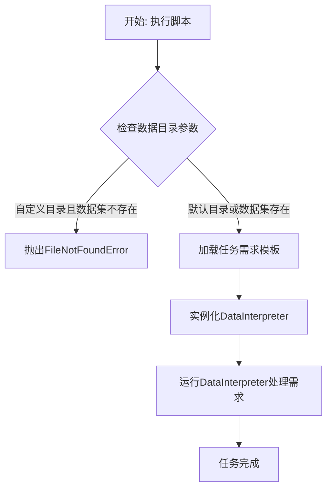

# `.\MetaGPT\examples\di\run_ml_benchmark.py` 详细设计文档

该代码是一个使用DataInterpreter角色执行机器学习基准测试任务的示例脚本。它通过加载特定任务的需求描述，配置并运行一个具备工具推荐和反思能力的DataInterpreter，以自动化完成数据分析和机器学习任务。

## 整体流程



## 类结构

```
外部依赖与调用
├── fire (命令行接口)
├── DataInterpreter (来自metagpt.roles.di.data_interpreter)
├── TypeMatchToolRecommender (来自metagpt.tools.tool_recommend)
└── ML_BENCHMARK_REQUIREMENTS (来自examples.di.requirements_prompt)
```

## 全局变量及字段


### `DATA_PATH`
    
一个常量字符串，定义了项目中数据文件的默认存储路径。

类型：`str`
    


### `ML_BENCHMARK_REQUIREMENTS`
    
一个字典，其键为机器学习基准测试任务名称，值为对应任务的格式化需求描述字符串。

类型：`Dict[str, str]`
    


    

## 全局函数及方法

### `main`

该函数是DataInterpreter（数据解释器）在ML-Benchmark任务上的主要执行入口。它负责加载指定任务的需求，初始化DataInterpreter角色，并运行该角色以完成数据解释与分析任务。

参数：

- `task_name`：`str`，指定要执行的ML-Benchmark任务名称，用于从预定义的需求字典中获取对应的任务描述。
- `data_dir`：`str`，默认为`DATA_PATH`，指定数据集存放的根目录路径。如果提供了自定义路径，函数会检查该路径下是否存在ML-Benchmark数据集。
- `use_reflection`：`bool`，默认为`True`，控制DataInterpreter是否启用自我反思（reflection）功能，以改进其决策过程。

返回值：`None`，该函数为异步执行函数，不返回具体值，其主要作用是通过`DataInterpreter.run`方法驱动任务执行。

#### 流程图

```mermaid
flowchart TD
    A[开始: main(task_name, data_dir, use_reflection)] --> B{data_dir 是否为默认 DATA_PATH?};
    B -- 否 --> C[检查 data_dir/ml_benchmark 是否存在];
    C --> D{目录是否存在?};
    D -- 否 --> E[抛出 FileNotFoundError];
    D -- 是 --> F;
    B -- 是 --> F[从 ML_BENCHMARK_REQUIREMENTS 获取任务需求];
    F --> G[初始化 DataInterpreter];
    G --> H[异步执行 di.run(requirement)];
    H --> I[结束];
    E --> I;
```

#### 带注释源码

```python
async def main(task_name, data_dir=DATA_PATH, use_reflection=True):
    # 1. 数据路径验证：如果用户提供了自定义的 data_dir 且不是默认路径，则检查该路径下是否存在 ML-Benchmark 数据集。
    if data_dir != DATA_PATH and not os.path.exists(os.path.join(data_dir, "di_dataset/ml_benchmark")):
        # 如果数据集不存在，则抛出异常，提示用户下载数据集。
        raise FileNotFoundError(f"ML-Benchmark dataset not found in {data_dir}.")

    # 2. 需求获取：根据传入的 task_name，从预定义的全局字典 ML_BENCHMARK_REQUIREMENTS 中获取对应的任务需求字符串。
    #    并使用 format 方法将数据目录路径 data_dir 嵌入到需求描述中。
    requirement = ML_BENCHMARK_REQUIREMENTS[task_name].format(data_dir=data_dir)

    # 3. 角色初始化：创建一个 DataInterpreter 实例。
    #    - use_reflection: 使用传入的参数控制是否启用反思。
    #    - tool_recommender: 配置一个 TypeMatchToolRecommender，并指定其可使用所有工具（"<all>"）。
    di = DataInterpreter(use_reflection=use_reflection, tool_recommender=TypeMatchToolRecommender(tools=["<all>"]))

    # 4. 任务执行：异步调用 DataInterpreter 实例的 run 方法，传入具体化的任务需求，开始执行数据解释任务。
    await di.run(requirement)
```

### `DataInterpreter.__init__`

该方法用于初始化一个`DataInterpreter`实例，配置其核心组件，包括是否启用反思机制、使用的工具推荐器、语言模型配置、动作列表以及执行上下文等。

参数：

- `use_reflection`：`bool`，指示是否启用反思机制，以改进任务执行过程中的决策。
- `tool_recommender`：`ToolRecommender`，工具推荐器实例，用于根据任务需求推荐合适的工具。
- `llm`：`BaseLLM`，语言模型实例，用于生成代码和解释。如果未提供，将使用默认配置。
- `plugins`：`list`，插件列表，用于扩展`DataInterpreter`的功能。
- `**kwargs`：`dict`，其他关键字参数，将传递给父类`Role`的初始化方法。

返回值：`None`，此方法不返回任何值，仅用于初始化实例。

#### 流程图


#### 带注释源码

```python
def __init__(
    self,
    use_reflection: bool = False,
    tool_recommender: ToolRecommender = None,
    llm: BaseLLM = None,
    plugins: list = None,
    **kwargs,
):
    """
    初始化DataInterpreter实例。
    
    Args:
        use_reflection (bool): 是否启用反思机制。
        tool_recommender (ToolRecommender): 工具推荐器实例。
        llm (BaseLLM): 语言模型实例，如果未提供则使用默认配置。
        plugins (list): 插件列表。
        **kwargs: 传递给父类Role的其他关键字参数。
    """
    # 设置是否启用反思机制
    self.use_reflection = use_reflection
    # 设置工具推荐器，如果未提供则创建默认的TypeMatchToolRecommender
    self.tool_recommender = tool_recommender or TypeMatchToolRecommender(tools=["<all>"])
    # 设置语言模型，如果未提供则使用配置的LLM
    self.llm = llm or LLM()
    # 设置插件列表，默认为空列表
    self.plugins = plugins or []

    # 调用父类Role的初始化方法，设置角色名称、职责和目标
    super().__init__(
        name="David",
        profile="Data Interpreter",
        goal="Generate code and fix error to complete the data task.",
        constraints="If you think certain libraries or tools are needed, ask the user to install them first.",
        **kwargs,
    )

    # 初始化_actions列表，包含DataInterpreter的核心动作：数据任务规划和代码执行
    self._init_actions([DataTaskPlan, DataTaskCoding])
    # 初始化执行上下文，用于存储任务执行过程中的状态和信息
    self._set_context()
```

### `DataInterpreter.run`

该方法执行DataInterpreter角色的主要工作流程，根据给定的需求（requirement）进行规划、执行代码并反思，以完成数据解释任务。

参数：

- `requirement`：`str`，描述需要完成的数据解释任务的需求文本。

返回值：`None`，该方法不返回任何值，执行结果通过角色内部状态或输出体现。

#### 流程图


#### 带注释源码

```python
async def run(self, requirement: str = ""):
    """
    运行DataInterpreter的主要工作流程。
    1. 重置内部状态。
    2. 根据需求进行规划。
    3. 循环执行动作和反思，直到任务完成或达到停止条件。
    """
    await self._reset()  # 重置角色状态，准备新的任务
    await self._plan(requirement)  # 根据需求制定执行计划
    while await self._is_idle():  # 检查是否还有待执行的动作
        await self._act()  # 执行当前计划中的动作（通常是运行代码）
        await self._reflect()  # 对执行结果进行反思，可能调整后续计划
```

### `TypeMatchToolRecommender.__init__`

该方法用于初始化 `TypeMatchToolRecommender` 类的实例。它接收一个可选的工具列表参数，并将其存储在实例中，以便后续根据类型匹配推荐工具。

参数：

- `tools`：`List[str]`，一个字符串列表，表示可供推荐的工具集合。默认值为 `["<all>"]`，表示使用所有可用的工具。

返回值：`None`，此方法不返回任何值，仅用于初始化实例。

#### 流程图

```mermaid
graph TD
    A[开始] --> B[接收 tools 参数]
    B --> C{是否提供 tools 参数?}
    C -->|是| D[使用提供的 tools 列表]
    C -->|否| E[使用默认值 ["<all>"]]
    D --> F[将 tools 赋值给 self.tools]
    E --> F
    F --> G[结束]
```

#### 带注释源码

```python
def __init__(self, tools: List[str] = ["<all>"]):
    """
    初始化 TypeMatchToolRecommender 实例。

    参数:
        tools (List[str]): 一个字符串列表，表示可供推荐的工具集合。
                           默认值为 ["<all>"]，表示使用所有可用的工具。
    """
    self.tools = tools  # 将传入的工具列表存储为实例变量
```

## 关键组件


### DataInterpreter

一个能够理解自然语言需求、规划并执行任务（特别是数据科学和机器学习任务）的智能代理角色，它通过工具推荐和反射机制来动态选择和优化其行动。

### TypeMatchToolRecommender

一个工具推荐器，根据任务类型和上下文，从可用工具集中推荐最合适的工具，支持使用"<all>"来指定使用所有可用工具。

### ML_BENCHMARK_REQUIREMENTS

一个包含特定机器学习基准任务（ML-Benchmark）需求的字典或映射结构，能够根据任务名称（task_name）获取对应的、格式化的需求字符串。

### fire.Fire

一个用于将Python程序快速转换为命令行接口（CLI）的库，它自动解析函数参数并将其映射到命令行参数，简化了脚本的入口点定义。


## 问题及建议


### 已知问题

-   **硬编码的依赖路径**：代码中硬编码了 `DATA_PATH` 作为默认数据目录，并在检查路径时拼接了固定的子路径 `"di_dataset/ml_benchmark"`。这使得代码的灵活性降低，难以适应不同的项目结构或部署环境。
-   **工具推荐器配置不明确**：`TypeMatchToolRecommender(tools=["<all>"])` 中的 `"<all>"` 是一个魔术字符串，其具体含义和背后加载的工具范围不明确，缺乏文档说明，可能导致维护和理解上的困难。
-   **异常信息不够具体**：当数据集未找到时，抛出的 `FileNotFoundError` 信息虽然指出了目录，但没有给出明确的解决建议（例如，如何下载数据集或正确的目录结构应该是怎样的），对用户不够友好。
-   **缺乏输入验证**：`task_name` 参数直接用于从 `ML_BENCHMARK_REQUIREMENTS` 字典中取值，如果传入的 `task_name` 不存在于字典中，将引发 `KeyError`，代码没有对此进行前置检查或提供清晰的错误处理。
-   **同步与异步混合的入口点**：主函数 `main` 被定义为 `async`，但通过 `fire.Fire(main)` 调用。虽然 `fire` 可能支持异步函数，但这种模式在命令行工具中不常见，可能引发意料之外的执行流程问题或对不熟悉异步的用户造成困惑。

### 优化建议

-   **解耦路径配置**：将数据目录的基准路径（`DATA_PATH`）和数据集相对路径（如 `"di_dataset/ml_benchmark"`）作为可配置参数，或通过一个专门的配置类/函数来管理，提高代码的可测试性和可移植性。
-   **明确化工具配置**：将 `"<all>"` 这样的魔术字符串替换为有明确意义的常量（如 `ALL_TOOLS`），并补充文档说明其代表加载的工具范围。或者，提供一个更清晰的接口来指定需要加载的工具子集。
-   **增强异常处理与用户引导**：在抛出 `FileNotFoundError` 时，可以提供更详细的错误信息，包括数据集预期的存放位置、可能的下载方式或官方文档链接。同时，捕获 `KeyError` 并对无效的 `task_name` 提供友好的错误提示，列出所有可用的任务名称。
-   **增加输入参数验证**：在函数开始处，验证 `task_name` 是否在 `ML_BENCHMARK_REQUIREMENTS` 的键中。验证 `data_dir` 路径是否存在且具有适当的读写权限。
-   **重新考虑异步调用方式**：如果这是一个主要的命令行入口脚本，考虑将 `main` 函数改为同步函数，内部使用 `asyncio.run()` 来调用真正的异步逻辑。或者，明确文档说明需要使用支持异步的 `fire` 调用方式（如果存在），并提供一个同步的包装器作为备选入口点。
-   **添加类型注解**：为函数参数和返回值添加更详细的类型注解（例如，`task_name: str`），并考虑使用 `TypedDict` 或 `Literal` 来限定 `task_name` 的有效值范围，这有助于静态类型检查和提高代码可读性。


## 其它


### 设计目标与约束

本代码的设计目标是提供一个命令行接口，用于执行基于特定任务名称的机器学习基准测试（ML-Benchmark）的数据解释任务。其核心约束包括：
1.  **任务驱动**：通过外部传入的 `task_name` 参数，动态加载对应的任务需求描述。
2.  **数据依赖**：执行依赖于外部的 ML-Benchmark 数据集，代码需验证数据集路径的有效性。
3.  **工具集成**：利用 `DataInterpreter` 角色，并集成 `TypeMatchToolRecommender` 来推荐和使用所有可用工具，以自动化完成数据解释与分析工作流。
4.  **异步执行**：主逻辑设计为异步函数，以适应底层可能存在的异步 I/O 操作。
5.  **命令行友好**：使用 `fire` 库自动生成命令行接口，简化用户调用。

### 错误处理与异常设计

代码中的错误处理主要集中于数据准备阶段的验证：
1.  **文件未找到异常**：在 `main` 函数中，检查用户自定义的 `data_dir` 路径下是否存在 ML-Benchmark 数据集。如果不存在，则抛出 `FileNotFoundError` 并给出明确提示。这确保了核心依赖在任务执行前已就位。
2.  **键错误（隐式）**：`ML_BENCHMARK_REQUIREMENTS[task_name]` 可能因 `task_name` 不存在而引发 `KeyError`。此异常未在代码中显式捕获，将导致程序终止，这符合“快速失败”原则，提示用户输入了无效的任务名。
3.  **运行时异常**：`DataInterpreter.run()` 方法在执行复杂的数据解释管道时可能抛出各种运行时异常（如工具执行错误、资源不足等）。这些异常会向上传播，由调用者（或 `fire` 库）处理，通常表现为命令执行失败并打印错误栈。

### 数据流与状态机

1.  **数据流**：
    *   **输入**：用户通过命令行提供 `task_name`（必需）和可选的 `data_dir`、`use_reflection` 参数。
    *   **处理**：
        *   验证 `data_dir` 路径下的数据集。
        *   根据 `task_name` 从 `ML_BENCHMARK_REQUIREMENTS` 字典中获取对应的需求模板，并用 `data_dir` 格式化，生成具体的任务需求字符串 (`requirement`)。
        *   实例化 `DataInterpreter` 角色，配置其使用反射和全量工具推荐器。
        *   将 `requirement` 传递给 `DataInterpreter.run()` 方法，启动异步执行。
    *   **输出**：`DataInterpreter` 执行的结果（如生成的分析报告、模型、图表等）会输出到控制台或指定的文件中（具体行为由 `DataInterpreter` 内部实现决定）。

2.  **状态机（简化）**：
    程序本身没有复杂的状态机。核心状态转移发生在 `DataInterpreter` 内部，其可能的状态包括：`初始化` -> `规划任务` -> `选择与执行工具` -> `（可选）反思与迭代` -> `生成最终结果` -> `完成`。本脚本主要负责触发并等待这个内部流程的完成。

### 外部依赖与接口契约

1.  **外部依赖**：
    *   **Python 库**：
        *   `os`：用于路径操作和文件存在性检查。
        *   `fire`：用于自动生成命令行接口。
        *   `metagpt`：核心框架，依赖其中的 `DataInterpreter` 角色、常量 `DATA_PATH`、工具推荐器 `TypeMatchToolRecommender` 以及需求提示模块 `examples.di.requirements_prompt`。
    *   **数据**：ML-Benchmark 数据集。其存储路径由常量 `DATA_PATH` 或用户输入的 `data_dir` 指定，预期在该路径下存在 `di_dataset/ml_benchmark` 目录结构。

2.  **接口契约**：
    *   `main` 函数：
        *   **输入契约**：接受 `task_name: str`, `data_dir: str = DATA_PATH`, `use_reflection: bool = True`。
        *   **行为契约**：验证数据路径，构造需求，运行 `DataInterpreter`，并等待其完成。
        *   **输出契约**：异步函数，无显式返回值。执行结果通过 `DataInterpreter` 输出。
    *   `ML_BENCHMARK_REQUIREMENTS` 字典：预期是一个全局字典，其键为任务名称（字符串），值为可格式化的需求字符串模板，其中包含 `{data_dir}` 占位符。
    *   `DataInterpreter` 类：预期提供异步的 `run(requirement: str)` 方法，能够根据需求字符串执行数据解释任务。
    *   `TypeMatchToolRecommender` 类：预期在实例化时能接受 `tools` 参数，配置为 `["<all>"]` 时表示推荐所有可用工具。

### 配置与常量

1.  **常量**：
    *   `DATA_PATH`：从 `metagpt.const` 导入，定义了项目默认的数据根目录路径。
    *   `ML_BENCHMARK_REQUIREMENTS`：从 `examples.di.requirements_prompt` 导入，是一个字典，存储了所有 ML-Benchmark 任务的需求模板。

2.  **配置点**：
    *   `data_dir`：用户可通过命令行参数覆盖默认的数据路径。
    *   `use_reflection`：用户可通过命令行参数控制 `DataInterpreter` 是否启用反思机制。
    *   `tool_recommender`：在代码中硬编码为 `TypeMatchToolRecommender(tools=["<all>"])`，这意味着始终使用类型匹配推荐器并加载全部工具。这是一个设计上的配置选择，未暴露给用户。

### 部署与运行说明

1.  **环境准备**：需要安装 `metagpt` 及其所有依赖项。确保 Python 环境支持异步操作。
2.  **数据准备**：必须提前将 ML-Benchmark 数据集下载并放置于正确位置。默认位置是 `DATA_PATH/di_dataset/ml_benchmark`。用户可以通过 `--data_dir` 参数指定自定义路径。
3.  **运行方式**：
    *   直接运行脚本：`python script.py <task_name> [--data_dir DIR] [--use_reflection True/False]`
    *   由于使用了 `fire.Fire(main)`，`task_name` 作为位置参数，`data_dir` 和 `use_reflection` 作为可选命名参数。
4.  **任务列表**：可用的 `task_name` 列表由 `ML_BENCHMARK_REQUIREMENTS` 字典的键决定。用户需要事先知道有效的任务名称。

    