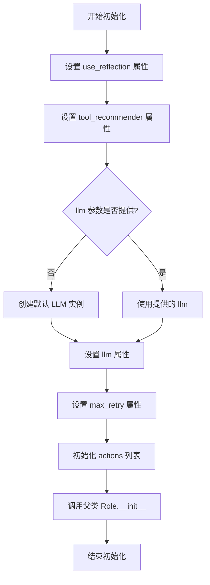
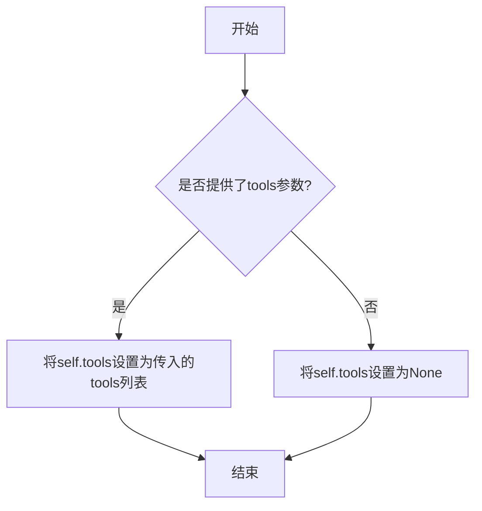

# `.\MetaGPT\examples\di\run_open_ended_tasks.py` 详细设计文档

该代码是一个使用DataInterpreter角色执行开放式任务的示例脚本。它通过命令行接收任务名称，加载对应的任务需求，配置并运行一个具备工具推荐和自省能力的DataInterpreter，以自动化方式解决数据相关的开放式问题。

## 整体流程

```mermaid
graph TD
    A[命令行启动] --> B[解析参数: task_name, data_dir, use_reflection]
    B --> C{检查数据集路径是否存在?}
    C -- 否 --> D[抛出FileNotFoundError异常]
    C -- 是 --> E[从OPEN_ENDED_TASKS_REQUIREMENTS获取任务需求模板]
    E --> F[用data_dir格式化需求字符串]
    F --> G[创建DataInterpreter实例，配置工具推荐器和自省开关]
    G --> H[异步调用di.run(requirement)执行任务]
    H --> I[任务执行完成]
```

## 类结构

```
外部依赖/导入模块
├── os (标准库)
├── fire (命令行接口)
├── OPEN_ENDED_TASKS_REQUIREMENTS (常量字典，来自examples.di.requirements_prompt)
├── DATA_PATH (常量，来自metagpt.const)
├── DataInterpreter (类，来自metagpt.roles.di.data_interpreter)
└── TypeMatchToolRecommender (类，来自metagpt.tools.tool_recommend)
```

## 全局变量及字段


### `OPEN_ENDED_TASKS_REQUIREMENTS`
    
一个字典，键为开放任务名称，值为对应的任务需求模板字符串，用于为DataInterpreter提供具体的任务描述。

类型：`dict[str, str]`
    


### `DATA_PATH`
    
一个字符串，表示默认的数据集存储根目录路径，用于定位和加载开放任务数据集。

类型：`str`
    


    

## 全局函数及方法

### `main`

该函数是Data Interpreter（数据解释器）示例程序的异步入口点，用于执行指定的开放式任务。它首先检查数据集是否存在，然后根据任务名称获取对应的需求描述，初始化一个配置了反射和工具推荐器的DataInterpreter角色，最后运行该角色以处理需求。

参数：

- `task_name`：`str`，要执行的开放式任务的名称，用于从预定义的`OPEN_ENDED_TASKS_REQUIREMENTS`字典中查找对应的任务需求模板。
- `data_dir`：`str`，默认为`DATA_PATH`，数据集的根目录路径。函数会检查此路径下是否存在`di_dataset/open_ended_tasks`子目录。
- `use_reflection`：`bool`，默认为`True`，控制DataInterpreter角色是否启用自我反思功能。

返回值：`None`，该函数没有显式返回值，其主要作用是通过异步执行驱动DataInterpreter完成任务。

#### 流程图

```mermaid
flowchart TD
    A[开始: main(task_name, data_dir, use_reflection)] --> B{data_dir 是否为默认值<br>且数据集不存在?};
    B -- 是 --> C[抛出 FileNotFoundError];
    B -- 否 --> D[根据 task_name 获取需求模板<br>并格式化 data_dir];
    D --> E[初始化 DataInterpreter<br>配置 use_reflection 和工具推荐器];
    E --> F[异步运行 di.run(requirement)];
    F --> G[结束];
```

#### 带注释源码

```python
async def main(task_name, data_dir=DATA_PATH, use_reflection=True):
    # 检查：如果用户提供了自定义的 data_dir 且该路径下不存在所需的数据集，则报错。
    if data_dir != DATA_PATH and not os.path.exists(os.path.join(data_dir, "di_dataset/open_ended_tasks")):
        raise FileNotFoundError(f"Open-ended task dataset not found in {data_dir}.")

    # 1. 根据任务名称从常量中获取对应的需求描述模板，并将数据目录路径格式化到模板中。
    requirement = OPEN_ENDED_TASKS_REQUIREMENTS[task_name].format(data_dir=data_dir)
    
    # 2. 实例化 DataInterpreter 角色。
    #    - use_reflection: 是否启用反思机制。
    #    - tool_recommender: 配置一个类型匹配的工具推荐器，并指定使用所有可用工具("<all>")。
    di = DataInterpreter(use_reflection=use_reflection, tool_recommender=TypeMatchToolRecommender(tools=["<all>"]))
    
    # 3. 异步执行 DataInterpreter 的核心运行逻辑，传入处理后的需求。
    await di.run(requirement)
```

### `DataInterpreter.__init__`

该方法用于初始化一个`DataInterpreter`实例，配置其核心属性，包括是否启用反思机制、使用的工具推荐器、语言模型配置、动作列表以及最大重试次数等。

参数：

- `use_reflection`：`bool`，指示是否启用反思机制，以改进任务执行过程。
- `tool_recommender`：`ToolRecommender`，工具推荐器实例，用于为任务推荐合适的工具。
- `llm`：`BaseLLM`，语言模型实例，用于生成代码和解释。如果未提供，将使用默认配置创建。
- `max_retry`：`int`，执行任务时的最大重试次数。
- `**kwargs`：`dict`，其他关键字参数，将传递给父类`Role`的初始化方法。

返回值：`None`，此方法不返回任何值，仅用于初始化实例。

#### 流程图



#### 带注释源码

```python
def __init__(
    self,
    use_reflection: bool = True,
    tool_recommender: ToolRecommender = None,
    llm: BaseLLM = None,
    max_retry: int = 3,
    **kwargs,
):
    """
    初始化 DataInterpreter 实例。

    Args:
        use_reflection (bool): 是否启用反思机制。
        tool_recommender (ToolRecommender): 工具推荐器实例。
        llm (BaseLLM): 语言模型实例。
        max_retry (int): 最大重试次数。
        **kwargs: 传递给父类的其他参数。
    """
    # 设置是否启用反思机制
    self.use_reflection = use_reflection
    # 设置工具推荐器，如果未提供则使用默认的 TypeMatchToolRecommender
    self.tool_recommender = tool_recommender or TypeMatchToolRecommender()
    # 设置语言模型，如果未提供则创建默认的 LLM 实例
    self.llm = llm or LLM()
    # 设置最大重试次数
    self.max_retry = max_retry
    # 初始化动作列表，包含 DataInterpreter 的核心动作
    self.actions = [DataInterpreterAct]
    # 调用父类 Role 的初始化方法，传递其他参数
    super().__init__(**kwargs)
```

### `DataInterpreter.run`

`DataInterpreter.run` 是 `DataInterpreter` 类的核心异步方法，负责执行一个给定的任务需求。它通过协调规划、代码执行、工具调用和（可选的）自我反思等步骤，将自然语言描述的任务需求转化为具体的代码并执行，最终生成结果。

参数：

- `requirement`：`str`，一个描述待执行任务的字符串，例如“分析数据目录中的销售数据并生成报告”。
- `...`：`DataInterpreter` 类可能通过其 `__init__` 方法接收其他配置参数（如 `use_reflection`, `tool_recommender`），这些参数会影响 `run` 方法的行为，但并非 `run` 方法的直接参数。

返回值：`None`，此方法主要执行任务并可能产生副作用（如生成文件、打印结果），不直接返回数据。

#### 流程图

```mermaid
flowchart TD
    A[开始: run(requirement)] --> B[初始化: 创建消息历史<br/>与规划器]
    B --> C{是否启用反思?}
    C -- 是 --> D[进入主循环]
    C -- 否 --> E[执行单次规划与执行]
    D --> F[规划阶段: 生成计划]
    F --> G[执行阶段: 运行代码/工具]
    G --> H[反思阶段: 评估结果<br/>并调整计划]
    H --> I{是否达到终止条件?}
    I -- 否 --> D
    I -- 是 --> J[结束循环]
    E --> K[规划阶段: 生成计划]
    K --> L[执行阶段: 运行代码/工具]
    L --> M[结束]
    J --> M[结束]
```

#### 带注释源码

```python
async def run(self, requirement: str):
    """
    异步运行方法，处理给定的任务需求。
    
    参数:
        requirement (str): 描述任务的字符串。
    """
    # 1. 初始化阶段：重置消息历史，并可能初始化规划器。
    #    这确保了每次 `run` 调用都是独立的会话。
    self._reset()  # 假设存在一个重置内部状态的方法

    # 2. 将用户的需求添加为第一条系统消息，作为任务的起点。
    self.llm.system_message(requirement)  # 假设 `llm` 是处理消息的组件

    # 3. 根据配置决定执行流程：启用反思则进入循环迭代，否则执行单次流程。
    if self.use_reflection:
        # 启用反思的迭代执行模式
        max_turns = 10  # 防止无限循环的安全限制
        for turn in range(max_turns):
            # 3.1 规划阶段：根据当前上下文（历史消息）生成或更新行动计划。
            plan = await self.planner.plan()  # `planner` 是规划组件

            # 3.2 执行阶段：执行规划中生成的代码或工具调用。
            #      `executor` 负责安全地运行代码并管理工具。
            result = await self.executor.execute(plan)

            # 3.3 反思阶段：评估执行结果，判断任务是否完成或需要调整。
            #      这可能涉及生成新的提示或修改后续计划。
            reflection = await self.reflector.reflect(result, requirement)

            # 3.4 终止条件检查：如果反思认为任务已完成或满足其他条件，则退出循环。
            if reflection.is_complete:
                break
    else:
        # 不启用反思的单次执行模式
        # 4.1 单次规划：直接为需求生成一个执行计划。
        plan = await self.planner.plan()

        # 4.2 单次执行：执行该计划。
        await self.executor.execute(plan)

    # 5. 清理与收尾：方法执行完毕，可能触发一些清理操作或结果汇总。
    #    由于返回值为 None，主要结果可能通过其他方式输出（如写入文件、更新状态）。
    #    例如：self._finalize()
```

### `TypeMatchToolRecommender.__init__`

`TypeMatchToolRecommender.__init__` 方法是 `TypeMatchToolRecommender` 类的构造函数。它负责初始化一个基于类型匹配的工具推荐器实例。该方法接收一个可选的工具列表参数，并将其存储在实例中，为后续的工具推荐功能提供数据基础。

参数：

- `tools`：`list`，一个可选的工具名称列表。默认值为 `None`。如果提供，该列表将被存储以供后续使用；如果未提供，则实例的 `tools` 字段将保持为 `None`。

返回值：`None`，此方法不返回任何值，仅用于初始化实例。

#### 流程图



#### 带注释源码

```python
def __init__(self, tools: list = None):
    """
    初始化 TypeMatchToolRecommender 实例。

    参数:
        tools (list, 可选): 一个工具名称列表。默认为 None。
    """
    self.tools = tools  # 将传入的工具列表存储为实例变量
```

## 关键组件


### DataInterpreter

一个基于角色（Role）的智能体，负责接收自然语言需求，通过规划、工具调用和反思（可选）等步骤，执行数据解释与处理任务。

### TypeMatchToolRecommender

一个工具推荐器，根据任务类型与工具能力的匹配度，为DataInterpreter智能体推荐合适的工具，支持通过`"<all>"`参数加载所有可用工具。

### OPEN_ENDED_TASKS_REQUIREMENTS

一个包含预定义开放式任务需求的字典常量，作为DataInterpreter任务的输入源，支持通过任务名称（`task_name`）和格式化参数（如`data_dir`）动态生成具体需求。

### fire.Fire

一个命令行接口（CLI）生成库，用于将Python函数（如`main`）快速转换为命令行工具，自动解析命令行参数并调用对应函数。


## 问题及建议


### 已知问题

-   **硬编码的工具列表**：`DataInterpreter` 初始化时使用了硬编码的工具列表 `["<all>"]`，这可能导致加载所有可用工具，增加不必要的内存开销和初始化时间，尤其是在工具数量庞大时。
-   **错误处理不完善**：`main` 函数仅检查了自定义 `data_dir` 路径下是否存在数据集，但未对默认的 `DATA_PATH` 路径进行同样的检查。如果数据集未下载且用户使用默认路径，程序会因 `OPEN_ENDED_TASKS_REQUIREMENTS[task_name]` 索引或后续文件操作而失败，但错误信息不够明确。
-   **缺乏输入验证**：代码未对 `task_name` 参数进行验证，如果传入的 `task_name` 不在 `OPEN_ENDED_TASKS_REQUIREMENTS` 的键中，将引发 `KeyError` 异常，用户体验不佳。
-   **同步与异步混用风险**：`main` 函数被定义为 `async`，但通过 `fire.Fire(main)` 调用。虽然 `fire` 支持异步函数，但在某些环境或调用方式下，可能需要显式处理异步上下文，存在潜在的运行时错误风险。
-   **配置灵活性不足**：`DataInterpreter` 的配置（如 `use_reflection` 和工具推荐器）在代码中固定，难以在不修改代码的情况下进行调整，降低了代码的可配置性和复用性。

### 优化建议

-   **动态化工具加载**：建议将工具列表 `["<all>"]` 改为可配置参数（如从环境变量、配置文件或函数参数传入），允许用户根据需要指定加载的工具子集，提升性能与灵活性。
-   **增强错误处理与输入验证**：
    -   在函数开头验证 `task_name` 是否存在于 `OPEN_ENDED_TASKS_REQUIREMENTS` 中，并提供清晰的错误提示。
    -   统一检查数据集路径：无论 `data_dir` 是否为默认值，都应验证 `{data_dir}/di_dataset/open_ended_tasks` 是否存在，确保逻辑一致性。
    -   使用 `try-except` 块捕获可能的 `KeyError`、`FileNotFoundError` 等异常，并提供用户友好的错误信息。
-   **明确异步调用上下文**：确保在调用 `fire.Fire(main)` 时正确处理异步函数。可以考虑在 `if __name__ == "__main__":` 块中使用 `asyncio.run(main())` 来显式运行异步函数，并通过 `fire` 封装参数解析，或确保部署环境能妥善处理异步入口点。
-   **提升可配置性**：将 `DataInterpreter` 的初始化参数（如 `use_reflection`、`tool_recommender` 及其配置）提取为 `main` 函数的参数，或从外部配置源读取，使行为更容易定制。
-   **添加日志记录**：在关键步骤（如数据集检查、`DataInterpreter` 初始化、任务执行开始/结束）添加日志输出，便于调试和监控执行过程。
-   **代码结构优化**：考虑将数据集路径检查、任务需求获取等逻辑封装为独立的辅助函数，提高 `main` 函数的可读性和可测试性。


## 其它


### 设计目标与约束

本代码示例的设计目标是提供一个简洁、可复用的入口，用于演示和测试 DataInterpreter 角色在特定数据集（Open-Ended Tasks）上的能力。其核心约束包括：1) 依赖外部预定义的任务需求字典（`OPEN_ENDED_TASKS_REQUIREMENTS`）和数据集文件；2) 通过命令行参数驱动，以支持灵活的任务选择和配置；3) 默认使用反射机制和全量工具推荐器以最大化 DataInterpreter 的自动化问题解决能力。

### 错误处理与异常设计

代码中显式的错误处理主要针对数据集的路径验证。当用户通过 `data_dir` 参数指定了非默认数据路径，且该路径下未找到预期的数据集目录（`di_dataset/open_ended_tasks`）时，会抛出 `FileNotFoundError` 异常，并给出明确的错误信息。对于 `fire.Fire(main)` 调用、`DataInterpreter` 初始化及 `di.run()` 执行过程中可能出现的其他异常（如网络错误、工具执行错误、任务需求未找到等），目前依赖于 Python 和 MetaGPT 框架的默认异常传播机制，未在示例代码层进行捕获或定制化处理。

### 数据流与状态机

1.  **输入流**：程序启动时，通过 `fire` 库解析命令行参数，生成 `task_name` 和可选的 `data_dir`、`use_reflection` 参数。
2.  **配置与初始化流**：
    *   根据 `data_dir` 验证数据集存在性。
    *   根据 `task_name` 从 `OPEN_ENDED_TASKS_REQUIREMENTS` 字典中获取任务需求模板，并用 `data_dir` 格式化，生成具体的 `requirement` 字符串。
    *   使用 `use_reflection` 参数和配置了全量工具的 `TypeMatchToolRecommender` 实例化 `DataInterpreter` 对象 (`di`)。
3.  **执行流**：将 `requirement` 传递给 `di.run()` 方法，触发 DataInterpreter 的异步执行流程。该内部流程涉及需求理解、计划制定、工具调用、代码执行、结果验证（若启用反射）等多个状态，直至任务完成或失败。
4.  **输出流**：`di.run()` 的执行结果（最终输出或错误）直接打印到控制台。程序本身没有返回值。

### 外部依赖与接口契约

1.  **Python 库依赖**：
    *   `os`: 用于路径操作和存在性检查。
    *   `fire`: 用于将 `main` 函数自动转换为命令行接口。
2.  **项目内部模块依赖**：
    *   `examples.di.requirements_prompt.OPEN_ENDED_TASKS_REQUIREMENTS`: 一个字典，键为任务名称，值为任务需求字符串模板。这是本示例的核心数据依赖。
    *   `metagpt.const.DATA_PATH`: 项目默认的数据根目录路径常量。
    *   `metagpt.roles.di.data_interpreter.DataInterpreter`: 核心角色类，负责执行数据解释任务。
    *   `metagpt.tools.tool_recommend.TypeMatchToolRecommender`: 工具推荐器类，用于为 DataInterpreter 推荐合适的工具。
3.  **数据文件依赖**：假定在 `data_dir`（默认为 `DATA_PATH`）目录下存在 `di_dataset/open_ended_tasks` 子目录及其包含的数据集文件。这是 `OPEN_ENDED_TASKS_REQUIREMENTS` 中任务需求所指向的实际数据。
4.  **接口契约**：
    *   `main` 函数：是一个异步函数，接受 `task_name`（字符串）、`data_dir`（字符串，可选）、`use_reflection`（布尔值，可选）作为参数。
    *   `DataInterpreter.run()` 方法：期望接收一个字符串类型的 `requirement` 参数。
    *   `TypeMatchToolRecommender` 初始化：接受一个 `tools` 参数列表，本示例中固定为 `["<all>"]` 表示推荐所有可用工具。

    