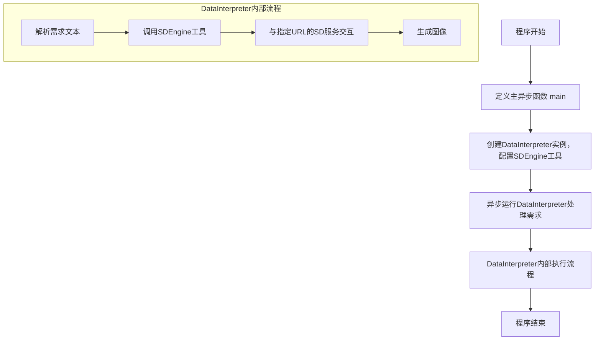
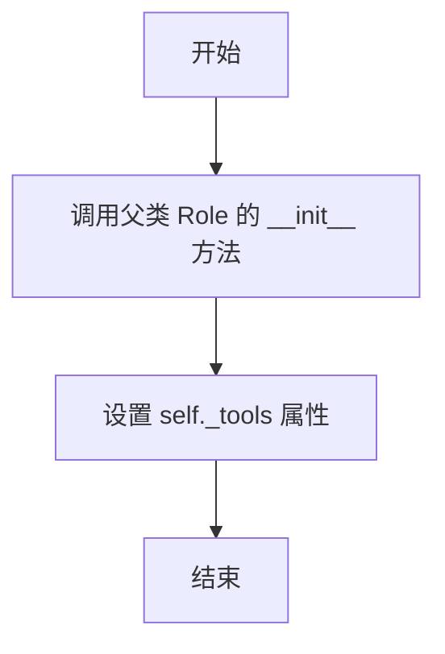
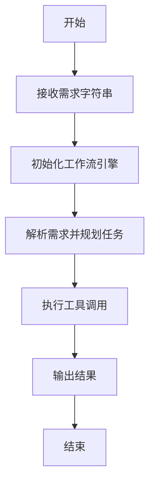

# `.\MetaGPT\examples\di\sd_tool_usage.py` 详细设计文档

该代码是一个异步主程序，它创建了一个DataInterpreter角色实例，并配置其使用名为'SDEngine'的工具。程序的核心功能是接收一个文本需求（requirement），该需求描述了用户想要通过Stable Diffusion文本转图像工具生成一张美丽女孩的图片，并指定了Stable Diffusion服务的URL。然后，程序异步地运行DataInterpreter来处理这个需求，旨在自动化地执行生成图像的任务。

## 整体流程



## 类结构

```
DataInterpreter (来自metagpt.roles.di.data_interpreter)
└── (内部可能包含其他类和方法，但当前代码未展示其内部结构)
```

## 全局变量及字段


### `sd_url`
    
Stable Diffusion服务的URL地址，用于指定文本生成图像工具的API端点

类型：`str`
    


    

## 全局函数及方法


### `main`

这是一个异步入口函数，用于启动一个数据解释器（DataInterpreter）角色，并执行其`run`方法以处理给定的需求字符串。该函数的核心是初始化一个配置了特定工具（如“SDEngine”）的`DataInterpreter`实例，并驱动其异步运行。

参数：

-  `requirement`：`str`，一个描述用户需求的字符串。在本示例中，它指定了使用Stable Diffusion文本转图像工具生成一张美丽女孩图片的需求，并包含了SD服务的URL地址。该参数有默认值`""`。

返回值：`None`，此函数没有显式返回值。

#### 流程图

```mermaid
flowchart TD
    A[开始: main(requirement)] --> B[初始化DataInterpreter<br/>tools=['SDEngine']]
    B --> C[异步调用 di.run(requirement)]
    C --> D[等待DataInterpreter<br/>执行并完成任务]
    D --> E[结束]
```

#### 带注释源码

```python
async def main(requirement: str = ""):
    # 1. 实例化DataInterpreter角色，并传入工具列表（此处指定了"SDEngine"工具）
    di = DataInterpreter(tools=["SDEngine"])
    # 2. 异步调用DataInterpreter实例的run方法，传入用户需求字符串
    #    该方法将驱动DataInterpreter解析需求、规划任务、执行工具调用等一系列操作
    await di.run(requirement)
    # 3. 函数无显式返回值
```


### `DataInterpreter.__init__`

该方法用于初始化 `DataInterpreter` 类的实例，设置其基本属性，包括角色名称、描述、目标、约束以及可用的工具列表。

参数：

- `self`：`DataInterpreter` 实例，表示当前对象
- `name`：`str`，角色名称，默认为 "DataInterpreter"
- `profile`：`str`，角色描述，默认为 "Data Interpreter"
- `goal`：`str`，角色目标，默认为 "Generate suitable code and data analysis solutions for users"
- `constraints`：`str`，角色约束，默认为 "Ensure the code is correct and easy to read"
- `tools`：`list[str]`，可用工具列表，默认为空列表
- `**kwargs`：`dict`，其他关键字参数，用于传递给父类的初始化方法

返回值：`None`，无返回值

#### 流程图



#### 带注释源码

```python
def __init__(
    self,
    name: str = "DataInterpreter",
    profile: str = "Data Interpreter",
    goal: str = "Generate suitable code and data analysis solutions for users",
    constraints: str = "Ensure the code is correct and easy to read",
    tools: list[str] = None,
    **kwargs,
):
    """
    初始化 DataInterpreter 实例。

    Args:
        name (str): 角色名称，默认为 "DataInterpreter"。
        profile (str): 角色描述，默认为 "Data Interpreter"。
        goal (str): 角色目标，默认为 "Generate suitable code and data analysis solutions for users"。
        constraints (str): 角色约束，默认为 "Ensure the code is correct and easy to read"。
        tools (list[str]): 可用工具列表，默认为空列表。
        **kwargs: 其他关键字参数，传递给父类 Role 的初始化方法。
    """
    # 调用父类 Role 的 __init__ 方法，传递名称、描述、目标、约束和其他参数
    super().__init__(name=name, profile=profile, goal=goal, constraints=constraints, **kwargs)
    
    # 如果 tools 参数为 None，则初始化为空列表
    if tools is None:
        tools = []
    
    # 将工具列表赋值给实例变量 self._tools
    self._tools = tools
```

### `DataInterpreter.run`

该方法用于执行数据解释器的核心运行流程，接收一个需求字符串作为输入，并异步执行该需求对应的任务。它通过调用内部的工作流引擎来解析需求、规划任务、执行工具调用，并最终输出结果。

参数：

- `requirement`：`str`，用户输入的需求描述字符串，用于指导数据解释器执行相应的任务。

返回值：`None`，该方法不返回任何值，但会异步执行任务并输出结果。

#### 流程图



#### 带注释源码

```python
async def run(self, requirement: str):
    """
    异步执行数据解释器的核心运行流程。
    
    参数:
        requirement (str): 用户输入的需求描述字符串。
    
    返回值:
        None: 该方法不返回任何值，但会异步执行任务并输出结果。
    """
    # 调用内部的工作流引擎执行需求
    await self.workflow_engine.run(requirement)
```

## 关键组件


### DataInterpreter

一个基于元编程技术构建的角色类，负责解析用户需求，并动态调度和执行相应的工具（如SDEngine）来完成具体任务。

### SDEngine

一个用于调用外部稳定扩散（Stable Diffusion）文生图服务的工具组件，负责处理图像生成的请求与响应。

### 异步任务执行框架

基于`asyncio`库构建的异步执行框架，用于高效、非阻塞地运行`DataInterpreter`的`run`方法，处理可能涉及I/O等待的任务。


## 问题及建议


### 已知问题

-   **硬编码的SD服务URL**：代码中`sd_url`变量是硬编码的，这降低了代码的灵活性和可配置性。当需要更换Stable Diffusion服务地址时，必须直接修改源代码。
-   **工具列表硬编码**：`DataInterpreter`实例化时，工具列表`tools=["SDEngine"]`是硬编码的。这限制了`DataInterpreter`的动态扩展能力，无法根据不同的任务需求灵活加载不同的工具集。
-   **缺乏错误处理机制**：`main`函数和`di.run`方法调用周围没有异常捕获和处理逻辑。如果网络请求失败、服务不可用或`DataInterpreter`内部运行出错，程序会直接崩溃，缺乏健壮性。
-   **异步执行上下文单一**：代码直接使用`asyncio.run(main(requirement))`作为入口。虽然对于简单脚本可行，但在更复杂的异步应用或需要复用事件循环的场景下，这种模式不够灵活。
-   **需求字符串拼接方式脆弱**：`requirement`字符串通过f-string拼接`sd_url`。这种方式容易出错，且如果需求描述或参数变得更复杂，字符串构建逻辑会变得难以维护。

### 优化建议

-   **引入配置文件或环境变量**：将`sd_url`、默认工具列表等配置信息移出代码，放入配置文件（如YAML、JSON）或通过环境变量管理。这提升了配置的灵活性和安全性（避免敏感信息泄露在代码库中）。
-   **参数化工具加载**：修改`DataInterpreter`的初始化逻辑，使其能够接受一个可配置的工具列表或从配置中动态加载工具。可以考虑支持通过配置文件指定工具类名和初始化参数。
-   **添加全面的错误处理**：在`main`函数和`di.run`调用周围添加`try-except`块，捕获可能出现的异常（如`asyncio.TimeoutError`, `ConnectionError`, 业务逻辑异常等），并记录清晰的错误日志或提供用户友好的错误提示，确保程序优雅降级或失败。
-   **重构异步入口**：考虑将异步逻辑封装在一个可被更高层级调用的类或函数中，而不是直接在最外层脚本作用域运行`asyncio.run`。这有助于代码复用和测试。对于小型脚本，至少应将`asyncio.run`调用封装在`if __name__ == "__main__":`块内的一个`run()`函数中。
-   **结构化需求输入**：考虑设计一个更结构化的方式来传递任务需求，而不是依赖一个自然语言字符串。例如，可以定义一个`TaskRequest`数据类，包含`description`（自然语言描述）和`parameters`（一个参数字典，如`{"sd_url": sd_url}`）字段。`DataInterpreter`可以解析这个结构化对象，使参数传递更清晰、更类型安全。
-   **增加日志记录**：在关键步骤（如初始化、工具调用、任务完成）添加日志记录，便于调试和监控任务执行状态。
-   **考虑添加超时控制**：为`di.run`操作添加超时机制，防止因某个工具长时间无响应或任务逻辑陷入死循环而导致程序挂起。


## 其它


### 设计目标与约束

本代码的核心设计目标是提供一个简洁、可扩展的异步入口，用于启动一个具备特定工具（如SDEngine）的DataInterpreter角色，以执行用户通过自然语言描述的需求（例如，调用Stable Diffusion服务生成图片）。主要约束包括：1) 作为示例脚本，其结构应力求简单明了，便于理解和使用；2) 代码运行依赖于外部异步事件循环和特定的`metagpt`框架；3) 关键配置（如Stable Diffusion服务的URL）需要用户在运行前手动修改代码进行设置。

### 错误处理与异常设计

当前代码的错误处理机制较为基础。主要依赖于Python内置的异常传播机制和`asyncio.run()`的默认错误处理。潜在的风险点包括：1) `DataInterpreter`初始化或`run`方法内部可能抛出异常（如工具加载失败、网络连接错误、异步任务异常等），这些异常会直接导致程序崩溃；2) `sd_url`作为字符串直接拼接进`requirement`，若格式错误或包含非法字符，可能导致下游服务调用失败。代码本身未包含任何显式的`try-except`块来捕获和处理这些异常，也未提供日志记录功能，不利于问题排查和系统健壮性。

### 数据流与状态机

本脚本的数据流相对简单直接：1) **输入**：硬编码在`__main__`块中的`requirement`字符串，其中包含了任务描述和关键参数（`sd_url`）。2) **处理**：`main`异步函数接收该字符串，实例化`DataInterpreter`（配置了`SDEngine`工具），并调用其`run`方法。`DataInterpreter`内部将解析该需求，可能涉及状态转换（如：解析需求 -> 规划任务 -> 调用工具 -> 收集结果）。3) **输出**：`DataInterpreter.run()`方法的执行结果（未在代码中显式捕获或展示），预期是生成图片的操作被执行，结果可能直接保存到文件或通过其他方式呈现。脚本本身没有定义复杂的状态机，状态管理由`DataInterpreter`类内部负责。

### 外部依赖与接口契约

1.  **框架依赖**：强依赖于`metagpt`框架，特别是其中的`metagpt.roles.di.data_interpreter.DataInterpreter`类及其运行机制。
2.  **工具依赖**：通过`tools=["SDEngine"]`参数，声明依赖名为`SDEngine`的工具。该工具的具体实现、接口及与Stable Diffusion服务的交互方式由`metagpt`框架或相关插件定义。
3.  **服务依赖**：通过`sd_url`变量，依赖一个外部可访问的Stable Diffusion文本生成图像服务。代码假设该服务运行在指定URL，并接受`DataInterpreter`通过`SDEngine`工具发起的请求。服务接口的契约（如请求格式、响应格式、认证方式）未在代码中体现，由`SDEngine`工具的实现细节所封装。
4.  **运行时依赖**：需要Python的`asyncio`库来运行异步主函数。

    