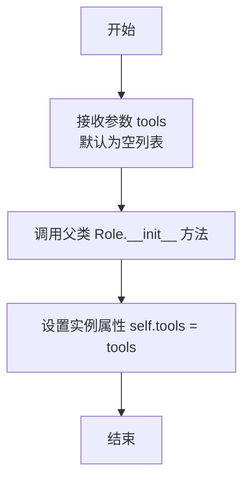

# `.\MetaGPT\examples\di\software_company.py` 详细设计文档

该代码是一个使用 MetaGPT 框架中 DataInterpreter 角色的脚本，其核心功能是接收一个关于“编写贪吃蛇游戏”的软件需求描述，通过自动化的工作流（包括编写产品需求文档、设计、计划、代码、测试和版本控制）来生成并管理一个完整的软件项目。

## 整体流程

```mermaid
graph TD
    A[脚本启动] --> B[解析命令行参数]
    B --> C[调用 main 函数]
    C --> D[定义包含多步任务的 prompt]
    D --> E[创建 DataInterpreter 实例]
    E --> F[调用 di.run(prompt) 启动工作流]
    F --> G{DataInterpreter 内部流程}
    G --> H[解析 Prompt，生成任务列表]
    H --> I[循环执行任务]
    I --> J{选择并执行工具}
    J --> K[WritePRD]
    J --> L[WriteDesign]
    J --> M[WritePlan]
    J --> N[WriteCode]
    J --> O[RunCode]
    J --> P[DebugError]
    K --> Q[更新上下文与状态]
    L --> Q
    M --> Q
    N --> Q
    O --> Q
    P --> Q
    Q --> R{所有任务完成?}
    R -- 否 --> I
    R -- 是 --> S[流程结束]
```

## 类结构

```
fire (外部库)
├── Fire (CLI 包装器)
metagpt (外部框架)
└── roles
    └── di
        └── data_interpreter
            └── DataInterpreter (核心执行类)
```

## 全局变量及字段


### `prompt`
    
一个多行字符串，包含了软件需求描述以及DataInterpreter需要执行的一系列任务指令，用于驱动整个代码生成和项目构建流程。

类型：`str`
    


### `di`
    
DataInterpreter类的一个实例，是程序的核心执行器，负责根据给定的prompt调用一系列工具（如写PRD、设计、代码等）来完成软件项目开发任务。

类型：`DataInterpreter`
    


### `DataInterpreter.tools`
    
一个字符串列表，指定了DataInterpreter实例可以使用的工具名称，这些工具对应着软件开发流程中的不同阶段（如需求分析、设计、编码、测试等）。

类型：`List[str]`
    
    

## 全局函数及方法

### `main`

这是一个异步入口函数，它创建了一个 `DataInterpreter` 角色实例，并使用一个定义了软件开发生命周期（从需求分析到代码提交）的详细提示词来运行该实例，以完成“编写一个贪吃蛇游戏”的任务。

参数：
- 无显式参数。该函数通过 `fire.Fire(main)` 被调用，`fire` 库会自动处理命令行参数，但函数本身不接受任何参数。

返回值：`None`，该函数不返回任何值。

#### 流程图

```mermaid
flowchart TD
    A[开始: main函数] --> B[定义多步骤任务提示词 prompt]
    B --> C[创建DataInterpreter实例 di<br>并配置工具集]
    C --> D[异步调用 di.run(prompt)]
    D --> E{di.run 内部执行流程}
    E --> F[1. 解析需求，编写PRD]
    E --> G[2. 基于PRD编写设计文档]
    E --> H[3. 基于设计编写项目计划]
    E --> I[4. 基于计划编写代码]
    E --> J[5. 运行QA测试]
    E --> K[6. 使用Git暂存并提交更改]
    F --> G
    G --> H
    H --> I
    I --> J
    J --> K
    K --> L[结束: 任务完成]
```

#### 带注释源码

```python
async def main():
    # 定义一个多步骤的软件需求提示词。
    # 该提示词要求AI角色完成从需求分析（PRD）到代码提交（Git）的完整软件开发流程。
    prompt = """
This is a software requirement:
```text
write a snake game
```
---
1. Writes a PRD based on software requirements.
2. Writes a design to the project repository, based on the PRD of the project.
3. Writes a project plan to the project repository, based on the design of the project.
4. Writes codes to the project repository, based on the project plan of the project.
5. Run QA test on the project repository.
6. Stage and commit changes for the project repository using Git.
Note: All required dependencies and environments have been fully installed and configured.
"""
    # 实例化DataInterpreter角色，并为其配置执行任务所需的工具集。
    # 工具包括：编写PRD、设计、计划、代码、运行代码、调试错误等。
    # 注释掉的 `git_archive` 工具表明该功能可能尚未启用或正在开发中。
    di = DataInterpreter(
        tools=[
            "WritePRD",
            "WriteDesign",
            "WritePlan",
            "WriteCode",
            "RunCode",
            "DebugError",
            # "git_archive",
        ]
    )

    # 异步执行DataInterpreter的run方法，将上述复杂的提示词作为任务输入。
    # 该方法将驱动AI角色按步骤调用相应工具，完成贪吃蛇游戏的创建。
    await di.run(prompt)
```

### `DataInterpreter.__init__`

DataInterpreter 类的构造函数，用于初始化一个数据解释器实例。它接收一个可选的工具列表参数，用于配置该实例可使用的工具集。构造函数的主要职责是调用父类的初始化方法，并设置实例的 `tools` 属性。

参数：

- `tools`：`list`，一个包含工具名称的列表，用于指定该数据解释器实例可以使用的工具。默认为空列表。

返回值：`None`，构造函数不返回任何值。

#### 流程图



#### 带注释源码

```python
def __init__(self, tools: list = None):
    """
    初始化 DataInterpreter 实例。

    Args:
        tools (list, optional): 一个包含工具名称的列表，用于指定该数据解释器可以使用的工具。默认为 None，内部会转换为空列表。
    """
    # 调用父类 Role 的构造函数进行初始化
    super().__init__()
    # 将传入的工具列表赋值给实例变量 self.tools。如果 tools 为 None，则使用空列表。
    self.tools = tools or []
```

### `DataInterpreter.run`

该方法是一个异步方法，是DataInterpreter角色的核心执行入口。它接收一个描述软件需求和处理步骤的提示词（prompt），然后通过调用一系列预定义的工具（如编写PRD、设计、计划、代码等）来模拟一个完整的软件开发流程，最终实现需求。

参数：
- `requirements`：`str`，一个包含软件需求文本和一系列处理步骤（如编写PRD、设计、代码等）的提示字符串。

返回值：`None`，该方法不返回任何值，其作用在于执行一系列动作来满足需求。

#### 流程图

```mermaid
flowchart TD
    A[开始: run(requirements)] --> B[初始化消息列表<br>包含用户需求]
    B --> C[进入主循环]
    C --> D{是否满足停止条件?}
    D -- 是 --> Z[结束]
    D -- 否 --> E[调用 _observe 方法<br>观察当前状态]
    E --> F[调用 _think 方法<br>思考下一步行动]
    F --> G[调用 _act 方法<br>执行行动]
    G --> H[更新消息列表<br>添加行动结果]
    H --> C
```

#### 带注释源码

```python
async def run(self, requirements: str) -> None:
    """
    异步运行方法，是DataInterpreter角色的主要执行循环。
    它处理给定的需求，通过观察、思考、行动的循环来调用工具完成任务。
    """
    # 1. 初始化消息历史，将用户的需求作为第一条消息
    await self._init_actions([requirements])  # 初始化行动，这里主要是设置初始消息

    # 2. 进入主执行循环
    while True:
        # 2.1 观察：检查当前上下文和消息，判断是否需要停止（例如任务完成或出错）
        await self._observe()  # 从环境中获取最新信息，更新内部状态
        if self._rc.news:  # 检查是否有新消息或需要处理的事件
            # 2.2 思考：基于当前观察到的信息，决定下一步要做什么（选择哪个工具）
            self._think()  # 分析当前状态，规划下一步行动
            # 2.3 行动：执行上一步思考决定的行动（例如调用WritePRD工具）
            await self._act()  # 执行具体的工具调用
        else:
            # 如果没有新消息（例如任务链结束或等待外部输入），则跳出循环
            break
```

## 关键组件


### DataInterpreter

一个基于MetaGPT框架的角色类，负责接收自然语言需求，通过调用一系列工具（如编写PRD、设计、计划、代码、运行测试等）来自动化执行软件开发任务。

### 工具集 (Tools)

一系列预定义的、可执行特定开发任务的工具，包括`WritePRD`、`WriteDesign`、`WritePlan`、`WriteCode`、`RunCode`、`DebugError`等，DataInterpreter通过协调这些工具来完成从需求到代码的完整流程。

### 异步执行引擎

代码的核心执行流程基于异步函数`main`和`DataInterpreter.run`方法，利用Python的`asyncio`库实现非阻塞的、高效的自动化任务调度与执行。

### 命令行接口 (CLI)

使用`fire`库将`main`函数快速转换为命令行工具，允许用户通过命令行参数直接运行该自动化脚本，提供了便捷的交互方式。


## 问题及建议


### 已知问题

-   **工具列表硬编码**：`DataInterpreter` 实例化时，工具列表在代码中硬编码。这降低了代码的灵活性，当需要添加、移除或修改工具时，必须直接修改源代码，而不是通过配置或依赖注入来管理。
-   **缺乏配置管理**：提示词（`prompt`）和工具列表直接嵌入在 `main` 函数中。这使得在不同环境（如开发、测试、生产）或针对不同任务调整参数变得困难，且容易因误操作而修改核心逻辑。
-   **异步入口点与同步包装器的潜在问题**：`main` 函数是异步的，但通过 `fire.Fire(main)` 调用。`fire` 库主要处理同步函数，虽然它能包装异步函数，但在某些复杂场景或错误处理中可能存在未预期的行为，例如事件循环管理不当。
-   **错误处理与日志记录不足**：代码中没有显式的错误处理逻辑（如 `try...except` 块）和结构化的日志记录。当 `di.run(prompt)` 执行过程中出现异常时，程序可能直接崩溃，不利于问题诊断和系统稳定性。
-   **代码可测试性差**：由于核心逻辑（创建 `DataInterpreter` 和执行 `run`）与 `main` 函数和全局执行上下文紧耦合，难以对该流程进行单元测试或集成测试。
-   **依赖管理不明确**：代码中从 `metagpt.roles.di.data_interpreter` 导入 `DataInterpreter`，但对其内部依赖的工具（如 `WritePRD`, `WriteCode` 等）的具体实现、版本或配置没有说明，这可能导致环境不一致或运行时错误。

### 优化建议

-   **外部化配置**：将提示词模板、工具列表等配置项移出代码，放入配置文件（如 YAML、JSON 或 `.env` 文件）或通过命令行参数传入。这提高了代码的可维护性和部署灵活性。
-   **实现配置加载机制**：创建一个专门的配置类或模块来统一管理所有运行时参数，包括工具注册机制。可以考虑使用依赖注入框架来管理 `DataInterpreter` 及其工具的依赖关系。
-   **增强错误处理与日志**：在 `main` 函数或 `DataInterpreter.run` 的调用周围添加全面的异常捕获，记录详细的错误日志（包括堆栈信息、输入参数等），并可能实现重试机制或优雅降级策略。
-   **改进入口点设计**：考虑将异步逻辑封装在专门的异步运行器中，或确保 `fire` 的异步调用模式在目标部署环境中是稳定和受支持的。也可以提供同步和异步两种入口点。
-   **提升可测试性**：重构代码，将业务逻辑（如解析需求、运行工作流）与执行入口分离。可以创建独立的函数或类来封装 `DataInterpreter` 的初始化和执行过程，便于模拟和测试。
-   **明确依赖与文档**：在项目文档或代码注释中明确列出 `DataInterpreter` 所需的所有外部工具及其接口契约。考虑使用 `requirements.txt` 或 `pyproject.toml` 精确管理第三方库的版本。
-   **添加输入验证与清理**：对传入的 `prompt` 内容进行基本的验证和清理，防止注入攻击或处理意外输入导致的错误。
-   **考虑性能与资源管理**：如果 `DataInterpreter` 执行的任务耗时较长或资源密集，应考虑添加超时控制、资源限制（如内存、CPU）以及执行状态的可查询性。


## 其它


### 设计目标与约束

本代码的核心设计目标是构建一个基于大语言模型的自动化软件开发代理（DataInterpreter），能够根据自然语言描述的软件需求，自动执行从需求分析、设计、计划、编码、测试到版本管理的完整软件开发生命周期。主要约束包括：1) 依赖外部大语言模型（LLM）的能力进行决策和内容生成；2) 通过预定义的工具集（如WritePRD, WriteCode等）与环境交互，工具集的完备性和可靠性直接影响代理能力；3) 执行流程为异步操作，需在支持异步的环境中运行；4) 当前工具集配置中，Git版本管理工具（`git_archive`）被注释掉，意味着代码生成后的自动提交功能暂未启用。

### 错误处理与异常设计

代码中未显式展示错误处理逻辑，错误处理主要委托给`DataInterpreter`类及其内部组件（如`Role`基类、`Action`子类、LLM调用等）。预期的错误处理机制包括：1) **工具执行错误**：当`WriteCode`、`RunCode`等工具执行失败时，应能触发`DebugError`工具进行问题分析和修复尝试。2) **LLM调用异常**：处理网络超时、API限额、响应格式错误等，可能通过重试机制或降级策略应对。3) **流程逻辑错误**：在状态转换或任务分解中出现异常时，代理应能记录错误状态并可能终止或进入安全状态。整体上，错误处理策略是“通过工具链闭环”（如DebugError）而非在顶层主函数中进行集中式捕获。

### 数据流与状态机

1.  **数据流**：
    *   **输入**：用户提供的自然语言`prompt`，包含初始需求和分步骤的指令。
    *   **内部处理**：`DataInterpreter`接收`prompt`，利用LLM将其分解为具体任务序列。对于每个任务，LLM选择合适的工具并生成调用参数。工具执行产生结果（如生成的代码文件、测试报告），该结果作为上下文反馈给LLM，用于决定后续任务。数据在“LLM决策”和“工具执行”之间循环流动。
    *   **输出**：最终输出是间接的，体现为对“项目仓库”的文件系统修改（如新增PRD、设计文档、代码文件）以及可能的Git提交记录。主函数本身不直接返回业务数据。

2.  **状态机（隐式）**：
    `DataInterpreter`的运行过程可抽象为一个状态机：
    *   **初始状态**：接收需求`prompt`。
    *   **分析状态**：LLM理解需求，生成PRD。
    *   **规划与执行状态**：循环进入“LLM选择工具 -> 执行工具 -> 观察结果”的周期，状态由当前任务目标（如“设计”、“编码”、“测试”）定义。
    *   **终止状态**：所有步骤指令完成，或遇到无法恢复的错误。代码中未显式定义终止条件，依赖LLM对指令完成的判断。

### 外部依赖与接口契约

1.  **外部依赖**：
    *   **MetaGPT框架**：强依赖`metagpt`库，特别是`roles.di.data_interpreter`模块中的`DataInterpreter`类。该框架提供了角色、动作、环境等核心抽象。
    *   **大语言模型（LLM）服务**：`DataInterpreter`内部依赖配置的LLM（如OpenAI GPT系列、Claude等），通过MetaGPT的LLM抽象层调用。这是核心能力依赖。
    *   **Python Fire库**：用于将`main`函数快速转换为命令行接口，简化参数解析。
    *   **工具对应的运行时环境**：如`WriteCode`依赖文件系统，`RunCode`依赖Python解释器及项目依赖包，`DebugError`依赖分析日志的能力。被注释的`git_archive`依赖Git命令行工具。

2.  **接口契约**：
    *   `DataInterpreter.__init__`：接受一个`tools`列表，列表中的字符串名称必须与MetaGPT框架内注册的有效工具名匹配。框架需保证这些工具可用。
    *   `DataInterpreter.run`：异步方法，接受一个字符串类型的`prompt`作为输入。它不直接返回有意义的值，而是通过副作用（修改文件、执行命令）完成任务。
    *   `main()`函数：是一个异步函数，无参数。它定义了固定的`prompt`和工具集，并通过`fire.Fire`暴露为命令行脚本。
    *   **工具接口契约**：每个工具（如`WritePRD`）必须遵循MetaGPT框架定义的`Action`接口，实现`run`方法，并正确接收来自LLM的解析参数。

    