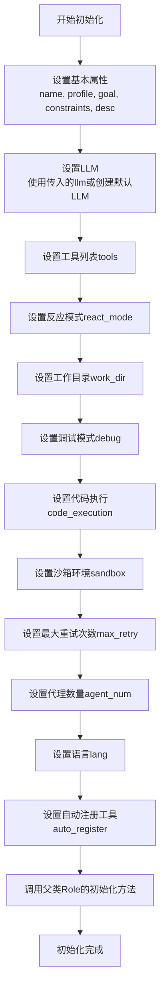

# `.\MetaGPT\examples\di\use_browser.py` 详细设计文档

该代码是一个使用MetaGPT框架中DataInterpreter角色的示例脚本。它通过异步方式创建了一个DataInterpreter实例，并让其执行一个特定的任务：访问MetaGPT官方文档网站，查找并列出该项目支持的LLM API列表。代码的核心是演示如何利用DataInterpreter的自主规划和工具调用能力（此处指定了浏览器工具）来完成一个需要多步骤网络交互和信息提取的复杂任务。

## 整体流程

```mermaid
graph TD
    A[开始: 执行 main 函数] --> B[创建 DataInterpreter 实例]
    B --> C[调用 di.run(MG_LLM_CONFIG_REQ)]
    C --> D{DataInterpreter 内部流程}
    D --> E[解析任务需求]
    E --> F[规划执行步骤]
    F --> G[执行第一步: 使用Browser工具访问指定URL]
    G --> H[分析页面内容，规划下一步]
    H --> I[执行后续步骤...]
    I --> J[收集、整合信息]
    J --> K[生成最终结果]
    K --> L[任务完成]
```

## 类结构

```
外部依赖
├── asyncio (Python标准库)
└── metagpt.roles.di.data_interpreter
    └── DataInterpreter (主要使用类)
```

## 全局变量及字段


### `MG_LLM_CONFIG_REQ`
    
一个包含指令的字符串，要求DataInterpreter访问MetaGPT文档网站并找出其支持的LLM API列表。

类型：`str`
    


### `PAPER_LIST_REQ`
    
一个包含指令的字符串，要求DataInterpreter访问特定学术统计网站，找到并总结一篇标题包含'multiagent'的ICLR 2024论文的摘要。

类型：`str`
    


### `DESCRIBE_GITHUB_ISSUE_REQ`
    
一个包含指令的字符串，要求DataInterpreter访问MetaGPT的GitHub仓库，找到并总结第一个与DataInterpreter相关的Issue。

类型：`str`
    


    

## 全局函数及方法

### `main`

这是一个异步入口函数，用于创建并运行一个DataInterpreter角色实例，以执行一个特定的任务：探索MetaGPT文档网站并找出其支持的LLM API列表。

参数：
- 无显式参数。

返回值：`None`，该函数不返回任何值，其主要作用是启动并运行一个异步任务。

#### 流程图

```mermaid
flowchart TD
    A[开始: main函数] --> B[创建DataInterpreter实例<br>tools=['Browser'], react_mode='react']
    B --> C[异步调用 di.run<br>传入任务描述 MG_LLM_CONFIG_REQ]
    C --> D[DataInterpreter执行任务<br>（可能涉及多步思考与工具调用）]
    D --> E[任务执行完毕]
    E --> F[结束]
```

#### 带注释源码

```python
async def main():
    # 1. 实例化DataInterpreter角色。
    #    - tools=["Browser"]: 为该角色配置了“浏览器”工具，使其能够进行网页浏览操作。
    #    - react_mode="react": 指定角色使用“React”模式进行思考和行动规划。
    di = DataInterpreter(tools=["Browser"], react_mode="react")
    
    # 2. 异步运行DataInterpreter实例，并传入任务描述字符串 MG_LLM_CONFIG_REQ。
    #    - MG_LLM_CONFIG_REQ 常量定义了具体的任务：探索MetaGPT文档网站以找出支持的LLM API列表。
    #    - `await` 关键字用于等待这个异步任务执行完成。
    await di.run(MG_LLM_CONFIG_REQ)

# 3. 标准Python入口点检查。
#    当此脚本被直接运行时（而非作为模块导入），执行以下代码。
if __name__ == "__main__":
    # 4. 使用asyncio.run()来运行顶层的异步函数main()。
    #    这会创建事件循环，运行main()协程，并在完成后关闭循环。
    asyncio.run(main())
```

### `DataInterpreter.__init__`

该方法用于初始化 `DataInterpreter` 类的实例。它负责设置数据解释器的核心配置，包括底层语言模型、工具列表、反应模式、工作空间、调试模式、代码执行方式、沙箱环境、最大重试次数、代理数量、语言配置以及是否自动注册工具等。通过接收一系列参数，该方法为数据解释器的后续运行（如执行代码生成和任务分解）奠定基础。

参数：

- `self`：`DataInterpreter`，表示 `DataInterpreter` 类的实例本身。
- `name`：`str`，数据解释器的名称，默认为 `"DataInterpreter"`。
- `profile`：`str`，数据解释器的角色描述，默认为 `"Data Interpreter"`。
- `goal`：`str`，数据解释器的目标描述，默认为 `"Generate suitable code and scripts to solve data-related tasks."`。
- `constraints`：`str`，数据解释器的约束条件，默认为 `""`。
- `desc`：`str`，数据解释器的详细描述，默认为 `"A data interpreter that can generate code to solve data tasks."`。
- `llm`：`BaseLLM`，底层语言模型实例，用于生成代码和决策。如果未提供，将使用默认配置创建。
- `tools`：`list[str]`，工具名称列表，数据解释器可以调用这些工具来执行特定操作（如浏览器操作、文件读写等）。默认为空列表。
- `react_mode`：`str`，反应模式，控制数据解释器如何响应任务。可选值为 `"react"`（逐步推理）或 `"plan_and_act"`（先计划后执行）。默认为 `"react"`。
- `work_dir`：`str | Path`，工作目录路径，用于存储生成的代码、数据和日志文件。默认为 `"./data/"`。
- `debug`：`bool`，是否启用调试模式。在调试模式下，会输出更详细的日志信息。默认为 `False`。
- `code_execution`：`bool`，是否启用代码执行功能。如果为 `True`，数据解释器可以执行生成的代码。默认为 `True`。
- `sandbox`：`Sandbox`，代码执行的沙箱环境实例。如果未提供，将使用默认沙箱。
- `max_retry`：`int`，最大重试次数，当代码执行失败时，数据解释器会尝试重新生成代码的次数。默认为 `3`。
- `agent_num`：`int`，代理数量，用于并行执行任务的代理数。默认为 `1`。
- `lang`：`str`，生成代码和描述的语言。默认为 `"en"`（英语）。
- `auto_register`：`bool`，是否自动注册工具。如果为 `True`，会根据 `tools` 列表自动加载和注册相应的工具。默认为 `True`。

返回值：`None`，该方法不返回任何值，仅初始化 `DataInterpreter` 实例。

#### 流程图



#### 带注释源码

```python
def __init__(
    self,
    name: str = "DataInterpreter",
    profile: str = "Data Interpreter",
    goal: str = "Generate suitable code and scripts to solve data-related tasks.",
    constraints: str = "",
    desc: str = "A data interpreter that can generate code to solve data tasks.",
    llm: BaseLLM = None,
    tools: list[str] = None,
    react_mode: str = "react",
    work_dir: str | Path = "./data/",
    debug: bool = False,
    code_execution: bool = True,
    sandbox: Sandbox = None,
    max_retry: int = 3,
    agent_num: int = 1,
    lang: str = "en",
    auto_register: bool = True,
):
    """
    初始化 DataInterpreter 实例。

    参数:
        name (str): 数据解释器的名称，默认为 "DataInterpreter"。
        profile (str): 数据解释器的角色描述，默认为 "Data Interpreter"。
        goal (str): 数据解释器的目标描述，默认为 "Generate suitable code and scripts to solve data-related tasks."。
        constraints (str): 数据解释器的约束条件，默认为空字符串。
        desc (str): 数据解释器的详细描述，默认为 "A data interpreter that can generate code to solve data tasks."。
        llm (BaseLLM): 底层语言模型实例。如果未提供，将使用默认配置创建。
        tools (list[str]): 工具名称列表，数据解释器可以调用这些工具。默认为空列表。
        react_mode (str): 反应模式，控制数据解释器如何响应任务。可选值为 "react" 或 "plan_and_act"。默认为 "react"。
        work_dir (str | Path): 工作目录路径，用于存储生成的代码、数据和日志文件。默认为 "./data/"。
        debug (bool): 是否启用调试模式。默认为 False。
        code_execution (bool): 是否启用代码执行功能。默认为 True。
        sandbox (Sandbox): 代码执行的沙箱环境实例。如果未提供，将使用默认沙箱。
        max_retry (int): 最大重试次数，当代码执行失败时，数据解释器会尝试重新生成代码的次数。默认为 3。
        agent_num (int): 代理数量，用于并行执行任务的代理数。默认为 1。
        lang (str): 生成代码和描述的语言。默认为 "en"（英语）。
        auto_register (bool): 是否自动注册工具。如果为 True，会根据 tools 列表自动加载和注册相应的工具。默认为 True。
    """
    # 如果未提供 llm，则使用默认配置创建 LLM 实例
    llm = llm or LLM()
    # 如果未提供 tools，则初始化为空列表
    tools = tools or []
    # 如果未提供 sandbox，则创建默认沙箱环境
    sandbox = sandbox or Sandbox()
    # 设置工作目录，如果传入的是字符串则转换为 Path 对象
    work_dir = Path(work_dir)
    # 调用父类 Role 的初始化方法，传入基本属性
    super().__init__(name=name, profile=profile, goal=goal, constraints=constraints, desc=desc, llm=llm)
    # 设置实例属性
    self.tools = tools
    self.react_mode = react_mode
    self.work_dir = work_dir
    self.debug = debug
    self.code_execution = code_execution
    self.sandbox = sandbox
    self.max_retry = max_retry
    self.agent_num = agent_num
    self.lang = lang
    self.auto_register = auto_register
    # 如果启用了自动注册工具，则根据 tools 列表加载并注册工具
    if auto_register:
        self._register_tools()
```

### `DataInterpreter.run`

`DataInterpreter.run` 是 `DataInterpreter` 类的核心异步方法，负责执行一个给定的任务请求。它通过协调内部的 `Role` 机制（如 `react` 模式）和配置的工具（例如 `Browser`）来逐步处理复杂的任务指令，生成并执行代码，最终完成任务目标。

参数：

- `message`：`str`，一个描述任务的字符串指令。该指令通常要求执行多步骤操作，并明确指示“不要一次性写出所有代码，每次只为一个步骤编写代码”。
- `sender`：`Optional[Agent]`，默认为 `None`。表示发送此消息的 `Agent` 对象。在典型的单 `Role` 场景中，此参数通常为 `None`。
- `reviewer`：`Optional[Agent]`，默认为 `None`。表示负责审查消息或响应的 `Agent` 对象。在当前上下文中通常未使用。
- `config`：`Optional[dict]`，默认为 `None`。一个可选的配置字典，用于覆盖运行时的默认配置。

返回值：`None`，此方法不返回任何值，其主要作用是通过执行过程产生副作用（例如，运行代码、访问网页、生成摘要等）。

#### 流程图

```mermaid
flowchart TD
    A[开始: run(message, sender, reviewer, config)] --> B[初始化内部状态与上下文]
    B --> C{是否处于“react”模式？}
    C -- 是 --> D[进入REACT循环]
    D --> E[根据当前任务和上下文<br>生成下一步的代码或指令]
    E --> F[执行生成的代码<br>（如使用Browser工具访问网页）]
    F --> G[评估执行结果<br>更新上下文]
    G --> H{任务是否完成？}
    H -- 否 --> D
    H -- 是 --> I[结束循环，清理资源]
    C -- 否 --> J[执行其他处理逻辑<br>（如Plan-and-Act模式）]
    J --> I
    I --> K[返回 None]
```

#### 带注释源码

```python
    async def run(
        self,
        message: str,
        sender: Optional["Agent"] = None,
        reviewer: Optional["Agent"] = None,
        config: Optional[dict] = None,
    ) -> None:
        """
        运行DataInterpreter以处理给定的任务消息。
        这是一个异步方法，它将驱动整个任务执行流程，包括代码生成、执行和状态迭代。

        Args:
            message (str): 用户提供的任务描述或指令。
            sender (Optional[Agent], optional): 发送此消息的Agent。默认为None。
            reviewer (Optional[Agent], optional): 审查响应的Agent。默认为None。
            config (Optional[dict], optional): 可选的运行时配置覆盖。默认为None。

        Returns:
            None: 此方法不返回值，其效果通过执行过程体现。
        """
        # 调用父类 Role 的 run 方法，传入所有参数。
        # 父类方法将根据 self.react_mode 等属性决定具体的执行策略（如REACT循环）。
        # 在提供的示例中，self.react_mode 被设置为 "react"，因此将进入基于思考-行动-观察的循环。
        await super().run(message, sender, reviewer, config)
```

## 关键组件


### DataInterpreter

一个基于角色的数据解释器，能够使用指定的工具（如浏览器）以逐步执行的方式处理自然语言请求，并生成相应的代码或操作步骤。

### Browser Tool

一个工具组件，允许DataInterpreter执行网页浏览操作，例如访问URL、导航页面和提取信息，以完成涉及网络数据的任务。

### React Mode

DataInterpreter的一种运行模式，在此模式下，代理会以“思考-行动-观察”的循环（ReAct范式）逐步处理请求，每次只生成并执行一步代码，而不是一次性生成所有代码。


## 问题及建议


### 已知问题

-   **硬编码的请求字符串**：代码中直接定义了三个任务请求字符串（`MG_LLM_CONFIG_REQ`、`PAPER_LIST_REQ`、`DESCRIBE_GITHUB_ISSUE_REQ`），但`main`函数只使用了第一个。这使得其他两个请求成为未使用的“死代码”，增加了维护成本并可能造成混淆。
-   **工具配置硬编码**：`DataInterpreter`实例的`tools`参数被硬编码为`["Browser"]`。这限制了代码的灵活性和可重用性，无法根据不同的任务需求动态调整或扩展工具集。
-   **运行模式硬编码**：`DataInterpreter`实例的`react_mode`参数被硬编码为`"react"`。与工具配置类似，这限制了在不同场景下切换或尝试其他交互模式（如`plan_and_act`）的能力。
-   **缺乏错误处理与日志记录**：`main`函数和`DataInterpreter.run`的调用周围没有`try-except`块来捕获和处理可能发生的异常（如网络错误、解析失败、API限制等）。同时，缺乏日志记录机制，使得在任务执行过程中难以进行调试和状态监控。
-   **单任务执行**：当前代码结构每次运行只能执行一个预定义的任务（`MG_LLM_CONFIG_REQ`）。要执行其他任务，需要手动修改代码或运行不同的脚本，这不利于批量处理或构建一个交互式/任务队列系统。

### 优化建议

-   **参数化任务请求与配置**：建议将任务请求、工具列表和运行模式作为命令行参数或配置文件（如YAML、JSON）的输入。这样可以在不修改代码的情况下灵活指定执行哪个任务、使用哪些工具以及何种交互模式。
-   **实现配置管理**：创建一个配置管理模块或类，用于集中管理`DataInterpreter`的初始化参数（`tools`， `react_mode`）以及任务列表。这可以提高代码的可维护性和可测试性。
-   **增强健壮性与可观测性**：
    -   在`main`函数和关键步骤中添加异常处理逻辑，对可能出现的错误进行捕获、记录（日志）和适当的恢复或退出处理。
    -   集成日志库（如Python的`logging`），在代码关键点（如任务开始、步骤执行、结果获取、错误发生）输出不同级别的日志信息，便于问题追踪。
-   **支持多任务或交互式执行**：
    -   重构`main`函数，使其能够读取一个任务列表并依次或并发（使用`asyncio.gather`）执行。
    -   或者，构建一个简单的交互式循环，允许用户输入自然语言指令，动态创建并执行任务。
-   **移除未使用的代码**：如果`PAPER_LIST_REQ`和`DESCRIBE_GITHUB_ISSUE_REQ`在当前或近期没有使用计划，应考虑将其移除或注释掉，以保持代码库的整洁。如果它们作为示例需要保留，建议将其移至单独的示例文件或通过清晰的注释说明其用途。


## 其它


### 设计目标与约束

本代码的设计目标是作为一个轻量级的演示脚本，用于展示 `DataInterpreter` 角色的核心能力，即通过自然语言指令驱动工具（如浏览器）完成复杂的、多步骤的网络信息查询与处理任务。其核心约束包括：
1.  **异步执行**：代码基于 `asyncio` 框架，要求所有操作必须是异步的，以确保在等待网络I/O时不会阻塞。
2.  **分步执行**：通过在每个请求提示（`MG_LLM_CONFIG_REQ` 等）中明确指令“Don‘t write all codes in one response, each time, just write code for one step”，强制 `DataInterpreter` 将复杂任务分解为一系列可执行的原子步骤，这模拟了人类逐步思考和操作的过程，也便于调试和观察中间状态。
3.  **工具依赖**：脚本的功能完全依赖于 `DataInterpreter` 及其配置的工具（本例中为 `Browser`）。`DataInterpreter` 的内部实现（如与LLM的交互、任务规划、代码生成与执行）是本脚本的外部黑盒。
4.  **演示单一性**：在 `main` 函数中，当前仅执行了 `MG_LLM_CONFIG_REQ` 一个任务，而 `PAPER_LIST_REQ` 和 `DESCRIBE_GITHUB_ISSUE_REQ` 作为预定义的常量未被使用，表明脚本设计为一次运行聚焦于一个演示案例。

### 错误处理与异常设计

脚本层面的错误处理机制较为简单，主要依赖于Python和其依赖库的内置异常传播机制：
1.  **顶层捕获**：`asyncio.run(main())` 会运行整个异步事件循环。如果 `main` 协程或其中调用的任何异步操作中未捕获的异常被抛出，事件循环将停止，异常会传播到调用者，导致脚本以非零退出码终止，并在控制台打印异常回溯信息。这是脚本级别的主要错误出口。
2.  **组件内处理**：具体的错误处理（如网络请求超时、页面解析失败、LLM API调用错误、生成的代码执行错误等）应由 `DataInterpreter` 及其底层工具（如 `Browser`）在其内部实现。`DataInterpreter` 的设计可能包含重试逻辑、错误步骤的回退或重新规划、以及向用户（在本脚本中即控制台）报告友好错误信息的能力。脚本本身并未显式处理这些底层异常。
3.  **潜在未处理点**：脚本中定义的三个请求常量（`MG_LLM_CONFIG_REQ`, `PAPER_LIST_REQ`, `DESCRIBE_GITHUB_ISSUE_REQ`）如果包含格式错误或无法解析的指令，其错误处理完全依赖于 `DataInterpreter` 的鲁棒性。

### 数据流与状态机

本脚本的数据流和状态转换主要由 `DataInterpreter` 实例驱动，可以抽象为一个简单的状态机：
1.  **初始化状态**：脚本启动，创建 `DataInterpreter` 实例 `di`，配置工具列表（`["Browser"]`）和反应模式（`"react"`）。此时 `di` 处于就绪状态。
2.  **任务输入**：调用 `di.run(MG_LLM_CONFIG_REQ)`，将自然语言指令作为输入传递给 `DataInterpreter`。`di` 进入任务处理状态。
3.  **内部处理循环（状态机核心）**：
    *   **规划状态**：`DataInterpreter` 解析指令，可能调用LLM生成一个初步的、分步骤的执行计划。
    *   **执行状态**：根据当前步骤，生成相应的可执行代码（如使用 `Browser` 工具导航、点击、提取文本）。
    *   **观察状态**：执行生成的代码，获取执行结果（成功后的数据或失败时的异常信息）。
    *   **评估与决策状态**：基于执行结果，评估当前步骤是否完成，任务目标是否达成，或是否需要调整计划。这对应 `react_mode="react"` 中的“思考-行动-观察”循环。
    *   上述状态在 `DataInterpreter` 内部循环，直到任务被判定为完成或无法继续。
4.  **输出状态**：`di.run()` 协程完成，返回最终的任务结果（具体形式取决于 `DataInterpreter` 的实现，可能是一个字符串摘要或结构化数据）。脚本随后退出。
5.  **数据载体**：在状态转换过程中，核心数据包括：原始用户指令、内部任务规划、生成的代码片段、代码执行结果（如网页HTML、提取的文本）、以及最终摘要。这些数据在 `DataInterpreter` 的内部状态中流转。

### 外部依赖与接口契约

脚本显式和隐式地依赖以下外部组件，并遵循相应的接口契约：
1.  **MetaGPT 框架 (`metagpt`)**: 这是最核心的依赖。脚本通过 `from metagpt.roles.di.data_interpreter import DataInterpreter` 导入 `DataInterpreter` 类。
    *   **接口契约**：脚本假定 `DataInterpreter` 类存在，并且其构造函数接受 `tools` 和 `react_mode` 参数。同时，其实例拥有一个异步方法 `run`，该方法接受一个字符串参数（指令）并执行任务。
2.  **`DataInterpreter` 的内部依赖**:
    *   **LLM 服务**：`DataInterpreter` 需要配置一个大型语言模型（如GPT-4）来理解指令、规划任务和生成代码。其配置（API密钥、端点等）通常在MetaGPT的全局配置或 `DataInterpreter` 初始化参数中设置，不在此脚本中体现。
    *   **工具集**：脚本指定了 `tools=["Browser"]`，因此 `DataInterpreter` 必须能成功加载并使用名为 `"Browser"` 的工具。该工具应提供网页浏览、交互和内容抓取的能力。
    *   **`react_mode` 实现**：`react_mode="react"` 参数要求 `DataInterpreter` 使用特定的反应式决策循环（ReAct范式）来驱动任务执行。
3.  **Python 标准库**:
    *   `asyncio`: 提供异步运行时。契约是使用 `asyncio.run()` 来启动顶级入口点 `main()`。
4.  **隐式环境依赖**：
    *   网络连接：`Browser` 工具执行需要访问互联网。
    *   Python环境：需要安装 `metagpt` 包及其所有依赖项。

    