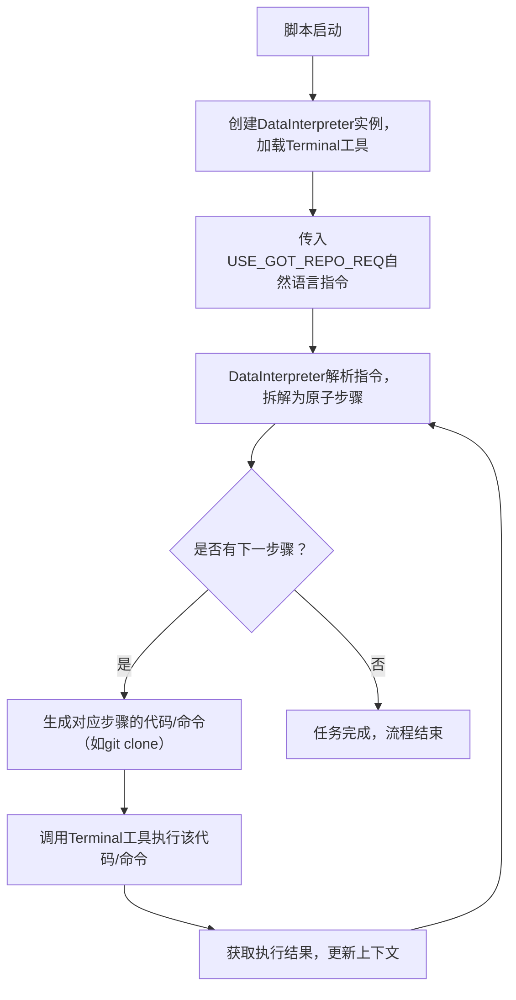
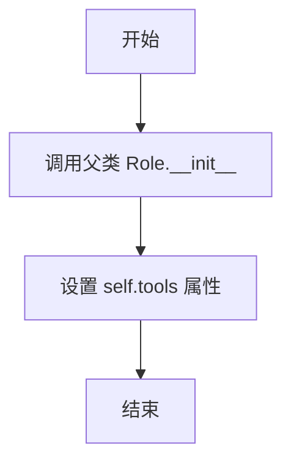

# `.\MetaGPT\examples\di\use_github_repo.py` 详细设计文档

该代码是一个使用DataInterpreter角色执行自动化任务的脚本。其核心功能是：通过DataInterpreter（数据解释器）接收一个关于克隆、安装并运行Graph-of-Thoughts（GOT）仓库的复杂自然语言指令，并利用其集成的工具（此处为Terminal工具）来分步骤、自动化地执行该指令所描述的一系列操作。

## 整体流程



## 类结构

```
外部依赖
├── asyncio (Python标准库)
└── metagpt.roles.di.data_interpreter (MetaGPT框架)
        └── DataInterpreter (核心执行角色类)
```

## 全局变量及字段


### `USE_GOT_REPO_REQ`
    
一个包含多步骤指令的字符串常量，用于指导DataInterpreter角色克隆、安装并运行指定的GitHub仓库（graph-of-thoughts）。

类型：`str`
    


    

## 全局函数及方法


### `main`

该函数是程序的异步入口点，负责初始化一个`DataInterpreter`角色并执行其`run`方法，以处理一个关于克隆、安装和运行“Graph of Thoughts”仓库的复杂用户请求。

参数：
- 无显式参数。

返回值：`None`，该函数不返回任何值，其主要功能是启动并运行一个异步任务。

#### 流程图

```mermaid
flowchart TD
    A[开始: main函数] --> B[初始化DataInterpreter<br>tools=["Terminal"]]
    B --> C[调用di.run<br>传入USE_GOT_REPO_REQ]
    C --> D[DataInterpreter内部执行<br>解析请求、规划步骤、执行工具]
    D --> E[任务完成]
    E --> F[结束]
```

#### 带注释源码

```python
import asyncio

from metagpt.roles.di.data_interpreter import DataInterpreter

# 定义一个常量字符串，包含了对DataInterpreter的复杂任务请求。
# 该请求要求克隆一个GitHub仓库，阅读README，安装依赖，并运行示例。
USE_GOT_REPO_REQ = """
This is a link to the GOT github repo: https://github.com/spcl/graph-of-thoughts.git.
Clone it, read the README to understand the usage, install it, and finally run the quick start example.
**Note the config for LLM is at `config/config_got.json`, it's outside the repo path, before using it, you need to copy it into graph-of-thoughts.
** Don't write all codes in one response, each time, just write code for one step.
"""


async def main():
    # 1. 实例化DataInterpreter角色，并指定其可用的工具为“Terminal”。
    #    这表明DataInterpreter将能够执行终端命令来完成请求。
    di = DataInterpreter(tools=["Terminal"])
    
    # 2. 异步调用DataInterpreter实例的`run`方法，并传入定义好的任务请求。
    #    `run`方法将负责解析请求、规划执行步骤、调用终端工具并管理整个执行流程。
    await di.run(USE_GOT_REPO_REQ)


# 标准的主程序入口检查。
if __name__ == "__main__":
    # 使用asyncio.run来启动并运行顶层的异步main函数。
    asyncio.run(main())
```


### `DataInterpreter.__init__`

`DataInterpreter` 类的构造函数，用于初始化一个数据解释器实例。它负责设置角色的基本属性（如名称、配置文件、语言模型等），并加载指定的工具集以供后续任务执行使用。

参数：

-  `name`：`str`，角色的名称，默认为 "DataInterpreter"。
-  `profile`：`str`，角色的配置文件或描述，默认为 "Data Interpreter"。
-  `goal`：`str`，角色的目标描述，默认为一个空字符串。
-  `constraints`：`str`，角色的约束条件描述，默认为一个空字符串。
-  `desc`：`str`，角色的详细描述，默认为一个空字符串。
-  `tools`：`list[str]`，一个字符串列表，指定需要加载的工具名称。
-  `**kwargs`：`Any`，其他关键字参数，用于传递给父类 `Role` 的构造函数。

返回值：`None`，构造函数不返回任何值。

#### 流程图



#### 带注释源码

```python
def __init__(
    self,
    name: str = "DataInterpreter",
    profile: str = "Data Interpreter",
    goal: str = "",
    constraints: str = "",
    desc: str = "",
    tools: Optional[List[str]] = None,
    **kwargs,
):
    """
    初始化 DataInterpreter 实例。

    Args:
        name (str): 角色的名称，默认为 "DataInterpreter"。
        profile (str): 角色的配置文件或描述，默认为 "Data Interpreter"。
        goal (str): 角色的目标描述，默认为空字符串。
        constraints (str): 角色的约束条件描述，默认为空字符串。
        desc (str): 角色的详细描述，默认为空字符串。
        tools (Optional[List[str]]): 需要加载的工具名称列表。如果为 None，则使用默认工具集。
        **kwargs: 其他关键字参数，传递给父类 Role 的构造函数。
    """
    # 调用父类 Role 的构造函数，传递基本角色属性
    super().__init__(name=name, profile=profile, goal=goal, constraints=constraints, desc=desc, **kwargs)
    # 将传入的工具列表赋值给实例变量 self.tools
    # 如果 tools 为 None，则 self.tools 将被设置为 None
    self.tools = tools
```


### `DataInterpreter.run`

`DataInterpreter.run` 是 `DataInterpreter` 角色的核心执行方法。它接收一个自然语言描述的用户请求，通过协调内部规划、代码生成、工具执行和反思等组件，以迭代的方式完成任务。该方法旨在将高级别的、模糊的用户指令分解并转化为一系列可执行的具体操作（如运行终端命令、读写文件等），并最终返回任务执行的结果。

参数：

-  `instruction`：`str`，用户用自然语言描述的任务请求或指令。
-  `plan`：`Optional[str]`，可选的初始计划。如果提供，将使用此计划开始执行，而不是重新生成。
-  `max_retry`：`int`，任务执行失败时的最大重试次数，默认为3。
-  `reflection`：`Optional[str]`，可选的反思信息。用于在任务执行后提供额外的总结或分析。
-  `**kwargs`：`Any`，其他传递给底层动作（Action）执行的关键字参数。

返回值：`Message`，返回一个包含任务最终执行结果、状态和可能的过程信息的 `Message` 对象。

#### 流程图

```mermaid
flowchart TD
    A[开始: run(instruction, ...)] --> B{是否有初始计划?};
    B -- 是 --> C[使用初始计划];
    B -- 否 --> D[调用_plan<br>生成初始计划];
    C --> E[进入主循环];
    D --> E;

    subgraph E [主执行循环]
        F[调用_act<br>执行当前计划步骤] --> G{执行成功?};
        G -- 是 --> H[更新上下文与历史];
        G -- 否 --> I{重试次数<br>小于 max_retry?};
        I -- 是 --> J[调用_reflect<br>反思失败原因];
        J --> K[调用_replan<br>基于反思重新规划];
        K --> F;
        I -- 否 --> L[标记任务为失败];
        H --> M{所有步骤完成?};
        M -- 否 --> N[准备下一步];
        N --> F;
    end

    M -- 是 --> O[调用_post_process<br>进行后处理];
    L --> O;
    O --> P[组装最终结果 Message];
    P --> Q[返回 Message];
```

#### 带注释源码

```python
    async def run(
        self,
        instruction: str,
        plan: Optional[str] = None,
        max_retry: int = 3,
        reflection: Optional[str] = None,
        **kwargs,
    ) -> Message:
        """
        运行DataInterpreter的核心方法。
        处理用户指令，通过规划、执行、反思循环完成任务。

        Args:
            instruction: 用户指令。
            plan: 可选的初始计划，如果提供则直接使用。
            max_retry: 最大重试次数。
            reflection: 可选的反思信息。
            **kwargs: 其他参数。

        Returns:
            Message: 包含执行结果的消息。
        """
        # 初始化消息上下文，将用户指令作为第一条消息
        self._init_act(instruction)
        # 记录当前计划
        self.plan = plan
        # 记录最大重试次数
        self.max_retry = max_retry

        # 步骤1：生成或使用初始计划
        if not self.plan:
            # 如果没有提供初始计划，则调用_plan方法生成一个
            self.plan = await self._plan()
        # 将生成的计划添加到消息历史中
        self.llm_messages.add_message(self.llm_messages.plan_to_message(self.plan))

        # 步骤2：进入主执行循环
        rsp = await self._loop()

        # 步骤3：任务后处理
        # 调用_post_process方法，传入原始指令、最终响应和可选的反思信息
        processed_rsp = await self._post_process(instruction, rsp, reflection)

        # 步骤4：返回最终结果
        # 创建一个Message对象，包含处理后的响应内容、发送者和接收者信息
        msg = Message(
            content=processed_rsp,
            role=self.profile,
            cause_by=type(self.actions[-1]) if self.actions else DataInterpreter, # 记录最后一个动作的类或自身类
            sent_from=self.profile,
            send_to="",
        )
        return msg
```


## 关键组件


### DataInterpreter

一个基于智能体（Agent）的代码解释与执行角色，能够理解自然语言需求，将其分解为可执行的步骤，并调用工具（如终端）来完成任务。

### asyncio 异步事件循环

Python 标准库中的异步编程框架，用于管理和调度异步任务，是本程序异步执行的核心运行环境。

### Terminal 工具

DataInterpreter 可调用的工具之一，用于在代码执行过程中与系统终端进行交互，执行诸如克隆仓库、安装依赖、运行脚本等命令行操作。


## 问题及建议


### 已知问题

-   **硬编码的工具列表**：`DataInterpreter` 实例化时，工具列表 `tools=["Terminal"]` 是硬编码的。这限制了代码的灵活性和可复用性。如果需要使用其他工具或组合，必须修改源代码。
-   **缺乏配置管理**：任务指令 `USE_GOT_REPO_REQ` 作为字符串常量直接写在代码中。对于复杂的任务或需要频繁变更的指令，这种方式难以维护，也不利于将指令与业务逻辑分离。
-   **错误处理机制薄弱**：主函数 `main` 和 `di.run` 方法没有包含任何显式的错误处理（如 `try...except` 块）。如果 `DataInterpreter` 执行过程中出现网络问题、工具执行失败或LLM API错误，程序会直接崩溃，不提供任何错误恢复或用户友好的提示。
-   **潜在的异步任务管理问题**：代码使用 `asyncio.run(main())` 作为入口点。虽然这是标准做法，但如果 `DataInterpreter.run` 内部创建了未妥善管理的后台任务，在程序退出时可能导致资源未正确清理或任务被意外取消。
-   **代码可测试性差**：由于依赖外部工具（`Terminal`）和网络（用于克隆仓库、可能的LLM调用），并且逻辑都封装在 `DataInterpreter` 内部，使得为这个脚本编写单元测试或集成测试非常困难。

### 优化建议

-   **参数化工具和指令**：将工具列表和任务指令作为命令行参数、环境变量或配置文件（如YAML、JSON）的输入。这样可以不修改代码就能改变程序行为，提高灵活性。例如，使用 `argparse` 库来接收指令或配置文件路径。
-   **增强错误处理与日志记录**：在 `main` 函数和 `DataInterpreter` 的关键执行步骤周围添加 `try...except` 语句，捕获可能出现的异常（如 `asyncio.TimeoutError`, `subprocess.CalledProcessError`, 自定义的业务异常等），并记录详细的日志信息（使用 `logging` 模块），以便于问题排查。可以考虑实现重试机制或更优雅的失败处理。
-   **改进异步资源管理**：确保 `DataInterpreter` 类实现了 `__aenter__` 和 `__aexit__` 或类似的上下文管理协议，以便在使用 `async with` 语句时能正确初始化和清理资源。在主函数中，也应考虑使用 `asyncio.run` 的变体或手动管理事件循环来确保所有异步任务在退出前完成。
-   **提升可测试性**：对 `DataInterpreter` 类进行重构，使其依赖（如工具执行器、LLM客户端）可以通过依赖注入（如构造函数参数）的方式提供。这样在测试时可以使用模拟对象（Mock）来替代真实的外部依赖，从而编写有效的单元测试。同时，将核心业务逻辑与I/O操作分离。
-   **添加配置验证**：如果引入配置文件，应添加配置验证逻辑，确保提供的工具名称、API密钥等配置项是有效和完整的，避免在运行时因配置错误而失败。
-   **考虑添加进度反馈**：对于长时间运行的任务（如克隆大型仓库、安装依赖），可以向用户提供进度提示或状态更新，改善用户体验。这可以通过回调函数、异步队列或集成更高级的进度条库来实现。


## 其它


### 设计目标与约束

本代码的核心设计目标是创建一个自动化脚本，能够通过DataInterpreter角色，利用其集成的工具（特别是Terminal工具），解析并执行一段自然语言描述的多步骤任务。该任务涉及克隆一个GitHub仓库、阅读文档、安装依赖并运行示例。设计约束包括：必须使用异步执行模式以支持可能的长时间运行操作；代码结构需简洁，仅包含必要的初始化和执行逻辑；依赖MetaGPT框架的DataInterpreter角色及其工具生态系统；任务描述（`USE_GOT_REPO_REQ`）作为硬编码的全局常量，缺乏动态配置能力。

### 错误处理与异常设计

当前代码的错误处理机制非常基础，主要依赖于Python的默认异常传播和`asyncio.run()`的顶层捕获。`DataInterpreter.run()`方法内部可能封装了其自身的错误处理逻辑，用于处理任务执行过程中的失败（如命令执行错误、网络问题）。然而，主脚本本身并未显式处理任何异常，这意味着任何未捕获的异常都将导致程序崩溃。缺乏重试机制、任务步骤的原子性回滚以及用户友好的错误报告。

### 数据流与状态机

数据流相对简单线性：
1.  **输入**：硬编码的字符串常量`USE_GOT_REPO_REQ`，作为任务指令。
2.  **处理**：`DataInterpreter`实例`di`接收该指令，内部将其解析为一系列可执行的步骤（推测为LLM驱动规划）。然后，通过其配置的工具（此处为`Terminal`）按顺序执行这些步骤（如`git clone`, `pip install`, `python run_example.py`等）。
3.  **输出/状态**：执行过程的标准输出、错误流直接打印到控制台。`DataInterpreter`可能维护一个内部状态机，跟踪当前执行步骤、成功/失败状态，但该状态未暴露给主脚本。主脚本的`main()`函数在`di.run()`完成后即结束，没有返回最终状态码或结果摘要。

程序没有显式的、复杂的状态机定义。`DataInterpreter`的内部可被视为一个状态机，状态包括：“等待指令”、“规划任务”、“执行步骤N”、“步骤成功/失败”、“任务完成”。

### 外部依赖与接口契约

1.  **外部依赖库**：
    *   `asyncio`: Python标准库，用于异步程序执行。
    *   `metagpt`: 核心框架。具体依赖`metagpt.roles.di.data_interpreter.DataInterpreter`类。这隐含依赖了整个MetaGPT框架及其环境配置（如API密钥）。
    *   `DataInterpreter`的工具依赖：通过`tools=["Terminal"]`参数，声明依赖MetaGPT框架内的`Terminal`工具实现，该工具负责执行系统命令。

2.  **接口契约**：
    *   `DataInterpreter`类构造函数：预期接受一个`tools`参数（列表），用于指定可用的工具集。
    *   `DataInterpreter.run()`方法：预期接受一个字符串参数（任务描述），并异步执行该任务。其返回值未在示例中使用，契约不明确。
    *   系统环境：假设运行环境具有网络访问权限（用于克隆GitHub）、Git命令行工具、Python及pip，以及执行`Terminal`工具所需的权限。

3.  **隐式依赖**：
    *   GitHub (`https://github.com/spcl/graph-of-thoughts.git`)：任务的目标仓库。
    *   LLM服务：`DataInterpreter`内部极可能调用大型语言模型（如OpenAI GPT）来分解任务，这需要相应的API配置，该配置可能在MetaGPT的全局配置或`DataInterpreter`初始化参数中指定，但未在本代码中体现。

### 安全与权限考量

1.  **命令执行**：使用`Terminal`工具执行任意系统命令，存在安全风险。任务指令（`USE_GOT_REPO_REQ`）虽然是硬编码的，但若指令来源不可信或被篡改，可能执行恶意命令。
2.  **权限提升**：安装软件包（`pip install`）可能需要管理员/root权限，脚本未处理权限申请或降级策略。
3.  **敏感信息暴露**：执行过程的输出可能包含敏感信息（如路径、潜在的错误详情），直接输出到控制台。
4.  **网络依赖**：依赖外部GitHub仓库和可能的LLM API，网络中断或服务不可用会导致任务失败。
5.  **沙盒/隔离缺失**：代码执行在宿主机的直接环境中，没有容器或沙盒隔离，可能影响系统稳定性或与现有环境冲突。

### 配置管理

配置管理极为薄弱：
1.  **任务配置**：任务指令`USE_GOT_REPO_REQ`以硬编码字符串形式存在，任何修改都需要直接更改源代码，缺乏灵活性。不支持从配置文件、环境变量或命令行参数读取任务。
2.  **运行时配置**：`DataInterpreter`自身的配置（如使用的LLM模型、API密钥、超时设置等）完全依赖于MetaGPT框架的默认配置或在其它地方（如环境变量、配置文件）的全局设置，未在本脚本中显式管理。
3.  **工具配置**：`Terminal`工具的参数（如工作目录、环境变量、超时）也未进行任何定制。

### 可测试性

当前代码的可测试性较差：
1.  **高耦合**：`main()`函数与`DataInterpreter`类和全局常量紧密耦合，难以进行单元测试。
2.  **外部依赖**：测试需要真实的网络连接、GitHub访问以及可能配置好的LLM服务，不适合在隔离的测试环境中运行。
3.  **副作用**：函数主要产生副作用（文件系统操作、网络请求、命令执行），而非返回可断言的值，使得验证行为困难。
4.  **缺乏接口抽象**：没有将核心逻辑抽象成可模拟（mock）的接口或函数。
5.  **异步复杂性**：异步代码需要特定的测试框架（如`pytest-asyncio`）来妥善处理。

### 部署与运行

1.  **部署单元**：脚本是单个Python文件，部署简单，但需要确保整个Python环境（Python版本、`metagpt`包及其依赖）已正确安装。
2.  **运行方式**：通过命令行执行`python <script_name>.py`。依赖于`asyncio`的事件循环。
3.  **环境准备**：运行前需预先配置MetaGPT所需的环境，尤其是LLM的API密钥。目标系统需要安装Git。
4.  **进程管理**：作为一次性脚本运行，无内置的进程守护、监控或重启机制。
5.  **日志记录**：仅依赖`print`输出和`DataInterpreter`/`Terminal`工具可能的内置日志，缺乏结构化的日志记录到文件或日志管理系统。
6.  **资源清理**：脚本执行后，克隆的仓库和安装的包会遗留在文件系统中，没有自动清理机制。

### 扩展性与维护性

1.  **扩展性**：
    *   **任务扩展**：要执行新任务，必须修改源代码中的`USE_GOT_REPO_REQ`常量或添加新的类似常量，并可能需调整`main()`函数，扩展性差。
    *   **工具扩展**：可以通过修改`DataInterpreter(tools=[...])`列表来添加更多MetaGPT支持的工具，这是相对灵活的扩展点。
    *   **流程扩展**：核心流程（初始化、运行）固定，难以插入额外的预处理、后处理或中间监控逻辑。

2.  **维护性**：
    *   **代码结构**：结构简单清晰，易于理解，但逻辑全部集中在`main()`函数中，如果功能增长，会变得臃肿。
    *   **依赖管理**：依赖一个外部框架（MetaGPT），其版本升级可能引入不兼容更改。
    *   **常量管理**：长字符串常量放在文件顶部，影响可读性，且不利于国际化或动态修改。
    *   **错误排查**：由于缺乏结构化日志和错误处理，当任务失败时，排查问题可能比较困难，需要依赖框架输出的有限信息。

    