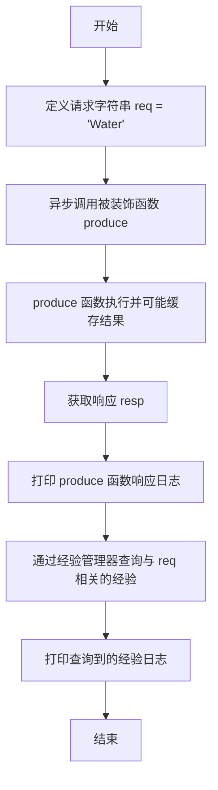

# `.\MetaGPT\examples\exp_pool\decorator.py` 详细设计文档

该脚本演示了如何使用 `@exp_cache` 装饰器自动缓存异步函数的执行结果（即“经验”），并通过经验管理器查询已缓存的记录。它通过一个简单的示例展示了如何将函数调用及其参数作为键，将返回值作为值进行存储和检索。

## 整体流程

```mermaid
graph TD
    A[开始: 运行 main 函数] --> B[调用被 @exp_cache 装饰的 produce 函数]
    B --> C{检查经验池中是否存在键为 (produce, req) 的记录?}
    C -- 是 --> D[直接从经验池返回缓存的结果]
    C -- 否 --> E[执行 produce 函数体，生成包含 UUID 的响应]
    E --> F[将 (produce, req) 和响应作为键值对存入经验池]
    F --> G[返回响应]
    G --> H[打印 produce 函数的响应]
    H --> I[通过 get_exp_manager().query_exps 查询与 req 相关的所有经验]
    I --> J[打印查询到的经验列表]
    J --> K[结束]
```

## 类结构

```
外部依赖 (metagpt)
├── exp_cache (装饰器函数)
├── get_exp_manager (全局函数)
└── logger (日志记录器)
```

## 全局变量及字段


### `logger`
    
用于记录日志的全局日志记录器实例。

类型：`Logger`
    


### `exp_cache`
    
用于缓存函数执行结果的装饰器。

类型：`Decorator`
    


### `get_exp_manager`
    
获取经验管理器实例的全局函数。

类型：`Function`
    


    

## 全局函数及方法


### `produce`

这是一个使用 `@exp_cache` 装饰器进行自动经验缓存的异步函数。它的核心功能是接收一个请求字符串，将其与一个随机生成的唯一标识符（UUID）拼接后返回。由于装饰器的作用，每次调用及其结果可能会被缓存，以便后续通过 `get_exp_manager().query_exps` 进行查询。

参数：

-  `req`：`str`，输入的请求字符串，默认为空字符串。

返回值：`str`，返回一个由输入字符串 `req` 和一个随机生成的十六进制 UUID 拼接而成的字符串。

#### 流程图

```mermaid
flowchart TD
    A[调用 produce(req)] --> B{经验池中<br>是否存在匹配结果?}
    B -- 是 --> C[从经验池返回缓存结果]
    B -- 否 --> D[执行函数体逻辑]
    D --> E[生成随机UUID]
    D --> F[拼接 req 与 UUID]
    E --> F
    F --> G[将结果存入经验池]
    G --> H[返回结果]
    C --> H
```

#### 带注释源码

```
@exp_cache()  # 应用经验缓存装饰器，自动管理函数的输入输出缓存
async def produce(req=""):  # 定义异步函数produce，参数req默认为空字符串
    return f"{req} {uuid.uuid4().hex}"  # 返回请求字符串与一个随机生成的十六进制UUID的拼接结果
```


### `main`

`main` 函数是脚本的异步入口点，它演示了如何使用 `@exp_cache` 装饰器自动缓存函数执行结果（经验），并通过经验管理器查询这些缓存的经验。

参数：
- 无显式参数。作为脚本的入口函数，它不接受外部传入的参数。

返回值：`None`，该函数不返回任何值，其主要功能是执行演示逻辑并输出日志。

#### 流程图



#### 带注释源码

```python
async def main():
    # 定义一个请求字符串，用于后续的函数调用和经验查询
    req = "Water"

    # 异步调用被 @exp_cache 装饰的 produce 函数，并传入请求参数。
    # @exp_cache 装饰器可能会将此调用及其结果（resp）自动存储到经验池中。
    resp = await produce(req=req)
    # 记录 produce 函数返回的响应结果
    logger.info(f"The response of `produce({req})` is: {resp}")

    # 获取全局的经验管理器实例，并查询所有与请求字符串 'req' 相关的缓存经验。
    # 这展示了如何从经验池中检索之前存储的执行结果。
    exps = await get_exp_manager().query_exps(req)
    # 记录查询到的经验列表
    logger.info(f"Find experiences: {exps}")
```


## 关键组件


### 经验缓存装饰器 (`@exp_cache`)

一个函数装饰器，用于自动拦截被装饰函数的调用，将其输入参数和输出结果作为一条经验（experience）存储到经验池中，实现经验的自动收集。

### 经验管理器 (`get_exp_manager`)

一个全局函数，用于获取单例的经验管理器实例。该管理器负责管理经验池，提供存储和查询经验的核心功能。

### 经验查询 (`query_exps`)

经验管理器提供的方法，允许根据查询条件（例如，输入参数）从经验池中检索匹配的历史经验记录。


## 问题及建议


### 已知问题

-   **缓存键生成逻辑不明确**：`@exp_cache()` 装饰器默认使用函数名和参数生成缓存键。当函数参数是复杂对象（如字典、列表、自定义类实例）时，默认的键生成方式可能导致键值不稳定或冲突，从而影响缓存的正确性。
-   **缺乏缓存失效策略**：代码示例中未展示缓存的过期时间（TTL）或手动清理机制。在实际应用中，缓存数据可能过时，如果没有失效策略，会导致返回陈旧或不正确的经验数据。
-   **异步上下文管理不明确**：`get_exp_manager()` 返回的经验管理器（`ExpManager`）的生命周期和资源（如数据库连接）管理方式在示例中未体现。如果管理器持有未正确释放的资源，在长时间运行或高并发场景下可能导致资源泄漏。
-   **错误处理机制缺失**：示例代码未包含对 `produce` 函数执行失败、`query_exps` 查询失败等异常情况的处理。在实际部署中，这可能导致程序因未捕获的异常而崩溃。
-   **日志级别与信息不足**：代码使用 `logger.info` 记录日志，但在生产环境中，可能需要更细粒度的日志（如调试、警告、错误级别）来监控缓存命中、查询性能等关键指标。

### 优化建议

-   **明确并增强缓存键生成**：建议为 `@exp_cache` 装饰器提供自定义的 `key_builder` 参数，允许用户指定如何从函数参数生成稳定的缓存键，特别是处理复杂参数时。例如，可以集成 `pickle` 序列化或使用参数的 `__repr__` 方法。
-   **引入缓存失效与清理机制**：
    -   为 `@exp_cache` 装饰器增加 `ttl`（生存时间）参数，使缓存条目自动过期。
    -   在 `ExpManager` 中提供手动清理方法（如 `clear_expired`、`clear_by_key`），以支持更灵活的缓存管理。
-   **完善资源与生命周期管理**：
    -   确保 `ExpManager` 实现了上下文管理器协议（`__aenter__`/`__aexit__`），以便使用 `async with` 语句安全地获取和释放资源。
    -   或者，在应用启动/关闭时提供明确的初始化和清理钩子。
-   **增强错误处理与日志**：
    -   在 `produce` 函数和 `query_exps` 调用周围添加 `try-except` 块，捕获可能的异常（如序列化错误、存储后端错误），并记录到适当日志级别，同时考虑降级策略（如缓存失败时直接执行函数）。
    -   在 `ExpManager` 中增加更详细的日志记录，例如记录缓存命中率、查询耗时等，便于性能监控和调试。
-   **考虑并发与性能优化**：
    -   评估 `ExpManager` 内部数据结构的线程/协程安全性。如果涉及共享状态，需使用锁（如 `asyncio.Lock`）或线程安全的数据结构来防止竞态条件。
    -   对于 `query_exps` 操作，如果存储后端是数据库，建议对查询条件建立索引以提高查询效率。
-   **提供配置化选项**：允许通过配置文件或环境变量来设置缓存后端（如内存、Redis）、默认TTL、日志级别等，提高系统的可配置性和可维护性。


## 其它


### 设计目标与约束

本代码示例的核心设计目标是展示如何利用 `@exp_cache` 装饰器和 `get_exp_manager()` 函数，实现异步函数执行结果的自动缓存（作为“经验”）和后续查询。其设计约束包括：
1.  **功能性**：必须清晰地演示装饰器的使用、经验的存储和查询流程。
2.  **简洁性**：作为示例代码，应保持最小化，避免引入复杂的业务逻辑或错误处理，以突出核心机制。
3.  **异步性**：代码基于 `asyncio` 框架，所有涉及缓存和查询的操作都必须是异步的，以符合 `MetaGPT` 框架的异步设计范式。
4.  **可测试性**：通过固定的输入（如 `"Water"`）和可预测的输出模式（包含UUID），使得运行结果具备一定的可验证性。

### 错误处理与异常设计

当前示例代码未包含显式的错误处理逻辑，其错误处理依赖于底层 `MetaGPT` 经验池模块的实现。潜在的异常点及处理方式包括：
1.  **经验池连接/初始化失败**：`get_exp_manager()` 可能因配置错误或资源不可用而失败，抛出运行时异常，导致脚本终止。
2.  **缓存存储失败**：`@exp_cache` 装饰器在执行缓存操作时，如果底层存储（如数据库、内存）写入失败，可能会抛出异常。当前代码未捕获此异常，会导致 `produce` 函数调用失败。
3.  **查询失败**：`query_exps` 方法在执行查询时可能因网络、权限或数据格式问题抛出异常。当前代码未捕获此异常，会导致日志记录语句无法执行。
4.  **建议的增强**：在生产环境中，应在 `main` 函数或关键调用处添加 `try-except` 块，捕获可能的 `Exception` 并记录详细的错误日志，确保程序健壮性，避免因非核心功能（经验缓存）的故障影响主流程。

### 数据流与状态机

本示例展示了从函数调用到经验存储与查询的简化数据流：
1.  **数据流**：
    *   **输入**：外部调用 `produce(req="Water")`。
    *   **处理**：`@exp_cache` 装饰器拦截调用，首先可能根据 `req` 参数生成键，查询经验池。若未命中，则执行原 `produce` 函数体，生成包含随机UUID的字符串。
    *   **存储**：装饰器将函数返回结果 `resp` 与输入参数 `req` 关联，作为一条“经验”存储到由 `get_exp_manager()` 管理的经验池中。
    *   **输出**：函数返回结果 `resp`。
    *   **查询**：随后，通过 `get_exp_manager().query_exps(req)` 使用相同的 `req` 参数查询经验池，获取之前存储的经验列表。
    *   **日志**：原始结果和查询结果被记录到日志。
2.  **状态机（函数级）**：
    *   **`produce` 函数被调用** -> **装饰器检查缓存** -> **缓存命中** -> 直接返回缓存结果。
    *   **`produce` 函数被调用** -> **装饰器检查缓存** -> **缓存未命中** -> **执行函数体** -> **存储结果到缓存** -> 返回新结果。
    示例中由于每次UUID都不同，因此每次调用均为“缓存未命中”路径，并产生新的存储记录。

### 外部依赖与接口契约

1.  **外部依赖**：
    *   **`metagpt.exp_pool` 模块**：核心依赖，提供了 `exp_cache` 装饰器和 `get_exp_manager` 函数。该模块封装了经验缓存的具体实现（如存储后端、序列化方式）。
    *   **`metagpt.logs` 模块**：依赖其 `logger` 对象进行标准化日志输出。
    *   **`asyncio`**：Python标准库，用于运行异步主函数。
    *   **`uuid`**：Python标准库，用于生成唯一标识符，模拟可变输出。
2.  **接口契约**：
    *   **`@exp_cache()` 装饰器**：契约要求被装饰的函数必须是异步函数（`async def`）。装饰器会透明地添加缓存逻辑，但其具体的缓存键生成策略、过期时间等行为由装饰器实现定义，调用方无需知晓。
    *   **`get_exp_manager()` 函数**：契约约定该函数返回一个实现了经验管理接口的对象，该对象至少拥有 `query_exps` 等异步方法。
    *   **`produce(req="")` 函数**：契约定义了一个异步函数，接受一个字符串参数 `req`，返回一个字符串。`@exp_cache` 装饰器依赖此签名来生成缓存键和存储经验。
    *   **`query_exps(query)` 方法**：契约约定此异步方法接受一个查询参数（示例中为字符串），返回一个经验列表。具体的查询语义（精确匹配、模糊匹配等）由 `exp_pool` 模块实现。

### 配置与初始化

示例代码本身不包含任何配置或初始化逻辑，所有配置均假定由 `MetaGPT` 框架或环境默认提供：
1.  **经验池管理器初始化**：`get_exp_manager()` 函数的调用隐含了经验池管理器的懒加载初始化。实际的初始化过程（如连接数据库、加载配置）发生在 `metagpt.exp_pool` 模块内部，可能依赖于全局配置、环境变量或配置文件。
2.  **日志系统初始化**：`logger` 的使用假定 `metagpt.logs` 模块已在背后完成了日志系统的配置（如日志级别、输出格式、处理器）。
3.  **隐含的配置需求**：要使此脚本正常运行，需要确保 `MetaGPT` 框架正确安装，并且其经验池模块所需的任何外部服务（如Redis、数据库）或配置均已就绪。脚本自身没有提供检查或初始化这些依赖的机制。

### 并发与线程安全

1.  **并发模型**：代码完全基于异步I/O (`asyncio`) 模型。`@exp_cache` 装饰器的缓存操作、`query_exps` 的查询操作都被设计为异步的，以避免阻塞事件循环。
2.  **线程安全**：由于是纯异步脚本，通常运行在单线程的事件循环中，因此不涉及多线程问题。然而，`exp_pool` 底层存储后端（如果涉及共享内存或连接池）的线程安全性由 `metagpt.exp_pool` 模块保证。如果经验池后端是类似Redis的外部服务，则其客户端库通常自身处理了并发连接。
3.  **竞争条件**：在缓存场景下，潜在的“缓存击穿”问题（多个并发请求同时发现缓存缺失，同时执行函数并写入缓存）需要由 `@exp_cache` 装饰器的实现来处理，例如通过异步锁机制。示例代码未展示此场景，但这是此类缓存装饰器需要考虑的典型并发问题。

### 可观测性与监控

当前示例仅通过 `logger.info` 进行了基本的运行结果输出，缺乏生产环境所需的可观测性支持：
1.  **日志**：使用了结构化的日志记录，但级别固定为 `INFO`，缺乏 `DEBUG`, `WARNING`, `ERROR` 等不同级别的日志来追踪缓存命中、未命中、存储失败、查询耗时等详细行为。
2.  **指标（Metrics）**：缺少关键性能指标（如缓存命中率、函数执行平均耗时、经验存储成功率、查询延迟）的收集和暴露。这些指标对于评估缓存效果和系统健康度至关重要。
3.  **追踪（Tracing）**：没有集成分布式追踪，无法在一个跨服务或复杂调用链中追踪一次 `produce` 调用及其关联的缓存操作。
4.  **建议**：在生产集成时，应在 `exp_pool` 模块内部或装饰器层面添加更丰富的日志、指标收集（例如使用 `Prometheus` 客户端）和追踪 span 的创建。

### 安全考虑

示例代码在安全方面较为简单，但仍有一些隐含点：
1.  **输入验证**：`produce` 函数和 `query_exps` 方法直接使用传入的 `req` 参数。如果此参数来自不可信的用户输入，且底层经验池实现（如使用数据库）未对查询参数进行安全处理，可能存在注入攻击风险（如SQL注入）。
2.  **敏感数据泄露**：经验缓存机制存储了函数的输入和输出。如果被缓存的函数处理敏感信息（如个人身份信息、密码），这些数据可能会被持久化到存储后端，存在泄露风险。`@exp_cache` 装饰器应提供排除敏感参数或对缓存值进行脱敏/加密的机制。
3.  **访问控制**：示例代码假设调用者有权限读写经验池。在实际多用户或微服务场景中，可能需要基于角色或身份的访问控制，确保用户只能查询或修改自己的经验。
4.  **代码中**：当前示例不涉及这些安全问题，但这是将此类缓存机制应用于真实业务时必须评估的方面。

    