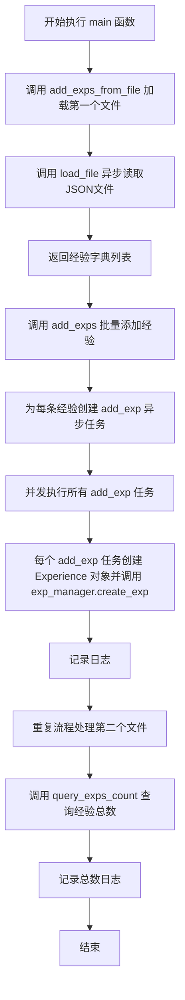
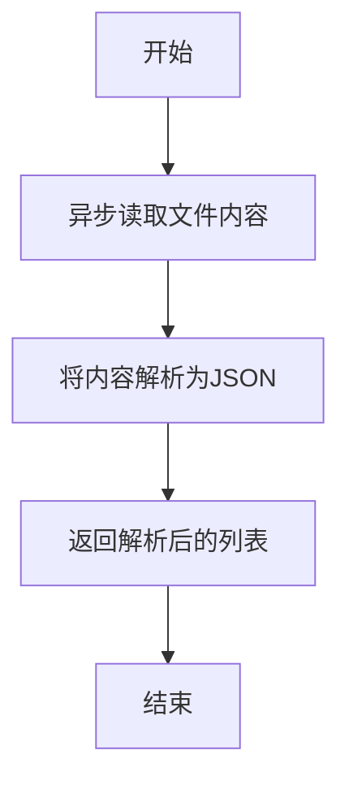
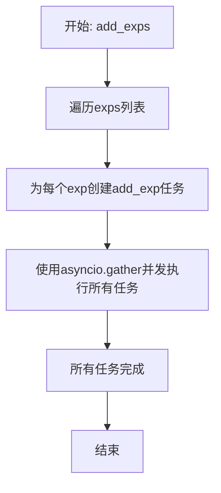
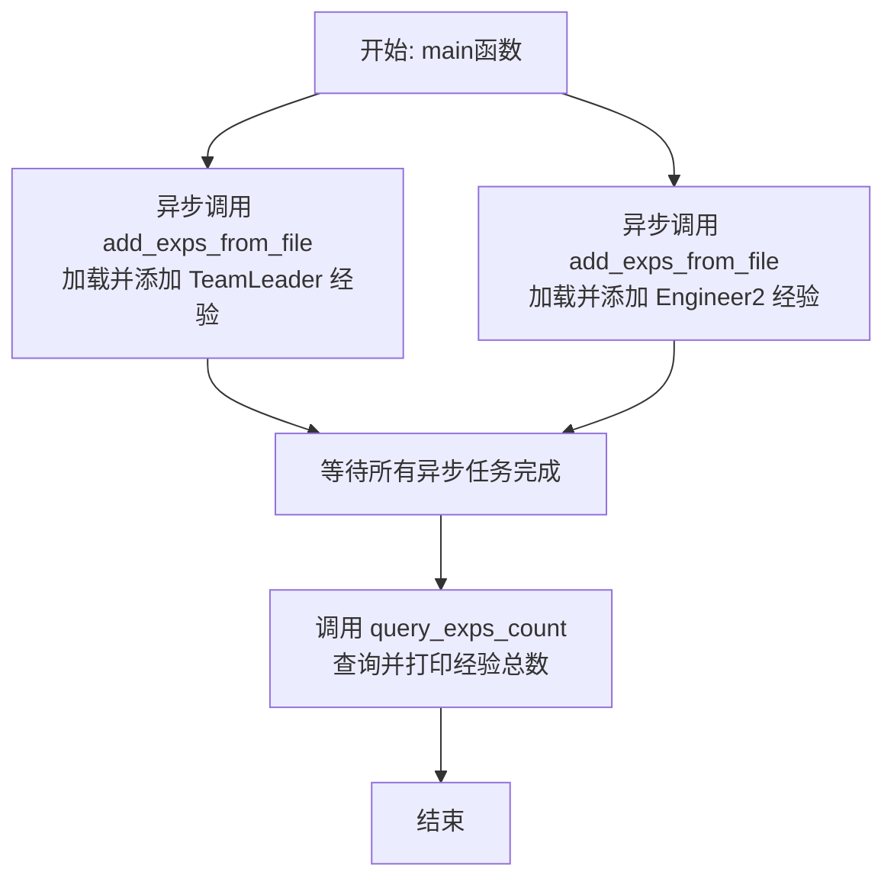

# `.\MetaGPT\examples\exp_pool\init_exp_pool.py` 详细设计文档

该脚本是一个经验池初始化工具，其核心功能是异步地从指定的JSON文件中读取经验数据（包含请求、响应和标签），将其封装为`Experience`对象，并通过经验管理器批量添加到系统的经验池中，最后统计并输出经验池中的总条目数。

## 整体流程



## 类结构

```
本文件不包含类定义，主要由异步函数组成。
├── 全局异步函数
│   ├── load_file
│   ├── add_exp
│   ├── add_exps
│   ├── add_exps_from_file
│   └── main
└── 全局同步函数
    └── query_exps_count
```

## 全局变量及字段


### `EXAMPLE_DATA_PATH`
    
常量路径，指向示例数据存储的目录位置

类型：`Path`
    


### `logger`
    
日志记录器实例，用于输出程序运行日志

类型：`Logger`
    


    

## 全局函数及方法

### `load_file`

异步加载并解析一个 JSON 文件。

参数：
- `filepath`：`str` 或 `Path` 对象，指向 JSON 文件的路径。

返回值：`list[dict]`，从 JSON 文件解析出的字典列表。

#### 流程图



#### 带注释源码

```python
async def load_file(filepath) -> list[dict]:
    """Asynchronously loads and parses a JSON file.

    Args:
        filepath: Path to the JSON file.

    Returns:
        A list of dictionaries parsed from the JSON file.
    """

    # 使用 aread 异步读取文件内容
    # 然后使用 json.loads 将字符串内容解析为 Python 对象（此处期望为列表）
    return json.loads(await aread(filepath))
```


### `add_exp`

异步函数，用于向经验池中添加一条新的经验记录。它会创建一个`Experience`对象，设置其类型为手动录入，并确保经验管理器处于可写状态后执行创建操作。

参数：

- `req`：`str`，请求字符串，代表触发该经验的输入或问题
- `resp`：`str`，响应字符串，代表针对该请求的答案或解决方案
- `tag`：`str`，标签字符串，用于对经验进行分类和检索
- `metric`：`Metric`，可选的度量对象，用于评估该经验的质量。默认为一个值为10、原因为“Manual”的`Score`对象。

返回值：`None`，该函数不返回任何值，其主要作用是通过副作用向经验池中写入数据。

#### 流程图

```mermaid
flowchart TD
    A[开始: add_exp(req, resp, tag, metric)] --> B[构造Experience对象]
    B --> C[获取经验管理器实例]
    C --> D[设置管理器为可写状态]
    D --> E[调用管理器创建经验]
    E --> F[记录日志]
    F --> G[结束]
```

#### 带注释源码

```python
async def add_exp(req: str, resp: str, tag: str, metric: Metric = None):
    """Adds a new experience to the experience pool.

    Args:
        req: The request string.
        resp: The response string.
        tag: A tag for categorizing the experience.
        metric: Optional metric for the experience. Defaults to a score of 10.

    """
    # 1. 根据传入参数构造一个Experience对象。
    #    entry_type固定为EntryType.MANUAL，表示这是手动添加的经验。
    #    如果未提供metric参数，则使用默认的Metric(score=Score(val=10, reason="Manual"))。
    exp = Experience(
        req=req,
        resp=resp,
        entry_type=EntryType.MANUAL,
        tag=tag,
        metric=metric or Metric(score=Score(val=10, reason="Manual")),
    )
    # 2. 获取全局的经验池管理器实例。
    exp_manager = get_exp_manager()
    # 3. 确保管理器处于可写状态，以便能够添加新经验。
    exp_manager.is_writable = True

    # 4. 调用管理器的create_exp方法，将构造好的经验对象存入经验池。
    exp_manager.create_exp(exp)
    # 5. 记录一条信息日志，表明已为某个请求创建了新经验（日志中截取了请求的前10个字符）。
    logger.info(f"New experience created for the request `{req[:10]}`.")
```


### `add_exps`

异步批量添加经验到经验池中。该函数接收一个经验字典列表和一个标签，为列表中的每个经验项调用`add_exp`函数，并使用`asyncio.gather`并发执行所有添加任务，以提高效率。

参数：

- `exps`：`list`，包含多个经验字典的列表。每个字典应至少包含`req`和`resp`键。
- `tag`：`str`，用于分类经验的标签。

返回值：`None`，无返回值。

#### 流程图



#### 带注释源码

```python
async def add_exps(exps: list, tag: str):
    """Adds multiple experiences to the experience pool.

    Args:
        exps: A list of experience dictionaries.
        tag: A tag for categorizing the experiences.

    """
    # 遍历经验列表，为每个经验项创建一个异步任务。
    # 如果req字段不是字符串，则将其转换为JSON字符串。
    tasks = [
        add_exp(req=exp["req"] if isinstance(exp["req"], str) else json.dumps(exp["req"]), resp=exp["resp"], tag=tag)
        for exp in exps
    ]
    # 使用asyncio.gather并发执行所有添加任务，等待所有任务完成。
    await asyncio.gather(*tasks)
```


### `add_exps_from_file`

该函数是经验池初始化流程的一部分，负责从指定的JSON文件中异步加载经验数据，并使用给定的标签将这些经验批量添加到经验池中。

参数：

-  `tag`：`str`，用于分类和标记这批经验的标签。
-  `filepath`：`Path`，包含经验数据的JSON文件的路径。

返回值：`None`，该函数不返回任何值，其作用是将数据写入经验池。

#### 流程图

```mermaid
flowchart TD
    A[开始: add_exps_from_file(tag, filepath)] --> B[异步调用 load_file(filepath)]
    B --> C{文件加载成功?}
    C -- 是 --> D[获取经验列表 exps]
    C -- 否 --> E[抛出异常/流程终止]
    D --> F[异步调用 add_exps(exps, tag)]
    F --> G[结束]
    E --> G
```

#### 带注释源码

```python
async def add_exps_from_file(tag: str, filepath: Path):
    """Loads experiences from a file and adds them to the experience pool.

    Args:
        tag: A tag for categorizing the experiences.
        filepath: Path to the file containing experiences.

    """
    # 1. 异步加载并解析指定路径的JSON文件，返回一个字典列表
    exps = await load_file(filepath)
    # 2. 将加载的经验列表和标签传递给 add_exps 函数进行批量添加
    await add_exps(exps, tag)
```


### `query_exps_count`

该函数用于查询并记录经验池中经验条目的总数。它通过获取经验池管理器实例，调用其计数方法，并将结果以日志形式输出。

参数：
- 无参数

返回值：`None`，该函数不返回任何值，其功能是执行查询并记录日志。

#### 流程图

```mermaid
flowchart TD
    A[开始] --> B[获取经验池管理器实例<br>exp_manager = get_exp_manager()]
    B --> C[查询经验条目总数<br>count = exp_manager.get_exps_count()]
    C --> D[记录日志<br>logger.info]
    D --> E[结束]
```

#### 带注释源码

```python
def query_exps_count():
    """Queries and logs the total count of experiences in the pool."""
    # 1. 获取经验池管理器实例
    exp_manager = get_exp_manager()
    # 2. 调用管理器的方法，获取经验条目总数
    count = exp_manager.get_exps_count()
    # 3. 使用日志记录器输出总数
    logger.info(f"Experiences Count: {count}")
```


### `main`

`main` 函数是程序的异步入口点，负责初始化经验池。它通过从指定的 JSON 文件中加载两组经验数据（分别对应“TeamLeader”和“Engineer2”角色），并将它们异步地添加到经验池中。最后，它查询并记录当前经验池中的总经验条目数。

参数：
- 无

返回值：`None`，无返回值

#### 流程图



#### 带注释源码

```python
async def main():
    # 1. 从文件加载“TeamLeader.llm_cached_aask”类别的经验并添加到经验池
    await add_exps_from_file("TeamLeader.llm_cached_aask", EXAMPLE_DATA_PATH / "exp_pool/team_leader_exps.json")
    # 2. 从文件加载“Engineer2.llm_cached_aask”类别的经验并添加到经验池
    await add_exps_from_file("Engineer2.llm_cached_aask", EXAMPLE_DATA_PATH / "exp_pool/engineer_exps.json")
    # 3. 查询并打印当前经验池中的总经验条目数
    query_exps_count()
```

## 关键组件


### 经验池管理器 (Experience Pool Manager)

负责经验数据的存储、检索和管理，提供创建经验、查询数量等核心功能，并支持通过`get_exp_manager()`全局访问。

### 经验数据结构 (Experience Data Structure)

定义了经验在系统中的核心表示，包含请求、响应、标签、类型和评估指标等字段，是经验池操作的基本数据单元。

### 异步文件加载器 (Asynchronous File Loader)

提供异步读取和解析JSON格式经验数据文件的功能，支持从外部文件批量导入经验到经验池中。

### 经验批量添加器 (Batch Experience Adder)

支持将一组经验数据（列表形式）异步、并发地添加到经验池中，提高了批量数据导入的效率。

### 文件到经验池的管道 (File-to-Pool Pipeline)

封装了从指定文件路径读取经验数据并批量添加到经验池的完整流程，是初始化经验池的主要入口之一。


## 问题及建议


### 已知问题

-   **硬编码的默认评分逻辑**：在 `add_exp` 函数中，当未提供 `metric` 参数时，会默认创建一个 `Score(val=10, reason="Manual")`。这种硬编码的默认值缺乏灵活性，无法根据不同的经验类型或上下文调整默认评分策略。
-   **缺乏输入验证与错误处理**：代码在处理外部数据（如从JSON文件加载的经验列表）时，没有对数据的完整性和格式进行充分验证。例如，`add_exps` 函数假设 `exp` 字典中一定包含 `"req"` 和 `"resp"` 键，且 `"req"` 字段可能不是字符串。这可能导致运行时错误或数据污染。
-   **同步与异步混合使用**：`query_exps_count` 函数是一个同步函数，但在 `main` 函数中被调用。虽然当前代码运行正常，但在更复杂的异步上下文中，这种混合使用可能引发潜在的并发问题或阻塞事件循环。
-   **全局状态管理风险**：`get_exp_manager()` 返回一个全局的经验管理器实例，并在 `add_exp` 中直接修改其 `is_writable` 属性。这种模式在多线程或复杂异步场景下可能导致状态不一致或竞态条件。
-   **日志信息过于简略**：日志仅记录了请求的前10个字符，这在调试或审计时可能无法提供足够的信息来唯一标识或追溯具体的经验条目。

### 优化建议

-   **参数化默认评分**：建议将默认的 `Metric` 或 `Score` 作为可配置参数，例如通过环境变量、配置文件或函数参数传入，以提高代码的灵活性和可维护性。
-   **增强数据验证**：在 `load_file` 和 `add_exps` 函数中增加数据验证逻辑。可以使用Pydantic等库定义严格的数据模型，或在加载后检查必需字段的存在性、类型以及业务逻辑的有效性（如 `req` 和 `resp` 的非空性），并抛出明确的异常。
-   **统一异步模型**：考虑将 `query_exps_count` 函数也改为异步函数（如 `async_query_exps_count`），并在 `main` 中使用 `await` 调用，以保持整个应用流程的异步一致性，避免潜在的阻塞。
-   **改进状态管理**：避免在业务函数中直接修改全局管理器的内部状态（如 `is_writable`）。更好的做法是将“是否可写”作为管理器初始化或上下文管理的配置项，或者通过管理器的特定方法（如 `begin_write_session()`）来控制。
-   **丰富日志内容**：改进日志记录，例如为每条经验生成一个唯一ID（如UUID）并记录，或者在日志中包含 `tag` 和更完整的请求/响应摘要（可考虑哈希或截断更长但安全的内容），以便于跟踪和排查问题。
-   **增加批处理性能监控**：在 `add_exps` 函数中，虽然使用了 `asyncio.gather` 进行并发，但建议添加简单的性能日志，记录处理的经验总数和总耗时，以便评估和优化批量导入的性能。
-   **提供更友好的命令行接口**：当前脚本的入口是硬编码的文件路径。可以将其改进为接受命令行参数，允许用户指定要加载的标签（tag）和文件路径，增强工具的实用性。


## 其它


### 设计目标与约束

本代码模块的核心设计目标是初始化经验池，通过从预设的JSON数据文件中加载示例经验数据，并将其持久化到经验池存储中。其设计遵循以下约束：
1.  **异步执行**：所有涉及I/O（文件读取、数据库/存储操作）的操作均采用异步模式，以提高程序在I/O密集型场景下的并发性能。
2.  **模块化与可复用性**：将核心操作（加载文件、添加单条/多条经验）封装为独立的异步函数，便于在其他上下文中调用和测试。
3.  **配置驱动**：经验数据的来源路径依赖于外部常量 `EXAMPLE_DATA_PATH`，使得数据源可配置，增强了灵活性。
4.  **最小化侵入**：通过 `get_exp_manager()` 获取经验管理器实例，与经验池的核心实现解耦，本模块仅负责数据的初始注入。

### 错误处理与异常设计

当前代码的错误处理机制较为基础，主要依赖Python的默认异常传播和日志记录：
1.  **显式错误处理**：在 `load_file` 函数中，`json.loads` 可能抛出 `json.JSONDecodeError`，该异常会向上层调用者（如 `add_exps_from_file`）传播。
2.  **隐式错误处理**：`aread`、`exp_manager.create_exp` 等操作可能抛出 `IOError`、`OSError` 或自定义存储异常。这些异常未在代码中显式捕获，会导致异步任务 (`asyncio.gather`) 或整个程序 (`asyncio.run`) 失败。
3.  **日志记录**：使用 `logger.info` 记录成功操作的信息，但对于错误和警告，缺乏相应的日志记录（如 `logger.error`）。
4.  **改进空间**：缺乏健壮的错误恢复机制。例如，文件读取失败或单条经验插入失败会导致整批数据插入中止。可考虑增加异常捕获、错误日志记录、以及部分失败容忍（例如使用 `asyncio.gather` 的 `return_exceptions=True` 参数）。

### 数据流与状态机

本模块的数据流是单向和批处理式的，不涉及复杂的状态转换：
1.  **数据源**：两个固定的JSON文件（`team_leader_exps.json`, `engineer_exps.json`）。
2.  **加载与解析**：通过 `load_file` 函数异步读取文件并解析为 `list[dict]`。
3.  **数据转换**：在 `add_exps` 函数中，遍历列表，对每条数据，将 `req` 字段确保为字符串（如果是字典则做JSON序列化），并补充 `tag` 和默认的 `metric`。
4.  **数据持久化**：调用 `add_exp` 函数，将转换后的数据封装为 `Experience` 对象，通过经验管理器 (`exp_manager`) 的 `create_exp` 方法写入底层存储。
5.  **状态查询**：所有数据插入完成后，调用 `query_exps_count` 查询并日志记录经验池中的总条目数。
6.  **状态机**：非常简单，仅包含“初始空池” -> “数据加载中” -> “数据加载完成” 几个阶段，没有循环或条件分支状态。

### 外部依赖与接口契约

本模块严重依赖外部组件和约定：
1.  **内部依赖**：
    *   `metagpt.exp_pool`：核心经验池管理模块，通过 `get_exp_manager()` 获取管理器实例。
    *   `metagpt.exp_pool.schema`：定义了数据模型 `Experience`, `EntryType`, `Metric`, `Score`。本模块必须按照此模式构造对象。
    *   `metagpt.utils.common.aread`：用于异步文件读取的工具函数。
    *   `metagpt.logs.logger`：用于应用程序日志记录。
2.  **数据契约**：
    *   输入JSON文件必须具有特定的结构，即包含 `req` 和 `resp` 键的字典列表。`req` 可以是字符串或字典（后者会被序列化）。
3.  **环境/配置契约**：
    *   依赖 `metagpt.const.EXAMPLE_DATA_PATH` 常量来定位示例数据目录。该路径必须在运行时可访问。
4.  **接口契约**：
    *   `get_exp_manager()`：返回的对象必须具有 `is_writable` 属性、`create_exp(exp: Experience)` 方法和 `get_exps_count() -> int` 方法。
    *   `aread(filepath)`: 必须返回文件的字符串内容。

    