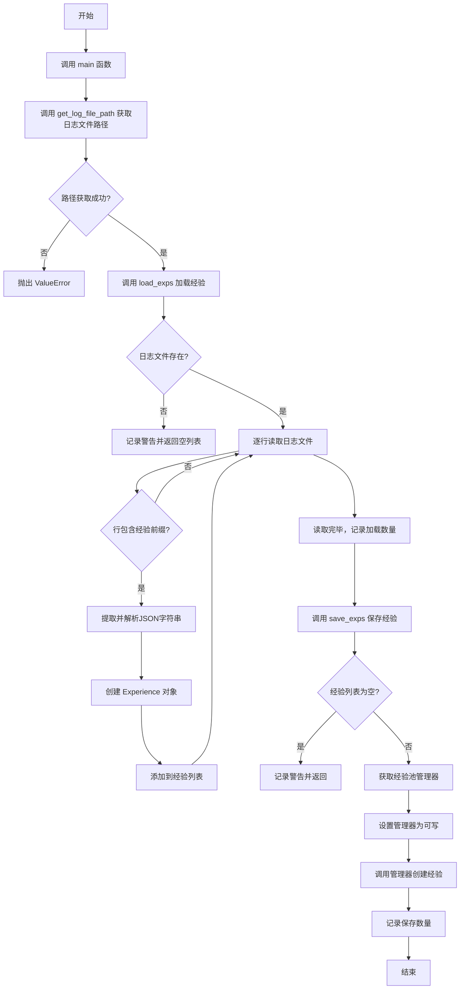
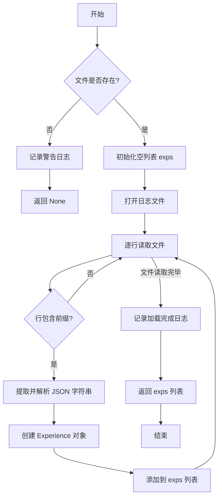
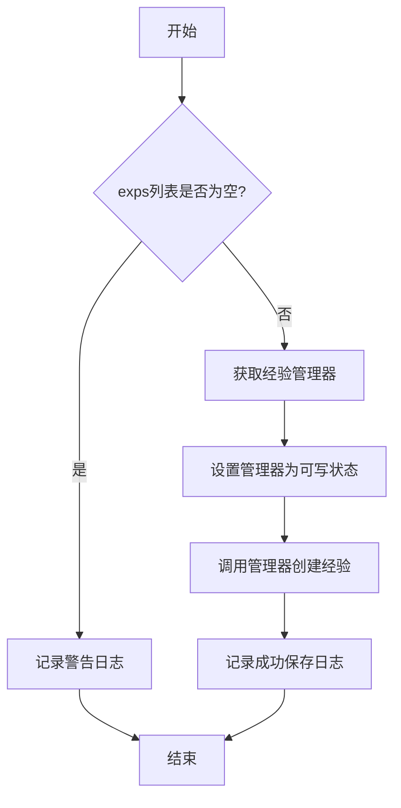
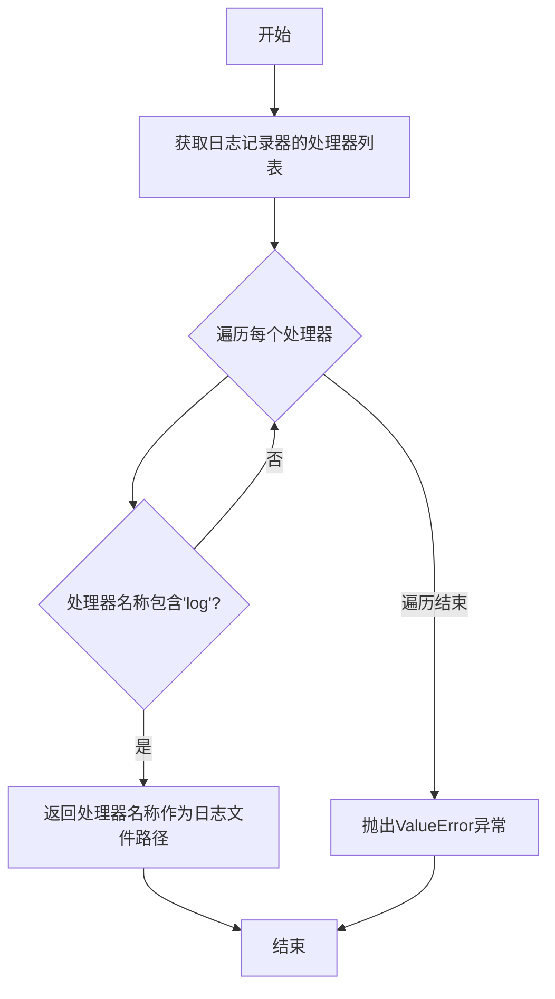
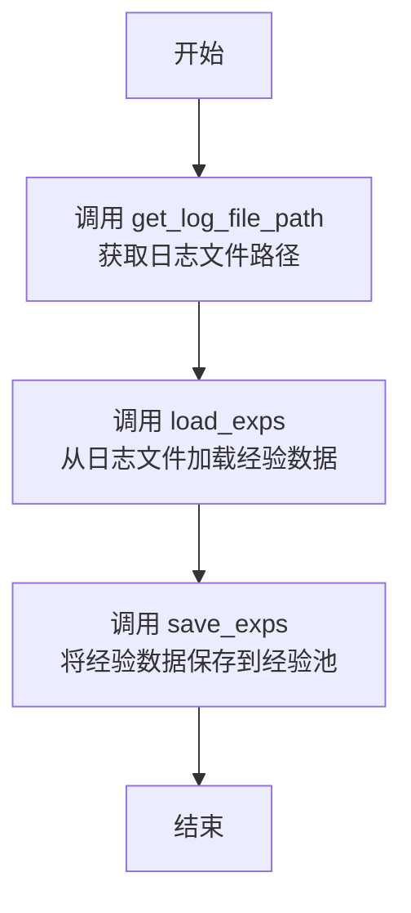
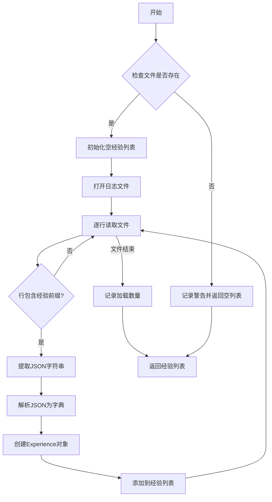

# `.\MetaGPT\examples\exp_pool\load_exps_from_log.py` 详细设计文档

该代码模块的核心功能是从指定的日志文件中加载经验数据（Experience），并将其保存到经验池（Experience Pool）中。它通过解析日志文件中特定前缀的行来提取JSON格式的经验数据，然后利用经验池管理器将这些经验持久化存储。

## 整体流程



## 类结构

```
Experience (数据类，来自 metagpt.exp_pool.schema)
├── 字段: (由 **exp_data 动态创建)
└── 方法: (由 Pydantic/BaseModel 提供)
```

## 全局变量及字段


### `LOG_NEW_EXPERIENCE_PREFIX`
    
日志文件中标识新经验记录行的前缀字符串，用于从日志行中提取经验数据。

类型：`str`
    


### `logger`
    
用于记录代码执行过程中的信息、警告和错误的日志记录器实例。

类型：`metagpt.logs.logger.Logger`
    


### `Experience.(动态字段，由传入的 exp_data 字典决定)`
    
Experience 类的字段由传入的 exp_data 字典动态决定，用于存储从日志中解析出的经验数据。

类型：`dict[str, Any]`
    
    

## 全局函数及方法

### `load_exps`

从指定的日志文件中加载经验数据，解析并返回一个`Experience`对象列表。该函数会检查文件是否存在，逐行读取日志文件，识别包含特定前缀的行，解析其中的JSON字符串，并将其转换为`Experience`对象。

参数：

- `log_file_path`：`str`，日志文件的路径。

返回值：`list[Experience]`，从日志文件中加载的`Experience`对象列表。如果文件不存在，则返回`None`。

#### 流程图



#### 带注释源码

```python
def load_exps(log_file_path: str) -> list[Experience]:
    """Loads experiences from a log file.

    Args:
        log_file_path (str): The path to the log file.

    Returns:
        list[Experience]: A list of Experience objects loaded from the log file.
    """

    # 检查传入的日志文件路径是否存在
    if not Path(log_file_path).exists():
        # 如果文件不存在，记录警告日志
        logger.warning(f"`load_exps` called with a non-existent log file path: {log_file_path}")
        # 提前返回 None
        return

    # 初始化一个空列表，用于存储解析后的 Experience 对象
    exps = []
    # 以只读模式打开日志文件
    with open(log_file_path, "r") as log_file:
        # 逐行遍历日志文件
        for line in log_file:
            # 检查当前行是否包含定义的经验日志前缀
            if LOG_NEW_EXPERIENCE_PREFIX in line:
                # 从行中分离出前缀后面的 JSON 字符串部分，并去除首尾空白字符
                json_str = line.split(LOG_NEW_EXPERIENCE_PREFIX, 1)[1].strip()
                # 将 JSON 字符串解析为 Python 字典
                exp_data = json.loads(json_str)

                # 使用字典解包的方式，将数据传递给 Experience 类的构造函数，创建一个 Experience 对象
                exp = Experience(**exp_data)
                # 将创建的对象添加到结果列表中
                exps.append(exp)

    # 记录信息日志，说明从文件中加载了多少条经验
    logger.info(f"Loaded {len(exps)} experiences from log file: {log_file_path}")

    # 返回包含所有 Experience 对象的列表
    return exps
```

### `save_exps`

将给定的经验列表保存到经验池中。

参数：
- `exps`：`list[Experience]`，要保存的经验对象列表。

返回值：`None`，该函数没有返回值。

#### 流程图



#### 带注释源码

```python
def save_exps(exps: list[Experience]):
    """Saves a list of experiences to the experience pool.

    Args:
        exps (list[Experience]): The list of experiences to save.
    """

    # 检查传入的经验列表是否为空
    if not exps:
        logger.warning("`save_exps` called with an empty list of experiences.")
        return

    # 获取经验池管理器实例
    manager = get_exp_manager()
    # 将管理器设置为可写状态，允许写入操作
    manager.is_writable = True

    # 调用管理器的`create_exps`方法，将经验列表批量保存到经验池
    manager.create_exps(exps)
    # 记录成功保存的经验数量
    logger.info(f"Saved {len(exps)} experiences.")
```

### `get_log_file_path`

该函数用于检索日志文件的路径。它通过检查日志记录器的处理器（handlers）来查找包含"log"名称的处理器，并返回其对应的文件路径。如果未找到日志文件路径，则抛出`ValueError`异常。

参数：无

返回值：`str`，日志文件的路径

#### 流程图



#### 带注释源码

```python
def get_log_file_path() -> str:
    """Retrieves the path to the log file.

    Returns:
        str: The path to the log file.

    Raises:
        ValueError: If the log file path cannot be found.
    """

    # 获取日志记录器的处理器列表
    handlers = logger._core.handlers

    # 遍历每个处理器
    for handler in handlers.values():
        # 检查处理器名称是否包含"log"
        if "log" in handler._name:
            # 返回处理器名称作为日志文件路径
            return handler._name[1:-1]

    # 如果未找到日志文件路径，抛出ValueError异常
    raise ValueError("Log file not found")
```

### `main`

`main` 函数是程序的入口点，负责协调加载和保存经验数据。它首先获取日志文件路径，然后从该路径加载经验数据，最后将这些经验数据保存到经验池中。

参数：
- 无

返回值：`None`，无返回值

#### 流程图



#### 带注释源码

```python
def main():
    # 获取日志文件的路径
    log_file_path = get_log_file_path()

    # 从指定的日志文件路径加载经验数据
    exps = load_exps(log_file_path)
    
    # 将加载的经验数据保存到经验池中
    save_exps(exps)
```

### `load_exps`

从指定的日志文件中加载经验数据，解析并返回一个`Experience`对象列表。

参数：
- `log_file_path`：`str`，日志文件的路径。

返回值：`list[Experience]`，从日志文件中加载的`Experience`对象列表。

#### 流程图



#### 带注释源码

```python
def load_exps(log_file_path: str) -> list[Experience]:
    """Loads experiences from a log file.

    Args:
        log_file_path (str): The path to the log file.

    Returns:
        list[Experience]: A list of Experience objects loaded from the log file.
    """

    # 检查日志文件是否存在，如果不存在则记录警告并返回空列表
    if not Path(log_file_path).exists():
        logger.warning(f"`load_exps` called with a non-existent log file path: {log_file_path}")
        return

    # 初始化一个空列表用于存储加载的经验对象
    exps = []
    # 以只读模式打开日志文件
    with open(log_file_path, "r") as log_file:
        # 逐行读取日志文件
        for line in log_file:
            # 检查当前行是否包含新经验的前缀标识
            if LOG_NEW_EXPERIENCE_PREFIX in line:
                # 从行中提取JSON字符串部分（去除前缀和空白字符）
                json_str = line.split(LOG_NEW_EXPERIENCE_PREFIX, 1)[1].strip()
                # 将JSON字符串解析为Python字典
                exp_data = json.loads(json_str)

                # 使用字典数据创建Experience对象
                exp = Experience(**exp_data)
                # 将创建的对象添加到列表中
                exps.append(exp)

    # 记录成功加载的经验数量
    logger.info(f"Loaded {len(exps)} experiences from log file: {log_file_path}")

    # 返回加载的经验对象列表
    return exps
```

## 关键组件


### 日志文件路径获取

通过分析日志记录器的处理器配置，动态获取当前日志文件的存储路径。

### 经验日志解析与加载

从指定的日志文件中逐行读取，识别并解析包含新经验前缀的JSON字符串，将其反序列化为Experience对象列表。

### 经验池管理器交互

获取经验池管理器实例，启用写入权限，并将加载的经验对象批量持久化到经验存储系统中。

### 主流程协调器

协调日志文件路径获取、经验加载和保存的完整工作流，作为脚本执行的入口点。


## 问题及建议


### 已知问题

-   **`load_exps` 函数在文件不存在时返回 `None`**：函数签名声明返回 `list[Experience]`，但当文件不存在时，函数执行 `return` 语句，实际返回 `None`。这违反了类型提示，可能导致调用方出现 `TypeError` 或 `AttributeError`。
-   **`save_exps` 函数在输入为空列表时静默返回**：函数签名未声明返回值，但在输入为空列表时直接返回。虽然进行了日志警告，但调用方无法通过返回值明确知晓操作未执行。
-   **`get_log_file_path` 函数实现脆弱**：该函数依赖于 `logger._core.handlers` 的内部属性（`_name`）来查找日志文件路径。这种实现方式与日志库的内部实现紧密耦合，一旦日志库升级或内部结构改变，此函数极易失效。
-   **异常处理不完善**：`load_exps` 函数中的 `json.loads(json_str)` 可能因日志行格式错误而抛出 `json.JSONDecodeError`，但当前代码未捕获此异常，可能导致整个程序因单行日志格式问题而崩溃。
-   **主函数 `main` 缺乏错误处理**：`main` 函数直接调用 `get_log_file_path`、`load_exps` 和 `save_exps`，但未对可能抛出的异常（如 `ValueError`、文件读取错误等）进行捕获和处理，脚本的健壮性不足。

### 优化建议

-   **修正函数返回值的一致性**：
    -   修改 `load_exps` 函数，在文件不存在时返回一个空列表 `[]` 而不是 `None`，以符合类型提示并简化调用方的空值判断逻辑。
    -   考虑让 `save_exps` 函数返回一个布尔值或受影响的行数，以明确指示操作是否成功执行。
-   **解耦日志文件路径获取逻辑**：重构 `get_log_file_path` 函数。建议通过配置读取、环境变量或向日志管理器查询等更稳定、声明式的方式来获取日志文件路径，避免深度依赖第三方库的内部私有属性。
-   **增强异常处理与日志记录**：
    -   在 `load_exps` 函数中，使用 `try-except` 块包裹 `json.loads` 调用，捕获 `json.JSONDecodeError`。当发生错误时，记录警告日志并跳过该行，而不是中断整个加载过程。
    -   在 `main` 函数中增加 `try-except` 块，捕获可能出现的异常，并记录错误日志，使脚本在遇到问题时能优雅地失败或提供明确的错误信息。
-   **提升代码可测试性**：
    -   将 `load_exps` 和 `save_exps` 函数对文件系统和全局 `get_exp_manager` 的依赖通过参数注入（例如，将文件操作抽象为接口，将管理器作为参数传入），以便于编写单元测试。
-   **考虑性能优化**：如果日志文件非常大，`load_exps` 函数逐行读取并解析的方式是合适的。但可以评估是否需要增加分块读取或流式处理的选项，以应对极端情况下的内存使用。
-   **完善文档与类型提示**：确保所有函数（包括 `main`）都有完整的文档字符串。特别是 `get_log_file_path`，应在其文档中明确说明其当前脆弱的实现方式及潜在的失效风险。


## 其它


### 设计目标与约束

本模块的核心设计目标是提供一个轻量级、职责单一的日志经验数据加载与持久化工具。它作为经验池（Experience Pool）系统的数据导入入口，负责从结构化的日志文件中解析经验数据，并将其批量存储到经验池中。主要约束包括：1) **输入格式强依赖**：严格依赖日志文件中以特定前缀 `LOG_NEW_EXPERIENCE_PREFIX` 标识的 JSON 行格式，日志格式的变更将导致模块失效。2) **同步阻塞操作**：文件读取和数据库写入均为同步 I/O 操作，在处理大文件时可能阻塞主线程。3) **异常处理简化**：对文件不存在、JSON 解析错误等情况仅进行日志警告并静默返回，未向上层抛出可捕获的异常，降低了调用方的错误感知和控制能力。

### 错误处理与异常设计

模块采用“记录并继续”或“记录并退出”的宽松错误处理策略。具体设计如下：
1. **`load_exps` 函数**：当传入的日志文件路径不存在时，记录警告日志并返回 `None`（由于函数签名声明返回 `list[Experience]`，实际返回 `None` 可能导致类型错误）。在遍历日志行进行 JSON 解析时，若某行包含前缀但 JSON 格式无效，`json.loads` 会抛出 `JSONDecodeError` 异常，此异常未在函数内被捕获，将直接导致函数执行中断。
2. **`save_exps` 函数**：当传入的经验列表为空时，记录警告日志并直接返回，不执行任何存储操作。
3. **`get_log_file_path` 函数**：当无法从日志处理器中找到日志文件路径时，抛出 `ValueError` 异常，这是模块中唯一主动抛出的异常。
4. **整体策略**：该设计侧重于功能的可用性而非健壮性，适合在受控环境或脚本中运行。但在集成到更大系统时，缺乏结构化的错误反馈机制（如自定义异常类型、错误码）可能使问题排查和流程控制变得困难。

### 数据流与状态机

模块的数据流是线性的、无状态的批处理流程：
1. **触发**：通过执行 `main()` 函数或直接运行脚本触发。
2. **路径获取**：调用 `get_log_file_path()`，从已配置的日志处理器中提取日志文件的实际路径。
3. **数据提取**：调用 `load_exps(log_file_path)`，顺序读取日志文件，筛选出包含特定前缀的行，解析 JSON 字符串并反序列化为 `Experience` 对象列表。此过程是只读的，不改变源文件。
4. **数据持久化**：调用 `save_exps(exps)`，获取经验池管理器实例，启用其写入权限，并将 `Experience` 对象列表批量提交到经验池后端存储（如数据库）。此步骤会改变经验池的状态。
5. **状态机**：整个流程不维护内部状态，每次执行都是独立的。它不检查经验是否已存在，直接执行创建操作，可能依赖于经验池管理器内部的去重逻辑。

### 外部依赖与接口契约

模块的运作严重依赖外部组件，定义了明确的接口契约：
1. **日志系统 (`metagpt.logs.logger`)**：
   * **契约**：假设存在一个已配置的、包含文件处理器的日志记录器，且该文件处理器的 `_name` 属性格式可被 `get_log_file_path` 解析。
   * **用途**：用于记录操作信息、警告和错误。
2. **经验池系统 (`metagpt.exp_pool`)**：
   * **契约**：`get_exp_manager()` 函数返回一个实现了 `create_exps` 方法且具有 `is_writable` 属性的管理器对象。
   * **用途**：作为经验数据的最终存储目的地。
3. **经验数据模式 (`metagpt.exp_pool.schema`)**：
   * **契约**：`Experience` 类必须能够通过关键字参数 (`**exp_data`) 从字典实例化。`LOG_NEW_EXPERIENCE_PREFIX` 常量定义了日志行中的标识符。
   * **用途**：定义了数据加载和转换的格式规范。
4. **标准库**：依赖 `pathlib.Path` 进行路径检查，依赖 `json` 进行数据解析，依赖 `open` 进行文件读取。这些是稳定的依赖。

### 性能考量

1. **I/O 效率**：`load_exps` 函数逐行读取整个文件，对于非常大的日志文件，内存占用较低，但 I/O 时间是线性的。若只需处理部分数据，此方法不够高效。
2. **批量操作**：`save_exps` 函数通过 `manager.create_exps(exps)` 进行批量保存，这通常比逐条保存更高效，符合最佳实践。
3. **路径解析开销**：`get_log_file_path` 函数在每次运行时遍历日志处理器字典，开销很小。但若日志处理器配置频繁变动，可能存在解析失败的风险。
4. **缺乏并发与增量处理**：当前设计为单线程同步处理，不支持并行读取/写入，也不支持从上次停止的位置继续处理（增量加载），这对于处理持续增长的日志文件是一个限制。

    