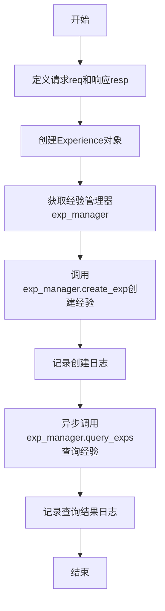
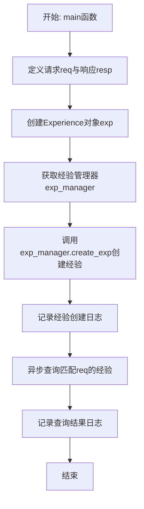
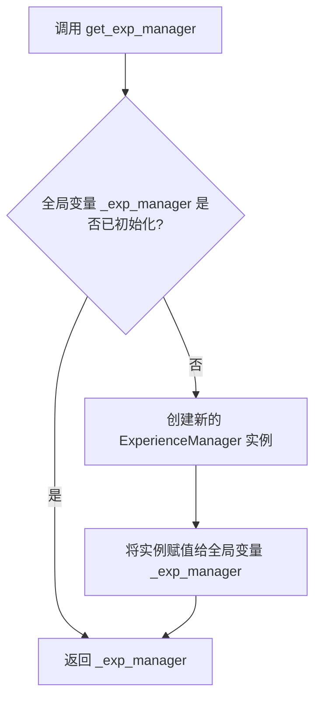

# `.\MetaGPT\examples\exp_pool\manager.py` 详细设计文档

该代码是一个演示脚本，用于展示如何创建和查询经验条目。它首先创建一个新的经验条目（包含请求、响应和类型信息），将其记录到经验池中，然后异步查询所有匹配该请求的经验条目，并打印结果。

## 整体流程



## 类结构

```
Experience (数据类)
exp_manager (管理器实例)
├── create_exp (同步方法)
└── query_exps (异步方法)
```

## 全局变量及字段


### `req`
    
一个简单的请求字符串，用于创建和查询经验。

类型：`str`
    


### `resp`
    
一个简单的响应字符串，与请求配对以构成一条经验。

类型：`str`
    


### `exp`
    
一个Experience对象，封装了请求、响应和条目类型，代表一条待创建的经验。

类型：`Experience`
    


### `exp_manager`
    
经验管理器，负责经验的创建、查询等核心操作。

类型：`ExpManager`
    


### `exps`
    
一个Experience对象列表，存储通过查询获得的与给定请求匹配的所有经验。

类型：`List[Experience]`
    


### `Experience.req`
    
经验所对应的请求内容。

类型：`str`
    


### `Experience.resp`
    
经验所对应的响应内容。

类型：`str`
    


### `Experience.entry_type`
    
经验的条目类型，例如MANUAL表示手动创建。

类型：`EntryType`
    
    

## 全局函数及方法

### `main`

该函数是脚本的异步入口点，用于演示如何创建和查询经验（Experience）。它首先创建一个新的经验条目，然后根据请求查询所有匹配的经验。

参数：
- 无显式参数。函数通过异步事件循环调用。

返回值：`None`，该函数不返回任何值，其主要作用在于执行演示流程并输出日志。

#### 流程图



#### 带注释源码

```python
async def main():
    # 定义简单的请求和响应字符串
    req = "Simple req"
    resp = "Simple resp"

    # 使用定义的请求、响应和手动条目类型创建一个Experience对象
    exp = Experience(req=req, resp=resp, entry_type=EntryType.MANUAL)
    # 获取经验管理器实例
    exp_manager = get_exp_manager()
    # 通过管理器创建（存储）该经验
    exp_manager.create_exp(exp)
    # 记录经验创建成功的日志信息
    logger.info(f"New experience created for the request `{req}`.")

    # 异步查询所有与给定请求字符串匹配的经验条目
    exps = await exp_manager.query_exps(req)
    # 记录查询到的经验列表
    logger.info(f"Got experiences: {exps}")
```


### `get_exp_manager`

`get_exp_manager` 是一个全局函数，用于获取或创建并返回一个 `ExperienceManager` 实例。它实现了单例模式，确保在整个应用生命周期中，`ExperienceManager` 实例只被创建一次，后续调用直接返回已创建的实例。

参数：
- 无

返回值：`ExperienceManager`，返回一个全局唯一的 `ExperienceManager` 实例。

#### 流程图



#### 带注释源码

```python
def get_exp_manager():
    """
    获取全局的经验管理器实例。
    如果实例不存在，则创建一个新的实例。
    此函数实现了单例模式，确保全局只有一个 ExperienceManager 实例。

    Returns:
        ExperienceManager: 全局唯一的经验管理器实例。
    """
    global _exp_manager  # 声明引用全局变量 _exp_manager
    if _exp_manager is None:  # 检查全局实例是否已创建
        _exp_manager = ExperienceManager()  # 如果未创建，则实例化一个新的 ExperienceManager
    return _exp_manager  # 返回（可能是新创建的）全局实例
```


### `logger.info`

`logger.info` 是 Python 标准库 `logging` 模块中 `Logger` 类的一个方法，用于记录一条严重性级别为 `INFO` 的日志消息。它通常用于向日志输出（如控制台、文件等）报告程序正常运行时的状态信息、进度或重要事件。

参数：

-   `msg`：`str`，要记录的日志消息字符串。可以包含格式说明符，用于后续的参数格式化。
-   `args`：`tuple`，可选，用于格式化 `msg` 字符串的元组参数。
-   `kwargs`：`dict`，可选，包含额外关键字参数的字典，例如 `exc_info`（用于记录异常信息）或 `stack_info`（用于记录堆栈信息）。

返回值：`None`，此方法不返回任何值，其作用是将日志事件分派给所有相关的处理器（handlers）。

#### 流程图

```mermaid
flowchart TD
    A[调用 logger.info(msg, *args, **kwargs)] --> B{日志级别 INFO >= logger 的级别?}
    B -- 是 --> C[创建 LogRecord 对象<br>包含消息、级别、时间等信息]
    B -- 否 --> D[流程结束]
    C --> E[遍历所有关联的 Handler]
    E --> F{Handler 级别 <= INFO?}
    F -- 是 --> G[Handler 处理 LogRecord<br>（格式化、输出到目标）]
    F -- 否 --> H[跳过此 Handler]
    G --> I[所有 Handler 处理完毕]
    H --> I
    I --> J[流程结束]
```

#### 带注释源码

```python
def info(self, msg, *args, **kwargs):
    """
    在此记录器上记录一条级别为 INFO 的消息。
    'msg' 是消息格式字符串，'args' 是使用字符串格式化操作符合并到 'msg' 的参数。
    （请注意，这意味着您可以在格式字符串中使用关键字，例如一个字典。）
    在 'kwargs' 中，有三个关键字参数会被检查：exc_info、stack_info 和 extra。
    """
    # 检查当前日志级别是否允许记录 INFO 级别的消息
    if self.isEnabledFor(INFO):
        # 调用 _log 方法，传入 INFO 级别、消息和参数
        # _log 是内部方法，负责创建 LogRecord 并调用处理器
        self._log(INFO, msg, args, **kwargs)
```

## 关键组件


### 经验池管理器 (Experience Pool Manager)

负责管理经验（Experience）的创建、存储和查询，是经验学习机制的核心组件。

### 经验对象 (Experience)

封装了一次交互的请求（req）、响应（resp）和来源类型（entry_type），是经验池中存储和操作的基本数据单元。

### 经验查询 (Experience Query)

提供根据请求（req）异步查询匹配经验的功能，支持从经验池中检索历史交互记录。


## 问题及建议


### 已知问题

-   **异步/同步调用混用**：代码中`exp_manager.create_exp(exp)`是同步调用，而`await exp_manager.query_exps(req)`是异步调用。这种混用方式可能导致在异步环境中（如`asyncio.run(main())`）调用同步的`create_exp`方法时阻塞事件循环，影响整体性能和响应性，尤其是在高并发或I/O密集型操作场景下。
-   **缺乏错误处理**：代码中没有对`create_exp`和`query_exps`操作进行任何错误处理（如`try...except`）。如果创建或查询经验失败（例如，数据库连接问题、数据格式错误），程序将直接抛出异常并终止，缺乏健壮性。
-   **硬编码的演示数据**：请求（`req`）和响应（`resp`）内容在代码中硬编码为`"Simple req"`和`"Simple resp"`。这使得脚本仅能用于演示目的，缺乏灵活性，无法方便地用于测试不同的输入或集成到更复杂的流程中。
-   **日志信息不够详细**：日志仅记录了创建和查询操作的基本信息，没有包含经验对象的唯一标识符（如ID）或查询结果的详细信息（如数量、具体内容）。这在调试或监控时可能信息不足。
-   **潜在的资源泄漏**：代码没有显式地关闭或清理`exp_manager`可能持有的资源（如数据库连接、文件句柄等）。虽然脚本运行后即结束，但在长期运行的服务中或作为模块被多次调用时，可能造成资源泄漏。

### 优化建议

-   **统一异步接口**：建议将`create_exp`方法也改为异步方法（如`async def create_exp`），并在调用时使用`await`，以确保所有I/O操作都是非阻塞的，与`query_exps`保持一致，提升在异步环境下的性能。
-   **增加错误处理逻辑**：在`create_exp`和`await query_exps`调用周围添加`try...except`块，捕获可能出现的异常（如`ValueError`, `ConnectionError`等），并记录详细的错误日志，确保程序在部分操作失败时能优雅地处理或继续执行。
-   **参数化输入数据**：可以通过命令行参数、环境变量或配置文件来传递`req`和`resp`的内容，使脚本更加灵活，便于测试和复用。
-   **增强日志输出**：在创建经验后，可以记录经验的唯一ID（如果`Experience`对象有`id`字段）。在查询后，可以记录查询到的经验数量以及关键字段的摘要，提供更丰富的运行时信息。
-   **确保资源清理**：在`main`函数或脚本结束时，显式调用`exp_manager`的清理或关闭方法（如果存在），例如`await exp_manager.close()`。或者确保`exp_manager`在上下文管理器（`async with`）中使用，以自动管理资源生命周期。
-   **考虑添加类型提示和文档**：虽然示例代码简短，但对于更复杂的项目，为函数和方法添加详细的类型提示和文档字符串（docstrings）可以提高代码的可读性和可维护性。
-   **将演示逻辑封装为函数**：将`main`函数中的核心逻辑（创建和查询）提取到一个独立的异步函数中，使其更容易被其他模块导入和测试。


## 其它


### 设计目标与约束

本代码示例的核心设计目标是演示如何创建和查询“经验”（Experience）对象。它旨在展示 `metagpt.exp_pool` 模块的基本使用流程，包括：1）通过 `Experience` 类封装一个请求-响应对；2）通过 `get_exp_manager()` 获取经验管理器单例；3）使用经验管理器同步创建经验条目；4）异步查询与特定请求匹配的所有经验条目。主要约束包括：代码作为演示脚本，功能单一，不涉及复杂的业务逻辑、错误处理或性能优化；其正确性依赖于 `metagpt.exp_pool` 模块的底层实现（如数据存储、查询逻辑）。

### 错误处理与异常设计

当前代码示例未包含显式的错误处理逻辑。`exp_manager.create_exp(exp)` 和 `await exp_manager.query_exps(req)` 的调用可能因底层依赖（如数据库连接失败、数据格式错误、异步操作超时等）而抛出异常。这些异常会直接向上传播，导致脚本运行终止。在正式的生产环境中，需要围绕这些关键操作添加 `try-except` 块，捕获可能出现的特定异常（如 `ConnectionError`, `TimeoutError`, `ValueError` 等），并进行适当的处理，例如记录详细的错误日志、重试机制或向用户返回友好的错误信息，以确保程序的健壮性。

### 数据流与状态机

本示例的数据流是线性的、无状态的。流程始于硬编码的字符串 `req` 和 `resp`。这些数据被封装成一个 `Experience` 对象。该对象作为输入，通过 `exp_manager.create_exp(exp)` 方法被持久化到经验池（数据存储）。随后，原始的 `req` 字符串作为查询条件，通过 `await exp_manager.query_exps(req)` 方法从经验池中检索数据，返回一个经验列表 `exps`。整个过程不涉及复杂的状态转换；脚本执行完毕后，经验数据留存于存储中，但脚本本身不维护任何会话或应用状态。

### 外部依赖与接口契约

1.  **外部模块依赖**：
    *   `metagpt.exp_pool`: 提供经验池管理的核心功能。
    *   `metagpt.exp_pool.schema`: 提供数据模型定义（`Experience`, `EntryType`）。
    *   `metagpt.logs`: 提供日志记录功能（`logger`）。
    *   `asyncio`: 提供异步运行时支持。

2.  **关键接口契约**：
    *   `get_exp_manager() -> ExpManager`: 函数契约，返回一个经验管理器的单例实例。
    *   `ExpManager.create_exp(exp: Experience) -> None`: 方法契约，同步地将一个经验对象持久化。调用者需保证 `exp` 参数的有效性。
    *   `ExpManager.query_exps(req: str) -> Awaitable[List[Experience]]`: 异步方法契约，根据请求字符串查询并返回匹配的经验对象列表。调用者需在异步上下文中调用。

3.  **隐式契约**：`Experience` 类的构造函数期望接收特定类型的参数（`req: str`, `resp: str`, `entry_type: EntryType`）。`logger.info` 方法接受字符串格式的消息。脚本的入口点 `main()` 是一个异步函数，必须由 `asyncio.run()` 驱动执行。

    