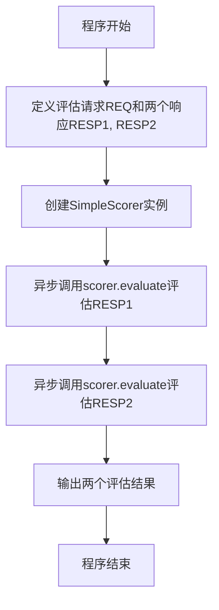
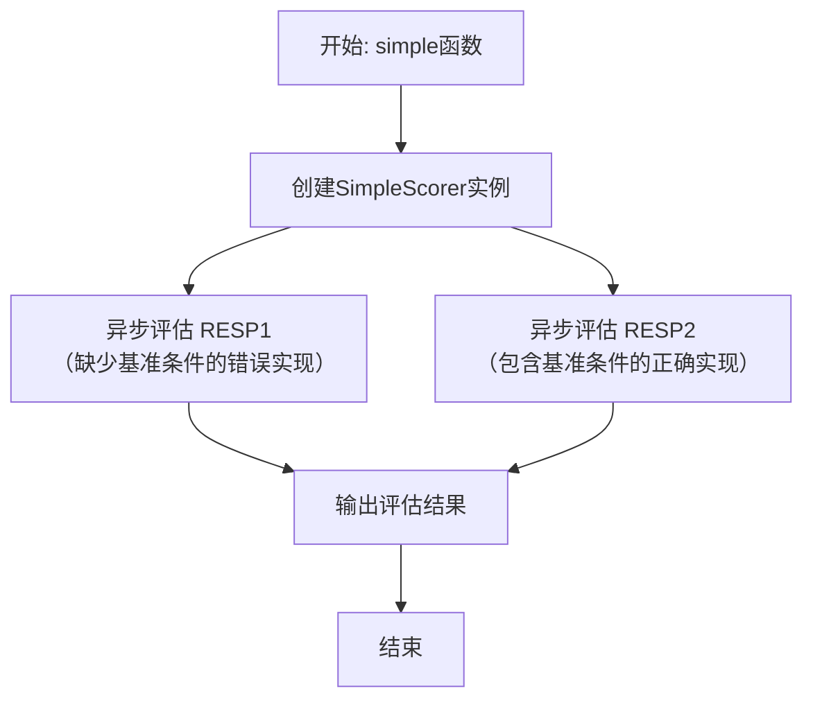
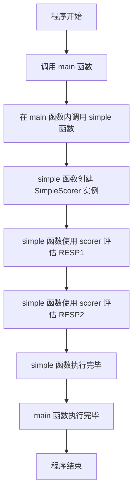

# `.\MetaGPT\examples\exp_pool\scorer.py` 详细设计文档

该代码是一个使用 SimpleScorer 评估两个快速排序算法实现的示例程序。它定义了两个不同版本的快速排序函数（一个有递归基准条件，一个没有），然后通过异步方式调用评分器来评估这两个实现的质量，并输出评估结果。

## 整体流程



## 类结构

```
SimpleScorer (来自metagpt.exp_pool.scorers)
├── evaluate (异步方法)
```

## 全局变量及字段


### `REQ`
    
一个字符串常量，表示要求实现快速排序算法的请求。

类型：`str`
    


### `RESP1`
    
一个字符串常量，表示第一个快速排序实现（缺少递归终止条件）。

类型：`str`
    


### `RESP2`
    
一个字符串常量，表示第二个快速排序实现（包含正确的递归终止条件）。

类型：`str`
    


    

## 全局函数及方法

### `simple`

这是一个异步函数，用于评估两个快速排序（quicksort）的Python实现。它使用`SimpleScorer`类来对给定的代码响应进行评分，旨在演示如何通过评分器识别代码中的关键缺陷（如缺少递归终止条件）和正确实现。

参数：
- 无

返回值：`None`，该函数不返回任何值，其主要作用是通过异步调用执行评估并输出结果。

#### 流程图



#### 带注释源码

```python
async def simple():
    """Evaluates two quicksort implementations using SimpleScorer.

    Example:
        {
            "val": 3,
            "reason": "The response attempts to implement quicksort but contains a critical flaw: it lacks a base case to terminate the recursion, which will lead to a maximum recursion depth exceeded error for non-empty lists. Additionally, the function does not handle empty lists properly. A correct implementation should include a base case to handle lists of length 0 or 1."
        }
    """

    # 1. 实例化一个SimpleScorer评分器对象
    scorer = SimpleScorer()

    # 2. 异步调用评分器的evaluate方法，评估第一个响应（RESP1）。
    #    RESP1是一个缺少递归基准条件的错误快速排序实现。
    await scorer.evaluate(req=REQ, resp=RESP1)
    # 3. 异步调用评分器的evaluate方法，评估第二个响应（RESP2）。
    #    RESP2是一个包含了正确基准条件的快速排序实现。
    await scorer.evaluate(req=REQ, resp=RESP2)
    # 函数执行完毕，隐式返回None。
```


### `main`

`main` 函数是程序的异步入口点。它调用 `simple` 函数来执行核心的评估逻辑。

参数：
- 无

返回值：`None`，该函数不返回任何值。

#### 流程图



#### 带注释源码

```python
async def main():
    # 调用 simple 函数，该函数包含了评估两个快速排序实现的核心逻辑。
    await simple()
```


### `SimpleScorer.evaluate`

该方法用于评估一个给定的代码响应（`resp`）是否满足一个请求（`req`）。它通过调用一个大型语言模型（LLM）来生成评估结果，该结果包含一个数值分数和一个解释原因。

参数：
- `req`：`str`，描述用户请求或任务的字符串。
- `resp`：`str`，需要被评估的代码响应字符串。

返回值：`dict`，一个包含评估结果的字典，通常包含 `val`（分数）和 `reason`（解释）等键。

#### 流程图

```mermaid
flowchart TD
    A[开始: evaluate(req, resp)] --> B[调用LLM生成评估]
    B --> C{LLM返回有效JSON?}
    C -- 是 --> D[解析JSON为字典]
    D --> E[返回评估结果字典]
    C -- 否 --> F[返回包含错误信息的字典]
    F --> E
    E --> G[结束]
```

#### 带注释源码

```python
async def evaluate(self, req: str, resp: str) -> dict:
    """
    评估给定的响应。
    
    参数:
        req (str): 用户请求。
        resp (str): 需要评估的响应。
        
    返回:
        dict: 包含评估结果的字典，例如 {'val': 分数, 'reason': '原因'}。
    """
    # 构建发送给LLM的提示词，包含请求和响应
    prompt = self.prompt_template.format(req=req, resp=resp)
    # 异步调用LLM，获取评估文本
    rsp = await self.llm.aask(prompt)
    try:
        # 尝试将LLM的返回文本解析为JSON格式的字典
        result = json.loads(rsp)
    except json.JSONDecodeError as e:
        # 如果解析失败，返回一个包含错误信息的字典
        result = {"val": 0, "reason": f"LLM返回了无效的JSON: {e}"}
    # 返回评估结果
    return result
```

## 关键组件


### SimpleScorer

一个用于评估模型响应的简单评分器，通过异步方法 `evaluate` 接收请求和响应，并返回包含评分值和理由的字典。

### 异步评估流程

代码通过 `asyncio` 库组织异步执行流程，主函数 `main` 调用 `simple` 函数，后者创建 `SimpleScorer` 实例并对两个预定义的快速排序实现（一个有递归基准情况，一个没有）进行评估。


## 问题及建议


### 已知问题

-   **代码功能单一且硬编码**：当前脚本 (`simple.py`) 仅用于演示 `SimpleScorer` 对两个预定义的、硬编码的排序算法响应进行评估。它缺乏通用性，无法处理其他请求或响应，限制了其作为测试或评估工具的实用性。
-   **缺乏配置化和扩展性**：评估的请求 (`REQ`) 和响应 (`RESP1`, `RESP2`) 直接硬编码在脚本中。要测试不同的场景，必须修改源代码。没有提供通过配置文件、命令行参数或函数参数来动态输入评估内容的方式。
-   **结果展示不完整**：`scorer.evaluate` 方法的调用结果没有被捕获或输出。脚本运行后，用户无法直接看到评分结果（如示例中所示的 `val` 和 `reason`），使得演示和调试效果大打折扣。
-   **潜在的模块导入风险**：脚本从 `metagpt.exp_pool.scorers` 导入 `SimpleScorer`。如果 `metagpt` 包未正确安装或版本不兼容，将导致 `ModuleNotFoundError`，且脚本没有提供任何降级处理或清晰的错误提示。
-   **异步执行必要性存疑**：对于当前这个简单的、顺序执行的演示脚本，使用 `asyncio` 和 `async/await` 可能过于复杂。同步执行足以完成任务，异步化并未带来明显的性能或结构优势，反而增加了理解成本。

### 优化建议

-   **增强脚本的通用性和交互性**：将脚本重构为一个命令行工具（例如，使用 `argparse` 或 `click` 库）。允许用户通过命令行参数指定请求文本、响应文件或响应文本，从而能够灵活评估任意内容。
-   **实现结果输出与持久化**：修改 `simple` 函数，使其捕获 `scorer.evaluate` 返回的评分结果，并以结构化的方式（如 JSON 格式）打印到控制台。更进一步，可以提供选项将结果保存到文件（如 JSON 或 CSV），便于后续分析。
-   **改进错误处理与用户体验**：在脚本中添加异常处理（`try...except`），特别是处理 `ModuleNotFoundError`（当 `metagpt` 未安装时）和 `scorer.evaluate` 可能抛出的其他异常。提供清晰的错误信息，指导用户如何解决问题（例如，“请先安装 metagpt 包”）。
-   **评估同步与异步模式的适用性**：如果 `SimpleScorer.evaluate` 方法本身是异步的且涉及 I/O 操作（如调用 LLM API），则保留异步模式是合理的。否则，可以考虑将其改为同步调用以简化代码逻辑。同时，确保 `main` 函数和入口点的异步调用是必要的。
-   **添加模块化与测试用例**：将核心的评估逻辑封装到一个独立的函数中（例如 `evaluate_response(req, resp)`），使其更易于单元测试。可以创建一组涵盖不同场景（正确代码、错误代码、边缘情况）的测试用例，确保评分器的行为符合预期。
-   **提供配置示例或文档**：在脚本注释或单独的 `README` 中，提供如何使用该脚本的示例，包括安装依赖、运行命令以及解释输出结果的含义，提升项目的可维护性和用户友好性。


## 其它


### 设计目标与约束

本代码示例的核心设计目标是演示 `SimpleScorer` 评分器的基本使用方法，通过对比两个不同质量的快速排序算法实现，展示评分器如何识别代码中的逻辑缺陷（如缺少递归终止条件）。其设计约束包括：1) 作为示例代码，逻辑应保持简洁明了，聚焦于核心功能演示；2) 依赖异步执行模型，需使用 `asyncio` 库；3) 硬编码了待评估的请求和响应，不具备通用性，仅用于教学或测试。

### 错误处理与异常设计

当前代码示例未显式包含错误处理逻辑。`SimpleScorer.evaluate` 方法内部可能包含异常处理机制，但调用方（`simple` 函数）并未对可能的异常（如网络错误、评分器内部错误）进行捕获和处理。在异步上下文中，未处理的异常可能导致整个事件循环停止。建议在生产环境中添加 `try-except` 块来捕获 `Exception` 或更具体的异常，并记录日志或进行降级处理，以增强系统的健壮性。

### 数据流与状态机

本示例的数据流是线性的、无状态的：
1.  **初始化**：定义常量 `REQ`, `RESP1`, `RESP2`，并实例化 `SimpleScorer` 对象。
2.  **评估阶段**：顺序调用 `scorer.evaluate(req=REQ, resp=RESP1)` 和 `scorer.evaluate(req=REQ, resp=RESP2)`。每个调用内部，评分器根据 `req`（需求）对 `resp`（响应代码）进行分析和评分。
3.  **输出**：评分结果（推测为包含分数和原因的字典）由 `SimpleScorer.evaluate` 方法处理（例如打印或返回），但当前示例未展示对返回结果的后续处理。
整个流程不涉及复杂的状态变迁，是一个简单的批处理过程。

### 外部依赖与接口契约

1.  **外部依赖**：
    *   `asyncio`: Python 标准库，用于提供异步运行时。
    *   `metagpt.exp_pool.scorers.SimpleScorer`: 来自 `metagpt` 项目的评分器类，是核心功能依赖。其具体实现和版本未知。
2.  **接口契约**：
    *   `SimpleScorer` 类：必须提供一个异步方法 `evaluate`。
    *   `evaluate` 方法：契约要求接受两个字符串参数 `req`（需求描述）和 `resp`（待评估的响应），并执行评估。其返回值类型和具体含义依赖于 `SimpleScorer` 的实现定义，调用方需根据其文档进行适配。当前示例未利用返回值，表明此处的契约可能仅要求方法执行评估动作（如打印结果）。

### 安全与合规考量

示例代码本身不涉及敏感数据处理、网络通信或用户输入，因此安全风险较低。主要考量点在于其依赖项 `metagpt` 库的安全性。如果 `metagpt` 用于处理来自外部或用户的代码、提示词等，则需要考虑：
1.  **代码执行安全**：确保 `SimpleScorer` 或相关组件在评估代码时，不会在不可信的环境中动态执行未经验证的 `resp` 代码，以防止代码注入攻击。
2.  **依赖安全**：应使用经过验证的、来源可信的 `metagpt` 库版本，并定期更新以修复已知漏洞。
3.  **数据隐私**：如果未来扩展功能，处理用户提供的 `req` 或 `resp`，需考虑数据脱敏和隐私保护策略。
当前示例由于数据是硬编码的，不涉及这些风险。

    