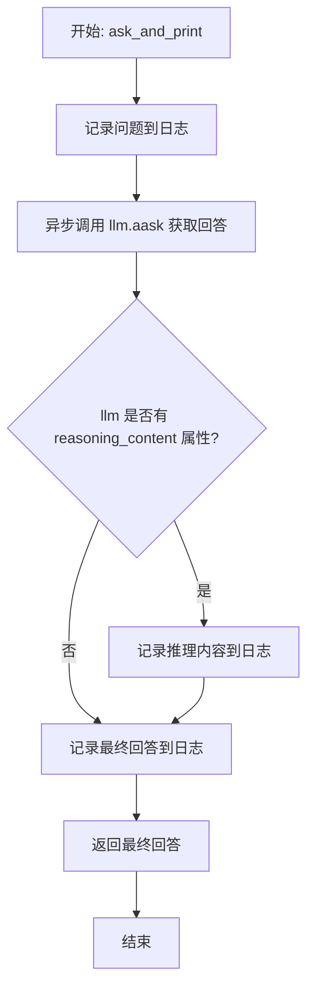
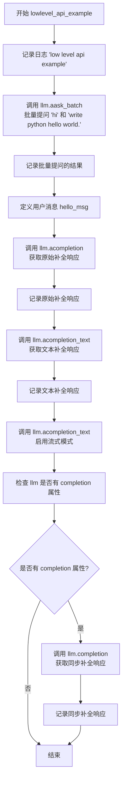
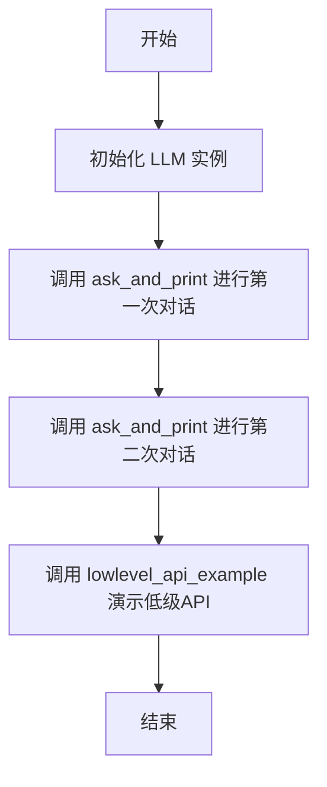
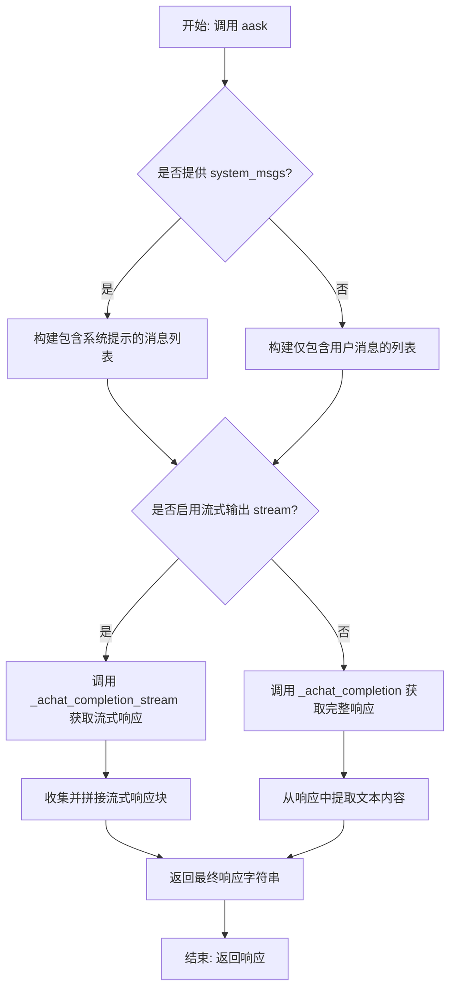
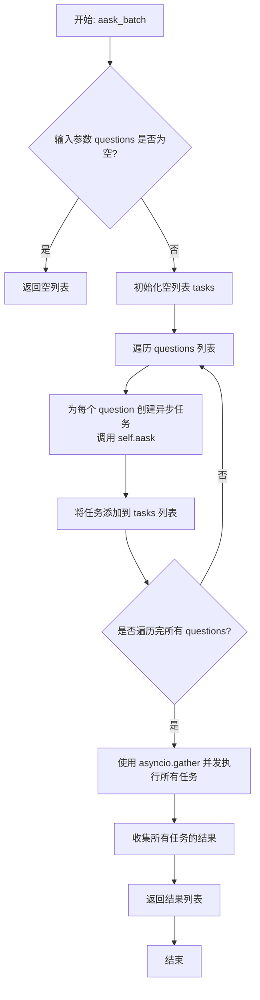
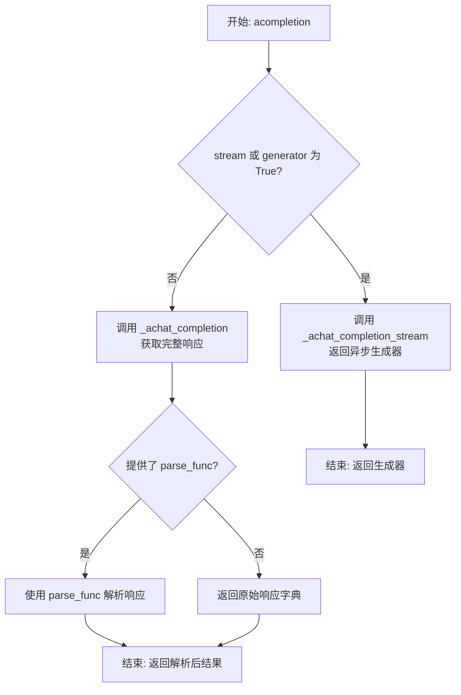
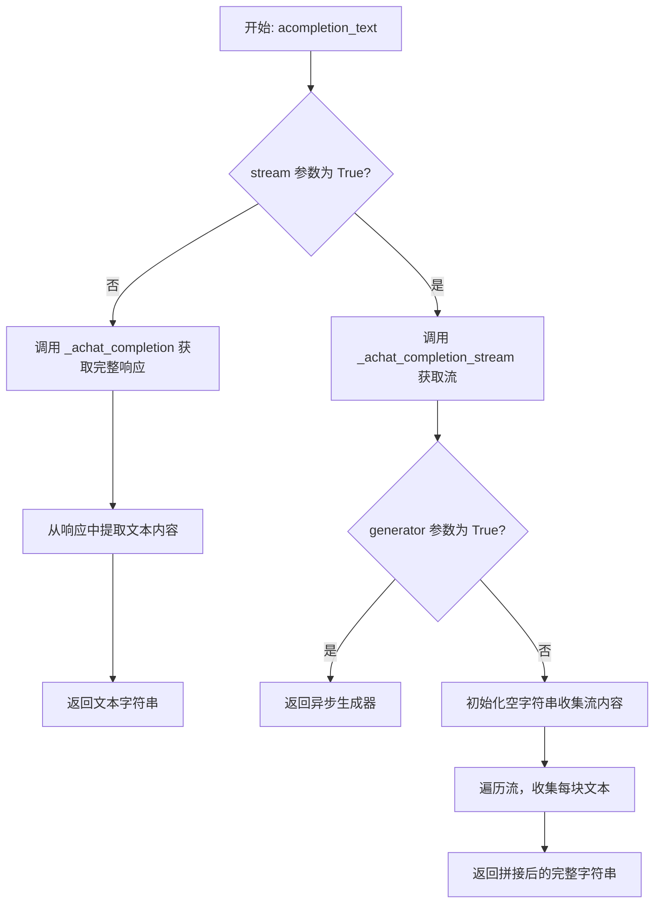
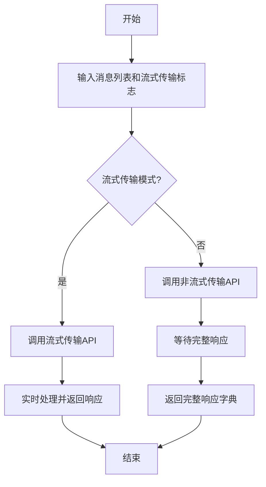

# `.\MetaGPT\examples\hello_world.py` 详细设计文档

该代码是一个演示如何使用 MetaGPT 框架中 LLM 类的示例程序。它通过异步函数展示了两种与大型语言模型交互的方式：1) 使用高层封装函数 `ask_and_print` 进行问答交互并打印结果；2) 使用底层 API 函数 `lowlevel_api_example` 演示批量请求、原始补全和流式输出等基础功能。

## 整体流程

```mermaid
graph TD
    A[程序入口: asyncio.run(main())] --> B[main() 函数]
    B --> C[创建 LLM 实例]
    C --> D[调用 ask_and_print 函数]
    D --> E[记录用户问题]
    E --> F[调用 llm.aask 获取回答]
    F --> G{llm 是否有 reasoning_content 属性?}
    G -- 是 --> H[记录推理内容]
    G -- 否 --> I[记录最终回答]
    H --> I
    I --> J[返回回答]
    J --> K[调用 lowlevel_api_example 函数]
    K --> L[批量提问 llm.aask_batch]
    L --> M[原始补全 llm.acompletion]
    M --> N[文本补全 llm.acompletion_text]
    N --> O[流式文本补全 llm.acompletion_text(stream=True)]
    O --> P{llm 是否有 completion 属性?}
    P -- 是 --> Q[同步补全 llm.completion]
    P -- 否 --> R[结束]
    Q --> R
```

## 类结构

```
LLM (来自 metagpt.llm)
├── 字段: reasoning_content (可选)
├── 方法: aask
├── 方法: aask_batch
├── 方法: acompletion
├── 方法: acompletion_text
└── 方法: completion (可选)
```

## 全局变量及字段


### `LLM.reasoning_content`
    
存储LLM模型在生成响应过程中的推理或思考过程内容，用于调试或展示模型的内部逻辑。

类型：`str`
    
    

## 全局函数及方法

### `ask_and_print`

这是一个异步函数，用于向大型语言模型（LLM）提出一个问题，并将问题、模型的推理过程（如果存在）以及最终回答记录到日志中。它封装了与LLM交互的核心流程，包括发送问题、处理流式响应以及记录关键信息。

参数：
- `question`：`str`，要询问LLM的问题文本。
- `llm`：`LLM`，一个实现了异步问答接口的大型语言模型实例。
- `system_prompt`：`str`，提供给LLM的系统提示，用于指导其回答行为。

返回值：`str`，返回LLM对问题的最终回答文本。

#### 流程图



#### 带注释源码

```python
async def ask_and_print(question: str, llm: LLM, system_prompt) -> str:
    # 1. 将用户提出的问题记录到日志中
    logger.info(f"Q: {question}")
    
    # 2. 异步调用LLM的`aask`方法获取回答。
    #    - `question`: 用户问题
    #    - `system_msgs`: 系统提示，用于引导AI行为
    #    - `stream=True`: 启用流式响应，可能用于逐步获取输出或中间推理
    rsp = await llm.aask(question, system_msgs=[system_prompt], stream=True)
    
    # 3. 检查LLM实例是否具有`reasoning_content`属性且其值不为空。
    #    这通常用于记录模型在生成最终答案前的思考或推理过程。
    if hasattr(llm, "reasoning_content") and llm.reasoning_content:
        logger.info(f"A reasoning: {llm.reasoning_content}")
    
    # 4. 将LLM生成的最终回答记录到日志中
    logger.info(f"A: {rsp}")
    
    # 5. 将最终回答返回给调用者
    return rsp
```

### `lowlevel_api_example`

该函数是一个异步函数，用于演示和测试 `LLM` 类的多种底层异步 API 方法。它依次调用了批量提问、原始消息补全、文本补全、流式文本补全以及同步补全（如果可用）等方法，并记录结果。

参数：
- `llm`：`LLM`，一个大型语言模型实例，用于执行各种文本生成和对话任务。

返回值：`None`，该函数不返回任何值，其主要作用是通过日志输出展示 API 的调用结果。

#### 流程图



#### 带注释源码

```python
async def lowlevel_api_example(llm: LLM):
    # 记录函数开始执行的日志
    logger.info("low level api example")
    # 1. 演示批量提问：向LLM发送一个包含两个问题的列表，并异步等待所有回答
    #    记录返回的批量回答结果
    logger.info(await llm.aask_batch(["hi", "write python hello world."]))

    # 2. 定义一个符合OpenAI API格式的用户消息
    hello_msg = [{"role": "user", "content": "count from 1 to 10. split by newline."}]
    # 3. 调用原始补全接口，返回完整的API响应对象（通常包含更多元数据）
    logger.info(await llm.acompletion(hello_msg))
    # 4. 调用文本补全接口，直接返回响应中的文本内容
    logger.info(await llm.acompletion_text(hello_msg))

    # 5. 演示流式文本补全：启用流式模式，响应会分块返回
    #    此模式通常用于实时显示生成过程，但速度可能较慢
    await llm.acompletion_text(hello_msg, stream=True)

    # 6. 检查LLM实例是否也提供了同步的completion方法（用于测试兼容性）
    #    如果存在，则调用并记录其响应
    if hasattr(llm, "completion"):
        logger.info(llm.completion(hello_msg))
```

### `main`

`main` 函数是程序的异步入口点。它初始化一个 LLM 实例，然后依次调用 `ask_and_print` 函数进行两次对话交互，最后调用 `lowlevel_api_example` 函数来演示 LLM 的低级 API 使用方法。

参数：
- 无

返回值：`None`，该函数不返回任何值，其主要作用是组织并执行一系列异步任务。

#### 流程图



#### 带注释源码

```python
async def main():
    # 初始化 LLM 实例，这是与语言模型交互的核心对象
    llm = LLM()
    
    # 第一次调用 ask_and_print 函数，向模型提问“what's your name?”，并指定系统提示词
    await ask_and_print("what's your name?", llm, "I'm a helpful AI assistant.")
    
    # 第二次调用 ask_and_print 函数，提问“who are you?”，并指定一个条件性的系统提示词
    await ask_and_print("who are you?", llm, "just answer 'I am a robot' if the question is 'who are you'")
    
    # 调用 lowlevel_api_example 函数，演示如何使用 LLM 提供的各种低级API方法
    await lowlevel_api_example(llm)
```

### `LLM.aask`

`LLM.aask` 是一个异步方法，用于向大型语言模型（LLM）发起提问并获取回答。它支持流式输出，并可选择性地提供系统提示来引导模型的行为。

参数：

- `msg`：`str`，用户向LLM提出的问题或指令。
- `system_msgs`：`Optional[list[str]]`，可选参数，一个包含系统提示信息的字符串列表，用于设定对话的上下文或角色。
- `format_msgs`：`Optional[list[dict[str, str]]]`，可选参数，一个字典列表，用于格式化消息，通常包含`"role"`和`"content"`键。
- `stream`：`bool`，可选参数，默认为`False`。如果为`True`，则启用流式响应，模型会分块返回结果。
- `schema`：`Optional[Union[dict, BaseModel, Type[BaseModel]]]`，可选参数，指定期望的响应格式或结构（例如JSON Schema或Pydantic模型）。
- `parser`：`Optional[Callable]`，可选参数，一个自定义函数，用于解析模型的原始响应。
- `max_incompletions`：`int`，可选参数，默认为3。在流式响应中，允许的最大不完整块数，用于处理可能的截断。
- `timeout`：`int`，可选参数，默认为120。请求的超时时间（秒）。
- `raise_on_timeout`：`bool`，可选参数，默认为`False`。超时时是否抛出异常。

返回值：`str`，LLM对提问的文本回答。

#### 流程图



#### 带注释源码

```python
async def aask(
    self,
    msg: str,
    system_msgs: Optional[list[str]] = None,
    format_msgs: Optional[list[dict[str, str]]] = None,
    stream: bool = False,
    schema: Optional[Union[dict, BaseModel, Type[BaseModel]]] = None,
    parser: Optional[Callable] = None,
    max_incompletions: int = 3,
    timeout: int = 120,
    raise_on_timeout: bool = False,
) -> str:
    """
    异步向LLM提问并获取回答。
    核心方法，支持流式输出、系统提示和响应格式化。
    """
    # 1. 构建消息列表
    # 如果提供了预格式化的消息，则直接使用
    if format_msgs:
        messages = format_msgs
    else:
        # 否则，构建新的消息列表
        messages = [self._system_msg()]
        # 添加可选的系统提示
        if system_msgs:
            for system_msg in system_msgs:
                messages.append(self._system_msg(system_msg))
        # 添加用户的问题
        messages.append(self._user_msg(msg))

    # 2. 根据是否流式输出选择不同的调用路径
    if stream:
        # 流式输出模式：调用内部方法处理分块响应
        return await self._achat_completion_stream(
            messages, schema=schema, parser=parser, max_incompletions=max_incompletions, timeout=timeout, raise_on_timeout=raise_on_timeout
        )
    else:
        # 非流式输出模式：直接获取完整响应
        rsp = await self._achat_completion(messages, schema=schema, parser=parser, timeout=timeout, raise_on_timeout=raise_on_timeout)
        return self._extract_content(rsp)
```

### `LLM.aask_batch`

该方法用于批量向大语言模型（LLM）发送多个问题，并异步地获取所有问题的回答。它通过内部调用 `asyncio.gather` 来并发执行多个 `aask` 调用，从而提高处理效率。

参数：

- `questions`：`List[str]`，一个字符串列表，包含需要向LLM提问的多个问题。
- `system_msgs`：`Optional[List[str]]`，一个可选的字符串列表，包含系统提示信息，用于指导LLM的回答行为。默认为 `None`。
- `format_msgs`：`Optional[List[Dict]]`，一个可选的字典列表，包含格式化消息，用于更复杂的对话结构。默认为 `None`。

返回值：`List[str]`，一个字符串列表，包含LLM对每个输入问题的回答。

#### 流程图



#### 带注释源码

```python
async def aask_batch(self, questions: List[str], system_msgs: Optional[List[str]] = None, format_msgs: Optional[List[Dict]] = None) -> List[str]:
    """
    批量异步提问。
    并发地向LLM发送多个问题并收集答案。

    Args:
        questions: 要提问的问题列表。
        system_msgs: 可选的系统消息列表，用于指导LLM行为。
        format_msgs: 可选的格式化消息列表，用于结构化对话。

    Returns:
        一个包含每个问题答案的字符串列表。
    """
    # 如果问题列表为空，直接返回空列表
    if not questions:
        return []

    # 准备任务列表：为每个问题创建一个异步的aask任务
    tasks = []
    for i, question in enumerate(questions):
        # 为每个问题提取对应的系统消息（如果提供了的话）
        system_msg = system_msgs[i] if system_msgs else None
        # 为每个问题提取对应的格式化消息（如果提供了的话）
        format_msg = format_msgs[i] if format_msgs else None
        # 创建异步任务，调用aask方法获取单个问题的答案
        task = self.aask(question, system_msgs=[system_msg] if system_msg else None, format_msg=format_msg)
        tasks.append(task)

    # 使用asyncio.gather并发执行所有任务，并等待所有任务完成
    return await asyncio.gather(*tasks)
```

### `LLM.acompletion`

该方法是一个异步方法，用于向大语言模型（LLM）发送一个消息列表，并获取一个完整的、结构化的响应（通常是一个包含角色和内容的字典列表）。它支持流式和非流式两种响应模式。

参数：

- `messages`：`List[Dict[str, str]]`，一个字典列表，每个字典代表对话中的一个消息，通常包含 `"role"`（如 "user", "assistant", "system"）和 `"content"` 键。
- `timeout`：`int`，请求的超时时间（秒）。
- `stream`：`bool`，指示是否使用流式响应。如果为 `True`，则返回一个异步生成器，用于逐步产生响应片段；如果为 `False`（默认），则等待并返回完整的响应。
- `generator`：`bool`，一个遗留参数，用于向后兼容。如果为 `True`，其行为与 `stream=True` 类似。
- `parse_func`：`Callable`，一个可选的函数，用于在返回前解析原始响应。

返回值：`Union[AsyncGenerator, Dict]`，如果 `stream` 或 `generator` 参数为 `True`，则返回一个异步生成器，每次产生一个响应片段（通常是字典）。否则，返回一个包含完整模型响应的字典。

#### 流程图



#### 带注释源码

```python
async def acompletion(self, messages: list[dict], timeout: int = 3, stream: bool = False, generator: bool = False, parse_func: Callable = None):
    """
    异步完成方法。
    向LLM发送消息并获取响应。
    
    Args:
        messages: 消息列表，每个消息是一个包含'role'和'content'的字典。
        timeout: 请求超时时间（秒）。
        stream: 是否使用流式响应。
        generator: 遗留参数，用于向后兼容，如果为True则启用流式。
        parse_func: 可选的回调函数，用于解析响应。
    
    Returns:
        如果stream或generator为True，返回一个异步生成器。
        否则，返回解析后的响应或原始响应字典。
    """
    # 判断是否启用流式响应
    if stream or generator:
        # 调用内部流式聊天完成方法，返回一个异步生成器
        return self._achat_completion_stream(messages, timeout=timeout)
    else:
        # 调用内部非流式聊天完成方法，获取完整响应
        rsp = await self._achat_completion(messages, timeout=timeout)
        # 如果提供了解析函数，则使用它处理响应
        if parse_func:
            return parse_func(rsp)
        # 否则直接返回原始响应
        return rsp
```

### `LLM.acompletion_text`

该方法是一个异步方法，用于向大语言模型（LLM）发送消息列表并获取纯文本格式的响应。它支持流式和非流式两种响应模式。

参数：
- `messages`：`List[Dict[str, str]]`，一个字典列表，每个字典代表一条消息，通常包含`role`（如“user”或“assistant”）和`content`（消息内容）键。
- `stream`：`bool`，可选参数，默认为`False`。指示是否以流式方式获取响应。流式模式下，响应内容会分块返回；非流式模式下，等待完整响应返回。
- `generator`：`bool`，可选参数，默认为`False`。指示是否返回一个异步生成器（async generator）。当`stream=True`时，此参数控制返回类型。
- `timeout`：`int`，可选参数，HTTP请求的超时时间（秒）。

返回值：`Union[str, AsyncGenerator[str, None]]`，返回值类型取决于参数。如果`stream=False`且`generator=False`，返回完整的响应字符串。如果`stream=True`且`generator=True`，返回一个异步生成器，用于逐块产生响应文本。

#### 流程图



#### 带注释源码

```python
async def acompletion_text(self, messages: List[Dict[str, str]], stream: bool = False, generator: bool = False, timeout: int = LLM.DEFAULT_TIMEOUT) -> Union[str, AsyncGenerator[str, None]]:
    """
    异步获取LLM的文本补全结果。
    
    根据stream和generator参数，可以返回完整字符串或异步生成器。
    
    Args:
        messages: 消息列表，格式为 [{"role": "user", "content": "..."}, ...]
        stream: 是否使用流式响应
        generator: 是否返回生成器（仅在stream=True时有效）
        timeout: 请求超时时间
    
    Returns:
        如果stream=False: 返回完整的响应文本 (str)
        如果stream=True且generator=True: 返回异步生成器，逐个yield文本块
        如果stream=True且generator=False: 收集所有流块后返回完整文本 (str)
    """
    if stream:
        # 流式模式
        if generator:
            # 返回生成器，让调用者自己处理流
            async def text_stream_generator():
                # 调用底层流式API
                async for chunk in self._achat_completion_stream(messages, timeout=timeout):
                    # 从响应块中提取文本增量
                    yield self._get_chunk_text(chunk)
            return text_stream_generator()
        else:
            # 非生成器模式：内部收集所有流块后返回完整字符串
            rsp = ""
            async for chunk in self._achat_completion_stream(messages, timeout=timeout):
                rsp += self._get_chunk_text(chunk)
            return rsp
    else:
        # 非流式模式：直接获取完整响应
        rsp = await self._achat_completion(messages, timeout=timeout)
        return self._get_choice_text(rsp)
```

### `LLM.completion`

`LLM.completion` 是一个用于与大型语言模型（LLM）进行交互的低级API方法。它接收一个消息列表作为输入，并返回一个包含模型生成的完整响应的字典。该方法支持流式传输和非流式传输两种模式，允许用户根据需要选择是否实时接收响应。

参数：

- `messages`：`List[Dict[str, str]]`，一个字典列表，每个字典包含`role`和`content`键，表示对话中的消息。
- `stream`：`bool`，可选参数，默认为`False`。如果设置为`True`，则启用流式传输模式，实时返回响应；否则，等待完整响应后一次性返回。

返回值：`Dict[str, Any]`，返回一个字典，包含模型生成的完整响应。在流式传输模式下，返回的字典可能包含流式数据；在非流式传输模式下，返回完整的响应字典。

#### 流程图



#### 带注释源码

```python
async def acompletion(self, messages: List[Dict], stream=False) -> Dict:
    """
    与LLM进行交互的低级API方法。
    
    参数：
        messages: 消息列表，每个消息是一个包含'role'和'content'的字典。
        stream: 是否启用流式传输模式。
    
    返回值：
        包含模型响应的字典。
    """
    # 根据流式传输标志选择调用相应的API
    if stream:
        # 流式传输模式：实时返回响应
        return await self._astream_completion(messages)
    else:
        # 非流式传输模式：等待完整响应后返回
        return await self._acompletion(messages)
```

## 关键组件


### LLM (大语言模型) 组件

提供与大语言模型交互的核心功能，包括异步问答、批量处理、流式响应和底层API调用。

### 异步任务编排

通过 `asyncio` 库管理异步函数调用，实现高效的并发LLM请求处理。

### 日志记录

使用 `logger` 组件记录程序运行过程中的关键信息，如用户问题、AI回复和推理过程。

### 系统提示管理

允许在LLM交互中传入系统级提示，以引导或约束AI助手的回复行为。


## 问题及建议


### 已知问题

-   **硬编码的系统提示词**：`ask_and_print` 函数和 `lowlevel_api_example` 函数中，系统提示词（`system_prompt`）是硬编码在调用处的字符串。这使得代码难以维护和复用，当需要修改或管理多个提示词时，需要在代码中多处进行修改。
-   **缺乏错误处理**：代码中大量使用了 `await` 调用 LLM 接口，但未包含任何 `try-except` 块来处理网络异常、API 调用失败、超时或模型返回错误等潜在问题。一旦发生错误，程序将直接崩溃。
-   **日志级别不明确**：代码使用 `logger.info` 记录所有信息，包括用户问题、AI 回复、推理过程以及低层 API 的原始响应。这可能导致日志信息冗杂，难以快速定位关键信息或错误。特别是将原始 API 响应（如 `acompletion` 的返回）直接记录为 info，可能包含大量不必要或敏感的结构化数据。
-   **潜在的资源泄漏**：在 `lowlevel_api_example` 函数中，调用了 `await llm.acompletion_text(hello_msg, stream=True)` 但未对返回的异步流进行消费或处理（例如，未将其内容记录或收集）。虽然这可能不会导致错误，但表明代码逻辑不完整，且未充分利用流式返回的优势。
-   **条件检查逻辑脆弱**：`lowlevel_api_example` 函数中使用 `hasattr(llm, "completion")` 来检查并调用同步的 `completion` 方法。这种动态属性检查降低了代码的可读性和类型安全性，且依赖于 LLM 类的具体实现细节，如果 `LLM` 类接口发生变化，此代码可能 silently fail（静默失败）或行为异常。
-   **函数职责不单一**：`ask_and_print` 函数同时负责“提问并获取回答”和“打印日志”，且其命名 `ask_and_print` 暗示了打印，但实际返回了响应字符串。这降低了函数的可测试性和复用性。`lowlevel_api_example` 函数也混合了演示、测试和日志记录多种职责。

### 优化建议

-   **提取并管理提示词配置**：将系统提示词等配置信息提取到配置文件、环境变量或专门的常量/配置类中。例如，可以创建一个 `Prompts` 类或使用字典来集中管理，提高可维护性和灵活性。
-   **增强错误处理与重试机制**：在所有异步 LLM 调用周围添加 `try-except` 块，捕获 `asyncio.TimeoutError`、`aiohttp.ClientError` 或自定义的 `LLMError` 等异常。可以实现指数退避等重试逻辑，并在失败时记录错误日志或提供降级响应。
-   **细化日志级别和内容**：根据信息的重要性调整日志级别。例如，用户问题和高层 AI 回复可使用 `INFO`，而低层 API 的原始响应、调试信息可使用 `DEBUG`。对于流式响应，可以记录聚合后的内容或关键节点，而非整个原始流。
-   **完善流式处理逻辑**：如果使用流式接口（`stream=True`），应正确处理返回的异步生成器，例如通过 `async for` 循环消费数据，并实时处理或聚合结果。避免调用后不处理返回值。
-   **使用接口或抽象基类进行类型约束**：避免使用 `hasattr` 进行动态检查。应定义清晰的接口或抽象基类（如 `AsyncLLM`），并在 `LLM` 类中实现。通过类型注解和接口约定来保证方法的存在性，提高代码的健壮性和可读性。
-   **重构函数以遵循单一职责原则**：
    -   将 `ask_and_print` 拆分为纯业务逻辑函数（如 `ask_llm`，负责调用 LLM 并返回结果）和日志/展示函数。或者至少将日志记录作为可选的参数。
    -   将 `lowlevel_api_example` 中的不同功能点（如批量询问、补全、流式补全）拆分为独立的示例函数或步骤，使每个部分的目的更清晰，便于单独测试和理解。
-   **添加超时控制**：在异步调用中，考虑使用 `asyncio.wait_for` 为 LLM 响应设置超时，防止因网络或服务问题导致程序长时间挂起。
-   **考虑异步上下文管理**：如果 `LLM` 类持有需要清理的资源（如网络会话），建议将其实现为异步上下文管理器（`__aenter__`/`__aexit__`），并在 `main` 函数中使用 `async with` 语句，确保资源被正确释放。


## 其它


### 设计目标与约束

本代码模块是一个演示程序，旨在展示如何与底层LLM（大语言模型）API进行交互。其核心设计目标是提供一个清晰、简洁的示例，说明如何初始化LLM对象、使用高级问答接口（`aask`）以及直接调用底层补全接口（`acompletion`, `acompletion_text`）。主要约束包括：代码结构简单，专注于API调用演示；使用异步编程模型（`asyncio`）以适应LLM API的异步特性；通过日志（`logger`）输出而非直接打印，便于集成到更大的系统中。

### 错误处理与异常设计

当前代码中显式的错误处理机制较为有限。对`llm`对象可能不存在`completion`方法的情况，使用了`hasattr`进行检查，这是一种防御性编程。然而，对于网络请求失败、API密钥无效、模型服务不可用、请求超时或返回数据格式错误等潜在异常，代码并未包含`try-except`块进行捕获和处理。这可能导致程序在遇到这些错误时直接崩溃。在正式的生产环境中，需要围绕所有异步API调用（如`aask`, `acompletion`）添加完善的异常处理逻辑，并可能实现重试机制。

### 数据流与状态机

本模块的数据流相对线性，不涉及复杂的状态管理。
1.  **入口**：`main()`函数作为程序入口，创建`LLM`实例。
2.  **主流程**：依次调用`ask_and_print`函数进行两次问答交互，然后调用`lowlevel_api_example`函数演示底层API。
3.  **问答流**：在`ask_and_print`中，用户问题（`question`）和系统提示（`system_prompt`）被组合，通过`llm.aask`发送给模型。模型的响应（`rsp`）和可能的推理内容（`llm.reasoning_content`）被记录并返回。
4.  **底层API流**：`lowlevel_api_example`展示了批量提问、直接使用消息字典调用补全接口（返回原始对象或纯文本）以及流式输出模式。
整个流程是静态的、顺序执行的，没有基于响应的条件分支或循环状态转移，因此不构成典型的状态机。

### 外部依赖与接口契约

1.  **外部类/模块依赖**：
    *   `metagpt.llm.LLM`: 核心依赖，提供了与大语言模型交互的所有方法。其内部封装了具体的模型提供商（如OpenAI, Anthropic等）的API调用细节。
    *   `metagpt.logs.logger`: 用于结构化日志记录，替代`print`语句。
    *   `asyncio`: Python标准库，用于支持异步操作。

2.  **接口契约（对LLM类的依赖）**：
    *   `LLM()`: 构造函数，无参数。
    *   `llm.aask(question, system_msgs, stream)`: 异步方法，用于提问。期望接收字符串类型的问题和系统提示列表，返回模型的字符串响应。`stream`参数控制是否使用流式输出。
    *   `llm.aask_batch(questions)`: 异步方法，批量提问。
    *   `llm.acompletion(messages)`: 异步方法，接收OpenAI格式的消息列表，返回原始的API响应对象。
    *   `llm.acompletion_text(messages, stream)`: 异步方法，接收消息列表，返回纯文本响应。
    *   `llm.reasoning_content` (属性): 可选属性，某些LLM实现可能提供模型的推理过程文本。
    *   `llm.completion` (方法): 可选方法，同步版本的补全接口。

3.  **环境依赖**：运行此代码需要正确配置`LLM`类所需的环境变量（如API密钥、基础URL等），这些配置通常在`metagpt`的上下文中或通过`.env`文件管理，本示例代码中未体现。

    