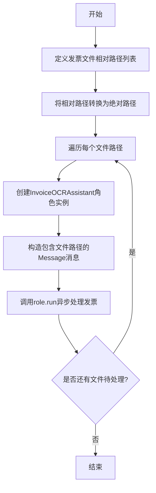

# `.\MetaGPT\examples\invoice_ocr.py` 详细设计文档

该代码是一个异步的发票OCR处理脚本，它通过创建InvoiceOCRAssistant角色实例，对指定目录下的多种格式（PDF、PNG、JPG、ZIP）的发票文件进行批量处理，以提取其中的开票日期信息。

## 整体流程



## 类结构

```
invoice_ocr.py (主脚本)
├── main (异步主函数)
├── InvoiceOCRAssistant (外部导入类)
└── InvoicePath (外部导入数据类)
```

## 全局变量及字段


### `relative_paths`
    
包含相对路径的列表，指向待处理的发票文件。

类型：`list[Path]`
    


### `absolute_file_paths`
    
通过将相对路径转换为绝对路径生成的列表，用于指定发票文件的完整路径。

类型：`list[Path]`
    


### `path`
    
在循环中迭代 absolute_file_paths 列表时，代表当前正在处理的发票文件的绝对路径。

类型：`Path`
    


### `role`
    
发票OCR助手的角色实例，负责执行发票信息的识别和提取任务。

类型：`InvoiceOCRAssistant`
    


### `InvoicePath.file_path`
    
InvoicePath 数据类的一个字段，用于封装待处理发票文件的路径信息。

类型：`Path`
    
    

## 全局函数及方法

### `main`

该函数是发票OCR处理脚本的异步主入口函数。它定义了一个包含多个发票文件路径的列表，为每个文件创建一个`InvoiceOCRAssistant`角色实例，并异步运行该角色来处理每个文件，提取“开票日期”信息。

参数：
- 无显式参数。

返回值：`None`，该函数不返回任何值，其主要作用是执行一系列异步任务。

#### 流程图

```mermaid
flowchart TD
    A[开始] --> B[定义相对路径列表 relative_paths]
    B --> C[将相对路径转换为绝对路径 absolute_file_paths]
    C --> D[遍历 absolute_file_paths 中的每个路径 path]
    D --> E[创建 InvoiceOCRAssistant 角色实例 role]
    E --> F[构造 Message 对象<br/>content: "Invoicing date"<br/>instruct_content: InvoicePath(file_path=path)]
    F --> G[异步调用 role.run 处理消息]
    G --> H{是否还有下一个路径？}
    H -- 是 --> D
    H -- 否 --> I[结束]
```

#### 带注释源码

```python
async def main():
    # 定义一组发票文件的相对路径，支持多种格式（PDF, PNG, JPG, ZIP）
    relative_paths = [
        Path("../tests/data/invoices/invoice-1.pdf"),
        Path("../tests/data/invoices/invoice-2.png"),
        Path("../tests/data/invoices/invoice-3.jpg"),
        Path("../tests/data/invoices/invoice-4.zip"),
    ]
    # 将相对路径列表转换为当前工作目录下的绝对路径列表
    absolute_file_paths = [Path.cwd() / path for path in relative_paths]

    # 遍历每个绝对文件路径
    for path in absolute_file_paths:
        # 为每个文件创建一个新的 InvoiceOCRAssistant 角色实例
        role = InvoiceOCRAssistant()
        # 异步运行该角色。传入一个 Message 对象，其中：
        # content: 指定要提取的信息为“开票日期”
        # instruct_content: 包含文件路径的 InvoicePath 对象
        await role.run(Message(content="Invoicing date", instruct_content=InvoicePath(file_path=path)))
```

### `InvoiceOCRAssistant.run`

该方法是一个异步方法，是`InvoiceOCRAssistant`角色的主要执行入口。它接收一个包含指令（如“Invoicing date”）和文件路径的`Message`对象，然后启动一个处理流程。该流程的核心是调用`_observe`方法来接收并解析消息，然后通过`_react`方法触发内部的思考和行动循环，最终完成对指定发票文件的OCR信息提取任务。

参数：
-  `with_message`：`Message`，一个消息对象，其中`content`字段包含用户指令（例如“Invoicing date”），`instruct_content`字段应包含一个`InvoicePath`对象，用于指定待处理的发票文件路径。

返回值：`None`，此方法不返回任何值，其执行结果（如提取的发票信息）将通过角色内部的消息机制或日志进行输出。

#### 流程图

```mermaid
flowchart TD
    A[开始: run(with_message)] --> B[调用 _observe(with_message)]
    B --> C[解析消息内容与文件路径]
    C --> D[调用 _react]
    D --> E{思考与行动循环}
    E -->|执行Action| F[处理发票文件<br>（如OCR识别）]
    F --> G[生成结果或新消息]
    G --> E
    E -->|循环结束| H[流程终止]
    H --> I[结束]
```

#### 带注释源码

```python
async def run(self, with_message: Message) -> None:
    """
    角色的主要运行方法。
    接收一个消息，触发观察和反应循环。
    Args:
        with_message: 包含用户指令和文件路径信息的消息对象。
    """
    # 1. 观察：接收并处理输入消息，将其放入角色的消息历史中。
    await self._observe(with_message)
    # 2. 反应：触发角色内部的思考、规划和行动流程来处理接收到的任务。
    await self._react()
```

## 关键组件


### InvoiceOCRAssistant

一个专门用于处理发票OCR（光学字符识别）任务的智能助手角色，能够接收包含文件路径的指令，并执行发票信息的提取与分析。

### InvoicePath

一个用于封装发票文件路径的数据结构，作为指令内容的一部分传递给InvoiceOCRAssistant，以指定需要处理的发票文件。

### Message

一个通用的消息数据结构，用于在系统组件间传递信息。在本代码中，它用于封装用户查询（如“Invoicing date”）和具体的操作指令（即InvoicePath对象）。

### 异步任务运行器 (asyncio.run)

负责启动和管理整个发票OCR处理流程的异步事件循环，确保多个文件能够被顺序或并发地处理（当前代码为顺序处理）。

### 文件路径处理器 (Path)

用于构建和操作文件系统路径，确保能够正确找到并加载位于不同相对路径下的发票文件（如PDF、PNG、JPG、ZIP格式）。


## 问题及建议


### 已知问题

-   **硬编码文件路径**：代码中使用的文件路径（`../tests/data/invoices/`）是硬编码的，这降低了代码的灵活性和可移植性。当文件位置或项目结构发生变化时，需要手动修改源代码。
-   **同步循环中的异步角色创建**：在 `for` 循环中为每个文件路径创建一个新的 `InvoiceOCRAssistant` 角色实例 (`role = InvoiceOCRAssistant()`)。如果 `InvoiceOCRAssistant` 的初始化成本较高（例如，加载大模型），这种方式会带来不必要的开销，并且无法利用可能存在的实例复用或连接池机制。
-   **缺乏错误处理**：代码没有对可能出现的异常进行捕获和处理，例如文件不存在、文件格式不支持、OCR处理失败、网络问题等。一旦出现错误，整个程序会崩溃。
-   **串行处理效率低下**：使用 `for` 循环逐个处理文件 (`await role.run(...)`)，这意味着文件是被串行处理的。如果每个文件的处理都需要等待I/O（如读取文件、调用API），总处理时间将是所有文件处理时间的总和，无法利用并发来提升效率。
-   **结果处理缺失**：`role.run` 方法可能会返回OCR处理的结果，但当前代码没有接收或处理这些结果。用户无法获取发票的识别信息。
-   **配置外部化缺失**：OCR模型路径、API密钥、处理参数等可能存在的配置项都内嵌在 `InvoiceOCRAssistant` 类中，没有通过配置文件或环境变量进行管理，不利于部署和不同环境间的切换。

### 优化建议

-   **参数化输入路径**：通过命令行参数、配置文件或环境变量来指定发票文件或目录的路径，增强程序的灵活性。例如，使用 `argparse` 库让用户运行时指定路径。
-   **角色实例复用**：考虑在循环外部创建一次 `InvoiceOCRAssistant` 角色实例，然后在循环中重复使用它来处理多个文件。这可以避免重复的初始化开销。
-   **添加健壮的错误处理**：使用 `try...except` 块包裹文件处理和 `role.run` 调用，捕获可能发生的异常（如 `FileNotFoundError`, `PermissionError`, `RuntimeError` 等），并记录清晰的错误日志，允许程序跳过问题文件继续处理后续任务。
-   **引入并发处理**：利用 `asyncio.gather` 或类似机制并发处理多个文件。将每个文件的处理任务封装为一个异步任务，然后同时运行它们，可以显著减少I/O密集型操作的总耗时。
-   **处理并输出结果**：修改代码以接收 `role.run` 的返回值，并将OCR识别出的结构化数据（如发票日期、金额、编号等）输出到控制台、文件或数据库中，使程序结果可用。
-   **外部化配置管理**：将 `InvoiceOCRAssistant` 所需的配置（如模型路径、API端点、阈值等）提取到配置文件（如YAML、JSON）或环境变量中。在角色初始化时从这些外部源读取配置，提高代码的可维护性和部署便利性。
-   **增加日志记录**：在关键步骤（如开始处理文件、处理成功、遇到错误）添加日志输出，便于监控程序运行状态和调试问题。
-   **代码结构优化**：考虑将主逻辑封装到一个独立的异步函数中，而不是全部写在 `main()` 函数里，以提高代码的可读性和可测试性。例如，可以有一个 `process_invoice_file` 函数负责处理单个文件。


## 其它


### 设计目标与约束

本代码的设计目标是提供一个异步的、可扩展的发票OCR处理流程，能够处理多种格式（PDF、PNG、JPG、ZIP）的发票文件，并从中提取指定信息（如“Invoicing date”）。主要约束包括：依赖外部的`metagpt`框架及其`InvoiceOCRAssistant`角色和`InvoicePath`数据结构；处理流程为异步执行；输入文件路径需要从相对路径转换为绝对路径。

### 错误处理与异常设计

代码中显式的错误处理逻辑较少，主要依赖`metagpt`框架内部和Python标准库的异常机制。潜在的异常点包括：文件路径不存在或不可访问时引发的`FileNotFoundError`或`PermissionError`；`metagpt`框架内部处理失败时可能抛出的自定义异常；异步任务执行失败。当前代码未包含`try-except`块来捕获和处理这些异常，在生产环境中需要增强鲁棒性，例如添加异常捕获、日志记录和友好的错误提示。

### 数据流与状态机

1.  **数据流**：
    *   **输入**：预定义的相对文件路径列表（`relative_paths`）。
    *   **处理**：将相对路径转换为绝对路径。对于每个绝对路径，实例化`InvoiceOCRAssistant`角色，并构造包含查询指令（“Invoicing date”）和文件路径信息（`InvoicePath`）的`Message`对象，然后异步调用`role.run`方法。
    *   **输出**：输出由`metagpt`框架的`InvoiceOCRAssistant`角色内部处理并决定，可能包括控制台打印、文件写入或返回结构化数据，本代码片段未展示直接输出。
2.  **状态机**：代码逻辑是线性的，没有复杂的状态转移。主流程为：初始化路径列表 -> 循环处理每个文件（实例化角色 -> 执行OCR任务）。每个文件的处理是独立且无状态的。

### 外部依赖与接口契约

1.  **外部依赖**：
    *   **Python标准库**：`asyncio`（异步运行时），`pathlib.Path`（路径处理）。
    *   **第三方包/框架**：`metagpt`。具体依赖了：
        *   `metagpt.roles.invoice_ocr_assistant.InvoiceOCRAssistant`：执行OCR分析的核心角色类。
        *   `metagpt.roles.invoice_ocr_assistant.InvoicePath`：封装文件路径的数据结构。
        *   `metagpt.schema.Message`：用于在角色间传递消息的数据结构。
2.  **接口契约**：
    *   `InvoiceOCRAssistant.run` 方法：期望接收一个`Message`对象作为参数。该`Message`的`instruct_content`字段应为一个`InvoicePath`实例，其`file_path`属性为要处理的文件`Path`对象。
    *   `main()` 函数：作为脚本入口点，无参数，返回`None`。它定义了与`metagpt`框架交互的固定模式。

### 并发与性能考虑

1.  **并发模型**：使用`asyncio`实现异步I/O。当前代码在循环中顺序调用`await role.run(...)`，对于每个文件是串行处理。若要并行处理多个文件以提高吞吐量，可以考虑使用`asyncio.gather`或创建任务列表。
2.  **性能瓶颈**：性能主要取决于`metagpt`框架中`InvoiceOCRAssistant`角色的实现，特别是其OCR引擎的处理速度、准确度以及可能涉及的网络调用（如果使用云服务）。本地文件I/O和循环开销相对较小。处理ZIP文件时，可能需要解压，会增加额外开销。

### 配置与可维护性

1.  **硬编码配置**：文件路径列表（`relative_paths`）和查询指令（“Invoicing date”）直接硬编码在`main`函数中，降低了灵活性。建议将这些配置外化，例如通过命令行参数、配置文件或环境变量传入。
2.  **可维护性**：代码结构简洁，职责单一（组织数据并调用框架）。主要的业务逻辑封装在`metagpt`框架内，因此本代码的维护成本较低，但同时也受框架更新和接口变更的影响。

### 安全考虑

1.  **输入验证**：代码未对输入的相对路径进行有效性或安全性检查（例如路径遍历攻击）。在将用户提供的或外部输入的路径用于构建绝对路径前，应进行规范化（`resolve()`）和安全性校验。
2.  **文件处理**：处理ZIP文件时，存在解压炸弹（Zip Bomb）风险，恶意构造的ZIP文件可能耗尽系统资源。依赖的`metagpt`框架应具备相应的安全措施。
3.  **依赖安全**：需要确保`metagpt`及其依赖库的来源可信且版本无已知漏洞。

    