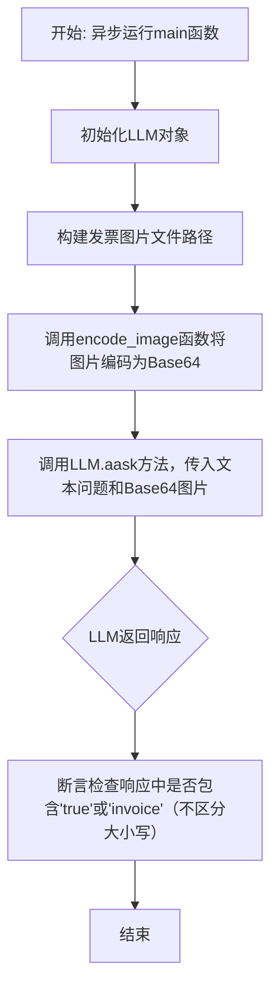
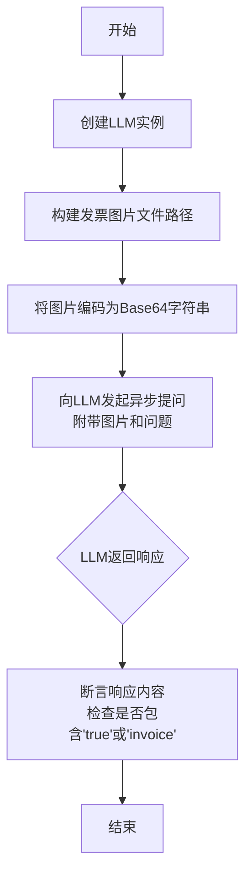
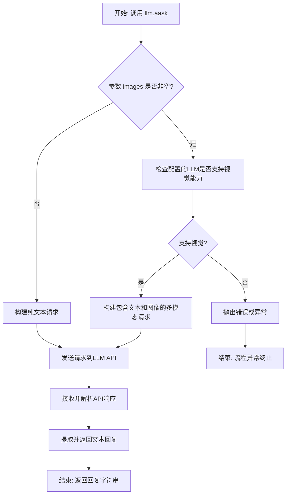

# `.\MetaGPT\examples\llm_vision.py` 详细设计文档

该代码是一个使用MetaGPT框架的示例程序，核心功能是测试配置的大语言模型（LLM）是否具备视觉理解能力。具体流程是：加载一张发票图片，将其编码为Base64格式，然后向LLM提问以判断该图片是否为发票，最后验证LLM的回复是否包含预期关键词。

## 整体流程



## 类结构

```
外部依赖/导入模块
├── asyncio (Python标准库)
├── pathlib.Path (Python标准库)
├── metagpt.llm.LLM (MetaGPT框架类)
└── metagpt.utils.common.encode_image (MetaGPT框架函数)
```

## 全局变量及字段


### `invoice_path`
    
指向发票图片文件的路径对象，用于读取图像数据。

类型：`pathlib.Path`
    


### `img_base64`
    
发票图片经过Base64编码后的字符串，用于作为视觉输入传递给LLM。

类型：`str`
    


### `res`
    
LLM对图像内容进行分析后返回的文本响应，用于判断图像是否为发票。

类型：`str`
    


### `llm`
    
LLM客户端实例，用于调用大语言模型的视觉能力进行图像分析。

类型：`metagpt.llm.LLM`
    


    

## 全局函数及方法


### `main`

该函数是一个异步入口函数，用于演示和测试所配置的LLM（大语言模型）的视觉识别能力。它加载一张发票图片，将其编码为Base64格式，然后向LLM提问以判断该图片是否为发票，最后通过断言验证LLM的响应是否包含预期关键词。

参数：
- 无显式参数。

返回值：`None`，该函数不返回任何值，其主要功能通过异步执行和断言完成。

#### 流程图



#### 带注释源码

```python
async def main():
    # 1. 实例化LLM客户端，用于后续的模型调用
    llm = LLM()

    # 2. 构建指向测试数据中发票图片的路径
    invoice_path = Path(__file__).parent.joinpath("..", "tests", "data", "invoices", "invoice-2.png")
    
    # 3. 使用工具函数将指定路径的图片文件编码为Base64字符串，这是LLM视觉API常见的输入格式
    img_base64 = encode_image(invoice_path)
    
    # 4. 异步调用LLM的提问方法。
    #    - `msg`: 向模型提出的问题文本。
    #    - `images`: 一个包含Base64编码图片的列表，作为视觉上下文提供给模型。
    #    该方法返回模型生成的文本响应。
    res = await llm.aask(msg="return `True` if this image might be a invoice, or return `False`", images=[img_base64])
    
    # 5. 验证响应：断言模型的响应文本（转换为小写后）包含"true"或"invoice"。
    #    这是一个简单的验收测试，用于确认模型具备基础的图像内容识别能力。
    assert ("true" in res.lower()) or ("invoice" in res.lower())
```


### `encode_image`

该函数用于将指定路径的图像文件编码为Base64格式的字符串，以便于在支持视觉能力的LLM（大语言模型）中作为图像输入使用。

参数：
-  `image_path`：`Path`，指向需要编码的图像文件的路径对象。

返回值：`str`，返回图像文件内容经过Base64编码后的字符串。

#### 流程图

```mermaid
flowchart TD
    A[开始: encode_image(image_path)] --> B{检查image_path是否为Path对象?};
    B -- 否 --> C[将image_path转换为Path对象];
    B -- 是 --> D[直接使用image_path];
    C --> D;
    D --> E[以二进制读取模式打开图像文件];
    E --> F[读取文件内容];
    F --> G[使用base64.b64encode对内容进行编码];
    G --> H[将编码后的字节串解码为UTF-8字符串];
    H --> I[返回Base64字符串];
    I --> J[结束];
```

#### 带注释源码

```python
def encode_image(image_path: Path) -> str:
    """
    将图像文件编码为Base64格式的字符串。

    该函数接受一个Path对象，指向图像文件，读取其二进制内容，
    然后使用Base64进行编码，最后返回编码后的字符串。

    Args:
        image_path (Path): 图像文件的路径。

    Returns:
        str: Base64编码后的图像字符串。
    """
    # 确保image_path是一个Path对象，如果不是则进行转换
    # 这增强了函数的健壮性，允许传入字符串路径
    if not isinstance(image_path, Path):
        image_path = Path(image_path)

    # 以二进制模式('rb')打开文件，这是读取非文本文件（如图像）的标准方式
    with open(image_path, "rb") as image_file:
        # 读取文件的全部二进制内容
        image_content = image_file.read()

        # 使用base64.b64encode对二进制内容进行编码，得到字节串
        # 然后使用.decode('utf-8')将字节串转换为标准的Python字符串
        encoded_string = base64.b64encode(image_content).decode("utf-8")

    # 返回Base64编码后的字符串
    return encoded_string
```


### `LLM.aask`

该方法是一个异步方法，用于向配置的大型语言模型（LLM）发送一个包含文本和可选图像信息的查询，并获取模型的文本回复。它封装了与LLM API的交互，支持多模态输入（文本+图像）。

参数：

-  `msg`：`str`，发送给LLM的文本提示或问题。
-  `images`：`List[str]`，可选参数。一个包含Base64编码图像字符串的列表，用于提供视觉上下文。如果LLM不支持视觉能力，传入此参数可能导致错误。
-  `system_msgs`：`Optional[List[str]]]`，可选参数。用于设置对话系统角色的消息列表，通常用于提供上下文或指令。
-  `format_msgs`：`Optional[List[Dict[str, str]]]`，可选参数。用于格式化消息的字典列表，可能用于更复杂的消息结构控制。
-  `gen`：`Optional[Dict]`，可选参数。一个字典，用于指定生成参数，如温度（temperature）、最大令牌数（max_tokens）等，以控制模型的输出行为。

返回值：`str`，LLM模型根据输入（文本和图像）生成的文本回复。

#### 流程图



#### 带注释源码

```python
async def aask(
    self,
    msg: str,
    images: Optional[List[str]] = None,  # Base64编码的图像列表
    system_msgs: Optional[List[str]] = None,  # 可选的系统消息列表
    format_msgs: Optional[List[Dict[str, str]]] = None,  # 可选的格式化消息
    gen: Optional[Dict] = None,  # 可选的生成参数（如temperature, max_tokens）
) -> str:
    """
    异步地向LLM发送消息并获取回复。
    核心方法，处理与LLM的交互逻辑。
    """
    # 1. 消息预处理：将输入参数转换为LLM API所需的格式
    #    - 可能合并system_msgs和msg
    #    - 如果提供了images，将其整合到消息结构中
    #    - 应用format_msgs进行格式化（如果提供）
    # 2. 能力检查：如果传入了images，验证当前配置的LLM是否支持视觉理解。
    #    如果不支持，应抛出明确的错误（如NotImplementedError或ValueError）。
    # 3. 请求构建：根据LLM类型（如OpenAI GPT-4V, Claude等）构建特定的API请求体。
    #    对于支持视觉的模型，请求体可能是一个包含"content"字段的列表，
    #    其中既有{"type": "text", "text": msg}对象，也有{"type": "image_url", "image_url": {"url": f"data:image/jpeg;base64,{img}"}}对象。
    # 4. 发送请求：使用异步HTTP客户端（如aiohttp）发送POST请求到LLM的API端点。
    #    请求中会包含认证信息（如API Key）和生成参数gen。
    # 5. 响应处理：接收API的JSON响应，从中提取出模型生成的文本内容。
    # 6. 返回结果：将提取出的文本作为字符串返回给调用者。
    # 注意：实际实现中会包含错误处理（如网络错误、API错误、额度不足等）。
    # 此处为逻辑描述，非真实代码。
    pass
```


## 关键组件


### LLM (Large Language Model) 组件

作为核心AI模型接口，封装了与大型语言模型（如GPT-4V等具备视觉能力的模型）的交互逻辑，支持文本和图像的多模态输入。

### 图像编码器 (`encode_image`)

一个工具函数，负责将指定路径的图像文件编码为Base64字符串格式，以便作为图像输入传递给支持视觉功能的LLM。

### 异步任务执行器 (`asyncio`)

提供异步执行框架，用于高效地运行涉及网络I/O（如调用LLM API）的异步主函数 (`main`)，管理事件循环。

### 配置与路径管理 (`Path`)

用于构建跨平台的、可靠的系统文件路径，确保能正确找到并加载项目中的测试图像资源文件。


## 问题及建议


### 已知问题

-   **断言逻辑过于宽松且脆弱**：当前断言条件 `("true" in res.lower()) or ("invoice" in res.lower())` 存在逻辑缺陷。它无法准确验证LLM是否返回了预期的布尔值 `True`。例如，LLM返回 `"This is not an invoice"` 或 `"It's false that this is an invoice"` 等包含 `true` 或 `invoice` 子串的字符串时，断言也会通过，导致测试结果不可靠，无法有效验证LLM的视觉能力。
-   **缺乏错误处理与健壮性**：代码直接使用 `encode_image` 函数读取图片文件并转换为base64，但未对文件路径不存在、文件格式不支持或读取失败等异常情况进行处理。如果 `invoice-2.png` 文件丢失或损坏，程序会直接抛出异常而终止，缺乏优雅的错误恢复或提示机制。
-   **硬编码的测试逻辑与数据路径**：测试数据路径 `Path(__file__).parent.joinpath("..", "tests", "data", "invoices", "invoice-2.png")` 被硬编码在主要业务逻辑中。这使得代码难以复用和测试，任何文件结构的变动都会导致代码失效，且无法方便地替换测试图片。
-   **单一且模糊的测试用例**：仅使用一张发票图片进行测试，且提示词 `"return `True` if this image might be a invoice, or return `False`"` 中的 `might be` 表述模糊，可能导致LLM返回不确定的答案（如 `"Probably"`），增加了结果解析的复杂性和测试的不确定性。
-   **同步与异步上下文混合风险**：脚本使用 `asyncio.run(main())` 启动异步主函数，但在 `main` 函数内部直接进行文件I/O操作（`encode_image`）。虽然当前可能未引发问题，但在更复杂的异步环境中，阻塞式的I/O操作可能会影响事件循环的性能。

### 优化建议

-   **重构断言逻辑，明确验证标准**：将模糊的字符串包含检查改为更精确的验证。例如，可以要求LLM严格返回 `True` 或 `False` 字符串，然后使用 `assert res.strip() == "True"` 进行断言。或者，使用JSON格式作为响应，解析后验证布尔字段。
-   **增加健壮的错误处理机制**：在文件读取和编码步骤周围添加 `try-except` 块，捕获 `FileNotFoundError`、`ValueError` 等异常，并输出清晰的错误信息，或者提供默认的备选方案。
-   **将配置与逻辑分离**：将测试图片的路径、LLM的提示词等可配置项提取为函数参数、配置文件或环境变量。例如，将 `main` 函数改为 `async def main(image_path: Path, prompt: str)`，提高代码的灵活性和可测试性。
-   **设计更全面的测试套件**：扩展测试用例，包括正面案例（多种发票）、负面案例（非发票图片）以及边界案例（模糊、部分发票）。为每个用例定义清晰的预期结果。考虑使用参数化测试工具（如 `pytest.mark.parametrize`）来组织这些用例。
-   **优化异步I/O操作**：对于文件读取等可能阻塞的操作，考虑使用异步文件I/O库（如 `aiofiles`）来替换同步的 `encode_image` 调用，或者将阻塞操作放入线程池中执行，以避免阻塞事件循环，提升在高并发场景下的性能。
-   **添加日志记录**：在关键步骤（如开始处理、收到LLM响应、断言结果）添加日志输出，便于调试和监控代码的执行流程，尤其是在自动化测试或持续集成环境中。


## 其它


### 设计目标与约束

本代码示例的核心设计目标是展示如何利用 MetaGPT 框架调用具备视觉能力的 LLM（大语言模型）对图像内容进行识别和判断。主要约束包括：1) 依赖外部 LLM 服务（如 GPT-4V）的视觉能力，其可用性和性能受服务商限制；2) 图像需编码为 Base64 格式进行传输；3) 代码为异步执行模式，需要运行在支持 `asyncio` 的环境中；4) 示例功能单一，主要用于验证流程，不具备复杂的错误处理或业务逻辑。

### 错误处理与异常设计

当前代码示例中的错误处理较为简单。主要潜在的异常点包括：1) `LLM` 类初始化时，若配置的模型不支持视觉能力，可能在后续调用时抛出错误；2) `encode_image` 函数在读取或编码指定路径的图像文件失败时（如文件不存在、格式不支持）会抛出异常；3) `llm.aask` 方法在调用 LLM API 过程中可能因网络问题、认证失败、API限制或服务端错误而抛出异常。示例中仅通过 `assert` 语句对结果进行验证，未对上述潜在异常进行捕获和处理，在生产环境中需要增强。

### 数据流与状态机

本示例的数据流是线性的、无状态的：1) **输入**：一个本地图像文件路径 (`invoice_path`)。2) **处理**：a) 通过 `encode_image` 函数将图像文件编码为 Base64 字符串 (`img_base64`)。b) 构造包含图像 Base64 数据和文本提示 (`msg`) 的请求。c) 通过 `llm.aask` 异步方法发送请求给 LLM 服务。3) **输出**：LLM 返回的文本响应 (`res`)。4) **验证**：使用 `assert` 检查响应内容是否包含 "true" 或 "invoice" 关键字（不区分大小写）。整个过程没有复杂的内部状态转换。

### 外部依赖与接口契约

1.  **MetaGPT 框架**：依赖 `metagpt.llm.LLM` 类和 `metagpt.utils.common.encode_image` 函数。`LLM` 类封装了与底层 LLM API 的交互，其 `aask` 方法需要支持 `images` 参数以传递视觉信息。`encode_image` 函数负责将图像文件转换为 Base64 编码字符串。
2.  **底层 LLM API 服务**：如 OpenAI GPT-4V 等。代码通过 `LLM` 类与之交互，隐式依赖该服务提供的视觉理解能力和文本生成接口。调用方需确保已正确配置 API 密钥、端点等，且所用模型支持视觉输入。
3.  **Python 标准库**：依赖 `asyncio` 用于异步运行，`pathlib.Path` 用于路径操作。
4.  **接口契约**：`llm.aask(msg: str, images: List[str]) -> str` 方法接受一个提示字符串和一个 Base64 字符串列表，返回 LLM 生成的文本响应。`encode_image(image_path: Path) -> str` 函数接受一个 `Path` 对象，返回图像的 Base64 编码字符串。

    