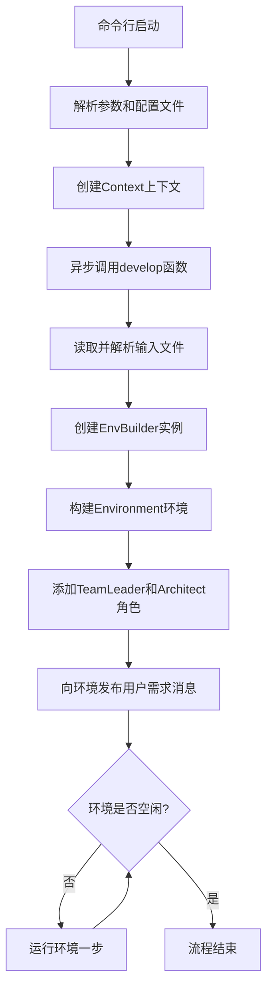
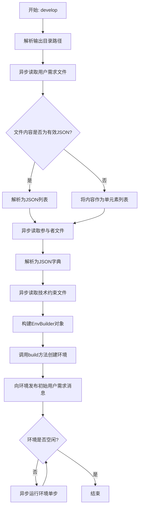
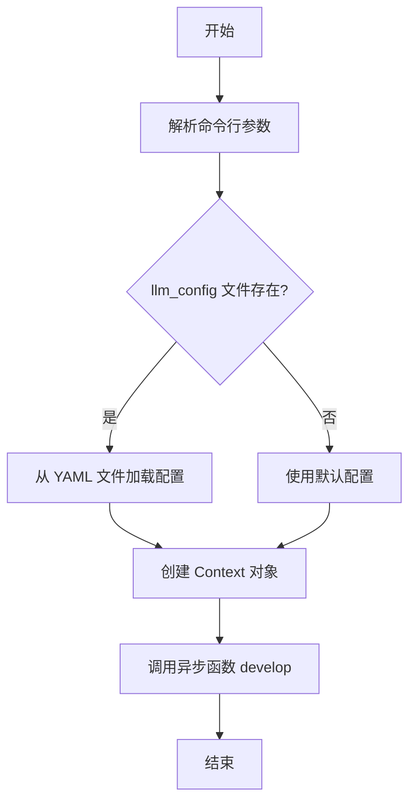
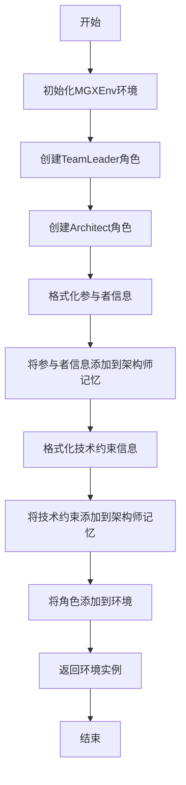

# `.\MetaGPT\examples\mgx_write_project_framework.py` 详细设计文档

该代码实现了一个基于MetaGPT框架的自动化软件项目框架生成工具。它通过读取用户需求、UML用例角色描述和技术约束文件，构建一个包含TeamLeader和Architect角色的环境，然后驱动这些AI角色协作生成符合要求的软件项目框架代码。

## 整体流程



## 类结构

```
BaseModel (Pydantic基类)
└── EnvBuilder (环境构建器)
 
typer.Typer (CLI框架)
└── app (主应用实例)
```

## 全局变量及字段


### `app`
    
Typer命令行应用实例，用于定义和管理命令行接口。

类型：`typer.Typer`
    


### `EnvBuilder.context`
    
应用上下文对象，包含配置和运行时状态。

类型：`Context`
    


### `EnvBuilder.user_requirements`
    
用户需求列表，每个元素是一个需求描述字符串。

类型：`List[str]`
    


### `EnvBuilder.actors`
    
UML用例图中的参与者映射，键为参与者名称，值为描述。

类型：`Dict[str, str]`
    


### `EnvBuilder.technical_constraint`
    
技术约束字符串，描述生成代码必须满足的额外技术要求。

类型：`str`
    


### `EnvBuilder.output_dir`
    
输出目录路径对象，用于存储生成的软件框架文件。

类型：`Path`
    
    

## 全局函数及方法

### `develop`

`develop` 函数是项目框架生成流程的异步入口点。它负责读取用户需求、参与者定义和技术约束文件，构建一个包含团队领导（TeamLeader）和架构师（Architect）角色的环境（Environment），并向环境发布初始用户需求消息以启动框架生成流程。函数会持续运行环境，直到环境进入空闲状态，表示框架生成任务完成。

参数：

- `context`：`Context`，应用程序的运行时上下文，包含配置等信息。
- `user_requirement_filename`：`str`，包含用户需求（JSON 数组或纯文本）的文件路径。
- `actors_filename`：`str`，包含 UML 用例参与者定义（JSON 格式）的文件路径。
- `constraint_filename`：`str`，包含技术约束（纯文本）的文件路径。
- `output_dir`：`str`，指定生成的项目框架的输出目录路径。如果为空，则使用默认工作空间下的一个随机 UUID 目录。

返回值：`None`，该函数为异步执行函数，不直接返回值，其效果体现在构建的环境运行和生成的文件输出上。

#### 流程图



#### 带注释源码

```python
async def develop(
    context: Context, # 应用程序上下文，传递配置等全局信息
    user_requirement_filename: str, # 用户需求文件路径
    actors_filename: str, # 参与者定义文件路径
    constraint_filename: str, # 技术约束文件路径
    output_dir: str, # 输出目录路径
):
    # 1. 确定输出目录：如果未提供，则在默认工作空间下创建一个随机命名的目录
    output_dir = Path(output_dir) if output_dir else DEFAULT_WORKSPACE_ROOT / uuid.uuid4().hex

    # 2. 读取并解析用户需求文件
    v = await aread(filename=user_requirement_filename) # 异步读取文件内容
    try:
        user_requirements = json.loads(v) # 尝试将内容解析为JSON列表
    except JSONDecodeError:
        user_requirements = [v] # 如果解析失败，则将整个文件内容作为一个需求项

    # 3. 读取并解析参与者定义文件（预期为JSON格式）
    v = await aread(filename=actors_filename)
    actors = json.loads(v) # 解析为字典，格式如 {"ActorName": "Description"}

    # 4. 读取技术约束文件（纯文本）
    technical_constraint = await aread(filename=constraint_filename)

    # 5. 使用读取到的所有数据构建环境构建器(EnvBuilder)
    env_builder = EnvBuilder(
        context=context,
        user_requirements=user_requirements,
        actors=actors,
        technical_constraint=technical_constraint,
        output_dir=output_dir,
    )
    # 6. 通过构建器创建并配置环境，环境内会添加TeamLeader和Architect角色
    env = env_builder.build()

    # 7. 向环境发布初始消息，触发框架生成流程。
    #    消息内容格式化用户需求，并指定发送给名为"Bob"的角色（通常是TeamLeader）。
    msg = """
Given the user requirement of "User Requirements", write out the software framework.
## User Requirements
{user_requirements}
    """
    env.publish_message(
        UserMessage(content=msg.format(user_requirements="\n".join(user_requirements)), send_to="Bob"),
        user_defined_recipient="Bob", # 明确指定消息接收者为"Bob"
    )

    # 8. 运行环境循环：只要环境不空闲（即有角色有待处理的动作），就执行一步。
    #    这个过程会驱动TeamLeader和Architect进行协作，最终生成项目框架。
    while not env.is_idle:
        await env.run()
```

### `startup`

`startup` 函数是 Typer 命令行应用的入口点，负责解析命令行参数、初始化配置和上下文，并启动异步开发流程以生成软件项目框架。

参数：

- `user_requirement_filename`：`str`，用户需求文件的路径。
- `actors_filename`：`str`，UML 用例参与者描述文件的路径。
- `llm_config`：`str`，低成本 LLM 配置文件的路径（可选）。
- `constraint_filename`：`str`，技术依赖约束文件的路径（可选）。
- `output_dir`：`str`，输出目录的路径（可选）。

返回值：`None`，无返回值。

#### 流程图



#### 带注释源码

```python
@app.command()
def startup(
    user_requirement_filename: str = typer.Argument(..., help="The filename of the user requirements."),
    actors_filename: str = typer.Argument(..., help="The filename of UML use case actors description."),
    llm_config: str = typer.Option(default="", help="Low-cost LLM config"),
    constraint_filename: str = typer.Option(default="", help="What technical dependency constraints are."),
    output_dir: str = typer.Option(default="", help="Output directory."),
):
    # 检查是否提供了 llm_config 参数且文件存在
    if llm_config and Path(llm_config).exists():
        # 从 YAML 文件加载配置
        config = Config.from_yaml_file(Path(llm_config))
    else:
        # 使用默认配置，并记录日志提示推荐使用 GPT-4 Turbo
        logger.info("GPT 4 turbo is recommended")
        config = Config.default()
    # 使用加载的配置创建 Context 对象
    ctx = Context(config=config)

    # 运行异步开发流程，传入解析的参数和创建的上下文
    asyncio.run(develop(ctx, user_requirement_filename, actors_filename, constraint_filename, output_dir))
```

### `EnvBuilder.build`

该方法负责构建一个基于给定上下文、用户需求、参与者信息和约束条件的软件框架开发环境。它初始化环境实例，配置关键角色（如团队领导和架构师），并将相关需求信息添加到角色的记忆中，最终返回配置好的环境对象。

参数：

- `self`：`EnvBuilder`，EnvBuilder 类的实例，包含构建环境所需的所有上下文和数据。

返回值：`Environment`，返回一个已配置好的环境实例，其中包含了团队领导和架构师角色，并已加载了用户需求和约束信息。

#### 流程图



#### 带注释源码

```python
def build(self) -> Environment:
    # 初始化MGXEnv环境，传入上下文
    env = MGXEnv(context=self.context)
    # 创建团队领导角色
    team_leader = TeamLeader()
    # 创建架构师角色，并传入经验检索器
    architect = Architect(experience_retriever=TRDToolExpRetriever())

    # 格式化参与者信息，将字典转换为字符串列表
    use_case_actors = "".join([f"- {v}: {k}\n" for k, v in self.actors.items()])
    # 创建参与者信息消息模板
    msg = """
The content of "Actor, System, External System" provides an explanation of actors and systems that appear in UML Use Case diagram.
## Actor, System, External System
{use_case_actors}
        """
    # 将格式化后的参与者信息添加到架构师的记忆中
    architect.rc.memory.add(AIMessage(content=msg.format(use_case_actors=use_case_actors)))

    # 创建技术约束信息消息模板
    msg = """
"Additional Technical Requirements" specifies the additional technical requirements that the generated software framework code must meet.
## Additional Technical Requirements
{technical_requirements}
"""
    # 将技术约束信息添加到架构师的记忆中
    architect.rc.memory.add(AIMessage(content=msg.format(technical_requirements=self.technical_constraint)))

    # 将团队领导和架构师角色添加到环境中
    env.add_roles([team_leader, architect])
    # 返回配置好的环境实例
    return env
```

## 关键组件


### EnvBuilder

EnvBuilder 是一个用于构建和初始化项目开发环境的组件，它负责读取用户需求、参与者信息和约束条件，并据此创建并配置一个包含 TeamLeader 和 Architect 角色的 MGXEnv 环境。

### MGXEnv

MGXEnv 是 MetaGPT 框架中的一个环境实现，它管理着角色（如 TeamLeader 和 Architect）之间的交互，并驱动整个软件框架生成流程的异步执行。

### TeamLeader

TeamLeader 是一个角色组件，在软件框架生成流程中负责协调和管理团队，确保开发任务按照用户需求和约束条件进行。

### Architect

Architect 是一个角色组件，负责根据用户需求、技术约束和过往经验（通过 TRDToolExpRetriever 检索）来设计和生成软件的整体架构与框架代码。

### TRDToolExpRetriever

TRDToolExpRetriever 是一个经验检索器组件，它为 Architect 角色提供从过往项目或知识库中检索相关设计模式和解决方案的能力，以辅助框架设计。

### Context

Context 是 MetaGPT 框架中的核心上下文管理组件，它封装了配置信息（如 LLM 配置）和运行时状态，为环境（Environment）和角色（Role）提供共享的上下文数据。

### Config

Config 是配置管理组件，用于加载和管理应用程序的配置，特别是大语言模型（LLM）的配置，支持从 YAML 文件加载或使用默认配置。


## 问题及建议


### 已知问题

-   **错误处理不充分**：`develop` 函数中读取并解析 JSON 文件时，仅对 `user_requirement_filename` 的 JSON 解析错误进行了处理（捕获 `JSONDecodeError` 并回退为列表），但对 `actors_filename` 的 JSON 解析错误未进行任何异常捕获和处理，可能导致程序因 JSON 格式错误而意外终止。
-   **硬编码的角色名称**：在 `EnvBuilder.build` 方法中，向环境发布消息时，`send_to` 参数被硬编码为 `"Bob"`。这缺乏灵活性，且与代码中实际创建的角色（`TeamLeader` 和 `Architect`）名称不匹配，可能导致消息无法正确路由。
-   **潜在的循环依赖或死循环风险**：`develop` 函数中的 `while not env.is_idle: await env.run()` 循环依赖环境状态 `is_idle` 来终止。如果环境中的角色行为逻辑有缺陷，导致 `is_idle` 状态永远无法变为 `True`，程序将陷入死循环。
-   **配置加载逻辑存在歧义**：`startup` 函数中，`llm_config` 参数为空字符串时，会使用 `Config.default()`。但 `typer.Option` 的 `default=""` 意味着即使命令行不提供该选项，其值也为空字符串，这可能导致用户意图使用默认配置时，却意外地因为提供了空字符串路径而触发了 `Path(llm_config).exists()` 检查（空字符串路径不存在），从而仍然回退到 `Config.default()`。虽然功能上可能一致，但逻辑上不够清晰。
-   **输出目录命名可能冲突**：当 `output_dir` 参数为空时，使用 `DEFAULT_WORKSPACE_ROOT / uuid.uuid4().hex` 作为输出路径。虽然使用 UUID 降低了冲突概率，但在极高并发或特定随机数生成器状态下，理论上仍存在极小概率的命名冲突。

### 优化建议

-   **增强错误处理与数据验证**：
    -   在 `develop` 函数中，为 `actors_filename` 的 JSON 解析也添加 `try-except` 块，并提供更明确的错误信息或默认值。
    -   考虑使用 Pydantic 模型对从文件读取的 `user_requirements`、`actors` 等数据进行验证，确保其结构和类型符合预期，提高代码的健壮性。
-   **解耦消息接收者**：
    -   避免在 `EnvBuilder.build` 中硬编码 `send_to="Bob"`。可以将其作为 `EnvBuilder` 的一个可配置字段，或者在发布消息时，根据环境中实际存在的角色动态决定接收者（例如，发送给 `TeamLeader` 角色）。
-   **增加循环安全机制**：
    -   在 `develop` 函数的 `while` 循环中，可以添加一个最大迭代次数限制或超时机制，防止因逻辑错误导致无限循环。
    -   在循环体内添加日志输出，记录每次运行的环境状态或角色动作，便于调试和监控。
-   **明确配置加载策略**：
    -   重构 `startup` 函数中的配置加载逻辑。例如，将 `llm_config` 的默认值设为 `None`，然后明确判断：如果提供了非空且有效的文件路径，则从文件加载；否则，使用默认配置。这使意图更清晰。
    -   或者，提供两个独立的命令行选项：一个用于指定配置文件路径，另一个布尔标志（如 `--use-default-config`）来显式请求使用默认配置。
-   **改进输出目录管理**：
    -   在创建由 UUID 生成的输出目录后，可以检查该目录是否已存在（尽管概率极低），若存在则重新生成或追加时间戳，确保唯一性。
    -   考虑在程序开始时，记录最终使用的输出目录路径到日志，方便用户查找结果。
-   **代码结构与可测试性**：
    -   将 `develop` 函数的核心逻辑（如环境构建、消息发布、循环运行）进一步拆分为更小、功能更单一的函数，提高可读性和可测试性。
    -   为 `EnvBuilder` 类和 `develop` 函数编写单元测试，模拟文件读取、环境交互等行为，确保核心流程的正确性。
-   **依赖注入与配置化**：
    -   当前 `EnvBuilder` 在 `build` 方法内部直接实例化了 `TeamLeader` 和 `Architect` 等角色。考虑将这些角色的类或工厂方法作为参数传入 `EnvBuilder`，使其更易于扩展和替换，符合依赖注入原则。
    -   将 `use_case_actors` 和 `technical_requirements` 的消息模板内容外部化（例如，放到配置文件中），避免硬编码在代码中，提高可维护性。


## 其它


### 设计目标与约束

本模块的核心设计目标是提供一个自动化生成软件项目框架的命令行工具。它遵循RFC-243规范，通过协调架构师（Architect）和团队领导（TeamLeader）等AI角色，基于用户需求、UML用例参与者描述以及技术约束，生成结构化的项目代码框架。主要设计约束包括：1) 输入依赖外部JSON或文本文件；2) 运行环境需要配置LLM（大语言模型）；3) 输出为文件系统目录结构；4) 采用异步并发模型处理角色间通信与任务执行。

### 错误处理与异常设计

模块的错误处理主要围绕文件读取和JSON解析展开。在`develop`函数中，使用`try-except`块捕获`JSONDecodeError`，当`user_requirement_filename`文件内容不是合法JSON时，将其作为纯文本列表处理，增强了鲁棒性。对于不存在的LLM配置文件路径，模块会回退到使用默认配置并记录提示信息，避免了因配置问题导致的启动失败。然而，对于环境运行（`env.run()`）过程中角色可能产生的异常、文件写入权限错误等未显式处理，属于潜在的技术债务。

### 数据流与状态机

数据流始于命令行参数，读取三个输入文件：用户需求、参与者定义、技术约束。这些数据被封装到`EnvBuilder`对象中，用于构建`MGXEnv`环境并初始化`TeamLeader`和`Architect`角色。初始的用户需求消息通过`env.publish_message`发布，触发角色间基于消息队列的异步协作。系统状态由环境（`Environment`）的`is_idle`属性控制，形成一个简单状态机：当环境非空闲（`not env.is_idle`）时，循环执行`env.run()`驱动各角色处理消息、生成动作（如编写代码文件），直至所有任务完成，环境变为空闲状态，循环结束。最终输出是写入`output_dir`目录的完整项目框架代码。

### 外部依赖与接口契约

1.  **外部依赖**：
    *   **MetaGPT框架**：强依赖`metagpt`包的多个核心模块，包括`Context`, `Environment`, `MGXEnv`, `Architect`, `TeamLeader`, `AIMessage`, `UserMessage`等，用于提供AI智能体协作的基础设施。
    *   **大语言模型（LLM）服务**：通过`metagpt.config2.Config`配置，依赖外部LLM API（如OpenAI GPT）进行内容生成。
    *   **命令行接口**：依赖`typer`库构建CLI。
    *   **数据模型验证**：依赖`pydantic`的`BaseModel`进行`EnvBuilder`类的数据验证与序列化。
2.  **接口契约**：
    *   **输入文件契约**：`user_requirement_filename`文件内容应为JSON数组（如`["需求1", "需求2"]`）或纯文本；`actors_filename`文件内容必须为合法的JSON对象（如`{"用户": "Actor"}`）；`constraint_filename`文件内容为纯文本技术描述。
    *   **环境接口**：依赖`Environment`接口的`add_roles`, `publish_message`, `run`, `is_idle`属性。`MGXEnv`是其具体实现。
    *   **角色接口**：依赖`Role`基类定义的`react`、`_act`等行为模式，特别是`Architect`和`TeamLeader`的特定实现逻辑。

### 配置管理

配置管理主要通过`metagpt.config2.Config`类处理。模块支持通过`--llm-config`选项指定YAML配置文件路径来覆盖默认LLM配置（如模型类型、API密钥、温度参数等）。若未提供或文件不存在，则使用`Config.default()`获取默认配置（代码中提示推荐GPT-4 Turbo）。配置对象被注入到`Context`中，贯穿整个运行时，为所有依赖LLM的组件提供统一访问点。当前配置方式为静态初始化，不支持运行时热重载。

### 安全与合规考虑

1.  **数据安全**：模块会读取用户提供的本地文件内容，并将其作为提示词的一部分发送给外部LLM服务。需确保输入文件不包含敏感信息（如密钥、个人身份信息），或在前置流程中进行脱敏处理。
2.  **LLM使用合规**：依赖的LLM API调用需遵守相应服务提供商的使用政策。生成的代码框架可能包含第三方库建议，使用者需自行评估其许可证合规性。
3.  **路径安全**：`output_dir`参数允许用户指定输出目录，代码会直接在该路径进行文件创建和写入。需防范路径遍历攻击（尽管风险较低，因输入来自可信命令行），并确保运行进程对该目录有写入权限。
4.  **无认证/授权机制**：当前模块本身不涉及网络服务或访问控制，所有操作在本地执行。与LLM服务的认证通过配置中的API密钥管理。


    