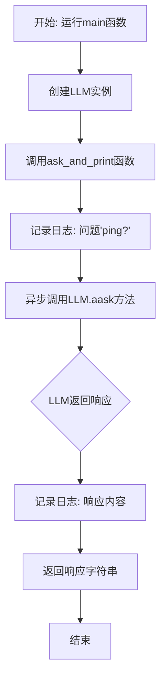
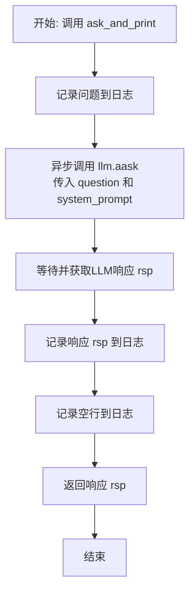
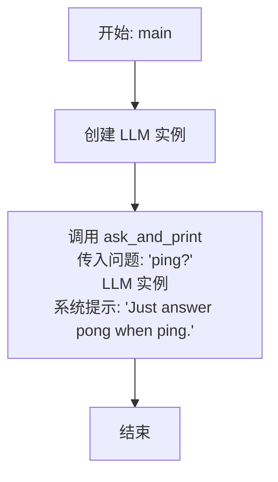

# `.\MetaGPT\examples\ping.py` 详细设计文档

该代码是一个简单的异步测试脚本，用于验证LLM（大语言模型）服务的连通性和基本问答功能。它通过向LLM发送一个预设的'ping'问题，并期望得到一个'pong'的回应，从而确认服务是否正常工作。

## 整体流程



## 类结构

```
全局函数
├── ask_and_print
└── main
外部类
└── LLM (来自metagpt.llm)
```

## 全局变量及字段


    

## 全局函数及方法


### `ask_and_print`

这是一个异步函数，用于向大型语言模型（LLM）提出一个问题，并将问题、系统提示以及模型的回答记录到日志中，最后返回模型的回答。

参数：

-  `question`：`str`，需要向LLM提出的问题文本。
-  `llm`：`LLM`，一个封装了LLM能力的对象，用于发起异步请求。
-  `system_prompt`：`str`，提供给LLM的系统级指令或上下文，用于引导其回答风格或内容。

返回值：`str`，LLM根据问题和系统提示生成的回答文本。

#### 流程图



#### 带注释源码

```python
async def ask_and_print(question: str, llm: LLM, system_prompt) -> str:
    # 1. 使用logger记录用户提出的问题
    logger.info(f"Q: {question}")
    # 2. 异步调用LLM的`aask`方法，传入问题和系统提示，并等待结果
    rsp = await llm.aask(question, system_msgs=[system_prompt])
    # 3. 使用logger记录LLM返回的答案
    logger.info(f"A: {rsp}")
    # 4. 记录一个空行，使日志输出更清晰
    logger.info("\n")
    # 5. 将LLM的答案作为函数返回值
    return rsp
```


### `main`

`main` 函数是程序的异步入口点。它初始化一个 LLM 实例，并调用 `ask_and_print` 函数来向 LLM 发送一个“ping?”的查询，同时指定一个系统提示，要求 LLM 在收到“ping”时仅回答“pong”。

参数：
-  `无`：`无`，此函数不接受任何参数。

返回值：`None`，此函数不返回任何值。

#### 流程图



#### 带注释源码

```python
async def main():
    # 初始化一个 LLM 实例，用于后续的异步问答交互
    llm = LLM()
    # 调用 ask_and_print 函数，传入问题、LLM实例和系统提示
    # 系统提示约束了 LLM 的回答行为：当收到“ping”时，只回答“pong”
    await ask_and_print("ping?", llm, "Just answer pong when ping.")
```


## 关键组件


### LLM (Large Language Model) 组件

封装了与大语言模型交互的核心功能，提供异步问答接口，是系统与AI模型通信的桥梁。

### 异步任务执行框架

基于 `asyncio` 构建的异步执行环境，用于高效管理并发的大语言模型调用任务。

### 日志记录组件

提供结构化的日志输出功能，用于记录程序运行状态、用户问题以及模型响应，便于调试和监控。


## 问题及建议


### 已知问题

-   **硬编码的系统提示词**：`main` 函数中直接硬编码了系统提示词 `"Just answer pong when ping."`，这使得代码的灵活性和可复用性较差。如果需要更改提示词或进行不同的对话，必须修改源代码。
-   **缺乏配置化**：`LLM` 对象的创建使用了默认参数，没有提供任何配置选项（如模型选择、API密钥、温度等）。这限制了代码在不同环境或需求下的适应能力。
-   **单一功能脚本**：当前脚本仅执行一次固定的问答（“ping?” -> “pong”），功能单一，无法扩展为更复杂的交互或批量处理任务。
-   **异常处理缺失**：代码中没有对 `llm.aask` 可能抛出的异常（如网络错误、API限制、认证失败等）进行捕获和处理，程序在遇到错误时会直接崩溃。
-   **日志输出不够结构化**：虽然使用了 `logger`，但日志格式相对简单，没有包含时间戳、模块名等上下文信息，不利于在复杂系统中进行问题排查和日志分析。

### 优化建议

-   **参数化输入**：将系统提示词和用户问题通过命令行参数、配置文件或环境变量传入，提高脚本的灵活性。例如，使用 `argparse` 库来接收用户输入的问题。
-   **增强配置管理**：为 `LLM` 类提供配置选项，允许通过配置文件或环境变量指定模型、API端点、密钥等参数。可以创建一个配置类或使用现有的配置管理方案。
-   **扩展脚本功能**：将脚本重构为支持交互式对话、批量问答或从文件读取问题列表的模式。可以设计一个简单的循环或命令行界面。
-   **添加健壮的异常处理**：在 `ask_and_print` 函数和 `main` 函数中添加 `try-except` 块，捕获并处理可能发生的异常，提供有意义的错误信息，并确保程序能够优雅地退出或重试。
-   **改进日志记录**：配置 `logger` 使用更丰富的格式，包含时间戳、日志级别、模块名和行号。考虑将日志输出到文件，而不仅仅是控制台。
-   **代码模块化与复用**：考虑将 `ask_and_print` 函数和 `LLM` 的初始化逻辑封装到一个更通用的工具类或模块中，方便其他脚本调用。
-   **添加类型提示与文档**：虽然已有部分类型提示，但可以进一步完善。为函数和模块添加更详细的 `docstring`，说明其用途、参数和返回值。
-   **考虑异步上下文管理**：如果 `LLM` 类涉及需要清理的资源（如网络会话），建议使用异步上下文管理器 (`async with`) 来确保资源的正确初始化和释放。


## 其它


### 设计目标与约束

本代码是一个简单的异步命令行工具，用于测试与大型语言模型（LLM）服务的基本连接和交互功能。其核心设计目标是验证LLM模块（`metagpt.llm.LLM`）的可用性，并提供一个最小化的异步交互示例。主要约束包括：1) 保持代码极简，仅包含必要的导入和函数；2) 依赖异步执行模型；3) 输出结果直接打印到日志，不进行复杂处理。

### 错误处理与异常设计

当前代码缺乏显式的错误处理机制。`llm.aask` 方法在调用外部API时可能抛出多种异常（如网络连接错误、API认证失败、服务不可用等），但代码并未捕获这些异常。`asyncio.run(main())` 会将未捕获的异常传播到顶层，导致程序崩溃。这是一个明显的技术债务，应在生产环境中添加 `try...except` 块来优雅地处理异常，记录错误详情，并可能提供重试逻辑或友好的用户提示。

### 数据流与状态机

数据流非常简单且线性：
1.  **启动**：脚本入口调用 `asyncio.run(main())`，启动异步事件循环。
2.  **初始化**：`main()` 函数创建一个 `LLM` 实例。
3.  **请求**：`main()` 调用 `ask_and_print("ping?", ...)`。
4.  **处理与日志**：`ask_and_print` 函数记录问题，通过 `llm.aask` 发送请求，接收响应，记录响应。
5.  **结束**：响应返回给 `main()`，函数结束，事件循环停止。
整个流程是无状态的，不涉及复杂的状态转换或数据持久化。

### 外部依赖与接口契约

1.  **`metagpt.llm.LLM` 类**：这是核心外部依赖。代码假设该类已正确实现，并提供了一个异步的 `aask(question, system_msgs)` 方法。该方法接受一个字符串问题和一个系统提示列表，返回一个字符串响应。具体的LLM提供商（如OpenAI、Claude等）和配置由 `LLM` 类内部封装。
2.  **`metagpt.logs.logger`**：依赖一个配置好的日志记录器，用于输出信息级（INFO）日志。
3.  **`asyncio` 库**：依赖Python的异步I/O库来运行异步主函数。
接口契约是隐式的，依赖于这些模块的稳定API。如果 `LLM.aask` 的签名或行为发生变更，此代码将无法正常工作。

    