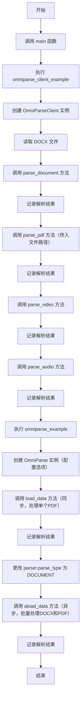
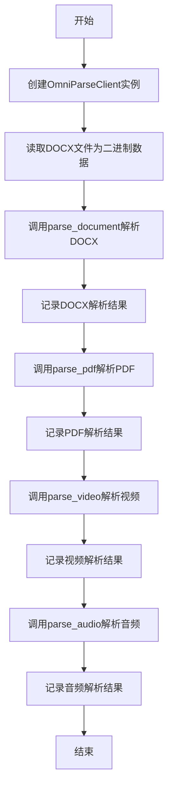
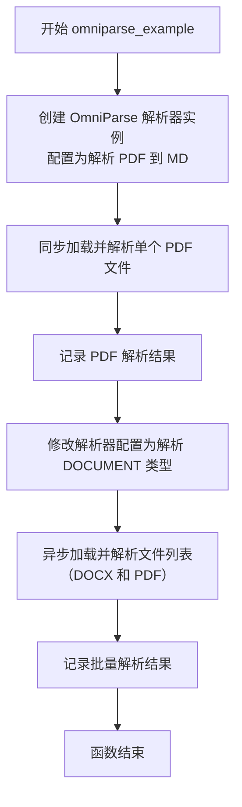
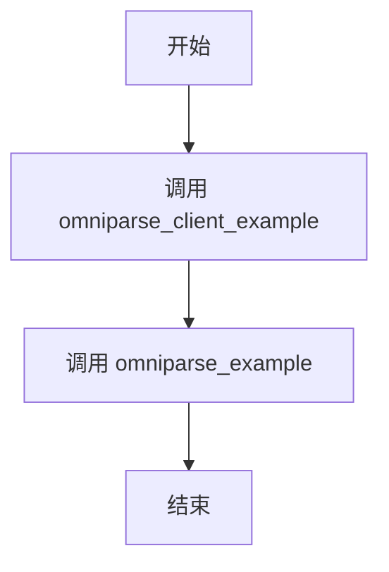
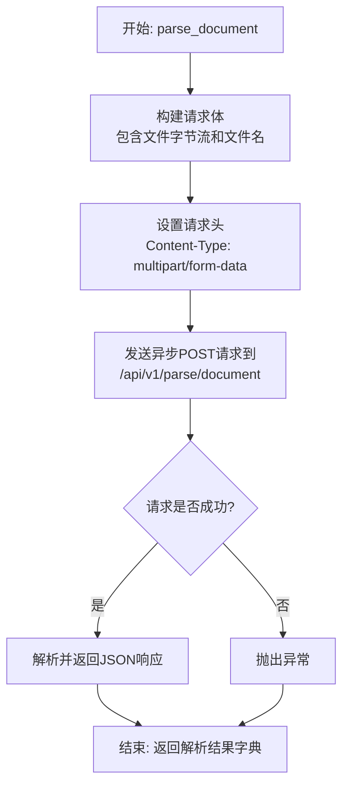
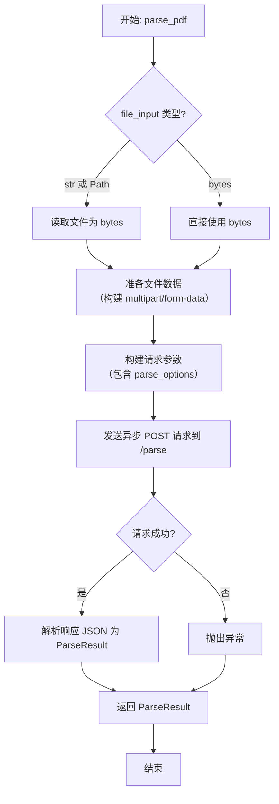
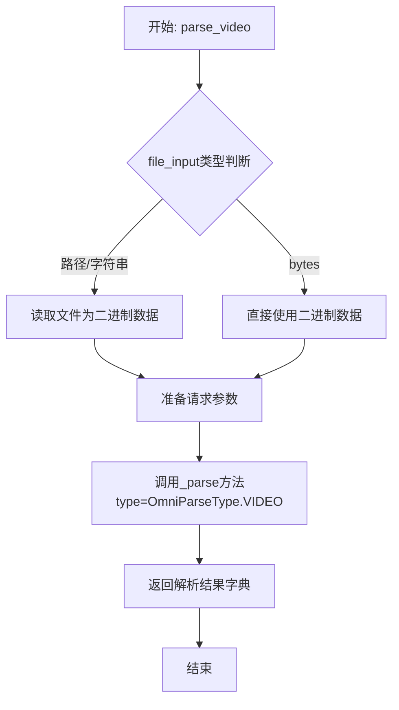
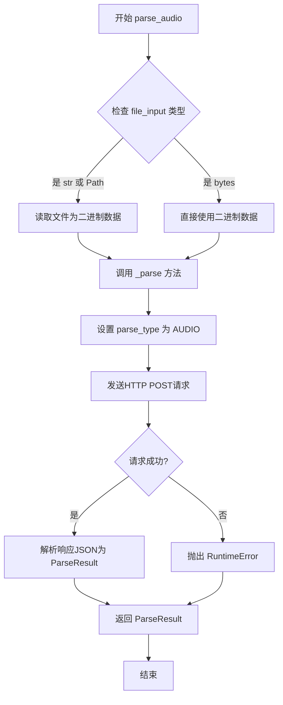

# `.\MetaGPT\examples\rag\omniparse.py` 详细设计文档

该代码是一个演示脚本，展示了如何使用 MetaGPT 框架中的 OmniParse 组件来解析多种格式的文件（如 DOCX、PDF、视频、音频），它通过两种方式实现：一是直接使用底层的 OmniParseClient 异步客户端调用特定格式的解析方法；二是使用更高级的 OmniParse 解析器类，该类支持配置解析选项并批量处理文件。

## 整体流程



## 类结构

```
OmniParseClient (异步客户端类)
├── parse_document (方法)
├── parse_pdf (方法)
├── parse_video (方法)
└── parse_audio (方法)
OmniParse (解析器类)
├── load_data (同步方法)
└── aload_data (异步方法)
```

## 全局变量及字段


### `TEST_DOCX`
    
指向示例Word文档（.docx）的路径对象，用于测试文档解析功能。

类型：`pathlib.Path`
    


### `TEST_PDF`
    
指向示例PDF文档的路径对象，用于测试PDF解析功能。

类型：`pathlib.Path`
    


### `TEST_VIDEO`
    
指向示例视频文件（.mp4）的路径对象，用于测试视频解析功能。

类型：`pathlib.Path`
    


### `TEST_AUDIO`
    
指向示例音频文件（.mp3）的路径对象，用于测试音频解析功能。

类型：`pathlib.Path`
    


### `OmniParse.parse_type`
    
指定OmniParse解析器当前要处理的文件类型（如PDF、DOCUMENT等）。

类型：`OmniParseType`
    
    

## 全局函数及方法

### `omniparse_client_example`

该函数是一个异步示例函数，用于演示如何使用 `OmniParseClient` 客户端解析不同类型的文件（如 DOCX、PDF、视频、音频）。它依次读取本地测试文件，调用相应的解析方法，并将解析结果记录到日志中。

参数：无

返回值：`None`，无返回值

#### 流程图



#### 带注释源码

```python
async def omniparse_client_example():
    # 1. 初始化OmniParseClient客户端，从全局配置中获取基础URL
    client = OmniParseClient(base_url=config.omniparse.base_url)

    # 2. 解析DOCX文档示例
    # 以二进制模式打开指定的DOCX测试文件
    with open(TEST_DOCX, "rb") as f:
        # 读取整个文件内容到内存
        file_input = f.read()
    # 调用客户端的parse_document方法异步解析文档
    # file_input: 文件的二进制数据
    # bytes_filename: 为二进制数据流指定一个文件名（可选，用于服务端识别）
    document_parse_ret = await client.parse_document(file_input=file_input, bytes_filename="test_01.docx")
    # 将解析结果记录到日志
    logger.info(document_parse_ret)

    # 3. 解析PDF文档示例
    # 直接传递PDF文件路径给parse_pdf方法（方法内部会处理文件读取）
    pdf_parse_ret = await client.parse_pdf(file_input=TEST_PDF)
    # 将解析结果记录到日志
    logger.info(pdf_parse_ret)

    # 4. 解析视频文件示例
    # 直接传递视频文件路径给parse_video方法
    video_parse_ret = await client.parse_video(file_input=TEST_VIDEO)
    # 将解析结果记录到日志
    logger.info(video_parse_ret)

    # 5. 解析音频文件示例
    # 直接传递音频文件路径给parse_audio方法
    audio_parse_ret = await client.parse_audio(file_input=TEST_AUDIO)
    # 将解析结果记录到日志
    logger.info(audio_parse_ret)
```

### `omniparse_example`

该函数是一个异步示例函数，用于演示如何使用 `OmniParse` 类来解析不同类型的文件。它首先创建一个 `OmniParse` 解析器实例，配置为解析 PDF 文件并返回 Markdown 格式的结果。然后，它同步加载并解析一个 PDF 文件。接着，它修改解析器的配置以处理文档类型（如 DOCX），并异步加载和解析一个包含 DOCX 和 PDF 文件的列表。所有解析结果都通过日志记录器输出。

参数：
- 无显式参数。该函数使用模块级常量（如 `config.omniparse.api_key`、`TEST_PDF`、`TEST_DOCX`）来配置解析器和指定文件路径。

返回值：`None`，该函数不返回任何值，其主要目的是执行操作并记录结果。

#### 流程图



#### 带注释源码

```python
async def omniparse_example():
    # 1. 创建 OmniParse 解析器实例，并进行配置。
    #    - 使用配置中的 API 密钥和基础 URL。
    #    - 设置解析选项：解析类型为 PDF，结果类型为 Markdown，超时120秒，使用3个工作线程。
    parser = OmniParse(
        api_key=config.omniparse.api_key,
        base_url=config.omniparse.base_url,
        parse_options=OmniParseOptions(
            parse_type=OmniParseType.PDF,
            result_type=ParseResultType.MD,
            max_timeout=120,
            num_workers=3,
        ),
    )
    
    # 2. 使用解析器同步加载并解析指定的 PDF 文件 (TEST_PDF)。
    #    - `load_data` 是同步方法，会阻塞直到解析完成。
    ret = parser.load_data(file_path=TEST_PDF)
    # 3. 将解析结果记录到日志中。
    logger.info(ret)

    # 4. 准备一个包含 DOCX 和 PDF 文件路径的列表。
    file_paths = [TEST_DOCX, TEST_PDF]
    # 5. 修改解析器实例的 `parse_type` 属性，将其设置为 DOCUMENT 类型，以处理文档文件（如 DOCX）。
    parser.parse_type = OmniParseType.DOCUMENT
    # 6. 使用解析器异步加载并解析文件列表。
    #    - `aload_data` 是异步方法，可以并发处理多个文件。
    ret = await parser.aload_data(file_path=file_paths)
    # 7. 将批量解析的结果记录到日志中。
    logger.info(ret)
```

### `main`

该函数是程序的异步主入口点，它依次调用两个示例函数来演示OmniParse客户端和解析器的基本用法。

参数：
- 无显式参数。

返回值：`None`，该函数不返回任何值，其主要作用是执行一系列异步操作。

#### 流程图



#### 带注释源码

```python
async def main():
    # 首先调用 omniparse_client_example 函数，演示使用 OmniParseClient 解析不同格式文件
    await omniparse_client_example()
    # 然后调用 omniparse_example 函数，演示使用 OmniParse 解析器加载和解析文件
    await omniparse_example()
```

### `OmniParseClient.parse_document`

该方法是一个异步方法，用于向 OmniParse 服务发送一个文档文件（如 .docx）进行解析，并返回解析后的结构化数据（如 Markdown 文本）。它封装了与远程 API 的交互细节，包括构建请求体、处理文件字节流和设置请求头。

参数：
- `self`：`OmniParseClient`，`OmniParseClient` 类的实例。
- `file_input`：`bytes`，要解析的文档文件的二进制内容。
- `bytes_filename`：`str`，与 `file_input` 对应的文件名，用于服务端识别文件类型。
- `parse_options`：`Optional[OmniParseOptions]`，解析选项，如指定输出格式、超时时间等。默认为 `None`，表示使用默认选项。

返回值：`Dict[str, Any]`，一个字典，包含从 OmniParse 服务返回的解析结果。通常包含解析后的文本内容、元数据等信息。

#### 流程图



#### 带注释源码

```python
async def parse_document(
    self,
    file_input: bytes,
    bytes_filename: str,
    parse_options: Optional[OmniParseOptions] = None,
) -> Dict[str, Any]:
    """
    异步解析文档文件（如 .docx）。

    Args:
        file_input: 文档文件的二进制内容。
        bytes_filename: 文件名，用于服务端识别。
        parse_options: 解析选项，控制解析行为。

    Returns:
        包含解析结果的字典。

    Raises:
        HTTPError: 如果HTTP请求失败。
    """
    # 1. 准备请求数据：将文件字节流和文件名打包为表单数据的一部分。
    files = {"file": (bytes_filename, file_input)}
    # 2. 准备请求参数：如果提供了解析选项，则将其转换为字典作为查询参数。
    params = parse_options.dict() if parse_options else {}
    # 3. 发送异步POST请求到指定的文档解析端点。
    response = await self._apost(
        url="/api/v1/parse/document", files=files, params=params
    )
    # 4. 解析响应的JSON内容并返回。
    return response.json()
```

### `OmniParseClient.parse_pdf`

该方法是一个异步方法，用于向OmniParse服务发送PDF文件进行解析，并返回解析后的结构化数据（如Markdown文本）。它封装了底层HTTP请求的细节，提供了一个简洁的接口。

参数：
- `file_input`：`Union[str, Path, bytes]`，要解析的PDF文件。可以是文件路径（字符串或Path对象），也可以是文件的二进制内容（bytes）。
- `bytes_filename`：`Optional[str]`，当`file_input`为bytes类型时，此参数用于指定文件名。如果`file_input`是文件路径，此参数将被忽略。
- `parse_options`：`Optional[OmniParseOptions]`，解析选项，用于指定解析类型、结果格式、超时时间等。如果为None，将使用默认选项（解析类型为PDF，结果类型为Markdown）。

返回值：`ParseResult`，返回一个`ParseResult`对象，其中包含了从PDF中提取出的结构化数据（如文本、表格、图片等）。

#### 流程图



#### 带注释源码

```python
    async def parse_pdf(
        self,
        file_input: Union[str, Path, bytes],
        bytes_filename: Optional[str] = None,
        parse_options: Optional[OmniParseOptions] = None,
    ) -> ParseResult:
        """
        解析PDF文件。

        Args:
            file_input: PDF文件路径或二进制内容。
            bytes_filename: 当file_input为bytes时，指定文件名。
            parse_options: 解析选项。

        Returns:
            ParseResult: 解析结果。
        """
        # 如果未提供parse_options，则创建一个默认的，指定解析类型为PDF，结果类型为Markdown。
        if parse_options is None:
            parse_options = OmniParseOptions(parse_type=OmniParseType.PDF, result_type=ParseResultType.MD)
        # 调用内部的通用解析方法，传入指定的parse_options。
        return await self._parse(file_input, bytes_filename, parse_options)
```

### `OmniParseClient.parse_video`

该方法用于解析视频文件，通过调用OmniParse服务将视频内容转换为结构化的文本信息（如Markdown格式）。它支持本地文件路径或二进制数据作为输入，并异步返回解析结果。

参数：

- `file_input`：`Union[str, Path, bytes]`，视频文件输入，可以是文件路径（字符串或Path对象）或二进制数据
- `bytes_filename`：`Optional[str]`，当file_input为二进制数据时指定的文件名（可选）
- `parse_options`：`Optional[OmniParseOptions]`，解析配置选项（可选）
- `**kwargs`：`Any`，其他传递给底层请求的参数

返回值：`Dict[str, Any]`，解析结果字典，包含视频转换后的文本内容及元数据

#### 流程图



#### 带注释源码

```python
async def parse_video(
    self,
    file_input: Union[str, Path, bytes],
    bytes_filename: Optional[str] = None,
    parse_options: Optional[OmniParseOptions] = None,
    **kwargs,
) -> Dict[str, Any]:
    """
    解析视频文件
    
    通过OmniParse服务将视频内容转换为结构化文本
    
    Args:
        file_input: 视频文件输入，可以是文件路径或二进制数据
        bytes_filename: 当file_input为二进制数据时指定的文件名
        parse_options: 解析配置选项
        **kwargs: 其他传递给底层请求的参数
    
    Returns:
        解析结果字典，包含视频转换后的文本内容
    """
    # 调用通用的_parse方法，指定解析类型为VIDEO
    return await self._parse(
        file_input=file_input,
        bytes_filename=bytes_filename,
        parse_type=OmniParseType.VIDEO,
        parse_options=parse_options,
        **kwargs,
    )
```

### `OmniParseClient.parse_audio`

该方法是一个异步方法，用于向OmniParse服务发送音频文件进行解析，并返回解析后的文本结果。它封装了HTTP请求的细节，处理文件上传和响应解析。

参数：
- `self`：`OmniParseClient`，`OmniParseClient`类的实例。
- `file_input`：`Union[str, bytes, Path]`，音频文件的输入。可以是文件路径字符串、`Path`对象或文件的二进制内容。
- `bytes_filename`：`Optional[str]`，当`file_input`为二进制数据时，指定上传的文件名。如果`file_input`是文件路径，此参数将被忽略。
- `parse_options`：`Optional[OmniParseOptions]`，解析配置选项，用于指定解析类型、结果格式等。如果为`None`，将使用默认选项。

返回值：`ParseResult`，包含解析后的文本内容、元数据等信息的结果对象。

#### 流程图



#### 带注释源码

```python
    async def parse_audio(
        self,
        file_input: Union[str, bytes, Path],
        bytes_filename: Optional[str] = None,
        parse_options: Optional[OmniParseOptions] = None,
    ) -> ParseResult:
        """
        Parse audio file.

        Args:
            file_input: audio file input, can be file path or bytes.
            bytes_filename: filename when file_input is bytes.
            parse_options: parse options.

        Returns:
            ParseResult: parsed result.
        """
        # 调用内部的通用解析方法 `_parse`，并指定解析类型为音频（OmniParseType.AUDIO）
        return await self._parse(
            file_input=file_input,
            bytes_filename=bytes_filename,
            parse_options=parse_options,
            parse_type=OmniParseType.AUDIO, # 关键参数，指明本次解析针对音频文件
        )
```

### `OmniParse.load_data`

该方法用于同步加载并解析指定文件路径的文档，根据配置的解析选项（如解析类型、结果格式等）调用底层解析服务，并返回结构化的解析结果。

参数：

- `file_path`：`Union[str, Path]`，要解析的文件的路径，可以是字符串或`Path`对象。

返回值：`List[Document]`，返回一个`Document`对象列表，每个`Document`代表解析后的一份结构化数据。

#### 流程图

```mermaid
flowchart TD
    A[开始: load_data] --> B{输入参数 file_path 类型检查}
    B -->|是 Path 对象| C[转换为字符串]
    B -->|是字符串| D[保持为字符串]
    C --> E[调用异步方法 aload_data]
    D --> E
    E --> F[在新的事件循环中运行异步任务]
    F --> G[返回解析结果 List[Document]]
    G --> H[结束]
```

#### 带注释源码

```python
def load_data(self, file_path: Union[str, Path]) -> List[Document]:
    """
    同步加载并解析文件。

    该方法是一个同步包装器，内部调用异步的 `aload_data` 方法。
    它通过创建一个新的事件循环来运行异步任务，适用于同步代码环境。

    Args:
        file_path (Union[str, Path]): 要解析的文件的路径。

    Returns:
        List[Document]: 解析后的文档列表。
    """
    # 如果 file_path 是 Path 对象，则转换为字符串
    if isinstance(file_path, Path):
        file_path = str(file_path)
    # 创建一个新的事件循环来运行异步方法
    loop = asyncio.new_event_loop()
    asyncio.set_event_loop(loop)
    try:
        # 运行异步的 aload_data 方法并获取结果
        ret = loop.run_until_complete(self.aload_data(file_path))
    finally:
        # 无论成功与否，都关闭事件循环
        loop.close()
    # 返回解析结果
    return ret
```

### `OmniParse.aload_data`

该方法是一个异步方法，用于异步加载并解析一个或多个文件。它根据实例的配置（如解析类型、结果格式等），将文件路径列表中的每个文件发送到OmniParse服务进行解析，并返回一个包含所有解析结果的列表。

参数：

- `file_path`：`Union[str, Path, List[Union[str, Path]]]`，要解析的文件路径。可以是单个文件路径（字符串或Path对象），也可以是文件路径列表。

返回值：`List[ParseResult]`，返回一个列表，其中每个元素是对应文件的解析结果（`ParseResult`对象）。

#### 流程图

```mermaid
flowchart TD
    A[开始: aload_data(file_path)] --> B{file_path是否为列表?};
    B -- 否 --> C[将单个路径转为列表];
    B -- 是 --> D[保持为列表];
    C --> D;
    D --> E[遍历文件路径列表];
    E --> F[对每个路径调用_parse_file];
    F --> G[内部: 读取文件为二进制数据];
    G --> H[根据parse_type调用对应API<br/>（如parse_document, parse_pdf等）];
    H --> I[等待API响应];
    I --> J[将响应封装为ParseResult对象];
    J --> K[收集结果];
    K --> L{是否遍历完所有文件?};
    L -- 否 --> E;
    L -- 是 --> M[返回结果列表];
    M --> N[结束];
```

#### 带注释源码

```python
async def aload_data(self, file_path: Union[str, Path, List[Union[str, Path]]]) -> List[ParseResult]:
    """
    异步加载数据。根据配置的解析类型，异步解析一个或多个文件。
    
    Args:
        file_path: 要解析的文件路径。可以是单个路径或路径列表。
    
    Returns:
        一个包含所有文件解析结果的列表。
    """
    # 1. 参数标准化：确保file_path是一个列表，便于统一处理。
    if not isinstance(file_path, list):
        file_path = [file_path]
    
    # 2. 结果收集：初始化一个空列表用于存放每个文件的解析结果。
    results = []
    
    # 3. 并发/顺序处理：遍历文件路径列表，对每个文件进行处理。
    for fp in file_path:
        # 3.1 对每个文件调用内部解析方法 `_parse_file`。
        #     `_parse_file` 方法负责读取文件二进制数据，并根据 `self.parse_type` 调用 OmniParseClient 的对应方法。
        result = await self._parse_file(fp)
        # 3.2 将单个文件的解析结果添加到总结果列表中。
        results.append(result)
    
    # 4. 返回结果：返回包含所有解析结果的列表。
    return results
```

## 关键组件


### OmniParseClient

一个用于与OmniParse服务进行异步交互的客户端类，封装了文档、PDF、视频和音频文件的解析功能。

### OmniParse

一个高级文件解析器，支持多种文件类型（如PDF、DOCX）和解析结果格式（如Markdown），提供同步和异步数据加载方法，并可配置解析选项。

### OmniParseOptions

一个配置类，用于定义解析请求的参数，包括解析类型、期望的结果格式、超时时间和工作线程数。

### OmniParseType

一个枚举类，定义了支持的解析文件类型，如DOCUMENT、PDF等。

### ParseResultType

一个枚举类，定义了支持的解析结果输出格式，如Markdown（MD）。

### 异步任务编排

代码通过`asyncio`库组织异步任务流，依次执行客户端示例和解析器示例，展示了异步文件解析的典型用法。


## 问题及建议


### 已知问题

-   **硬编码的测试文件路径**：代码中直接使用了硬编码的测试文件路径（如 `TEST_DOCX`, `TEST_PDF` 等）。这限制了代码的灵活性和可重用性，使其难以在不同环境或处理不同文件时使用。
-   **缺乏错误处理机制**：在文件读取（`open`）和异步调用（`client.parse_*`）等关键操作中，没有实现任何错误处理（如 `try...except` 块）。这可能导致程序在遇到文件不存在、网络错误或服务端异常时直接崩溃。
-   **配置依赖的强耦合**：代码严重依赖于外部配置对象 `config.omniparse` 来获取 `api_key` 和 `base_url`。如果配置未正确初始化或相关键值缺失，程序将无法运行，且错误信息可能不够清晰。
-   **示例函数职责不单一**：`omniparse_client_example` 和 `omniparse_example` 函数同时承担了演示、文件I/O和业务逻辑调用等多个职责，不符合单一职责原则，不利于代码的维护和测试。
-   **潜在的资源泄漏风险**：在 `omniparse_client_example` 函数中，使用 `with open(...) as f:` 打开了文件，但在异步操作期间，文件句柄可能被长时间持有。虽然 `with` 语句通常能确保关闭，但在复杂的异步上下文中，最佳实践是尽早读取内容并关闭文件，代码当前写法虽无大碍，但可优化以更清晰。

### 优化建议

-   **参数化文件输入**：将测试文件路径或文件内容作为参数传递给示例函数，提高代码的灵活性。例如，可以设计一个接受文件路径列表或文件对象列表的通用演示函数。
-   **增强错误处理与日志记录**：在文件操作和网络请求周围添加 `try...except` 块，捕获 `IOError`, `asyncio.TimeoutError` 以及可能的客户端自定义异常。记录详细的错误日志（包括错误类型和文件信息），而不是让程序静默失败或崩溃。
-   **实现配置验证与回退机制**：在初始化 `OmniParseClient` 或 `OmniParse` 之前，验证 `config.omniparse` 中的必要配置项。可以提供默认值或清晰的错误提示，引导用户正确配置。
-   **重构示例函数，分离关注点**：将文件读取逻辑与解析调用逻辑分离。可以创建独立的函数负责安全地读取文件字节，而示例函数专注于展示 `OmniParseClient` 和 `OmniParse` 的API用法。这会使代码更清晰，也便于单元测试。
-   **优化资源管理**：在 `omniparse_client_example` 中，考虑在 `with open` 块内立即读取文件内容到变量（`file_input = f.read()`），然后立刻退出 `with` 块释放文件资源，再进行异步调用。这明确了资源生命周期。
-   **添加类型注解与文档字符串**：为示例函数和全局变量添加更详细的类型注解和文档字符串（docstring），说明其用途、参数和返回值，这将提升代码的可读性和可维护性。
-   **考虑性能与超时设置**：示例中 `OmniParseOptions` 设置了 `max_timeout=120`，但对于大文件或慢速网络，可能不足。建议根据实际文件大小或类型动态调整超时，或在文档中给出设置建议。对于批量处理（`file_paths`），确保 `num_workers` 设置合理。


## 其它


### 设计目标与约束

本代码模块的设计目标是提供一个统一、异步的接口，用于解析多种格式（如 DOCX、PDF、视频、音频）的文件内容，并将其转换为结构化的文本数据（如 Markdown）。其核心约束包括：
1.  **异步处理**：所有文件解析操作均设计为异步，以避免阻塞主线程，提高处理I/O密集型任务的效率。
2.  **接口统一**：通过 `OmniParseClient` 和 `OmniParse` 类封装底层解析服务的调用细节，为上层应用提供简洁、一致的API。
3.  **配置驱动**：关键参数（如API密钥、服务地址）通过全局配置 (`config`) 管理，提高灵活性和可维护性。
4.  **格式支持**：设计需支持通过配置 (`OmniParseType`) 指定目标解析格式，并适应未来可能增加的格式类型。

### 错误处理与异常设计

当前代码示例中未显式展示错误处理逻辑，但在实际设计中应包含以下方面：
1.  **网络与IO异常**：`OmniParseClient` 在调用远程解析服务时，应处理网络超时、连接错误、服务不可用等异常。`OmniParse` 在读取本地文件时，应处理文件不存在、权限错误、读取失败等异常。
2.  **API响应异常**：解析服务可能返回错误状态码或非预期的数据格式，客户端应能捕获并转换这些错误为适当的异常类型（如 `OmniParseAPIError`）。
3.  **配置缺失异常**：如果必需的配置项（如 `api_key`, `base_url`）缺失，应在初始化阶段抛出清晰的异常（如 `ConfigurationError`）。
4.  **异步上下文管理**：确保在异步操作发生异常时，相关的资源（如打开的文件句柄、网络连接）能被正确清理。

### 数据流与状态机

1.  **数据流**：
    *   **输入**：本地文件路径 (`file_path`) 或文件二进制数据 (`file_input`)。
    *   **处理**：
        *   `OmniParseClient`：将输入数据通过HTTP请求发送至配置的 `base_url` 对应的解析服务端点。
        *   `OmniParse`：根据 `parse_type` 和 `parse_options` 配置，调用 `OmniParseClient` 的相应方法或使用本地解析逻辑。
    *   **输出**：解析服务返回的结构化数据，通常为 `ParseResultType`（如 `MD` 格式的字符串或更复杂的 `ParseResult` 对象），最终由 `logger` 记录。
2.  **状态机**：`OmniParse` 类本身状态简单，主要通过 `parse_type` 和 `parse_options` 字段控制解析行为。`OmniParseClient` 是无状态的，每个方法调用都是独立的。主要的“状态”体现在异步操作的执行生命周期中（Pending -> Running -> Completed/Failed）。

### 外部依赖与接口契约

1.  **外部服务依赖**：严重依赖一个名为 `OmniParse` 的外部解析服务（由 `config.omniparse.base_url` 指定）。服务的可用性、性能、解析质量直接决定本模块的功能。
2.  **接口契约**：
    *   **`OmniParseClient` 与服务端的契约**：假定服务端提供了 `/parse/document`、`/parse/pdf`、`/parse/video`、`/parse/audio` 等特定的HTTP端点，接受特定的请求格式（如multipart/form-data包含文件），并返回约定格式的JSON响应。
    *   **`OmniParse` 与 `OmniParseClient` 的契约**：`OmniParse` 依赖 `OmniParseClient` 提供 `parse_document`, `parse_pdf`, `parse_video`, `parse_audio` 等异步方法，并期望返回特定类型的结果。
    *   **与配置系统的契约**：依赖 `metagpt.config2.config` 对象提供 `omniparse.api_key` 和 `omniparse.base_url` 等配置项。
3.  **第三方库依赖**：`asyncio`（异步运行时），`metagpt` 内部的相关模块（`logs`, `rag.schema`, `utils.omniparse_client`）。`OmniParseClient` 的实现可能依赖 `aiohttp` 或 `httpx` 等异步HTTP客户端库。

### 性能考量

1.  **并发与并行**：`OmniParseOptions` 中的 `num_workers` 参数暗示了支持并行处理多个文件，这对于批量处理至关重要。`OmniParse.aload_data` 方法支持传入文件路径列表，应利用此参数实现并发请求。
2.  **超时控制**：`OmniParseOptions` 中的 `max_timeout` 参数用于控制单个解析任务的最长等待时间，防止因单个文件过大或服务异常导致长时间阻塞。
3.  **资源管理**：处理大文件时，需要注意内存使用。示例中 `open(...).read()` 会将整个文件读入内存，对于超大文件可能存在问题。应考虑流式上传或分块读取的可能性。
4.  **异步优化**：所有解析操作均为 `async` 函数，允许在等待I/O（网络响应、磁盘读取）时释放控制权，提高整体吞吐量。

### 安全考量

1.  **敏感信息**：`api_key` 是敏感信息，代码中通过配置系统获取，应确保配置系统本身的安全（如不从版本控制泄露）。
2.  **文件安全**：解析用户上传的文件存在安全风险（如恶意文件、超大文件攻击）。虽然当前示例使用固定测试文件，但在生产环境中，`OmniParse` 和 `OmniParseClient` 应对输入文件进行安全检查（如文件类型校验、大小限制、病毒扫描等），然后再发送至外部服务。
3.  **数据传输**：与外部解析服务通信时，应使用HTTPS (`base_url` 应以 `https://` 开头) 以确保传输过程中的数据安全。
4.  **依赖安全**：需要定期审计 `metagpt` 及其间接依赖的第三方库，以修复已知的安全漏洞。

    