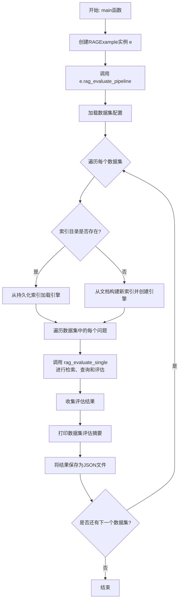
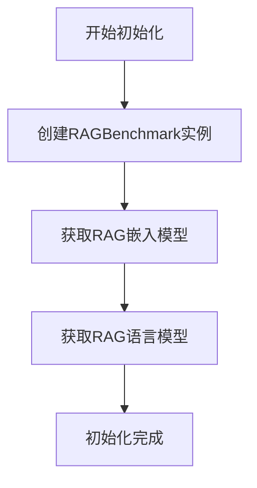
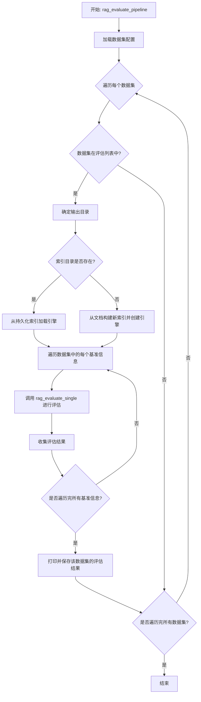
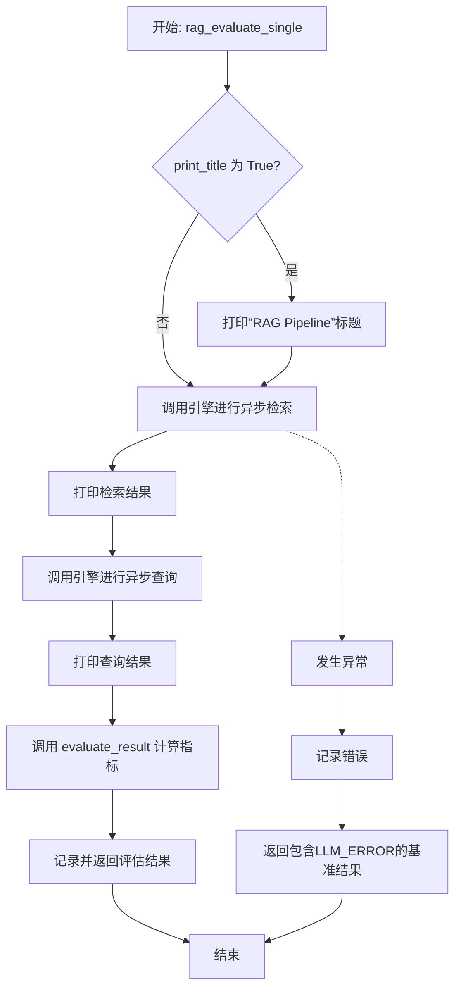
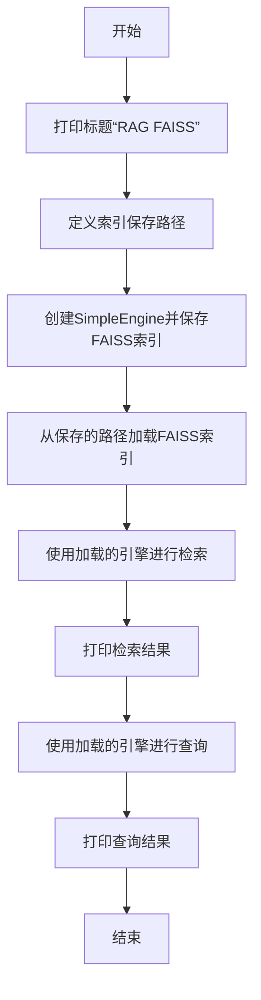
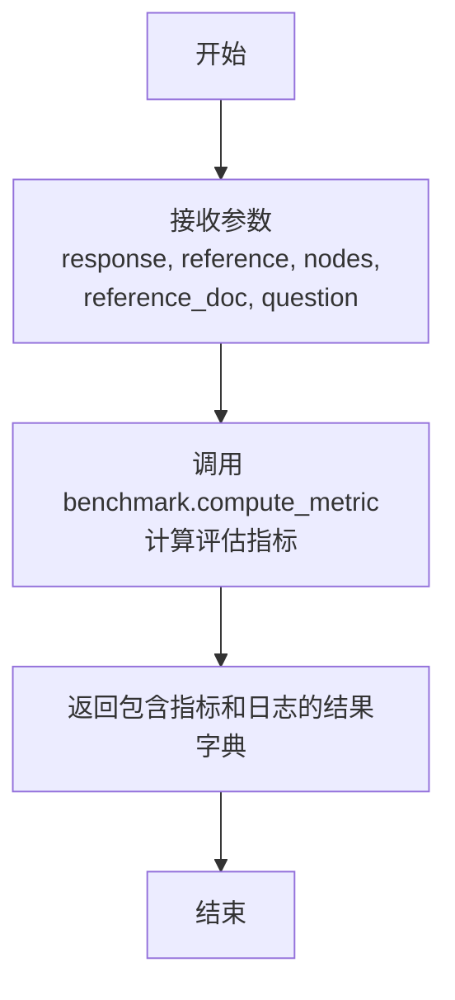
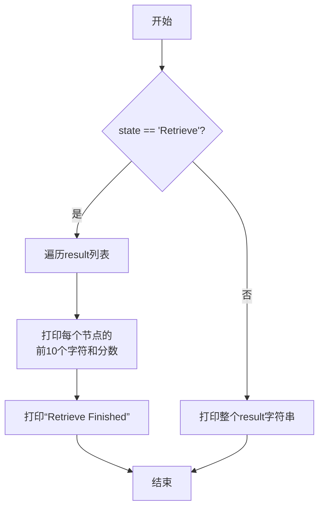
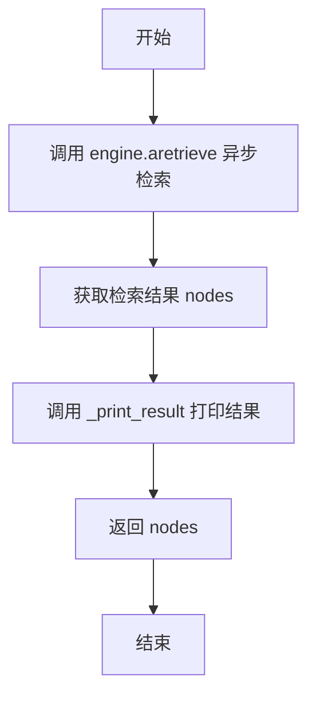

# `.\MetaGPT\examples\rag\rag_bm.py` 详细设计文档

该代码实现了一个RAG（检索增强生成）基准测试流水线，用于评估不同RAG配置（如检索器、排序器）在特定数据集上的性能。它通过加载数据集、构建或加载索引、执行检索与生成、并计算多种评估指标（如BLEU、ROUGE、语义相似度）来完成端到端的评估，同时支持结果的可视化与持久化。

## 整体流程

```mermaid
graph TD
    A[开始: main()] --> B[创建RAGExample实例]
    B --> C[调用rag_evaluate_pipeline]
    C --> D{加载数据集配置}
    D --> E[遍历数据集]
    E --> F{索引目录存在?}
    F -- 是 --> G[从持久化索引加载引擎]
    F -- 否 --> H[从文档构建新索引并创建引擎]
    G --> I[遍历数据集中的每个问题]
    H --> I
    I --> J[调用rag_evaluate_single]
    J --> K[执行检索(aretrieve)]
    K --> L[执行生成(aquery)]
    L --> M[计算评估指标(compute_metric)]
    M --> N[收集并打印结果]
    N --> O[保存结果到JSON文件]
    O --> P[结束]
```

## 类结构

```
RAGExample (RAG评估示例类)
├── 字段: benchmark, embedding, llm, engine
├── 方法: __init__, rag_evaluate_pipeline, rag_evaluate_single, rag_faissdb, evaluate_result, _print_title, _print_result, _print_bm_result, _retrieve_and_print
└── 全局函数: main
```

## 全局变量及字段


### `DOC_PATH`
    
指向示例文档 'summary_writer.txt' 的路径，用于 RAG 基准测试。

类型：`pathlib.Path`
    


### `QUESTION`
    
一个关于应急管理部通知的示例查询问题，用于测试 RAG 系统。

类型：`str`
    


### `TRAVEL_DOC_PATH`
    
指向示例文档 'documents.txt' 的路径，用于演示 FAISS 索引功能。

类型：`pathlib.Path`
    


### `TRAVEL_QUESTION`
    
一个关于国家卫生健康委“启明行动”的示例查询问题，用于测试 RAG 系统。

类型：`str`
    


### `DATASET_PATH`
    
指向基准测试数据集 'test.json' 的路径，包含用于评估的问题和答案。

类型：`pathlib.Path`
    


### `SAVE_PATH`
    
指向保存基准测试结果文件 'result.json' 的路径。

类型：`pathlib.Path`
    


### `GROUND_TRUTH_TRANVEL`
    
关于“启明行动”的完整参考文档文本，作为评估答案质量的基准。

类型：`str`
    


### `GROUND_TRUTH_ANSWER`
    
关于“启明行动”的标准答案，用于计算评估指标。

类型：`str`
    


### `LLM_TIP`
    
当大语言模型不确定答案时的提示语，用于指导模型行为。

类型：`str`
    


### `LLM_ERROR`
    
当大语言模型未遵循指令导致检索失败时，用于标记错误的常量字符串。

类型：`str`
    


### `EMPTY_ERROR`
    
当检索器未召回任何文档导致响应为空时，用于标记错误的常量字符串。

类型：`str`
    


### `RAGExample.benchmark`
    
负责加载数据集和计算 RAG 系统评估指标的核心组件。

类型：`RAGBenchmark`
    


### `RAGExample.embedding`
    
用于将文本转换为向量表示的嵌入模型，由工厂函数动态获取。

类型：`BaseEmbedding`
    


### `RAGExample.llm`
    
用于生成答案的大语言模型，由工厂函数动态获取。

类型：`LLM`
    


### `RAGExample.engine`
    
RAG 系统的执行引擎，封装了检索、重排序和查询等核心流程。

类型：`SimpleEngine`
    
    

## 全局函数及方法

### `main`

`main` 函数是 RAG 基准测试管道的异步入口点。它创建一个 `RAGExample` 实例，并调用其 `rag_evaluate_pipeline` 方法来执行完整的 RAG 评估流程，包括加载数据集、构建或加载索引、检索、生成答案以及计算评估指标。

参数：
- 无显式参数。

返回值：`None`，该函数不返回任何值。

#### 流程图



#### 带注释源码

```python
async def main():
    """RAG pipeline"""  # 函数描述：RAG基准测试管道的主入口点。
    e = RAGExample()  # 实例化RAGExample类，该类封装了RAG评估的核心逻辑。
    await e.rag_evaluate_pipeline()  # 异步调用评估管道方法，启动整个评估流程。
```

### `RAGExample.__init__`

初始化RAGExample类，创建RAG基准测试所需的核心组件，包括基准测试工具、嵌入模型和语言模型。

参数：

- 无显式参数（`self`为隐式参数）

返回值：`None`，无返回值

#### 流程图



#### 带注释源码

```python
def __init__(self):
    # 创建RAG基准测试工具实例，用于后续的评估和指标计算
    self.benchmark = RAGBenchmark()
    
    # 获取配置好的RAG嵌入模型，用于文档和查询的向量化表示
    self.embedding = get_rag_embedding()
    
    # 获取配置好的RAG语言模型，用于生成回答和重排序
    self.llm = get_rag_llm()
```

### `RAGExample.rag_evaluate_pipeline`

该方法是一个异步方法，用于执行RAG（检索增强生成）评估流水线。它根据指定的数据集名称列表，加载对应的基准测试数据集，为每个数据集构建或加载RAG引擎（包括索引、检索器和排序器），然后对数据集中的每个问题-答案对进行RAG评估。评估结果包括检索和生成的性能指标，最终结果会被汇总、打印并保存到JSON文件中。

参数：

- `dataset_name`：`list[str]`，一个字符串列表，指定要评估的数据集名称。默认值为`["all"]`，表示评估所有可用的数据集。

返回值：`None`，该方法不返回任何值，但会将评估结果写入文件并打印到日志。

#### 流程图



#### 带注释源码

```python
async def rag_evaluate_pipeline(self, dataset_name: list[str] = ["all"]):
    # 1. 加载基准测试的数据集配置
    dataset_config = self.benchmark.load_dataset(dataset_name)

    # 2. 遍历配置中的所有数据集
    for dataset in dataset_config.datasets:
        # 3. 检查当前数据集是否在指定的评估列表中（或评估“所有”数据集）
        if "all" in dataset_name or dataset.name in dataset_name:
            # 4. 为该数据集定义索引的持久化路径
            output_dir = DATA_PATH / f"{dataset.name}"

            # 5. 检查索引是否已存在，以决定是加载现有索引还是从文档新建
            if output_dir.exists():
                logger.info("Loading Existed index!")
                logger.info(f"Index Path:{output_dir}")
                # 5a. 从持久化的FAISS索引加载引擎，并配置检索器和排序器
                self.engine = SimpleEngine.from_index(
                    index_config=FAISSIndexConfig(persist_path=output_dir),
                    ranker_configs=[ColbertRerankConfig()],
                    retriever_configs=[FAISSRetrieverConfig(), BM25RetrieverConfig()],
                )
            else:
                logger.info("Loading index from documents!")
                # 5b. 从原始文档创建索引并构建引擎，配置检索器、排序器和文本分割器
                self.engine = SimpleEngine.from_docs(
                    input_files=dataset.document_files,
                    retriever_configs=[FAISSRetrieverConfig()],
                    ranker_configs=[CohereRerankConfig()],
                    transformations=[SentenceSplitter(chunk_size=1024, chunk_overlap=0)],
                )
            # 6. 初始化结果列表，用于存储当前数据集的每个问题的评估结果
            results = []
            # 7. 遍历数据集中的每个“基准信息”（包含问题、参考答案和参考文档）
            for gt_info in dataset.gt_info:
                # 8. 对单个问题-答案对执行RAG评估
                result = await self.rag_evaluate_single(
                    question=gt_info["question"],
                    reference=gt_info["gt_reference"],
                    ground_truth=gt_info["gt_answer"],
                )
                # 9. 将单个评估结果添加到列表中
                results.append(result)
            # 10. 当前数据集评估完成，打印日志
            logger.info(f"=====The {dataset.name} Benchmark dataset assessment is complete!=====")
            # 11. 打印并分析当前数据集的整体评估结果（如平均指标、错误率）
            self._print_bm_result(results)

            # 12. 将当前数据集的详细评估结果保存为JSON文件
            write_json_file((EXAMPLE_BENCHMARK_PATH / dataset.name / "bm_result.json").as_posix(), results, "utf-8")
```

### `RAGExample.rag_evaluate_single`

该方法用于执行单次RAG（检索增强生成）评估流程。它接收一个问题、参考文档和标准答案，通过RAG引擎进行检索和生成，然后使用基准测试工具评估生成结果的质量，并返回包含各项评估指标和日志的结果字典。

参数：

- `question`：`str`，需要查询的问题文本。
- `reference`：`list[str]`，用于评估检索结果的相关性（如召回率）的参考文档列表。
- `ground_truth`：`str`，问题的标准答案，用于评估生成文本的质量。
- `print_title`：`bool`，可选参数，默认为`True`，控制是否在日志中打印流程标题。

返回值：`dict`，一个包含评估指标（`metrics`）和日志（`log`）的字典。`metrics`包含如BLEU、ROUGE-L、语义相似度等分数，`log`包含生成的文本和标准答案文本。

#### 流程图



#### 带注释源码

```python
async def rag_evaluate_single(self, question, reference, ground_truth, print_title=True):
    """This example run rag pipeline, use faiss&bm25 retriever and llm ranker, will print something like:

    Retrieve Result:
    0. Productivi..., 10.0
    1. I wrote cu..., 7.0
    2. I highly r..., 5.0

    Query Result:
    Passion, adaptability, open-mindedness, creativity, discipline, and empathy are key qualities to be a good writer.

    RAG BenchMark result:
    {
    'metrics':
     {
     'bleu-avg': 0.48318624982047,
     'bleu-1': 0.5609756097560976,
     'bleu-2': 0.5,
     'bleu-3': 0.46153846153846156,
     'bleu-4': 0.42105263157894735,
     'rouge-L': 0.6865671641791045,
     'semantic similarity': 0.9487444961487591,
     'length': 74
     },
     'log': {
     'generated_text':
     '国家卫生健康委在2023年7月28日开展的“启明行动”是为了防控儿童青少年的近视问题。活动发布的指导性文件名称为《防控儿童青少年近视核心知识十条》。',
     'ground_truth_text':
     '“启明行动”是为了防控儿童青少年的近视问题，并发布了《防控儿童青少年近视核心知识十条》。'
        }
     }
    """
    # 1. 可选地打印流程标题
    if print_title:
        self._print_title("RAG Pipeline")
    try:
        # 2. 使用RAG引擎异步检索与问题相关的文档节点
        nodes = await self.engine.aretrieve(question)
        # 3. 打印检索结果（节点文本片段和相关性分数）
        self._print_result(nodes, state="Retrieve")

        # 4. 使用RAG引擎异步生成答案
        answer = await self.engine.aquery(question)
        # 5. 打印生成的答案
        self._print_result(answer, state="Query")

    except Exception as e:
        # 6. 如果检索或生成过程发生异常，记录错误并返回一个表示LLM指令遵循失败的基准结果
        logger.error(e)
        return self.benchmark.set_metrics(
            generated_text=LLM_ERROR, ground_truth_text=ground_truth, question=question
        )

    # 7. 调用内部方法评估生成结果，传入生成的答案、标准答案、检索到的节点、参考文档和原始问题
    result = await self.evaluate_result(answer.response, ground_truth, nodes, reference, question)

    # 8. 在日志中记录评估结果（用于演示）
    logger.info("==========RAG BenchMark result demo as follows==========")
    logger.info(result)

    # 9. 返回完整的评估结果字典
    return result
```

### `RAGExample.rag_faissdb`

该方法演示了如何使用FAISS向量数据库进行RAG（检索增强生成）操作，包括索引的保存、加载、检索和查询。

参数：无

返回值：`None`，该方法不返回任何值，主要用于演示和打印结果。

#### 流程图



#### 带注释源码

```python
async def rag_faissdb(self):
    """This example show how to use FAISS. how to save and load index. will print something like:

    Query Result:
    Bob likes traveling.
    """
    # 1. 打印演示标题
    self._print_title("RAG FAISS")

    # 2. 定义FAISS索引的保存路径
    output_dir = DATA_PATH / "rag_faiss"

    # 3. 从文档创建SimpleEngine，并配置FAISS检索器以保存索引到指定路径
    #    - input_files: 输入文档文件路径列表
    #    - retriever_configs: 检索器配置列表，这里配置了FAISSRetrieverConfig，指定了向量维度和持久化路径
    SimpleEngine.from_docs(
        input_files=[TRAVEL_DOC_PATH],
        retriever_configs=[FAISSRetrieverConfig(dimensions=512, persist_path=output_dir)],
    )

    # 4. 从之前保存的索引路径加载FAISS索引，创建新的SimpleEngine实例
    #    - index_config: 索引配置，这里指定了FAISS索引的持久化路径
    engine = SimpleEngine.from_index(
        index_config=FAISSIndexConfig(persist_path=output_dir),
    )

    # 5. 使用加载的引擎对预定义的问题进行检索
    #    - QUESTION: 预定义的检索问题
    nodes = engine.retrieve(QUESTION)
    # 6. 打印检索结果
    self._print_result(nodes, state="Retrieve")

    # 7. 使用加载的引擎对另一个预定义的问题进行查询（检索+生成）
    #    - TRAVEL_QUESTION: 预定义的查询问题
    answer = engine.query(TRAVEL_QUESTION)
    # 8. 打印查询结果
    self._print_result(answer, state="Query")
```

### `RAGExample.evaluate_result`

该方法用于评估RAG（检索增强生成）系统的结果，通过调用基准测试工具计算生成答案与标准答案之间的各项指标，并返回评估结果。

参数：

- `response`：`str`，RAG系统生成的答案文本。
- `reference`：`str`，用于评估的参考标准答案文本。
- `nodes`：`list[NodeWithScore]`，检索到的相关文档节点列表，包含文本和相关性分数。
- `reference_doc`：`list[str]`，用于评估的参考文档列表。
- `question`：`str`，用户提出的原始问题。

返回值：`dict`，包含评估指标和日志信息的字典，结构通常为`{'metrics': {...}, 'log': {...}}`。

#### 流程图



#### 带注释源码

```python
async def evaluate_result(
    self,
    response: str = None,          # RAG系统生成的答案
    reference: str = None,         # 标准答案，用于计算文本相似度等指标
    nodes: list[NodeWithScore] = None, # 检索到的文档节点，可能用于评估检索质量
    reference_doc: list[str] = None,   # 参考文档列表，可能用于评估检索相关性
    question: str = None,          # 原始问题，可能用于上下文评估
):
    # 调用基准测试工具的 compute_metric 方法，传入所有参数进行计算
    result = await self.benchmark.compute_metric(response, reference, nodes, reference_doc, question)

    # 返回计算结果，通常是一个包含 'metrics'（各项指标分数）和 'log'（生成文本、标准文本等）的字典
    return result
```

### `RAGExample._print_title`

这是一个静态方法，用于在日志中打印一个格式化的标题，以增强输出的可读性。它通过添加装饰性的井号(`#`)来突出显示标题。

参数：

- `title`：`str`，需要打印的标题文本。

返回值：`None`，此方法不返回任何值，仅执行打印操作。

#### 流程图

```mermaid
flowchart TD
    A[开始] --> B[接收标题参数 title]
    B --> C[构造格式化字符串<br>f'#*30 {title} #*30']
    C --> D[调用 logger.info 打印字符串]
    D --> E[结束]
```

#### 带注释源码

```python
@staticmethod
def _print_title(title):
    # 使用 logger.info 方法打印一个格式化的标题行。
    # 标题前后各有30个'#'字符，用于在日志中形成视觉分隔，增强可读性。
    logger.info(f"{'#'*30} {title} {'#'*30}")
```

### `RAGExample._print_result`

该方法用于打印检索（Retrieve）或查询（Query）的结果。根据传入的 `state` 参数，它会格式化输出检索到的节点（包含文本片段和相关性分数）或查询生成的最终答案。

参数：

- `result`：`Any`，要打印的结果。当 `state` 为 "Retrieve" 时，应为 `list[NodeWithScore]` 类型；当 `state` 为 "Query" 时，应为 `str` 类型。
- `state`：`str`，结果的状态，用于区分是“检索结果”还是“查询结果”。默认值为 "Retrieve"。

返回值：`None`，此方法不返回任何值，仅执行打印日志的操作。

#### 流程图



#### 带注释源码

```python
@staticmethod
def _print_result(result, state="Retrieve"):
    """print retrieve or query result"""
    # 打印结果标题，例如 "Retrieve Result:" 或 "Query Result:"
    logger.info(f"{state} Result:")

    # 判断是否为检索结果
    if state == "Retrieve":
        # 遍历检索到的节点列表
        for i, node in enumerate(result):
            # 打印每个节点的索引、文本前10个字符（用...省略）和相关性分数
            logger.info(f"{i}. {node.text[:10]}..., {node.score}")
        # 打印检索完成的分隔符
        logger.info("======Retrieve Finished======")
        return

    # 如果不是检索状态，则认为是查询结果，直接打印整个结果字符串
    logger.info(f"{result}\n")
```

### `RAGExample._print_bm_result`

该方法用于打印RAG基准测试（Benchmark）的汇总结果。它接收一个包含所有测试结果的列表，计算并输出各项评估指标的平均值，同时统计并报告因LLM指令遵循错误和检索器未召回任何文档导致的失败百分比。

参数：

-  `result`：`list`，包含所有单次RAG评估结果的列表。每个结果是一个字典，通常包含`metrics`和`log`等键。

返回值：`None`，该方法不返回任何值，其作用是通过日志输出统计信息。

#### 流程图

```mermaid
flowchart TD
    A[开始: _print_bm_result(result)] --> B[过滤有效结果<br>排除LLM_ERROR和EMPTY_ERROR]
    B --> C[提取所有有效结果的metrics字段]
    C --> D[使用pandas DataFrame计算指标平均值]
    D --> E[统计LLM指令遵循错误数量]
    D --> F[统计检索器空结果错误数量]
    E --> G[计算LLM错误百分比]
    F --> H[计算检索空结果百分比]
    G --> I[通过logger输出指标平均值]
    H --> I
    I --> J[通过logger输出两种错误百分比]
    J --> K[结束]
```

#### 带注释源码

```python
    @staticmethod
    def _print_bm_result(result):
        # 导入pandas库用于数据处理
        import pandas as pd

        # 1. 过滤有效结果：排除因LLM未遵循指令和检索为空导致的错误结果
        # 从结果列表中，筛选出`generated_text`字段不是`LLM_ERROR`或`EMPTY_ERROR`的项
        # 然后提取这些项的`metrics`字段，组成一个新的列表`metrics`
        metrics = [
            item["metrics"]
            for item in result
            if item["log"]["generated_text"] != LLM_ERROR and item["log"]["generated_text"] != EMPTY_ERROR
        ]

        # 2. 计算指标平均值
        # 将`metrics`列表转换为pandas DataFrame，便于进行统计计算
        # 调用`data.mean()`计算所有数值型列（即各项评估指标）的平均值
        data = pd.DataFrame(metrics)
        logger.info(f"\n {data.mean()}")

        # 3. 统计特定类型的错误
        # 统计因LLM未遵循指令（`LLM_ERROR`）而失败的结果数量
        llm_errors = [item for item in result if item["log"]["generated_text"] == LLM_ERROR]
        # 统计因检索器未召回任何文档（`EMPTY_ERROR`）而失败的结果数量
        retrieve_errors = [item for item in result if item["log"]["generated_text"] == EMPTY_ERROR]

        # 4. 计算并输出错误百分比
        # 计算LLM错误结果占总结果数的百分比
        logger.info(
            f"Percentage of retrieval failures due to incorrect LLM instruction following:"
            f" {100.0 * len(llm_errors) / len(result)}%"
        )
        # 计算检索空结果错误占总结果数的百分比
        logger.info(
            f"Percentage of retrieval failures due to retriever not recalling any documents is:"
            f" {100.0 * len(retrieve_errors) / len(result)}%"
        )
```

### `RAGExample._retrieve_and_print`

该方法用于异步检索与给定问题相关的文档节点，并打印检索结果。

参数：

- `question`：`str`，用户提出的问题或查询字符串。

返回值：`list[NodeWithScore]`，检索到的文档节点列表，每个节点包含文本内容和相关性分数。

#### 流程图



#### 带注释源码

```python
async def _retrieve_and_print(self, question):
    # 异步调用检索引擎，根据问题检索相关文档节点
    nodes = await self.engine.aretrieve(question)
    # 打印检索结果，展示每个节点的前10个字符和相关性分数
    self._print_result(nodes, state="Retrieve")
    # 返回检索到的节点列表
    return nodes
```

## 关键组件


### RAGBenchmark

用于加载数据集、计算RAG评估指标（如BLEU、ROUGE-L、语义相似度等）的基准测试组件。

### SimpleEngine

RAG流程的核心执行引擎，封装了文档索引构建、检索、重排序和查询生成等完整流程。

### 检索器 (Retriever)

负责从文档索引中检索与查询相关的文本片段，支持多种检索算法（如FAISS、BM25）。

### 重排序器 (Ranker)

对检索器返回的候选文档进行重新排序，以提高最终答案的相关性，支持多种重排序算法（如Colbert、Cohere）。

### 索引 (Index)

用于高效存储和检索文档的底层数据结构，支持持久化存储和加载。

### 评估指标计算

计算生成答案与标准答案之间的相似度指标（如BLEU、ROUGE-L、语义相似度），用于量化RAG系统的性能。


## 问题及建议


### 已知问题

-   **硬编码的配置和路径**：代码中大量使用了硬编码的路径（如 `DOC_PATH`, `SAVE_PATH`）和配置（如 `SentenceSplitter` 的参数 `chunk_size=1024`）。这使得代码难以复用和配置，限制了其灵活性和可维护性。
-   **异常处理粒度较粗**：在 `rag_evaluate_single` 方法中，整个检索和查询过程被包裹在一个大的 `try-except` 块中。一旦发生任何异常，都统一返回 `LLM_ERROR` 标记的基准测试结果。这掩盖了具体错误原因（如网络问题、索引损坏、特定配置错误等），不利于调试和问题定位。
-   **资源管理潜在风险**：`SimpleEngine.from_docs` 和 `SimpleEngine.from_index` 会创建或加载索引等可能占用大量内存或磁盘资源的对象。代码中没有显式的资源清理（如关闭、删除临时文件）逻辑，在长时间运行或批量处理时可能导致资源泄露。
-   **同步与异步方法混用**：`rag_faissdb` 方法中，在保存索引时使用了同步的 `SimpleEngine.from_docs`，而在后续的查询示例中又使用了异步的 `aretrieve` 和 `aquery`。虽然可能不影响功能，但这种不一致性降低了代码的可读性和最佳实践遵循度。同时，`_retrieve_and_print` 是一个异步方法，但未被使用，属于无效代码。
-   **数据集加载逻辑存在冗余判断**：在 `rag_evaluate_pipeline` 方法中，循环遍历 `dataset_config.datasets` 时，对 `dataset.name` 的判断 `if "all" in dataset_name or dataset.name in dataset_name:` 在 `dataset_name` 为 `["all"]` 时，`"all" in ["all"]` 为真，但 `dataset.name in ["all"]` 几乎总为假（除非某个数据集恰好叫`"all"`）。虽然功能上可能正确（因为第一个条件已满足），但逻辑上存在冗余且可能引起误解。
-   **结果打印与逻辑耦合**：`_print_result` 和 `_print_title` 等日志打印方法与核心的评估逻辑紧密耦合。这使得代码难以进行单元测试（因为测试会输出大量日志）或适配无头（headless）环境运行。

### 优化建议

-   **参数化配置**：将文件路径、模型参数（如 `chunk_size`, `chunk_overlap`）、检索器/排序器配置等提取为函数或类构造函数的参数，或通过配置文件管理。这样可以提高代码的灵活性和可配置性。
-   **细化异常处理**：将大的 `try-except` 块拆分为更细粒度的异常捕获。例如，分别处理索引加载/创建异常、检索异常、LLM调用异常等，并记录或返回更具体的错误信息，便于问题诊断。
-   **实现上下文管理或显式清理**：对于 `SimpleEngine` 或底层的索引对象，考虑使用上下文管理器（`with` 语句）或在评估任务完成后显式调用清理方法，确保资源（如文件句柄、内存映射）被正确释放。
-   **统一异步/同步调用风格**：根据项目整体风格，统一使用异步或同步接口。如果主要逻辑是异步的（如 `main` 函数使用 `asyncio.run`），则应将 `rag_faissdb` 中的同步调用改为异步版本（如 `from_docs` 可能也有异步版本），并移除未使用的 `_retrieve_and_print` 方法。
-   **简化数据集过滤逻辑**：优化 `rag_evaluate_pipeline` 中的数据集过滤条件，使其逻辑更清晰。例如，可以先将 `"all"` 特殊处理，然后直接按名称过滤。
-   **分离关注点**：将日志打印、结果展示等非核心逻辑与核心的评估计算逻辑解耦。可以考虑引入一个专门的 `Reporter` 或 `Logger` 类来处理输出，或者通过设置日志级别来控制输出内容，使核心逻辑更纯净，易于测试。
-   **增强类型提示**：为所有函数和方法添加更完整的类型提示，特别是对于返回复杂数据结构（如 `evaluate_result` 返回的字典）的方法，可以定义 `TypedDict` 或 `Pydantic` 模型来描述其结构，提高代码的清晰度和工具支持（如IDE自动补全、静态类型检查）。
-   **添加单元测试**：为 `RAGExample` 类中的关键方法（如 `rag_evaluate_single`, `evaluate_result`）编写单元测试，模拟不同的输入（正常、异常、边界情况），以确保代码的健壮性和重构时的安全性。


## 其它


### 设计目标与约束

本代码模块的核心设计目标是构建一个用于评估RAG（检索增强生成）系统性能的基准测试流水线。其主要约束包括：1) 支持多种检索器（如FAISS、BM25）和重排序器（如Colbert、Cohere）的灵活配置与组合；2) 能够加载预设的基准测试数据集或从文档构建索引；3) 对RAG系统的检索和生成结果进行多维度自动化评估（如BLEU、ROUGE、语义相似度）；4) 提供清晰的日志输出和结果统计，便于分析系统性能瓶颈（如LLM指令遵循失败率、空检索率）。代码被设计为示例和评估工具，因此对易用性和结果可解释性有较高要求，而对极端情况下的高性能和资源消耗优化并非首要目标。

### 错误处理与异常设计

代码中的错误处理主要围绕RAG流程中的关键失败点进行设计：
1.  **流程级异常捕获**：在`rag_evaluate_single`方法中，使用`try-except`块包裹`aretrieve`和`aquery`调用。当这些核心操作因网络、模型或内部逻辑错误抛出`Exception`时，会被捕获并记录错误日志。随后，方法会返回一个标记为`LLM_ERROR`的基准测试结果，从而将流程失败转化为可度量的错误指标，保证评估流水线不会因单点故障而完全中断。
2.  **业务逻辑错误标识**：定义了`LLM_ERROR`（LLM未遵循指令）和`EMPTY_ERROR`（检索器未召回任何文档）等字符串常量，用于在结果中明确标识特定类型的失败。这有助于在后续的`_print_bm_result`统计中，精确分析不同错误原因导致的失败比例。
3.  **静默处理与日志记录**：对于非关键路径的异常（如文件加载），代码依赖`llama_index`等底层库的异常抛出，并通过`logger.error`进行记录，但不会中断主流程。这种设计权衡了健壮性与开发调试的便利性。

### 数据流与状态机

本模块的数据流遵循典型的RAG评估流水线，可抽象为以下状态转换：
1.  **初始化状态**：`RAGExample`类被实例化，加载基准测试工具`RAGBenchmark`、嵌入模型和LLM。
2.  **配置加载状态**：调用`rag_evaluate_pipeline`，根据输入的`dataset_name`列表，加载对应的数据集配置（包含文档路径、问题、标准答案和参考文档）。
3.  **索引构建/加载状态**：对于每个数据集，检查是否存在已持久化的索引（FAISS）。如果存在，则直接加载索引进入“就绪状态”；如果不存在，则从原始文档通过`SentenceSplitter`进行分块、嵌入并构建索引，然后进入“就绪状态”。此状态决定了后续检索的源。
4.  **评估执行状态**：对于数据集中的每个问题-答案对，顺序执行以下子状态：
    a.  **检索状态**：使用配置的检索器（FAISS, BM25）从索引中召回相关文档节点(`NodeWithScore`)。
    b.  **生成状态**：将问题和检索到的上下文提供给LLM，生成答案。
    c.  **评估状态**：调用`benchmark.compute_metric`，将生成的答案与标准答案(`ground_truth`)、参考文档(`reference`)进行对比，计算一系列评估指标。
    d.  **结果记录状态**：将每次评估的结果（指标和日志）追加到结果列表中。
5.  **聚合与报告状态**：一个数据集的所有问题评估完成后，进入此状态。调用`_print_bm_result`方法，计算所有成功评估结果（排除`LLM_ERROR`和`EMPTY_ERROR`）的指标平均值，并统计两类错误的发生百分比。
6.  **持久化状态**：将整个结果列表保存为JSON文件。

整个流程是线性的，没有复杂的循环或条件分支构成的状态机，主要状态由数据（索引是否存在）和任务（评估单个问题）驱动转换。

### 外部依赖与接口契约

1.  **LlamaIndex (`llama_index.core`)**:
    *   **契约**：提供核心的RAG抽象，包括`SentenceSplitter`（文本分块）、`NodeWithScore`（检索结果节点）、以及`SimpleEngine`（RAG引擎）的`from_docs`和`from_index`工厂方法。
    *   **用途**：用于文档处理、索引管理、检索和查询的底层实现。代码依赖于其定义的schema和API稳定性。

2.  **MetaGPT内部组件 (`metagpt.rag.*`, `metagpt.utils`, `metagpt.logs`)**:
    *   `RAGBenchmark`: 契约是提供`load_dataset`和`compute_metric`方法，分别用于加载基准测试配置和计算评估指标。
    *   `SimpleEngine`: 契约是提供`aretrieve`和`aquery`异步方法，执行检索和生成。
    *   `get_rag_embedding` / `get_rag_llm`: 契约是返回配置好的嵌入模型和LLM实例。
    *   `write_json_file`: 契约是提供将数据写入JSON文件的工具函数。
    *   `logger`: 契约是提供标准化的日志记录接口。

3.  **向量数据库/检索库 (通过LlamaIndex配置间接依赖)**:
    *   **FAISS**: 用于稠密向量检索。契约通过`FAISSRetrieverConfig`和`FAISSIndexConfig`进行配置，指定维度、持久化路径等。
    *   **BM25 (likely via `rank_bm25`)**: 用于稀疏词频检索。契约通过`BM25RetrieverConfig`配置。

4.  **重排序模型 (通过LlamaIndex配置间接依赖)**:
    *   **ColbertRerank**: 契约通过`ColbertRerankConfig`配置。
    *   **CohereRerank**: 契约通过`CohereRerankConfig`配置，可能依赖外部Cohere API。

5.  **评估指标库 (通过`RAGBenchmark.compute_metric`间接依赖)**:
    *   可能内部使用了如`nltk` (BLEU)、`rouge-score` (ROUGE)、`sentence-transformers` (语义相似度)等库来计算指标。

6.  **异步与系统**:
    *   `asyncio`: 提供异步运行时，用于执行`aretrieve`、`aquery`等异步操作。

代码通过配置对象（`*Config`）和工厂模式（`from_docs`, `from_index`, `get_rag_*`）来管理与这些外部依赖的接口，提高了模块化和可测试性。

    