# `.\MetaGPT\examples\rag\rag_pipeline.py` 详细设计文档

该代码是一个RAG（检索增强生成）管道的示例程序，用于演示如何使用MetaGPT框架中的RAG引擎。它通过多个示例展示了RAG的核心功能：从文档或对象中检索相关信息，并使用大语言模型生成答案。示例包括运行基础RAG管道、动态添加文档和对象、以及使用不同的向量数据库（如ChromaDB和Elasticsearch）进行索引的保存、加载和查询。

## 整体流程

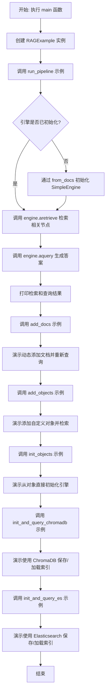

## 类结构

```
BaseModel (Pydantic)
└── Player (数据模型，用于演示)

RAGExample (主示例类)
├── __init__ (构造函数)
├── engine (属性，惰性初始化引擎)
├── run_pipeline (运行基础RAG管道)
├── add_docs (演示添加文档)
├── add_objects (演示添加对象)
├── init_objects (演示从对象初始化引擎)
├── init_and_query_chromadb (演示ChromaDB集成)
├── init_and_query_es (演示Elasticsearch集成)
├── _print_title (静态方法，打印标题)
├── _print_retrieve_result (静态方法，打印检索结果)
├── _print_query_result (静态方法，打印查询结果)
└── _retrieve_and_print (内部方法，检索并打印)
```

## 全局变量及字段


### `LLM_TIP`
    
一个提示字符串，当LLM不确定答案时，指导其回答“我不知道”。

类型：`str`
    


### `DOC_PATH`
    
指向示例文档“rag/writer.txt”的路径，用于演示RAG管道的初始文档。

类型：`pathlib.Path`
    


### `QUESTION`
    
一个关于“成为优秀作家的关键品质”的示例问题，用于演示RAG管道的查询。

类型：`str`
    


### `TRAVEL_DOC_PATH`
    
指向示例文档“rag/travel.txt”的路径，用于演示向RAG引擎添加新文档。

类型：`pathlib.Path`
    


### `TRAVEL_QUESTION`
    
一个关于“Bob喜欢什么”的示例问题，用于演示添加新文档后的查询。

类型：`str`
    


### `Player.name`
    
玩家的名字，用于标识Player对象。

类型：`str`
    


### `Player.goal`
    
玩家的目标，在RAG上下文中，此字段被用作检索键（rag_key）。

类型：`str`
    


### `Player.tool`
    
玩家使用的工具，是Player对象的附加属性。

类型：`str`
    


### `RAGExample._engine`
    
RAGExample类内部使用的RAG引擎实例，通过属性（engine）进行惰性初始化或外部设置。

类型：`SimpleEngine | None`
    


### `RAGExample._use_llm_ranker`
    
一个布尔标志，指示在初始化默认引擎时是否使用LLM重排序器（LLMRanker）来优化检索结果。

类型：`bool`
    
    

## 全局函数及方法

### `main`

`main` 函数是 RAG 示例程序的异步入口点。它创建了一个 `RAGExample` 实例，并依次调用其多个异步方法，以演示 RAG 管道的不同功能，包括运行基础查询、添加文档、添加对象、从对象初始化引擎以及使用 ChromaDB 和 Elasticsearch 进行索引和查询。

参数：
- 无显式参数。

返回值：`None`，该函数不返回任何值，其主要作用是通过日志输出展示 RAG 管道的运行结果。

#### 流程图

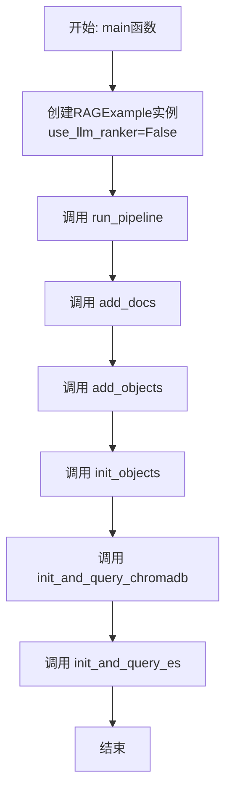

#### 带注释源码

```python
async def main():
    """RAG pipeline.

    Note:
    1. If `use_llm_ranker` is True, then it will use LLM Reranker to get better result, but it is not always guaranteed that the output will be parseable for reranking,
       prefer `gpt-4-turbo`, otherwise might encounter `IndexError: list index out of range` or `ValueError: invalid literal for int() with base 10`.
    """
    # 1. 创建 RAGExample 实例，并禁用 LLM 重排序器以简化演示
    e = RAGExample(use_llm_ranker=False)

    # 2. 运行基础的 RAG 管道，展示从文档中检索和生成答案的过程
    await e.run_pipeline()
    # 3. 演示如何向现有引擎动态添加新文档，并再次查询
    await e.add_docs()
    # 4. 演示如何向引擎添加自定义对象（如 Player 实例）并进行检索
    await e.add_objects()
    # 5. 演示如何直接从对象集合初始化一个新的 RAG 引擎
    await e.init_objects()
    # 6. 演示使用 ChromaDB 作为向量存储，进行索引的持久化和加载查询
    await e.init_and_query_chromadb()
    # 7. 演示使用 Elasticsearch 作为向量存储，进行索引的创建、加载和查询
    await e.init_and_query_es()
```

### `Player.rag_key`

该方法用于为 `Player` 对象生成一个用于检索（RAG）的键值。它返回 `Player` 实例的 `goal` 字段，该字段描述了玩家的目标，并作为其文档在向量数据库中的索引键。

参数：
- `self`：`Player`，`Player` 类的实例。

返回值：`str`，返回该 `Player` 实例的 `goal` 字段值，作为其唯一的检索标识符。

#### 流程图

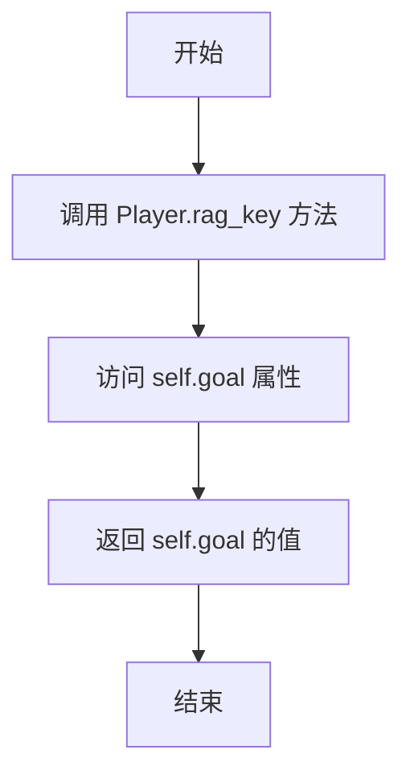

#### 带注释源码

```python
def rag_key(self) -> str:
    """For search"""  # 方法描述：用于检索的键值生成方法。
    return self.goal   # 返回当前 Player 实例的 goal 属性值。
```

### `RAGExample.__init__`

该方法用于初始化`RAGExample`类的实例，设置RAG引擎和是否使用LLM排序器的配置。

参数：

- `engine`：`SimpleEngine`，可选的RAG引擎实例。如果为`None`，将在首次访问`engine`属性时延迟创建。
- `use_llm_ranker`：`bool`，指示是否在RAG引擎中使用LLM排序器。默认为`True`。

返回值：`None`，构造函数不返回任何值。

#### 流程图

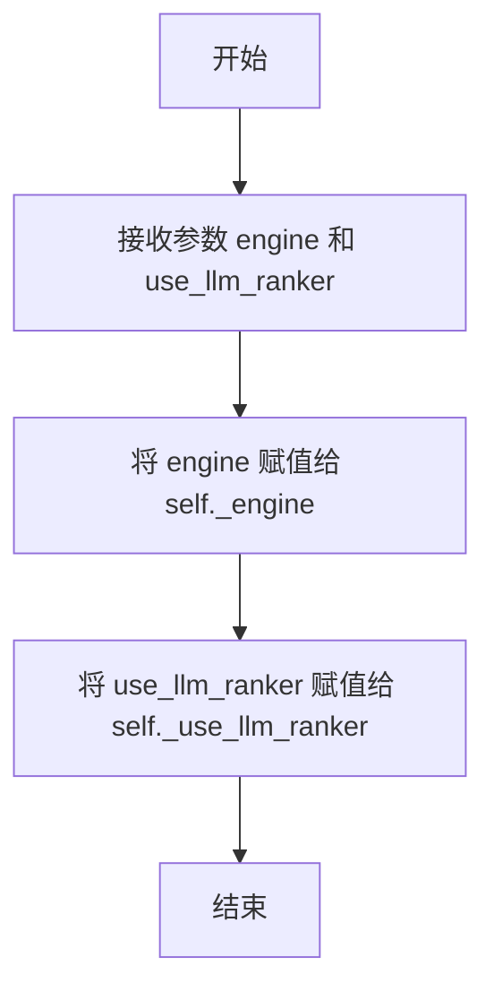

#### 带注释源码

```python
def __init__(self, engine: SimpleEngine = None, use_llm_ranker: bool = True):
    # 初始化RAGExample实例
    # 参数engine: 可选的SimpleEngine实例，用于执行RAG操作
    # 参数use_llm_ranker: 布尔值，决定是否在RAG流程中使用LLM排序器
    self._engine = engine  # 存储传入的引擎实例，若为None则延迟初始化
    self._use_llm_ranker = use_llm_ranker  # 存储是否使用LLM排序器的配置
```

### `RAGExample.engine` (getter)

这是一个属性获取器（getter），用于实现`RAGExample`类的`engine`属性的延迟初始化。当`_engine`实例变量为`None`时，它会根据类的配置（是否使用LLM排序器）创建一个新的`SimpleEngine`实例。这确保了`engine`属性在被首次访问时才会被创建，实现了惰性加载模式。

参数：
-  `self`：`RAGExample`，`RAGExample`类的实例。

返回值：`SimpleEngine`，返回已初始化的`SimpleEngine`引擎实例。如果实例不存在，则创建并返回一个新的。

#### 流程图

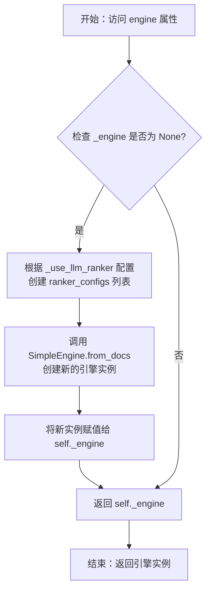

#### 带注释源码

```python
@property
def engine(self):
    # 检查私有变量 _engine 是否已被初始化
    if not self._engine:
        # 根据 use_llm_ranker 标志决定是否创建 LLM 排序器配置
        # 如果为 True，则创建一个包含 LLMRankerConfig 的列表
        # 如果为 False，则 ranker_configs 为 None
        ranker_configs = [LLMRankerConfig()] if self._use_llm_ranker else None

        # 调用 SimpleEngine 的类方法 from_docs 来创建一个新的引擎实例
        # 传入默认文档路径、FAISS检索器配置和可选的排序器配置
        self._engine = SimpleEngine.from_docs(
            input_files=[DOC_PATH],
            retriever_configs=[FAISSRetrieverConfig()],
            ranker_configs=ranker_configs,
        )
    # 返回已初始化的引擎实例（无论是新创建的还是已有的）
    return self._engine
```

### `RAGExample.engine (setter)`

这是一个属性设置器（setter）方法，用于设置 `RAGExample` 类的 `_engine` 私有实例变量。它允许外部代码以属性赋值的方式（例如 `obj.engine = new_engine`）来替换或设置 `RAGExample` 实例所使用的 RAG 引擎。

参数：

- `value`：`SimpleEngine`，要设置的新 RAG 引擎实例。

返回值：`None`，此方法不返回任何值。

#### 流程图

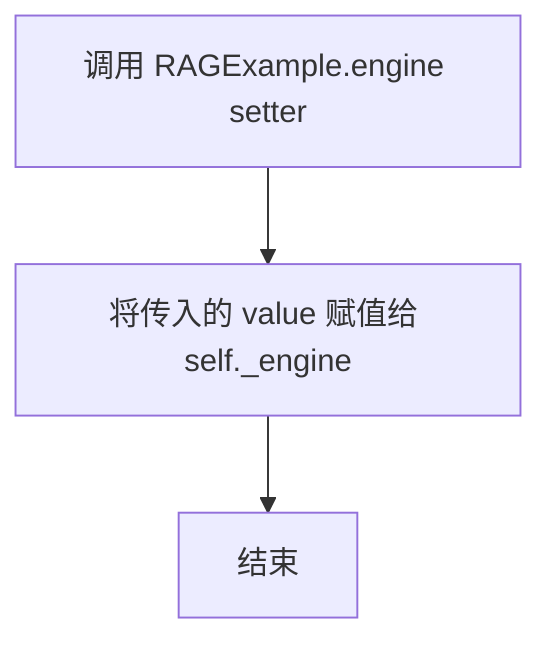

#### 带注释源码

```python
    @engine.setter
    def engine(self, value: SimpleEngine):
        # 将传入的 SimpleEngine 实例赋值给私有变量 _engine
        self._engine = value
```

### `RAGExample.run_pipeline`

该方法运行RAG（检索增强生成）管道的核心流程。它首先通过检索器获取与问题相关的文档片段（节点），然后使用LLM（大语言模型）基于这些检索到的上下文生成最终答案。整个过程包含检索和查询两个主要步骤，并会打印出检索结果和生成的答案。

参数：

- `question`：`str`，可选参数，默认值为全局变量`QUESTION`。表示要查询的问题文本。
- `print_title`：`bool`，可选参数，默认值为`True`。控制是否在运行前打印一个格式化的标题。

返回值：`None`，该方法不返回任何值，其主要功能是执行并打印结果。

#### 流程图

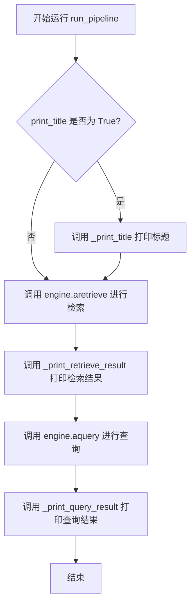

#### 带注释源码

```python
@handle_exception  # 装饰器：统一处理该方法中可能抛出的异常
async def run_pipeline(self, question=QUESTION, print_title=True):
    """This example run rag pipeline, use faiss retriever and llm ranker, will print something like:

    Retrieve Result:
    0. Productivi..., 10.0
    1. I wrote cu..., 7.0
    2. I highly r..., 5.0

    Query Result:
    Passion, adaptability, open-mindedness, creativity, discipline, and empathy are key qualities to be a good writer.
    """
    # 步骤1：如果需要，打印运行标题
    if print_title:
        self._print_title("Run Pipeline")

    # 步骤2：异步检索与问题相关的文档节点
    nodes = await self.engine.aretrieve(question)
    # 步骤3：打印检索到的节点信息（如前10个字符和相关性分数）
    self._print_retrieve_result(nodes)

    # 步骤4：异步查询，基于检索到的上下文生成最终答案
    answer = await self.engine.aquery(question)
    # 步骤5：打印LLM生成的最终答案
    self._print_query_result(answer)
```

### `RAGExample.add_docs`

该方法演示了如何向RAG（检索增强生成）引擎动态添加文档。它首先使用一个不包含相关文档的引擎进行查询，得到“我不知道”或空响应；然后向引擎添加包含答案的文档，再次查询，引擎便能检索到新添加的文档并给出正确答案。

参数：
-  `self`：`RAGExample`，`RAGExample`类的实例。

返回值：`None`，该方法不返回任何值。

#### 流程图

```mermaid
flowchart TD
    A[开始 add_docs] --> B[打印标题 “Add Docs”]
    B --> C[定义旅行相关的问题和文档路径]
    C --> D[打印日志 “[Before add docs]”]
    D --> E[调用 run_pipeline<br>使用未添加文档的引擎进行查询]
    E --> F[打印日志 “[After add docs]”]
    F --> G[调用 engine.add_docs<br>向引擎添加旅行文档]
    G --> H[再次调用 run_pipeline<br>使用已更新文档的引擎进行查询]
    H --> I[结束]
```

#### 带注释源码

```python
    @handle_exception  # 装饰器：统一处理该方法可能抛出的异常
    async def add_docs(self):
        """This example show how to add docs.

        Before add docs llm anwser I don't know.
        After add docs llm give the correct answer, will print something like:

        [Before add docs]
        Retrieve Result:

        Query Result:
        Empty Response

        [After add docs]
        Retrieve Result:
        0. Bob like..., 10.0

        Query Result:
        Bob likes traveling.
        """
        self._print_title("Add Docs")  # 打印示例的标题，用于日志分隔和说明

        travel_question = f"{TRAVEL_QUESTION}"  # 获取预定义的旅行相关问题
        travel_filepath = TRAVEL_DOC_PATH  # 获取预定义的旅行相关文档路径

        logger.info("[Before add docs]")  # 打印日志，标记“添加文档前”的阶段
        # 调用 run_pipeline 方法，使用当前（尚未添加旅行文档）的引擎进行查询和回答
        # `print_title=False` 避免在内部重复打印标题
        await self.run_pipeline(question=travel_question, print_title=False)

        logger.info("[After add docs]")  # 打印日志，标记“添加文档后”的阶段
        # 核心操作：调用引擎的 add_docs 方法，将旅行文档添加到引擎的知识库中
        self.engine.add_docs([travel_filepath])
        # 再次调用 run_pipeline 方法，此时引擎已包含新文档，应能正确回答问题
        await self.run_pipeline(question=travel_question, print_title=False)
```

### `RAGExample.add_objects`

该方法演示了如何向RAG引擎中添加自定义对象（而非文档文件）。它首先使用一个`Player`对象进行查询，此时引擎无法检索到相关信息。然后，它将`Player`对象添加到引擎中，再次进行相同的查询，此时引擎能够成功检索到该对象，并打印出对象的详细信息。

参数：

- `self`：`RAGExample`，`RAGExample`类的实例。
- `print_title`：`bool`，可选参数，默认为`True`。控制是否在方法开始时打印一个标题分隔符。

返回值：`None`，该方法不返回任何值。

#### 流程图

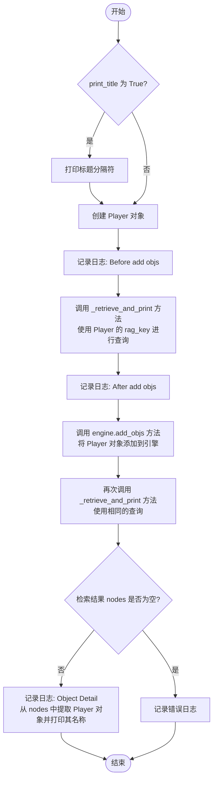

#### 带注释源码

```python
    @handle_exception  # 装饰器：统一处理该方法中可能抛出的异常
    async def add_objects(self, print_title=True):
        """This example show how to add objects.

        Before add docs, engine retrieve nothing.
        After add objects, engine give the correct answer, will print something like:

        [Before add objs]
        Retrieve Result:

        [After add objs]
        Retrieve Result:
        0. 100m Sprin..., 10.0

        [Object Detail]
        {'name': 'Mike', 'goal': 'Win The 100-meter Sprint', 'tool': 'Red Bull Energy Drink'}
        """
        if print_title:  # 根据参数决定是否打印标题
            self._print_title("Add Objects")

        player = Player(name="Mike")  # 创建一个 Player 对象实例
        question = f"{player.rag_key()}"  # 使用 Player 对象的 rag_key 方法生成查询问题

        logger.info("[Before add objs]")  # 记录添加对象前的日志
        await self._retrieve_and_print(question)  # 在添加对象前，尝试检索并打印结果（预期为空）

        logger.info("[After add objs]")  # 记录添加对象后的日志
        self.engine.add_objs([player])  # 核心步骤：将 Player 对象添加到 RAG 引擎的索引中

        try:
            nodes = await self._retrieve_and_print(question)  # 再次使用相同问题检索，预期能检索到刚添加的对象

            logger.info("[Object Detail]")  # 记录对象详情日志
            player: Player = nodes[0].metadata["obj"]  # 从检索结果中提取并反序列化出 Player 对象
            logger.info(player.name)  # 打印 Player 对象的名称
        except Exception as e:
            # 异常处理：如果检索结果为空或处理出错，记录错误信息
            logger.error(f"nodes is empty, llm don't answer correctly, exception: {e}")
```

### `RAGExample.init_objects`

此方法演示了如何通过 `SimpleEngine.from_objs` 方法，从一个对象列表（而非文档文件）初始化一个 RAG 引擎。它首先保存当前的引擎实例，然后创建一个基于对象的新引擎，接着调用 `add_objects` 方法来展示向这个新引擎添加和检索对象的过程，最后恢复原来的引擎实例。

参数：
- `self`：`RAGExample`，`RAGExample` 类的实例。

返回值：`None`，此方法不返回任何值。

#### 流程图

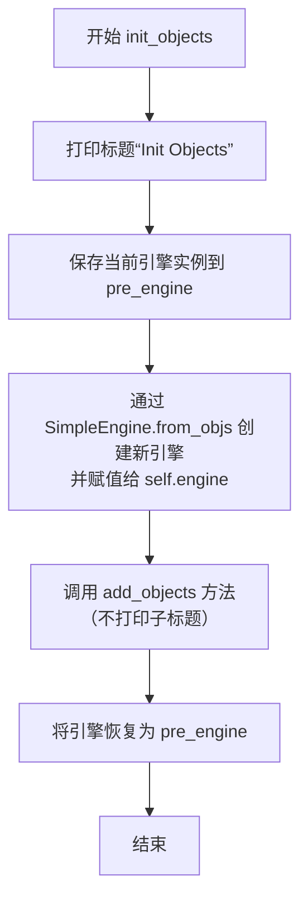

#### 带注释源码

```python
@handle_exception
async def init_objects(self):
    """This example show how to from objs, will print something like:

    Same as add_objects.
    """
    # 1. 打印方法执行标题
    self._print_title("Init Objects")

    # 2. 保存当前的引擎实例，以便后续恢复
    pre_engine = self.engine

    # 3. 核心步骤：通过 `SimpleEngine.from_objs` 方法，传入检索器配置，创建一个新的 RAG 引擎。
    #    这个新引擎初始时没有文档或对象，专门用于演示从对象初始化。
    self.engine = SimpleEngine.from_objs(retriever_configs=[FAISSRetrieverConfig()])

    # 4. 调用 `add_objects` 方法，向这个新创建的、空白的引擎中添加一个 Player 对象并进行检索。
    #    `print_title=False` 参数避免在 `add_objects` 内部重复打印标题。
    await self.add_objects(print_title=False)

    # 5. 恢复原来的引擎实例，确保 `RAGExample` 对象的状态不受此演示方法的影响。
    self.engine = pre_engine
```

### `RAGExample.init_and_query_chromadb`

该方法演示了如何使用 ChromaDB 向量数据库构建 RAG 流水线。它首先基于文档创建并持久化一个 ChromaDB 索引，然后从持久化的索引加载引擎，最后执行查询以验证功能。

参数：
- `self`：`RAGExample`，`RAGExample` 类的实例。

返回值：`None`，该方法不返回任何值，其主要功能是执行并打印查询结果。

#### 流程图

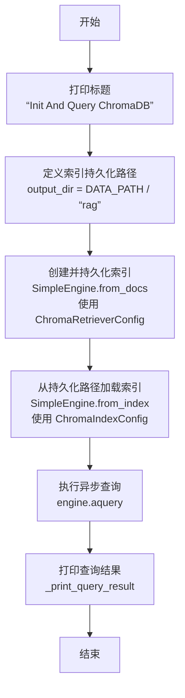

#### 带注释源码

```python
@handle_exception  # 装饰器：统一处理该方法中可能抛出的异常
async def init_and_query_chromadb(self):
    """This example show how to use chromadb. how to save and load index. will print something like:

    Query Result:
    Bob likes traveling.
    """
    self._print_title("Init And Query ChromaDB")  # 步骤1：打印方法执行标题

    # 1. save index
    # 步骤2：定义 ChromaDB 索引的持久化存储路径
    output_dir = DATA_PATH / "rag"
    # 步骤3：从指定文档创建 SimpleEngine，并配置使用 ChromaDB 检索器，将索引持久化到指定路径
    SimpleEngine.from_docs(
        input_files=[TRAVEL_DOC_PATH],  # 输入文件：包含旅行相关内容的文档
        retriever_configs=[ChromaRetrieverConfig(persist_path=output_dir)],  # 检索器配置：指定 ChromaDB 及其持久化路径
    )

    # 2. load index
    # 步骤4：从之前持久化的 ChromaDB 索引路径加载，创建一个新的 SimpleEngine 实例
    engine = SimpleEngine.from_index(index_config=ChromaIndexConfig(persist_path=output_dir))

    # 3. query
    # 步骤5：使用加载的引擎，对预定义的旅行相关问题进行异步查询
    answer = await engine.aquery(TRAVEL_QUESTION)
    # 步骤6：格式化并打印查询得到的答案
    self._print_query_result(answer)
```

### `RAGExample.init_and_query_es`

该方法演示了如何初始化一个使用 Elasticsearch 作为向量存储的 RAG（检索增强生成）引擎，并向其发起查询。它首先创建一个 Elasticsearch 索引并存储文档，然后加载该索引，最后执行查询并打印结果。

参数：
-  `self`：`RAGExample`，`RAGExample` 类的实例。

返回值：`None`，该方法不返回任何值，其主要功能是执行并打印查询结果。

#### 流程图

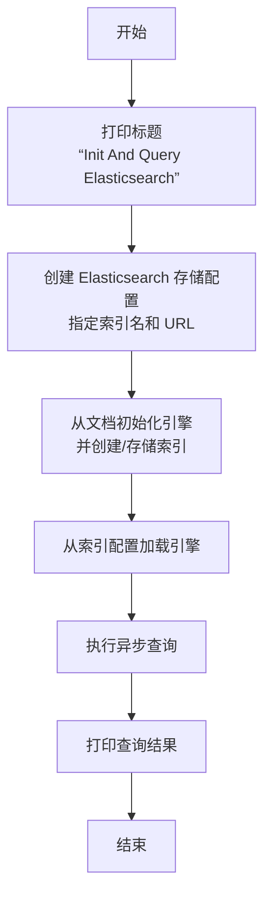

#### 带注释源码

```python
@handle_exception  # 装饰器：统一处理该方法中可能抛出的异常
async def init_and_query_es(self):
    """This example show how to use es. how to save and load index. will print something like:

    Query Result:
    Bob likes traveling.
    """
    # 步骤1：打印方法执行的标题，用于日志区分
    self._print_title("Init And Query Elasticsearch")

    # 步骤2：创建 Elasticsearch 存储配置对象
    # 指定索引名称为 "travel"，并连接到本地运行的 Elasticsearch 服务
    store_config = ElasticsearchStoreConfig(index_name="travel", es_url="http://127.0.0.1:9200")
    
    # 步骤3：从指定文档文件初始化 SimpleEngine
    # 此过程会：
    #   a. 读取 `TRAVEL_DOC_PATH` 指向的文档。
    #   b. 根据 `ElasticsearchRetrieverConfig` 配置，将文档处理（如分块、向量化）后存储到指定的 Elasticsearch 索引中。
    #   c. 返回一个配置好的引擎实例。
    engine = SimpleEngine.from_docs(
        input_files=[TRAVEL_DOC_PATH],
        retriever_configs=[ElasticsearchRetrieverConfig(store_config=store_config)],
    )

    # 步骤4：从已存在的 Elasticsearch 索引加载引擎
    # 这里使用上一步创建的 `store_config` 来定位索引，加载一个可用于检索和查询的引擎实例。
    # 注意：此处的 `engine` 变量被重新赋值，指向新加载的引擎。
    engine = SimpleEngine.from_index(index_config=ElasticsearchIndexConfig(store_config=store_config))

    # 步骤5：使用加载的引擎执行异步查询
    # 查询问题是预定义的 `TRAVEL_QUESTION`（例如：“What does Bob like? If you not sure, just answer I don't know.”）
    answer = await engine.aquery(TRAVEL_QUESTION)
    
    # 步骤6：将查询得到的答案打印到日志中
    self._print_query_result(answer)
```

### `RAGExample._print_title`

这是一个静态方法，用于在日志中打印一个格式化的标题，以增强不同示例执行阶段的可读性。

参数：
- `title`：`str`，需要打印的标题文本。

返回值：`None`，此方法不返回任何值，仅执行打印操作。

#### 流程图

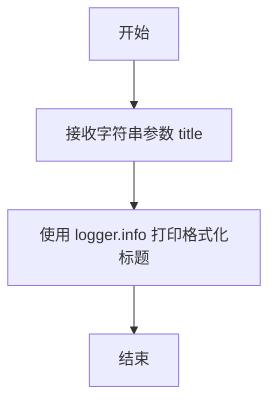

#### 带注释源码

```python
@staticmethod
def _print_title(title):
    # 使用 logger.info 方法打印一个格式化的标题行。
    # 标题前后各有30个'#'字符，以增强视觉分隔效果。
    logger.info(f"{'#'*30} {title} {'#'*30}")
```

### `RAGExample._print_retrieve_result`

这是一个静态方法，用于格式化并打印RAG（检索增强生成）引擎的检索结果。它将检索到的节点列表以编号列表的形式输出到日志中，每个条目显示节点文本的前10个字符和其相关性分数。

参数：
- `result`：`List[NodeWithScore]`，RAG引擎检索到的节点列表，每个节点包含文本内容和相关性分数。

返回值：`None`，此方法不返回任何值，仅执行打印操作。

#### 流程图

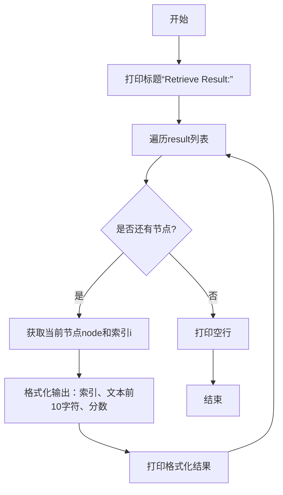

#### 带注释源码

```python
@staticmethod
def _print_retrieve_result(result):
    """Print retrieve result."""
    # 1. 打印结果标题
    logger.info("Retrieve Result:")

    # 2. 遍历传入的节点列表
    for i, node in enumerate(result):
        # 3. 格式化并打印每个节点的信息：
        #    - i: 节点在列表中的索引（从0开始）
        #    - node.text[:10]: 节点文本内容的前10个字符，后跟“...”
        #    - node.score: 节点的相关性分数
        logger.info(f"{i}. {node.text[:10]}..., {node.score}")

    # 4. 打印一个空行，使输出在日志中更清晰
    logger.info("")
```

### `RAGExample._print_query_result`

这是一个静态方法，用于将RAG查询的结果（即LLM生成的答案）格式化并打印到日志中。

参数：

- `result`：`str`，RAG查询后由LLM生成的文本答案。

返回值：`None`，此方法不返回任何值，仅执行打印操作。

#### 流程图

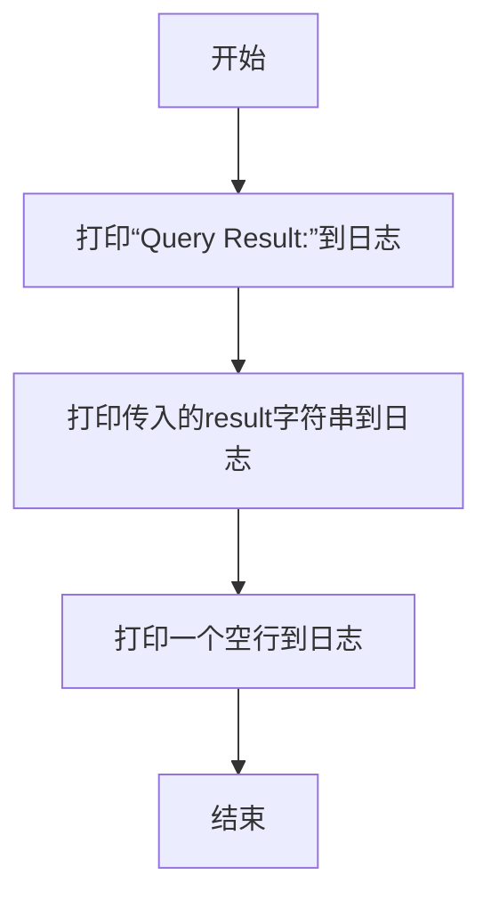

#### 带注释源码

```python
@staticmethod
def _print_query_result(result):
    """Print query result."""  # 方法描述：打印查询结果
    logger.info("Query Result:")  # 在日志中输出标题行“Query Result:”

    logger.info(f"{result}\n")  # 将传入的result字符串打印到日志，并在末尾添加换行符
```

### `RAGExample._retrieve_and_print`

该方法用于从RAG引擎中异步检索与给定问题相关的文档节点，并打印检索结果。

参数：
- `question`：`str`，用户提出的问题，将作为检索查询的输入。

返回值：`list`，返回一个包含检索到的文档节点（`Node`对象）的列表。每个节点包含文档片段及其相关性分数。

#### 流程图

```mermaid
flowchart TD
    A[开始] --> B[调用引擎的异步检索方法<br>await self.engine.aretrieve(question)]
    B --> C[调用内部方法打印检索结果<br>self._print_retrieve_result(nodes)]
    C --> D[返回检索到的节点列表]
    D --> E[结束]
```

#### 带注释源码

```python
async def _retrieve_and_print(self, question):
    # 调用RAG引擎的异步检索接口，根据问题获取相关的文档节点
    nodes = await self.engine.aretrieve(question)
    # 调用内部静态方法，格式化并打印检索结果（包括文本片段和相关性分数）
    self._print_retrieve_result(nodes)
    # 将检索到的节点列表返回给调用者
    return nodes
```

## 关键组件


### SimpleEngine

RAG（检索增强生成）管道的核心引擎，负责文档/对象的索引构建、检索、重排序和查询生成。它支持从文档、对象初始化，并可配置不同的检索器（如FAISS、ChromaDB、Elasticsearch）和排序器（如LLM排序器）。

### 检索器配置 (Retriever Configs)

用于配置不同向量数据库检索器的参数类，包括FAISSRetrieverConfig、ChromaRetrieverConfig、ElasticsearchRetrieverConfig。它们定义了检索器的具体行为，如持久化路径、存储配置等。

### 索引配置 (Index Configs)

用于从已持久化的索引加载引擎的配置类，包括ChromaIndexConfig、ElasticsearchIndexConfig。它们指定了索引的存储位置和连接信息。

### 存储配置 (Store Configs)

定义外部向量数据库（如Elasticsearch）存储细节的配置类，例如ElasticsearchStoreConfig，包含索引名称和连接URL。

### 排序器配置 (Ranker Configs)

用于配置对检索结果进行重排序的组件，例如LLMRankerConfig，它利用大语言模型对初步检索结果进行相关性重排以提高精度。

### 可检索对象接口 (RAG-able Object Interface)

定义了可被RAG系统索引和检索的对象所需实现的接口，示例中通过`Player`类的`rag_key`方法展示，该方法返回用于检索的文本键。

### 异步RAG管道 (Asynchronous RAG Pipeline)

展示了完整的异步RAG操作流程，包括引擎初始化、运行检索与生成、动态添加文档/对象、以及使用不同后端（FAISS、ChromaDB、Elasticsearch）进行持久化和查询。


## 问题及建议


### 已知问题

-   **硬编码的配置与路径**：代码中多处硬编码了文件路径（如 `DOC_PATH`, `TRAVEL_DOC_PATH`）、Elasticsearch连接地址（`http://127.0.0.1:9200`）和索引名称（`"travel"`）。这使得代码缺乏灵活性，难以在不同环境（开发、测试、生产）或不同数据集上复用。
-   **异常处理粒度较粗**：虽然使用了 `@handle_exception` 装饰器，但它可能掩盖了方法内部不同步骤的具体错误原因，不利于调试和针对性的错误恢复。例如，在 `add_objects` 方法中，如果检索结果为空，会捕获异常并记录日志，但无法区分是检索失败还是对象添加失败。
-   **资源管理与潜在泄漏**：`init_and_query_chromadb` 和 `init_and_query_es` 方法中创建了新的 `SimpleEngine` 实例（例如 `engine = SimpleEngine.from_docs(...)`），但代码没有展示这些引擎实例在使用后是否被正确关闭或清理，特别是对于需要持久化连接的后端（如Elasticsearch、ChromaDB），可能存在连接未关闭的风险。
-   **`Player` 类的 `rag_key` 方法设计单一**：`Player.rag_key()` 固定返回 `self.goal` 作为检索键。这限制了对象的检索维度，如果未来需要根据 `name` 或 `tool` 进行检索，当前设计无法支持，扩展性不足。
-   **`main` 函数中的示例执行是线性的**：`main` 函数中依次调用多个示例方法（`run_pipeline`, `add_docs`等）。这些示例之间存在状态依赖（例如，`add_docs` 依赖于前一个示例创建的引擎状态）。这种强耦合使得单独运行某个示例或调整执行顺序变得困难，降低了示例的独立性和可测试性。
-   **`LLM_TIP` 提示词可能影响答案质量**：问题中强制附加的 `"If you not sure, just answer I don't know."` 提示，虽然能减少幻觉，但也可能过度限制LLM，导致其在拥有部分相关上下文时也放弃生成合理推断，降低了答案的丰富性和实用性。

### 优化建议

-   **配置外部化**：将文件路径、数据库连接字符串、索引名称等配置信息移出代码，改为从配置文件（如YAML、JSON）、环境变量或配置管理服务中读取。这能提升代码的可配置性和部署灵活性。
-   **细化异常处理**：在关键操作步骤（如文档加载、索引创建、检索、查询）周围使用更精细的 `try...except` 块，捕获并抛出更具业务语义的自定义异常。同时，确保 `@handle_exception` 装饰器记录足够详细的错误上下文（如堆栈信息、输入参数），便于问题定位。
-   **显式的资源生命周期管理**：对于 `SimpleEngine` 或底层的存储客户端（如Elasticsearch client），实现上下文管理器（`__enter__`/`__exit__`）或提供显式的 `close()`/`disconnect()` 方法，并在使用完毕后调用，确保网络连接、文件句柄等资源被正确释放。在示例代码中，应展示资源的清理过程。
-   **增强 `rag_key` 方法的灵活性**：将 `rag_key` 方法改为可配置或可重写。例如，可以允许在对象类中定义多个用于检索的字段，或者允许在调用 `add_objs` 时指定一个函数来提取检索键。这提高了对象检索的灵活性和可定制性。
-   **重构示例，降低耦合**：将每个示例方法（如 `run_pipeline`, `add_docs`）重构成完全自包含的，即每个方法内部创建自己所需的全新 `SimpleEngine` 实例和测试数据，执行演示，然后清理。这消除了示例间的状态依赖，使每个示例都能独立运行和理解。`main` 函数则变为这些独立示例的简单调用集合。
-   **提供可配置的提示词策略**：将 `LLM_TIP` 这类提示词作为可配置项，允许用户根据场景选择是否添加、或自定义提示词内容。可以提供不同的提示词模板，以适应严谨性、创造性等不同需求。
-   **增加异步操作的并发控制与超时**：当前代码大量使用 `async/await`，但未展示对并发任务的管理（如使用 `asyncio.gather`）或为网络IO操作设置超时。建议在 `SimpleEngine` 的异步方法中增加超时参数，并在 `main` 或更高级别的调用中演示如何安全地并发执行多个RAG查询任务。


## 其它


### 设计目标与约束

本代码是一个RAG（检索增强生成）管道的示例程序，旨在展示如何使用`SimpleEngine`这一高层抽象接口来构建和运行RAG应用。其核心设计目标是**演示性**和**易用性**，通过一系列独立的示例方法，清晰地展示RAG管道的核心操作，包括：从文档初始化引擎、运行检索与生成、动态添加文档/对象、以及使用不同的向量数据库（FAISS、ChromaDB、Elasticsearch）进行持久化存储和查询。代码的主要约束是作为示例，因此牺牲了生产环境所需的配置灵活性、错误处理的完备性和性能优化，侧重于功能展示和API的可理解性。

### 错误处理与异常设计

代码中的错误处理采用了装饰器模式，通过`@handle_exception`装饰器包裹主要的异步示例方法（如`run_pipeline`, `add_docs`等）。这种设计将异常捕获和日志记录的逻辑与业务逻辑解耦，确保了示例代码的简洁性。当被装饰的方法发生异常时，装饰器会捕获异常并记录错误日志，防止单个示例的失败导致整个演示流程中断。然而，这种处理是通用且粗粒度的，没有针对特定的异常类型（如检索失败、LLM调用超时、索引文件不存在等）进行差异化处理或恢复，这符合其作为演示代码的定位。

### 数据流与状态机

程序的数据流围绕`SimpleEngine`实例展开。主要状态是`RAGExample`类中的`_engine`属性。数据流遵循典型的RAG流程：1) **索引构建**：通过`from_docs`或`from_objs`方法，将文档或对象解析、分块、嵌入并存入向量索引。2) **检索**：用户输入问题（`question`）后，调用`aretrieve`方法，引擎使用配置的检索器（如FAISS）从索引中查找相关片段（`nodes`）。3) **重排序（可选）**：如果配置了`LLMRanker`，则对检索结果进行重排序。4) **生成**：将检索到的上下文与问题结合，通过LLM生成最终答案（`aquery`）。示例方法通过改变`_engine`的状态（如`add_docs`后添加了新文档到索引）来驱动数据流的变化，但整个程序没有复杂的状态机，每个示例方法都是相对独立的一次性数据流演示。

### 外部依赖与接口契约

代码严重依赖多个外部库和组件，构成了清晰的接口契约：
1.  **RAG引擎框架**：依赖于`metagpt.rag.engines.SimpleEngine`及其相关配置类（如`FAISSRetrieverConfig`）。契约是调用其工厂方法（`from_docs`, `from_objs`, `from_index`）来初始化，并调用`aretrieve`和`aquery`方法执行核心功能。
2.  **向量数据库/检索库**：支持FAISS（内存）、ChromaDB（持久化）、Elasticsearch（持久化）。通过对应的`*Config`类进行配置，契约是这些后端必须实现`SimpleEngine`所期望的存储和检索接口。
3.  **大语言模型(LLM)**：通过`SimpleEngine`间接依赖，用于生成答案和可选的重新排序（`LLMRanker`）。契约是LLM提供商需返回结构化的文本响应。
4.  **数据模型**：使用`pydantic.BaseModel`（如`Player`类）来定义可添加到RAG索引中的对象，契约是这些对象需实现`rag_key`方法以提供检索依据。
5.  **异步运行时**：依赖`asyncio`运行异步方法，所有核心操作（`aretrieve`, `aquery`）都是异步的。
6.  **Elasticsearch服务**：`init_and_query_es`方法硬编码依赖一个运行在`http://127.0.0.1:9200`的Elasticsearch实例，这是一个外部服务依赖。

### 配置管理与环境假设

代码中包含了硬编码的配置和环境假设：
1.  **文件路径**：使用`EXAMPLE_DATA_PATH`和`DATA_PATH`常量指向预设的示例数据和输出目录（如`EXAMPLE_DATA_PATH / "rag/writer.txt"`）。这假设了特定的项目目录结构。
2.  **Elasticsearch连接**：在`init_and_query_es`方法中，Elasticsearch的URL（`http://127.0.0.1:9200`）和索引名（`"travel"`）是硬编码的。
3.  **LLM提示词**：问题中附加了固定的提示语`LLM_TIP`（“If you not sure, just answer I don't know.”）。
4.  **示例开关**：`RAGExample`的`use_llm_ranker`参数控制是否使用LLM重排序器，但在示例中默认关闭（`use_llm_ranker=False`）以避免潜在解析错误。代码缺乏从配置文件或环境变量读取这些配置的机制，所有配置均在代码中直接设定，符合其作为自包含示例的定位。

    