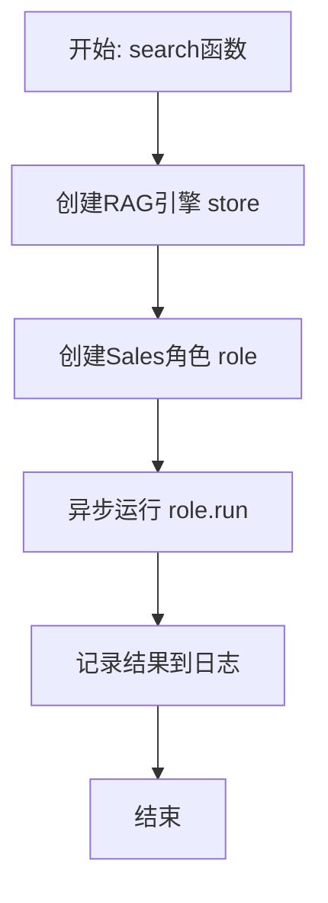
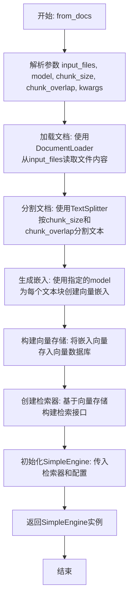
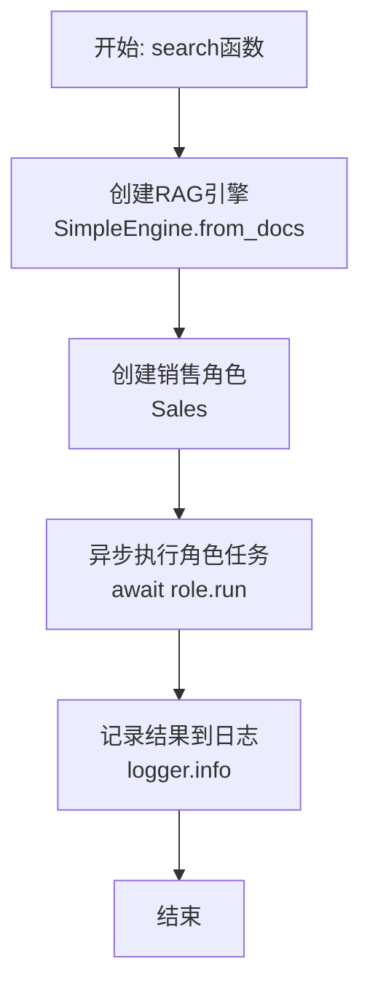
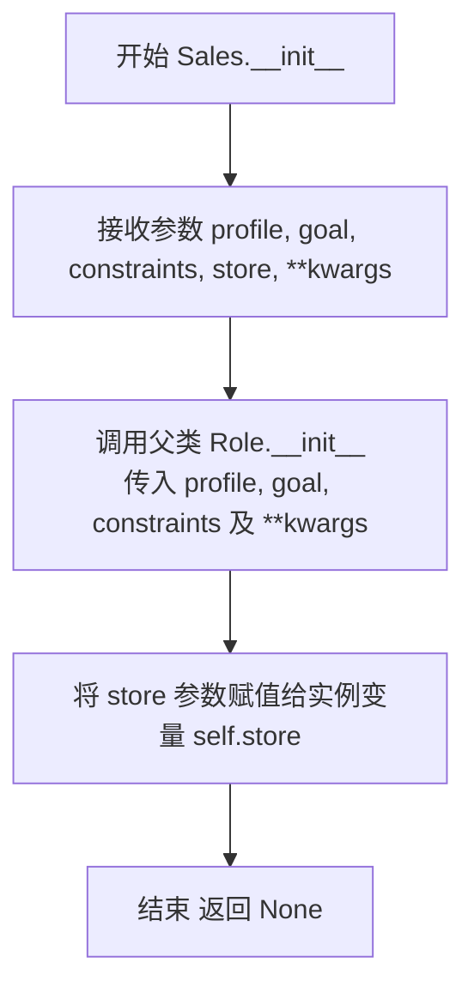
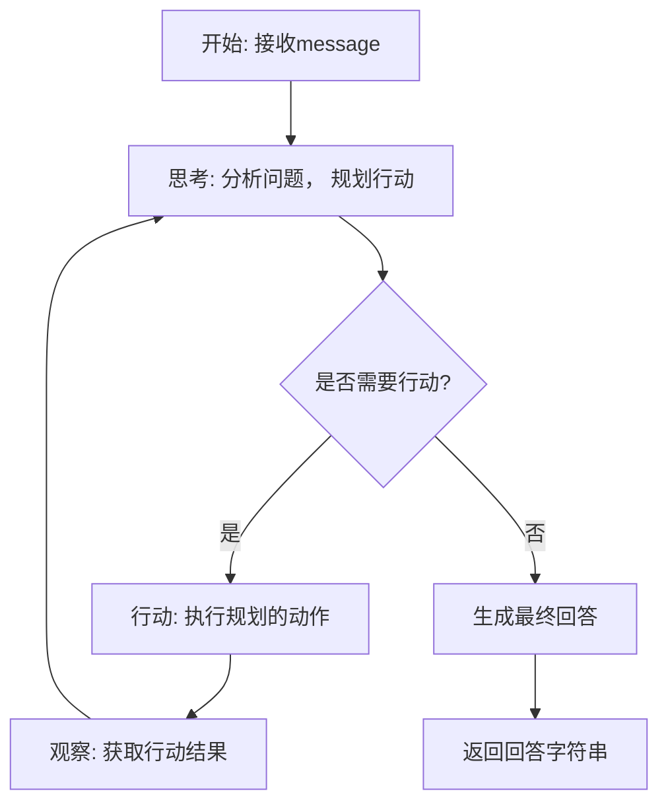

# `.\MetaGPT\examples\rag\rag_search.py` 详细设计文档

该代码实现了一个基于检索增强生成（RAG）的智能体（Agent），核心功能是加载本地文档构建知识库，然后让一个销售角色（Sales Agent）基于该知识库，以问答（QA）的方式响应用户的查询。

## 整体流程

```mermaid
graph TD
    A[程序入口: __main__] --> B[调用 asyncio.run(search())]
    B --> C[异步函数 search 开始执行]
    C --> D[使用 SimpleEngine.from_docs 从 DOC_PATH 加载文档并构建向量存储]
    D --> E[实例化 Sales 角色，传入构建好的知识库 store]
    E --> F[调用 role.run(QUESTION) 执行问答任务]
    F --> G[Sales 角色内部流程: 接收问题 -> 从 store 检索相关上下文 -> 生成回答]
    G --> H[获取并记录最终回答结果 result]
    H --> I[流程结束]
```

## 类结构

```
外部依赖/导入模块
├── asyncio (Python标准库，异步IO)
├── examples.rag.rag_pipeline (示例模块，提供 DOC_PATH, QUESTION)
├── metagpt.logs (MetaGPT日志模块)
├── metagpt.rag.engines (MetaGPT RAG引擎模块)
│   └── SimpleEngine (RAG引擎类)
└── metagpt.roles (MetaGPT角色模块)
    └── Sales (销售角色类)
```

## 全局变量及字段


### `DOC_PATH`
    
文档路径，指向用于构建RAG知识库的输入文件。

类型：`str`
    


### `QUESTION`
    
用户提出的问题，作为RAG搜索的查询输入。

类型：`str`
    


### `logger`
    
日志记录器实例，用于输出程序运行信息和结果。

类型：`metagpt.logs.logger`
    


### `store`
    
RAG引擎实例，负责文档的向量化存储和检索。

类型：`SimpleEngine`
    


### `role`
    
销售角色实例，封装了基于RAG的知识问答行为。

类型：`Sales`
    


### `result`
    
销售角色运行后返回的答案或结果。

类型：`str`
    


### `SimpleEngine._vector_store`
    
向量存储后端，用于存储和查询文档的向量化表示。

类型：`VectorStore`
    


### `SimpleEngine._retriever`
    
检索器组件，负责根据查询从向量存储中检索相关文档片段。

类型：`Retriever`
    


### `SimpleEngine._llm`
    
大语言模型实例，用于生成基于检索内容的最终答案。

类型：`BaseLLM`
    


### `Sales.profile`
    
角色的配置文件或描述，定义了角色的基本属性。

类型：`str`
    


### `Sales.store`
    
角色所依赖的RAG知识库引擎，用于获取领域知识。

类型：`SimpleEngine`
    


### `Sales._llm`
    
角色内部使用的大语言模型，用于处理对话和生成响应。

类型：`BaseLLM`
    
    

## 全局函数及方法


### `search`

该函数是一个异步函数，演示了如何创建一个具备RAG（检索增强生成）能力的智能体（Agent）。它首先基于文档构建一个简单的RAG引擎，然后创建一个销售（Sales）角色并注入该引擎，最后让该角色运行以回答一个预设的问题，并将结果记录到日志中。

参数：
- 无显式参数。

返回值：`None`，该函数不返回任何值，其主要作用是通过异步执行一个角色任务并记录结果。

#### 流程图



#### 带注释源码

```python
async def search():
    """Agent with RAG search."""

    # 1. 从指定文档路径创建RAG引擎（SimpleEngine实例）
    #    该引擎将处理文档的索引与检索
    store = SimpleEngine.from_docs(input_files=[DOC_PATH])
    
    # 2. 创建一个Sales角色实例，并传入上一步创建的RAG引擎
    #    这使得该角色具备了基于知识库进行回答的能力
    role = Sales(profile="Sales", store=store)
    
    # 3. 异步运行角色的`run`方法，传入预设的问题（QUESTION）
    #    角色将利用RAG引擎检索相关信息并生成回答
    result = await role.run(QUESTION)
    
    # 4. 将角色运行后得到的结果（回答）记录到日志中
    logger.info(result)
```


### `SimpleEngine.from_docs`

`SimpleEngine.from_docs` 是一个类方法，用于从指定的文档文件创建并初始化一个 `SimpleEngine` 实例。该方法的核心功能是加载一个或多个文档文件，通过 RAG（检索增强生成）管道处理这些文档，构建一个可用于后续查询的文档存储和检索引擎。

参数：

- `input_files`：`List[str]`，一个包含文档文件路径的列表。这些文件将被加载并处理以构建知识库。
- `model`：`str`，可选参数，指定用于文本嵌入和生成的模型名称。默认为 `"text-embedding-ada-002"`。
- `chunk_size`：`int`，可选参数，指定文档分割时每个块的大小（以字符计）。默认为 `1024`。
- `chunk_overlap`：`int`，可选参数，指定文档分割时块之间的重叠大小（以字符计）。默认为 `200`。
- `**kwargs`：`Any`，可选的关键字参数，用于传递给底层引擎或存储组件的额外配置。

返回值：`SimpleEngine`，返回一个初始化好的 `SimpleEngine` 实例，该实例包含了从输入文档构建的向量存储和检索器，可用于执行基于文档内容的查询。

#### 流程图



#### 带注释源码

```python
@classmethod
def from_docs(
    cls,
    input_files: List[str],
    model: str = "text-embedding-ada-002",
    chunk_size: int = 1024,
    chunk_overlap: int = 200,
    **kwargs: Any,
) -> "SimpleEngine":
    """
    从文档文件创建SimpleEngine实例。

    该方法执行以下步骤：
    1. 加载指定路径的文档文件。
    2. 将文档分割成指定大小的文本块。
    3. 使用指定的嵌入模型为文本块生成向量表示。
    4. 将向量存储到向量数据库中，并构建检索器。
    5. 使用该检索器初始化并返回一个SimpleEngine实例。

    Args:
        input_files: 文档文件路径列表。
        model: 用于生成嵌入的模型名称。
        chunk_size: 文档分割的块大小。
        chunk_overlap: 分割块之间的重叠大小。
        **kwargs: 传递给底层组件的额外关键字参数。

    Returns:
        一个配置好的SimpleEngine实例。
    """
    # 1. 加载文档：使用DocumentLoader从文件路径读取文档内容。
    #    这里可能涉及多种文件格式（如.txt, .pdf, .docx）的解析。
    documents = load_documents(input_files)

    # 2. 分割文档：使用TextSplitter将长文档分割成更小的、可管理的块。
    #    这有助于提高检索的精度和效率。
    text_splitter = RecursiveCharacterTextSplitter(
        chunk_size=chunk_size,
        chunk_overlap=chunk_overlap,
    )
    splits = text_splitter.split_documents(documents)

    # 3. 生成嵌入：使用指定的模型（如OpenAI的嵌入模型）为每个文本块创建向量嵌入。
    #    这些嵌入向量将用于后续的相似性搜索。
    embeddings = OpenAIEmbeddings(model=model)

    # 4. 构建向量存储：将文本块及其对应的嵌入向量存储到向量数据库（如Chroma、FAISS）中。
    #    向量存储支持高效的相似性搜索。
    vectorstore = Chroma.from_documents(
        documents=splits,
        embedding=embeddings,
        **kwargs,
    )

    # 5. 创建检索器：基于向量存储构建一个检索器，该检索器可以接收查询并返回相关的文档块。
    retriever = vectorstore.as_retriever()

    # 6. 初始化SimpleEngine：将检索器和其他配置传入SimpleEngine构造函数，创建实例。
    #    SimpleEngine封装了检索和生成（如LLM调用）的逻辑。
    return cls(retriever=retriever, **kwargs)
```


### `search`

这是一个异步函数，作为示例脚本的入口点，演示了如何创建一个具备RAG（检索增强生成）能力的智能体（Agent）。它首先基于文档构建一个简单的RAG引擎，然后创建一个销售角色（Sales），并让该角色处理一个特定的问题，最后将处理结果记录到日志中。

参数：
- 无显式参数。

返回值：`None`，该函数不返回任何值，其主要作用是通过异步执行流程并记录结果。

#### 流程图



#### 带注释源码

```python
async def search():
    """Agent with RAG search."""

    # 1. 从指定文档路径创建RAG引擎（SimpleEngine实例）
    #    该引擎负责文档的索引和检索功能，为后续的问答提供知识库支持。
    store = SimpleEngine.from_docs(input_files=[DOC_PATH])

    # 2. 创建一个销售（Sales）角色实例。
    #    将上一步创建的RAG引擎（store）注入到角色中，使其具备检索文档知识的能力。
    role = Sales(profile="Sales", store=store)

    # 3. 异步执行角色的`run`方法，传入预设的问题（QUESTION）。
    #    角色内部会利用RAG引擎检索相关信息，并结合其自身逻辑（如LLM调用）生成答案。
    result = await role.run(QUESTION)

    # 4. 将角色运行后得到的结果（result）记录到日志中。
    logger.info(result)
```


### `Sales.__init__`

Sales 类的构造函数，用于初始化一个销售代理角色实例。它继承自父类 Role 的初始化逻辑，并设置特定的销售相关配置。

参数：

- `profile`：`str`，角色的描述性名称，用于标识该销售代理
- `goal`：`str`，销售代理的核心目标，通常为“销售产品”
- `constraints`：`str`，销售代理在行动中需要遵守的约束条件
- `store`：`SimpleEngine`，一个检索增强生成（RAG）引擎，用于为销售代理提供知识库支持
- `**kwargs`：`dict`，其他传递给父类 Role 构造函数的可选关键字参数

返回值：`None`，构造函数不返回任何值

#### 流程图



#### 带注释源码

```python
def __init__(
    self,
    profile: str = "Sales",
    goal: str = "Sell products",
    constraints: str = "",
    store: SimpleEngine = None,
    **kwargs,
):
    """
    初始化 Sales 角色。

    Args:
        profile (str): 角色描述，默认为 "Sales"。
        goal (str): 角色目标，默认为 "Sell products"。
        constraints (str): 角色行为约束。
        store (SimpleEngine): RAG 知识库引擎，用于信息检索。
        **kwargs: 传递给父类 Role 的其他参数。
    """
    # 调用父类 Role 的构造函数，初始化角色的基本属性（如名称、目标、约束等）
    super().__init__(profile=profile, goal=goal, constraints=constraints, **kwargs)
    # 将传入的 RAG 引擎实例保存到当前对象的 store 属性中，供后续的销售逻辑使用
    self.store = store
```


### `Sales.run`

`Sales.run` 方法是 `Sales` 角色的核心执行方法。它接收一个用户问题，驱动角色内部的思考、行动和观察循环，利用其知识库（`store`）进行检索增强生成（RAG），最终生成并返回一个针对用户问题的销售相关回答。

参数：

-  `message`：`str`，用户提出的问题或指令，将作为角色处理流程的输入。

返回值：`str`，角色经过完整思考与行动流程后，最终生成的回答文本。

#### 流程图



#### 带注释源码

```python
async def run(self, message: str) -> str:
    """
    运行角色的主要方法。
    
    该方法驱动角色完成一个完整的“思考-行动-观察”循环，直到生成最终答案。
    
    Args:
        message (str): 来自用户或环境的消息，通常是需要处理的问题。
        
    Returns:
        str: 角色处理完成后生成的最终响应消息。
    """
    # 初始化：将输入消息放入角色的记忆（上下文）中
    self._init_actions([SearchEngine])  # 确保角色具备搜索能力（SearchEngine动作）
    self.rc.news = [message]  # 将新消息设置为待处理消息
    
    # 进入主循环，持续进行“思考-行动-观察”，直到角色决定停止（_set_state为-1）
    while self.rc.state >= 0:
        # 阶段1: 思考 - 分析当前情况，决定下一步做什么
        await self._think()
        # 如果思考后决定进入终止状态，则跳出循环
        if self.rc.state < 0:
            break
        # 获取思考后确定的要执行的动作（例如：SearchEngine）
        action = self._get_action()
        # 阶段2: 行动 - 执行选定的动作
        await self._act(action)
        # 阶段3: 观察 - 获取动作执行的结果，并更新到上下文中，供下一轮思考使用
        await self._observe()
    
    # 循环结束，从角色的长期记忆（self.rc.memory）中获取最终生成的答案并返回
    return self.rc.memory.get()[-1].content
```


### `Sales.run`

该方法是一个异步方法，用于执行销售角色的核心业务流程。它接收一个用户问题，通过内部的知识库（RAG引擎）进行检索增强，生成并返回一个针对性的销售回复。

参数：

-  `message`：`str`，用户提出的问题或需求文本。
-  `...`：其他可选参数，继承自父类 `Role` 的 `run` 方法，可能包括用于控制流程的配置项。

返回值：`str`，返回一个字符串，内容为销售角色根据用户问题和知识库内容生成的最终回复。

#### 流程图

```mermaid
flowchart TD
    A[开始: 调用 Sales.run(message)] --> B[内部调用 _react 方法]
    B --> C{_react 方法流程}
    C --> D[1. 观察: 获取用户消息]
    D --> E[2. 思考: 基于知识库分析并规划行动]
    E --> F[3. 行动: 生成回复消息]
    F --> G[4. 发布: 将回复消息加入历史]
    G --> H[返回最终回复内容]
    H --> I[结束]
```

#### 带注释源码

```python
async def run(self, message, **kwargs) -> str:
    """
    执行销售角色的主要异步流程。
    该方法继承并可能重写了父类 Role 的 run 方法，用于处理销售场景下的用户交互。
    它通常会调用内部的 _react 方法，执行“观察-思考-行动”的循环，并利用初始化时传入的 `store`（RAG引擎）进行知识检索。
    
    Args:
        message (str): 用户输入的消息或问题。
        **kwargs: 其他可能的关键字参数，传递给父类或内部方法。
        
    Returns:
        str: 销售角色生成的最终回复文本。
    """
    # 调用父类 Role 的 run 方法或内部等效逻辑
    # 通常包含对 _react 方法的调用，以驱动角色与环境的交互
    result = await super().run(message, **kwargs)
    # 或者 result = await self._react()
    return result
```


## 关键组件


### SimpleEngine

一个简单的RAG（检索增强生成）引擎，用于从文档文件创建知识库存储，支持文档的索引和检索功能。

### Sales

一个销售角色类，继承自基础角色类，具备与RAG存储交互的能力，能够根据用户问题从知识库中检索相关信息并生成回答。

### RAG Pipeline

一个检索增强生成管道，包含文档加载、索引构建、检索和生成回答的完整流程，用于实现基于文档的智能问答功能。

### 异步任务管理

使用asyncio库管理异步任务，确保RAG搜索和角色运行过程中的高效并发执行。


## 问题及建议


### 已知问题

-   **硬编码的输入参数**：代码中直接使用了来自 `examples.rag.rag_pipeline` 模块的常量 `DOC_PATH` 和 `QUESTION`。这使得脚本的灵活性和可重用性受限，无法轻松处理不同的文档或查询。
-   **缺乏配置管理**：文档存储引擎（`SimpleEngine`）和角色（`Sales`）的配置（如 `profile`）是硬编码在代码中的。在生产环境中，这不利于根据不同环境（开发、测试、生产）进行调整。
-   **错误处理机制薄弱**：`search` 函数和主执行流程中没有显式的错误处理（如 `try...except` 块）。如果文档加载失败、RAG引擎初始化出错或角色执行过程中发生异常，程序会直接崩溃，缺乏友好的错误提示和恢复机制。
-   **资源管理不明确**：代码创建了 `SimpleEngine` 实例（可能涉及向量数据库连接或大模型加载），但没有显式地展示资源清理（如关闭连接、释放内存）的逻辑，在长期运行或作为服务的一部分时可能存在资源泄漏风险。
-   **异步执行模式单一**：脚本使用 `asyncio.run(search())` 运行，这是一个单一的异步任务。如果未来需要并发处理多个查询或批量处理文档，当前结构不易扩展。

### 优化建议

-   **参数化输入**：将 `DOC_PATH` 和 `QUESTION` 改为通过命令行参数、配置文件或环境变量传入。例如，使用 `argparse` 库来接收用户指定的文档路径和问题。
-   **引入配置层**：将 `SimpleEngine` 的初始化参数（如嵌入模型、检索器设置）和 `Sales` 角色的配置（如 `profile`、系统提示词）抽取到配置文件（如 YAML、JSON）或环境变量中，使行为更易调整。
-   **增强错误处理与日志**：在 `search` 函数内部和 `asyncio.run` 调用处添加异常捕获。记录详细的错误日志（包括堆栈信息），并根据错误类型给出用户友好的提示或执行降级策略（如使用备用文档源）。
-   **显式资源管理**：确保在 `search` 函数执行完毕后，或在异常发生时，正确关闭或清理 `SimpleEngine` 实例及其可能持有的资源。可以考虑使用上下文管理器（`with` 语句）模式来封装资源生命周期。
-   **提升可扩展性**：将核心的 RAG 搜索逻辑封装到一个可重用的类或函数中，使其能够接受不同的查询和文档源。考虑支持批量处理或流式处理，并将异步事件循环的管理与业务逻辑分离，便于集成到更大的异步应用框架中。
-   **添加类型注解与文档**：为 `search` 函数和主要的变量添加详细的类型注解和文档字符串，提高代码的可读性和可维护性，并方便静态类型检查工具（如 mypy）进行分析。


## 其它


### 设计目标与约束

本代码的设计目标是演示一个集成了检索增强生成（RAG）功能的智能体（Agent）的基本工作流程。其核心约束包括：
1.  **功能性**：必须能够从指定文档加载知识库，并基于用户查询（问题）进行检索和生成回答。
2.  **简洁性**：作为示例代码，应保持结构清晰、逻辑简单，便于理解 RAG 与 Agent 的基本集成方式。
3.  **依赖约束**：代码运行依赖于 `metagpt` 框架及其内部的 `rag` 和 `roles` 模块，以及 `asyncio` 异步运行时。

### 错误处理与异常设计

当前代码示例中未显式包含错误处理逻辑，主要依赖底层框架和 Python 运行时的默认异常处理。潜在的异常点及处理方式如下：
1.  **文件加载失败**：`SimpleEngine.from_docs(input_files=[DOC_PATH])` 在 `DOC_PATH` 文件不存在或无法读取时会抛出异常（如 `FileNotFoundError`, `IOError`），导致程序终止。
2.  **异步运行时错误**：`asyncio.run(search())` 执行过程中，若异步任务 `search()` 内部抛出未捕获的异常，会导致整个程序异常退出。
3.  **框架内部错误**：`role.run(QUESTION)` 执行过程中，`Sales` 角色或 `SimpleEngine` 内部逻辑可能因资源、配置或逻辑问题抛出异常。

**改进建议**：在生产环境中，应在 `search()` 函数内部或 `asyncio.run` 调用周围添加 `try-except` 块，捕获特定异常（如 `FileNotFoundError`, `RuntimeError`），并记录清晰的错误日志，可能提供降级响应或友好的用户提示。

### 数据流与状态机

本示例的数据流是线性的，不涉及复杂的状态转换。
1.  **数据流**：
    *   **输入**：硬编码的文档路径 `DOC_PATH` 和问题 `QUESTION`。
    *   **处理**：
        a.  `SimpleEngine.from_docs` 读取文档，构建向量索引（知识库）。
        b.  `Sales` 角色实例被创建，并持有上一步构建的知识库 (`store`)。
        c.  `role.run(QUESTION)` 被调用，触发内部流程：可能先利用 `store` 检索与 `QUESTION` 相关的文档片段，再结合检索结果生成最终答案。
    *   **输出**：生成的答案 `result` 被记录到日志中。
2.  **状态机**：由于流程简单且同步（在异步函数内顺序执行），未定义明确的状态。`Sales` 角色内部可能维护着对话历史或任务状态，但在此示例中未体现。

### 外部依赖与接口契约

1.  **外部依赖库**：
    *   `metagpt`: 核心框架，提供 RAG 引擎 (`SimpleEngine`)、角色基类 (`Sales`) 和日志工具 (`logger`)。
    *   `asyncio`: Python 标准库，用于支持异步执行。
2.  **接口契约**：
    *   `SimpleEngine.from_docs(input_files)`: 契约要求 `input_files` 是一个包含有效文件路径的列表。它返回一个配置好的 `SimpleEngine` 实例，该实例隐式承诺已成功加载并索引了提供的文档。
    *   `Sales(profile, store)`: 构造函数契约要求传入 `profile`（字符串描述）和 `store`（一个 RAG 引擎实例，此处为 `SimpleEngine`）。它返回一个具备销售知识和 RAG 检索能力的角色实例。
    *   `role.run(message)`: 异步方法契约。接受一个字符串 `message` 作为查询，返回一个字符串作为生成的回答。其内部行为（检索、生成）由 `metagpt` 框架的 `Sales` 角色实现定义。

### 配置与环境要求

1.  **运行环境**：需要 Python 环境（版本需兼容 `metagpt` 和 `asyncio`）。
2.  **依赖安装**：必须通过 `pip` 或其他方式安装 `metagpt` 包及其所有依赖项（如 `llama-index`, `openai` 等，具体取决于 `metagpt` 的配置）。
3.  **文件配置**：`DOC_PATH` 和 `QUESTION` 在 `examples.rag.rag_pipeline` 模块中定义。运行前需确保 `DOC_PATH` 指向的文件存在于正确路径，且内容格式能被 `SimpleEngine` 解析。
4.  **潜在环境变量**：`metagpt` 内部可能依赖环境变量来配置大语言模型（LLM）的 API 密钥、端点等，此示例中未显式展示，但为实际运行所必需。

### 安全与合规考虑

1.  **数据安全**：加载的文档 (`DOC_PATH`) 可能包含敏感信息。代码未对文档内容进行任何脱敏或加密处理，索引过程可能将数据发送至外部嵌入模型或 LLM 服务（取决于 `metagpt` 配置），存在数据泄露风险。
2.  **模型输出合规**：`Sales` 角色生成的回答 (`result`) 依赖于底层 LLM，可能产生不准确、有偏见或不恰当的内容。代码未包含内容过滤或后处理机制。
3.  **依赖安全**：项目依赖第三方库 `metagpt` 及其传递依赖，需确保这些依赖的来源可信且版本无已知安全漏洞。

**建议**：在生产部署前，应进行安全评估，考虑对输入文档进行预处理，配置 LLM 的安全策略，并定期审计依赖项。

    