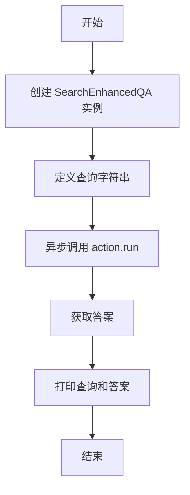
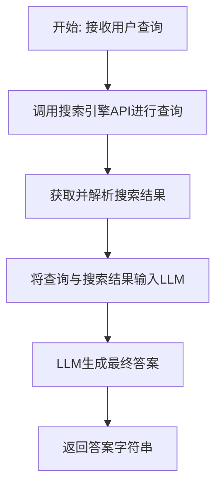

# `.\MetaGPT\examples\search_enhanced_qa.py` 详细设计文档

该脚本演示了如何使用 SearchEnhancedQA 动作，通过结合网络搜索能力和自然语言处理来回答用户问题。它展示了一个查询北京当前天气的简单示例。

## 整体流程

```mermaid
graph TD
    A[脚本开始] --> B[导入模块: asyncio, SearchEnhancedQA]
    B --> C[定义异步主函数 main]
    C --> D[创建 SearchEnhancedQA 动作实例]
    D --> E[定义查询字符串: 'What is the weather like in Beijing today?']
    E --> F[调用 action.run(query) 异步执行查询]
    F --> G[获取并打印答案]
    G --> H[脚本结束]
    subgraph SearchEnhancedQA.run 内部流程
        F1[接收查询] --> F2[执行网络搜索]
        F2 --> F3[处理搜索结果]
        F3 --> F4[生成自然语言答案]
        F4 --> F5[返回答案]
    end
```

## 类结构

```
SearchEnhancedQA (来自 metagpt.actions.search_enhanced_qa)
├── (继承自 Action 基类，假设)
│   ├── 可能包含: name, context, llm 等字段
│   └── 可能包含: run, _aask 等方法
└── 本脚本主要使用其 run 方法
```

## 全局变量及字段


### `query`
    
包含用户问题的字符串，例如'What is the weather like in Beijing today?'

类型：`str`
    


### `answer`
    
SearchEnhancedQA动作执行后返回的答案字符串

类型：`str`
    


### `action`
    
SearchEnhancedQA类的一个实例，用于执行增强搜索问答操作

类型：`SearchEnhancedQA`
    


### `SearchEnhancedQA.(需分析源模块，脚本中未直接定义字段)`
    
需分析metagpt.actions.search_enhanced_qa模块中的SearchEnhancedQA类定义以确定其字段

类型：`需分析源模块`
    
    

## 全局函数及方法


### `main`

这是一个异步入口函数，用于演示如何使用 `SearchEnhancedQA` 动作来回答用户问题。它创建了一个 `SearchEnhancedQA` 实例，向其提交一个关于北京天气的查询，并打印出返回的答案。

参数：
-  `无`：`无`，此函数不接受任何参数。

返回值：`None`，此函数不返回任何值，其主要作用是通过 `print` 函数输出结果。

#### 流程图



#### 带注释源码

```
async def main():
    """Runs a sample query through SearchEnhancedQA and prints the result."""

    # 1. 实例化 SearchEnhancedQA 动作类
    action = SearchEnhancedQA()

    # 2. 定义要查询的问题字符串
    query = "What is the weather like in Beijing today?"

    # 3. 异步执行动作的 `run` 方法，传入查询问题，并等待返回答案
    answer = await action.run(query)

    # 4. 将原始查询和得到的答案格式化后打印到控制台
    print(f"The answer to '{query}' is:\n\n{answer}")
```


### `SearchEnhancedQA.run`

`SearchEnhancedQA.run` 方法是 `SearchEnhancedQA` 动作的核心执行方法。它接收一个用户查询，通过整合网络搜索和自然语言处理能力，生成一个信息丰富的答案。

参数：

-  `query`：`str`，用户提出的自然语言问题。

返回值：`str`，根据用户查询和搜索到的信息生成的最终答案。

#### 流程图



#### 带注释源码

```python
async def run(self, query: str) -> str:
    """
    执行增强问答流程的核心方法。
    
    该方法首先使用搜索引擎获取与查询相关的信息，然后将查询和搜索结果
    一起提供给大型语言模型（LLM），以生成一个综合性的、信息丰富的答案。
    
    Args:
        query (str): 用户提出的自然语言问题。
        
    Returns:
        str: 根据用户查询和搜索到的信息生成的最终答案。
    """
    # 1. 调用搜索引擎API，获取与查询相关的网页或摘要信息。
    search_results = await self._search_web(query)
    
    # 2. 对搜索结果进行解析和预处理，提取关键文本信息。
    processed_context = self._process_search_results(search_results)
    
    # 3. 构建LLM的提示词（Prompt），将用户查询和搜索到的上下文信息结合。
    prompt = self._build_prompt(query, processed_context)
    
    # 4. 调用配置的LLM模型，传入提示词以生成最终答案。
    answer = await self.llm.aask(prompt)
    
    # 5. 返回生成的答案字符串。
    return answer
```


## 关键组件


### SearchEnhancedQA

一个结合了网络搜索能力和自然语言处理的行动类，用于根据用户查询提供信息丰富的答案。

### asyncio

Python的异步I/O框架，用于编写并发代码，在本脚本中用于运行异步的`main`函数。

### main

脚本的主要异步函数，负责创建`SearchEnhancedQA`实例，执行查询并打印结果。


## 问题及建议


### 已知问题

-   **硬编码查询与配置**：代码中的查询字符串 `"What is the weather like in Beijing today?"` 是硬编码的。这使得脚本功能单一，无法灵活处理其他用户问题，每次都需要修改源代码。
-   **缺乏错误处理机制**：`await action.run(query)` 调用没有进行任何异常捕获。如果网络请求失败、搜索服务不可用或解析结果出错，程序会直接崩溃，用户体验差且不利于调试。
-   **同步执行与阻塞风险**：虽然使用了 `asyncio.run`，但脚本主体是顺序执行单个查询。如果未来需要并发处理多个查询或集成到更大的异步系统中，当前结构可能成为性能瓶颈或导致阻塞。
-   **结果输出格式单一**：结果仅通过 `print` 函数输出到控制台，缺乏结构化（如JSON）或持久化（如写入文件、数据库）的能力，限制了其在生产环境或自动化流程中的应用。
-   **依赖项管理不明确**：脚本直接导入 `metagpt.actions.search_enhanced_qa`，但未在代码或文档中说明其版本、安装方式或其他依赖。这可能导致环境配置困难或版本冲突。

### 优化建议

-   **参数化输入**：将查询字符串改为通过命令行参数、环境变量或配置文件传入。例如，使用 `argparse` 库让用户运行时指定问题：`python script.py --query "Your question here"`。
-   **增强健壮性**：在 `main` 函数或 `action.run` 调用周围添加 `try-except` 块，捕获可能出现的异常（如 `NetworkError`, `TimeoutError`, `ValidationError`），并给出友好的错误提示或进行重试、降级处理。
-   **设计异步并发接口**：重构 `main` 函数，使其能够接受一个查询列表，并使用 `asyncio.gather` 并发执行多个 `action.run` 调用，提升处理效率。同时，考虑为 `SearchEnhancedQA` 类添加连接池或请求限流机制。
-   **输出模块化**：将结果输出逻辑抽象成一个独立的函数或类。支持多种输出方式，如控制台打印、写入日志文件、保存为JSON/CSV格式，或通过回调函数传递给其他系统组件。
-   **完善项目文档与依赖声明**：在脚本开头或单独的 `README.md` 和 `requirements.txt`/`pyproject.toml` 文件中，明确列出所有依赖包及其版本范围。添加更详细的使用示例和配置说明。
-   **添加日志记录**：引入 `logging` 模块替代或补充 `print` 语句。可以设置不同的日志级别（INFO, DEBUG, ERROR），便于在开发和生产环境中监控脚本的运行状态和排查问题。
-   **考虑配置管理**：将 `SearchEnhancedQA` 可能需要的配置项（如API密钥、搜索端点、超时时间）提取出来，通过配置文件或环境变量管理，提高代码的可配置性和安全性。


## 其它


### 设计目标与约束

本脚本的设计目标是提供一个简洁、清晰的示例，展示如何使用 `SearchEnhancedQA` 动作来回答用户问题。其核心约束包括：
1.  **功能性**：必须能够成功调用 `SearchEnhancedQA` 动作，执行一次网络搜索增强的问答流程，并输出结果。
2.  **简洁性**：作为示例代码，应保持最小化，仅包含演示核心功能所必需的代码，避免引入复杂的配置或错误处理逻辑。
3.  **可运行性**：脚本必须能够独立运行，通过 `asyncio.run(main())` 正确启动异步主函数。
4.  **可理解性**：通过注释和简单的代码结构，使开发者能够快速理解 `SearchEnhancedQA` 动作的基本用法。

### 错误处理与异常设计

当前脚本未包含显式的错误处理逻辑，其错误处理完全依赖于 `SearchEnhancedQA` 动作内部的实现以及 `asyncio.run` 的默认行为。
1.  **隐式错误传播**：`SearchEnhancedQA.run` 方法或底层网络请求、解析过程中抛出的任何异常，都将直接向上传播，导致 `asyncio.run(main())` 失败，脚本异常终止。
2.  **设计考量**：作为示例脚本，省略错误处理是为了保持代码的简洁和专注于核心功能演示。在生产环境中，调用此类服务时应添加 `try-except` 块来捕获 `asyncio.TimeoutError`、网络连接错误、API服务错误等，并提供友好的错误提示或重试机制。
3.  **潜在风险**：如果 `SearchEnhancedQA` 依赖的外部搜索服务不可用或返回意外格式的数据，脚本将崩溃，无法提供任何反馈。

### 数据流与状态机

本脚本的数据流非常简单，是一个线性的同步/异步调用链，不涉及复杂的状态转换。
1.  **数据流**：
    *   **输入**：硬编码的字符串查询 `"What is the weather like in Beijing today?"`。
    *   **处理**：查询字符串被传递给 `SearchEnhancedQA` 实例的 `run` 方法。该方法内部（根据其设计）应执行以下步骤：a) 可能对查询进行预处理或增强；b) 调用底层的网络搜索服务获取相关信息；c) 对搜索结果进行自然语言处理，生成连贯的答案。
    *   **输出**：`run` 方法返回生成的答案字符串，随后被打印到控制台。
2.  **状态机**：脚本本身没有状态机。`SearchEnhancedQA` 动作类可能在其内部维护某种状态（如缓存、会话），但这对脚本的调用者是透明的。脚本的执行流程是固定的：初始化 -> 运行 -> 输出 -> 结束。

### 外部依赖与接口契约

脚本的执行严重依赖于外部组件和服务。
1.  **代码库依赖**：
    *   `metagpt.actions.search_enhanced_qa.SearchEnhancedQA`：这是核心依赖，脚本的本质是演示如何使用此动作。需要确保 `metagpt` 库已正确安装并可用。
2.  **服务依赖**：
    *   **网络搜索服务**：`SearchEnhancedQA` 动作内部需要调用某个或某些网络搜索API（如Serper API、Google Search API等）。这些服务的可用性、速率限制、认证密钥配置以及返回的数据格式，都直接影响脚本的运行结果。
    *   **大语言模型服务**：`SearchEnhancedQA` 动作很可能在生成最终答案时，依赖一个大语言模型来理解和综合搜索到的信息。这需要相应的LLM API（如OpenAI GPT, Anthropic Claude等）及其配置。
3.  **接口契约**：
    *   `SearchEnhancedQA.run(query: str) -> Awaitable[str]`：这是脚本与 `SearchEnhancedQA` 动作之间的主要契约。脚本期望传入一个字符串查询，并异步地接收一个字符串格式的答案。任何对此契约的违反（例如，`run` 方法返回非字符串类型或抛出未声明的异常）都会导致脚本失败。
    *   **环境变量/配置文件**：`SearchEnhancedQA` 动作所需的API密钥等配置，通常通过环境变量或配置文件管理，这是脚本运行前必须满足的隐式契约。

### 安全与合规考虑

使用网络搜索和LLM服务进行问答涉及以下潜在问题：
1.  **数据隐私**：用户查询（在本示例中是硬编码的）会被发送到外部服务。如果处理真实用户数据，需要考虑查询中是否包含个人身份信息等敏感内容，并确保符合数据隐私法规。
2.  **内容安全**：依赖的外部搜索服务和LLM服务可能生成不准确、有偏见或有害的内容。脚本本身没有内容过滤或审核机制。
3.  **API密钥安全**：脚本运行所依赖的各类服务API密钥必须被安全地存储和管理（如使用环境变量），避免硬编码在脚本中导致泄露。
4.  **使用条款合规**：必须遵守所使用的搜索API和LLM API的服务条款，包括但不限于使用范围、频率限制和禁止用途。

### 部署与运行环境

1.  **环境要求**：
    *   **Python版本**：需要支持 `asyncio` 的Python 3.7+环境。
    *   **依赖安装**：需要通过 `pip` 或其他包管理器安装 `metagpt` 及其所有依赖项。
    *   **网络连接**：脚本运行时必须能够访问外网，以调用所需的搜索和LLM API。
2.  **运行方式**：直接通过命令行执行 `python script_name.py`。
3.  **配置管理**：运行前需正确设置所有必要的环境变量（如 `SERPER_API_KEY`, `OPENAI_API_KEY` 等），这些是 `SearchEnhancedQA` 动作能够工作的前提。示例脚本中未体现此配置步骤。


    