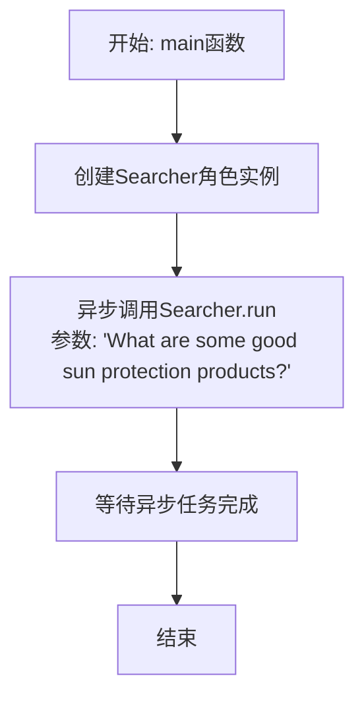

# `.\MetaGPT\examples\search_google.py` 详细设计文档

该代码是一个简单的异步脚本，其核心功能是创建一个Searcher角色实例，并调用其run方法，以异步方式执行一个关于“有哪些好的防晒产品”的搜索任务。它展示了MetaGPT框架中角色执行任务的基本模式。

## 整体流程

```mermaid
graph TD
    A[脚本开始] --> B[导入asyncio和Searcher]
    B --> C[定义异步主函数main]
    C --> D[创建Searcher实例]
    D --> E[调用Searcher.run('What are some good sun protection products?')]
    E --> F[等待异步任务完成]
    F --> G[脚本结束]
    H[__name__ == '__main__'] --> I[asyncio.run(main())]
    I --> F
```

## 类结构

```
search_google.py (主脚本)
├── 全局函数: main
└── 外部依赖类: Searcher (来自 metagpt.roles)
```

## 全局变量及字段


    

## 全局函数及方法


### `main`

这是一个异步入口函数，它创建了一个 `Searcher` 角色实例，并调用其 `run` 方法，以异步方式执行一个关于“有哪些好的防晒产品”的搜索任务。

参数：
-  `无`：`无`，此函数不接受任何参数。

返回值：`None`，此函数不返回任何值。

#### 流程图



#### 带注释源码

```python
#!/usr/bin/env python
# -*- coding: utf-8 -*-
"""
@Time    : 2023/5/7 18:32
@Author  : alexanderwu
@File    : search_google.py
"""

import asyncio

from metagpt.roles import Searcher


async def main():
    # 创建一个Searcher角色的实例
    # 异步调用其run方法，传入搜索查询字符串
    await Searcher().run("What are some good sun protection products?")


if __name__ == "__main__":
    # 程序入口：使用asyncio.run来运行异步的main函数
    asyncio.run(main())
```


### `Searcher.run`

`Searcher.run` 是 `Searcher` 角色的核心执行方法。它接收一个查询字符串，通过内部流程（可能包括调用搜索引擎、解析结果、生成总结等步骤）来获取并返回与查询相关的信息。

参数：

-  `query`：`str`，用户提出的搜索查询字符串。

返回值：`str`，搜索过程完成后返回的最终结果字符串，通常包含搜索到的信息摘要或直接答案。

#### 流程图

```mermaid
graph TD
    A[开始: Searcher.run(query)] --> B[调用内部搜索引擎或工具];
    B --> C{是否成功获取结果?};
    C -- 是 --> D[处理并格式化搜索结果];
    D --> E[返回处理后的结果字符串];
    C -- 否 --> F[处理错误或返回空/默认结果];
    F --> E;
    E --> G[结束];
```

#### 带注释源码

```python
    async def run(self, query: str) -> str:
        """
        执行搜索操作的主方法。
        Args:
            query (str): 用户输入的搜索查询。
        Returns:
            str: 搜索得到的结果。
        """
        # 1. 这里通常会调用一个搜索引擎API（例如Google Search, SerpAPI等）
        #    将查询字符串发送出去并获取原始搜索结果。
        #    raw_results = await self._search_engine.search(query)

        # 2. 对原始搜索结果进行解析、清洗和格式化。
        #    processed_results = self._process_results(raw_results)

        # 3. 可能根据角色设定（如是否总结）对结果进行进一步处理。
        #    final_result = self._summarize(processed_results) if self._config.summarize else processed_results

        # 4. 返回最终的结果字符串。
        #    return final_result

        # 注意：由于提供的代码片段中Searcher类的具体实现未给出，
        # 以上注释描述了该方法预期的典型逻辑流程。
        # 在实际代码中，应替换为具体的实现。
        raise NotImplementedError("Searcher.run 方法的具体实现需要根据Searcher类的定义来补充。")
```


## 关键组件


### Searcher 角色

Searcher 是一个基于 MetaGPT 框架的角色类，其核心功能是执行网络搜索任务。它封装了搜索逻辑，能够接收用户查询（如关于防晒产品的推荐），并异步地调用底层的搜索引擎或工具来获取相关信息。

### asyncio 异步执行框架

asyncio 是 Python 的标准异步 I/O 库，在此代码中用于管理并发操作。它通过 `asyncio.run(main())` 启动异步事件循环，执行 `Searcher().run()` 这个协程，使得搜索操作可以非阻塞地进行，提高了程序在 I/O 密集型任务（如网络请求）中的效率。

### main 入口函数

`main` 函数是程序的异步入口点。它创建了一个 `Searcher` 角色的实例，并调用其 `run` 方法，传入一个具体的搜索查询字符串（"What are some good sun protection products?"）来启动搜索流程。


## 问题及建议


### 已知问题

-   **硬编码的搜索查询**：代码中搜索查询 `"What are some good sun protection products?"` 是硬编码的，这使得脚本功能单一，无法复用或响应动态输入。
-   **缺乏配置和错误处理**：脚本没有提供任何配置选项（如API密钥、搜索引擎选择、结果数量等），也没有对网络请求失败、API限制或搜索结果为空等潜在错误进行处理。
-   **紧耦合的入口点**：`main` 函数直接实例化并运行 `Searcher` 角色，与特定的业务逻辑紧耦合，难以扩展或集成到其他需要搜索功能的模块中。
-   **潜在的异步执行问题**：直接使用 `asyncio.run(main())` 作为脚本入口是合适的，但如果此模块被导入到另一个已运行事件循环的异步环境中，可能会引发事件循环冲突。

### 优化建议

-   **参数化输入**：将搜索查询作为命令行参数或函数参数传入，例如使用 `argparse` 库或通过函数调用接收 `query` 参数，提升脚本的灵活性和可复用性。
-   **增强可配置性与健壮性**：
    -   通过配置文件、环境变量或命令行参数引入配置项（如API密钥、搜索端点、超时设置、返回结果数）。
    -   在 `Searcher().run()` 调用周围添加 `try-except` 块，捕获并处理可能出现的异常（如 `asyncio.TimeoutError`, `aiohttp.ClientError`, 或自定义的业务逻辑异常），并提供有意义的错误信息。
-   **重构为可调用组件**：将核心的搜索功能封装在一个独立的函数或类方法中（例如 `def perform_search(query: str, config: Optional[Dict] = None)`），使 `main` 函数仅负责解析参数和调用该组件。这样便于单元测试和模块化集成。
-   **明确异步上下文管理**：如果预计此模块会被导入使用，可以考虑提供一个同步的包装函数，内部处理事件循环的创建与关闭，或者明确文档说明其异步特性，要求调用者在异步上下文中使用。


## 其它


### 设计目标与约束

本模块的设计目标是提供一个简单、可扩展的异步接口，用于执行基于谷歌搜索的查询任务。其核心约束包括：
1.  **异步执行**：所有网络I/O操作必须是非阻塞的，以支持高并发场景。
2.  **角色抽象**：搜索功能被封装在`Searcher`角色类中，遵循项目的角色-动作框架，便于与其他角色（如`ProductManager`， `Architect`）协同工作。
3.  **配置化**：搜索行为（如API密钥、搜索引擎ID、结果数量）应通过配置管理，而非硬编码在代码中。
4.  **单一职责**：`search_google.py`脚本文件的主要职责是作为程序的异步入口点，初始化并运行`Searcher`角色。

### 错误处理与异常设计

当前代码示例中未显式展示错误处理逻辑，但基于`Searcher`类的典型实现，应包含以下设计：
1.  **网络请求异常**：对谷歌搜索API的调用应包裹在`try-except`块中，捕获`aiohttp.ClientError`或类似异常，并可能进行重试或降级处理。
2.  **API响应异常**：检查HTTP状态码（如非200响应）和API返回的JSON结构中的错误字段，抛出或记录自定义的业务异常（如`SearchAPIError`）。
3.  **配置缺失异常**：在`Searcher`初始化或运行时，若必需的配置（如API密钥）缺失，应抛出清晰的`ConfigurationError`异常。
4.  **异步任务管理**：在`main`函数中，应确保`asyncio.run`正确管理事件循环，并能够捕获和记录从`Searcher.run`方法中抛出的未处理异常，防止程序静默崩溃。

### 数据流与状态机

1.  **数据流**：
    *   **输入**：用户查询字符串（如“What are some good sun protection products?”）作为`Searcher.run`方法的参数。
    *   **处理**：`Searcher`内部将查询字符串与配置信息组合，构造HTTP请求发送至谷歌自定义搜索API。
    *   **转换**：接收API返回的JSON响应，解析并提取关键信息（如标题、链接、摘要），可能封装成内部定义的数据结构（如`SearchResult`对象列表）。
    *   **输出**：`Searcher.run`方法可能返回解析后的结果列表，或触发一个`Action`的`run`方法，将结果作为消息发布到项目的共享内存（`Message`）中，供其他角色消费。

2.  **状态机**（`Searcher`角色）：
    *   **初始状态**：`Searcher`对象被创建，加载配置。
    *   **就绪状态**：配置加载成功，等待接收查询指令（`Message`）。
    *   **执行状态**：调用`run`或关联的`Action`的`run`方法，执行搜索网络请求。
    *   **结果处理状态**：解析API响应，格式化结果。
    *   **完成状态**：结果返回或发布，角色任务结束。这是一个简单的线性流程，通常不涉及复杂的多状态循环。

### 外部依赖与接口契约

1.  **外部依赖**：
    *   **谷歌自定义搜索JSON API**：核心外部服务。依赖其提供的搜索能力。
    *   **`aiohttp`库**：用于发起异步HTTP请求到谷歌API。
    *   **`pydantic` / `metagpt.configs`**：可能用于配置的加载和验证。
    *   **`metagpt.roles`**：基类依赖，`Searcher`继承自`Role`基类。
    *   **`metagpt.actions`**：`Searcher`可能关联一个或多个`Action`（如`SearchAction`）来执行具体操作。
    *   **`metagpt.schema`**：依赖`Message`等基础数据结构。

2.  **接口契约**：
    *   **`Searcher.run` 方法**：
        *   **输入契约**：接受一个字符串参数`query`，代表搜索查询。
        *   **输出契约**：返回一个`Awaitable`对象（协程），其最终值可能是`List[SearchResult]`或`None`（如果结果发布到消息队列）。调用者必须使用`await`调用。
    *   **配置文件**：期望在指定路径（如`config2.yaml`）或环境变量中存在特定配置项，例如`GOOGLE_API_KEY`和`GOOGLE_SEARCH_ENGINE_ID`。`Searcher`的初始化或运行依赖于这些配置。
    *   **网络API契约**：遵循谷歌自定义搜索API的请求格式（URL、参数、Headers）和响应格式（JSON结构）。代码中的解析逻辑与API响应结构紧密耦合。

### 测试策略

1.  **单元测试**：
    *   **解析逻辑测试**：模拟API的成功JSON响应，测试`Searcher`内部方法是否能正确解析并提取出预期的`SearchResult`列表。
    *   **错误处理测试**：模拟网络异常、API返回错误状态码或畸形JSON，验证是否抛出了预期的异常或进行了正确的错误处理。
    *   **配置测试**：测试在缺少必要配置时，`Searcher`的初始化或运行是否会失败。

2.  **集成测试**：
    *   **角色集成测试**：将`Searcher`角色置于一个简单的角色协作流程中（例如，接收一个`Message`，执行搜索，发布结果），验证整个数据流是否畅通。
    *   **组件隔离测试**：使用测试专用的API密钥和搜索引擎ID，对真实的谷歌API进行少量、合规的调用，验证端到端功能。此类测试需要网络，且应谨慎控制频率和成本。

3.  **测试工具**：广泛使用`pytest`、`pytest-asyncio`、`unittest.mock`（或`pytest-mock`）来模拟（mock）外部HTTP请求和依赖项。

### 部署与运维考虑

1.  **环境变量**：敏感信息（如`GOOGLE_API_KEY`）必须通过环境变量或安全的密钥管理服务（如AWS Secrets Manager, HashiCorp Vault）注入，而非写入代码或普通配置文件。
2.  **网络访问**：部署环境必须能够访问 `https://www.googleapis.com/customsearch/v1`。
3.  **异步运行时**：生产环境部署需要兼容`asyncio`的事件循环，例如使用`uvicorn`（如果作为Web服务的一部分）或确保脚本在支持异步的上下文中运行。
4.  **监控与日志**：应在关键步骤（发送请求、收到响应、解析错误）添加结构化日志，便于监控搜索成功率、延迟和错误类型。可集成像`prometheus`的指标上报。
5.  **速率限制与配额管理**：谷歌自定义搜索API有每日配额和每秒查询率（QPS）限制。代码或部署配置中应有机制（如令牌桶、请求队列）来遵守这些限制，防止因超限导致服务中断。
6.  **成本控制**：API调用可能产生费用。需要监控API使用量，并设置预算告警。

    