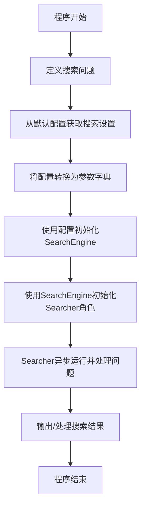

# `.\MetaGPT\examples\search_with_specific_engine.py` 详细设计文档

该代码是一个使用MetaGPT框架的异步搜索示例程序。其核心功能是：通过配置初始化一个搜索引擎，创建一个Searcher角色，并向其提出一个关于“人类最有趣事实”的问题，由该角色异步执行搜索并返回结果。

## 整体流程



## 类结构

```
外部依赖 (非本文件定义)
├── Config (配置管理类)
├── Searcher (搜索执行角色类)
└── SearchEngine (搜索引擎工具类)
```

## 全局变量及字段


### `question`
    
存储用户提出的搜索问题字符串。

类型：`str`
    


### `search`
    
从默认配置中获取的搜索引擎配置对象。

类型：`metagpt.config2.Config.search`
    


### `kwargs`
    
将搜索引擎配置对象转换为字典，用于初始化搜索引擎。

类型：`dict`
    


    

## 全局函数及方法


### `main`

该函数是程序的异步入口点，负责初始化配置，创建一个`Searcher`角色，并使用其`run`方法执行一个预设的搜索问题。

参数：
- 无显式参数。

返回值：`None`，该函数不返回任何值，其主要作用是启动并运行异步任务。

#### 流程图

```mermaid
flowchart TD
    A[开始] --> B[定义搜索问题<br>question = &quot;What are the most...&quot;]
    B --> C[获取默认配置<br>Config.default()]
    C --> D[提取搜索配置<br>search = config.search]
    D --> E[将配置转换为字典<br>kwargs = search.model_dump()]
    E --> F[实例化搜索引擎<br>SearchEngine(engine=search.api_type, **kwargs)]
    F --> G[实例化Searcher角色<br>Searcher(search_engine=...)]
    G --> H[异步执行搜索任务<br>await searcher.run(question)]
    H --> I[结束]
```

#### 带注释源码

```python
async def main():
    # 1. 定义一个具体的搜索问题字符串
    question = "What are the most interesting human facts?"

    # 2. 获取应用程序的默认配置
    config = Config.default()
    # 3. 从配置中提取搜索相关的配置项
    search_config = config.search
    # 4. 将搜索配置对象转换为字典，以便作为关键字参数传递
    kwargs = search_config.model_dump()

    # 5. 使用配置中的api_type和kwargs实例化一个搜索引擎
    search_engine = SearchEngine(engine=search_config.api_type, **kwargs)
    # 6. 使用上一步创建的搜索引擎实例化一个Searcher角色
    searcher = Searcher(search_engine=search_engine)
    # 7. 异步调用Searcher角色的run方法，执行搜索任务
    await searcher.run(question)
    # 函数执行完毕，隐式返回None
```


## 关键组件


### 配置管理 (Config)

负责加载和管理应用程序的配置，特别是搜索相关的配置项（如API类型和参数）。

### 角色系统 (Searcher Role)

一个预定义的智能体角色，其核心行为是接收问题，利用搜索引擎获取信息，并执行后续处理流程。

### 搜索引擎抽象 (SearchEngine)

一个工具类，封装了不同搜索引擎（如Google、Bing等）的调用细节，为上层角色提供统一的搜索接口。

### 异步任务执行 (asyncio)

用于管理代码的异步执行流程，确保主函数`main()`和角色`Searcher.run()`方法能够非阻塞地运行。


## 问题及建议


### 已知问题

-   **配置加载与传递方式存在耦合**：代码中通过 `Config.default().search` 获取搜索配置，并将其 `model_dump()` 后作为 `**kwargs` 传递给 `SearchEngine` 构造函数。这种方式将配置结构（`search` 对象）与 `SearchEngine` 的构造函数参数强耦合。如果 `SearchEngine` 的构造函数参数发生变化，或者 `search` 配置对象的结构发生变化，此处的代码可能会静默失败或传递错误的参数。
-   **缺乏错误处理机制**：`main` 函数和 `Searcher().run()` 调用周围没有 `try-except` 块。如果网络请求失败、API密钥无效、搜索结果解析出错或异步任务发生异常，程序会直接崩溃，无法提供有意义的错误信息或进行降级处理。
-   **硬编码的查询问题**：搜索问题 `"What are the most interesting human facts?"` 被硬编码在 `main` 函数中。这使得代码只能用于回答这个特定问题，缺乏灵活性，无法作为通用工具或服务的一部分。
-   **资源管理不明确**：代码创建了 `Searcher` 和 `SearchEngine` 实例，但没有显式地展示如何关闭或清理这些对象（例如，搜索引擎可能持有的网络会话）。在长时间运行或多次调用的场景下，可能导致资源泄漏。
-   **异步入口点单一**：脚本使用 `asyncio.run(main())` 作为入口，这适合简单脚本。但如果未来需要集成到更大的异步应用中，或者需要并发执行多个搜索任务，当前的入口点设计可能不够灵活。

### 优化建议

-   **解耦配置与对象构造**：建议创建一个明确的配置映射或工厂函数，将 `Config` 中的 `search` 对象转换为 `SearchEngine` 所需的参数。例如，可以定义一个函数 `create_search_engine_from_config(config: Config) -> SearchEngine`，在其中显式地提取和转换配置项，这样当任一方发生变化时，只需修改此函数，降低了耦合度。
-   **增加健壮的错误处理**：在 `main` 函数和 `Searcher.run` 调用周围包裹 `try-except` 块，捕获可能发生的异常（如 `asyncio.TimeoutError`, `ConnectionError`, `ValueError` 等），并记录日志或打印用户友好的错误信息。对于可恢复的错误，可以考虑重试机制。
-   **参数化搜索查询**：将搜索问题 `question` 改为通过命令行参数、环境变量、配置文件或函数参数传入。例如，使用 `argparse` 库来解析命令行参数，使脚本可以接受用户输入的问题：`python script.py "Your question here"`。
-   **明确资源生命周期管理**：如果 `SearchEngine` 或 `Searcher` 持有需要显式关闭的资源（如 `aiohttp.ClientSession`），应使用异步上下文管理器（`async with`）或在 `main` 函数结束时调用相应的清理方法。查阅相关类的文档，确保资源被正确释放。
-   **提升代码可复用性**：将核心的搜索逻辑封装到一个独立的异步函数中，例如 `async def search_and_print(question: str, config: Config):`。这样，`main` 函数只负责参数解析和调用，而核心逻辑可以被其他模块导入和复用。同时，考虑将脚本设计为可导入的模块，而不仅仅是可执行脚本。
-   **考虑配置验证**：在创建 `SearchEngine` 之前，可以添加对 `search` 配置的验证逻辑，确保必要的字段（如 `api_type`, `api_key`）存在且有效，避免将无效配置传递给下游组件。


## 其它


### 设计目标与约束

本代码的设计目标是提供一个简洁、可配置的异步命令行工具，用于通过指定的搜索引擎查询用户问题并返回结果。核心约束包括：
1.  必须异步执行以支持高效的网络I/O操作。
2.  依赖外部配置（`Config`）来动态决定使用的搜索引擎类型及其参数，确保灵活性和可扩展性。
3.  代码结构应保持简洁，主逻辑清晰，便于理解和维护。

### 错误处理与异常设计

当前代码的错误处理机制较为基础，主要依赖Python和`asyncio`的默认异常传播：
1.  **配置加载错误**：`Config.default()` 或 `search.model_dump()` 可能因配置缺失或格式错误而抛出异常，导致程序启动失败。
2.  **网络与搜索错误**：`Searcher().run()` 和内部的 `SearchEngine` 在执行网络请求或解析结果时可能抛出异常（如连接超时、API密钥无效、响应格式错误等），这些异常会向上传播，最终导致 `asyncio.run(main())` 抛出异常并终止程序。
3.  **改进建议**：缺乏显式的错误捕获和用户友好的错误信息提示。例如，可以捕获特定异常并打印清晰的错误消息，或者实现重试逻辑以提高鲁棒性。

### 数据流与状态机

本程序的数据流是线性的，不涉及复杂的状态转换：
1.  **启动**：程序入口 `asyncio.run(main())` 启动异步事件循环。
2.  **配置加载**：`main()` 函数调用 `Config.default().search` 加载搜索配置，并将其参数通过 `model_dump()` 序列化为字典。
3.  **组件初始化**：使用上一步的配置字典初始化 `SearchEngine` 实例，然后将其注入到 `Searcher` 角色实例中。
4.  **执行搜索**：调用 `Searcher.run(question)` 方法，传入用户问题。此方法内部会驱动 `SearchEngine` 执行搜索并处理结果。
5.  **输出与终止**：搜索结果显示（或处理）后，异步任务完成，事件循环停止，程序退出。
该流程是一个简单的“配置 -> 初始化 -> 执行”管道，没有分支或循环状态。

### 外部依赖与接口契约

1.  **`metagpt` 框架**：强依赖 `metagpt` 库的特定模块（`config2`, `roles`, `tools.search_engine`）。代码行为高度依赖于这些外部类的实现细节和接口稳定性。
2.  **`SearchEngine` 抽象**：`Searcher` 角色通过 `SearchEngine` 实例执行搜索操作，这要求 `SearchEngine` 或其具体实现提供 `run` 或类似的方法契约。实际的搜索引擎API（如SerpAPI、Google等）是更深层的外部依赖。
3.  **配置系统契约**：`Config.default().search` 返回的对象必须具有 `api_type` 属性和 `model_dump()` 方法，且 `model_dump()` 返回的字典必须与 `SearchEngine.__init__` 的参数兼容。
4.  **异步运行时**：依赖 `asyncio` 库作为异步执行的基础环境。

### 安全与合规考虑

1.  **敏感信息**：搜索引擎的API密钥等敏感配置通过 `Config` 管理，应确保配置文件的安全（如不在版本控制中提交明文配置）。
2.  **使用限制**：依赖的外部搜索API通常有调用频率、配额或内容限制，代码中未体现相关控制逻辑，可能存在超额使用或违反服务条款的风险。
3.  **用户隐私**：查询的问题内容会被发送到第三方服务，需注意隐私政策。代码本身未对用户输入进行过滤或脱敏处理。

### 部署与运行环境

1.  **Python环境**：需要Python解释器（脚本指定了`#!/usr/bin/env python`）并安装有 `metagpt` 库及其依赖。
2.  **异步支持**：运行环境需支持 `asyncio`。
3.  **配置准备**：运行前必须正确设置 `metagpt` 的配置文件，确保 `search` 配置段有效。
4.  **执行方式**：可直接运行脚本（`python script.py`），也可在授予执行权限后作为命令行工具运行（`./script.py`）。

### 测试策略建议

1.  **单元测试**：可对 `main()` 函数进行模拟测试，使用 `unittest.mock` 替换 `Config`、`SearchEngine` 和 `Searcher`，验证正确的初始化流程和调用参数。
2.  **集成测试**：在拥有有效测试配置的环境中，运行脚本并验证其能否成功调用搜索API并返回非空结果。
3.  **错误处理测试**：模拟配置错误、网络错误等场景，观察程序行为是否符合预期（当前预期是直接崩溃，可测试改进后的错误处理逻辑）。

    