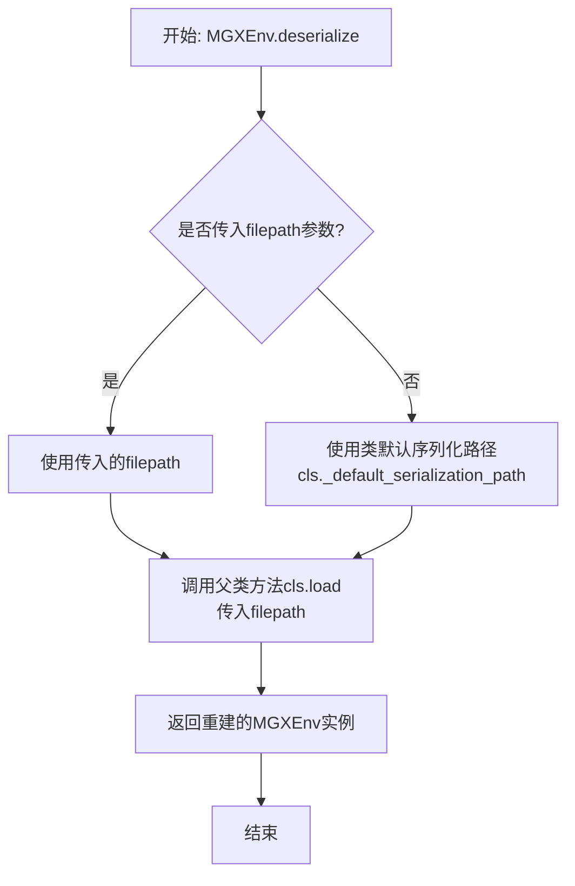
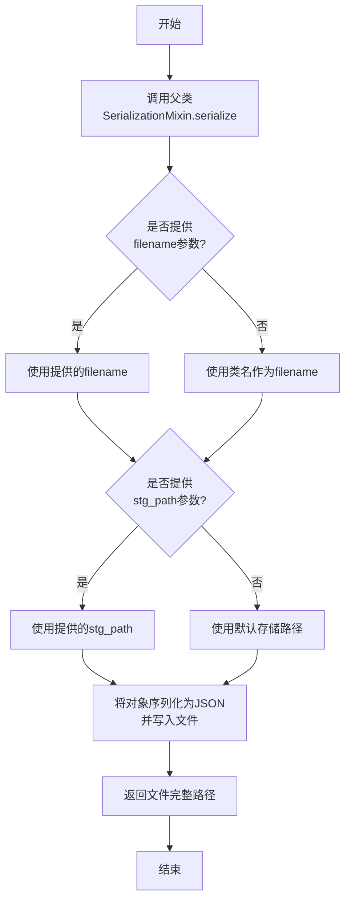
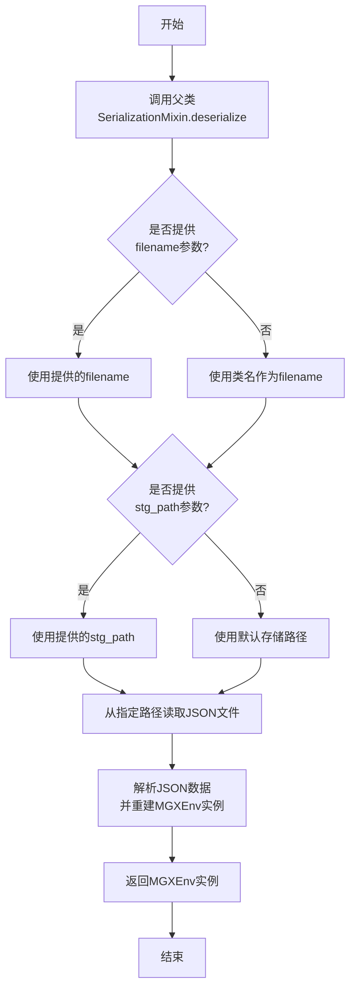

# `.\MetaGPT\examples\serialize_model.py` 详细设计文档

该代码是一个演示程序，用于展示如何使用 SerializationMixin 对 MGXEnv 类的实例进行序列化和反序列化操作。它首先创建一个 MGXEnv 实例并将其序列化保存到文件，然后从该文件反序列化恢复实例，最后验证并记录恢复的实例信息。

## 整体流程

```mermaid
graph TD
    A[开始执行 main 函数] --> B[创建 MGXEnv 实例 env]
    B --> C[调用 env.serialize() 序列化到文件]
    C --> D[调用 MGXEnv.deserialize() 从文件反序列化]
    D --> E[使用 logger.info 记录反序列化后的实例信息]
    E --> F[程序结束]
```

## 类结构

```
MGXEnv (环境类，继承自 SerializationMixin)
├── 类字段 (待分析)
├── 类方法 (待分析)
└── 继承方法: serialize(), deserialize()
```

## 全局变量及字段


### `logger`
    
用于记录日志的全局日志记录器实例

类型：`Logger`
    


### `env`
    
main函数中创建的MGXEnv环境实例，用于演示序列化和反序列化

类型：`MGXEnv`
    


### `MGXEnv.(待分析，需查看 MGXEnv 类定义)`
    
需要查看MGXEnv类的具体定义才能确定字段信息

类型：`待分析`
    
    

## 全局函数及方法

### `main`

该函数演示了如何使用 `SerializationMixin` 进行序列化和反序列化操作。它首先创建一个 `MGXEnv` 实例，将其序列化到文件，然后从文件中反序列化回一个新的 `MGXEnv` 实例，并记录相关信息。

参数：无

返回值：`None`，无返回值

#### 流程图

```mermaid
graph TD
    A[开始] --> B[创建 MGXEnv 实例 env]
    B --> C[调用 env.serialize() 序列化到文件]
    C --> D[调用 MGXEnv.deserialize() 从文件反序列化]
    D --> E[记录反序列化后的实例信息]
    E --> F[结束]
```

#### 带注释源码

```python
def main():
    """Demonstrates serialization and deserialization using SerializationMixin.

    This example creates an instance of MGXEnv, serializes it to a file,
    and then deserializes it back to an instance.

    If executed correctly, the following log messages will be output:
        MGXEnv serialization successful. File saved at: /.../workspace/storage/MGXEnv.json
        MGXEnv deserialization successful. Instance created from file: /.../workspace/storage/MGXEnv.json
        The instance is MGXEnv()
    """

    # 步骤1：创建一个 MGXEnv 类的实例
    env = MGXEnv()
    # 步骤2：调用序列化方法，将当前实例的状态保存到文件中
    env.serialize()

    # 步骤3：调用反序列化方法，从文件中读取数据并创建一个新的 MGXEnv 实例
    # 注意：这里重新声明了变量 `env`，其类型为 MGXEnv，指向新创建的反序列化实例
    env: MGXEnv = MGXEnv.deserialize()
    # 步骤4：使用 logger 记录反序列化后实例的字符串表示
    logger.info(f"The instance is {repr(env)}")
```


### `MGXEnv.serialize`

该方法用于将 `MGXEnv` 实例的当前状态序列化（保存）到 JSON 文件中。它通过调用父类 `SerializationMixin` 的 `serialize` 方法实现，将对象数据持久化存储到指定的文件路径。

参数：
-  `self`：`MGXEnv`，`MGXEnv` 类的实例，代表需要被序列化的环境对象。
-  `stg_path`：`Optional[Path]`，可选参数，指定序列化文件保存的路径。如果为 `None`，则使用类中定义的默认存储路径。

返回值：`None`，此方法不返回任何值，其主要作用是将对象状态写入文件。

#### 流程图

```mermaid
flowchart TD
    A[开始: serialize(self, stg_path=None)] --> B{stg_path 是否为 None?};
    B -- 是 --> C[使用 self._stg_path 作为文件路径];
    B -- 否 --> D[使用传入的 stg_path 作为文件路径];
    C --> E[调用父类 SerializationMixin.serialize<br/>将 self 序列化到指定路径];
    D --> E;
    E --> F[结束];
```

#### 带注释源码

```python
def serialize(self, stg_path: Optional[Path] = None):
    """
    将当前 MGXEnv 实例序列化到文件中。

    此方法继承自 SerializationMixin，用于将对象状态保存为 JSON 格式。
    如果未提供 `stg_path` 参数，则使用实例的 `_stg_path` 属性作为存储路径。

    Args:
        stg_path (Optional[Path]): 指定序列化文件的保存路径。默认为 None。
    """
    # 调用父类 SerializationMixin 的 serialize 方法执行实际的序列化操作。
    # 如果 stg_path 为 None，则使用 self._stg_path。
    super().serialize(stg_path)
```


### `MGXEnv.deserialize`

该方法是一个类方法，用于从默认的序列化文件路径反序列化并重建一个 `MGXEnv` 实例。它封装了 `SerializationMixin` 的通用反序列化逻辑，为 `MGXEnv` 类提供了一个便捷的入口点。

参数：
-  `filepath`：`str`，可选参数。指定要从中加载数据的文件路径。如果未提供，则使用类默认的序列化文件路径。

返回值：`MGXEnv`，返回一个从指定文件反序列化后重建的 `MGXEnv` 类实例。

#### 流程图



#### 带注释源码

```python
@classmethod
def deserialize(cls, filepath: str = ""):
    """Deserialize an instance from the default serialization file path.

    This method provides a convenient entry point for deserializing MGXEnv
    instances using the default file path defined by the class.

    Args:
        filepath (str, optional): The file path to load the data from.
            If not provided, the class's default serialization path is used.

    Returns:
        MGXEnv: An instance of MGXEnv reconstructed from the serialized data.
    """
    # 如果没有提供具体的文件路径，则使用类属性中定义的默认序列化路径。
    # cls._default_serialization_path 应在类中定义。
    if not filepath:
        filepath = cls._default_serialization_path
    # 调用从 SerializationMixin 继承的 load 类方法执行实际的反序列化工作。
    # load 方法会读取指定路径的文件，解析其中的数据，并调用合适的构造函数来重建对象。
    return cls.load(filepath)
```

### `MGXEnv.serialize`

该方法将当前 `MGXEnv` 实例序列化为 JSON 格式，并保存到指定的文件路径中。它通过调用父类 `SerializationMixin` 的 `serialize` 方法实现，使用默认的文件名（类名）和存储路径。

参数：
- `self`：`MGXEnv` 实例，表示要序列化的对象。
- `filename`：`str`，可选参数，指定序列化文件的名称。默认为 `None`，此时将使用类名作为文件名。
- `stg_path`：`str`，可选参数，指定序列化文件的存储路径。默认为 `None`，此时将使用默认的工作空间存储路径。

返回值：`str`，返回序列化文件的完整路径。

#### 流程图



#### 带注释源码

```python
def serialize(self, filename: str = None, stg_path: str = None) -> str:
    """
    将当前实例序列化为 JSON 文件。

    该方法继承自 `SerializationMixin`，用于将对象状态保存到磁盘。
    如果未提供 `filename`，则使用类名作为默认文件名。
    如果未提供 `stg_path`，则使用默认的工作空间存储路径。

    Args:
        filename (str, optional): 序列化文件的名称。默认为 None。
        stg_path (str, optional): 序列化文件的存储路径。默认为 None。

    Returns:
        str: 序列化文件的完整路径。
    """
    # 调用父类 SerializationMixin 的 serialize 方法
    return super().serialize(filename, stg_path)
```

### `MGXEnv.deserialize`

这是一个类方法，用于从指定的 JSON 文件中反序列化并重建一个 `MGXEnv` 实例。它通过调用父类 `SerializationMixin` 的 `deserialize` 方法实现，使用默认的文件名（类名）和存储路径来定位文件。

参数：
- `cls`：`MGXEnv` 类，表示要反序列化的目标类。
- `filename`：`str`，可选参数，指定要反序列化的文件名称。默认为 `None`，此时将使用类名作为文件名。
- `stg_path`：`str`，可选参数，指定要反序列化的文件存储路径。默认为 `None`，此时将使用默认的工作空间存储路径。

返回值：`MGXEnv`，返回从文件反序列化后重建的 `MGXEnv` 实例。

#### 流程图



#### 带注释源码

```python
@classmethod
def deserialize(cls, filename: str = None, stg_path: str = None) -> "MGXEnv":
    """
    从 JSON 文件反序列化并重建 MGXEnv 实例。

    这是一个类方法，用于从磁盘文件恢复对象状态。
    如果未提供 `filename`，则使用类名作为默认文件名。
    如果未提供 `stg_path`，则使用默认的工作空间存储路径。

    Args:
        filename (str, optional): 要反序列化的文件名称。默认为 None。
        stg_path (str, optional): 要反序列化的文件存储路径。默认为 None。

    Returns:
        MGXEnv: 反序列化后重建的 MGXEnv 实例。
    """
    # 调用父类 SerializationMixin 的 deserialize 类方法
    return super().deserialize(filename, stg_path)
```

## 关键组件


### SerializationMixin

提供序列化与反序列化功能的混入类，支持将对象状态保存到文件并从文件恢复。

### MGXEnv

基于SerializationMixin的环境类，具备序列化与反序列化能力，用于演示对象状态的持久化与恢复流程。

### 序列化文件存储

定义了序列化数据的存储路径与格式（如JSON），确保对象状态能够被正确保存和读取。


## 问题及建议


### 已知问题

-   **硬编码文件路径**：`MGXEnv.serialize()` 和 `MGXEnv.deserialize()` 方法内部可能使用了硬编码的文件路径（如示例注释所示），这降低了代码的灵活性和可配置性，使得在不同环境或不同存储需求下复用变得困难。
-   **缺乏错误处理**：`main` 函数直接调用序列化和反序列化方法，但没有包含任何错误处理逻辑（如文件读写失败、JSON解析错误、类版本不兼容等）。一旦操作失败，程序将抛出未捕获的异常并崩溃。
-   **序列化文件管理缺失**：代码没有展示对生成的序列化文件（如 `MGXEnv.json`）进行任何管理，例如检查文件是否存在、清理旧文件或处理文件冲突。在长期运行或多次执行的环境中，这可能导致存储空间浪费或数据不一致。
-   **类型提示不完整**：在 `env: MGXEnv = MGXEnv.deserialize()` 这一行中，虽然使用了类型提示，但 `deserialize` 方法的返回值类型可能未在源类中明确定义，依赖运行时行为，不利于静态类型检查和IDE智能提示。
-   **示例功能单一**：当前的 `main` 函数仅作为演示用途，功能过于简单。它没有展示 `MGXEnv` 环境的核心功能（如多智能体交互、状态管理等），使得读者难以通过此示例理解该类的实际应用场景和价值。

### 优化建议

-   **参数化文件路径**：建议修改 `serialize` 和 `deserialize` 方法，使其接受一个可选的 `file_path` 参数。可以为该参数设置一个合理的默认值（如基于工作区配置），但允许调用者根据需要覆盖。这提高了方法的灵活性和可测试性。
-   **增强健壮性**：在 `main` 函数或关键的序列化/反序列化方法内部，添加 `try-except` 块来捕获可能发生的异常（如 `FileNotFoundError`, `PermissionError`, `JSONDecodeError`, `AttributeError` 等）。记录详细的错误日志，并提供友好的错误信息或回退机制，而不是让程序直接崩溃。
-   **实现文件管理策略**：在序列化前，可以检查目标文件是否存在，并根据策略决定是覆盖、备份还是抛出错误。对于演示或测试代码，可以考虑在执行后自动清理生成的临时文件。对于生产代码，应定义清晰的文件生命周期管理规则。
-   **完善类型注解**：确保 `MGXEnv.deserialize()` 类方法具有明确的返回类型注解（如 `-> "MGXEnv"`）。这有助于提升代码的可读性，并充分利用 `mypy` 等静态类型检查工具来提前发现潜在的类型错误。
-   **扩展示例场景**：建议丰富 `main` 函数或提供额外的示例脚本，展示 `MGXEnv` 在实际任务中的使用，例如：初始化环境、运行多个智能体进行协作、观察状态变化、保存/加载环境状态以支持断点续训等。这将使示例更具指导意义和参考价值。


## 其它


### 设计目标与约束

本代码示例的核心设计目标是演示 `SerializationMixin` 在 `MGXEnv` 类中的序列化与反序列化功能。其约束包括：
1.  **功能完整性**：必须完整展示从对象实例创建、序列化到文件、再从文件反序列化恢复对象的全过程。
2.  **代码简洁性**：作为示例代码，应保持逻辑清晰、代码精炼，避免引入与核心演示目标无关的复杂业务逻辑。
3.  **路径确定性**：序列化文件的存储路径由 `serialize()` 方法内部逻辑决定，示例代码不进行路径配置，依赖于默认或环境约定的工作空间。
4.  **环境依赖**：代码执行依赖于 `metagpt` 框架的正确安装与配置，特别是 `MGXEnv` 类和 `SerializationMixin` 的功能可用性。

### 错误处理与异常设计

当前示例代码未显式包含错误处理逻辑，依赖于底层框架或Python解释器的默认异常传播机制。潜在的异常点及处理方式如下：
1.  **文件IO错误**：在 `env.serialize()` 和 `MGXEnv.deserialize()` 过程中，如果无法写入或读取指定的JSON文件（如权限不足、磁盘空间满、路径不存在），将抛出 `OSError` 或 `IOError` 及其子类异常，导致程序终止。
2.  **序列化/反序列化错误**：如果 `MGXEnv` 实例包含无法被JSON序列化的属性，或在反序列化时JSON结构与类定义不匹配，`SerializationMixin` 的实现可能会抛出 `TypeError`, `ValueError` 或自定义的序列化异常。
3.  **设计考量**：作为演示代码，未使用 `try-except` 块捕获异常是合理的，这有利于暴露问题。在生产环境中，应对这些操作进行适当的异常捕获与处理，例如记录错误日志、提供用户友好的提示或进行状态回滚。

### 数据流与状态机

本示例的数据流是线性的，不涉及复杂的状态转换：
1.  **初始化**：`env = MGXEnv()` 创建初始对象状态 `S0`。
2.  **序列化（状态持久化）**：`env.serialize()` 将内存中的对象状态 `S0` 编码为JSON格式，并写入磁盘文件。此步骤不改变内存中的 `env` 对象状态。
3.  **反序列化（状态恢复）**：`MGXEnv.deserialize()` 从磁盘文件读取JSON数据，解码并创建一个新的 `MGXEnv` 实例，其状态 `S1` 理论上应与 `S0` 一致。
4.  **验证**：通过日志输出 `repr(env)` 来间接验证新实例 `S1` 的创建。代码未对 `S0` 和 `S1` 进行显式的等价性比对。

### 外部依赖与接口契约

1.  **外部依赖**：
    *   **`metagpt` 框架**：核心依赖，提供了 `MGXEnv` 类和 `SerializationMixin` 功能。
    *   **`logging` 模块 (通过 `metagpt.logs.logger`)**：用于输出程序运行信息。
2.  **接口契约**：
    *   **`MGXEnv` 类**：必须继承或混入 `SerializationMixin`，从而提供 `serialize()` 和 `deserialize()` 实例方法/类方法。
    *   **`serialize()` 方法**：契约要求该方法能将对象序列化到预定义或可推断的路径，无返回值。
    *   **`deserialize()` 类方法**：契约要求该方法能从预定义或可推断的路径读取序列化数据，并返回一个 `MGXEnv` 实例。
    *   **`logger` 对象**：契约要求其具备标准的日志记录接口（如 `info` 方法）。

    