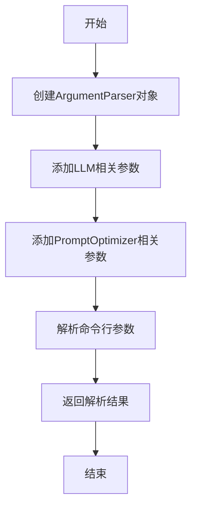
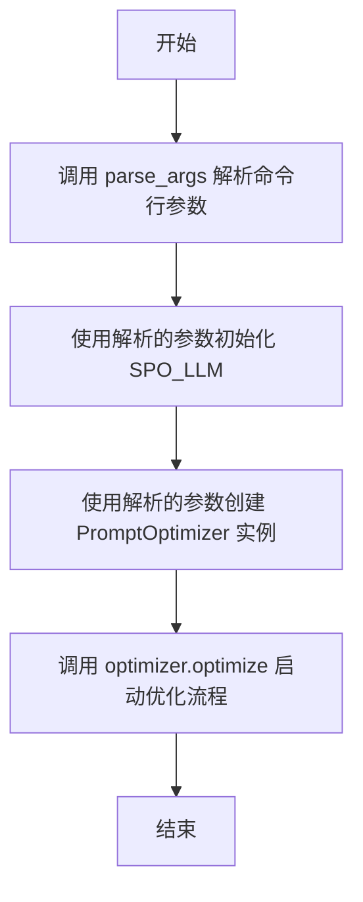
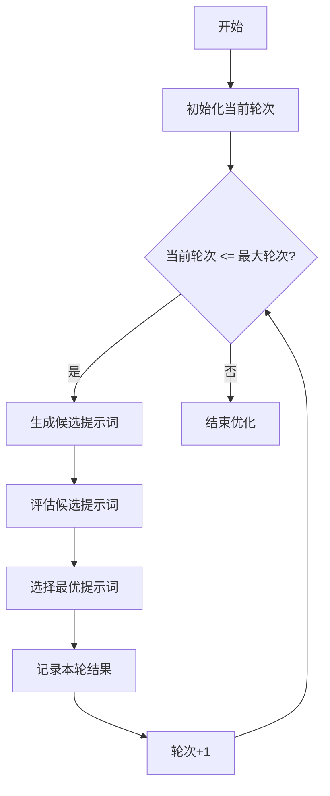
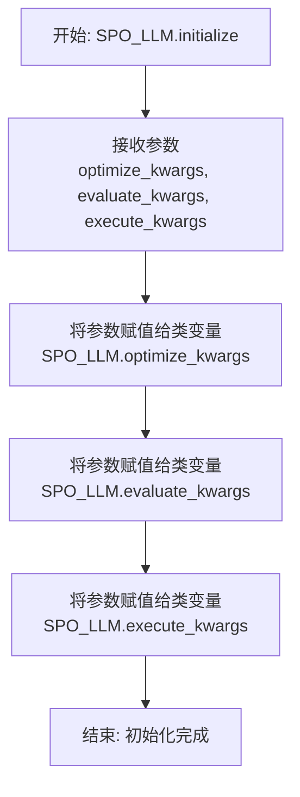

# `.\MetaGPT\examples\spo\optimize.py` 详细设计文档

该代码是一个命令行接口（CLI）工具，用于启动和配置一个提示词优化器（PromptOptimizer）。它通过解析命令行参数来配置优化、评估和执行任务所需的大语言模型（LLM）参数，以及优化器本身的运行参数（如工作空间、轮次、模板等），然后初始化LLM客户端并启动优化流程。

## 整体流程

```mermaid
graph TD
    A[程序启动] --> B[调用 parse_args 解析命令行参数]
    B --> C[调用 main 函数]
    C --> D[使用解析的参数初始化 SPO_LLM]
    D --> E[使用解析的参数实例化 PromptOptimizer]
    E --> F[调用 optimizer.optimize() 开始优化流程]
    F --> G[优化结束，程序退出]
```

## 类结构

```
外部依赖
├── argparse (Python标准库)
├── PromptOptimizer (来自 metagpt.ext.spo.components.optimizer)
└── SPO_LLM (来自 metagpt.ext.spo.utils.llm_client)
```

## 全局变量及字段


### `PromptOptimizer.optimized_path`
    
存储优化后输出文件的路径，用于保存优化过程中的结果和中间文件。

类型：`str`
    


### `PromptOptimizer.initial_round`
    
指定优化过程的起始轮次，用于控制优化迭代的起点。

类型：`int`
    


### `PromptOptimizer.max_rounds`
    
设置优化过程的最大轮次限制，防止无限循环并控制优化成本。

类型：`int`
    


### `PromptOptimizer.template`
    
指定用于优化的模板文件名称，定义了优化任务的基本结构和约束。

类型：`str`
    


### `PromptOptimizer.name`
    
标识优化项目的名称，用于生成输出文件和日志的命名前缀。

类型：`str`
    
    

## 全局函数及方法

### `parse_args`

该函数用于解析命令行参数，为SPO PromptOptimizer CLI工具提供配置选项。它定义了与LLM模型参数和PromptOptimizer运行参数相关的命令行接口，并返回解析后的参数对象。

参数：
- 无显式参数，但通过命令行传递参数。

返回值：`argparse.Namespace`，包含所有解析后的命令行参数及其值的命名空间对象。

#### 流程图



#### 带注释源码

```python
def parse_args():
    # 创建ArgumentParser对象，设置CLI工具的描述
    parser = argparse.ArgumentParser(description="SPO PromptOptimizer CLI")

    # LLM parameter
    # 添加优化模型参数，指定模型名称，默认值为"claude-3-5-sonnet-20240620"
    parser.add_argument("--opt-model", type=str, default="claude-3-5-sonnet-20240620", help="Model for optimization")
    # 添加优化温度参数，控制模型输出的随机性，默认值为0.7
    parser.add_argument("--opt-temp", type=float, default=0.7, help="Temperature for optimization")
    # 添加评估模型参数，指定模型名称，默认值为"gpt-4o-mini"
    parser.add_argument("--eval-model", type=str, default="gpt-4o-mini", help="Model for evaluation")
    # 添加评估温度参数，默认值为0.3
    parser.add_argument("--eval-temp", type=float, default=0.3, help="Temperature for evaluation")
    # 添加执行模型参数，指定模型名称，默认值为"gpt-4o-mini"
    parser.add_argument("--exec-model", type=str, default="gpt-4o-mini", help="Model for execution")
    # 添加执行温度参数，默认值为0
    parser.add_argument("--exec-temp", type=float, default=0, help="Temperature for execution")

    # PromptOptimizer parameter
    # 添加工作空间路径参数，指定优化输出路径，默认值为"workspace"
    parser.add_argument("--workspace", type=str, default="workspace", help="Path for optimized output")
    # 添加初始轮次参数，指定优化起始轮次，默认值为1
    parser.add_argument("--initial-round", type=int, default=1, help="Initial round number")
    # 添加最大轮次参数，指定优化最大轮次，默认值为10
    parser.add_argument("--max-rounds", type=int, default=10, help="Maximum number of rounds")
    # 添加模板文件参数，指定模板文件名称，默认值为"Poem.yaml"
    parser.add_argument("--template", type=str, default="Poem.yaml", help="Template file name")
    # 添加项目名称参数，指定项目名称，默认值为"Poem"
    parser.add_argument("--name", type=str, default="Poem", help="Project name")

    # 解析命令行参数并返回结果
    return parser.parse_args()
```

### `main`

该函数是SPO PromptOptimizer CLI的入口点。它负责解析命令行参数，初始化LLM客户端，创建PromptOptimizer实例，并启动优化流程。

参数：
- 无显式参数。函数通过`parse_args()`内部解析命令行参数。

返回值：`None`，无返回值。

#### 流程图



#### 带注释源码

```python
def main():
    # 1. 解析命令行参数，获取配置信息
    args = parse_args()

    # 2. 使用解析出的参数初始化全局LLM客户端（SPO_LLM）
    #    分别配置优化、评估和执行任务所使用的模型和温度参数
    SPO_LLM.initialize(
        optimize_kwargs={"model": args.opt_model, "temperature": args.opt_temp},
        evaluate_kwargs={"model": args.eval_model, "temperature": args.eval_temp},
        execute_kwargs={"model": args.exec_model, "temperature": args.exec_temp},
    )

    # 3. 使用解析出的参数创建PromptOptimizer优化器实例
    #    参数包括工作空间路径、初始轮次、最大轮次、模板文件和项目名称
    optimizer = PromptOptimizer(
        optimized_path=args.workspace,
        initial_round=args.initial_round,
        max_rounds=args.max_rounds,
        template=args.template,
        name=args.name,
    )

    # 4. 启动优化器的核心优化流程
    optimizer.optimize()
```

### `PromptOptimizer.optimize`

该方法启动并执行提示词优化的主循环。它通过迭代地生成、评估和选择最优的提示词版本来优化给定的提示词模板，直到达到预设的最大轮次或满足停止条件。

参数：
- `self`：`PromptOptimizer`，`PromptOptimizer`类的实例，包含优化所需的所有配置和状态。

返回值：`None`，该方法不返回任何值，其执行结果（如优化的提示词、评估分数等）会保存在实例状态或输出到指定工作区。

#### 流程图



#### 带注释源码

```python
def optimize(self):
    """
    执行提示词优化的主循环。
    该方法会迭代多轮，每轮生成新的候选提示词，评估其效果，并选择最优的版本。
    循环持续直到达到最大轮次或满足其他停止条件。
    """
    # 初始化当前轮次为配置的初始轮次
    current_round = self.initial_round
    # 主循环：当当前轮次小于等于最大轮次时继续
    while current_round <= self.max_rounds:
        # 生成新的候选提示词版本
        candidates = self._generate_candidates()
        # 评估所有候选提示词的效果
        evaluations = self._evaluate_candidates(candidates)
        # 根据评估结果选择最优的提示词
        best_candidate = self._select_best_candidate(candidates, evaluations)
        # 记录本轮的最优结果（例如保存到文件或更新内部状态）
        self._record_round_result(current_round, best_candidate)
        # 轮次递增，准备下一轮迭代
        current_round += 1
    # 循环结束，优化完成
    # 可能包含最终结果的汇总或清理工作
```

### `SPO_LLM.initialize`

该方法用于初始化`SPO_LLM`类，配置其内部用于优化、评估和执行任务的不同LLM（大语言模型）的参数。它是一个类方法，旨在集中设置不同操作阶段所使用的模型及其温度参数。

参数：

- `optimize_kwargs`：`dict`，一个字典，包含用于优化任务的LLM配置，如模型名称和温度参数。
- `evaluate_kwargs`：`dict`，一个字典，包含用于评估任务的LLM配置，如模型名称和温度参数。
- `execute_kwargs`：`dict`，一个字典，包含用于执行任务的LLM配置，如模型名称和温度参数。

返回值：`None`，此方法不返回任何值，其作用是为`SPO_LLM`类的静态字段赋值。

#### 流程图



#### 带注释源码

```python
    @classmethod
    def initialize(
        cls,
        optimize_kwargs: dict,
        evaluate_kwargs: dict,
        execute_kwargs: dict,
    ):
        """
        初始化SPO_LLM类，设置不同操作（优化、评估、执行）的LLM参数。
        
        Args:
            optimize_kwargs (dict): 优化任务使用的LLM参数，例如 {"model": "claude-3-5-sonnet", "temperature": 0.7}
            evaluate_kwargs (dict): 评估任务使用的LLM参数，例如 {"model": "gpt-4o-mini", "temperature": 0.3}
            execute_kwargs (dict): 执行任务使用的LLM参数，例如 {"model": "gpt-4o-mini", "temperature": 0}
        """
        # 将传入的参数字典分别赋值给类的静态变量，供后续其他方法调用
        cls.optimize_kwargs = optimize_kwargs
        cls.evaluate_kwargs = evaluate_kwargs
        cls.execute_kwargs = execute_kwargs
```

## 关键组件


### SPO_LLM

一个用于管理不同任务（优化、评估、执行）的LLM客户端配置的单例或工具类，支持为每个任务独立设置模型和温度参数。

### PromptOptimizer

一个提示词优化器，负责通过多轮迭代（初始轮次和最大轮次可配置）来优化给定的提示词模板，并将优化结果输出到指定工作空间。

### 命令行参数解析

一个用于解析用户输入的命令行参数的功能模块，允许用户配置LLM模型参数、优化器参数（如工作空间路径、迭代轮次、模板文件、项目名称）等。


## 问题及建议


### 已知问题

-   **硬编码的默认值**：代码中多个LLM模型名称（如 `"claude-3-5-sonnet-20240620"`, `"gpt-4o-mini"`）和文件路径（如 `"workspace"`, `"Poem.yaml"`）被硬编码为默认参数。这降低了代码的灵活性，当需要更换默认模型或模板时，必须修改源代码。
-   **缺乏输入验证**：`parse_args` 函数解析命令行参数后，没有对参数值进行有效性验证。例如，`--max-rounds` 可能被设置为负数或零，`--workspace` 可能指向一个不可写的路径，这可能导致程序在运行时出现意外错误或产生无效结果。
-   **紧耦合的配置初始化**：`SPO_LLM.initialize` 的调用与 `PromptOptimizer` 的实例化紧密耦合在 `main` 函数中。这种结构使得在单元测试中模拟或替换 `SPO_LLM` 的配置变得困难，降低了代码的可测试性。
-   **有限的错误处理**：`main` 函数和 `optimizer.optimize()` 调用周围没有异常处理逻辑。如果网络请求失败、文件读写出错或LLM API返回异常，程序会直接崩溃，无法提供友好的错误信息或进行优雅的降级处理。
-   **单线程/进程设计**：当前的 `optimizer.optimize()` 调用很可能是同步且阻塞的。对于需要多轮优化或处理多个提示词的任务，这种设计无法利用多核优势，效率可能成为瓶颈。

### 优化建议

-   **外部化配置**：将默认的模型名称、温度参数、文件路径等配置项移出代码，放入配置文件（如 `config.yaml` 或 `.env` 文件）中。通过环境变量或配置文件管理，提升部署的灵活性和安全性。
-   **增强参数验证**：在 `parse_args` 函数或 `main` 函数开始时，添加参数验证逻辑。例如，检查 `--max-rounds` 是否为正整数，`--workspace` 路径是否存在且可写，温度参数是否在合理范围（如0.0到2.0之间）等，并在验证失败时给出清晰的错误提示。
-   **解耦与依赖注入**：重构 `main` 函数，将 `SPO_LLM.initialize` 和 `PromptOptimizer` 的创建逻辑分离。考虑使用工厂模式或依赖注入容器来管理这些组件的生命周期，这将显著提高代码的可测试性和可维护性。
-   **添加全面的异常处理**：在 `main` 函数中使用 `try-except` 块包裹核心逻辑，捕获可能发生的异常（如 `ValueError`, `IOError`, `ConnectionError` 等），并记录详细的日志或向用户输出有意义的错误信息，确保程序健壮性。
-   **引入并发或异步处理**：评估 `PromptOptimizer.optimize` 方法内部的工作流。如果涉及多个独立的LLM调用（优化、评估、执行），可以考虑将其重构为异步模式（使用 `asyncio`）或引入任务队列，以提升整体执行效率，特别是在进行大规模提示词优化时。


## 其它


### 设计目标与约束

本代码是一个命令行接口（CLI）工具，用于启动和配置一个提示词（Prompt）优化流程。其核心设计目标是提供一个灵活、可配置的入口点，允许用户通过命令行参数指定优化过程所需的各种模型参数和运行参数，从而驱动底层的 `PromptOptimizer` 组件完成自动化提示词迭代优化任务。主要约束包括：依赖外部命令行参数解析；强依赖于 `metagpt.ext.spo` 模块中的 `PromptOptimizer` 和 `SPO_LLM` 组件；运行流程是线性的、一次性的，不支持交互式操作或后台服务模式。

### 错误处理与异常设计

当前代码中的错误处理机制较为基础。在 `main` 函数中，整个优化流程 `optimizer.optimize()` 的调用没有包含在 `try-except` 块中，这意味着任何在参数解析、LLM初始化或优化过程中抛出的异常都将直接导致程序崩溃，并向用户输出原始的异常堆栈信息。这虽然有利于调试，但对最终用户不友好。代码缺乏对常见错误（如无效的文件路径、网络连接失败、API密钥错误、输入参数范围错误等）的预检查和优雅处理。错误处理的责任主要委托给了 `argparse` 库（用于基本参数类型验证）和底层被调用的类与方法。

### 数据流与状态机

程序的数据流清晰且单向：
1.  **输入**：用户通过命令行提供的参数。
2.  **处理**：
    a. `parse_args` 函数解析参数并存储在 `args` 对象中。
    b. `main` 函数使用 `args` 中的配置初始化全局 LLM 客户端 `SPO_LLM`。
    c. `main` 函数使用 `args` 中的配置实例化 `PromptOptimizer`。
    d. 调用 `optimizer.optimize()` 方法，启动核心优化循环。在此方法内部，可能会涉及读取模板文件、调用LLM进行优化、评估、执行等多轮迭代，并最终将优化结果输出到指定工作空间。
3.  **输出**：优化过程生成的最终提示词及相关文件，保存到 `--workspace` 参数指定的目录中。
程序本身不维护一个复杂的状态机，其“状态”体现在 `PromptOptimizer` 实例的内部，用于跟踪当前优化轮次、历史结果等，以决定是否继续迭代或终止。

### 外部依赖与接口契约

1.  **外部模块/库依赖**：
    *   `argparse`: Python 标准库，用于解析命令行参数。
    *   `metagpt.ext.spo.components.optimizer.PromptOptimizer`: 核心优化器类，提供了 `__init__` 和 `optimize` 方法。本代码作为其驱动层。
    *   `metagpt.ext.spo.utils.llm_client.SPO_LLM`: 全局LLM客户端单例或工具类，提供了 `initialize` 静态/类方法，用于配置不同用途（优化、评估、执行）的LLM参数。
2.  **接口契约**：
    *   与 `PromptOptimizer` 的契约：通过其构造函数传入 `optimized_path`, `initial_round`, `max_rounds`, `template`, `name` 参数，并调用其 `optimize` 方法启动流程。
    *   与 `SPO_LLM` 的契约：调用其 `initialize` 方法，并传入一个字典，该字典必须包含 `optimize_kwargs`, `evaluate_kwargs`, `execute_kwargs` 这三个键，对应的值也是包含 `model` 和 `temperature` 等键的字典。这定义了底层LLM调用所需的配置格式。
    *   与操作系统的契约：通过 `--workspace` 参数约定文件输出位置，通过 `--template` 参数约定输入模板文件的名称（可能相对于某个预设路径）。
    *   与用户的契约：通过命令行参数定义了一套配置接口，用户必须遵循此格式提供输入。

    