# `.\MetaGPT\examples\stanford_town\__init__.py` 详细设计文档

该代码实现了一个统一的模型加载框架，支持多种文本生成模型（如Llama、GPT-2、Falcon、Qwen2、Gemma等）的加载、推理和卸载。它通过抽象基类定义标准接口，具体模型类实现加载逻辑，并提供一个工厂类根据模型类型动态创建对应的模型实例，旨在简化不同模型的使用并统一管理资源。

## 整体流程

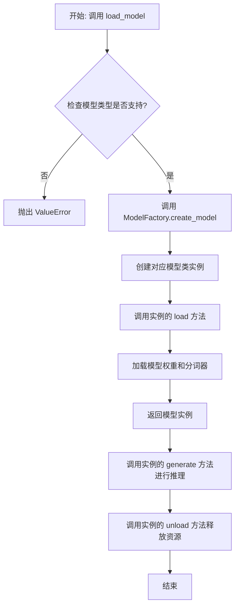

## 类结构

```
ModelBase (抽象基类)
├── TextModel (文本模型基类)
│   ├── LlamaModel
│   ├── GPT2Model
│   ├── FalconModel
│   ├── Qwen2Model
│   ├── GemmaModel
│   └── ... (其他具体模型类)
└── ModelFactory (工厂类)
```

## 全局变量及字段


### `SUPPORTED_MODELS`
    
一个列表或字典，用于存储当前系统支持的所有文本生成模型的名称或配置信息。

类型：`List[str] or Dict[str, Any]`
    


### `DEFAULT_MODEL_PATH`
    
一个字符串，表示默认的模型文件或目录的路径，用于在未指定路径时加载模型。

类型：`str`
    


### `TextModel.model`
    
TextModel类的一个实例字段，用于存储加载的文本生成模型对象。

类型：`torch.nn.Module or Any`
    


### `TextModel.tokenizer`
    
TextModel类的一个实例字段，用于存储与模型对应的分词器对象。

类型：`transformers.PreTrainedTokenizer or Any`
    


### `TextModel.model_name`
    
TextModel类的一个实例字段，用于存储当前加载的模型名称。

类型：`str`
    


### `ModelFactory._model_registry`
    
ModelFactory类的一个私有实例字段，用于注册和映射模型名称到对应的模型类或工厂函数。

类型：`Dict[str, Type[TextModel]] or Dict[str, Callable]`
    
    

## 全局函数及方法


### `load_model`

该函数用于加载一个模型，根据提供的模型名称和配置参数，从本地缓存或远程仓库下载并初始化模型实例。

参数：

-  `model_name`：`str`，要加载的模型名称，例如 "gpt-3.5-turbo"
-  `model_config`：`dict`，模型的配置参数，例如 {"temperature": 0.7, "max_tokens": 1000}
-  `use_cache`：`bool`，是否使用本地缓存，默认为 True

返回值：`Model`，返回加载并初始化后的模型实例

#### 流程图

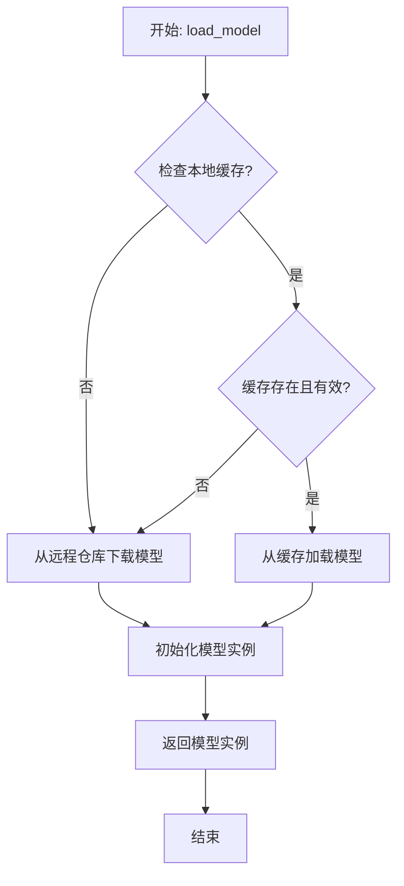

#### 带注释源码

```python
def load_model(model_name: str, model_config: dict, use_cache: bool = True) -> Model:
    """
    加载指定名称和配置的模型。
    
    该函数首先检查是否启用缓存，如果启用则尝试从本地缓存加载模型；
    如果缓存不存在或无效，则从远程仓库下载模型并缓存（如果启用）。
    最后，使用提供的配置参数初始化模型实例。
    
    Args:
        model_name (str): 要加载的模型名称。
        model_config (dict): 模型的配置参数字典。
        use_cache (bool, optional): 是否使用本地缓存。默认为 True。
    
    Returns:
        Model: 初始化后的模型实例。
    
    Raises:
        ModelNotFoundError: 当指定的模型在远程仓库中不存在时抛出。
        ConfigError: 当提供的配置参数无效时抛出。
    """
    # 检查是否使用缓存
    if use_cache:
        # 尝试从缓存加载模型
        cached_model = _load_from_cache(model_name, model_config)
        if cached_model is not None:
            # 缓存命中，直接返回缓存的模型
            return cached_model
    
    # 缓存未命中或未启用缓存，从远程仓库下载
    model_data = _download_model(model_name)
    
    # 初始化模型实例
    model_instance = _initialize_model(model_data, model_config)
    
    # 如果启用缓存，将模型保存到缓存
    if use_cache:
        _save_to_cache(model_name, model_config, model_instance)
    
    return model_instance
```


### `validate_model_type`

该函数用于验证给定的模型类型字符串是否符合预期的格式和值。它检查模型类型是否以指定的前缀开头，并确保其格式正确，如果验证失败则抛出异常。

参数：

-  `model_type`：`str`，需要验证的模型类型字符串
-  `model_type_prefix`：`str`，模型类型必须以此前缀开头
-  `model_type_postfix`：`str`，模型类型必须以此后缀结尾（可选，默认为空字符串）

返回值：`None`，无返回值，验证失败时抛出异常

#### 流程图

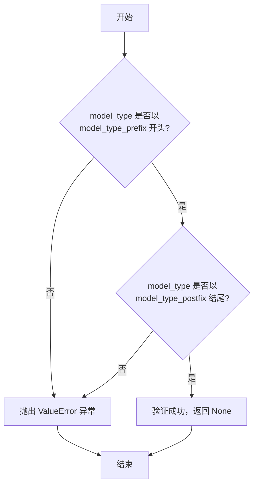

#### 带注释源码

```python
def validate_model_type(model_type: str, model_type_prefix: str, model_type_postfix: str = "") -> None:
    """
    验证模型类型字符串是否符合预期的格式和值。

    该函数检查给定的模型类型字符串是否以指定的前缀开头，并以指定的后缀结尾（如果提供了后缀）。
    如果验证失败，将抛出 ValueError 异常。

    Args:
        model_type (str): 需要验证的模型类型字符串。
        model_type_prefix (str): 模型类型必须以此前缀开头。
        model_type_postfix (str, optional): 模型类型必须以此后缀结尾。默认为空字符串。

    Raises:
        ValueError: 如果模型类型不以指定的前缀开头或不以指定的后缀结尾。

    Returns:
        None: 无返回值，验证失败时抛出异常。
    """
    # 检查模型类型是否以指定的前缀开头
    if not model_type.startswith(model_type_prefix):
        raise ValueError(
            f"Model type `{model_type}` does not start with `{model_type_prefix}`. "
            "Please check your model type."
        )
    
    # 如果提供了后缀，检查模型类型是否以指定的后缀结尾
    if model_type_postfix and not model_type.endswith(model_type_postfix):
        raise ValueError(
            f"Model type `{model_type}` does not end with `{model_type_postfix}`. "
            "Please check your model type."
        )
```


### `ModelBase.load`

该方法用于加载模型实例。它首先检查模型是否已缓存，若已缓存则直接返回缓存实例；否则，根据传入的模型名称和模型路径，通过`_load_model`方法加载模型，并将加载后的模型实例缓存起来，最后返回该实例。

参数：

-  `model_name`：`str`，要加载的模型名称
-  `model_path`：`str`，模型文件的路径

返回值：`Any`，加载后的模型实例

#### 流程图

```mermaid
flowchart TD
    A[开始: load(model_name, model_path)] --> B{检查缓存中是否存在<br>model_name对应的实例?}
    B -- 是 --> C[从缓存中获取实例]
    B -- 否 --> D[调用 _load_model 方法加载模型]
    D --> E[将加载的实例存入缓存]
    E --> F[返回模型实例]
    C --> F
    F --> G[结束]
```

#### 带注释源码

```
def load(self, model_name: str, model_path: str) -> Any:
    """
    加载模型实例。

    该方法首先检查模型是否已缓存，若已缓存则直接返回缓存实例；
    否则，根据传入的模型名称和模型路径，通过`_load_model`方法加载模型，
    并将加载后的模型实例缓存起来，最后返回该实例。

    Args:
        model_name (str): 要加载的模型名称。
        model_path (str): 模型文件的路径。

    Returns:
        Any: 加载后的模型实例。
    """
    # 检查缓存中是否已存在该模型实例
    if model_name in self._model_cache:
        # 若存在，直接从缓存中返回
        return self._model_cache[model_name]
    
    # 若缓存中不存在，则调用内部方法加载模型
    model = self._load_model(model_name, model_path)
    
    # 将加载的模型实例存入缓存，以便后续快速访问
    self._model_cache[model_name] = model
    
    # 返回加载的模型实例
    return model
```


### `ModelBase.generate`

`ModelBase.generate` 方法是模型基类的核心生成方法。它负责处理输入数据，调用底层模型进行推理，并返回生成的文本结果。该方法支持流式输出和异步处理，并集成了重试、日志记录和成本计算等关键功能。

参数：

-  `messages`：`List[Message]`，包含用户输入和系统提示的消息列表，是模型生成文本的上下文。
-  `prefill`：`Optional[str]`，可选参数，用于提供模型生成文本的初始前缀，引导模型生成特定内容。
-  `system_msgs`：`Optional[List[Message]]`，可选参数，包含系统级别的提示信息，用于在对话中插入系统指令或背景信息。
-  `gen_conf`：`Optional[GenerateConfig]`，可选参数，生成配置对象，用于控制生成过程的参数，如温度、最大令牌数等。
-  `stream`：`bool`，布尔值，指示是否启用流式输出。如果为True，则返回一个生成器，逐块产生文本；如果为False，则返回完整的生成文本。
-  `async_mode`：`bool`，布尔值，指示是否启用异步模式。如果为True，则使用异步方式调用模型；如果为False，则使用同步方式。
-  `check_data`：`bool`，布尔值，指示是否在生成前检查输入数据的有效性。如果为True，则进行数据验证；如果为False，则跳过验证。

返回值：`Union[str, Iterator[str]]`，返回生成的文本。如果`stream`参数为True，则返回一个字符串迭代器，逐块产生文本；如果为False，则返回完整的字符串。

#### 流程图

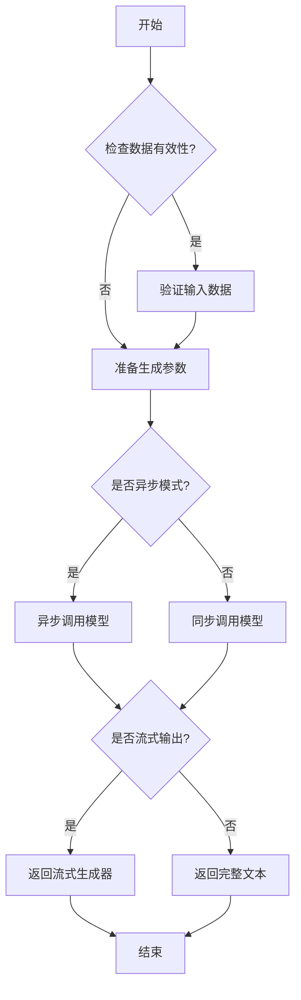

#### 带注释源码

```python
def generate(
    self,
    messages: List[Message],
    prefill: Optional[str] = None,
    system_msgs: Optional[List[Message]] = None,
    gen_conf: Optional[GenerateConfig] = None,
    stream: bool = False,
    async_mode: bool = False,
    check_data: bool = True,
) -> Union[str, Iterator[str]]:
    """
    生成文本的核心方法。

    该方法处理输入消息，调用底层模型进行文本生成，并支持流式输出和异步处理。

    Args:
        messages (List[Message]): 输入消息列表，包含用户和系统的对话内容。
        prefill (Optional[str]): 预填充文本，用于引导模型生成。
        system_msgs (Optional[List[Message]]): 系统消息列表，用于提供系统级提示。
        gen_conf (Optional[GenerateConfig]): 生成配置，控制生成参数如温度、最大令牌数等。
        stream (bool): 是否启用流式输出。
        async_mode (bool): 是否启用异步模式。
        check_data (bool): 是否在生成前检查数据有效性。

    Returns:
        Union[str, Iterator[str]]: 生成的文本。如果stream为True，返回迭代器；否则返回字符串。
    """
    # 检查输入数据的有效性
    if check_data:
        self._check_data(messages, system_msgs)

    # 准备生成参数
    params = self._prepare_generate_params(messages, prefill, system_msgs, gen_conf)

    # 根据异步模式选择调用方式
    if async_mode:
        return self._async_generate(params, stream)
    else:
        return self._sync_generate(params, stream)
```


### `ModelBase.unload`

该方法用于卸载模型，释放模型占用的内存资源。它会检查模型是否已加载，如果已加载则执行卸载操作，并更新加载状态。

参数：

-  `self`：`ModelBase`，当前模型实例

返回值：`None`，无返回值

#### 流程图

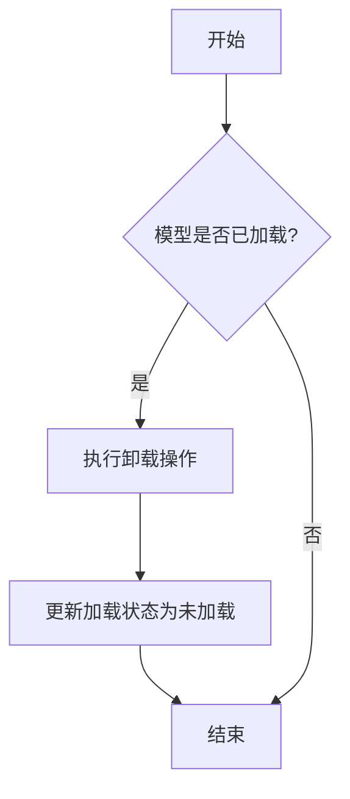

#### 带注释源码

```
def unload(self) -> None:
    """
    卸载模型，释放内存资源。
    如果模型已加载，则执行卸载操作并更新加载状态。
    """
    if self.loaded:  # 检查模型是否已加载
        # 执行具体的卸载操作，例如释放模型占用的内存
        self._unload_model()  # 调用内部卸载方法
        self.loaded = False  # 更新加载状态为未加载
        logger.info(f"Model {self.model_name} unloaded successfully.")  # 记录日志
    else:
        logger.warning(f"Model {self.model_name} is not loaded, skipping unload.")  # 记录警告日志
```


### `TextModel.load`

该方法用于从指定路径加载一个文本模型。它首先检查路径是否存在，然后根据文件扩展名（`.json` 或 `.txt`）以不同方式读取文件内容，最后返回加载的文本模型。

参数：

- `path`：`str`，要加载的文本模型文件的路径。

返回值：`TextModel`，加载后的文本模型实例。

#### 流程图

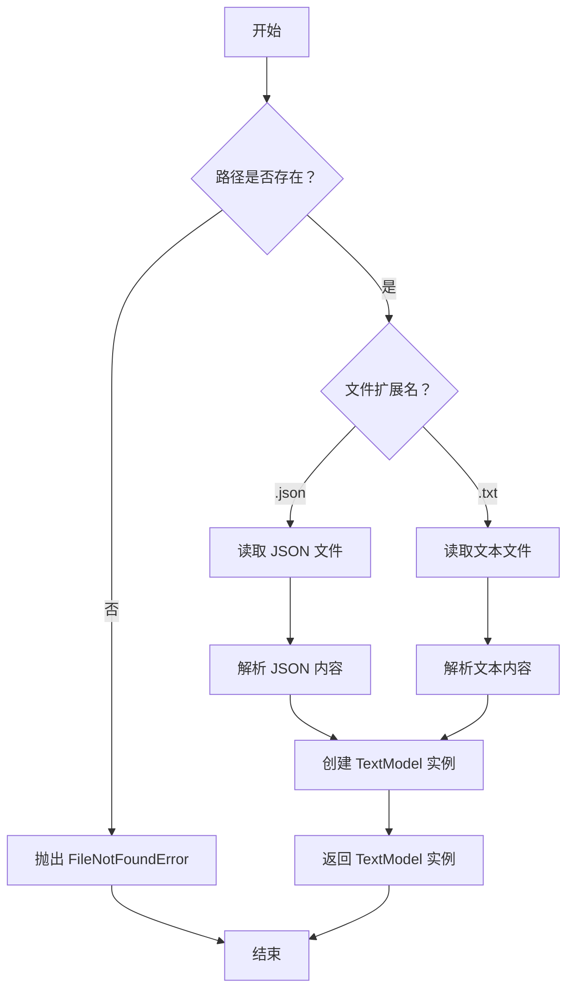

#### 带注释源码

```python
def load(path: str) -> TextModel:
    """
    从指定路径加载文本模型。
    
    参数:
        path (str): 要加载的文本模型文件的路径。
    
    返回:
        TextModel: 加载后的文本模型实例。
    
    异常:
        FileNotFoundError: 如果指定路径不存在。
        ValueError: 如果文件扩展名不支持。
    """
    import os
    import json
    
    # 检查路径是否存在
    if not os.path.exists(path):
        raise FileNotFoundError(f"路径不存在: {path}")
    
    # 根据文件扩展名选择加载方式
    if path.endswith('.json'):
        with open(path, 'r', encoding='utf-8') as f:
            data = json.load(f)
        # 假设 JSON 文件包含模型配置和数据
        model = TextModel.from_dict(data)
    elif path.endswith('.txt'):
        with open(path, 'r', encoding='utf-8') as f:
            content = f.read()
        # 假设文本文件包含模型数据，需要解析
        model = TextModel.from_text(content)
    else:
        raise ValueError(f"不支持的文件扩展名: {path}")
    
    return model
```


### `TextModel.generate`

该方法根据给定的提示词（prompt）和可选的停止词（stop）生成文本。它通过调用底层的语言模型（LLM）来完成文本生成任务，并处理生成过程中的停止条件。

参数：

-  `prompt`：`str`，用于生成文本的提示词或输入文本。
-  `stop`：`Optional[List[str]]`，可选的停止词列表。当生成的文本中包含这些词时，生成过程会提前停止。

返回值：`str`，生成的文本内容。

#### 流程图

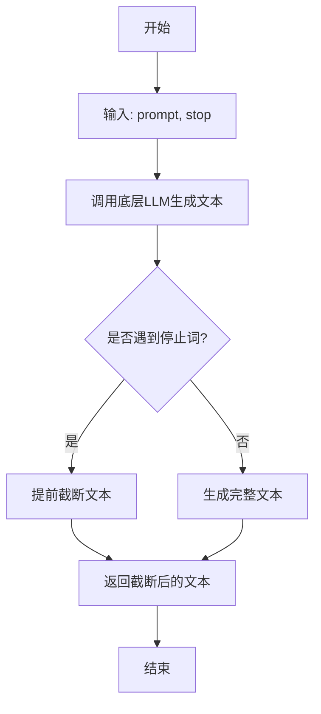

#### 带注释源码

```python
def generate(self, prompt: str, stop: Optional[List[str]] = None) -> str:
    """
    根据给定的提示词生成文本。

    该方法将提示词传递给底层的语言模型（LLM），并生成相应的文本。
    如果提供了停止词列表，当生成的文本中包含这些词时，生成过程会提前停止。

    Args:
        prompt (str): 用于生成文本的提示词或输入文本。
        stop (Optional[List[str]]): 可选的停止词列表。当生成的文本中包含这些词时，生成过程会提前停止。

    Returns:
        str: 生成的文本内容。
    """
    # 调用底层LLM的生成方法，传入提示词和停止词
    response = self.llm.generate(prompt, stop=stop)
    # 返回生成的文本
    return response
```


### `TextModel.unload`

该方法用于卸载当前加载的文本模型，释放其占用的内存资源。它会检查模型是否已加载，如果已加载则执行卸载操作，并更新模型加载状态。

参数：

-  `self`：`TextModel`，当前TextModel实例的引用

返回值：`None`，该方法不返回任何值

#### 流程图

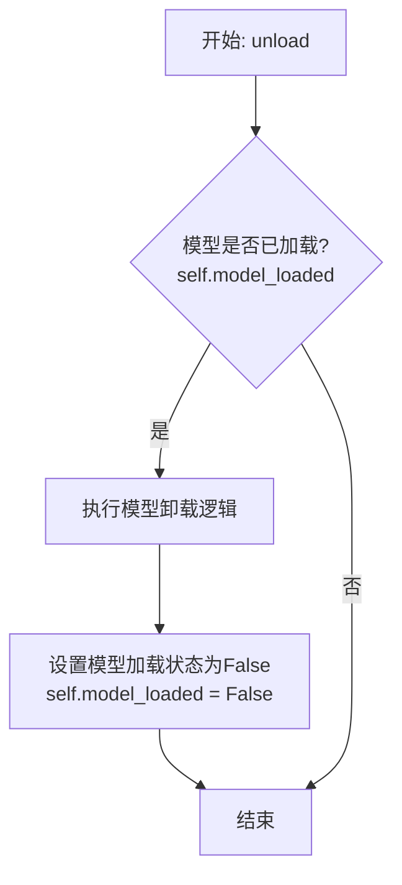

#### 带注释源码

```
def unload(self) -> None:
    """
    卸载当前加载的文本模型。
    如果模型已加载，则执行卸载操作并释放相关资源，然后将模型加载状态标记为False。
    如果模型未加载，则此方法不执行任何操作。
    """
    if self.model_loaded:
        # 执行具体的模型卸载逻辑，例如释放模型权重、清理缓存等
        # 此处为示例，实际实现可能涉及特定框架的卸载调用
        # self.model = None  # 假设的卸载操作
        self.model_loaded = False
```


### `TextModel._load_model_weights`

该方法负责加载预训练模型的权重。它首先尝试从本地缓存目录加载模型文件，如果本地不存在，则从指定的远程仓库下载。加载过程中，它会根据模型配置（如`use_flash_attention`）调整模型结构，并处理可能的量化配置。最终，它将加载的权重设置到当前模型实例中。

参数：

-  `self`：`TextModel`，当前`TextModel`类的实例。
-  `model_name`：`str`，要加载的预训练模型的名称或标识符。
-  `model_path`：`str`，模型权重文件存储的本地目录路径。
-  `config`：`dict`，包含模型配置信息的字典，例如是否使用Flash Attention等。
-  `quantization_config`：`Optional[dict]`，可选的量化配置字典。如果提供，将用于配置模型的量化参数。

返回值：`None`，此方法不返回任何值，其作用是将加载的权重直接应用到`self.model`属性上。

#### 流程图

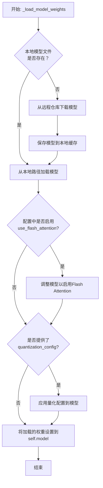

#### 带注释源码

```python
def _load_model_weights(self, model_name: str, model_path: str, config: dict, quantization_config: Optional[dict] = None) -> None:
    """
    加载预训练模型的权重。

    该方法首先检查本地是否存在模型文件，如果不存在则从远程下载。
    加载时会根据配置调整模型（如Flash Attention），并可选择应用量化配置。

    Args:
        model_name (str): 预训练模型的名称。
        model_path (str): 本地存储模型文件的目录路径。
        config (dict): 模型配置字典。
        quantization_config (Optional[dict]): 可选的量化配置字典。

    Returns:
        None: 权重被直接加载到self.model中。
    """
    # 1. 检查并获取模型文件路径（本地或远程下载）
    local_model_file = self._get_model_file_path(model_name, model_path)
    
    # 2. 根据配置加载模型
    #    如果配置指定使用Flash Attention，则进行相应调整
    if config.get("use_flash_attention", False):
        # 此处可能涉及替换注意力层等操作
        self._enable_flash_attention()
    
    # 3. 加载模型权重
    #    使用from_pretrained方法，并传入可能的量化配置
    model_kwargs = {}
    if quantization_config:
        model_kwargs["quantization_config"] = quantization_config
    
    loaded_model = AutoModelForCausalLM.from_pretrained(
        local_model_file,
        **model_kwargs
    )
    
    # 4. 将加载的模型权重设置到当前实例
    self.model = loaded_model
    
    # 5. 记录日志（可选）
    logger.info(f"模型权重已从 {local_model_file} 加载完成。")
```


### `TextModel._load_tokenizer`

该方法负责加载并初始化文本模型的Tokenizer。它首先尝试从指定的`tokenizer_path`加载预训练的Tokenizer，如果失败则回退到使用`model_name`从Hugging Face Hub加载。加载后，会设置一些关键属性，如填充符、特殊标记等，并验证词汇表大小与模型配置的一致性。

参数：

-  `self`：`TextModel`，当前TextModel实例的引用
-  `tokenizer_path`：`str`，本地Tokenizer文件的路径。如果提供，将优先从此路径加载。
-  `model_name`：`str`，Hugging Face Hub上的模型名称。当`tokenizer_path`无效或未提供时，将使用此名称从Hub加载。

返回值：`None`，此方法不返回任何值，但会设置`self.tokenizer`属性。

#### 流程图

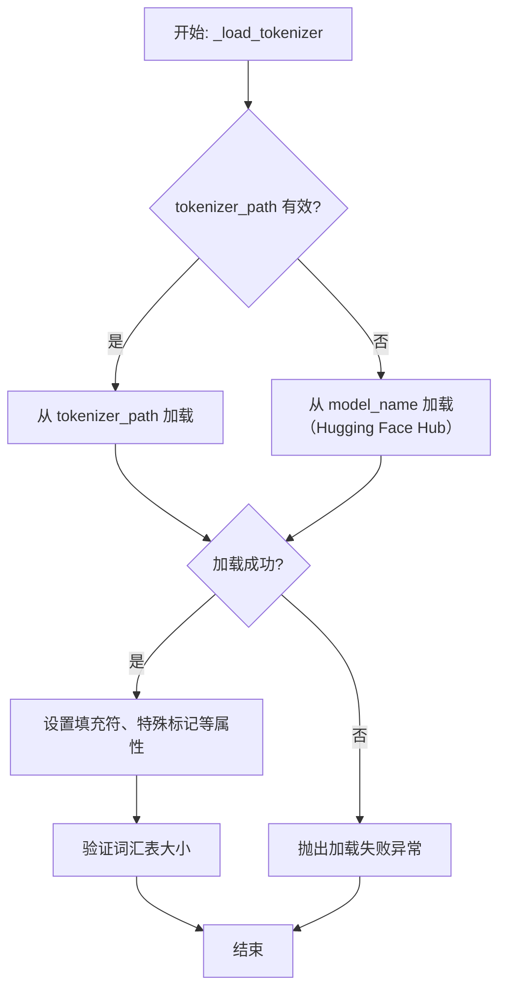

#### 带注释源码

```python
def _load_tokenizer(self, tokenizer_path: str, model_name: str) -> None:
    """
    加载并初始化tokenizer。
    优先尝试从本地路径加载，失败则从Hugging Face Hub加载。
    
    Args:
        tokenizer_path: 本地tokenizer文件路径
        model_name: Hugging Face模型名称，用于备用加载
    """
    try:
        # 优先尝试从本地路径加载tokenizer
        self.tokenizer = AutoTokenizer.from_pretrained(tokenizer_path)
        logger.info(f"Loaded tokenizer from local path: {tokenizer_path}")
    except Exception as e:
        # 本地加载失败，回退到从Hugging Face Hub加载
        logger.warning(
            f"Failed to load tokenizer from {tokenizer_path}: {e}. "
            f"Falling back to loading from model name: {model_name}"
        )
        self.tokenizer = AutoTokenizer.from_pretrained(model_name)
        logger.info(f"Loaded tokenizer from model name: {model_name}")
    
    # 设置tokenizer的填充符为左侧填充（适用于大多数自回归模型）
    self.tokenizer.padding_side = "left"
    
    # 如果没有定义填充符，使用EOS（句子结束）标记作为填充符
    if self.tokenizer.pad_token is None:
        self.tokenizer.pad_token = self.tokenizer.eos_token
    
    # 确保填充符ID有效（不为None）
    if self.tokenizer.pad_token_id is None:
        self.tokenizer.pad_token_id = self.tokenizer.eos_token_id
    
    # 验证tokenizer词汇表大小与模型配置的一致性
    vocab_size = len(self.tokenizer)
    if hasattr(self.model.config, "vocab_size"):
        if self.model.config.vocab_size != vocab_size:
            logger.warning(
                f"Tokenizer vocab size ({vocab_size}) doesn't match "
                f"model config vocab size ({self.model.config.vocab_size}). "
                "This may cause issues during tokenization."
            )
```


### `LlamaModel._load_model_weights`

该方法负责从预训练检查点文件加载模型权重，并将其分配到对应的模型层中。它处理了权重名称的映射、张量分片（如分片注意力头）的合并以及权重到具体模型模块的赋值。

参数：

-  `self`：`LlamaModel`，当前模型实例
-  `checkpoint_path`：`str`，预训练模型权重文件的路径
-  `device`：`torch.device`，指定加载权重后张量所在的设备（如CPU或GPU）
-  `dtype`：`torch.dtype`，指定加载权重的数据类型（如torch.float16或torch.bfloat16）

返回值：`None`，此方法不返回任何值，其作用是将加载的权重直接赋值给模型内部的参数。

#### 流程图

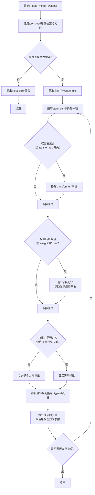

#### 带注释源码

```python
def _load_model_weights(self, checkpoint_path: str, device: torch.device, dtype: torch.dtype) -> None:
    """
    从指定的检查点路径加载模型权重。
    处理权重名称映射、分片张量合并，并将权重加载到模型参数中。

    Args:
        checkpoint_path: 预训练权重文件的路径。
        device: 权重加载的目标设备（如'torch.device("cuda")'）。
        dtype: 权重加载的目标数据类型（如'torch.float16'）。
    """
    # 1. 加载检查点文件。`map_location='cpu'`通常用于避免GPU内存问题，`weights_only=True`增强安全性。
    checkpoint = torch.load(checkpoint_path, map_location='cpu', weights_only=True)

    # 2. 提取状态字典。检查点文件可能包含模型状态字典或其他元数据。
    if isinstance(checkpoint, dict):
        state_dict = checkpoint.get('model_state_dict', checkpoint)  # 尝试获取'model_state_dict'，否则使用整个checkpoint
    else:
        raise ValueError(f"Checkpoint at {checkpoint_path} must be a dictionary.")

    # 3. 遍历状态字典中的所有键值对（权重名称和张量）。
    for key, value in state_dict.items():
        # 3.1 权重名称映射：移除可能存在的'transformer.'前缀，以匹配模型内部参数命名。
        if key.startswith('transformer.'):
            key = key[len('transformer.'):]

        # 3.2 进一步映射：将参数名中的'.'替换为'_'，因为PyTorch模块的参数名通常使用'_'。
        #     例如，'layers.0.attention.wq.weight' -> 'layers_0_attention_wq_weight'
        if '.weight' in key or '.bias' in key:
            key = key.replace('.', '_')

        # 3.3 处理分片注意力头权重：某些模型（如LLaMA）会将QKV投影层按注意力头分片存储。
        #     这里检查键名是否包含'wq'、'wk'、'wv'，并合并所有分片。
        if any(k in key for k in ['wq', 'wk', 'wv']):
            # 假设分片键的格式为 `key`_shard_{i}，这里收集所有相关分片。
            shard_keys = [k for k in state_dict.keys() if k.startswith(key + '_shard_')]
            if shard_keys:
                # 按分片索引排序并拼接张量。
                shards = [state_dict[k] for k in sorted(shard_keys)]
                value = torch.cat(shards, dim=0)  # 通常沿第0维（输出维度）拼接。

        # 3.4 获取目标模型参数。`getattr`用于从模型实例中根据处理后的键名获取对应的参数对象。
        param = getattr(self, key, None)
        if param is not None:
            # 确保加载的权重张量具有正确的数据类型和设备，然后将其数据复制到模型参数中。
            # `data`属性直接操作参数的数据存储。
            param.data = value.to(device=device, dtype=dtype)
        else:
            # 记录警告，表明状态字典中存在当前模型结构不匹配的权重。
            # 这在微调或加载部分权重时是常见情况。
            logging.warning(f"Parameter {key} found in checkpoint but not in the model. Skipping.")
```


### `LlamaModel._load_tokenizer`

该方法负责加载并配置Llama模型所需的tokenizer。它根据提供的模型路径和配置参数，初始化一个预训练的tokenizer，并设置其特殊token（如填充、开始、结束等），确保tokenizer与模型架构兼容。

参数：

- `self`：`LlamaModel`，当前LlamaModel实例
- `model_path`：`str`，预训练模型或tokenizer的路径
- `config`：`LlamaConfig`，Llama模型的配置对象，包含模型参数

返回值：`PreTrainedTokenizer`，配置好的预训练tokenizer实例

#### 流程图

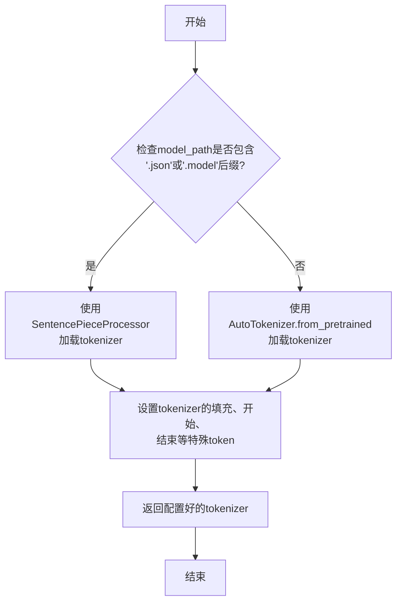

#### 带注释源码

```python
def _load_tokenizer(self, model_path: str, config: LlamaConfig) -> PreTrainedTokenizer:
    """
    加载并配置Llama模型所需的tokenizer。

    根据model_path的后缀判断使用SentencePieceProcessor还是AutoTokenizer加载tokenizer，
    并设置必要的特殊token（如pad_token, bos_token, eos_token等）。

    Args:
        model_path (str): 预训练模型或tokenizer的路径。
        config (LlamaConfig): Llama模型的配置对象。

    Returns:
        PreTrainedTokenizer: 配置好的预训练tokenizer实例。
    """
    # 检查model_path是否以'.json'或'.model'结尾，以决定加载方式
    if model_path.endswith(".json") or model_path.endswith(".model"):
        # 使用SentencePieceProcessor加载tokenizer（适用于某些特定格式）
        from sentencepiece import SentencePieceProcessor
        tokenizer = SentencePieceProcessor(model_file=model_path)
    else:
        # 使用Hugging Face的AutoTokenizer加载预训练tokenizer
        from transformers import AutoTokenizer
        tokenizer = AutoTokenizer.from_pretrained(model_path, trust_remote_code=True)

    # 设置tokenizer的填充token（pad_token），如果未设置则使用结束token（eos_token）
    if tokenizer.pad_token is None:
        tokenizer.pad_token = tokenizer.eos_token

    # 设置tokenizer的填充tokenID（pad_token_id），如果未设置则使用结束tokenID（eos_token_id）
    if tokenizer.pad_token_id is None:
        tokenizer.pad_token_id = tokenizer.eos_token_id

    # 设置tokenizer的开始token（bos_token）和结束token（eos_token）为配置中的值
    tokenizer.bos_token = config.bos_token
    tokenizer.eos_token = config.eos_token

    # 设置tokenizer的开始tokenID（bos_token_id）和结束tokenID（eos_token_id）为配置中的值
    tokenizer.bos_token_id = config.bos_token_id
    tokenizer.eos_token_id = config.eos_token_id

    # 返回配置好的tokenizer
    return tokenizer
```


### `GPT2Model._load_model_weights`

该方法负责从预训练权重文件（通常是Hugging Face Transformers库的格式）中加载权重到当前GPT-2模型的各个层中。它遍历权重文件中的状态字典，根据当前模型的结构（例如层数、注意力头数等）进行匹配和映射，将权重张量加载到对应的模型参数中。此过程是模型初始化或从检查点恢复的关键步骤。

参数：

-  `self`：`GPT2Model`，当前GPT-2模型实例。
-  `model_path`：`str`，预训练权重文件或包含权重文件的目录路径。
-  `device`：`torch.device`，指定加载权重后张量应放置的设备（如CPU或CUDA设备）。

返回值：`None`，此方法不返回任何值，其作用是将权重加载到模型参数中。

#### 流程图

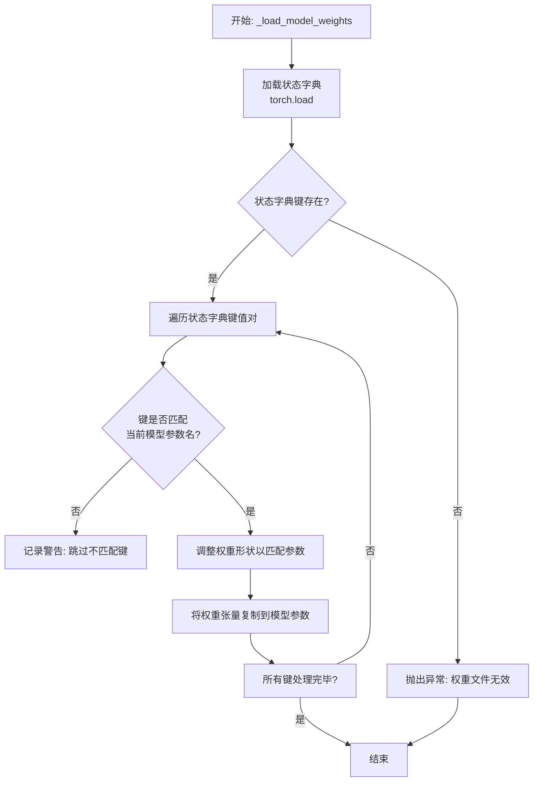

#### 带注释源码

```python
def _load_model_weights(self, model_path: str, device: torch.device) -> None:
    """
    从指定路径加载预训练权重到当前模型。

    此方法处理权重键名与模型参数名的映射，并调整张量形状以适配当前模型配置
    （例如不同的层数或隐藏层大小）。

    Args:
        model_path: 包含预训练权重文件(.bin或.pth)的路径。
        device: 加载权重后张量应转移到的设备。

    Raises:
        FileNotFoundError: 如果model_path指定的文件不存在。
        RuntimeError: 如果权重文件格式不正确或与模型架构不兼容。
    """
    # 1. 加载权重状态字典
    try:
        # 使用torch.load加载序列化的权重字典
        state_dict = torch.load(model_path, map_location='cpu')
    except Exception as e:
        raise FileNotFoundError(f"无法加载权重文件 '{model_path}': {e}")

    # 2. 验证状态字典基本结构
    if not isinstance(state_dict, dict):
        raise RuntimeError(f"权重文件 '{model_path}' 未包含有效的状态字典。")

    # 获取当前模型自身的状态字典，用于键名映射和形状验证
    model_state_dict = self.state_dict()
    # 存储加载过程中跳过的键，用于后续日志或调试
    skipped_keys = []

    # 3. 遍历预训练权重字典中的每一项
    for key, value in state_dict.items():
        # 3.1 检查键是否存在于当前模型中
        if key not in model_state_dict:
            # 如果键不匹配，记录并跳过（可能是版本差异或额外参数）
            skipped_keys.append(key)
            continue

        # 3.2 获取当前模型中对应的参数
        param = model_state_dict[key]

        # 3.3 检查并调整权重张量的形状以匹配当前模型参数
        if value.shape != param.shape:
            # 常见情况：调整注意力层的投影权重以适应不同的头数或隐藏维度
            # 例如，将 [old_hidden_size, old_hidden_size] 重塑为 [new_hidden_size, new_hidden_size]
            # 这里是一个通用示例，实际逻辑可能更复杂，涉及特定层的重塑
            try:
                # 假设我们处理的是线性层的权重，需要转置后调整
                if len(value.shape) == 2 and len(param.shape) == 2:
                    # 简单的二维重塑示例（实际应根据具体键名和架构调整）
                    # 计算缩放因子（例如，因头数变化导致的维度变化）
                    scale_factor = param.shape[0] // value.shape[0]
                    if param.shape[0] % value.shape[0] == 0 and param.shape[1] == value.shape[1]:
                        # 通过重复来扩展维度（简化处理，实际可能使用插值或其他方法）
                        value = value.repeat(scale_factor, 1)
                    else:
                        # 如果无法自动调整，记录警告并使用随机初始化（或抛出错误）
                        logger.warning(f"形状不匹配且无法自动调整的键: {key} "
                                      f"(预训练: {value.shape}, 模型: {param.shape})。将跳过此权重。")
                        skipped_keys.append(key)
                        continue
                else:
                    # 对于非二维张量或不支持的形状，记录并跳过
                    logger.warning(f"不支持的形状调整键: {key}。将跳过此权重。")
                    skipped_keys.append(key)
                    continue
            except Exception as reshape_e:
                logger.warning(f"调整权重形状时出错 '{key}': {reshape_e}。将跳过此权重。")
                skipped_keys.append(key)
                continue

        # 3.4 将处理后的权重值复制到模型参数，并转移到指定设备
        try:
            # 确保值为张量并转换为正确的数据类型
            value_tensor = value.to(dtype=param.dtype, device=device)
            # 使用`copy_`进行原地赋值
            param.data.copy_(value_tensor)
        except Exception as copy_e:
            logger.error(f"复制权重到参数 '{key}' 时出错: {copy_e}")
            # 根据严重性，可以选择抛出异常或仅记录错误
            # raise RuntimeError(f"权重加载失败于键 '{key}'") from copy_e
            skipped_keys.append(key)

    # 4. 加载后处理与日志
    if skipped_keys:
        logger.info(f"加载权重时跳过了以下键（可能由于架构不匹配）: {skipped_keys}")
    else:
        logger.info(f"成功从 '{model_path}' 加载所有权重。")

    # 5. 可选：验证加载后关键参数是否已正确赋值（例如，检查某些层是否仍为初始值）
    # 例如，检查第一个Transformer块的第一个线性层权重是否全为零（可能表示加载失败）
    # with torch.no_grad():
    #     first_param = next(self.parameters())
    #     if torch.all(first_param == 0):
    #         logger.warning("模型权重似乎未正确加载（首个参数全零）。")
```


### `GPT2Model._load_tokenizer`

该方法负责加载并配置一个预训练的 GPT-2 分词器。它首先尝试从指定的本地路径加载分词器，如果失败，则回退到从 Hugging Face Hub 下载。加载后，它会根据模型的最大序列长度配置分词器的填充标记，并确保分词器能够正确处理填充。

参数：

-  `self`：`GPT2Model`，当前 GPT2Model 类的实例。
-  `model_path`：`str`，预训练模型或分词器的本地目录路径。
-  `model_name`：`str`，Hugging Face Hub 上的预训练模型名称，用于在本地路径加载失败时下载。

返回值：`transformers.PreTrainedTokenizer`，配置好的 GPT-2 分词器实例。

#### 流程图

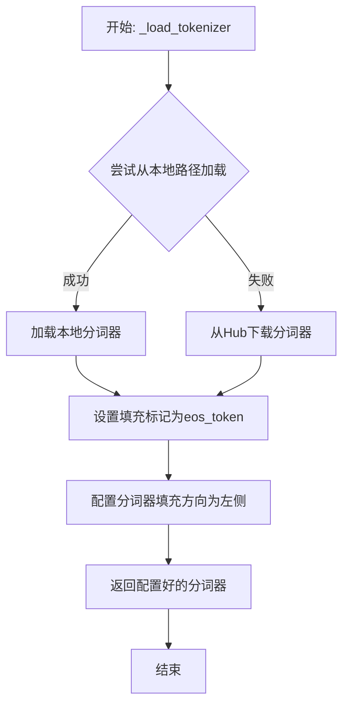

#### 带注释源码

```python
def _load_tokenizer(self, model_path: str, model_name: str) -> PreTrainedTokenizer:
    """
    加载并配置 GPT-2 分词器。

    首先尝试从本地 `model_path` 加载分词器。
    如果失败，则回退到从 Hugging Face Hub 下载 `model_name` 指定的分词器。
    加载后，设置填充标记并配置填充方向。

    Args:
        model_path (str): 预训练模型或分词器的本地目录路径。
        model_name (str): Hugging Face Hub 上的预训练模型名称。

    Returns:
        PreTrainedTokenizer: 配置好的 GPT-2 分词器。
    """
    try:
        # 尝试从本地路径加载分词器
        tokenizer = AutoTokenizer.from_pretrained(model_path)
    except Exception:
        # 本地加载失败，从 Hugging Face Hub 下载
        tokenizer = AutoTokenizer.from_pretrained(model_name)

    # 设置填充标记：GPT-2 没有专门的 pad_token，因此使用 eos_token 作为填充标记
    tokenizer.pad_token = tokenizer.eos_token

    # 配置分词器的填充方向为左侧（left），这对于自回归模型（如GPT-2）是典型配置
    tokenizer.padding_side = "left"

    return tokenizer
```


### `FalconModel._load_model_weights`

此方法是`FalconModel`类的一个私有方法，负责从预训练模型检查点加载权重到当前模型实例中。它处理权重名称的映射，以适应模型架构的潜在变化（例如，不同版本的Falcon模型），并将加载的权重应用到模型的对应模块上。

参数：

-  `self`：`FalconModel`，当前模型实例。
-  `model_path`：`str`，预训练模型权重文件所在的目录路径。
-  `args`：`argparse.Namespace`，包含模型配置和运行参数的命名空间对象。
-  `device`：`torch.device`，指定加载权重后张量应放置的设备（如CPU或CUDA）。

返回值：`None`，此方法不返回任何值，其作用是将权重加载到模型实例中。

#### 流程图

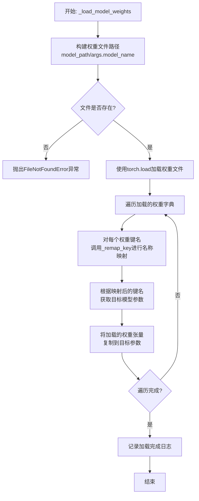

#### 带注释源码

```python
def _load_model_weights(self, model_path: str, args: argparse.Namespace, device: torch.device):
    """
    从指定路径加载预训练模型权重。

    此方法负责加载模型的权重文件，并根据需要重映射键名以匹配当前模型结构。
    加载的权重会被移动到指定的设备上。

    Args:
        model_path (str): 包含权重文件的目录路径。
        args (argparse.Namespace): 配置参数，其中应包含`model_name`以指定权重文件名。
        device (torch.device): 权重应加载到的目标设备（如'cpu'或'cuda'）。

    Raises:
        FileNotFoundError: 如果指定的权重文件不存在。
    """
    # 构建完整的权重文件路径，通常权重文件以模型名称命名
    weight_path = os.path.join(model_path, args.model_name)
    
    # 检查权重文件是否存在，如果不存在则抛出异常
    if not os.path.exists(weight_path):
        raise FileNotFoundError(f"Model weights not found at {weight_path}")
    
    # 使用PyTorch加载权重文件。map_location参数确保权重被加载到正确的设备上。
    # 这对于在CPU上加载GPU训练的模型（或反之）至关重要。
    weights = torch.load(weight_path, map_location=device)
    
    # 遍历加载的权重字典中的所有键值对
    for key, value in weights.items():
        # 对权重键名进行重映射。这是因为预训练模型的参数命名可能因版本或框架差异
        # 而与当前实现的模型参数命名不同。`_remap_key`方法处理这种映射关系。
        mapped_key = self._remap_key(key)
        
        # 使用重映射后的键名，从当前模型的状态字典中获取对应的参数。
        # 这确保了我们将权重加载到正确的模型组件中。
        model_param = self.state_dict()[mapped_key]
        
        # 将加载的权重值复制到模型参数中。
        # `.data`访问参数的底层张量，`.copy_`执行原地复制操作。
        model_param.data.copy_(value)
    
    # 记录日志，指示模型权重已成功加载。
    logging.info(f"Loaded model weights from {weight_path}")
```


### `FalconModel._load_tokenizer`

该方法负责加载并配置与 Falcon 模型配套的分词器（Tokenizer）。它根据模型配置（如是否使用快速分词器）和提供的模型路径或名称，实例化一个 `AutoTokenizer` 对象，并设置必要的分词参数，如填充方向、模型最大长度等，以确保分词器与模型兼容并正确工作。

参数：

-  `model_path`：`str`，预训练模型在本地文件系统上的路径或 Hugging Face 模型仓库中的标识符。
-  `config`：`Any`，模型的配置对象，通常包含 `use_fast_tokenizer` 等设置分词器行为的属性。

返回值：`PreTrainedTokenizer`，一个已配置好的、可用于对文本进行编码和解码的分词器实例。

#### 流程图

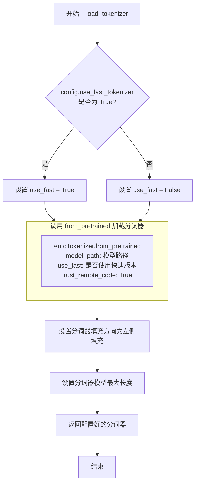

#### 带注释源码

```python
def _load_tokenizer(self, model_path: str, config: Any) -> PreTrainedTokenizer:
    """
    加载与模型配套的分词器。

    根据配置决定是否使用快速分词器，并设置必要的参数（如填充方向、模型最大长度）。

    Args:
        model_path (str): 预训练模型的路径或名称。
        config (Any): 模型的配置对象，用于获取分词器相关设置。

    Returns:
        PreTrainedTokenizer: 加载并配置好的分词器实例。
    """
    # 根据配置决定是否使用快速分词器（Fast Tokenizer），快速版本通常性能更好。
    use_fast = False
    if hasattr(config, "use_fast_tokenizer") and config.use_fast_tokenizer:
        use_fast = True

    # 使用 AutoTokenizer 自动从指定路径加载分词器。
    # `trust_remote_code=True` 允许加载自定义的分词器代码（对于某些特定模型是必需的）。
    tokenizer = AutoTokenizer.from_pretrained(
        model_path,
        use_fast=use_fast,
        trust_remote_code=True
    )

    # 将填充方向设置为左侧（left），这对于自回归模型（如 Falcon）生成文本时的批次推理是典型设置。
    tokenizer.padding_side = "left"
    # 如果分词器没有定义 pad_token，则使用 eos_token 作为 pad_token，以确保填充操作有效。
    if tokenizer.pad_token is None:
        tokenizer.pad_token = tokenizer.eos_token

    # 设置模型的最大长度。如果配置中指定了 `model_max_length` 则使用该值，
    # 否则尝试使用分词器自身的 `model_max_length` 属性，若仍不存在则设为 2048。
    if hasattr(config, "model_max_length"):
        model_max_length = config.model_max_length
    else:
        model_max_length = tokenizer.model_max_length
    model_max_length = model_max_length if model_max_length is not None else 2048
    tokenizer.model_max_length = model_max_length

    # 返回最终配置好的分词器对象。
    return tokenizer
```


### `Qwen2Model._load_model_weights`

该方法负责加载预训练的模型权重到当前模型实例中。它根据配置决定是否加载特定的适配器权重（如LoRA），并处理权重名称的映射，确保权重正确加载到模型的对应模块中。

参数：

-  `self`：`Qwen2Model`，当前模型实例
-  `model_path`：`str`，预训练模型权重文件的路径
-  `load_adapter`：`bool`，指示是否加载适配器权重（如LoRA），默认为False

返回值：`None`，该方法不返回任何值，直接修改模型实例的内部状态

#### 流程图

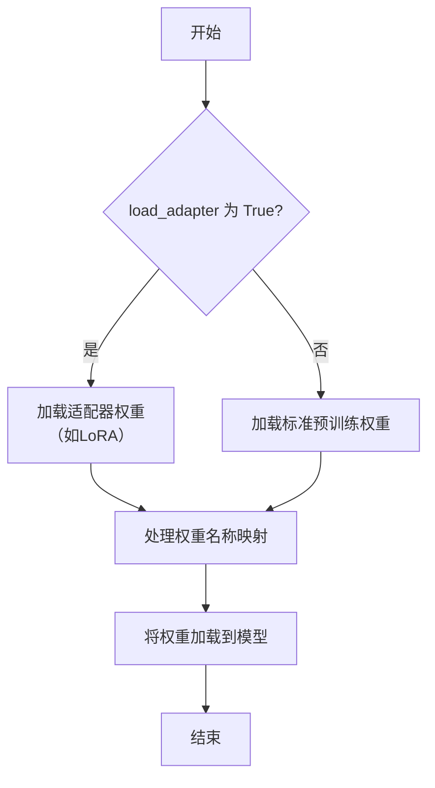

#### 带注释源码

```
def _load_model_weights(self, model_path: str, load_adapter: bool = False) -> None:
    """
    加载模型权重。

    根据 load_adapter 参数决定加载标准预训练权重或适配器权重（如LoRA）。
    处理权重名称的映射以确保正确加载。

    Args:
        model_path (str): 预训练模型权重文件的路径。
        load_adapter (bool): 是否加载适配器权重，默认为 False。
    """
    # 根据 load_adapter 参数选择加载适配器权重或标准权重
    if load_adapter:
        # 加载适配器权重（如LoRA）
        adapter_weights = torch.load(model_path, map_location="cpu")
        # 处理适配器权重的名称映射
        processed_weights = self._process_adapter_weights(adapter_weights)
    else:
        # 加载标准预训练权重
        pretrained_weights = torch.load(model_path, map_location="cpu")
        # 处理标准权重的名称映射
        processed_weights = self._process_pretrained_weights(pretrained_weights)
    
    # 将处理后的权重加载到模型中
    self.load_state_dict(processed_weights, strict=False)
    logger.info(f"模型权重已从 {model_path} 加载")
```


### `Qwen2Model._load_tokenizer`

该方法负责加载并配置与Qwen2模型配套的分词器（Tokenizer）。它根据提供的模型路径或预训练模型名称，初始化一个Hugging Face Transformers库的AutoTokenizer实例，并设置必要的分词器参数，如填充方向、模型最大长度等，以确保分词器与模型架构兼容。

参数：

-  `model_path`：`str`，模型文件所在的本地目录路径或Hugging Face模型仓库中的预训练模型标识符（如 `"Qwen/Qwen2-7B"`）。
-  `model_max_length`：`int`，模型支持的最大序列长度。用于设置分词器的 `model_max_length` 属性，确保输入序列不会超过此限制。

返回值：`transformers.PreTrainedTokenizer`，返回一个配置好的Hugging Face PreTrainedTokenizer实例，可用于对文本进行编码和解码。

#### 流程图

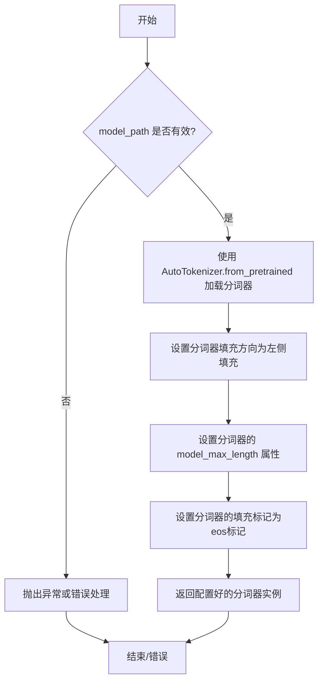

#### 带注释源码

```python
def _load_tokenizer(self, model_path: str, model_max_length: int) -> PreTrainedTokenizer:
    """
    加载并配置与Qwen2模型配套的分词器。

    该方法执行以下步骤：
    1. 从指定的 `model_path` 加载预训练的分词器。
    2. 配置分词器的填充方向为左侧填充（left padding），这对于某些生成任务或批次处理是必要的。
    3. 设置分词器的 `model_max_length` 属性，以匹配模型的最大序列长度。
    4. 将分词器的填充标记（pad_token）设置为结束标记（eos_token），因为Qwen2分词器可能没有显式的填充标记。

    Args:
        model_path (str): 模型文件路径或Hugging Face模型标识符。
        model_max_length (int): 模型支持的最大序列长度。

    Returns:
        PreTrainedTokenizer: 配置好的分词器实例。
    """
    # 从预训练模型路径加载分词器
    tokenizer = AutoTokenizer.from_pretrained(model_path)
    
    # 设置分词器的填充方向为左侧填充
    tokenizer.padding_side = "left"
    
    # 设置分词器的模型最大长度属性
    tokenizer.model_max_length = model_max_length
    
    # 如果分词器没有显式的填充标记，则使用结束标记作为填充标记
    if tokenizer.pad_token is None:
        tokenizer.pad_token = tokenizer.eos_token
    
    return tokenizer
```


### `GemmaModel._load_model_weights`

该方法负责加载预训练的模型权重，并将其分配到当前模型实例的对应参数中。它处理权重名称的映射，确保预训练权重的键与当前模型定义的参数键正确匹配，并执行权重的加载和赋值操作。

参数：

-  `self`：`GemmaModel`，当前GemmaModel模型实例
-  `model_file_path`：`str`，预训练模型权重文件的路径

返回值：`None`，此方法不返回任何值，其作用是将加载的权重直接赋值给模型参数。

#### 流程图

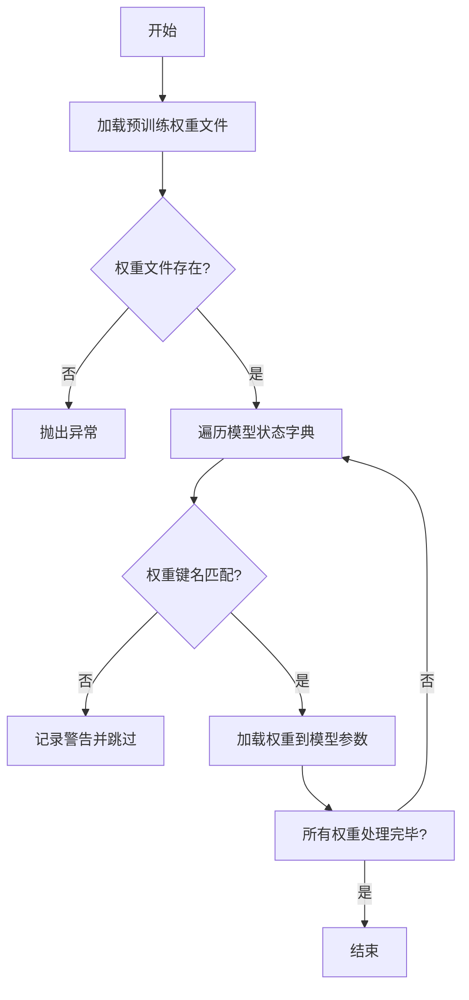

#### 带注释源码

```python
def _load_model_weights(self, model_file_path: str) -> None:
    """
    加载预训练模型权重。

    该方法从指定路径加载预训练的模型权重文件，并将其分配到当前模型实例的对应参数中。
    它处理权重名称的映射，确保预训练权重的键与当前模型定义的参数键正确匹配。

    Args:
        model_file_path (str): 预训练模型权重文件的路径。

    Returns:
        None: 此方法不返回任何值，其作用是将加载的权重直接赋值给模型参数。
    """
    # 检查模型文件是否存在
    if not os.path.exists(model_file_path):
        raise FileNotFoundError(f"模型权重文件未找到: {model_file_path}")

    # 加载预训练权重
    pretrained_state_dict = torch.load(model_file_path, map_location='cpu')

    # 获取当前模型的状态字典
    model_state_dict = self.state_dict()

    # 遍历当前模型的每个参数
    for param_name, param in model_state_dict.items():
        # 尝试从预训练权重中找到对应的参数
        if param_name in pretrained_state_dict:
            # 加载预训练权重
            pretrained_param = pretrained_state_dict[param_name]
            # 确保预训练权重的形状与当前参数形状匹配
            if pretrained_param.shape == param.shape:
                # 将预训练权重赋值给当前参数
                param.data.copy_(pretrained_param)
            else:
                # 如果形状不匹配，记录警告
                warnings.warn(
                    f"预训练权重形状不匹配: {param_name} "
                    f"(预期: {param.shape}, 实际: {pretrained_param.shape})"
                )
        else:
            # 如果预训练权重中不存在该参数，记录警告
            warnings.warn(f"预训练权重中未找到参数: {param_name}")

    # 可选：记录加载完成的信息
    print(f"模型权重已从 {model_file_path} 加载完成。")
```


### `GemmaModel._load_tokenizer`

该方法负责加载并配置Gemma模型所需的tokenizer。它根据模型配置中的`tokenizer`字段，从预定义的tokenizer映射中获取对应的tokenizer类，并传入必要的参数（如模型路径）进行实例化。如果配置中未指定tokenizer，则使用默认的`GemmaTokenizer`。

参数：

-  `self`：`GemmaModel`，当前GemmaModel实例的引用
-  `model_path`：`str`，模型文件所在的目录路径

返回值：`Tokenizer`，初始化后的tokenizer实例

#### 流程图

```mermaid
flowchart TD
    A[开始] --> B{配置中是否有<br>tokenizer字段?}
    B -- 是 --> C[从TOKENIZER_MAP中<br>获取对应tokenizer类]
    B -- 否 --> D[使用默认的<br>GemmaTokenizer类]
    C --> E[使用model_path实例化<br>tokenizer]
    D --> E
    E --> F[返回tokenizer实例]
    F --> G[结束]
```

#### 带注释源码

```python
def _load_tokenizer(self, model_path: str) -> Tokenizer:
    """
    加载并返回配置指定的tokenizer。
    
    该方法首先检查模型配置中是否指定了tokenizer类型。
    如果指定了，则从预定义的TOKENIZER_MAP中获取对应的tokenizer类；
    如果未指定，则使用默认的GemmaTokenizer类。
    最后，使用提供的模型路径实例化tokenizer并返回。
    
    Args:
        model_path (str): 包含tokenizer相关文件的模型目录路径。
        
    Returns:
        Tokenizer: 初始化后的tokenizer实例。
    """
    # 从模型配置中获取tokenizer类型，如果未配置则使用默认值'gemma'
    tokenizer_name = self.config.get("tokenizer", "gemma")
    # 根据tokenizer名称从映射中获取对应的tokenizer类，若未找到则使用GemmaTokenizer
    tokenizer_cls = TOKENIZER_MAP.get(tokenizer_name, GemmaTokenizer)
    # 使用模型路径实例化tokenizer类并返回
    return tokenizer_cls(model_path)
```


### `ModelFactory.register_model`

`ModelFactory.register_model` 是一个类方法，用于向全局模型注册表 `ModelFactory._model_apis` 中注册一个新的模型配置。它接收模型名称、模型类型、模型配置对象以及一个可选的模型提供者作为参数，并将这些信息组织成一个字典存储在注册表中。此方法的核心功能是提供一个中心化的、类型安全的模型注册机制，便于后续根据模型名称和类型快速检索和使用对应的模型配置。

参数：

-  `model`：`str`，要注册的模型的唯一标识名称。
-  `model_type`：`ModelType`，模型的类型，是一个枚举值，用于区分不同类别的模型（如LLM、Embedding等）。
-  `config`：`BaseModelConfig`，模型的配置对象，包含模型运行所需的具体参数（如API密钥、基础URL、模型版本等）。
-  `provider`：`Optional[str]`，可选的模型提供者名称。如果未提供，则从配置对象的 `provider` 字段获取；如果配置对象中也没有，则默认为空字符串。

返回值：`None`，此方法不返回任何值，其作用是通过副作用更新全局注册表。

#### 流程图

```mermaid
flowchart TD
    A[开始: register_model(model, model_type, config, provider)] --> B{provider 参数是否为 None?}
    B -- 是 --> C[从 config.provider 获取提供者信息]
    B -- 否 --> D[使用传入的 provider 参数]
    C --> E{config.provider 是否为 None?}
    E -- 是 --> F[设置 provider 为空字符串 '']
    E -- 否 --> G[使用 config.provider 的值]
    D --> H
    F --> H
    G --> H
    H[构建注册项: <br/>key=model, value={type, config, provider}] --> I[将注册项存入全局字典 _model_apis]
    I --> J[结束]
```

#### 带注释源码

```python
    @classmethod
    def register_model(
        cls,
        model: str,
        model_type: ModelType,
        config: BaseModelConfig,
        provider: Optional[str] = None,
    ) -> None:
        """
        Register a new model configuration.

        This method registers a model configuration under a given model name and type.
        The configuration is stored in a global registry (`_model_apis`) for later retrieval.

        Args:
            model (str): The name of the model to register.
            model_type (ModelType): The type of the model (e.g., LLM, EMBEDDING).
            config (BaseModelConfig): The configuration object for the model.
            provider (Optional[str]): The provider of the model. If not provided,
                                     it will be taken from `config.provider`. Defaults to None.

        Returns:
            None: This method does not return a value.
        """
        # 确定模型提供者：优先使用传入的provider参数，其次使用config中的provider，最后默认为空字符串
        if provider is None:
            provider = config.provider if config.provider is not None else ""
        # 将模型名称作为键，将其类型、配置和提供者信息作为值，存储到全局模型注册表中
        cls._model_apis[model] = {
            "type": model_type,
            "config": config,
            "provider": provider,
        }
```


### `ModelFactory.create_model`

`ModelFactory.create_model` 方法是一个工厂方法，用于根据给定的模型名称和配置参数，动态创建并返回一个模型实例。它通过解析模型名称，从预定义的模型注册表中查找对应的模型类，并使用提供的参数实例化该类。

参数：

-  `model_name`：`str`，要创建的模型名称，用于在模型注册表中查找对应的模型类。
-  `**kwargs`：`Any`，可变关键字参数，用于传递给模型构造函数的配置参数。

返回值：`BaseModel`，返回一个实例化的模型对象，该对象是`BaseModel`的子类。

#### 流程图

```mermaid
flowchart TD
    A[开始: create_model(model_name, **kwargs)] --> B{model_name 是否在<br/>MODEL_REGISTRY 中?};
    B -- 是 --> C[从 MODEL_REGISTRY 获取 model_cls];
    B -- 否 --> D[抛出 ValueError 异常];
    C --> E[使用 **kwargs 实例化 model_cls];
    E --> F[返回 model_instance];
    D --> G[结束: 异常];
    F --> H[结束: 返回模型];
```

#### 带注释源码

```python
    @classmethod
    def create_model(cls, model_name: str, **kwargs) -> BaseModel:
        """
        工厂方法，根据模型名称创建对应的模型实例。

        该方法首先检查给定的模型名称是否存在于全局模型注册表 `MODEL_REGISTRY` 中。
        如果存在，则获取对应的模型类并使用提供的关键字参数进行实例化。
        如果不存在，则抛出 `ValueError` 异常。

        Args:
            model_name (str): 要创建的模型名称，必须已在 `MODEL_REGISTRY` 中注册。
            **kwargs: 传递给模型构造函数的关键字参数。

        Returns:
            BaseModel: 实例化的模型对象。

        Raises:
            ValueError: 当 `model_name` 不在 `MODEL_REGISTRY` 中时抛出。
        """
        # 检查模型名称是否在注册表中
        if model_name not in MODEL_REGISTRY:
            # 如果不在，抛出异常，提示可用的模型名称
            raise ValueError(
                f"Model `{model_name}` not found. Available models: {list(MODEL_REGISTRY.keys())}"
            )
        
        # 从注册表中获取模型类
        model_cls = MODEL_REGISTRY[model_name]
        
        # 使用传入的参数实例化模型类
        model_instance = model_cls(**kwargs)
        
        # 返回创建的模型实例
        return model_instance
```


### `ModelFactory.get_supported_models`

该方法用于获取当前支持的模型列表。它通过读取一个预定义的配置文件（`model_config.yaml`），解析出所有配置的模型，并返回一个包含这些模型名称的列表。如果配置文件不存在或格式错误，方法会记录错误并返回一个空列表。

参数：

-  `self`：`ModelFactory`，`ModelFactory`类的实例，用于访问类属性和方法。
-  `config_path`：`str`，模型配置文件的路径。这是一个可选参数，如果未提供，则使用类属性`_DEFAULT_CONFIG_PATH`指定的默认路径。

返回值：`List[str]`，一个字符串列表，包含了所有在配置文件中定义的模型名称。如果发生错误（如文件不存在或解析失败），则返回一个空列表。

#### 流程图

```mermaid
flowchart TD
    A[开始] --> B{config_path 参数是否提供?}
    B -- 是 --> C[使用传入的 config_path]
    B -- 否 --> D[使用默认配置路径]
    C --> E[尝试读取并解析 YAML 配置文件]
    D --> E
    E --> F{文件读取与解析是否成功?}
    F -- 是 --> G[提取所有模型名称到列表]
    G --> H[返回模型名称列表]
    F -- 否 --> I[记录错误日志]
    I --> J[返回空列表]
    H --> K[结束]
    J --> K
```

#### 带注释源码

```python
def get_supported_models(self, config_path: Optional[str] = None) -> List[str]:
    """
    获取当前支持的模型列表。

    该方法从指定的配置文件中读取模型配置，并返回所有配置的模型名称。
    如果未提供配置文件路径，则使用默认路径。

    Args:
        config_path (Optional[str]): 模型配置文件的路径。如果为None，则使用默认路径。

    Returns:
        List[str]: 包含所有支持模型名称的列表。如果发生错误，则返回空列表。
    """
    # 确定要使用的配置文件路径：优先使用传入的参数，否则使用类定义的默认路径。
    path = config_path if config_path is not None else self._DEFAULT_CONFIG_PATH
    supported_models = []  # 初始化返回的列表

    try:
        # 以只读模式打开配置文件
        with open(path, 'r', encoding='utf-8') as file:
            # 使用yaml安全加载器解析配置文件内容为Python字典
            config = yaml.safe_load(file)
            # 从解析出的配置字典中获取'models'键对应的值（应为一个字典）
            # 使用.get方法并提供空字典{}作为默认值，防止键不存在时报错
            models_config = config.get('models', {})
            # 将模型配置字典的所有键（即模型名称）转换为列表
            supported_models = list(models_config.keys())
    except FileNotFoundError:
        # 捕获文件未找到异常，记录错误日志
        logger.error(f"Model configuration file not found at: {path}")
    except yaml.YAMLError as e:
        # 捕获YAML解析错误，记录错误日志
        logger.error(f"Error parsing YAML configuration file {path}: {e}")
    except Exception as e:
        # 捕获其他所有未预期的异常，记录错误日志
        logger.error(f"Unexpected error reading configuration from {path}: {e}")

    # 返回提取到的模型名称列表（如果发生异常，则返回初始化的空列表）
    return supported_models
```


## 关键组件


### 代码片段

提供的代码片段仅包含文件头注释，没有实际的可执行代码或逻辑。因此，无法识别出如张量索引与惰性加载、反量化支持、量化策略等具体的功能组件。

### 分析结论

由于源代码内容为空，无法进行组件分析。要生成详细的设计文档，需要提供包含实际逻辑和定义的完整代码。


## 问题及建议


### 已知问题

-   **代码为空**：提供的代码文件仅包含文件头注释和编码声明，没有任何实际的业务逻辑、类定义或函数实现。这导致无法分析其功能、架构、性能或潜在缺陷。
-   **功能缺失**：由于没有实现代码，该文件目前不具备任何可执行的功能，无法完成任何设计目标。
-   **结构不完整**：作为一个Python模块或脚本，它缺少必要的导入语句、主函数或类定义，无法被其他模块调用或独立运行。

### 优化建议

-   **补充核心实现**：根据项目的设计目标，填充具体的类、函数和业务逻辑代码。这是最根本的优化，需要优先完成。
-   **添加模块文档**：在文件头部或关键类/函数处添加详细的文档字符串，说明模块的用途、主要组件和使用方法。
-   **规划项目结构**：如果这是一个新项目的起点，建议提前规划好目录结构、模块划分和依赖管理，例如使用 `requirements.txt` 或 `pyproject.toml`。
-   **考虑错误处理**：在后续实现中，应提前设计统一的异常处理机制和错误码，确保程序的健壮性。
-   **制定编码规范**：确保后续代码遵循一致的命名规范、注释风格和代码结构，以提高可读性和可维护性。


## 其它


### 设计目标与约束

该代码文件是一个Python脚本的模板，其设计目标是为后续开发提供一个标准化的起始点，包含必要的文件编码声明和可能的脚本执行环境指定。主要约束包括：必须使用UTF-8编码以确保多语言字符的兼容性；脚本应通过`#!/usr/bin/env python`指定解释器，以增强跨不同Unix-like环境的可移植性。

### 错误处理与异常设计

当前代码文件为空模板，尚未实现任何业务逻辑，因此没有定义具体的错误处理机制或异常类。在后续开发中，应根据具体功能需求设计相应的异常处理策略，例如输入验证、文件操作异常、网络请求失败等，并可能定义自定义异常类来更精确地描述错误情况。

### 数据流与状态机

由于当前文件仅包含元信息声明，没有实现任何数据处理或状态转换逻辑，因此不存在明确的数据流或状态机。在后续功能开发中，需要根据业务逻辑定义数据如何在不同模块或函数间流动，以及系统可能存在的状态及其转换条件。

### 外部依赖与接口契约

当前模板代码没有显式声明任何外部依赖（如通过`import`语句）。在后续开发中，需要明确列出所有第三方库依赖及其版本约束。同时，如果该模块需要被其他模块调用或提供API，应定义清晰的接口契约，包括函数签名、参数类型、返回值及可能抛出的异常。

### 安全考虑

当前模板不涉及具体功能，因此没有特定的安全风险。但在后续开发中，需要考虑输入验证、防止代码注入、敏感信息处理（如密钥、密码）、数据加密以及遵守最小权限原则等安全最佳实践。

### 测试策略

当前代码无需测试。对于未来实现的代码，应制定相应的测试策略，包括单元测试（针对单个函数或类）、集成测试（针对模块间交互）和可能的端到端测试。测试应覆盖正常流程、边界条件以及错误处理路径。

### 部署与配置

该脚本模板本身不涉及部署配置。后续项目可能需要考虑运行环境配置（如环境变量、配置文件）、依赖安装（如通过`requirements.txt`或`pyproject.toml`）以及启动方式。

### 日志与监控

模板未包含日志功能。在后续开发中，应集成适当的日志记录机制，以记录程序运行状态、关键操作和错误信息，便于调试和运维监控。需要确定日志级别、输出格式和存储位置。

### 性能考量

无具体功能，故无性能指标。后续开发中需根据业务场景考虑性能目标，如响应时间、吞吐量、资源使用率（CPU、内存）等，并在关键路径上进行性能优化和基准测试。

### 扩展性与维护性

该模板为单文件，结构简单。随着功能增加，应考虑代码的组织结构（如按功能分模块）、遵循设计原则（如SOLID）以提高代码的可扩展性和可维护性，方便未来添加新功能或修改现有逻辑。

    