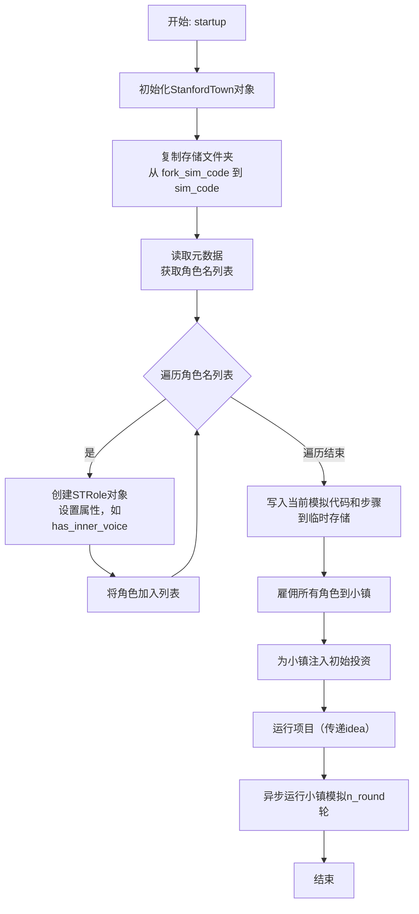
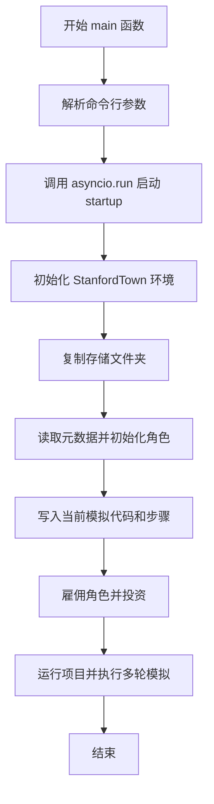
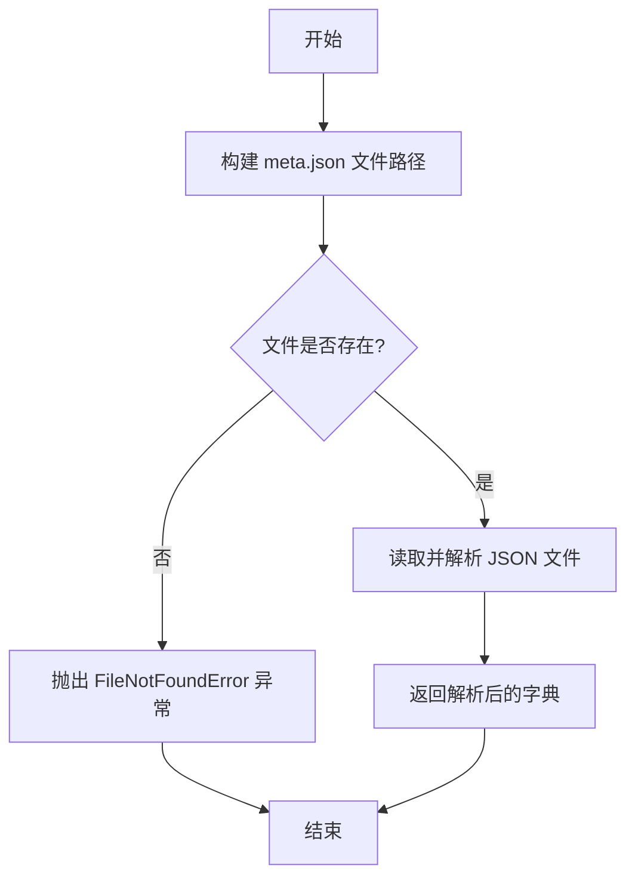
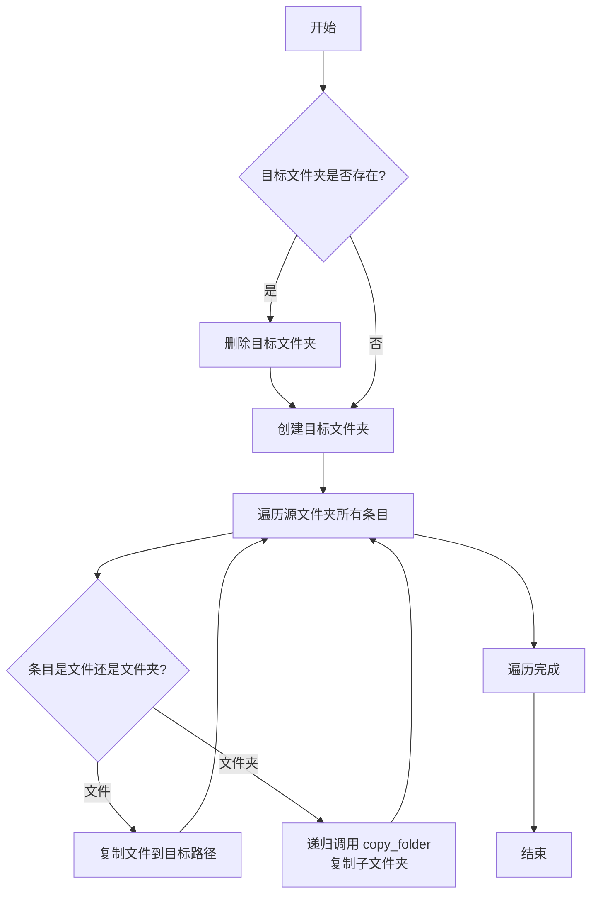
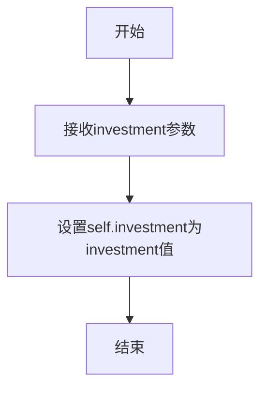
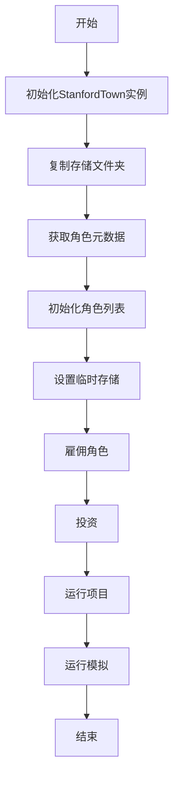

# `.\MetaGPT\examples\stanford_town\run_st_game.py` 详细设计文档

该文件是斯坦福小镇（Stanford Town）模拟游戏的入口点，核心功能是初始化一个基于生成式智能体的多角色模拟环境。它通过复制现有模拟数据、从元数据中初始化角色（赋予第一个角色“内心独白”能力）、设置临时存储，并最终启动小镇模拟运行指定轮次，来实现一个动态的、由事件驱动的角色互动世界。

## 整体流程

```mermaid
graph TD
    A[开始: 调用main函数] --> B[解析命令行参数]
    B --> C[调用异步函数startup]
    C --> D[创建StanfordTown实例]
    D --> E[复制基础模拟数据]
    E --> F[读取元数据，初始化STRole角色]
    F --> G[设置临时存储路径]
    G --> H[雇佣角色到小镇]
    H --> I[注入初始资金]
    I --> J[设置核心项目(idea)]
    J --> K[运行模拟n_round轮]
    K --> L[模拟结束]
```

## 类结构

```
外部依赖/导入模块
├── asyncio (异步IO)
├── typing (类型注解)
├── fire (命令行接口)
├── metagpt.ext.stanford_town.stanford_town (StanfordTown类)
├── metagpt.ext.stanford_town.roles.st_role (STRole类)
└── metagpt.ext.stanford_town.utils.* (多个工具模块)
```

## 全局变量及字段


### `STORAGE_PATH`
    
存储模拟数据的根目录路径，用于读取和写入模拟环境的状态文件。

类型：`pathlib.Path`
    


### `STRole.name`
    
角色的唯一标识名称，用于在模拟环境中区分不同的角色。

类型：`str`
    


### `STRole.profile`
    
角色的简要描述或档案信息，用于定义角色的基本特征。

类型：`str`
    


### `STRole.sim_code`
    
当前模拟的唯一代码标识，用于关联角色与特定的模拟实例。

类型：`str`
    


### `STRole.step`
    
模拟的当前步数，表示角色在模拟时间线中的进度。

类型：`int`
    


### `STRole.start_time`
    
模拟的起始时间，用于初始化角色的时间感知和事件调度。

类型：`str`
    


### `STRole.curr_time`
    
模拟的当前时间，表示角色在模拟世界中的实时时刻。

类型：`str`
    


### `STRole.sec_per_step`
    
模拟中每一步代表的真实时间秒数，用于控制时间流逝的速度。

类型：`int`
    


### `STRole.has_inner_voice`
    
指示角色是否具有内部声音（即是否接收外部输入如idea），通常用于主要角色。

类型：`bool`
    
    

## 全局函数及方法


### `startup`

`startup` 函数是斯坦福小镇（Stanford Town）模拟的异步启动入口。它负责初始化模拟环境：基于一个已有的模拟分支（`fork_sim_code`）创建新的模拟实例（`sim_code`），从元数据中加载并初始化角色（`STRole`），设置临时存储，然后启动小镇模拟运行指定的轮数。

参数：

-  `idea`：`str`，作为“内心声音”传递给第一个智能体的想法或目标，用于驱动模拟。
-  `fork_sim_code`：`str`，作为起点的已有模拟的名称（位于 `storage/` 目录下），其数据将被复制。
-  `sim_code`：`str`，用于保存新模拟结果的新模拟名称。
-  `temp_storage_path`：`str`，生成式智能体前端服务器内部用于交互的临时存储路径。
-  `investment`：`float`，运行智能体的初始投资额，默认为 30.0。
-  `n_round`：`int`，模拟运行的轮数，默认为 500。

返回值：`None`，该函数不返回任何值，它异步执行并管理整个模拟的生命周期。

#### 流程图



#### 带注释源码

```python
async def startup(
    idea: str, fork_sim_code: str, sim_code: str, temp_storage_path: str, investment: float = 30.0, n_round: int = 500
):
    # 1. 初始化StanfordTown环境
    town = StanfordTown()
    logger.info("StanfordTown init environment")

    # 2. 复制基础数据：将源模拟（fork_sim_code）的存储目录复制到新模拟（sim_code）的目录
    copy_folder(str(STORAGE_PATH.joinpath(fork_sim_code)), str(STORAGE_PATH.joinpath(sim_code)))

    # 3. 从源模拟的元数据文件中获取角色名称列表
    reverie_meta = get_reverie_meta(fork_sim_code)
    roles = []
    # 确保新模拟的存储目录存在
    sim_path = STORAGE_PATH.joinpath(sim_code)
    sim_path.mkdir(exist_ok=True)
    # 4. 遍历角色名，为每个角色创建STRole实例
    for idx, role_name in enumerate(reverie_meta["persona_names"]):
        # 只有第一个角色（索引0）被赋予“内心声音”（inner voice）能力，用于接收初始idea
        has_inner_voice = True if idx == 0 else False
        role = STRole(
            name=role_name,
            profile=role_name,
            sim_code=sim_code,          # 新模拟代码
            step=reverie_meta.get("step", 0),          # 从元数据继承当前步骤
            start_time=reverie_meta.get("start_date"), # 模拟开始时间
            curr_time=reverie_meta.get("curr_time"),   # 模拟当前时间
            sec_per_step=reverie_meta.get("sec_per_step"), # 每步代表的秒数
            has_inner_voice=has_inner_voice,           # 是否具有内心声音
        )
        roles.append(role)

    # 5. 将当前模拟的代码和步骤信息写入临时存储路径，供前端或其他组件读取
    write_curr_sim_code({"sim_code": sim_code}, temp_storage_path)
    write_curr_step({"step": reverie_meta.get("step", 0)}, temp_storage_path)

    # 6. 将所有创建的角色“雇佣”到小镇中
    await town.hire(roles)

    # 7. 为小镇注入初始运行资金
    town.invest(investment)
    # 8. 启动项目，将初始idea传递给小镇（通常由第一个有inner_voice的角色接收）
    town.run_project(idea)

    # 9. 异步运行小镇模拟，执行指定的轮数（n_round）
    await town.run(n_round)
```


### `main`

`main` 函数是 Stanford Town 模拟游戏的入口点，负责解析命令行参数并启动异步模拟流程。它通过 `fire` 库提供命令行接口，将参数传递给 `startup` 异步函数来初始化模拟环境、创建角色、设置存储，并运行指定轮数的模拟。

参数：

- `idea`：`str`，作为第一个代理的“内心声音”的想法，用于指导模拟中的初始行为。
- `fork_sim_code`：`str`，作为起点的旧模拟名称，对应 `storage/` 目录下的一个现有模拟文件夹。
- `sim_code`：`str`，用于保存模拟结果的新模拟名称。
- `temp_storage_path`：`Optional[str]`，可选参数，指定 `generative_agents` 临时存储路径，用于与前端服务器交互。默认为 `None`。
- `investment`：`float`，运行代理的投资金额，默认为 30.0。
- `n_round`：`int`，模拟运行的轮数，默认为 500。

返回值：`None`，无返回值。

#### 流程图



#### 带注释源码

```python
def main(
    idea: str,
    fork_sim_code: str,
    sim_code: str,
    temp_storage_path: Optional[str] = None,
    investment: float = 30.0,
    n_round: int = 500,
):
    """
    Args:
        idea: idea works as an `inner voice` to the first agent.
        fork_sim_code: old simulation name to start with, choose one inside `generative_agents/environment/frontend_server/storage/`
        sim_code: new simulation name to save simulation result
        temp_storage_path: generative_agents temp_storage path inside `environment/frontend_server` to interact.
        investment: the investment of running agents
        n_round: rounds to run agents
    """

    # 使用 asyncio.run 启动异步函数 startup，传递所有参数
    asyncio.run(
        startup(
            idea=idea,
            fork_sim_code=fork_sim_code,
            sim_code=sim_code,
            temp_storage_path=temp_storage_path,
            investment=investment,
            n_round=n_round,
        )
    )
```

### `get_reverie_meta`

从指定的模拟代码（sim_code）对应的存储路径中读取并解析 `reverie/meta.json` 文件，返回其内容。

参数：
- `sim_code`：`str`，模拟代码，用于定位存储路径。

返回值：`dict`，包含 `reverie/meta.json` 文件解析后的字典数据。

#### 流程图



#### 带注释源码

```python
def get_reverie_meta(sim_code: str) -> dict:
    """
    从 `storage/{sim_code}/reverie/meta.json` 读取并返回元数据。

    Args:
        sim_code (str): 模拟代码，用于定位存储路径。

    Returns:
        dict: 包含元数据的字典。

    Raises:
        FileNotFoundError: 如果指定的 meta.json 文件不存在。
    """
    # 导入必要的模块和常量
    from metagpt.ext.stanford_town.utils.const import STORAGE_PATH
    import json

    # 构建 meta.json 文件的完整路径
    meta_path = STORAGE_PATH / sim_code / "reverie" / "meta.json"

    # 检查文件是否存在，如果不存在则抛出异常
    if not meta_path.exists():
        raise FileNotFoundError(f"Meta file not found at {meta_path}")

    # 打开文件，读取内容，并使用 json 模块解析为 Python 字典
    with open(meta_path, "r", encoding="utf-8") as f:
        meta_data = json.load(f)

    # 返回解析后的字典数据
    return meta_data
```

### `write_curr_sim_code`

该函数用于将当前的模拟代码信息写入一个JSON文件，作为临时存储，以便其他进程或模块可以读取和使用这些信息。

参数：

- `data`：`dict`，包含要写入的模拟代码信息，例如 `{"sim_code": "simulation_name"}`
- `temp_storage_path`：`str`，临时存储文件的路径，用于指定写入的目标文件位置

返回值：`None`，该函数不返回任何值，仅执行文件写入操作

#### 流程图

```mermaid
flowchart TD
    A[开始] --> B[接收参数 data 和 temp_storage_path]
    B --> C[导入 json 模块]
    C --> D[构建文件路径<br/>file_path = temp_storage_path / 'curr_sim_code.json']
    D --> E[以写入模式打开文件<br/>with open(file_path, 'w') as f]
    E --> F[将 data 字典序列化为 JSON 并写入文件<br/>json.dump(data, f)]
    F --> G[结束]
```

#### 带注释源码

```python
def write_curr_sim_code(data: dict, temp_storage_path: str):
    """
    将当前的模拟代码信息写入临时存储文件。

    该函数接收一个字典数据和一个临时存储路径，将字典序列化为JSON格式，
    并写入到指定路径下的 'curr_sim_code.json' 文件中。

    Args:
        data (dict): 包含模拟代码信息的字典，例如 {"sim_code": "simulation_name"}。
        temp_storage_path (str): 临时存储文件的目录路径。

    Returns:
        None: 该函数不返回任何值。
    """
    import json  # 导入json模块，用于序列化数据
    from pathlib import Path  # 导入Path类，用于处理文件路径

    # 构建完整的文件路径：将临时存储路径与文件名 'curr_sim_code.json' 拼接
    file_path = Path(temp_storage_path) / "curr_sim_code.json"
    
    # 以写入模式打开文件，并将数据序列化为JSON格式写入文件
    with open(file_path, "w") as f:
        json.dump(data, f)  # 将字典 data 写入文件 f
```

### `write_curr_step`

该函数用于将当前步骤信息写入指定的临时存储路径，通常用于记录模拟的当前进度或状态。

参数：
- `curr_step_dict`：`dict`，包含当前步骤信息的字典，例如 `{"step": 0}`
- `temp_storage_path`：`str`，临时存储文件的路径，用于保存当前步骤信息

返回值：`None`，该函数不返回任何值，仅执行写入操作

#### 流程图

```mermaid
flowchart TD
    A[开始] --> B[接收参数<br>curr_step_dict, temp_storage_path]
    B --> C[检查temp_storage_path是否为None]
    C -- 是 --> D[直接返回]
    C -- 否 --> E[构建文件路径<br>temp_storage_path/curr_step.json]
    E --> F[打开文件并写入<br>json.dump(curr_step_dict, f)]
    F --> G[关闭文件]
    G --> H[结束]
```

#### 带注释源码

```python
def write_curr_step(curr_step_dict: dict, temp_storage_path: str):
    """
    将当前步骤信息写入临时存储路径。

    参数:
        curr_step_dict (dict): 包含当前步骤信息的字典，例如 {"step": 0}
        temp_storage_path (str): 临时存储文件的路径，用于保存当前步骤信息

    返回值:
        None: 该函数不返回任何值，仅执行写入操作
    """
    # 如果临时存储路径为None，则直接返回，不执行任何操作
    if temp_storage_path is None:
        return

    # 构建完整的文件路径，指向curr_step.json文件
    curr_step_path = os.path.join(temp_storage_path, "curr_step.json")

    # 打开文件，以写入模式（'w'）写入当前步骤信息
    with open(curr_step_path, "w") as f:
        # 将curr_step_dict字典以JSON格式写入文件
        json.dump(curr_step_dict, f)
```


### `copy_folder`

该函数用于将一个文件夹（包括其所有子文件夹和文件）递归地复制到另一个位置。如果目标文件夹已存在，则会先删除它，然后再进行复制。

参数：

-  `src`：`str`，源文件夹的路径
-  `dst`：`str`，目标文件夹的路径

返回值：`None`，该函数不返回任何值

#### 流程图



#### 带注释源码

```python
def copy_folder(src: str, dst: str) -> None:
    """
    递归复制文件夹。

    Args:
        src (str): 源文件夹路径。
        dst (str): 目标文件夹路径。
    """
    # 如果目标文件夹已存在，则先删除它
    if os.path.exists(dst):
        shutil.rmtree(dst)
    # 创建目标文件夹
    os.makedirs(dst)
    # 遍历源文件夹中的所有条目（文件和子文件夹）
    for item in os.listdir(src):
        s = os.path.join(src, item)  # 源条目完整路径
        d = os.path.join(dst, item)  # 目标条目完整路径
        # 判断条目类型
        if os.path.isdir(s):
            # 如果是文件夹，则递归调用自身进行复制
            copy_folder(s, d)
        else:
            # 如果是文件，则直接复制
            shutil.copy2(s, d)
```


### `StanfordTown.hire`

该方法用于为StanfordTown实例雇佣（初始化）一组角色（STRole），将这些角色添加到城镇的模拟环境中，为后续的模拟运行做准备。

参数：

- `roles`：`list[STRole]`，要雇佣的角色对象列表，每个角色代表模拟环境中的一个智能体。

返回值：`None`，无返回值。

#### 流程图

```mermaid
flowchart TD
    A[开始 hire(roles)] --> B{检查 roles 列表是否为空?}
    B -- 是 --> C[记录警告日志<br>“No roles to hire.”]
    C --> D[结束]
    B -- 否 --> E[遍历 roles 列表]
    E --> F[为每个角色调用 _hire 方法]
    F --> G[记录信息日志<br>“Hired roles: {角色名列表}”]
    G --> D
```

#### 带注释源码

```python
async def hire(self, roles: list[STRole]):
    """
    雇佣（初始化）一组角色到城镇中。
    
    该方法接收一个角色列表，遍历列表并将每个角色添加到城镇的模拟环境中。
    如果传入的角色列表为空，则会记录一条警告日志。
    
    Args:
        roles (list[STRole]): 要雇佣的角色对象列表。
    """
    # 检查角色列表是否为空
    if not roles:
        logger.warning("No roles to hire.")
        return

    # 遍历角色列表，调用内部方法 _hire 来雇佣每个角色
    for role in roles:
        await self._hire(role)

    # 记录成功雇佣的角色信息
    logger.info(f"Hired roles: {[role.name for role in roles]}")
```

### `StanfordTown.invest`

该方法用于为StanfordTown项目注入资金，设置项目的初始投资金额。

参数：

- `investment`：`float`，投资金额，用于支持项目的运行

返回值：`None`，无返回值

#### 流程图



#### 带注释源码

```python
def invest(self, investment: float):
    """
    为StanfordTown项目注入资金。

    Args:
        investment (float): 投资金额，用于支持项目的运行。
    """
    self.investment = investment  # 将传入的投资金额赋值给实例变量self.investment
```

### `StanfordTown.run_project`

该方法用于启动并运行一个项目，为项目设定核心目标（idea），并触发项目执行流程。

参数：

-  `idea`：`str`，项目的核心想法或目标，作为项目的驱动指令。

返回值：`None`，该方法不返回任何值，其作用是启动项目执行流程。

#### 流程图

```mermaid
flowchart TD
    A[开始] --> B[接收idea参数]
    B --> C{idea是否为空?}
    C -- 是 --> D[抛出ValueError异常]
    C -- 否 --> E[将idea赋值给self.project.idea]
    E --> F[调用self.project.start()]
    F --> G[结束]
```

#### 带注释源码

```python
def run_project(self, idea: str):
    """
    启动并运行一个项目。

    该方法接收一个核心想法（idea），将其设置为当前项目的目标，并启动项目执行流程。
    如果提供的idea为空字符串，则会抛出ValueError异常。

    Args:
        idea (str): 项目的核心想法或目标，作为项目的驱动指令。

    Raises:
        ValueError: 如果idea参数为空字符串。

    Returns:
        None: 该方法不返回任何值。
    """
    # 检查idea参数是否有效，如果为空则抛出异常
    if not idea:
        raise ValueError("Idea cannot be empty.")
    
    # 将项目核心想法赋值给当前项目的idea属性
    self.project.idea = idea
    
    # 启动项目，开始执行项目流程
    self.project.start()
```

### `StanfordTown.run`

该方法用于启动并运行Stanford Town模拟。它负责初始化环境、复制存储数据、创建角色、设置临时存储，并最终启动模拟运行。通过调用`town.run_project`和`town.run`，该方法实现了模拟的核心逻辑，包括角色间的交互和事件处理。

参数：

- `self`：`StanfordTown`，StanfordTown类的实例
- `idea`：`str`，作为第一个代理的“内心声音”的想法
- `fork_sim_code`：`str`，用于启动的旧模拟名称，位于`generative_agents/environment/frontend_server/storage/`中
- `sim_code`：`str`，用于保存模拟结果的新模拟名称
- `temp_storage_path`：`Optional[str]`，用于交互的临时存储路径，位于`environment/frontend_server`中
- `investment`：`float`，运行代理的投资金额，默认为30.0
- `n_round`：`int`，运行代理的轮数，默认为500

返回值：`None`，无返回值

#### 流程图



#### 带注释源码

```python
async def startup(
    idea: str, 
    fork_sim_code: str, 
    sim_code: str, 
    temp_storage_path: str, 
    investment: float = 30.0, 
    n_round: int = 500
):
    # 初始化StanfordTown实例
    town = StanfordTown()
    logger.info("StanfordTown init environment")

    # 复制存储文件夹，从旧模拟名称复制到新模拟名称
    copy_folder(str(STORAGE_PATH.joinpath(fork_sim_code)), str(STORAGE_PATH.joinpath(sim_code)))

    # 获取角色元数据，用于初始化角色
    reverie_meta = get_reverie_meta(fork_sim_code)
    roles = []
    sim_path = STORAGE_PATH.joinpath(sim_code)
    sim_path.mkdir(exist_ok=True)
    
    # 遍历角色名称，初始化每个角色
    for idx, role_name in enumerate(reverie_meta["persona_names"]):
        has_inner_voice = True if idx == 0 else False
        role = STRole(
            name=role_name,
            profile=role_name,
            sim_code=sim_code,
            step=reverie_meta.get("step", 0),
            start_time=reverie_meta.get("start_date"),
            curr_time=reverie_meta.get("curr_time"),
            sec_per_step=reverie_meta.get("sec_per_step"),
            has_inner_voice=has_inner_voice,
        )
        roles.append(role)

    # 设置临时存储路径，保存当前模拟代码和步骤
    write_curr_sim_code({"sim_code": sim_code}, temp_storage_path)
    write_curr_step({"step": reverie_meta.get("step", 0)}, temp_storage_path)

    # 雇佣所有角色
    await town.hire(roles)

    # 投资模拟运行
    town.invest(investment)
    
    # 运行项目，传入想法作为第一个代理的内心声音
    town.run_project(idea)

    # 运行模拟，指定轮数
    await town.run(n_round)
```

## 关键组件


### STRole 角色类

STRole 是斯坦福小镇中智能体的核心角色类，它封装了每个角色的个人资料、状态（如当前时间、步数）以及行为逻辑，是模拟世界中的基本行为单元。

### StanfordTown 小镇环境类

StanfordTown 是模拟小镇的核心环境类，负责管理所有角色（STRole）、分配资源（投资）、运行项目（idea）以及驱动整个多轮模拟流程。

### 模拟状态管理与持久化工具

包含 `get_reverie_meta`、`write_curr_sim_code`、`write_curr_step` 等函数，用于从 `meta.json` 文件读取模拟元数据（如角色名、当前步数）以及将当前模拟状态（模拟代码、步数）写入临时存储，是实现模拟状态保存、加载和与前端交互的关键。

### 存储操作工具

包含 `copy_folder` 函数和 `STORAGE_PATH` 常量，用于在文件系统层面复制整个模拟存储目录，是实现模拟分支（fork）功能的基础。

### 异步启动与主流程控制

`startup` 异步函数和 `main` 同步函数构成了程序的入口和核心执行流程，负责初始化环境、复制数据、创建角色、启动小镇模拟并运行指定轮数。


## 问题及建议


### 已知问题

-   **硬编码的 `has_inner_voice` 逻辑**：`has_inner_voice` 被硬编码为仅第一个角色拥有 (`idx == 0`)。这限制了功能的灵活性，使得无法根据角色属性或配置动态分配“内心独白”能力。
-   **同步与异步混合**：`main` 函数是同步的，它通过 `asyncio.run` 调用异步的 `startup` 函数。虽然这是常见的启动模式，但整个代码库的异步一致性需要评估，以避免潜在的复杂性和性能瓶颈。
-   **缺乏输入验证**：函数参数（如 `fork_sim_code`, `sim_code`, `temp_storage_path`）没有进行有效性或存在性检查。例如，如果 `fork_sim_code` 对应的文件夹不存在，`copy_folder` 操作会失败。
-   **错误处理不足**：代码中没有对可能发生的异常（如文件读写错误、目录创建失败、异步操作超时等）进行捕获和处理，这可能导致程序在遇到意外情况时崩溃。
-   **配置管理分散**：关键参数（如 `investment`, `n_round`）通过函数参数传递，而其他配置（如 `STORAGE_PATH`）则来自常量模块。这种分散的配置方式不利于统一管理和维护。
-   **潜在的资源泄漏**：在异步操作 `town.run(n_round)` 中，如果发生异常，可能没有妥善清理已创建的资源（如角色实例、临时文件等）。

### 优化建议

-   **解耦 `has_inner_voice` 逻辑**：建议将 `has_inner_voice` 的分配逻辑从索引判断改为基于角色配置文件或外部参数。可以设计一个配置映射或规则引擎来决定哪个角色拥有此能力。
-   **增强输入验证与错误处理**：
    -   在函数开始处添加参数验证，检查路径是否存在、参数是否在有效范围内。
    -   使用 `try-except` 块包裹可能失败的操作（如文件操作、目录创建），并记录详细的错误日志，或提供友好的错误信息。
-   **统一配置管理**：考虑创建一个配置类或使用配置文件（如 YAML, JSON）来集中管理所有运行时参数，包括路径、投资额、运行轮次以及角色特定设置（如 `has_inner_voice`）。
-   **改进资源管理**：确保在 `startup` 函数或 `StanfordTown` 类中实现上下文管理器（`__aenter__`/`__aexit__`）或显式的清理方法，以保证在程序结束或异常发生时能正确释放资源。
-   **提升代码可测试性**：将 `startup` 函数中的角色创建和初始化逻辑抽取到独立的函数或方法中，便于进行单元测试。同时，考虑使用依赖注入来管理 `StanfordTown` 实例和角色列表，以支持模拟测试。
-   **添加类型注解完整性**：确保所有函数和方法都有完整的类型注解，特别是 `startup` 函数中使用的局部变量和 `town` 对象的方法，以提高代码的可读性和静态分析工具的效用。
-   **考虑性能优化**：对于大规模角色模拟，`town.run(n_round)` 可能涉及大量计算和 I/O 操作。建议评估其性能，并考虑引入异步批处理、缓存机制或性能剖析来识别瓶颈。


## 其它


### 设计目标与约束

设计目标：提供一个可扩展的入口程序，用于启动和管理斯坦福小镇（Stanford Town）模拟。该程序应支持从现有模拟状态分叉、初始化多个具有不同属性的智能体角色、管理模拟运行周期，并与外部存储系统交互以持久化状态。
设计约束：代码需与现有的`metagpt`框架集成，特别是其角色管理和任务运行机制。必须兼容`generative_agents`项目的存储结构和数据格式（如`reverie/meta.json`）。程序需通过命令行接口（CLI）接受参数，并支持异步操作以处理潜在的I/O密集型任务。

### 错误处理与异常设计

当前代码中的错误处理较为基础，主要依赖Python的默认异常传播和`fire`库的CLI错误处理。在`startup`异步函数中，文件操作（如`copy_folder`、`get_reverie_meta`）和对象初始化（如`STRole`、`StanfordTown`）可能抛出`FileNotFoundError`、`JSONDecodeError`、`KeyError`或自定义异常。这些异常会向上传播，最终导致`asyncio.run`失败，程序非正常终止。缺乏细粒度的异常捕获和用户友好的错误信息提示。例如，当`fork_sim_code`路径不存在时，程序会直接崩溃。

### 数据流与状态机

**数据流**：
1.  **输入**：通过命令行参数传入`idea`、`fork_sim_code`、`sim_code`等配置信息。
2.  **初始化阶段**：
    *   根据`fork_sim_code`从`STORAGE_PATH`复制文件夹到`sim_code`路径。
    *   读取`fork_sim_code`对应的`reverie/meta.json`文件，获取角色名列表、当前步骤(`step`)、时间信息等元数据。
    *   遍历角色名，为每个角色创建`STRole`实例。第一个角色被标记为具有“内心独白”(`has_inner_voice=True`)。
    *   将当前模拟代码(`sim_code`)和步骤(`step`)写入`temp_storage_path`指定的临时存储中。
    *   创建`StanfordTown`实例，并使用`hire`方法雇佣所有初始化的角色。
3.  **运行阶段**：
    *   调用`town.invest`设置投资。
    *   调用`town.run_project`启动项目（传入`idea`，作为第一个角色的“内心独白”输入）。
    *   调用`town.run`开始执行指定轮数(`n_round`)的模拟。

**状态机**（高层次）：
程序本身没有复杂的状态机，但驱动的`StanfordTown`及`STRole`内部应有其状态逻辑（如角色每日作息、事件响应等）。入口程序的状态可简化为：`初始化` -> `就绪` -> `运行中` -> `完成/错误`。

### 外部依赖与接口契约

**外部依赖**：
1.  **Python库**：`asyncio`（异步运行时），`fire`（CLI框架），`metagpt`框架（特别是`logs`模块和`ext.stanford_town`下的类）。
2.  **项目/模块依赖**：
    *   `metagpt.ext.stanford_town.roles.st_role.STRole`：角色实现类。
    *   `metagpt.ext.stanford_town.stanford_town.StanfordTown`：小镇模拟主控类。
    *   `metagpt.ext.stanford_town.utils.const.STORAGE_PATH`：基础存储路径常量。
    *   `metagpt.ext.stanford_town.utils.mg_ga_transform`：包含与`generative_agents`项目数据格式转换相关的函数（`get_reverie_meta`, `write_curr_sim_code`, `write_curr_step`）。
    *   `metagpt.ext.stanford_town.utils.utils.copy_folder`：文件夹复制工具函数。
3.  **文件系统**：依赖特定的目录结构（`storage/{sim_code}`）和文件格式（`meta.json`）。

**接口契约**：
1.  `main`函数：是暴露给命令行的主要接口。其参数定义了与用户交互的契约。
2.  `startup`异步函数：是程序核心逻辑的接口，接收与`main`相同的参数集。
3.  与`generative_agents`前端的隐式契约：通过写入`temp_storage_path`下的文件（推测为`curr_sim_code.json`和`curr_step.json`）来同步当前模拟状态，供前端读取。同时，程序预期从`storage/{fork_sim_code}/reverie/meta.json`读取特定格式的元数据。

    