# `.\MetaGPT\examples\stream_output_via_api.py` 详细设计文档

该代码实现了一个基于Flask的Web API服务，核心功能是接收符合OpenAI Chat Completion格式的HTTP POST请求，通过异步调用MetaGPT框架中的TutorialAssistant角色来生成教程内容，并将生成过程的日志信息以服务器推送事件（Server-Sent Events, SSE）的形式流式返回给客户端，同时支持下载生成的教程文件。

## 整体流程

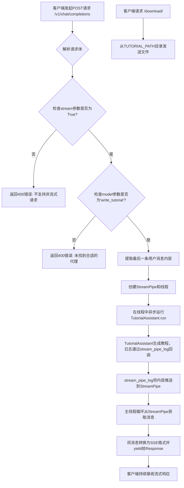

## 类结构

```
Flask Application (app)
├── Global Functions
│   ├── stream_pipe_log
│   ├── write_tutorial
│   └── (Flask Route Handlers)
│       ├── completions
│       └── download_file
└── External Dependencies
    ├── MetaGPT Framework
    │   ├── TutorialAssistant (Role)
    │   └── StreamPipe (Utility)
    └── Standard & Third-party Libraries
        ├── asyncio
        ├── threading
        ├── flask
        └── ...
```

## 全局变量及字段


### `app`
    
Flask应用实例，用于处理HTTP请求和路由

类型：`Flask`
    


### `server_port`
    
服务器监听的端口号，默认为7860

类型：`int`
    


### `server_address`
    
服务器绑定的IP地址，通过socket.gethostbyname获取本机IP

类型：`str`
    


### `stream_pipe_var`
    
上下文变量，用于在线程间传递StreamPipe实例以支持流式日志输出

类型：`ContextVar[StreamPipe]`
    


    

## 全局函数及方法

### `stream_pipe_log`

该函数是一个日志流处理函数，用于将内容输出到标准输出（控制台），并尝试从当前线程的上下文变量中获取一个`StreamPipe`实例。如果获取成功，则将内容通过该`StreamPipe`实例发送出去，实现日志信息的网络流式传输。

参数：

- `content`：`str`，需要处理和传输的日志内容字符串。

返回值：`None`，该函数不返回任何值。

#### 流程图

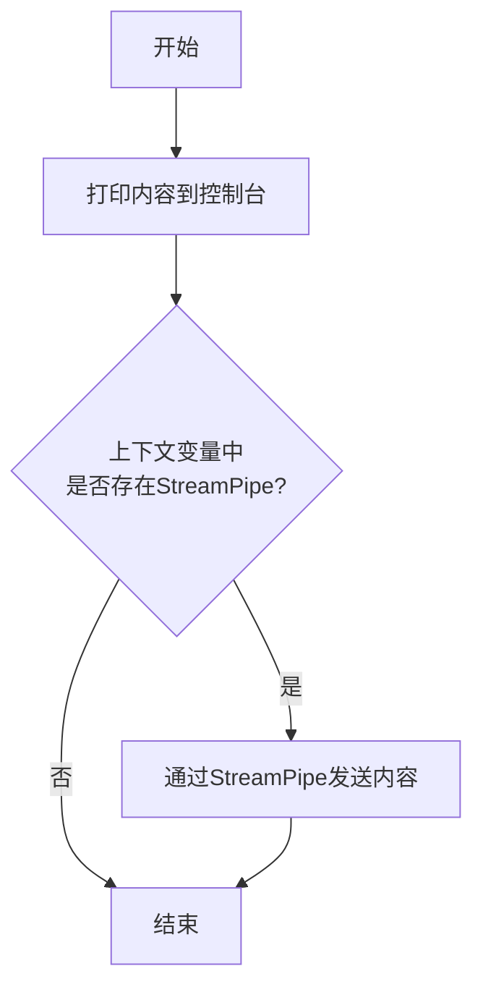

#### 带注释源码

```python
def stream_pipe_log(content):
    # 1. 将内容输出到标准输出（控制台），不换行
    print(content, end="")
    # 2. 尝试从当前线程的上下文变量中获取StreamPipe实例
    stream_pipe = stream_pipe_var.get(None)
    # 3. 如果成功获取到StreamPipe实例，则调用其set_message方法发送内容
    if stream_pipe:
        stream_pipe.set_message(content)
```

### `write_tutorial`

`write_tutorial` 是一个全局函数，它作为 Flask Web API 的一个处理端点。其核心功能是接收一个包含用户请求（如“编写一个关于 MySQL 的教程”）的消息字典，然后启动一个后台线程来异步执行 `TutorialAssistant` 角色的 `run` 方法以生成教程。该函数通过 `StreamPipe` 机制将生成过程中的日志信息流式地返回给客户端，实现了服务器向客户端的实时数据推送。

参数：

- `message`：`dict`，一个包含用户请求内容的字典，通常结构为 `{"role": "user", "content": "Write a tutorial about MySQL"}`。

返回值：`generator`，一个生成器，每次迭代产生一个格式化的字符串（通过 `stream_pipe.msg2stream` 处理），用于通过 HTTP 流式响应（Server-Sent Events）将 `TutorialAssistant` 生成教程过程中的日志信息实时发送给客户端。

#### 流程图

```mermaid
flowchart TD
    A[调用 write_tutorial(message)] --> B[创建 StreamPipe 对象]
    B --> C[创建并启动后台线程 thread]
    C --> D{线程 thread 是否存活?}
    D -- 是 --> E[从 stream_pipe 获取消息 msg]
    E --> F[通过 yield 返回 msg 的流式格式]
    F --> D
    D -- 否 --> G[函数结束， 生成器终止]
    
    subgraph 后台线程
        H[线程入口 thread_run] --> I[调用 asyncio.run(main(...))]
        I --> J[设置 ContextVar stream_pipe_var]
        J --> K[创建 TutorialAssistant 角色]
        K --> L[异步执行 role.run(idea)]
        L --> M[线程结束]
    end
    
    C -.-> H
```

#### 带注释源码

```python
def write_tutorial(message):
    # 内部定义的异步主函数，用于在后台线程中运行 TutorialAssistant
    async def main(idea, stream_pipe):
        # 将当前线程/协程上下文中的 stream_pipe 对象设置到 ContextVar 中
        stream_pipe_var.set(stream_pipe)
        # 实例化 TutorialAssistant 角色
        role = TutorialAssistant()
        # 异步运行该角色的主要逻辑，传入用户的想法（idea）
        await role.run(idea)

    # 包装函数，将异步的 main 函数转换为可在新线程中运行的函数
    def thread_run(idea: str, stream_pipe: StreamPipe = None):
        """
        Convert asynchronous function to thread function
        """
        # 在新线程中运行异步事件循环
        asyncio.run(main(idea, stream_pipe))

    # 创建一个 StreamPipe 对象，用于在线程和主函数之间传递消息
    stream_pipe = StreamPipe()
    # 创建一个新的线程，目标函数是 thread_run，并传入用户消息内容和 stream_pipe
    thread = threading.Thread(
        target=thread_run,
        args=(
            message["content"],
            stream_pipe,
        ),
    )
    # 启动后台线程
    thread.start()

    # 主线程循环：只要后台线程还在运行，就不断从 stream_pipe 获取消息
    while thread.is_alive():
        # 从 StreamPipe 中获取一条消息
        msg = stream_pipe.get_message()
        # 使用 yield 将消息转换为流式格式并返回，实现服务器推送
        yield stream_pipe.msg2stream(msg)
```

### `completions`

该函数是Flask应用中的一个路由处理函数，用于处理发送到 `/v1/chat/completions` 的POST请求。它解析请求数据，验证流式请求，并根据请求中的模型类型调用相应的处理逻辑（目前仅支持 `write_tutorial` 模型），最终返回一个流式响应或错误信息。

参数：

-  `无显式参数`：`无`，该函数通过Flask的 `request` 对象获取请求数据。

返回值：`flask.Response` 或 `flask.jsonify` 的返回值，根据请求处理结果返回一个流式响应（`text/plain` 类型）或一个包含错误信息的JSON响应。

#### 流程图

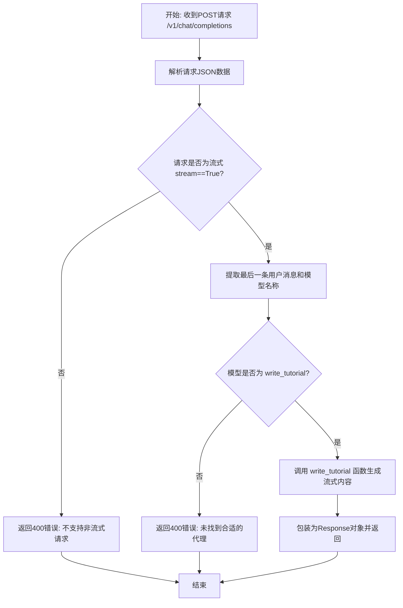

#### 带注释源码

```python
@app.route("/v1/chat/completions", methods=["POST"]) # Flask路由装饰器，定义处理POST请求的端点
def completions():
    """
    data: {
        "model": "write_tutorial",
        "stream": true,
        "messages": [
            {
                "role": "user",
                "content": "Write a tutorial about MySQL"
            }
        ]
    }
    """
    # 从请求体中加载JSON数据
    data = json.loads(request.data)
    # 使用日志记录器记录接收到的数据，便于调试
    logger.info(json.dumps(data, indent=4, ensure_ascii=False))

    # 检查请求是否要求流式输出，目前仅支持流式接口
    stream_type = True if data.get("stream") else False
    if not stream_type:
        # 如果不是流式请求，返回400错误
        return jsonify({"status": 400, "msg": "Non-streaming requests are not supported, please use `stream=True`."})

    # 从消息列表中获取最后一条用户消息
    last_message = data["messages"][-1]
    # 获取请求中指定的模型名称
    model = data["model"]

    # 根据模型名称进行路由分发
    if model == "write_tutorial":
        # 如果模型是'write_tutorial'，则调用write_tutorial函数处理最后一条消息
        # write_tutorial是一个生成器函数，返回流式内容
        # 使用Response包装生成器，并设置MIME类型为text/plain以支持流式传输
        return Response(write_tutorial(last_message), mimetype="text/plain")
    else:
        # 如果模型不匹配，返回400错误
        return jsonify({"status": 400, "msg": "No suitable agent found."})
```

### `download_file`

该函数是一个Flask路由处理器，用于处理文件下载请求。它接收一个文件名作为路径参数，从预定义的教程文件目录中查找该文件，并将其作为附件发送给客户端，从而允许用户下载指定的教程文件。

参数：

- `filename`：`str`，请求下载的文件名，作为URL路径的一部分传递。

返回值：`flask.Response`，返回一个Flask响应对象，该对象将指定文件作为附件发送给客户端。

#### 流程图

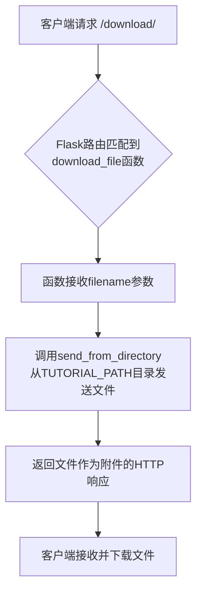

#### 带注释源码

```python
@app.route("/download/<path:filename>")  # 定义Flask路由，匹配以/download/开头的URL，并将路径剩余部分作为filename参数
def download_file(filename):
    # 使用Flask的send_from_directory函数从TUTORIAL_PATH目录中发送文件
    # as_attachment=True 参数指示浏览器将响应作为附件处理，触发下载而非直接显示
    return send_from_directory(TUTORIAL_PATH, filename, as_attachment=True)
```

### `write_tutorial`

`write_tutorial` 是一个全局函数，它作为 Flask 应用 `/v1/chat/completions` 路由的流式响应生成器。其核心功能是接收一个包含用户请求（如“写一个关于 MySQL 的教程”）的消息字典，启动一个后台线程来异步执行 `TutorialAssistant` 角色的 `run` 方法以生成教程内容，并通过 `StreamPipe` 机制将生成过程中的日志信息实时流式传输回客户端。

参数：

- `message`：`dict`，包含用户请求内容的消息字典，通常结构为 `{"role": "user", "content": "Write a tutorial about MySQL"}`。

返回值：`generator`，一个生成器，每次迭代产生一个格式化为 Server-Sent Events (SSE) 流格式的字符串，包含从 `StreamPipe` 获取的实时日志消息。

#### 流程图

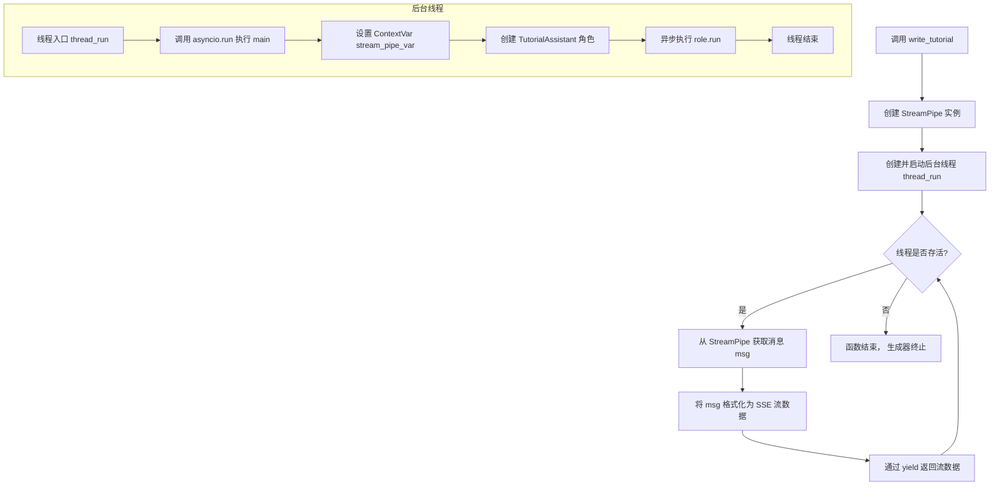

#### 带注释源码

```python
def write_tutorial(message):
    # 内部定义的异步主函数，用于在后台线程中运行 TutorialAssistant
    async def main(idea, stream_pipe):
        # 将当前线程的 StreamPipe 实例设置到上下文变量中，供日志函数 stream_pipe_log 访问
        stream_pipe_var.set(stream_pipe)
        # 创建 TutorialAssistant 角色实例
        role = TutorialAssistant()
        # 异步运行角色的主要逻辑，传入用户的想法（idea）
        await role.run(idea)

    # 线程运行函数，将异步的 main 函数包装成可在线程中运行的形式
    def thread_run(idea: str, stream_pipe: StreamPipe = None):
        """
        Convert asynchronous function to thread function
        """
        # 在新的事件循环中运行异步主函数
        asyncio.run(main(idea, stream_pipe))

    # 创建一个 StreamPipe 实例，用于在线程和主函数之间传递消息
    stream_pipe = StreamPipe()
    # 创建一个线程，目标函数是 thread_run，传入用户消息内容和 stream_pipe
    thread = threading.Thread(
        target=thread_run,
        args=(
            message["content"],
            stream_pipe,
        ),
    )
    # 启动后台线程
    thread.start()

    # 主循环：只要后台线程还在运行，就持续从 StreamPipe 获取消息并流式返回
    while thread.is_alive():
        # 从 StreamPipe 中获取一条消息
        msg = stream_pipe.get_message()
        # 将消息格式化为 SSE 流格式并通过 yield 返回，实现流式响应
        yield stream_pipe.msg2stream(msg)
```

### `thread_run`

该函数是一个包装器，用于将异步的 `main` 函数转换为一个可以在独立线程中运行的同步函数。它接收一个想法字符串和一个可选的 `StreamPipe` 对象，然后在新线程中启动异步事件循环来执行 `TutorialAssistant` 角色的 `run` 方法。

参数：

- `idea`：`str`，表示要生成教程的主题或想法。
- `stream_pipe`：`StreamPipe`，可选参数，用于在异步任务和主线程之间传递流式消息的管道对象。

返回值：`None`，该函数不返回任何值，其作用是在后台线程中启动并运行异步任务。

#### 流程图

```mermaid
flowchart TD
    A[开始: thread_run(idea, stream_pipe)] --> B[调用 asyncio.run(main(idea, stream_pipe))]
    B --> C[在 main 函数中:<br>1. 设置上下文变量 stream_pipe_var<br>2. 实例化 TutorialAssistant<br>3. 调用 role.run(idea)]
    C --> D[异步任务执行完毕]
    D --> E[线程函数结束]
```

#### 带注释源码

```python
    def thread_run(idea: str, stream_pipe: StreamPipe = None):
        """
        Convert asynchronous function to thread function
        """
        # 使用 asyncio.run 来运行异步的 main 函数。
        # 这会在当前线程中创建一个新的事件循环，运行 main 协程，然后关闭循环。
        asyncio.run(main(idea, stream_pipe))
```

### `Flask (app).route`

这是一个Flask应用的路由装饰器，用于将URL规则绑定到特定的视图函数。它定义了当客户端请求匹配的URL时，应该调用哪个函数来处理请求并生成响应。

参数：

- `rule`：`str`，URL规则字符串，例如 `/v1/chat/completions` 或 `/download/<path:filename>`。
- `methods`：`list`，一个可选的HTTP方法列表，指定该路由可以处理的请求方法，例如 `['GET', 'POST']`。如果未指定，默认为 `['GET']`。
- `endpoint`：`str`，可选的端点名称。如果未提供，Flask会根据视图函数的名称自动生成。
- `options`：`dict`，其他可选参数，用于进一步配置路由行为。

返回值：`function`，返回一个装饰器函数，该装饰器将视图函数注册到指定的URL规则。

#### 流程图

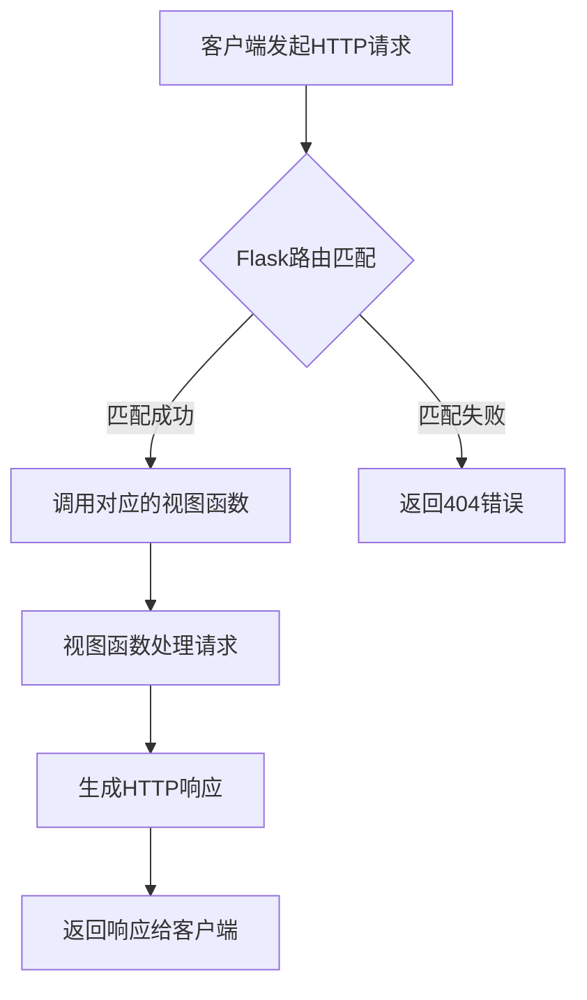

#### 带注释源码

```
@app.route("/v1/chat/completions", methods=["POST"])
def completions():
    """
    data: {
        "model": "write_tutorial",
        "stream": true,
        "messages": [
            {
                "role": "user",
                "content": "Write a tutorial about MySQL"
            }
        ]
    }
    """

    data = json.loads(request.data)
    logger.info(json.dumps(data, indent=4, ensure_ascii=False))

    # Non-streaming interfaces are not supported yet
    stream_type = True if data.get("stream") else False
    if not stream_type:
        return jsonify({"status": 400, "msg": "Non-streaming requests are not supported, please use `stream=True`."})

    # Only accept the last user information
    # openai['model'] ~ MetaGPT['agent']
    last_message = data["messages"][-1]
    model = data["model"]

    # write_tutorial
    if model == "write_tutorial":
        return Response(write_tutorial(last_message), mimetype="text/plain")
    else:
        return jsonify({"status": 400, "msg": "No suitable agent found."})
```

```
@app.route("/download/<path:filename>")
def download_file(filename):
    return send_from_directory(TUTORIAL_PATH, filename, as_attachment=True)
```

### `Flask.run`

启动Flask开发服务器，监听指定主机和端口，处理HTTP请求。

参数：

- `host`：`str`，服务器监听的主机地址，默认为`'127.0.0.1'`（本地回环地址）。传入`'0.0.0.0'`可使服务器在外部可访问。
- `port`：`int`，服务器监听的端口号，默认为`5000`。
- `debug`：`bool`，是否启用调试模式。如果为`True`，服务器会在代码变更时自动重载，并提供详细的错误页面。
- `load_dotenv`：`bool`，是否从`.env`和`.flaskenv`文件加载环境变量。
- `options`：`dict`，传递给底层Werkzeug服务器的其他可选参数。

返回值：`None`，此方法启动服务器并阻塞执行，直到服务器被手动停止（例如通过键盘中断`Ctrl+C`）。

#### 流程图

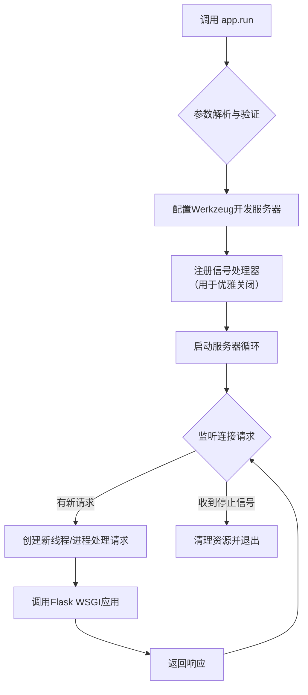

#### 带注释源码

```python
def run(self, host=None, port=None, debug=None,
        load_dotenv=True, **options):
    """
    运行Flask应用。

    这是一个便捷的方法，用于启动一个适用于开发的Werkzeug服务器。
    在生产环境中不应使用此方法。请使用生产级的WSGI服务器，
    如 Gunicorn 或 uWSGI。

    如果提供了 `debug` 参数，它将覆盖 `app.debug` 的设置。

    默认情况下，线程处理是启用的。

    :param host: 要监听的主机名。设置为 ``'0.0.0.0'`` 以使服务器在外部可用。
                 默认为 ``'127.0.0.1'`` 或 `SERVER_NAME` 配置变量中的主机部分。
    :param port: 要监听的端口号。默认为 ``5000`` 或 `SERVER_NAME` 配置变量中的端口部分。
    :param debug: 如果提供，启用或禁用调试模式。参见 `debug`。
    :param load_dotenv: 从 `.env` 和 `.flaskenv` 文件加载环境变量。
    :param options: 传递给底层Werkzeug服务器的选项。
    """
    # 从环境变量或默认值获取主机和端口
    if host is None:
        host = "127.0.0.1"
    if port is None:
        server_name = self.config.get("SERVER_NAME")
        if server_name and ":" in server_name:
            port = int(server_name.rsplit(":", 1)[1])
        else:
            port = 5000

    # 设置调试模式
    if debug is not None:
        self.debug = bool(debug)

    # 加载环境变量文件
    if load_dotenv:
        cli.load_dotenv()

    # 确保应用已设置好
    try:
        self._got_first_request
    except AttributeError:
        # 如果这是第一次运行，确保应用已准备好处理请求
        with self.request_context({}):
            pass

    # 导入并创建Werkzeug开发服务器
    from werkzeug.serving import run_simple

    # 运行服务器
    # `use_reloader` 和 `use_debugger` 参数控制是否在调试模式下启用代码重载和调试器。
    # `threaded=True` 启用多线程处理请求。
    run_simple(host, port, self, **options)
```

### `TutorialAssistant.run`

该方法用于运行教程助手角色，根据给定的主题生成教程内容。它通过异步方式执行，调用内部的工作流程来生成教程，并将结果保存到文件中。

参数：

- `self`：`TutorialAssistant`，教程助手实例
- `message`：`Message`，包含用户请求的消息对象，其中包含生成教程的主题

返回值：`None`，无返回值

#### 流程图

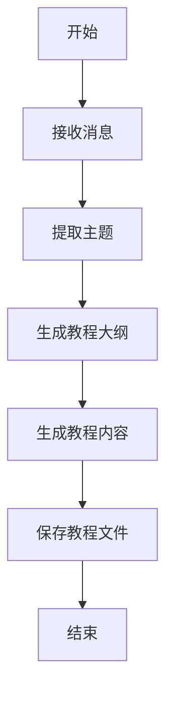

#### 带注释源码

```python
async def run(self, message: Message) -> None:
    """
    运行教程助手角色，根据给定的主题生成教程内容。

    参数：
        message (Message): 包含用户请求的消息对象，其中包含生成教程的主题。

    返回值：
        None: 无返回值。
    """
    # 提取消息中的主题
    topic = message.content

    # 生成教程大纲
    outline = await self._generate_outline(topic)

    # 根据大纲生成教程内容
    content = await self._generate_content(outline)

    # 保存教程到文件
    await self._save_tutorial(topic, content)
```

### `StreamPipe.set_message`

该方法用于向 `StreamPipe` 实例的消息队列中设置一条新的消息。它接收一个字符串内容，将其包装成一个包含时间戳和内容的字典，然后放入一个线程安全的队列中，以便其他线程或协程可以异步获取。

参数：

- `content`：`str`，要设置的消息内容。

返回值：`None`，无返回值。

#### 流程图

```mermaid
flowchart TD
    A[开始: set_message(content)] --> B[获取当前时间戳]
    B --> C[构建消息字典<br>包含时间戳和内容]
    C --> D[将消息放入队列 queue]
    D --> E[结束]
```

#### 带注释源码

```python
def set_message(self, content: str):
    """
    设置消息到队列中。

    Args:
        content (str): 消息内容。
    """
    # 获取当前时间戳
    timestamp = time.time()
    # 构建消息字典，包含时间戳和内容
    message = {"timestamp": timestamp, "content": content}
    # 将消息放入线程安全的队列中
    self.queue.put(message)
```

### `StreamPipe.get_message`

该方法用于从流管道中获取消息。它会从消息队列中取出最早的消息，如果队列为空则返回 `None`。

参数：

-  `self`：`StreamPipe`，`StreamPipe` 类的实例

返回值：`str | None`，返回从队列中获取的消息字符串，如果队列为空则返回 `None`

#### 流程图

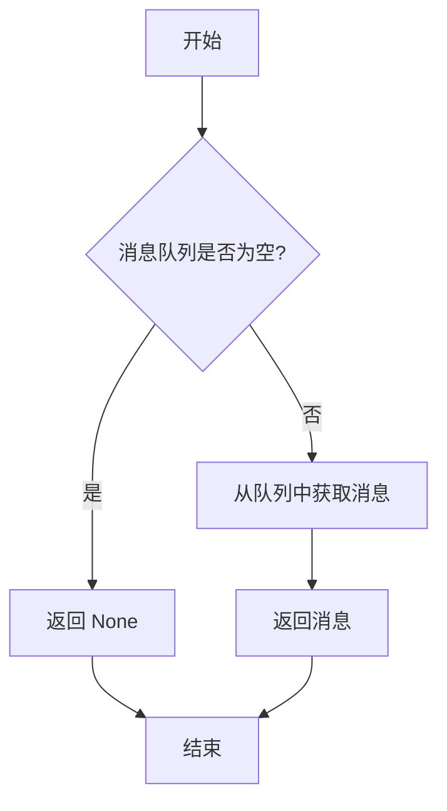

#### 带注释源码

```python
def get_message(self) -> str | None:
    """
    从消息队列中获取消息。

    如果队列中有消息，则返回最早的消息；如果队列为空，则返回 None。

    Returns:
        str | None: 消息字符串或 None
    """
    try:
        # 从消息队列中获取消息，如果队列为空则返回 None
        return self.msg_queue.get_nowait()
    except queue.Empty:
        # 捕获队列为空的异常，返回 None
        return None
```

### `StreamPipe.msg2stream`

将给定的消息对象转换为符合 Server-Sent Events (SSE) 格式的字符串流。如果消息为 `None`，则返回一个空字符串。

参数：

- `msg`：`Any`，需要被转换为流格式的消息对象。通常是一个字符串或字典，但也可以是任何可被 `json.dumps` 序列化的对象。

返回值：`str`，一个符合 SSE 格式的字符串。格式为 `data: {json_string}\n\n`。如果输入消息为 `None`，则返回空字符串 `''`。

#### 流程图

```mermaid
flowchart TD
    A[开始: msg2stream(msg)] --> B{msg 是否为 None?};
    B -- 是 --> C[返回空字符串 ''];
    B -- 否 --> D[使用 json.dumps 将 msg 序列化为字符串];
    D --> E[将字符串包装为 SSE 格式: data: {json_string}\n\n];
    E --> F[返回格式化后的字符串];
    C --> G[结束];
    F --> G;
```

#### 带注释源码

```python
def msg2stream(self, msg: Any) -> str:
    """
    将消息转换为 Server-Sent Events (SSE) 格式的字符串。

    Args:
        msg (Any): 要发送的消息。可以是任何可 JSON 序列化的对象。

    Returns:
        str: 格式为 `data: {json_string}\n\n` 的字符串。如果 msg 为 None，则返回空字符串。
    """
    if msg is None:
        # 如果消息为空，返回空字符串，避免发送无效的 SSE 事件。
        return ''
    # 将消息对象序列化为 JSON 字符串，并包装成 SSE 标准格式。
    # `ensure_ascii=False` 确保非 ASCII 字符（如中文）能正确显示。
    # 每个 SSE 事件以 `data: ` 开头，以两个换行符 `\n\n` 结尾。
    return f"data: {json.dumps(msg, ensure_ascii=False)}\n\n"
```

### `threading.Thread.__init__`

该方法用于初始化一个新的线程对象，设置线程的目标函数、参数、名称等属性，并准备线程的执行环境。

参数：

- `self`：`Thread`，当前线程实例
- `target`：`callable`，线程启动后要调用的可调用对象（函数或方法）
- `args`：`tuple`，传递给目标函数的参数元组
- `kwargs`：`dict`，传递给目标函数的关键字参数字典
- `daemon`：`bool`，设置线程是否为守护线程（可选）
- `name`：`str`，线程的名称（可选）
- `group`：`None`，保留参数，目前未使用（应为None）

返回值：`None`，无返回值

#### 流程图

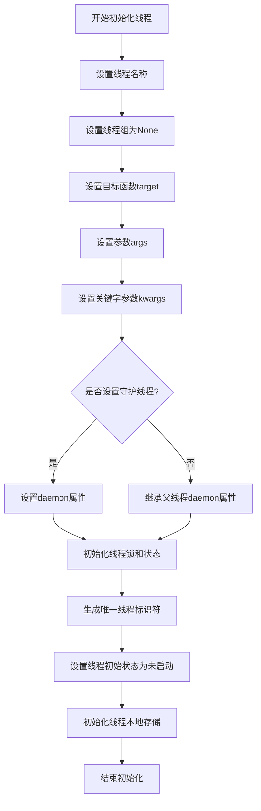

#### 带注释源码

```python
def __init__(self, group=None, target=None, name=None,
             args=(), kwargs=None, *, daemon=None):
    """初始化线程对象
    
    Args:
        group: 应为None，保留用于未来扩展
        target: 线程启动后调用的可调用对象
        name: 线程名称
        args: 目标函数的参数元组
        kwargs: 目标函数的关键字参数字典
        daemon: 是否为守护线程
    """
    # 确保group参数为None（当前未使用）
    assert group is None, "group argument must be None for now"
    
    # 初始化父类
    super().__init__()
    
    # 设置线程基本属性
    self._target = target          # 目标函数
    self._name = str(name or _newname())  # 线程名称，未提供则自动生成
    self._args = args              # 位置参数
    self._kwargs = kwargs if kwargs is not None else {}  # 关键字参数
    
    # 设置守护线程属性
    if daemon is not None:
        self._daemonic = daemon    # 显式设置守护标志
    else:
        self._daemonic = current_thread().daemon  # 继承父线程的守护标志
    
    # 初始化线程状态和控制变量
    self._ident = None             # 线程标识符，启动后由系统分配
    self._tstate_lock = None       # 线程状态锁
    self._started = Event()        # 线程启动事件
    self._is_stopped = False       # 线程停止标志
    self._initialized = True       # 初始化完成标志
    
    # 复制当前线程的本地存储上下文
    self._stderr = _sys.stderr
    
    # 设置线程本地存储
    _dangling.add(self)            # 将线程添加到全局管理集合
```

### `threading.Thread.start`

启动线程，使其开始执行目标函数。该方法会调用线程对象的 `run()` 方法，从而在新线程中执行 `target` 参数指定的函数。一旦线程启动，它将独立于主线程运行，直到目标函数执行完毕或线程被终止。

参数：

- `self`：`threading.Thread`，表示要启动的线程实例本身。

返回值：`None`，无返回值。

#### 流程图

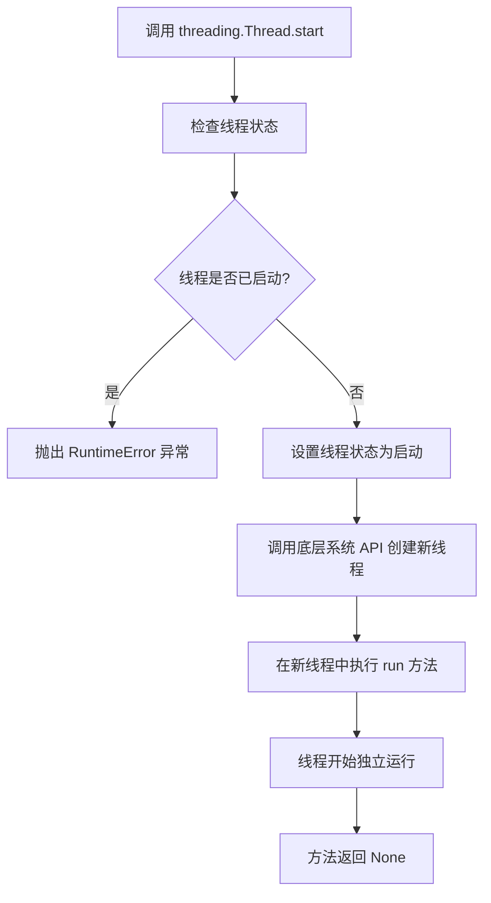

#### 带注释源码

```python
def start(self):
    """Start the thread's activity.

    It must be called at most once per thread object. It arranges for the
    object's run() method to be invoked in a separate thread of control.

    This method will raise a RuntimeError if called more than once on the
    same thread object.

    """
    # 检查线程是否已经启动，如果已经启动则抛出 RuntimeError 异常
    if not self._initialized:
        raise RuntimeError("thread.__init__() not called")

    if self._started.is_set():
        raise RuntimeError("threads can only be started once")
    
    # 使用 _started 事件标记线程已启动
    with _active_limbo_lock:
        _limbo[self] = self
    try:
        # 调用底层操作系统的线程创建 API（如 pthread_create 或 CreateThread）
        # 在新创建的线程中执行 self.run() 方法
        _start_new_thread(self._bootstrap, ())
    except Exception:
        with _active_limbo_lock:
            del _limbo[self]
        raise
    self._started.wait()
```

### `threading.Thread.is_alive`

该方法用于检查线程是否仍在执行中。它返回一个布尔值，表示线程是否存活。

参数：
- 无

返回值：`bool`，如果线程仍在执行中则返回 `True`，否则返回 `False`

#### 流程图

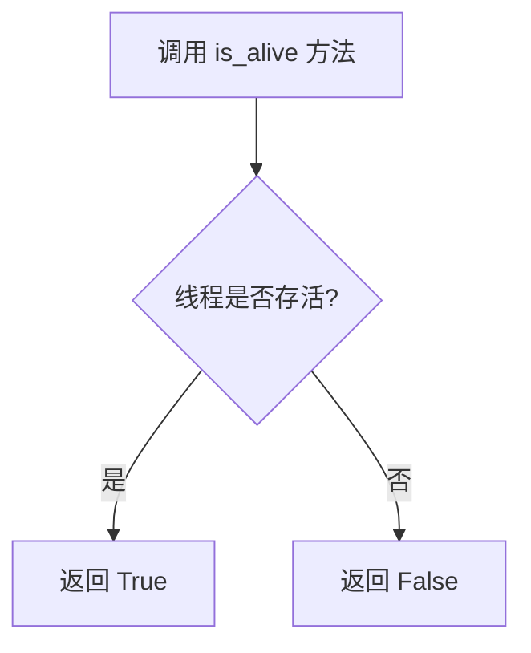

#### 带注释源码

```python
def is_alive(self):
    """
    检查线程是否仍在执行中。
    
    该方法通过检查线程的内部状态来确定线程是否存活。
    如果线程已经启动且尚未终止，则返回 True。
    
    返回:
        bool: 线程存活状态
    """
    with self._is_alive_lock:
        return self._is_alive
```

## 关键组件


### StreamPipe

一个用于在异步任务和主线程之间进行流式数据传输的管道组件，支持消息的异步设置和同步获取。

### ContextVar (stream_pipe_var)

一个线程/协程安全的上下文变量，用于在当前执行上下文中存储和访问StreamPipe实例，确保日志流能正确路由到对应的HTTP响应流。

### Flask Web API

一个基于Flask框架构建的轻量级Web服务，提供兼容OpenAI格式的API端点，用于接收生成教程的请求并返回流式响应。

### 异步任务执行器 (write_tutorial函数内的机制)

一个将异步的`TutorialAssistant.run`方法封装到独立线程中执行的组件，允许在同步的Flask请求-响应周期内处理长时间运行的异步任务。

### 日志流重定向 (set_llm_stream_logfunc与stream_pipe_log)

一个日志处理钩子组件，通过`set_llm_stream_logfunc`将框架内部的LLM日志输出重定向到自定义的`stream_pipe_log`函数，从而实现将日志内容实时推送到StreamPipe。

### 文件下载服务

一个简单的静态文件服务端点，用于提供由`TutorialAssistant`生成的教程文件的下载功能。


## 问题及建议


### 已知问题

-   **线程与异步混合的复杂性**：代码使用 `threading.Thread` 来包装异步函数 `main`，并通过 `asyncio.run()` 在新线程中运行。这种模式虽然绕过了 Flask 默认不支持异步视图函数的限制，但增加了代码的复杂性和调试难度，可能导致难以预料的事件循环问题或资源管理错误。
-   **阻塞式轮询**：`write_tutorial` 函数中的 `while thread.is_alive():` 循环会持续轮询 `stream_pipe.get_message()`。这是一个阻塞操作，会占用 CPU 资源，并且在高并发场景下会严重影响服务器性能和响应能力。
-   **全局状态管理脆弱**：使用 `ContextVar` (`stream_pipe_var`) 来在线程间传递 `StreamPipe` 实例。虽然 `ContextVar` 是为异步上下文设计，但在多线程环境中使用需要格外小心。当前的实现依赖于 `stream_pipe_log` 函数在正确的上下文中被调用，这增加了状态管理的复杂性和出错风险。
-   **错误处理不完善**：`write_tutorial` 函数和 `completions` 视图函数缺乏对内部异常（如 `TutorialAssistant.run` 执行失败、线程启动失败等）的捕获和处理。一旦发生错误，客户端可能只会收到连接中断，而无法获得明确的错误信息。
-   **硬编码的服务器配置**：服务器地址和端口 (`server_port`, `server_address`) 在 `if __name__ == "__main__":` 块中硬编码，缺乏灵活性，不便于通过环境变量或配置文件进行管理。
-   **MIME 类型不准确**：`write_tutorial` 函数返回的响应使用了 `mimetype="text/plain"`。然而，该函数生成的是 Server-Sent Events (SSE) 格式的流数据，更合适的 MIME 类型应为 `text/event-stream`。
-   **模型/代理映射单一**：`completions` 函数目前只支持 `model` 为 `"write_tutorial"` 的请求，扩展性差。添加新的功能需要修改此函数，违反了开闭原则。

### 优化建议

-   **采用异步 Web 框架**：将 Flask 替换为原生支持异步的 Web 框架，如 FastAPI 或 Quart。这样可以彻底移除 `threading` 和 `asyncio.run` 的包装，直接使用 `async/await` 编写视图函数，简化代码结构，提升并发性能。
-   **使用异步队列或 Pub/Sub**：替换 `StreamPipe` 的轮询机制。可以使用 `asyncio.Queue`（在异步框架中）或消息队列（如 Redis Pub/Sub）来实现生产者和消费者之间的非阻塞通信。`TutorialAssistant` 将消息放入队列，而 Web 视图函数则异步地从队列中获取并流式返回给客户端。
-   **重构为清晰的服务层**：将业务逻辑（如调用 `TutorialAssistant`）从 Web 层（Flask 视图函数）中分离出来。可以创建一个独立的服务类或模块来处理教程生成请求，Web 层仅负责接收请求、调用服务、格式化响应和流式输出。这提高了代码的可测试性和可维护性。
-   **增强错误处理与日志**：
    -   在 `write_tutorial` 和 `completions` 中包裹 `try...except` 块，捕获可能出现的异常，并返回结构化的错误信息（如 JSON 格式）给客户端。
    -   为线程内的异步任务添加更详细的日志记录，便于追踪执行过程和定位问题。
-   **配置外部化**：将服务器端口、主机地址等配置项移至环境变量或配置文件中（例如使用 `python-dotenv` 或 Pydantic `BaseSettings`），提高部署的灵活性。
-   **修正 MIME 类型**：将 `write_tutorial` 返回响应的 `mimetype` 从 `"text/plain"` 改为 `"text/event-stream"`，以符合 SSE 规范，方便前端使用 `EventSource` 正确解析。
-   **设计可扩展的模型路由**：重构 `completions` 函数，使用一个注册表或字典来映射 `model` 字段到对应的处理函数或类。这样，新增功能时只需向注册表添加新的映射，而无需修改 `completions` 函数的核心逻辑。
-   **考虑添加请求超时与取消机制**：对于长时间运行的生成任务，应考虑支持客户端超时设置或请求取消（例如通过另一个 API 端点），以管理服务器资源并改善用户体验。


## 其它


### 设计目标与约束

本代码旨在提供一个基于Flask的Web API服务，将MetaGPT框架中TutorialAssistant角色的能力（生成教程）封装为符合OpenAI Chat Completions API格式的流式接口。核心设计目标包括：1) 提供与OpenAI API兼容的请求/响应格式，便于客户端集成；2) 支持流式输出，实时返回教程生成过程中的日志信息；3) 将异步的MetaGPT角色运行逻辑适配到同步的Flask Web框架中。主要约束包括：1) 仅支持流式请求（`stream=True`）；2) 当前仅实现`write_tutorial`一个“模型”（对应TutorialAssistant角色）；3) 依赖MetaGPT框架的内部模块（如`TutorialAssistant`, `StreamPipe`）。

### 错误处理与异常设计

代码中的错误处理相对基础，主要集中在API端点`/v1/chat/completions`的请求验证阶段：
1.  **请求格式验证**：检查`stream`字段是否为`True`，若非流式请求则返回400状态码及错误信息。
2.  **模型/代理匹配**：检查请求中的`model`字段是否为支持的`"write_tutorial"`，否则返回400状态码及错误信息。
3.  **隐式异常处理**：`json.loads(request.data)`可能因JSON格式错误抛出`json.JSONDecodeError`，但未显式捕获，将由Flask框架处理并返回500错误。`write_tutorial`函数内部的异步任务执行、线程操作等可能产生的异常也未显式捕获和处理，可能导致线程意外终止或服务器内部错误。整体缺乏对网络超时、资源限制（如并发请求数）、下游MetaGPT组件异常等的系统化处理。

### 数据流与状态机

1.  **请求数据流**：
    *   客户端发送POST请求至`/v1/chat/completions`，携带JSON体。
    *   Flask接收请求，解析JSON，验证`stream`和`model`参数。
    *   若验证通过，提取最后一条用户消息的`content`作为教程主题。
    *   调用`write_tutorial`函数，传入包含主题的消息字典。
2.  **流式响应生成流**：
    *   `write_tutorial`函数创建`StreamPipe`实例和后台线程。
    *   线程启动，执行`TutorialAssistant().run(idea)`，这是一个异步的MetaGPT工作流。
    *   `stream_pipe_log`函数被设置为LLM流式日志的回调。当MetaGPT内部产生日志时，该函数被调用，将日志内容通过`ContextVar`获取的当前`StreamPipe`实例发送出去。
    *   主线程（Flask请求处理线程）通过`stream_pipe.get_message()`轮询获取日志消息，并使用`yield`以Server-Sent Events (SSE)格式流式返回给客户端。
    *   线程结束后，循环退出，响应结束。
3.  **状态**：系统主要状态体现在后台线程的生命周期（`thread.is_alive()`）和`StreamPipe`内部的消息队列上。没有复杂的多状态状态机。

### 外部依赖与接口契约

1.  **外部库依赖**：
    *   **Flask**: 用于构建Web服务器和定义路由。
    *   **MetaGPT框架** (`metagpt`): 核心业务逻辑依赖，特别是`TutorialAssistant`角色、`StreamPipe`、`logger`、`set_llm_stream_logfunc`和`TUTORIAL_PATH`常量。
    *   **asyncio, threading, socket, json, contextvars**: Python标准库，用于异步处理、线程、网络、数据序列化和上下文管理。
2.  **接口契约**：
    *   **对客户端（上游）的契约**：遵循OpenAI Chat Completions API的部分格式。必须使用POST方法，`stream`字段必须为`true`，`model`字段必须为`"write_tutorial"`，`messages`中最后一个`role`为`"user"`的消息的`content`字段作为输入。响应为`text/plain`格式的流式文本（非标准JSON流）。
    *   **对MetaGPT框架（下游）的契约**：通过`set_llm_stream_logfunc`注册日志回调函数`stream_pipe_log`。该函数需接受一个字符串参数。通过实例化`TutorialAssistant`并调用其`run`方法来驱动教程生成流程。
    *   **内部组件契约**：`StreamPipe`类需提供`set_message`、`get_message`和`msg2stream`方法，用于线程间通信和消息格式转换。`stream_pipe_var` (`ContextVar`) 用于在异步上下文中传递`StreamPipe`实例。

    