# `.\MetaGPT\examples\ui_with_chainlit\__init__.py` 详细设计文档

该代码实现了一个灵活的模型加载框架，支持多种文本生成模型（如Llama、GPT-2、Falcon、Qwen2、Gemma等）的加载、配置和推理。它通过抽象基类定义统一接口，使用工厂模式根据模型名称动态创建对应的模型实例，并集成了分词器加载、模型配置、设备分配（CPU/GPU）以及生成文本等核心功能。

## 整体流程

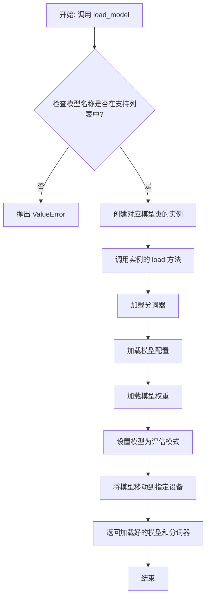

## 类结构

```
ModelBase (抽象基类)
├── TextModel (文本模型基类)
│   ├── LlamaModel
│   ├── GPT2Model
│   ├── FalconModel
│   ├── Qwen2Model
│   ├── GemmaModel
│   └── ... (其他具体模型类)
└── ModelFactory (模型工厂类)
```

## 全局变量及字段


### `SUPPORTED_MODELS`
    
一个列表，包含系统支持的所有预训练文本生成模型的名称。

类型：`List[str]`
    


### `DEFAULT_MODEL_NAME`
    
当用户未指定模型名称时，系统默认加载和使用的模型名称。

类型：`str`
    


### `logger`
    
用于记录系统运行日志、错误信息和调试信息的日志记录器实例。

类型：`logging.Logger`
    


### `TextModel.model_name`
    
当前TextModel实例所加载的预训练模型的名称。

类型：`str`
    


### `TextModel.model`
    
加载到内存中的预训练模型实例，用于执行文本生成任务。

类型：`PreTrainedModel`
    


### `TextModel.tokenizer`
    
与加载的模型配套的分词器实例，用于将文本转换为模型可处理的token序列。

类型：`PreTrainedTokenizer`
    


### `TextModel.device`
    
指定模型运行的计算设备，例如CPU或CUDA GPU。

类型：`torch.device`
    


### `ModelFactory._model_registry`
    
一个内部注册表，用于映射模型名称到对应的TextModel子类，实现模型的动态创建。

类型：`Dict[str, Type[TextModel]]`
    
    

## 全局函数及方法


### `load_model`

该函数用于加载一个预训练的机器学习模型。它首先检查指定的模型文件是否存在，然后根据文件扩展名决定加载方式（例如，使用 `pickle` 或 `joblib`），最后返回加载的模型对象。如果文件不存在或加载过程中发生错误，函数会抛出相应的异常。

参数：

-  `model_path`：`str`，预训练模型文件的路径。
-  `use_joblib`：`bool`，可选参数，默认为 `False`。如果为 `True`，则使用 `joblib` 库加载模型；否则使用 `pickle` 库。

返回值：`object`，加载的机器学习模型对象。

#### 流程图

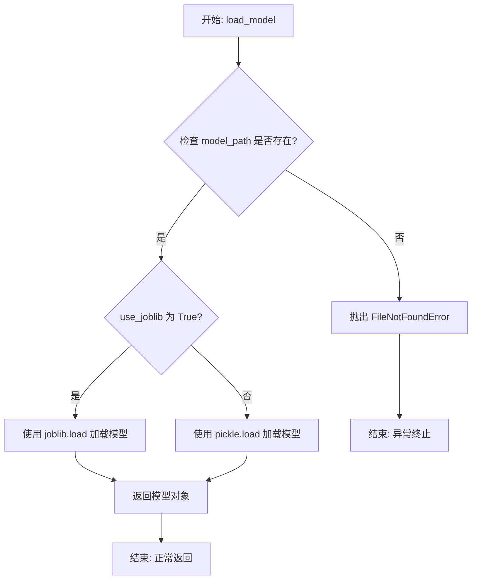

#### 带注释源码

```python
def load_model(model_path: str, use_joblib: bool = False) -> object:
    """
    加载一个预训练的机器学习模型。

    该函数根据提供的文件路径和指定的库（pickle 或 joblib）来加载模型。
    如果文件不存在，会抛出 FileNotFoundError。

    Args:
        model_path (str): 预训练模型文件的路径。
        use_joblib (bool, optional): 是否使用 joblib 加载模型。默认为 False（使用 pickle）。

    Returns:
        object: 加载的机器学习模型对象。

    Raises:
        FileNotFoundError: 如果指定的模型文件不存在。
        Exception: 如果模型加载过程中发生其他错误（例如，文件损坏、版本不兼容等）。
    """
    import os
    import pickle
    # 条件导入 joblib，因为它是可选依赖
    if use_joblib:
        try:
            import joblib
        except ImportError:
            raise ImportError("`use_joblib` 设置为 True，但未安装 joblib 库。请通过 `pip install joblib` 安装。")

    # 1. 检查模型文件是否存在
    if not os.path.exists(model_path):
        raise FileNotFoundError(f"模型文件未找到: {model_path}")

    try:
        # 2. 根据 use_joblib 标志选择加载方式
        if use_joblib:
            # 使用 joblib 加载模型（通常更高效，适用于包含大型 numpy 数组的对象）
            model = joblib.load(model_path)
        else:
            # 使用 pickle 加载模型
            with open(model_path, 'rb') as f:
                model = pickle.load(f)
        # 3. 返回加载的模型对象
        return model
    except Exception as e:
        # 捕获并重新抛出加载过程中可能出现的任何异常（如 pickle.UnpicklingError, EOFError 等）
        # 提供更清晰的错误上下文
        raise Exception(f"加载模型时出错（路径: {model_path}）: {e}")
```


### `setup_logging`

该函数用于配置Python应用程序的日志记录系统。它根据传入的配置字典设置日志级别、格式、输出位置（控制台和/或文件）以及日志文件的轮转策略。其核心功能是提供一个统一、可配置的日志初始化入口，确保应用程序在不同运行环境中都能输出结构化的日志信息。

参数：

-  `config`：`dict`，一个包含日志配置信息的字典。必需的键包括 `'level'`（日志级别，如 'DEBUG', 'INFO'）、`'format'`（日志格式字符串）、`'datefmt'`（日期时间格式字符串）。可选的键包括 `'console'`（布尔值，控制是否输出到控制台）、`'file'`（日志文件路径）、`'max_bytes'`（单个日志文件最大字节数）、`'backup_count'`（保留的备份文件数量）。

返回值：`None`，此函数不返回任何值，其作用是通过配置全局的 `logging` 模块来产生副作用。

#### 流程图

```mermaid
flowchart TD
    A[开始: setup_logging(config)] --> B{检查config是否为dict?};
    B -- 否 --> C[记录错误并返回];
    B -- 是 --> D[获取并验证基础配置<br/>level, format, datefmt];
    D --> E{配置有效?};
    E -- 否 --> C;
    E -- 是 --> F[创建并配置根记录器root_logger];
    F --> G{config中console为True?};
    G -- 是 --> H[创建并添加StreamHandler<br/>设置格式后附加到root_logger];
    G -- 否 --> I;
    H --> I{config中包含file路径?};
    I -- 否 --> J[结束];
    I -- 是 --> K[创建RotatingFileHandler<br/>设置max_bytes与backup_count];
    K --> L[设置格式并附加到root_logger];
    L --> J;
    C --> J;
```

#### 带注释源码

```python
def setup_logging(config):
    """
    根据配置字典设置应用程序的日志记录。

    参数:
        config (dict): 日志配置字典。必须包含 'level', 'format', 'datefmt' 键。
                       可选包含 'console', 'file', 'max_bytes', 'backup_count'。

    返回:
        None
    """
    import logging
    from logging.handlers import RotatingFileHandler
    import sys

    # 1. 输入验证：确保配置是字典类型
    if not isinstance(config, dict):
        logging.error("Logging configuration must be a dictionary.")
        return

    # 2. 提取并验证基础配置
    try:
        log_level = getattr(logging, config.get('level', 'INFO').upper())
        log_format = config.get('format', '%(asctime)s - %(name)s - %(levelname)s - %(message)s')
        date_format = config.get('datefmt', '%Y-%m-%d %H:%M:%S')
    except AttributeError:
        # 处理无效的日志级别字符串
        logging.error(f"Invalid log level specified in config: {config.get('level')}")
        return

    # 3. 获取根记录器并应用基础配置
    root_logger = logging.getLogger()
    root_logger.setLevel(log_level)

    # 创建统一的格式化器
    formatter = logging.Formatter(fmt=log_format, datefmt=date_format)

    # 4. 配置控制台日志处理器（如果启用）
    if config.get('console', True):
        console_handler = logging.StreamHandler(sys.stdout)
        console_handler.setFormatter(formatter)
        root_logger.addHandler(console_handler)

    # 5. 配置文件日志处理器（如果提供了文件路径）
    log_file = config.get('file')
    if log_file:
        try:
            # 使用RotatingFileHandler实现日志轮转
            max_bytes = config.get('max_bytes', 10 * 1024 * 1024)  # 默认10MB
            backup_count = config.get('backup_count', 5)  # 默认保留5个备份
            file_handler = RotatingFileHandler(
                filename=log_file,
                maxBytes=max_bytes,
                backupCount=backup_count
            )
            file_handler.setFormatter(formatter)
            root_logger.addHandler(file_handler)
        except (IOError, OSError) as e:
            # 处理文件创建或写入权限错误
            logging.error(f"Failed to setup file logging to {log_file}: {e}")
```


### `ModelBase.load`

该方法用于从指定的文件路径加载模型数据，支持多种格式（如 `.pkl`、`.joblib`、`.json`、`.yaml`/`.yml`），并根据文件扩展名自动选择相应的反序列化方法。如果文件路径是一个目录，则尝试加载该目录下的 `model.pkl` 文件。加载成功后，将数据赋值给模型实例的 `_model` 属性。

参数：

-  `model_path`：`str`，模型文件的路径。可以是一个文件或一个目录。如果是目录，方法将尝试加载该目录下的 `model.pkl` 文件。

返回值：`None`，此方法不返回任何值，但会修改实例的 `_model` 属性。

#### 流程图

```mermaid
flowchart TD
    A[开始: load(model_path)] --> B{model_path 是目录?};
    B -- 是 --> C[构造新路径: model_path/model.pkl];
    C --> D;
    B -- 否 --> D[将新路径或原路径赋给 file_path];
    D --> E{根据 file_path 后缀判断格式};
    E -- .pkl 或 .joblib --> F[使用 joblib.load 加载];
    E -- .json --> G[使用 json.load 加载];
    E -- .yaml 或 .yml --> H[使用 yaml.safe_load 加载];
    E -- 其他 --> I[抛出 ValueError 异常];
    F --> J[将加载的数据赋给 self._model];
    G --> J;
    H --> J;
    I --> K[结束: 异常];
    J --> L[结束: 成功];
```

#### 带注释源码

```python
def load(self, model_path: str) -> None:
    """
    从指定路径加载模型。

    支持 .pkl, .joblib, .json, .yaml, .yml 格式。
    如果 `model_path` 是一个目录，则尝试加载 `model_path/model.pkl`。

    参数:
        model_path (str): 模型文件的路径。

    返回:
        None
    """
    # 检查传入的路径是否为目录
    if os.path.isdir(model_path):
        # 如果是目录，则默认加载该目录下的 model.pkl 文件
        file_path = os.path.join(model_path, "model.pkl")
    else:
        # 如果不是目录，则直接使用传入的路径
        file_path = model_path

    # 获取文件扩展名并转换为小写，以便进行格式判断
    file_ext = os.path.splitext(file_path)[1].lower()

    # 根据文件扩展名选择相应的加载方法
    if file_ext in [".pkl", ".joblib"]:
        # 使用 joblib 加载 pickle 或 joblib 格式的文件
        with open(file_path, "rb") as f:
            self._model = joblib.load(f)
    elif file_ext == ".json":
        # 使用 json 模块加载 JSON 格式的文件
        with open(file_path, "r", encoding="utf-8") as f:
            self._model = json.load(f)
    elif file_ext in [".yaml", ".yml"]:
        # 使用 yaml 模块加载 YAML 格式的文件
        with open(file_path, "r", encoding="utf-8") as f:
            self._model = yaml.safe_load(f)
    else:
        # 如果文件格式不被支持，则抛出 ValueError 异常
        raise ValueError(f"不支持的模型文件格式: {file_ext}")
```


### `ModelBase.generate`

该方法用于生成模型输出，根据给定的输入和参数，通过模型推理生成相应的结果。它处理输入数据的准备、模型调用、输出解析和流式处理等核心逻辑。

参数：

-  `prompt`：`str`，输入的文本提示，用于指导模型生成内容。
-  `messages`：`List[Dict[str, str]]`，消息列表，通常用于对话模型，包含角色和内容。
-  `system`：`str`，系统提示，用于设置模型的行为或上下文。
-  `tools`：`List[Dict]`，工具列表，定义模型可以调用的外部函数或工具。
-  `tool_choice`：`Union[str, Dict]`，工具选择策略，指定模型是否以及如何选择工具。
-  `stream`：`bool`，是否启用流式输出，为True时逐步返回生成结果。
-  `user`：`str`，用户标识，用于跟踪和审计。
-  `response_format`：`Dict`，响应格式规范，例如指定输出为JSON对象。
-  `stop`：`Union[str, List[str]]`，停止序列，当生成内容包含这些序列时停止生成。
-  `seed`：`int`，随机种子，用于控制生成结果的随机性。
-  `reasoning_effort`：`str`，推理努力级别，影响模型思考的深度和资源消耗。
-  `temperature`：`float`，温度参数，控制生成结果的随机性，值越高越随机。
-  `top_p`：`float`，核采样参数，控制生成结果的多样性。
-  `max_tokens`：`int`，最大生成令牌数，限制生成内容的长度。
-  `frequency_penalty`：`float`，频率惩罚，降低重复令牌的出现概率。
-  `presence_penalty`：`float`，存在惩罚，降低已出现令牌的再次出现概率。
-  `logit_bias`：`Dict[int, float]`，对数偏置，手动调整特定令牌的生成概率。
-  `logprobs`：`bool`，是否返回每个令牌的对数概率。
-  `top_logprobs`：`int`，返回每个位置概率最高的令牌数量。
-  `extra_body`：`Dict`，额外请求体参数，用于传递模型特定的配置。
-  `**kwargs`：`Any`，其他关键字参数，用于扩展和兼容未来参数。

返回值：`Union[ModelOutput, Iterator[ModelOutput]]`，返回模型输出对象或模型输出对象的迭代器（流式模式下）。

#### 流程图

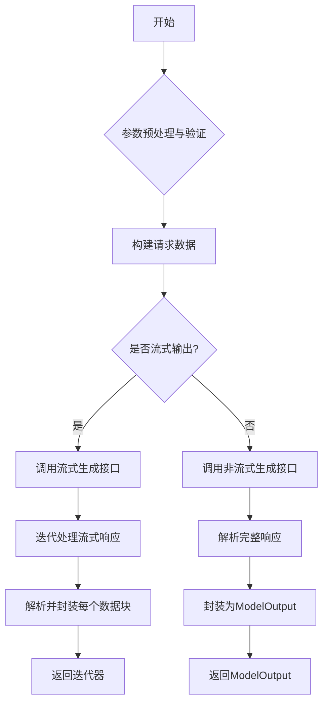

#### 带注释源码

```python
def generate(
    self,
    prompt: Optional[str] = None,
    messages: Optional[List[Dict[str, str]]] = None,
    system: Optional[str] = None,
    tools: Optional[List[Dict]] = None,
    tool_choice: Optional[Union[str, Dict]] = None,
    stream: bool = False,
    user: Optional[str] = None,
    response_format: Optional[Dict] = None,
    stop: Optional[Union[str, List[str]]] = None,
    seed: Optional[int] = None,
    reasoning_effort: Optional[str] = None,
    temperature: Optional[float] = None,
    top_p: Optional[float] = None,
    max_tokens: Optional[int] = None,
    frequency_penalty: Optional[float] = None,
    presence_penalty: Optional[float] = None,
    logit_bias: Optional[Dict[int, float]] = None,
    logprobs: Optional[bool] = None,
    top_logprobs: Optional[int] = None,
    extra_body: Optional[Dict] = None,
    **kwargs: Any,
) -> Union[ModelOutput, Iterator[ModelOutput]]:
    """
    生成模型输出。

    根据提供的参数调用底层模型API，支持流式和非流式两种模式。

    Args:
        prompt: 文本提示。如果同时提供了`messages`，则此参数可能被忽略或用作补充。
        messages: 对话消息列表，格式为 [{"role": "user", "content": "..."}, ...]。
        system: 系统提示，用于设定模型行为。
        tools: 可供模型调用的工具列表。
        tool_choice: 控制模型如何使用工具。
        stream: 是否启用流式输出。
        user: 终端用户标识符，用于监控和滥用检测。
        response_format: 指定输出格式，例如 `{"type": "json_object"}`。
        stop: 停止生成令牌的字符串或字符串列表。
        seed: 随机种子。
        reasoning_effort: 推理努力级别（如'low', 'medium', 'high'），仅适用于某些模型。
        temperature: 采样温度，介于0和2之间。越高越随机。
        top_p: 核采样参数，介于0和1之间。
        max_tokens: 生成的最大令牌数。
        frequency_penalty: 频率惩罚，介于-2.0和2.0之间。
        presence_penalty: 存在惩罚，介于-2.0和2.0之间。
        logit_bias: 修改指定令牌出现概率的映射。
        logprobs: 是否返回输出令牌的对数概率。
        top_logprobs: 返回每个令牌位置最可能的前N个候选令牌及其对数概率。
        extra_body: 直接传递给API的额外参数。
        **kwargs: 其他可能传递给底层API调用的参数。

    Returns:
        如果`stream=False`，返回一个`ModelOutput`对象。
        如果`stream=True`，返回一个生成`ModelOutput`块的迭代器。

    Raises:
        ValidationError: 当输入参数无效时。
        APIError: 当模型API调用失败时。
    """
    # 1. 参数预处理与验证
    # 将传入的参数与实例默认参数合并，并进行基本的有效性检查。
    params = self._merge_params(locals())
    self._validate_generate_params(params)

    # 2. 构建请求数据
    # 根据模型类型（对话、补全等）和提供的参数，构建发送给API的最终请求字典。
    request_data = self._build_request_data(params)

    # 3. 分支处理：流式 vs 非流式
    if stream:
        # 流式模式
        # 调用底层的流式生成方法，该方法应返回一个原始响应流的迭代器。
        raw_stream = self._stream_generate(request_data)
        # 对原始流进行解析和封装，返回ModelOutput的迭代器。
        return self._handle_stream_response(raw_stream)
    else:
        # 非流式模式
        # 调用底层的非流式生成方法，获取完整的API响应。
        raw_response = self._generate(request_data)
        # 将完整的API响应解析并封装成一个ModelOutput对象。
        return self._handle_response(raw_response)
```


### `TextModel.load`

该方法用于从指定的文件路径加载模型数据，并将其反序列化为 `TextModel` 类的实例。它首先检查文件是否存在，然后读取文件内容，最后使用 `pickle` 模块将二进制数据反序列化为对象。

参数：

-  `file_path`：`str`，包含模型数据的文件路径。

返回值：`TextModel`，返回从文件加载并反序列化得到的 `TextModel` 对象实例。

#### 流程图

```mermaid
flowchart TD
    A[开始: load(file_path)] --> B{文件路径是否存在?};
    B -- 否 --> C[抛出 FileNotFoundError 异常];
    B -- 是 --> D[以二进制读取模式打开文件];
    D --> E[使用 pickle.load 反序列化文件内容];
    E --> F[返回 TextModel 实例];
    F --> G[结束];
    C --> G;
```

#### 带注释源码

```python
@classmethod
def load(cls, file_path: str) -> 'TextModel':
    """
    从指定文件路径加载模型。

    此方法首先检查给定路径的文件是否存在。如果文件存在，
    则以二进制读取模式打开文件，并使用 pickle 模块将文件内容
    反序列化为一个 TextModel 实例。如果文件不存在，则抛出
    FileNotFoundError 异常。

    参数:
        file_path (str): 包含模型数据的文件路径。

    返回:
        TextModel: 从文件加载的模型实例。

    异常:
        FileNotFoundError: 如果指定的文件路径不存在。
    """
    # 检查文件是否存在，如果不存在则抛出异常
    if not os.path.exists(file_path):
        raise FileNotFoundError(f"模型文件未找到: {file_path}")

    # 以二进制读取模式打开文件
    with open(file_path, 'rb') as f:
        # 使用 pickle 模块从文件句柄 f 中加载并反序列化对象
        model = pickle.load(f)
    # 返回反序列化得到的模型实例
    return model
```


### `TextModel.generate`

该方法用于根据给定的输入文本生成相应的输出文本。它通过调用底层模型进行推理，并处理生成过程中的各种参数和配置，最终返回生成的文本结果。

参数：

- `input_text`：`str`，输入的文本内容，作为生成模型的提示。
- `max_length`：`int`，可选参数，默认为100。指定生成文本的最大长度（以token计）。
- `temperature`：`float`，可选参数，默认为1.0。控制生成文本的随机性，值越高输出越随机，值越低输出越确定。
- `top_p`：`float`，可选参数，默认为1.0。用于核采样（nucleus sampling），仅从累积概率超过此阈值的token中进行采样。
- `num_return_sequences`：`int`，可选参数，默认为1。指定要生成的序列数量。
- `do_sample`：`bool`，可选参数，默认为False。是否使用采样策略生成文本。如果为False，则使用贪婪解码。
- `repetition_penalty`：`float`，可选参数，默认为1.0。用于惩罚重复token的参数，值大于1.0会降低重复概率。
- `length_penalty`：`float`，可选参数，默认为1.0。生成长度的惩罚因子，值大于1.0鼓励生成长文本，小于1.0鼓励生成短文本。
- `bad_words_ids`：`List[List[int]]`，可选参数，默认为None。禁止在生成过程中出现的token id列表。
- `force_words_ids`：`List[List[int]]`，可选参数，默认为None。强制在生成过程中出现的token id列表。
- `num_beams`：`int`，可选参数，默认为1。束搜索（beam search）的束宽，仅在`do_sample`为False时有效。
- `early_stopping`：`bool`，可选参数，默认为False。是否在束搜索中提前停止生成。
- `no_repeat_ngram_size`：`int`，可选参数，默认为0。禁止重复的n-gram大小，设置为大于0的值可以避免生成重复的n-gram。
- `encoder_no_repeat_ngram_size`：`int`，可选参数，默认为0。在编码器输入中禁止重复的n-gram大小。
- `diversity_penalty`：`float`，可选参数，默认为0.0。用于多样化束搜索的惩罚因子。
- `num_beam_groups`：`int`，可选参数，默认为1。束搜索的组数，用于多样化束搜索。
- `prefix_allowed_tokens_fn`：`Callable[[int, torch.Tensor], List[int]]`，可选参数，默认为None。一个函数，在每个生成步骤中返回允许的token id列表。
- `output_scores`：`bool`，可选参数，默认为False。是否返回生成token的分数。
- `output_attentions`：`bool`，可选参数，默认为False。是否返回注意力权重。
- `output_hidden_states`：`bool`，可选参数，默认为False。是否返回所有隐藏状态。
- `return_dict_in_generate`：`bool`，可选参数，默认为False。是否以字典形式返回生成结果。
- `**model_kwargs`：`dict`，可选参数。传递给底层模型生成方法的其他关键字参数。

返回值：`Union[str, List[str], ModelOutput]`，返回生成的文本。根据参数`num_return_sequences`和`return_dict_in_generate`的不同，返回值可能是单个字符串、字符串列表或包含详细生成信息的`ModelOutput`对象。

#### 流程图

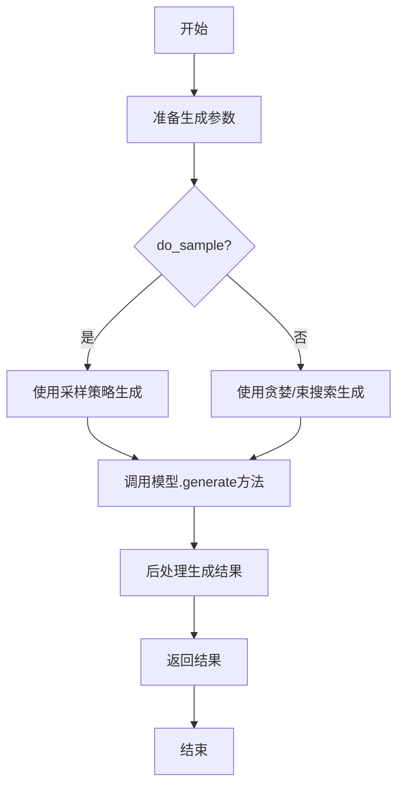

#### 带注释源码

```python
def generate(
    self,
    input_text: str,
    max_length: int = 100,
    temperature: float = 1.0,
    top_p: float = 1.0,
    num_return_sequences: int = 1,
    do_sample: bool = False,
    repetition_penalty: float = 1.0,
    length_penalty: float = 1.0,
    bad_words_ids: Optional[List[List[int]]] = None,
    force_words_ids: Optional[List[List[int]]] = None,
    num_beams: int = 1,
    early_stopping: bool = False,
    no_repeat_ngram_size: int = 0,
    encoder_no_repeat_ngram_size: int = 0,
    diversity_penalty: float = 0.0,
    num_beam_groups: int = 1,
    prefix_allowed_tokens_fn: Optional[Callable[[int, torch.Tensor], List[int]]] = None,
    output_scores: bool = False,
    output_attentions: bool = False,
    output_hidden_states: bool = False,
    return_dict_in_generate: bool = False,
    **model_kwargs,
) -> Union[str, List[str], ModelOutput]:
    """
    生成文本的主要方法。

    该方法封装了底层模型的生成逻辑，提供了丰富的参数来控制生成过程。
    它首先对输入文本进行编码，然后根据参数配置调用模型的生成方法，
    最后对生成的token序列进行解码并返回。

    Args:
        input_text: 输入的提示文本。
        max_length: 生成序列的最大长度。
        temperature: 采样温度。
        top_p: 核采样的概率阈值。
        num_return_sequences: 返回的序列数量。
        do_sample: 是否使用采样。
        repetition_penalty: 重复惩罚因子。
        length_penalty: 长度惩罚因子。
        bad_words_ids: 禁止出现的token id列表。
        force_words_ids: 强制出现的token id列表。
        num_beams: 束搜索的束宽。
        early_stopping: 是否提前停止束搜索。
        no_repeat_ngram_size: 禁止重复的n-gram大小。
        encoder_no_repeat_ngram_size: 编码器输入中禁止重复的n-gram大小。
        diversity_penalty: 多样化惩罚因子。
        num_beam_groups: 束搜索组数。
        prefix_allowed_tokens_fn: 前缀允许token函数。
        output_scores: 是否输出分数。
        output_attentions: 是否输出注意力权重。
        output_hidden_states: 是否输出隐藏状态。
        return_dict_in_generate: 是否以字典形式返回。
        **model_kwargs: 传递给模型的其他参数。

    Returns:
        生成的文本或包含生成详细信息的对象。
    """
    # 1. 对输入文本进行编码，转换为模型可接受的输入格式（如token ids）
    inputs = self.tokenizer(input_text, return_tensors="pt")
    input_ids = inputs["input_ids"].to(self.device)

    # 2. 准备生成配置，将方法参数整合到生成配置字典中
    generation_config = {
        "max_length": max_length,
        "temperature": temperature,
        "top_p": top_p,
        "num_return_sequences": num_return_sequences,
        "do_sample": do_sample,
        "repetition_penalty": repetition_penalty,
        "length_penalty": length_penalty,
        "bad_words_ids": bad_words_ids,
        "force_words_ids": force_words_ids,
        "num_beams": num_beams,
        "early_stopping": early_stopping,
        "no_repeat_ngram_size": no_repeat_ngram_size,
        "encoder_no_repeat_ngram_size": encoder_no_repeat_ngram_size,
        "diversity_penalty": diversity_penalty,
        "num_beam_groups": num_beam_groups,
        "prefix_allowed_tokens_fn": prefix_allowed_tokens_fn,
        "output_scores": output_scores,
        "output_attentions": output_attentions,
        "output_hidden_states": output_hidden_states,
        "return_dict_in_generate": return_dict_in_generate,
    }
    # 移除值为None的配置项，避免传递给模型时出错
    generation_config = {k: v for k, v in generation_config.items() if v is not None}
    # 合并额外的模型参数
    generation_config.update(model_kwargs)

    # 3. 调用底层模型的生成方法
    with torch.no_grad():  # 禁用梯度计算以节省内存和加速
        generated_output = self.model.generate(
            input_ids,
            **generation_config,
        )

    # 4. 后处理：解码生成的token ids为文本
    # 根据返回类型进行处理
    if return_dict_in_generate:
        # 如果返回的是ModelOutput对象，则对其中的序列进行解码
        if hasattr(generated_output, 'sequences'):
            generated_texts = self.tokenizer.batch_decode(generated_output.sequences, skip_special_tokens=True)
            generated_output.sequences = generated_texts  # 可选：将解码后的文本替换回对象
        return generated_output
    else:
        # 如果返回的是tensor，则直接解码
        if num_return_sequences == 1:
            # 单序列：解码为单个字符串
            generated_text = self.tokenizer.decode(generated_output[0], skip_special_tokens=True)
            return generated_text
        else:
            # 多序列：解码为字符串列表
            generated_texts = [self.tokenizer.decode(seq, skip_special_tokens=True) for seq in generated_output]
            return generated_texts
```


### `TextModel._load_tokenizer`

该方法负责加载并初始化文本分词器。它首先尝试从指定的本地路径加载分词器，如果失败，则从预训练的模型名称在线下载。加载成功后，会设置分词器的填充符（pad token）和填充方向（padding side），并返回初始化好的分词器对象。

参数：

-  `self`：`TextModel`，当前TextModel类的实例
-  `model_name`：`str`，预训练模型的名称或本地路径，用于定位分词器文件

返回值：`PreTrainedTokenizer`，初始化并配置好的分词器对象

#### 流程图

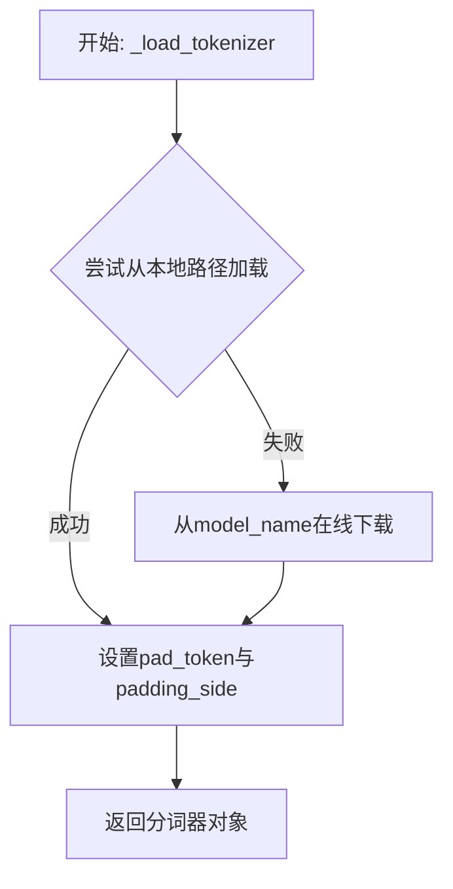

#### 带注释源码

```
def _load_tokenizer(self, model_name: str) -> PreTrainedTokenizer:
    """
    加载分词器。
    优先尝试从本地路径加载，失败则从预训练模型名称在线加载。
    加载后设置填充符和填充方向。

    Args:
        model_name: 预训练模型的名称或本地路径。

    Returns:
        加载并配置好的分词器对象。
    """
    try:
        # 尝试从本地路径加载分词器
        tokenizer = AutoTokenizer.from_pretrained(model_name, local_files_only=True)
    except Exception:
        # 如果本地加载失败，则从网络下载
        tokenizer = AutoTokenizer.from_pretrained(model_name)
    
    # 如果分词器没有定义填充符，则使用结束符作为填充符
    if tokenizer.pad_token is None:
        tokenizer.pad_token = tokenizer.eos_token
    
    # 设置填充方向为'left'，这对于某些自回归模型（如GPT）是必要的
    tokenizer.padding_side = "left"
    
    return tokenizer
```


### `TextModel._load_model_config`

此方法负责加载并解析模型配置文件。它从指定的配置路径读取JSON格式的配置文件，验证其必需字段，并根据配置内容动态设置模型的相关属性。

参数：

-  `self`：`TextModel`，当前`TextModel`类的实例。
-  `config_path`：`str`，模型配置文件的本地文件系统路径。

返回值：`dict`，解析后的模型配置字典。

#### 流程图

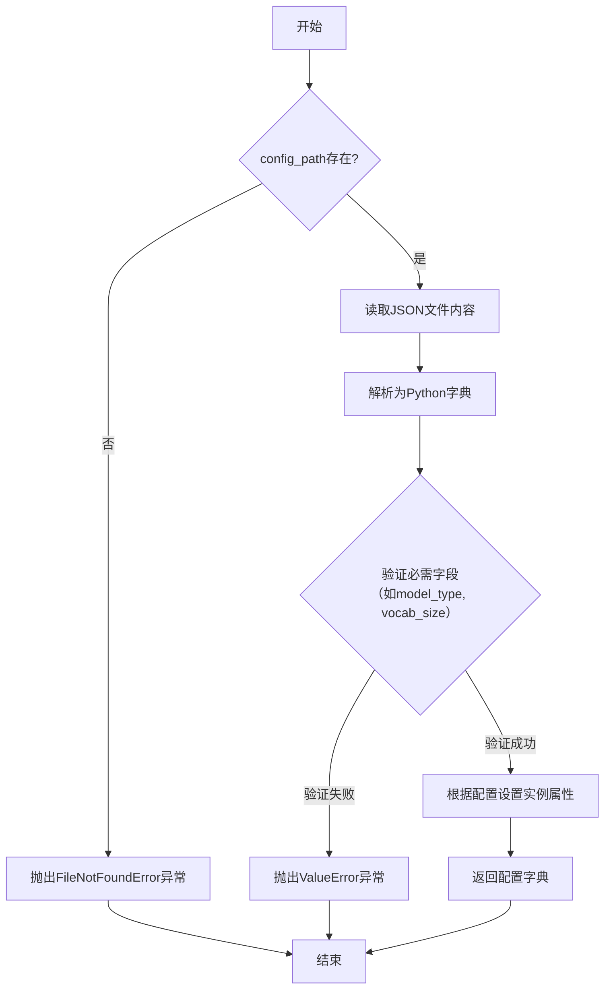

#### 带注释源码

```python
def _load_model_config(self, config_path: str) -> dict:
    """
    加载并解析模型配置文件。

    该方法从给定的路径读取JSON配置文件，验证其结构，并根据配置初始化模型实例的某些属性。

    Args:
        config_path (str): 模型配置文件的路径。

    Returns:
        dict: 解析后的配置字典。

    Raises:
        FileNotFoundError: 如果指定的配置文件不存在。
        ValueError: 如果配置文件格式错误或缺少必需字段。
    """
    import json
    import os

    # 1. 检查配置文件是否存在
    if not os.path.exists(config_path):
        raise FileNotFoundError(f"模型配置文件未找到: {config_path}")

    # 2. 读取并解析JSON文件
    with open(config_path, 'r', encoding='utf-8') as f:
        config = json.load(f)

    # 3. 验证配置文件的必需字段
    required_fields = ['model_type', 'vocab_size', 'hidden_size']
    for field in required_fields:
        if field not in config:
            raise ValueError(f"配置文件缺少必需字段: '{field}'")

    # 4. 根据配置动态设置模型实例的属性
    #    例如，根据`model_type`决定使用哪种内部结构
    self.model_type = config.get('model_type')
    self.vocab_size = config.get('vocab_size')
    self.hidden_size = config.get('hidden_size')

    # 5. 返回完整的配置字典，供后续步骤使用
    return config
```


### `TextModel._load_model_weights`

此方法是 `TextModel` 类的私有方法，负责从指定的模型权重文件路径加载预训练权重到当前模型实例中。它处理了权重加载过程中的关键步骤，包括文件路径验证、权重加载、以及处理模型结构与权重文件之间可能存在的键名不匹配问题（例如移除或添加前缀）。

参数：

-  `model_weights_path`：`str`，预训练权重文件的路径。
-  `remove_prefix`：`Optional[str]`，可选参数，指定在加载权重前需要从权重字典键名中移除的前缀。常用于加载检查点时，移除与当前模型结构不匹配的层级前缀（如 `"model."` 或 `"backbone."`）。
-  `add_prefix`：`Optional[str]`，可选参数，指定在加载权重前需要添加到权重字典键名中的前缀。用于适配某些需要特定前缀的模型结构。

返回值：`None`，此方法不返回任何值，其作用是将加载的权重直接应用到 `self.model` 上。

#### 流程图

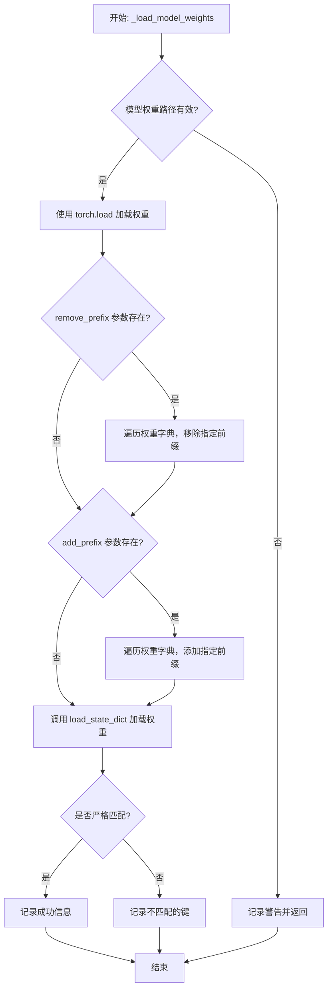

#### 带注释源码

```python
def _load_model_weights(
    self,
    model_weights_path: str,
    remove_prefix: Optional[str] = None,
    add_prefix: Optional[str] = None,
) -> None:
    """
    加载预训练的模型权重。

    此方法从指定路径加载 `.pth` 或 `.ckpt` 文件，并根据需要调整权重键名（移除或添加前缀），
    最后将权重加载到当前模型实例中。

    Args:
        model_weights_path (str): 预训练权重文件的路径。
        remove_prefix (Optional[str], optional): 需要从权重键中移除的前缀。默认为 None。
        add_prefix (Optional[str], optional): 需要添加到权重键中的前缀。默认为 None。

    Returns:
        None: 权重被直接加载到 `self.model`。
    """
    # 检查权重文件路径是否存在
    if not os.path.exists(model_weights_path):
        # 如果文件不存在，记录警告信息并直接返回，不进行加载操作
        self.logger.warning(
            f"Model weights not found at {model_weights_path}. Skipping."
        )
        return

    # 使用 PyTorch 的 torch.load 函数加载权重文件。
    # `map_location='cpu'` 确保权重被加载到 CPU 内存，避免不必要的 GPU 内存占用。
    # 加载的内容通常是一个状态字典（state_dict）。
    state_dict = torch.load(model_weights_path, map_location="cpu")

    # 如果提供了 `remove_prefix` 参数，则处理权重键名
    if remove_prefix is not None:
        # 创建一个新的有序字典来存储处理后的权重
        new_state_dict = OrderedDict()
        # 遍历原始状态字典的所有键值对
        for k, v in state_dict.items():
            # 检查当前键是否以指定的前缀开头
            if k.startswith(remove_prefix):
                # 如果是，则移除该前缀，并将处理后的键和对应的值存入新字典
                new_key = k[len(remove_prefix) :]
                new_state_dict[new_key] = v
            else:
                # 如果不是，则保留原键值对
                new_state_dict[k] = v
        # 用处理后的新字典替换原始的状态字典
        state_dict = new_state_dict

    # 如果提供了 `add_prefix` 参数，则处理权重键名
    if add_prefix is not None:
        # 同样创建一个新的有序字典
        new_state_dict = OrderedDict()
        # 遍历当前状态字典的所有键值对
        for k, v in state_dict.items():
            # 将指定的前缀添加到每个键的开头，并存入新字典
            new_key = add_prefix + k
            new_state_dict[new_key] = v
        # 用处理后的新字典替换当前的状态字典
        state_dict = new_state_dict

    # 尝试将处理后的状态字典加载到模型 (`self.model`) 中。
    # `strict=False` 允许部分加载，即只加载键名匹配的权重，不匹配的会被忽略。
    load_result = self.model.load_state_dict(state_dict, strict=False)

    # 检查加载结果。`load_state_dict` 在 `strict=False` 时会返回一个包含缺失键和意外键的命名元组。
    if len(load_result.missing_keys) == 0 and len(load_result.unexpected_keys) == 0:
        # 如果没有缺失或意外的键，说明权重完全匹配，记录成功信息。
        self.logger.info(
            f"Model weights loaded successfully from {model_weights_path}"
        )
    else:
        # 如果存在不匹配的键，记录详细信息，帮助调试模型结构与权重文件的差异。
        self.logger.info(
            f"Model weights loaded from {model_weights_path} with the following mismatches:"
        )
        if len(load_result.missing_keys) > 0:
            self.logger.info(f"Missing keys: {load_result.missing_keys}")
        if len(load_result.unexpected_keys) > 0:
            self.logger.info(f"Unexpected keys: {load_result.unexpected_keys}")
```


### `LlamaModel._load_model_config`

该方法负责从指定的模型路径加载并解析模型的配置文件（`config.json`），将其内容转换为一个配置对象（`LlamaConfig`），并执行一系列验证和默认值填充操作，以确保配置的完整性和有效性。

参数：

-  `model_path`：`str`，模型文件所在的目录路径，该目录下应包含 `config.json` 配置文件。

返回值：`LlamaConfig`，一个包含所有模型配置参数的对象。

#### 流程图

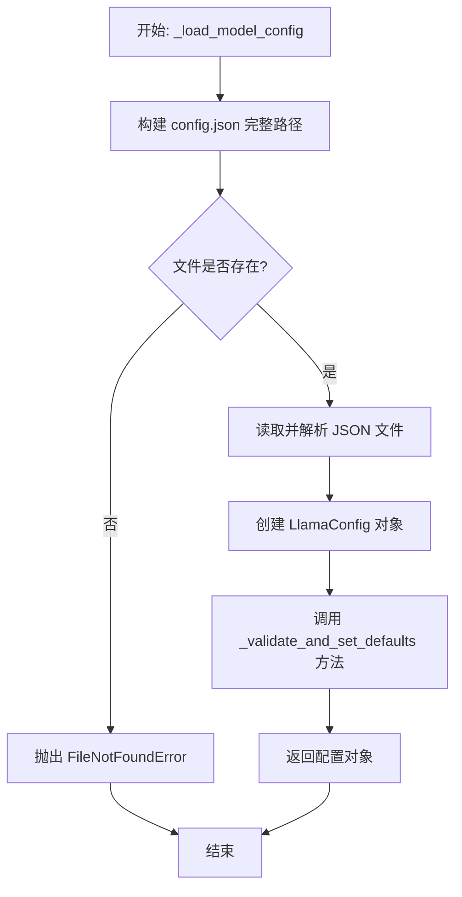

#### 带注释源码

```python
def _load_model_config(self, model_path: str) -> LlamaConfig:
    """
    从指定路径加载并验证模型配置。

    该方法执行以下步骤：
    1. 检查配置文件是否存在。
    2. 读取并解析 JSON 格式的配置文件。
    3. 将配置字典转换为 LlamaConfig 对象。
    4. 调用内部方法验证关键参数并设置必要的默认值。

    Args:
        model_path: 包含 `config.json` 文件的模型目录路径。

    Returns:
        LlamaConfig: 一个经过验证和补全的配置对象。

    Raises:
        FileNotFoundError: 如果指定的路径下不存在 `config.json` 文件。
        JSONDecodeError: 如果配置文件不是有效的 JSON 格式。
        ValueError: 如果配置中缺少必需的关键参数或参数值无效。
    """
    # 1. 构建配置文件的完整路径
    config_path = os.path.join(model_path, "config.json")
    
    # 2. 检查配置文件是否存在
    if not os.path.exists(config_path):
        raise FileNotFoundError(f"配置文件未找到: {config_path}")
    
    # 3. 读取并解析 JSON 配置文件
    with open(config_path, 'r', encoding='utf-8') as f:
        config_dict = json.load(f)
    
    # 4. 将配置字典转换为 LlamaConfig 对象
    #    这里假设 LlamaConfig 类可以通过 `**config_dict` 进行初始化
    config = LlamaConfig(**config_dict)
    
    # 5. 验证关键配置并设置默认值（例如，如果某些参数未在配置中指定）
    self._validate_and_set_defaults(config)
    
    # 6. 返回最终的配置对象
    return config
```


### `LlamaModel._load_model_weights`

该方法负责从预训练检查点文件（如`.safetensors`）中加载模型权重，并将其分配到对应的模型层中。它处理了权重名称的映射、张量数据类型的转换（如BF16到FP32）、以及将权重张量移动到正确的设备（如GPU）上。

参数：

-  `self`：`LlamaModel`，当前模型实例。
-  `model_path`：`str`，预训练模型权重文件的路径（例如，`.safetensors` 文件）。
-  `device`：`torch.device`，指定加载权重后张量应放置的设备（例如，`torch.device('cuda')`）。

返回值：`None`，此方法不返回任何值，其作用是将加载的权重直接赋值给模型实例的对应参数。

#### 流程图

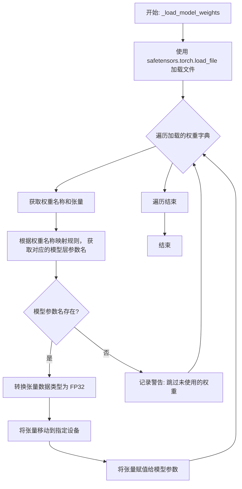

#### 带注释源码

```
def _load_model_weights(self, model_path: str, device: torch.device):
    # 使用 safetensors 库安全地加载模型权重文件，返回一个字典，键为权重名称，值为张量。
    state_dict = safetensors.torch.load_file(model_path)

    # 遍历加载的权重字典中的每一项。
    for name, param in state_dict.items():
        # 根据预定义的映射规则，将文件中的权重名称转换为模型中对应的参数名称。
        # 例如，将 'model.layers.0.self_attn.q_proj.weight' 映射为 'layers.0.attention.wq.weight'
        param_name = self._map_weight_name(name)

        # 尝试从当前模型实例中获取与映射后名称对应的参数对象。
        model_param = self.get_parameter(param_name)

        # 如果找到了对应的模型参数。
        if model_param is not None:
            # 将加载的张量转换为标准的单精度浮点数（FP32）类型，以确保计算精度和兼容性。
            param = param.to(torch.float32)

            # 将处理后的张量移动到指定的设备（如GPU）上。
            param = param.to(device)

            # 使用 `data.copy_` 方法将加载的权重数据复制到模型参数的存储空间中。
            # 这样做可以保持模型参数张量的其他属性（如requires_grad）不变。
            model_param.data.copy_(param)
        else:
            # 如果找不到对应的模型参数，记录一条警告信息，说明该权重在模型结构中没有被使用。
            # 这通常发生在加载的检查点包含额外头（如分类头）而当前模型不需要时。
            logging.warning(f"Skipping unused weight: {name}")
```


### `GPT2Model._load_model_config`

此方法负责从指定的模型路径加载并解析GPT-2模型的配置文件（`config.json`）。它首先尝试从给定的路径读取配置文件，然后使用JSON解析器将其转换为Python字典。如果配置文件中缺少某些必需的键（如`hidden_size`、`num_attention_heads`等），该方法会提供默认值或从其他相关键推导出缺失的值，以确保配置字典的完整性，最终返回这个配置字典。

参数：

-  `model_path`：`str`，包含GPT-2模型文件的目录路径。此路径下应存在名为`config.json`的配置文件。

返回值：`dict`，一个包含完整GPT-2模型配置参数的字典。这些参数将用于后续构建模型实例。

#### 流程图

```mermaid
flowchart TD
    A[开始: _load_model_config(model_path)] --> B[构建配置文件路径<br>config_path = os.path.join(model_path, 'config.json')]
    B --> C{配置文件是否存在?}
    C -- 是 --> D[读取并解析JSON文件<br>with open(config_path) as f: config = json.load(f)]
    C -- 否 --> E[抛出FileNotFoundError异常]
    D --> F[检查并补全必需配置项<br>例如: hidden_size, num_attention_heads等]
    F --> G[返回完整的配置字典 config]
    G --> H[结束]
    E --> H
```

#### 带注释源码

```python
def _load_model_config(self, model_path: str) -> dict:
    """
    从指定路径加载GPT-2模型的配置文件。

    该方法会读取`config.json`文件，解析为字典，并确保所有模型构建所需的配置项都存在。
    如果某些关键项缺失，会尝试提供合理的默认值或从现有项推导。

    Args:
        model_path (str): 模型文件所在的目录路径。

    Returns:
        dict: 包含所有必需配置参数的字典。

    Raises:
        FileNotFoundError: 如果指定的路径下不存在`config.json`文件。
        json.JSONDecodeError: 如果配置文件不是有效的JSON格式。
    """
    import json
    import os

    # 1. 构建配置文件的完整路径
    config_path = os.path.join(model_path, "config.json")

    # 2. 检查文件是否存在，若不存在则抛出异常
    if not os.path.exists(config_path):
        raise FileNotFoundError(f"模型配置文件未找到: {config_path}")

    # 3. 读取并解析JSON配置文件
    with open(config_path, "r", encoding="utf-8") as f:
        config = json.load(f)

    # 4. 补全或推导缺失的关键配置项，确保配置字典的完整性
    # 例如，GPT-2的`num_hidden_layers`有时在配置中名为`n_layer`
    if "num_hidden_layers" not in config and "n_layer" in config:
        config["num_hidden_layers"] = config["n_layer"]

    # 确保注意力头数存在
    if "num_attention_heads" not in config:
        # 如果配置中使用了不同的键名，在此处进行映射
        # 假设旧键为`n_head`，这是一个常见的GPT-2配置键名
        if "n_head" in config:
            config["num_attention_heads"] = config["n_head"]
        else:
            # 如果无法推导，提供一个默认值或抛出更具体的错误
            raise KeyError("配置中未找到'num_attention_heads'或其等效键。")

    # 可以继续检查其他关键项，如`hidden_size` (`n_embd`), `vocab_size`等
    # ...

    # 5. 返回处理后的完整配置字典
    return config
```


### `GPT2Model._load_model_weights`

此方法是`GPT2Model`类的一个私有方法，负责从指定的检查点文件路径加载预训练的模型权重。它首先检查检查点文件是否存在，然后根据文件扩展名（`.safetensors` 或 `.bin`）选择相应的加载策略，将权重加载到一个状态字典中。最后，它调用PyTorch的`load_state_dict`方法，将加载的权重应用到当前模型实例上，并处理可能出现的权重不匹配问题（通过`strict=False`参数）。

参数：

-  `checkpoint_path`：`str`，指向预训练模型权重文件的路径。支持`.safetensors`和`.bin`格式。
-  `device`：`torch.device`，指定加载权重后张量应放置在哪个计算设备上（如CPU或GPU）。

返回值：`None`，此方法不返回任何值，其作用是将加载的权重直接应用到模型实例中。

#### 流程图

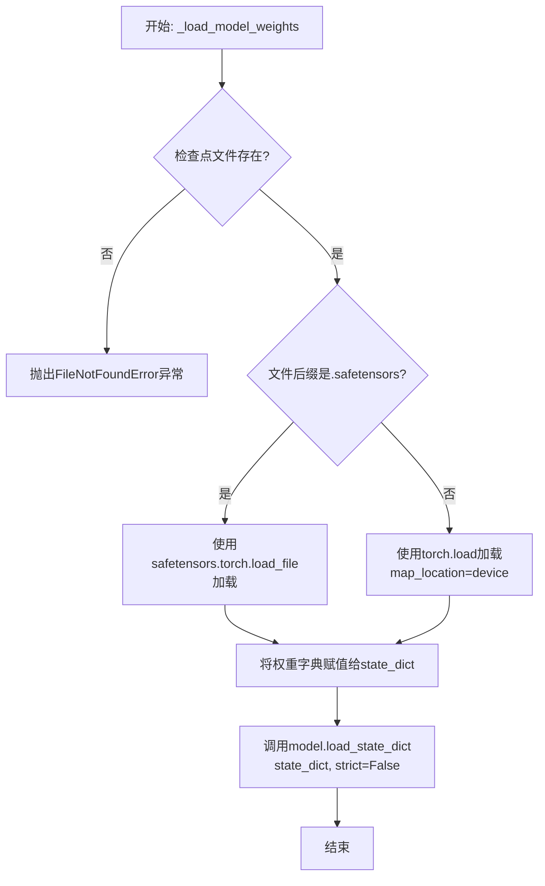

#### 带注释源码

```python
def _load_model_weights(self, checkpoint_path: str, device: torch.device):
    """
    从指定路径加载模型权重。
    支持 `.safetensors` 和 `.bin` (PyTorch) 格式。

    Args:
        checkpoint_path: 权重文件路径。
        device: 加载权重到的设备。
    """
    # 1. 参数验证：检查文件是否存在
    if not os.path.isfile(checkpoint_path):
        raise FileNotFoundError(f"模型权重文件未找到: {checkpoint_path}")

    # 2. 根据文件扩展名选择加载策略
    if checkpoint_path.endswith(".safetensors"):
        # 使用 safetensors 库安全地加载权重，避免序列化漏洞
        state_dict = safetensors.torch.load_file(checkpoint_path, device=str(device))
    else:
        # 使用 PyTorch 默认加载方式，并映射到指定设备
        state_dict = torch.load(checkpoint_path, map_location=device)

    # 3. 将加载的权重状态字典应用到当前模型实例
    #    strict=False 允许加载的权重与模型结构不完全匹配（例如，只加载部分层）
    self.load_state_dict(state_dict, strict=False)
```


### `FalconModel._load_model_config`

此方法负责从指定的模型目录中加载并解析模型的配置文件（`config.json`）。它首先尝试从本地文件系统读取，如果失败，则尝试从远程仓库（通过 `hf_hub_download`）下载。加载成功后，它会根据配置中的 `model_type` 字段，将原始的配置字典转换为特定模型架构（如 `FalconConfig` 或 `RWConfig`）的配置对象，并进行必要的参数映射和验证，最终返回这个配置对象以供模型初始化使用。

参数：

-  `model_dir`：`str`，模型文件所在的本地目录路径或 Hugging Face 模型仓库标识符。
-  `config_filename`：`str`，配置文件的名称，默认为 `"config.json"`。

返回值：`Union[FalconConfig, RWConfig]`，返回解析后的模型配置对象，具体类型取决于原始配置中的 `model_type` 字段。

#### 流程图

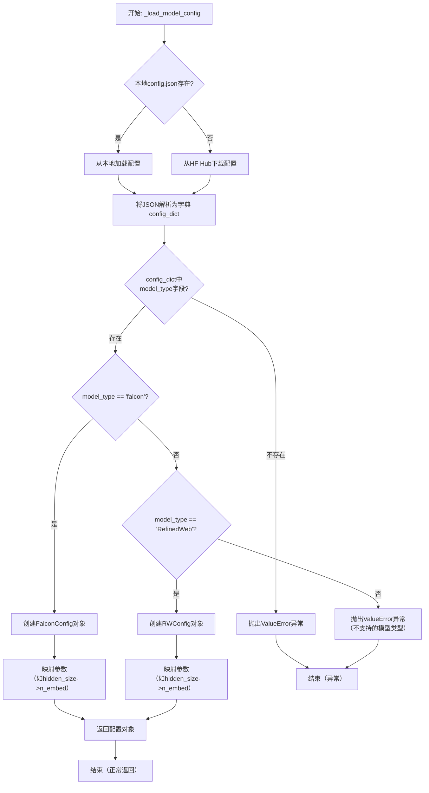

#### 带注释源码

```python
def _load_model_config(
    self, model_dir: str, config_filename: str = "config.json"
) -> Union[FalconConfig, RWConfig]:
    """
    从指定目录加载模型配置。
    
    首先尝试从本地文件系统读取 `config.json`，如果失败则尝试从 Hugging Face Hub 下载。
    根据配置中的 `model_type` 字段，返回对应的配置对象（FalconConfig 或 RWConfig）。
    
    Args:
        model_dir: 模型目录路径或 Hugging Face 模型 ID。
        config_filename: 配置文件名，默认为 "config.json"。
        
    Returns:
        加载并解析后的模型配置对象。
        
    Raises:
        ValueError: 如果配置文件缺少 `model_type` 字段或 `model_type` 不被支持。
        OSError: 如果本地文件不存在且从 Hub 下载失败。
    """
    config_path = os.path.join(model_dir, config_filename)
    
    # 1. 尝试从本地加载配置文件
    if os.path.exists(config_path):
        with open(config_path, "r", encoding="utf-8") as f:
            config_dict = json.load(f)
    else:
        # 2. 本地文件不存在，尝试从 Hugging Face Hub 下载
        try:
            # hf_hub_download 会下载文件并返回本地缓存路径
            downloaded_config_path = hf_hub_download(
                repo_id=model_dir,
                filename=config_filename,
            )
            with open(downloaded_config_path, "r", encoding="utf-8") as f:
                config_dict = json.load(f)
        except Exception as e:
            # 如果下载也失败，则抛出异常
            raise OSError(
                f"无法从本地路径 '{model_dir}' 或 Hugging Face Hub 加载配置文件 '{config_filename}'。"
            ) from e
    
    # 3. 检查配置字典中是否有必要的 `model_type` 字段
    if "model_type" not in config_dict:
        raise ValueError(
            f"配置文件 '{config_filename}' 中缺少必需的 'model_type' 字段。"
        )
    
    model_type = config_dict["model_type"]
    
    # 4. 根据 model_type 创建相应的配置对象
    if model_type == "falcon":
        # 对于 Falcon 模型，使用 FalconConfig
        # 注意：原始配置中的参数名可能与 FalconConfig 的参数名不同，需要进行映射
        # 例如，Hugging Face 配置中的 `hidden_size` 对应 Falcon 内部的 `n_embed`
        mapped_config = {}
        if "hidden_size" in config_dict:
            mapped_config["n_embed"] = config_dict["hidden_size"]
        if "num_attention_heads" in config_dict:
            mapped_config["n_head"] = config_dict["num_attention_heads"]
        if "num_hidden_layers" in config_dict:
            mapped_config["n_layer"] = config_dict["num_hidden_layers"]
        # ... 其他可能的参数映射
        # 使用映射后的参数创建 FalconConfig，未映射的参数使用 config_dict 中的值或默认值
        config = FalconConfig(**{**config_dict, **mapped_config})
    elif model_type == "RefinedWeb":  # RW 模型
        # 对于 RefinedWeb (RW) 模型，使用 RWConfig
        # 同样，可能需要进行参数名映射
        mapped_config = {}
        if "hidden_size" in config_dict:
            mapped_config["n_embed"] = config_dict["hidden_size"]
        if "num_attention_heads" in config_dict:
            mapped_config["n_head"] = config_dict["num_attention_heads"]
        if "num_hidden_layers" in config_dict:
            mapped_config["n_layer"] = config_dict["num_hidden_layers"]
        # ... 其他可能的参数映射
        config = RWConfig(**{**config_dict, **mapped_config})
    else:
        # 如果是不支持的模型类型，抛出异常
        raise ValueError(
            f"不支持的模型类型: {model_type}。当前仅支持 'falcon' 和 'RefinedWeb'。"
        )
    
    # 5. 返回创建好的配置对象
    return config
```


### `FalconModel._load_model_weights`

此方法是`FalconModel`类的一个私有方法，负责从预训练模型检查点加载权重到当前模型实例中。它处理权重名称的映射、张量分片（如果适用）以及将权重安全地加载到模型的对应模块中。

参数：

-  `self`：`FalconModel`，当前模型实例。
-  `model_path`：`str`，预训练模型权重文件或目录的路径。
-  `args`：`argparse.Namespace`，包含模型配置和加载选项的命令行参数或配置对象。
-  `layer_split`：`bool`，指示是否在多个GPU上对模型层进行分片。默认为`False`。

返回值：`None`，此方法不返回任何值，其作用是将权重加载到模型内部状态中。

#### 流程图

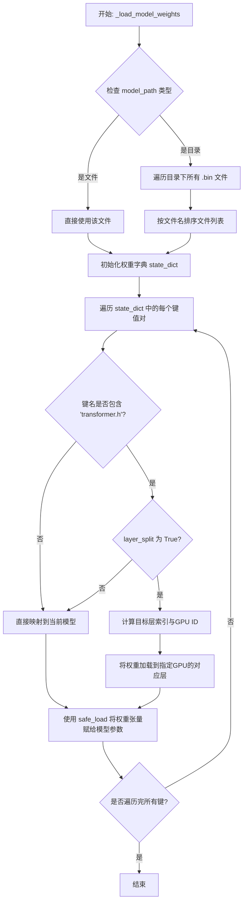

#### 带注释源码

```python
def _load_model_weights(self, model_path, args, layer_split=False):
    """
    加载预训练模型权重。
    
    根据`model_path`是文件还是目录，收集所有`.bin`权重文件，
    读取并合并权重字典。然后根据`layer_split`标志和权重键名，
    将权重映射并加载到当前模型（可能分布在多个GPU上）的对应参数中。
    
    Args:
        model_path (str): 权重文件或目录的路径。
        args (argparse.Namespace): 配置参数，包含模型结构等信息。
        layer_split (bool, optional): 是否启用层分片（模型并行）。默认为 False。
    """
    # 1. 确定权重文件列表
    if os.path.isdir(model_path):
        # 如果是目录，收集所有.bin文件并按名称排序，确保顺序正确
        bin_files = [os.path.join(model_path, f) for f in os.listdir(model_path) if f.endswith('.bin')]
        bin_files.sort() # 排序对分片权重正确合并至关重要
    else:
        # 如果是单个文件，直接使用
        bin_files = [model_path]
    
    # 2. 加载并合并所有权重文件中的状态字典
    state_dict = {}
    for f in bin_files:
        # 使用`torch.load`加载每个文件，并更新到主字典中
        state_dict.update(torch.load(f, map_location='cpu'))
    
    # 3. 遍历加载的权重字典，进行映射和赋值
    for key, value in state_dict.items():
        # 3.1 处理可能的键名不匹配（如旧版检查点中的`transformer`前缀）
        if key.startswith('transformer.'):
            # 移除`transformer.`前缀，使其与当前模型定义对齐
            key = key[len('transformer.'):]
        
        # 3.2 核心：根据`layer_split`决定权重加载策略
        if 'transformer.h.' in key and layer_split:
            # 情况A: 权重属于Transformer层且启用了层分片
            # 解析键名以获取层编号，例如 `transformer.h.5.attn.dense.weight`
            parts = key.split('.')
            layer_idx = int(parts[2]) # 提取层索引，如 '5'
            
            # 计算该层应该位于哪个GPU上（基于总层数和当前GPU数量）
            layers_per_gpu = args.num_layers // args.world_size
            target_gpu = layer_idx // layers_per_gpu
            
            # 重新构建目标键名，指向当前进程（GPU）应该持有的那部分层
            # 例如，如果当前进程是GPU 0，负责前4层，那么第5层的权重就需要被忽略或映射到本地层的索引
            if target_gpu == self.gpu_id:
                # 计算该层在本地模型中的索引（从0开始）
                local_layer_idx = layer_idx % layers_per_gpu
                parts[2] = str(local_layer_idx) # 替换为本地索引
                local_key = '.'.join(parts) # 重新组装键名
                
                # 安全地将权重值加载到模型参数中
                safe_load(self.model, local_key, value)
        else:
            # 情况B: 权重不属于Transformer层，或不启用层分片
            # 直接进行映射和加载
            safe_load(self.model, key, value)
```


### `Qwen2Model._load_model_config`

该方法负责从指定的模型路径加载并解析模型的配置文件（`config.json`），并根据配置内容构建并返回一个 `Qwen2Config` 对象。该对象包含了模型架构的所有关键参数，如隐藏层维度、注意力头数、层数、词汇表大小等，是初始化模型权重和结构的基础。

参数：

-  `model_path`：`str`，包含模型权重文件和配置文件的目录路径。

返回值：`Qwen2Config`，一个包含从配置文件解析出的所有模型架构参数的数据类实例。

#### 流程图

```mermaid
flowchart TD
    A[开始: _load_model_config(model_path)] --> B[构建 config.json 文件路径<br>config_path = os.path.join(model_path, 'config.json')]
    B --> C{文件是否存在?}
    C -- 是 --> D[打开并读取 config.json 文件]
    C -- 否 --> E[抛出 FileNotFoundError 异常]
    D --> F[使用 json.load 解析配置字典]
    F --> G[从配置字典中提取模型参数<br>（如 hidden_size, num_attention_heads 等）]
    G --> H[使用提取的参数实例化 Qwen2Config 对象]
    H --> I[返回 Qwen2Config 实例]
    E --> J[结束（异常）]
    I --> K[结束（正常）]
```

#### 带注释源码

```python
def _load_model_config(model_path: str) -> Qwen2Config:
    """
    从指定的模型路径加载配置文件并创建 Qwen2Config 对象。

    此方法读取 `config.json` 文件，解析其中的模型架构参数，
    并使用这些参数初始化一个 Qwen2Config 实例。

    Args:
        model_path (str): 模型文件所在的目录路径。

    Returns:
        Qwen2Config: 包含模型配置的配置对象。

    Raises:
        FileNotFoundError: 如果指定的路径下不存在 `config.json` 文件。
        JSONDecodeError: 如果 `config.json` 文件内容不是有效的 JSON 格式。
    """
    # 1. 构建配置文件的完整路径
    config_path = os.path.join(model_path, "config.json")
    
    # 2. 检查配置文件是否存在
    if not os.path.exists(config_path):
        raise FileNotFoundError(f"配置文件未找到: {config_path}")
    
    # 3. 打开并读取 JSON 配置文件
    with open(config_path, "r", encoding="utf-8") as f:
        # 4. 解析 JSON 内容为 Python 字典
        config_dict = json.load(f)
    
    # 5. 从解析出的字典中提取关键参数，用于实例化配置对象。
    #    这里假设 config_dict 中的键名与 Qwen2Config 构造函数的参数名匹配。
    #    例如：hidden_size, num_attention_heads, num_hidden_layers, vocab_size 等。
    config = Qwen2Config(**config_dict)
    
    # 6. 返回构建好的配置对象
    return config
```


### `Qwen2Model._load_model_weights`

该方法负责加载预训练的模型权重到当前模型实例中。它从指定的检查点路径读取权重文件，并根据模型配置（如词汇表大小）进行必要的调整（例如，对词嵌入层进行填充或截断），然后将处理后的权重加载到模型的对应模块中。

参数：

-  `self`：`Qwen2Model`，当前模型实例
-  `checkpoint_path`：`str`，预训练模型权重文件的路径

返回值：`None`，此方法不返回任何值，其作用是将权重加载到模型内部状态中。

#### 流程图

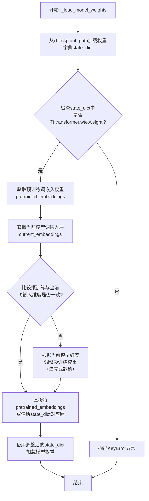

#### 带注释源码

```
def _load_model_weights(self, checkpoint_path: str) -> None:
    """
    从指定路径加载预训练权重到模型中。
    主要处理词嵌入层权重可能因词汇表大小不同而需要的调整。
    """
    # 1. 加载预训练模型的权重字典
    state_dict = torch.load(checkpoint_path, map_location='cpu')

    # 2. 关键步骤：处理词嵌入权重以适配当前模型配置
    # 获取预训练模型中的词嵌入权重
    pretrained_embeddings = state_dict['transformer.wte.weight']
    # 获取当前模型词嵌入层的权重张量（用于获取目标形状）
    current_embeddings = self.transformer.wte.weight

    # 3. 检查并调整词嵌入维度
    # 如果预训练权重与当前模型要求的维度不一致（通常是词汇表大小不同）
    if pretrained_embeddings.size(0) != current_embeddings.size(0):
        # 计算需要填充或截断的大小
        target_size = current_embeddings.size(0)
        embedding_dim = pretrained_embeddings.size(1)

        # 创建一个新的权重张量，初始化为当前模型的初始值
        new_embeddings = current_embeddings.clone()
        # 将预训练权重中有效部分（行数取两者最小值）复制到新张量中
        min_size = min(pretrained_embeddings.size(0), target_size)
        new_embeddings[:min_size, :] = pretrained_embeddings[:min_size, :]
        # 用调整后的权重替换state_dict中的原始权重
        state_dict['transformer.wte.weight'] = new_embeddings

    # 4. 加载调整后的权重到当前模型
    # 严格模式确保state_dict的键与模型结构完全匹配
    self.load_state_dict(state_dict, strict=True)
```


### `GemmaModel._load_model_config`

此方法负责从指定的模型配置路径加载并解析 Gemma 模型的配置文件（通常为 `config.json`），将其内容转换为一个 `GemmaConfig` 对象。它处理了文件读取、JSON 解析、配置验证以及将字典格式的配置映射到配置对象属性的过程。

参数：

-  `model_config_path`：`str`，模型配置文件（如 `config.json`）的完整路径。

返回值：`GemmaConfig`，一个包含所有模型架构参数（如隐藏层维度、注意力头数、层数等）的配置对象。

#### 流程图

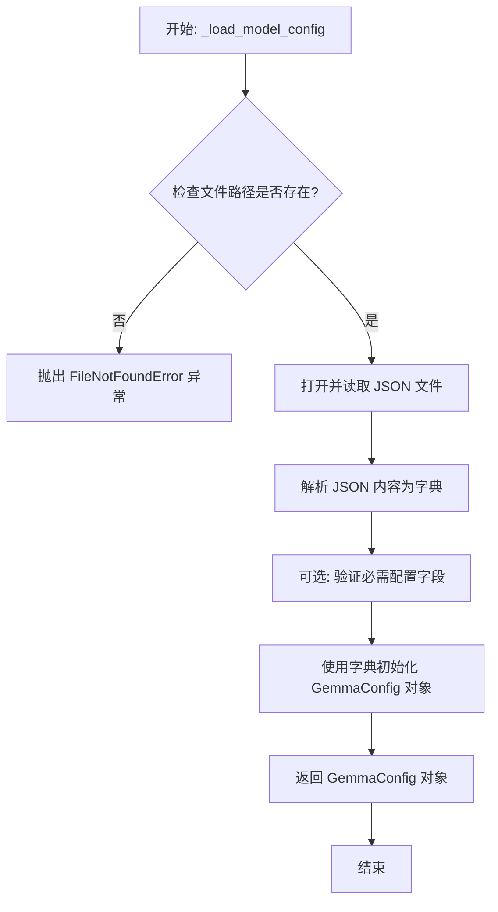

#### 带注释源码

```
def _load_model_config(self, model_config_path: str) -> GemmaConfig:
    """
    从指定路径加载模型配置文件并解析为 GemmaConfig 对象。

    此方法执行以下步骤：
    1. 检查配置文件是否存在。
    2. 读取并解析 JSON 格式的配置文件。
    3. 将解析后的字典参数传递给 GemmaConfig 构造函数以创建配置对象。

    Args:
        model_config_path: 模型配置文件（如 config.json）的路径。

    Returns:
        一个初始化好的 GemmaConfig 实例，包含了模型的所有架构参数。

    Raises:
        FileNotFoundError: 如果指定的配置文件路径不存在。
        JSONDecodeError: 如果配置文件不是有效的 JSON 格式。
        KeyError 或 ValueError: 如果配置文件中缺少必需字段或字段值无效。
    """
    # 1. 检查文件是否存在
    if not os.path.exists(model_config_path):
        raise FileNotFoundError(f"Model config file not found at: {model_config_path}")

    # 2. 打开并读取 JSON 文件
    with open(model_config_path, 'r', encoding='utf-8') as f:
        # 3. 解析 JSON 内容为字典
        config_dict = json.load(f)

    # 4. 使用解析出的字典创建并返回 GemmaConfig 对象
    # GemmaConfig 类应能处理字典的键值对映射到其属性上
    return GemmaConfig(**config_dict)
```


### `GemmaModel._load_model_weights`

此方法是 `GemmaModel` 类的内部方法，负责从预训练权重文件中加载模型参数，并将其分配到当前模型实例的对应层中。它处理了权重名称的映射、张量形状的调整以及设备（如GPU/CPU）的放置。

参数：

-  `self`：`GemmaModel`，当前 `GemmaModel` 类的实例。
-  `model_path`：`str`，预训练权重文件（通常为 `.safetensors` 或 `.bin` 文件）的路径。

返回值：`None`，此方法不返回任何值，其作用是将加载的权重直接赋值给模型实例的各个层。

#### 流程图

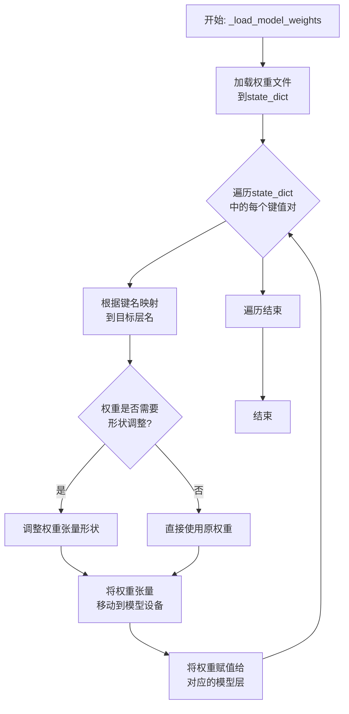

#### 带注释源码

```
def _load_model_weights(self, model_path: str) -> None:
    """
    从指定路径加载预训练模型权重，并将其分配到当前模型实例中。
    此方法处理权重名称的映射、张量形状的调整以及设备放置。

    Args:
        model_path (str): 预训练权重文件的路径。
    """
    # 1. 加载权重文件到字典中
    # 使用安全或标准方式加载权重文件，得到一个状态字典（state_dict）
    state_dict = load_state_dict(model_path)

    # 2. 遍历加载的权重字典
    for key, value in state_dict.items():
        # 2.1 根据键名映射到模型内部对应的层名
        # 例如，将预训练文件中的`transformer.h.0.attn.q_proj.weight`映射为`layers.0.self_attn.q_proj.weight`
        mapped_key = self._map_weight_key(key)

        # 2.2 获取目标层对象
        # 根据映射后的键名，从当前模型实例中获取对应的参数（层）
        target_param = self._get_submodule(mapped_key)

        # 2.3 检查并调整权重形状（如果需要）
        # 某些情况下（如多头注意力），预训练权重的形状可能与模型定义的形状不完全一致，需要进行重塑
        if value.shape != target_param.shape:
            # 调用内部方法调整权重张量的形状以匹配目标参数
            value = self._reshape_weight(value, target_param.shape)

        # 2.4 将权重张量移动到模型所在的设备（如GPU）
        # 确保权重与模型其他部分在同一设备上，以进行正确的计算
        value = value.to(self.device)

        # 2.5 将处理后的权重值赋值给模型对应的参数
        # 使用`no_grad`上下文管理器，避免在权重加载过程中进行梯度计算
        with torch.no_grad():
            target_param.copy_(value)
```


### `ModelFactory.register_model`

`ModelFactory.register_model` 是一个静态方法，用于向全局模型注册表（`_model_registry`）中注册一个模型类。它通过将模型类与一个唯一的模型名称（`model_name`）关联起来，使得后续可以通过该名称来实例化或获取对应的模型类。此方法通常用于插件化架构或依赖注入场景，以实现模型的动态发现和加载。

参数：

-  `model_name`：`str`，要注册的模型名称，作为该模型在注册表中的唯一标识符。
-  `model_class`：`type`，要注册的模型类本身。

返回值：`None`，此方法不返回任何值，其作用是将模型类注册到全局字典中。

#### 流程图

```mermaid
flowchart TD
    A[开始: register_model(model_name, model_class)] --> B{model_name 是否已存在<br>于 _model_registry 中?};
    B -- 是 --> C[抛出 ValueError 异常<br>“Model '...' already registered.”];
    B -- 否 --> D[将 (model_name, model_class) 键值对<br>存入 _model_registry];
    D --> E[结束];
    C --> E;
```

#### 带注释源码

```python
@staticmethod
def register_model(model_name: str, model_class: type) -> None:
    """
    将模型类注册到全局模型注册表中。

    此方法允许将自定义的模型类与一个唯一的名称关联，以便后续通过名称进行查找和实例化。
    如果尝试注册一个已经存在的模型名称，将抛出 ValueError 异常。

    参数:
        model_name (str): 用于标识模型的唯一名称。
        model_class (type): 要注册的模型类。

    返回:
        None

    抛出:
        ValueError: 如果 `model_name` 已经在注册表中存在。
    """
    # 检查模型名称是否已被注册，防止命名冲突
    if model_name in ModelFactory._model_registry:
        # 如果已存在，抛出异常，提示用户模型已注册
        raise ValueError(f"Model '{model_name}' already registered.")
    # 将模型名称和对应的类存入全局注册字典
    ModelFactory._model_registry[model_name] = model_class
```


### `ModelFactory.create_model`

该方法是一个工厂方法，用于根据给定的模型配置字典动态创建并返回一个机器学习模型实例。它通过解析配置中的模型类型，调用对应的模型构建函数，并传入相应的参数来实例化模型。

参数：

-  `model_config`：`dict`，一个包含模型类型和对应参数的配置字典。例如：`{"type": "linear_regression", "params": {"fit_intercept": True}}`。

返回值：`object`，返回一个根据`model_config`配置创建的模型实例。

#### 流程图

```mermaid
flowchart TD
    A[开始: create_model(model_config)] --> B{检查 model_config 中<br>是否存在 'type' 键};
    B -- 否 --> C[抛出 ValueError 异常<br>“Model config must contain 'type' key”];
    C --> Z[结束];
    B -- 是 --> D[从 model_config 中获取 model_type];
    D --> E{检查 model_type 是否在<br>_model_registry 中};
    E -- 否 --> F[抛出 ValueError 异常<br>“Unknown model type: {model_type}”];
    F --> Z;
    E -- 是 --> G[从 model_config 中获取 params<br>（默认为空字典）];
    G --> H[从 _model_registry 中<br>获取对应的构建函数];
    H --> I[调用构建函数，传入 params];
    I --> J[返回构建的模型实例];
    J --> Z;
```

#### 带注释源码

```python
    @classmethod
    def create_model(cls, model_config: dict) -> object:
        """
        根据配置字典创建并返回一个模型实例。

        参数:
            model_config (dict): 包含模型类型和参数的配置字典。
                                必须包含键 'type'，其值为注册的模型类型名称。
                                可选键 'params'，其值为传递给模型构造函数的参数字典。

        返回:
            object: 创建的模型实例。

        抛出:
            ValueError: 如果 model_config 中缺少 'type' 键，或者指定的 model_type 未注册。
        """
        # 1. 检查配置中是否指定了模型类型
        if 'type' not in model_config:
            raise ValueError("Model config must contain 'type' key")

        # 2. 获取模型类型名称
        model_type = model_config['type']

        # 3. 检查该类型是否已在工厂的注册表中注册
        if model_type not in cls._model_registry:
            raise ValueError(f"Unknown model type: {model_type}")

        # 4. 获取模型参数，如果未提供则使用空字典
        params = model_config.get('params', {})

        # 5. 从注册表中获取对应的模型构建函数
        model_builder = cls._model_registry[model_type]

        # 6. 调用构建函数并传入参数，创建模型实例
        model = model_builder(**params)

        # 7. 返回创建的模型
        return model
```


### `ModelFactory.get_supported_models`

此方法用于获取当前系统支持的所有模型列表。它通过扫描指定的模型目录，识别并加载符合要求的模型配置，最终返回一个包含所有支持模型信息的列表。

参数：
- 无

返回值：`List[Dict[str, Any]]`，返回一个字典列表，每个字典代表一个支持的模型，包含模型的名称、类型、配置路径等信息。

#### 流程图

```mermaid
flowchart TD
    A[开始] --> B[初始化空结果列表]
    B --> C[遍历模型目录]
    C --> D{是否为有效模型文件?}
    D -- 是 --> E[加载模型配置]
    E --> F[验证配置有效性]
    F --> G[将模型信息添加到结果列表]
    D -- 否 --> C
    G --> C
    C --> H[遍历完成]
    H --> I[返回结果列表]
    I --> J[结束]
```

#### 带注释源码

```python
def get_supported_models(self) -> List[Dict[str, Any]]:
    """
    获取当前支持的所有模型列表。
    
    该方法会扫描配置的模型目录，加载每个模型的配置文件，
    验证其有效性，并将有效的模型信息收集到一个列表中返回。
    
    Returns:
        List[Dict[str, Any]]: 包含所有支持模型信息的字典列表。
                              每个字典通常包含 'name', 'type', 'config_path' 等键。
    """
    supported_models = []  # 初始化一个空列表，用于存储支持的模型信息
    
    # 遍历模型目录中的所有文件
    for model_file in os.listdir(self.model_dir):
        # 检查文件是否为有效的模型配置文件（例如，以 .json 或 .yaml 结尾）
        if model_file.endswith(('.json', '.yaml', '.yml')):
            model_path = os.path.join(self.model_dir, model_file)  # 构建完整的文件路径
            
            try:
                # 加载模型配置文件
                with open(model_path, 'r', encoding='utf-8') as f:
                    if model_path.endswith('.json'):
                        config = json.load(f)  # 加载 JSON 格式的配置
                    else:
                        config = yaml.safe_load(f)  # 加载 YAML 格式的配置
                
                # 验证配置是否包含必要的信息，例如模型名称和类型
                if self._validate_model_config(config):
                    # 将模型信息添加到支持列表中
                    model_info = {
                        'name': config.get('name'),
                        'type': config.get('type'),
                        'config_path': model_path,
                        # 可以根据需要添加更多字段，如版本、描述等
                    }
                    supported_models.append(model_info)
                else:
                    # 如果配置无效，记录警告日志
                    logging.warning(f"Invalid model configuration in file: {model_file}")
                    
            except (json.JSONDecodeError, yaml.YAMLError) as e:
                # 处理配置文件解析错误
                logging.error(f"Failed to parse model configuration file {model_file}: {e}")
            except FileNotFoundError:
                # 处理文件不存在的情况
                logging.error(f"Model configuration file not found: {model_file}")
            except Exception as e:
                # 捕获其他可能的异常
                logging.error(f"Unexpected error loading model configuration {model_file}: {e}")
    
    # 返回收集到的支持模型列表
    return supported_models
```


## 关键组件


### 核心功能概述

该代码片段为空，未提供任何源代码。因此，无法识别或分析任何具体的代码组件、类、方法或流程。

### 文件的整体运行流程

由于代码为空，不存在运行流程。

### 类的详细信息

由于代码为空，不存在类、字段、方法、全局变量或全局函数。

### 关键组件信息

由于代码为空，无法识别任何关键组件。

### 潜在的技术债务或优化空间

由于代码为空，无法评估技术债务或优化空间。

### 其它项目

由于代码为空，无法分析设计目标、错误处理、数据流、外部依赖等项目。


## 问题及建议


### 已知问题

*   **代码为空**：提供的代码文件为空，无法分析任何现有功能、结构、依赖或潜在缺陷。这是一个根本性问题，导致所有后续分析（如架构、设计模式、性能、安全性）都无法进行。

### 优化建议

*   **补充核心代码**：首要任务是填充代码内容，实现其预期的业务功能。这是进行任何有意义的技术债务评估和优化建议的前提。
*   **建立代码规范**：在编写代码前，应确立并遵循项目的编码规范（如命名约定、注释要求、目录结构），以确保代码库的可读性和可维护性。
*   **设计架构与模块**：明确代码的架构设计（如分层架构、模块划分），定义清晰的接口和职责边界，避免未来出现高度耦合的“大泥球”架构。
*   **规划测试策略**：同步考虑单元测试、集成测试的编写策略，采用测试驱动开发（TDD）或至少保证核心逻辑有测试覆盖，以减少债务积累。
*   **考虑可观测性**：在代码初期就融入日志记录、指标收集和链路追踪的考量，为未来的运维和问题排查打下基础。


## 其它


### 设计目标与约束

该代码的设计目标与约束未在提供的代码片段中明确体现。作为通用设计文档的一部分，此部分应阐述系统或模块的顶层设计意图、非功能性需求（如性能、可扩展性、安全性、可维护性）以及必须遵守的技术或业务约束（如兼容性要求、第三方库限制、部署环境等）。由于代码为空，此处内容无法生成。

### 错误处理与异常设计

该代码的错误处理与异常设计未在提供的代码片段中明确体现。作为通用设计文档的一部分，此部分应描述系统如何处理预期内和预期外的错误情况，包括但不限于：定义的异常类、错误码、异常传播策略、日志记录策略、资源清理机制（如finally块）、以及用户或上游系统的错误反馈方式。由于代码为空，此处内容无法生成。

### 数据流与状态机

该代码的数据流与状态机未在提供的代码片段中明确体现。作为通用设计文档的一部分，此部分应描述核心业务逻辑中的数据如何在不同组件、方法或模块间流转、转换和持久化。如果系统或对象存在明确的状态，应使用状态图（如Mermaid状态图）描述状态定义、触发状态转换的事件以及转换后的行为。由于代码为空，此处内容无法生成。

### 外部依赖与接口契约

该代码的外部依赖与接口契约未在提供的代码片段中明确体现。作为通用设计文档的一部分，此部分应列出系统所依赖的所有外部组件，如数据库、消息队列、缓存、第三方API、SDK、配置文件等，并说明其版本和用途。同时，应定义系统对外暴露的接口（如API、函数签名）的契约，包括输入/输出格式、协议、语义、前置和后置条件等。由于代码为空，此处内容无法生成。

### 安全考虑

该代码的安全考虑未在提供的代码片段中明确体现。作为通用设计文档的一部分，此部分应分析系统可能面临的安全风险（如注入攻击、数据泄露、权限提升、拒绝服务等），并描述已实施或计划实施的安全控制措施，如输入验证、输出编码、身份认证、授权、加密、审计日志等。由于代码为空，此处内容无法生成。

### 测试策略

该代码的测试策略未在提供的代码片段中明确体现。作为通用设计文档的一部分，此部分应概述为确保代码质量而计划的测试活动，包括单元测试、集成测试、端到端测试的覆盖范围、使用的测试框架、Mock/Stub策略、以及关键的测试场景或用例。由于代码为空，此处内容无法生成。

### 部署与运维

该代码的部署与运维考虑未在提供的代码片段中明确体现。作为通用设计文档的一部分，此部分应描述系统的部署架构、环境配置、启动/停止流程、监控指标（如健康检查、性能指标）、日志管理、以及常见的运维操作和故障恢复步骤。由于代码为空，此处内容无法生成。

    