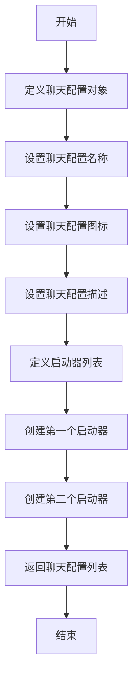
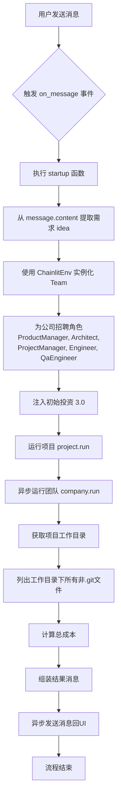
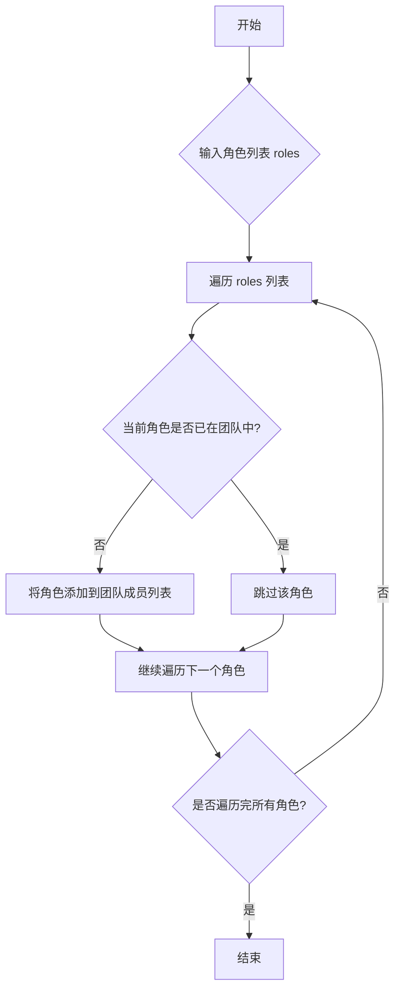
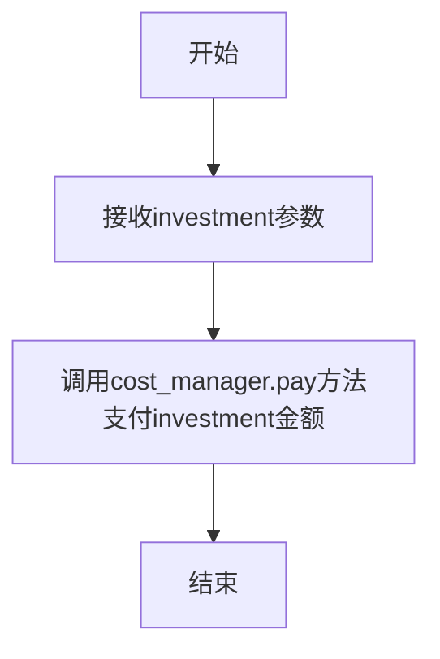
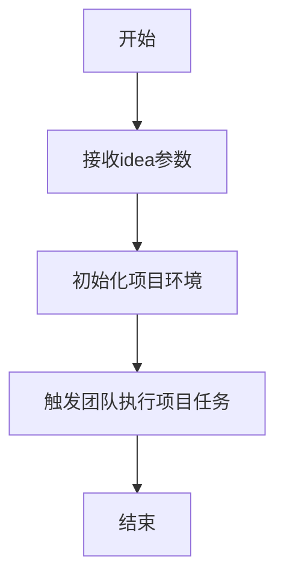
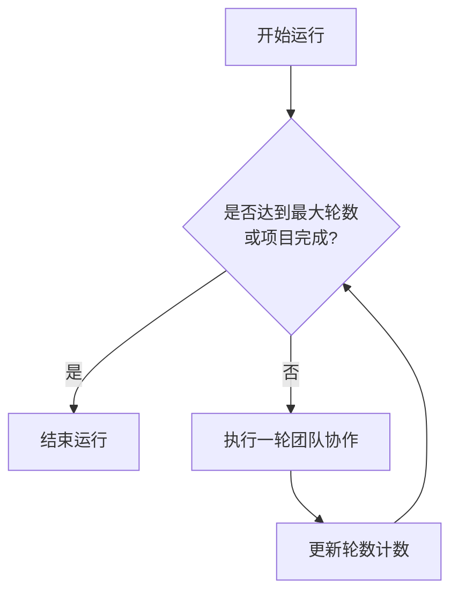
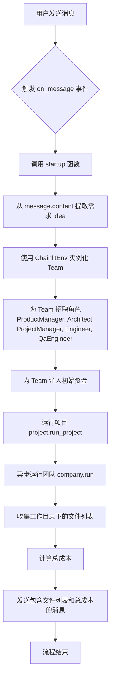
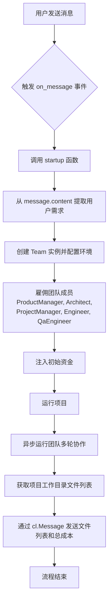
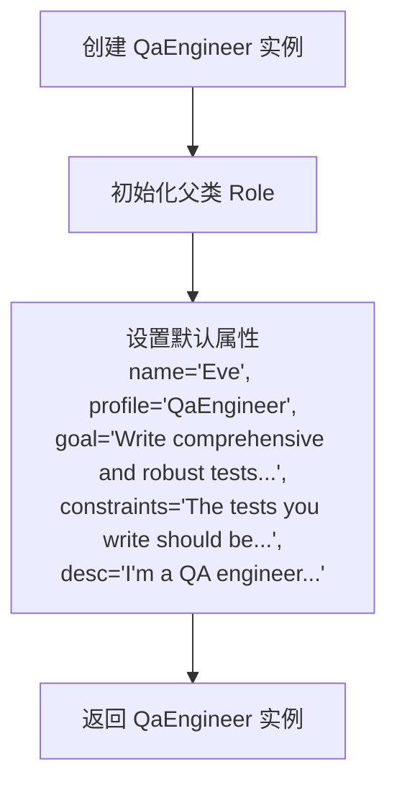
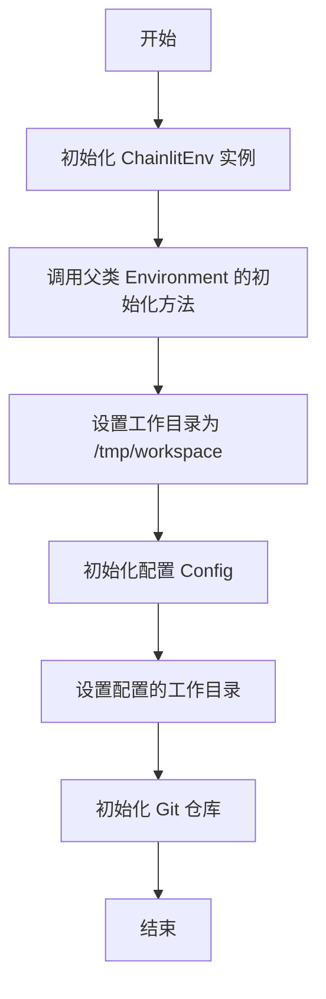

# `.\MetaGPT\examples\ui_with_chainlit\app.py` 详细设计文档

该代码是一个基于Chainlit框架的MetaGPT应用入口，核心功能是提供一个Web UI聊天界面，允许用户输入一行需求（如“创建一个2048游戏”），然后自动组建一个包含产品经理、架构师、项目经理、工程师和QA工程师的虚拟软件公司团队，执行多轮协作以生成完整的软件项目代码、文档等产出物，最后在UI中展示生成的文件列表和总成本。

## 整体流程

```mermaid
graph TD
    A[用户访问Chainlit Web UI] --> B{用户选择/输入需求}
    B --> C[触发@cl.on_message事件]
    C --> D[解析用户消息内容为Idea]
    D --> E[创建Team对象，注入ChainlitEnv环境]
    E --> F[调用company.hire组建团队]
    F --> G[调用company.invest注入初始资金]
    G --> H[调用company.run_project启动项目]
    H --> I[调用company.run执行多轮协作]
    I --> J[扫描项目工作目录，列出生成的文件]
    J --> K[组装包含文件列表和总成本的消息]
    K --> L[通过cl.Message.send()将结果发送回UI]
    L --> M[用户在UI中查看生成结果]
```

## 类结构

```
Chainlit App (入口脚本)
├── 全局函数: chat_profile (装饰器: @cl.set_chat_profiles)
└── 全局函数: startup (装饰器: @cl.on_message)
外部依赖:
├── chainlit (UI框架)
├── metagpt.roles (角色类: ProductManager, Architect, ...)
├── metagpt.team (Team类)
└── init_setup (ChainlitEnv类)
```

## 全局变量及字段


### `idea`
    
用户通过Chainlit UI输入的需求描述，作为启动MetaGPT团队项目的核心输入。

类型：`str`
    


### `company`
    
代表一个MetaGPT软件公司的团队实例，负责协调和管理所有角色成员以完成项目。

类型：`Team`
    


### `workdir`
    
指向MetaGPT团队项目生成代码的根目录路径对象。

类型：`Path`
    


### `files`
    
一个包含项目根目录下所有非.git文件路径的字符串，用于在UI中向用户展示生成的文件列表。

类型：`str`
    


### `Team.env`
    
Team实例的运行环境配置，封装了Chainlit特定的上下文和配置信息。

类型：`ChainlitEnv`
    


### `Team.cost_manager`
    
Team实例的成本管理器，用于追踪和计算项目执行过程中的总成本。

类型：`CostManager`
    


### `Team.... (来自metagpt.team模块)`
    
Team类的其他内部字段，用于管理团队成员、项目状态、通信等内部逻辑。

类型：`Various`
    


### `ProductManager.... (来自metagpt.roles模块)`
    
ProductManager角色的内部字段，用于管理产品需求、用户故事等产品相关逻辑。

类型：`Various`
    


### `Architect.... (来自metagpt.roles模块)`
    
Architect角色的内部字段，用于处理系统架构设计、技术选型等架构相关逻辑。

类型：`Various`
    


### `ProjectManager.... (来自metagpt.roles模块)`
    
ProjectManager角色的内部字段，用于管理项目计划、任务分配等项目管理逻辑。

类型：`Various`
    


### `Engineer.n_borg`
    
Engineer角色的并行工作进程数量，用于控制代码生成的并发度。

类型：`int`
    


### `Engineer.use_code_review`
    
Engineer角色的标志位，指示是否在代码生成过程中启用代码审查流程。

类型：`bool`
    


### `Engineer.... (来自metagpt.roles模块)`
    
Engineer角色的其他内部字段，用于管理代码生成、模块实现等工程相关逻辑。

类型：`Various`
    


### `QaEngineer.... (来自metagpt.roles模块)`
    
QaEngineer角色的内部字段，用于管理测试用例、质量保证等测试相关逻辑。

类型：`Various`
    


### `ChainlitEnv.... (来自init_setup模块)`
    
ChainlitEnv环境的内部字段，用于存储Chainlit UI相关的配置和运行时状态。

类型：`Various`
    
    

## 全局函数及方法

### `chat_profile`

该函数是一个异步函数，用于生成一个聊天配置文件。该配置文件包含一个名为“MetaGPT”的聊天配置，其中定义了一些启动器消息，用户可以通过点击这些启动器来触发MetaGPT的运行。该函数返回一个包含聊天配置对象的列表。

参数：无

返回值：`list[chainlit.ChatProfile]`，返回一个包含聊天配置对象的列表。

#### 流程图



#### 带注释源码

```python
from pathlib import Path

import chainlit as cl
from init_setup import ChainlitEnv

from metagpt.roles import (
    Architect,
    Engineer,
    ProductManager,
    ProjectManager,
    QaEngineer,
)
from metagpt.team import Team


# https://docs.chainlit.io/concepts/starters
@cl.set_chat_profiles
async def chat_profile() -> list[cl.ChatProfile]:
    """Generates a chat profile containing starter messages which can be triggered to run MetaGPT

    Returns:
        list[chainlit.ChatProfile]: List of Chat Profile
    """
    return [
        cl.ChatProfile(
            name="MetaGPT",  # 聊天配置的名称
            icon="/public/MetaGPT-new-log.jpg",  # 聊天配置的图标路径
            markdown_description="It takes a **one line requirement** as input and outputs **user stories / competitive analysis / requirements / data structures / APIs / documents, etc.**, But `everything in UI`.",  # 聊天配置的描述，支持Markdown格式
            starters=[  # 启动器列表，用户可以通过点击这些启动器来触发MetaGPT的运行
                cl.Starter(
                    label="Create a 2048 Game",  # 启动器的标签
                    message="Create a 2048 game",  # 启动器发送的消息内容
                    icon="/public/2048.jpg",  # 启动器的图标路径
                ),
                cl.Starter(
                    label="Write a cli Blackjack Game",  # 启动器的标签
                    message="Write a cli Blackjack Game",  # 启动器发送的消息内容
                    icon="/public/blackjack.jpg",  # 启动器的图标路径
                ),
            ],
        )
    ]
```

### `startup`

这是一个异步函数，作为Chainlit应用的消息处理入口。当用户在UI中发送消息时，此函数被触发。它的核心功能是接收用户的一条需求（idea），实例化一个MetaGPT软件公司团队，为其招聘一系列预定义的角色（如产品经理、架构师等），注入初始“资金”，并运行一个项目来响应该需求。项目运行结束后，它会列出生成的文件目录并计算总成本，最后将结果以消息形式发送回UI。

参数：
- `message`：`chainlit.Message`，由Chainlit框架传递的用户消息对象，其`content`属性包含了用户输入的需求文本。

返回值：`None`，此函数不返回任何值，所有结果通过异步发送消息的方式输出。

#### 流程图



#### 带注释源码

```python
# https://docs.chainlit.io/concepts/message
@cl.on_message  # Chainlit装饰器，将此函数注册为消息处理函数
async def startup(message: cl.Message) -> None:
    """On Message in UI, Create a MetaGPT software company

    Args:
        message (chainlit.Message): message by chainlist
    """
    # 1. 从用户消息中提取核心需求
    idea = message.content

    # 2. 使用特定的环境配置实例化一个MetaGPT团队（公司）
    company = Team(env=ChainlitEnv())

    # 3. 为公司招聘一系列标准角色，模拟软件公司的组织结构
    #    工程师角色配置了使用5个“博格”实例（并行执行）并启用代码审查
    company.hire(
        [
            ProductManager(),
            Architect(),
            ProjectManager(),
            Engineer(n_borg=5, use_code_review=True),
            QaEngineer(),
        ]
    )

    # 4. 为公司注入初始“资金”，用于驱动内部角色的协作与执行
    company.invest(investment=3.0)

    # 5. 启动一个项目，将用户需求作为项目的核心理念
    company.run_project(idea=idea)

    # 6. 异步运行团队，进行多轮（此处为5轮）的协作与产出
    await company.run(n_round=5)

    # 7. 项目运行结束后，定位到项目生成的工作目录
    workdir = Path(company.env.context.config.project_path)
    # 8. 列出该目录下所有的文件（排除.git等隐藏文件）
    files = [file.name for file in workdir.iterdir() if file.is_file()]
    files = "\n".join([f"{workdir}/{file}" for file in files if not file.startswith(".git")])

    # 9. 组装最终结果消息，包含生成的文件列表和总成本
    await cl.Message(
        content=f"""
Codes can be found here:
{files}

---

Total cost: `{company.cost_manager.total_cost}`
"""
    ).send()  # 10. 异步发送该消息到Chainlit UI
```

### `Team.hire`

该方法用于为团队（公司）雇佣指定的角色成员，将传入的角色列表添加到团队的成员列表中。

参数：

- `roles`：`list[Role]`，要雇佣的角色对象列表

返回值：`None`，无返回值

#### 流程图



#### 带注释源码

```python
def hire(self, roles: list[Role]):
    """
    雇佣指定的角色到团队中。

    该方法接收一个角色列表，遍历列表中的每个角色，检查该角色是否已经存在于团队中。
    如果不存在，则将其添加到团队的成员列表中；如果已存在，则跳过。

    Args:
        roles (list[Role]): 要雇佣的角色对象列表。

    Returns:
        None: 该方法不返回任何值。
    """
    for role in roles:
        # 检查角色是否已经在团队成员列表中
        if role in self.env.get_roles():
            # 如果角色已存在，则跳过
            continue
        # 如果角色不存在，则将其添加到团队成员列表中
        self.env.add_role(role)
```

### `Team.invest`

该方法用于为团队注入初始资金，以启动项目并支付团队成员的成本。

参数：

- `investment`：`float`，注入的资金金额，用于支付团队成员的初始成本。

返回值：`None`，无返回值。

#### 流程图



#### 带注释源码

```python
def invest(self, investment: float):
    """
    为团队注入初始资金。

    该方法通过调用成本管理器的支付方法，为团队注入指定的资金金额，
    用于启动项目并支付团队成员的初始成本。

    Args:
        investment (float): 注入的资金金额。
    """
    # 调用成本管理器的支付方法，注入资金
    self.cost_manager.pay(investment)
```

### `Team.run_project`

该方法用于启动并运行一个项目，基于给定的项目想法（idea）进行初始化，并触发团队开始执行项目任务。

参数：

- `idea`：`str`，项目的核心想法或需求描述，作为项目启动的输入。

返回值：`None`，该方法不返回任何值，直接执行项目运行流程。

#### 流程图



#### 带注释源码

```python
def run_project(self, idea: str):
    """
    启动并运行项目。

    该方法接收一个项目想法（idea），初始化项目环境，并触发团队开始执行项目任务。
    项目运行过程中，团队成员会根据角色分工协作，完成需求分析、设计、开发、测试等任务。

    Args:
        idea (str): 项目的核心想法或需求描述，作为项目启动的输入。

    Returns:
        None: 该方法不返回任何值，直接执行项目运行流程。
    """
    # 初始化项目环境，将idea传递给团队上下文
    self.env.context.idea = idea
    # 触发团队开始执行项目任务
    self.start_project()
```

### `Team.run`

该方法用于启动并运行团队项目，通过多轮迭代执行团队成员的任务，直到项目完成或达到指定的轮数限制。

参数：

- `n_round`：`int`，指定团队运行的最大轮数，默认为`None`表示无限制

返回值：`None`，无返回值

#### 流程图



#### 带注释源码

```python
async def run(self, n_round: int = None):
    """
    运行团队项目
    
    通过多轮迭代执行团队成员的任务，直到项目完成或达到指定的轮数限制
    
    Args:
        n_round: 最大运行轮数，None表示无限制
    """
    # 初始化轮数计数器
    round_count = 0
    
    # 主循环：持续运行直到项目完成或达到最大轮数
    while not self.project.is_finished and (n_round is None or round_count < n_round):
        # 执行一轮团队协作
        await self._run_round()
        
        # 更新轮数计数
        round_count += 1
        
        # 记录运行状态
        logger.info(f"Round {round_count} completed")
    
    # 项目完成或达到最大轮数后结束
    logger.info(f"Team run completed after {round_count} rounds")
```

### `startup`

这是一个异步函数，用于响应Chainlit UI中的用户消息。当用户在UI中发送消息时，此函数会被触发。它的核心功能是：接收用户输入的一个想法（例如“创建一个2048游戏”），然后实例化一个MetaGPT软件公司团队，为该团队招聘一系列预定义的角色（如产品经理、架构师等），注入初始“资金”，并启动一个项目来执行该想法。项目运行数轮后，函数会收集生成的文件列表和总成本，并将这些信息作为一条消息发送回UI。

参数：

- `message`：`chainlit.Message`，由Chainlit框架传递的用户消息对象，其`content`属性包含了用户输入的文本。

返回值：`None`，此函数不返回任何值，其所有输出都通过异步消息发送回UI。

#### 流程图

```mermaid
flowchart TD
    A[用户发送消息] --> B{触发 on_message 事件}
    B --> C[执行 startup 函数]
    C --> D[从 message.content 提取 idea]
    D --> E[使用 ChainlitEnv 实例化 Team]
    E --> F[为 Team 招聘角色<br/>ProductManager, Architect,<br/>ProjectManager, Engineer, QaEngineer]
    F --> G[为 Team 注入投资<br/>investment=3.0]
    G --> H[运行项目<br/>company.run_project(idea)]
    H --> I[异步运行团队多轮<br/>await company.run(n_round=5)]
    I --> J[收集项目工作目录下的文件列表]
    J --> K[格式化文件列表和总成本信息]
    K --> L[发送包含信息的消息回 UI]
    L --> M[函数结束]
```

#### 带注释源码

```python
# https://docs.chainlit.io/concepts/message
@cl.on_message # Chainlit装饰器，将此函数注册为消息处理器
async def startup(message: cl.Message) -> None:
    """On Message in UI, Create a MetaGPT software company

    Args:
        message (chainlit.Message): message by chainlist
    """
    # 1. 从用户消息中提取核心想法
    idea = message.content
    # 2. 使用自定义环境实例化一个MetaGPT团队
    company = Team(env=ChainlitEnv())

    # 3. 为团队招聘成员，模拟软件公司的角色构成
    # Similar to software_company.py
    company.hire(
        [
            ProductManager(),   # 产品经理
            Architect(),        # 架构师
            ProjectManager(),   # 项目经理
            Engineer(n_borg=5, use_code_review=True), # 工程师（设置5个“博格”实例，启用代码审查）
            QaEngineer(),       # 质量保证工程师
        ]
    )

    # 4. 为团队注入初始“资金”（用于驱动智能体行动）
    company.invest(investment=3.0)
    # 5. 启动一个以用户想法为核心的新项目
    company.run_project(idea=idea)

    # 6. 异步运行团队，进行多轮协作（这里设定为5轮）
    await company.run(n_round=5)

    # 7. 项目运行结束后，获取工作目录并列出生成的所有文件
    workdir = Path(company.env.context.config.project_path)
    files = [file.name for file in workdir.iterdir() if file.is_file()]
    # 过滤掉.git等隐藏文件，并拼接完整路径
    files = "\n".join([f"{workdir}/{file}" for file in files if not file.startswith(".git")])

    # 8. 将文件列表和总成本信息发送回Chainlit UI
    await cl.Message(
        content=f"""
Codes can be found here:
{files}

---

Total cost: `{company.cost_manager.total_cost}`
"""
    ).send()
```

### `startup`

该函数是Chainlit应用的核心消息处理函数，当用户在UI中发送消息时触发。它接收用户的需求（idea），初始化一个MetaGPT软件公司团队，并执行一个完整的软件开发流程。函数会模拟一个包含产品经理、架构师、项目经理、工程师和QA工程师的团队，进行多轮协作开发，最终将生成的代码文件列表和总成本返回给用户。

参数：

- `message`：`chainlit.Message`，由Chainlit框架传递的用户消息对象，其`content`属性包含了用户的需求文本。

返回值：`None`，该函数不直接返回值，而是通过Chainlit的`cl.Message`异步发送结果消息给用户。

#### 流程图

```mermaid
flowchart TD
    A[用户发送消息] --> B{触发 on_message 事件}
    B --> C[执行 startup 函数]
    C --> D[从 message.content 提取需求 idea]
    D --> E[初始化 Team 并配置 ChainlitEnv]
    E --> F[雇佣团队成员<br>ProductManager, Architect,<br>ProjectManager, Engineer, QaEngineer]
    F --> G[注入初始资金 investment=3.0]
    G --> H[运行项目 company.run_project(idea)]
    H --> I[执行多轮团队协作 company.run(n_round=5)]
    I --> J[获取项目工作目录下的文件列表]
    J --> K[异步发送结果消息<br>包含文件列表和总成本]
    K --> L[流程结束]
```

#### 带注释源码

```python
# https://docs.chainlit.io/concepts/message
@cl.on_message
async def startup(message: cl.Message) -> None:
    """On Message in UI, Create a MetaGPT software company

    Args:
        message (chainlit.Message): message by chainlist
    """
    # 1. 从用户消息中提取核心需求
    idea = message.content
    # 2. 初始化一个团队环境，使用ChainlitEnv进行适配
    company = Team(env=ChainlitEnv())

    # 3. 雇佣团队成员，模拟一个软件公司的标准配置
    # Similar to software_company.py
    company.hire(
        [
            ProductManager(),   # 产品经理，负责需求分析
            Architect(),        # 架构师，负责系统设计
            ProjectManager(),   # 项目经理，负责进度管理
            Engineer(n_borg=5, use_code_review=True), # 工程师，配置为5个“博格”个体并使用代码审查
            QaEngineer(),       # 质量保证工程师，负责测试
        ]
    )

    # 4. 为项目注入初始资金（3.0个单位）
    company.invest(investment=3.0)
    # 5. 启动项目，将用户需求传递给团队
    company.run_project(idea=idea)

    # 6. 运行团队协作流程，进行5轮迭代开发
    await company.run(n_round=5)

    # 7. 项目完成后，获取工作目录并列出所有生成的文件
    workdir = Path(company.env.context.config.project_path)
    files = [file.name for file in workdir.iterdir() if file.is_file()]
    # 过滤掉.git等隐藏文件
    files = "\n".join([f"{workdir}/{file}" for file in files if not file.startswith(".git")])

    # 8. 异步发送最终结果消息给用户，包含文件列表和总成本
    await cl.Message(
        content=f"""
Codes can be found here:
{files}

---

Total cost: `{company.cost_manager.total_cost}`
"""
    ).send()
```

### `startup`

`startup` 函数是 Chainlit 应用中的一个异步消息处理器。当用户在 Chainlit UI 中发送一条消息时，此函数会被触发。它的核心功能是接收用户的需求（一个想法），实例化一个 MetaGPT 软件公司团队，为团队招聘不同的角色（如产品经理、架构师、工程师等），注入初始资金，并运行一个项目来响应该需求。项目运行结束后，它会收集生成的文件列表和总成本，并将这些信息作为一条消息发送回 UI。

参数：

-  `message`：`chainlit.Message`，由 Chainlit 框架传递的用户消息对象，其 `content` 属性包含了用户的需求文本。

返回值：`None`，此函数不返回任何值，其效果是通过异步操作完成项目并发送消息。

#### 流程图



#### 带注释源码

```python
# https://docs.chainlit.io/concepts/message
@cl.on_message # 装饰器：将此函数注册为 Chainlit 的消息处理器
async def startup(message: cl.Message) -> None:
    """On Message in UI, Create a MetaGPT software company

    Args:
        message (chainlit.Message): message by chainlist
    """
    # 1. 从用户消息中提取核心需求
    idea = message.content

    # 2. 创建一个运行在 Chainlit 环境下的 MetaGPT 团队
    company = Team(env=ChainlitEnv())

    # 3. 为团队招聘成员，模拟软件公司的角色构成
    # Similar to software_company.py
    company.hire(
        [
            ProductManager(), # 产品经理：定义需求和优先级
            Architect(),      # 架构师：设计系统架构
            ProjectManager(), # 项目经理：管理项目进度
            Engineer(n_borg=5, use_code_review=True), # 工程师：编写代码，这里配置了5个“博格”工程师（共享知识）并启用代码审查
            QaEngineer(),     # 质量保证工程师：进行测试
        ]
    )

    # 4. 为项目注入初始资金（用于支付AI调用等成本）
    company.invest(investment=3.0)

    # 5. 启动项目，将用户需求作为项目目标
    company.run_project(idea=idea)

    # 6. 异步运行团队协作流程，进行多轮交互以完成项目
    await company.run(n_round=5)

    # 7. 项目完成后，获取工作目录并列出所有生成的文件
    workdir = Path(company.env.context.config.project_path)
    files = [file.name for file in workdir.iterdir() if file.is_file()]
    # 过滤掉 .git 等隐藏文件，并生成完整的文件路径列表
    files = "\n".join([f"{workdir}/{file}" for file in files if not file.startswith(".git")])

    # 8. 将结果（文件列表和总成本）发送回 Chainlit UI
    await cl.Message(
        content=f"""
Codes can be found here:
{files}

---

Total cost: `{company.cost_manager.total_cost}`
"""
    ).send()
```

### `startup`

`startup` 函数是 Chainlit 应用的消息处理入口。当用户在 UI 中发送一条消息时，此函数会被触发。它接收用户的需求（idea），创建一个模拟的软件公司（Team），并为其雇佣一系列角色（如产品经理、架构师等）。然后，公司会启动一个项目来响应用户的需求，运行多轮开发流程，最终将生成的文件列表和总成本返回给用户。

参数：

-  `message`：`chainlit.Message`，由 Chainlit 框架传递的用户消息对象，其 `content` 属性包含了用户的需求文本。

返回值：`None`，此函数不直接返回值，而是通过 Chainlit 的 `cl.Message` 异步发送消息给用户。

#### 流程图

```mermaid
flowchart TD
    A[用户发送消息] --> B{触发 on_message 事件}
    B --> C[执行 startup 函数]
    C --> D[从 message.content 提取需求 idea]
    D --> E[创建 Team 对象 company]
    E --> F[为 company 雇佣角色<br>ProductManager, Architect,<br>ProjectManager, Engineer, QaEngineer]
    F --> G[注入初始资金 investment=3.0]
    G --> H[运行项目 company.run_project(idea)]
    H --> I[执行多轮开发流程 company.run(n_round=5)]
    I --> J[获取项目工作目录 workdir]
    J --> K[遍历 workdir， 收集生成的文件列表]
    K --> L[通过 cl.Message 异步发送<br>文件列表和总成本给用户]
    L --> M[函数结束]
```

#### 带注释源码

```python
# https://docs.chainlit.io/concepts/message
@cl.on_message  # Chainlit 装饰器，将此函数注册为消息处理函数
async def startup(message: cl.Message) -> None:
    """On Message in UI, Create a MetaGPT software company

    Args:
        message (chainlit.Message): message by chainlist
    """
    # 1. 从用户消息中提取核心需求
    idea = message.content
    
    # 2. 创建一个运行在 Chainlit 环境中的团队（软件公司）
    company = Team(env=ChainlitEnv())

    # 3. 为团队雇佣关键角色，模拟一个完整的软件开发团队
    #    类似于 software_company.py 中的配置
    company.hire(
        [
            ProductManager(),   # 产品经理，负责需求分析
            Architect(),        # 架构师，负责系统设计
            ProjectManager(),   # 项目经理，负责项目协调
            Engineer(n_borg=5, use_code_review=True), # 工程师（5个副本），负责编码和代码审查
            QaEngineer(),       # 测试工程师，负责质量保证
        ]
    )

    # 4. 为项目注入初始资金（3.0 单位）
    company.invest(investment=3.0)
    
    # 5. 启动一个以用户需求为核心的新项目
    company.run_project(idea=idea)

    # 6. 运行团队，进行多轮（5轮）的协作与开发
    await company.run(n_round=5)

    # 7. 项目完成后，获取项目的工作目录
    workdir = Path(company.env.context.config.project_path)
    
    # 8. 遍历工作目录，收集所有生成的非隐藏文件（排除 .git 相关文件）
    files = [file.name for file in workdir.iterdir() if file.is_file()]
    files = "\n".join([f"{workdir}/{file}" for file in files if not file.startswith(".git")])

    # 9. 通过 Chainlit 异步发送一条消息给用户界面
    #    消息内容包含生成的文件路径列表和项目总成本
    await cl.Message(
        content=f"""
Codes can be found here:
{files}

---

Total cost: `{company.cost_manager.total_cost}`
"""
    ).send()
    # 函数执行完毕，无显式返回值
```

### `startup`

`startup` 函数是 Chainlit 应用中的一个异步消息处理函数。当用户在 Chainlit UI 中发送消息时，此函数会被触发。它的核心功能是接收用户的需求（一个想法），实例化一个 MetaGPT 软件公司团队，雇佣一系列角色（如产品经理、架构师、工程师等），并运行项目以生成相应的代码和文档。最后，它将项目生成的文件列表和总成本返回给用户。

参数：

- `message`：`chainlit.Message`，由 Chainlit 框架传递的用户消息对象，包含用户输入的内容。

返回值：`None`，此函数不直接返回值，而是通过 Chainlit 的 `cl.Message` 异步发送消息给用户。

#### 流程图



#### 带注释源码

```python
# https://docs.chainlit.io/concepts/message
@cl.on_message
async def startup(message: cl.Message) -> None:
    """On Message in UI, Create a MetaGPT software company

    Args:
        message (chainlit.Message): message by chainlist
    """
    # 1. 从用户消息中提取核心需求（想法）
    idea = message.content
    # 2. 创建一个 MetaGPT Team 实例，并传入 Chainlit 环境配置
    company = Team(env=ChainlitEnv())

    # 3. 雇佣团队成员，模拟软件公司的角色构成
    #    类似于 software_company.py 中的配置
    company.hire(
        [
            ProductManager(),   # 产品经理
            Architect(),        # 架构师
            ProjectManager(),   # 项目经理
            Engineer(n_borg=5, use_code_review=True), # 工程师（配置了5个“博格”实例并启用代码审查）
            QaEngineer(),       # 质量保证工程师
        ]
    )

    # 4. 为团队注入初始资金（3.0 单位）
    company.invest(investment=3.0)
    # 5. 启动项目，将用户的想法作为项目输入
    company.run_project(idea=idea)

    # 6. 异步运行团队协作，进行多轮（5轮）的交互和产出
    await company.run(n_round=5)

    # 7. 项目运行结束后，获取项目的工作目录
    workdir = Path(company.env.context.config.project_path)
    # 8. 列出工作目录中的所有文件（排除 .git 相关文件）
    files = [file.name for file in workdir.iterdir() if file.is_file()]
    files = "\n".join([f"{workdir}/{file}" for file in files if not file.startswith(".git")])

    # 9. 通过 Chainlit 向用户发送最终消息，包含生成的文件列表和项目总成本
    await cl.Message(
        content=f"""
Codes can be found here:
{files}

---

Total cost: `{company.cost_manager.total_cost}`
"""
    ).send()
```

### `QaEngineer`

`QaEngineer` 是 MetaGPT 框架中的一个角色类，继承自 `Role` 类。它模拟了软件开发团队中的质量保证工程师角色，负责在项目开发过程中执行测试任务，以确保代码质量和功能符合需求。

参数：
-  `name`：`str`，质量保证工程师的名称，默认为 "Eve"。
-  `profile`：`str`，角色的简介，默认为 "QaEngineer"。
-  `goal`：`str`，角色的目标，默认为 "Write comprehensive and robust tests to ensure codes will work as expected."。
-  `constraints`：`str`，角色的约束条件，默认为 "The tests you write should be comprehensive, robust, and avoid affecting the existing code."。
-  `desc`：`str`，角色的详细描述，默认为 "I'm a QA engineer. My goal is to write comprehensive and robust tests to ensure codes will work as expected."。

返回值：`QaEngineer`，返回一个 `QaEngineer` 类的实例。

#### 流程图



#### 带注释源码

```python
class QaEngineer(Role):
    """
    Represents a Quality Assurance Engineer role responsible for writing tests.

    Attributes:
        name (str): The name of the QA engineer.
        profile (str): The role profile, default is 'QaEngineer'.
        goal (str): The primary goal of the QA engineer.
        constraints (str): Constraints or guidelines for the QA engineer.
        desc (str): Detailed description of the QA engineer role.
    """

    def __init__(
        self,
        name: str = "Eve",
        profile: str = "QaEngineer",
        goal: str = "Write comprehensive and robust tests to ensure codes will work as expected.",
        constraints: str = "The tests you write should be comprehensive, robust, and avoid affecting the existing code.",
        desc: str = "I'm a QA engineer. My goal is to write comprehensive and robust tests to ensure codes will work as expected.",
    ):
        """
        Initializes the QaEngineer with specific attributes.

        Args:
            name (str): Name of the QA engineer. Defaults to "Eve".
            profile (str): Role profile. Defaults to "QaEngineer".
            goal (str): Goal of the QA engineer. Defaults to a predefined string.
            constraints (str): Constraints for the QA engineer. Defaults to a predefined string.
            desc (str): Description of the QA engineer. Defaults to a predefined string.
        """
        # 调用父类 Role 的初始化方法，传入所有参数
        super().__init__(name, profile, goal, constraints, desc=desc)
```

### `ChainlitEnv`

`ChainlitEnv` 是一个环境配置类，用于在 Chainlit 应用中初始化和管理 MetaGPT 团队运行所需的环境设置，包括工作目录、配置和日志等。

参数：

-  `self`：`ChainlitEnv` 实例，表示当前对象

返回值：`None`，无返回值

#### 流程图



#### 带注释源码

```python
class ChainlitEnv(Environment):
    """环境类，用于 Chainlit 应用，继承自 Environment"""
    
    def __init__(self):
        """初始化 ChainlitEnv 实例"""
        super().__init__()  # 调用父类 Environment 的初始化方法
        
        # 设置工作目录为 /tmp/workspace
        self.context.config.workspace_path = "/tmp/workspace"
        
        # 初始化配置 Config
        self.context.config = Config()
        
        # 设置配置的工作目录
        self.context.config.project_path = self.context.config.workspace_path
        
        # 初始化 Git 仓库
        self.git_repo = GitRepository(local_path=self.context.config.project_path, auto_init=True)
```

## 关键组件


### Chainlit 集成与 UI 启动器

通过 `@cl.set_chat_profiles` 和 `@cl.on_message` 装饰器，将 MetaGPT 团队协作框架与 Chainlit UI 框架集成，提供预设的聊天配置和通过用户消息触发 MetaGPT 软件公司创建与运行的入口。

### MetaGPT 软件公司团队构建

通过 `Team` 类实例化一个软件公司环境，并使用 `hire` 方法雇佣包含产品经理、架构师、项目经理、工程师和测试工程师在内的完整角色团队，模拟一个软件项目的组织架构。

### 项目投资与执行流程

通过 `invest` 方法为团队注入初始资金，并使用 `run_project` 和 `run` 方法启动并运行一个以用户输入想法为核心的项目，执行多轮次的团队协作与任务推进。

### 工作成果与成本汇总

在项目运行结束后，扫描项目工作目录，列出生成的所有代码文件，并从 `cost_manager` 中汇总并展示项目的总执行成本。


## 问题及建议


### 已知问题

-   **异步操作阻塞风险**：`startup` 函数是一个异步函数，但其中调用了 `company.run_project` 和 `company.run` 等同步或可能长时间运行的函数。这可能导致事件循环被阻塞，影响 Chainlit 服务器的响应性，尤其是在处理多个并发请求时。
-   **资源管理与清理缺失**：代码在 `startup` 函数中创建了 `Team` 实例并运行项目，但没有显式的资源清理或关闭逻辑。如果 `Team` 或 `ChainlitEnv` 持有文件句柄、数据库连接或网络会话等资源，可能会造成资源泄漏。
-   **错误处理不完善**：`startup` 函数没有包含任何 `try...except` 块来捕获和处理可能发生的异常（例如，`Team` 初始化失败、项目运行错误、文件系统操作异常等）。这会导致未处理的异常直接传播到 Chainlit 框架，可能造成请求失败且用户得不到清晰的错误反馈。
-   **硬编码的团队配置**：团队成员的构成（ProductManager, Architect等）及其参数（如 `Engineer(n_borg=5, use_code_review=True)`）被硬编码在 `startup` 函数中。这使得团队结构缺乏灵活性，无法根据不同的用户需求或“idea”进行动态调整。
-   **结果展示过于简单**：最终结果仅以文本形式列出了生成的文件路径和总成本。对于复杂的项目输出（如多个文件、目录结构、生成的文档内容），这种展示方式信息量有限且不直观，用户体验较差。
-   **潜在的路径遍历风险**：代码使用 `Path(company.env.context.config.project_path)` 构造工作目录路径，并直接将其与文件名拼接后展示给用户。如果 `project_path` 或文件名包含特殊字符或路径遍历序列（如 `../`），虽然当前仅用于展示，但在未来功能扩展时可能引入安全风险。

### 优化建议

-   **将耗时任务移出主事件循环**：考虑使用 `asyncio.to_thread` 或创建一个专用的后台任务/线程池来执行 `company.run_project` 和 `company.run` 等可能阻塞的同步操作。确保 `startup` 函数快速返回，并通过 Chainlit 的回调或消息机制异步地向用户推送进度和最终结果。
-   **实现上下文管理器或显式清理**：为 `Team` 类或 `ChainlitEnv` 类实现 `__enter__`/`__exit__` 或 `async with` 协议，确保资源在使用后得到正确释放。或者在 `startup` 函数的最后添加显式的清理步骤（如 `company.shutdown()`）。
-   **增强错误处理与用户反馈**：在 `startup` 函数中使用 `try...except` 包裹核心逻辑，捕获特定异常（如 `ValueError`, `RuntimeError`, `FileNotFoundError` 等）。在捕获异常后，使用 `cl.Message` 向用户发送友好的错误信息，并记录详细的异常日志以便调试。
-   **参数化团队配置**：将团队配置（角色列表、角色参数）提取为可配置项。可以通过环境变量、配置文件、或根据用户输入的 `idea` 进行动态解析来决定使用哪种团队配置，提高系统的灵活性和可定制性。
-   **丰富结果展示形式**：
    -   使用 `cl.File` 元素允许用户直接下载生成的关键代码文件。
    -   使用 `cl.Text` 元素并设置 `language="python"` 等属性来高亮显示代码片段。
    -   对于目录结构，可以生成树状图或使用折叠面板进行展示。
    -   考虑将生成的设计文档、API规范等内容以更友好的格式（如Markdown）呈现。
-   **加强路径安全处理**：在拼接和展示文件路径前，使用 `Path.resolve()` 解析绝对路径，并使用 `Path.is_relative_to(workdir)` 检查文件是否确实位于工作目录内，防止路径遍历。对展示的文件名进行适当的转义或过滤。
-   **添加运行状态指示**：在长时间运行的任务开始前，使用 `cl.TaskList` 或发送状态消息（如“正在分析需求...”、“生成代码中...”）来告知用户当前进度，提升交互体验。
-   **考虑成本与运行轮次的可配置性**：将 `company.invest` 的投资额和 `company.run` 的运行轮次（`n_round`）作为可配置参数或允许用户通过UI输入，而不是硬编码为 `3.0` 和 `5`。


## 其它


### 设计目标与约束

本代码模块的核心设计目标是提供一个基于 Chainlit 框架的交互式前端，将 MetaGPT 多智能体协作开发流程封装为一个可交互的聊天应用。其主要约束包括：1) 必须遵循 Chainlit 的异步事件驱动编程模型；2) 用户交互必须通过预定义的聊天配置和消息触发器启动；3) 生成的代码产物需在 Chainlit 的会话环境中展示给用户；4) 运行成本（如 API 调用费用）需要被追踪并反馈给用户。

### 错误处理与异常设计

当前代码缺乏显式的错误处理机制。`startup` 函数在执行 `company.run_project` 和 `company.run` 等可能耗时长、依赖外部资源（如 LLM API）的操作时，若发生异常（如网络错误、API配额耗尽、任务执行失败），整个流程会中断，且用户不会收到任何错误反馈。优化方向应包括：1) 使用 `try...except` 块包裹核心执行逻辑；2) 捕获特定异常（如 `ConnectionError`, `TimeoutError`, `RuntimeError`）并向用户发送友好的错误提示消息；3) 考虑实现任务状态跟踪，在长时间运行任务时向用户发送进度更新。

### 数据流与状态机

1.  **初始化流**：应用启动时，`@cl.set_chat_profiles` 装饰器注册 `chat_profile` 函数，用于在 UI 中渲染预定义的聊天配置和启动器。
2.  **用户交互流**：用户选择启动器或输入消息 -> Chainlit 触发 `@cl.on_message` 装饰的 `startup` 函数 -> 函数接收用户消息作为 `idea`。
3.  **MetaGPT 执行流**：`idea` 作为输入传递给 `Team` 实例 -> 团队按固定角色配置（PM, Architect, PM, Engineer, QA）进行初始化 -> 团队执行 `invest` 和 `run_project` 方法启动项目 -> 异步执行 `run` 方法进行多轮协作。
4.  **结果反馈流**：执行完成后，从 `company.env.context.config.project_path` 读取生成的文件列表 -> 格式化文件路径和总成本 -> 通过 `cl.Message().send()` 异步发送结果消息回 UI。

状态机相对简单：应用始于 `IDLE`（等待用户输入）状态，用户触发后进入 `PROCESSING`（MetaGPT 团队运行）状态，完成后进入 `RESULT_DISPLAY`（展示结果）状态，然后回到 `IDLE` 状态。当前缺少 `PROCESSING` 状态的中间反馈。

### 外部依赖与接口契约

1.  **Chainlit (`cl`)**: 核心 UI 框架依赖。必须实现其约定的异步函数接口（如 `chat_profile`, `on_message`），并使用其提供的类型（`ChatProfile`, `Starter`, `Message`）。版本兼容性需锁定。
2.  **MetaGPT 框架 (`metagpt`)**: 核心业务逻辑依赖。依赖 `Team` 类及其 `hire`, `invest`, `run_project`, `run` 方法，以及 `ProductManager` 等角色类。这些类的构造函数、方法签名和行为构成了关键接口契约。
3.  **`init_setup.ChainlitEnv`**: 项目特定的环境配置类。它负责为 `Team` 提供运行环境（`env`），特别是 `project_path` 等配置。此依赖的稳定性和配置项是关键。
4.  **`pathlib.Path`**: Python 标准库，用于文件系统操作，依赖其遍历和路径拼接功能。
5.  **异步运行时 (`asyncio`)**: 代码基于 `async/await`，隐式依赖 Python 的异步 I/O 事件循环。

### 配置管理与环境变量

当前配置管理高度依赖 `ChainlitEnv` 类，它可能从环境变量、配置文件或 Chainlit 的上下文读取设置（如 `project_path`, LLM API keys 等）。代码中硬编码了团队角色构成（如 `Engineer(n_borg=5, use_code_review=True)`）和投资金额（`investment=3.0`）、运行轮数（`n_round=5`）。这些应被视为配置项，建议将其外部化，例如通过 Chainlit 的用户设置、环境变量或一个配置文件进行管理，以提高灵活性和可维护性。

### 安全与合规考量

1.  **输入净化**：`startup` 函数直接使用用户输入的 `message.content` 作为 `idea` 传递给 MetaGPT。虽然 MetaGPT 内部可能进行处理，但前端入口处缺乏对恶意或非预期输入（如超长字符串、特殊字符、代码注入尝试）的检查或过滤。
2.  **资源隔离与限制**：每个用户会话都会创建一个新的 `Team` 实例并运行完整的 MetaGPT 流程，这可能消耗大量计算资源和 API 配额。代码未实现任何形式的速率限制、并发控制或资源配额管理。
3.  **输出内容审查**：MetaGPT 生成的代码文件被直接列出并展示给用户。对于公开部署的应用，需要考虑对生成内容进行安全扫描或审查，避免输出恶意代码、敏感信息或不适当内容。
4.  **依赖安全**：需要确保 `chainlit` 和 `metagpt` 等第三方依赖的版本是安全的，没有已知漏洞。

### 可测试性与可维护性

1.  **单元测试**：`chat_profile` 函数返回固定数据结构，相对容易测试。`startup` 函数集成了 Chainlit 消息处理和 MetaGPT 团队执行，耦合度高，难以进行单元测试。建议将核心业务逻辑（如团队创建与执行）抽取到独立的函数或类中，以便于模拟（Mock）外部依赖进行测试。
2.  **集成测试**：需要搭建包含 Chainlit 前端和 MetaGPT 后端的测试环境，模拟完整的用户交互流程，但这成本较高。
3.  **代码结构**：当前所有逻辑集中在单个脚本文件中。随着功能扩展（如添加更多聊天配置、错误处理、状态反馈），代码会变得臃肿。应考虑按功能模块进行拆分，例如将 UI 配置、消息处理、MetaGPT 代理逻辑分离到不同模块。
4.  **日志记录**：代码中没有显式的日志记录，不利于调试和监控应用在生产环境中的运行状态。应添加结构化日志，记录关键事件（如会话开始、MetaGPT 团队启动、每轮运行结果、错误发生、任务完成等）。


    