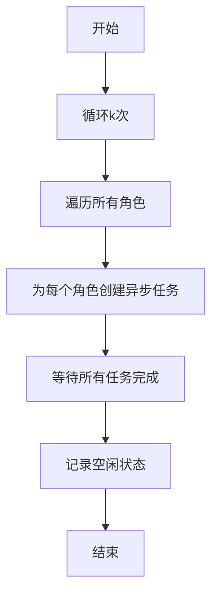
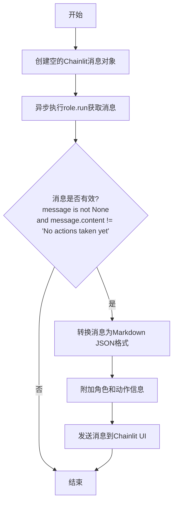

# `.\MetaGPT\examples\ui_with_chainlit\init_setup.py` 详细设计文档

该代码定义了一个名为 ChainlitEnv 的类，它继承自 MetaGPT 的 Environment 类，专门用于与 Chainlit UI 框架集成。其核心功能是重写环境运行逻辑，在异步执行各个角色（Role）的任务时，将角色执行过程中产生的消息（特别是来自 `_act` 方法的动作输出）通过 Chainlit 的消息流实时推送到前端用户界面，并以 Markdown 格式美化 JSON 内容，从而在 Chainlit 应用中可视化展示智能体（Agent）的协作过程。

## 整体流程

```mermaid
graph TD
    A[ChainlitEnv.run(k) 开始] --> B[循环 k 次]
    B --> C[遍历所有角色]
    C --> D[为每个角色调用 _chainlit_role_run]
    D --> E[创建 Chainlit 空消息对象]
    E --> F[异步执行 role.run()]
    F --> G{role.run() 返回有效消息?}
    G -- 是 --> H[调用 _convert_message_to_markdownjson 格式化消息]
    H --> I[在消息后追加动作和角色信息]
    I --> J[通过 Chainlit 发送消息到 UI]
    G -- 否 --> K[结束此角色运行]
    J --> K
    K --> L{所有角色本轮运行完成?}
    L -- 否 --> C
    L -- 是 --> M[记录环境空闲状态]
    M --> N{已完成 k 次循环?}
    N -- 否 --> B
    N -- 是 --> O[ChainlitEnv.run 结束]
```

## 类结构

```
Environment (MetaGPT 环境基类)
└── ChainlitEnv (Chainlit UI 集成环境)
```

## 全局变量及字段


### `chainlit_message`
    
全局的Chainlit消息对象，用于在UI中流式传输和显示角色执行过程中的消息内容。

类型：`cl.Message`
    


    

## 全局函数及方法


### `log_llm_stream_chainlit`

这是一个全局函数，用于将大型语言模型（LLM）的流式输出消息实时推送到 Chainlit 用户界面（UI）中。它作为日志回调函数被注册到 MetaGPT 框架中，使得 LLM 生成文本的过程能够以流式、渐进的方式在 UI 上展示。

参数：

-  `msg`：`str`，需要流式输出到 UI 的单个消息片段（通常是一个词或标记）。

返回值：`None`，此函数不返回任何值。

#### 流程图

```mermaid
flowchart TD
    A[开始: 调用 log_llm_stream_chainlit(msg)] --> B{检查 Chainlit 上下文};
    B -- 存在 --> C[调用 cl.run_sync<br>执行异步流式写入];
    C --> D[将 `msg` 写入<br>全局变量 `chainlit_message`];
    D --> E[结束];
    B -- 不存在/出错 --> F[静默结束或记录错误];
    F --> E;
```

#### 带注释源码

```python
def log_llm_stream_chainlit(msg):
    # Stream the message token into Chainlit UI.
    # 将消息标记流式传输到 Chainlit UI。
    # 使用 `cl.run_sync` 来在同步函数中调用 Chainlit 的异步 API `stream_token`。
    # `chainlit_message` 是一个在 `_chainlit_role_run` 方法中定义的全局变量，代表当前活动的 Chainlit 消息对象。
    cl.run_sync(chainlit_message.stream_token(msg))
```


### `ChainlitEnv.run`

该方法用于处理一次所有角色的运行，通过异步方式并发执行每个角色的任务，并在Chainlit UI中展示运行结果。

参数：

- `self`：`ChainlitEnv`，ChainlitEnv实例
- `k`：`int`，运行次数，默认为1

返回值：`None`，无返回值

#### 流程图



#### 带注释源码

```python
async def run(self, k=1):
    """处理一次所有信息的运行
    Process all Role runs at once
    """
    for _ in range(k):  # 循环k次，每次处理所有角色的运行
        futures = []  # 存储异步任务
        for role in self.roles.values():  # 遍历所有角色
            # Call role.run with chainlit configuration
            future = self._chainlit_role_run(role=role)  # 为每个角色创建异步任务
            futures.append(future)

        await asyncio.gather(*futures)  # 并发执行所有异步任务
        logger.debug(f"is idle: {self.is_idle}")  # 记录环境空闲状态
```

### `ChainlitEnv._chainlit_role_run`

该方法用于在Chainlit环境中运行一个特定的角色（Role）。它会创建一个Chainlit消息对象，执行角色的`run`方法获取消息，如果消息有效（非空且内容不是"未采取任何行动"），则将其转换为Markdown JSON格式以便在UI中清晰展示，并附加角色和动作信息，最后发送到Chainlit UI。

参数：

- `role`：`Role`，要运行的MetaGPT角色对象

返回值：`None`，无返回值

#### 流程图



#### 带注释源码

```python
async def _chainlit_role_run(self, role: Role) -> None:
    """To run the role with chainlit config

    Args:
        role (Role): metagpt.role.Role
    """
    # 声明全局变量chainlit_message，用于在UI中流式传输消息
    global chainlit_message
    # 创建一个新的Chainlit消息对象，初始内容为空
    chainlit_message = cl.Message(content="")

    # 异步执行角色的run方法，获取角色执行后产生的消息
    message = await role.run()
    # 检查消息是否有效：非空且不是“未采取任何行动”的占位符
    if message is not None and message.content != "No actions taken yet":
        # 如果消息来自role._act()，将其转换为Markdown JSON格式以便在UI中清晰展示
        chainlit_message.content = await self._convert_message_to_markdownjson(message=chainlit_message.content)

        # 在消息内容后附加执行该动作的角色和具体的动作名称
        chainlit_message.content += f"---\n\nAction: `{any_to_name(message.cause_by)}` done by `{role._setting}`."

        # 将处理后的消息异步发送到Chainlit UI
        await chainlit_message.send()
```

### `ChainlitEnv._convert_message_to_markdownjson`

该方法用于检查传入的消息字符串是否来自MetaGPT的Action节点输出。如果是，则将其格式化为Markdown代码块中的JSON格式，以便在Chainlit UI中获得更清晰、语法高亮的显示效果；如果不是，则原样返回该消息。

参数：

- `message`：`str`，由`role._act()`方法生成的消息字符串。

返回值：`str`，处理后的消息字符串。如果原始消息以`[CONTENT]`开头，则返回包裹在Markdown JSON代码块中的格式；否则返回原始消息。

#### 流程图

```mermaid
flowchart TD
    A[开始: 接收消息字符串] --> B{消息是否以<br>“[CONTENT]”开头?}
    B -- 是 --> C[将消息包裹在<br>Markdown JSON代码块中]
    C --> D[返回格式化后的消息]
    B -- 否 --> E[直接返回原始消息]
    E --> D
```

#### 带注释源码

```python
async def _convert_message_to_markdownjson(self, message: str) -> str:
    """If the message is from MetaGPT Action Node output, then
    convert it into markdown json for clear view in UI.

    Args:
        message (str): message by role._act

    Returns:
        str: message in mardown from
    """
    # 检查消息是否以特定标记“[CONTENT]”开头，这通常标识消息来自Action节点
    if message.startswith("[CONTENT]"):
        # 如果是，则使用Markdown的代码块语法（指定语言为json）包裹消息，以美化UI显示
        return f"```json\n{message}\n```\n"
    # 如果不是，则原封不动地返回消息
    return message
```

## 关键组件


### Chainlit 环境集成

一个自定义的 `Environment` 子类，用于将 MetaGPT 框架与 Chainlit UI 进行集成，主要负责在角色执行动作时，将生成的消息内容流式传输并格式化显示到 Chainlit 用户界面中。

### 异步角色运行与消息处理

通过 `_chainlit_role_run` 方法异步执行单个角色的 `run` 方法，捕获其产生的消息，并调用 `_convert_message_to_markdownjson` 方法对特定格式的消息进行美化处理，最后将包含角色和动作信息的完整消息发送到 Chainlit UI。

### 消息格式转换

通过 `_convert_message_to_markdownjson` 方法实现，用于识别并转换来自 MetaGPT Action Node 的特定格式消息（以 `[CONTENT]` 开头），将其包装为 Markdown 代码块中的 JSON 格式，以便在 UI 中获得更清晰、结构化的展示效果。

### LLM 流式日志重定向

通过 `set_llm_stream_logfunc` 函数，将 MetaGPT 内部大语言模型（LLM）的流式输出日志重定向到自定义的 `log_llm_stream_chainlit` 函数，该函数将每个输出令牌（token）实时流式传输到 Chainlit UI 的当前消息中，实现生成过程的实时可视化。


## 问题及建议


### 已知问题

-   **全局变量 `chainlit_message` 的使用**：在 `_chainlit_role_run` 方法中，`chainlit_message` 被声明为全局变量，并在方法内部赋值。这种模式在多角色并发运行时可能导致数据竞争和状态混乱，因为每个角色的运行都会覆盖这个全局变量。
-   **硬编码的字符串判断逻辑**：`_chainlit_role_run` 方法中通过检查 `message.content != "No actions taken yet"` 来判断是否发布消息。这个逻辑依赖于 `Role.run()` 方法内部返回的特定字符串，属于紧耦合，如果 `Role` 类的实现改变，此逻辑可能失效。
-   **潜在的阻塞操作**：`log_llm_stream_chainlit` 函数中使用了 `cl.run_sync(chainlit_message.stream_token(msg))` 来同步调用异步方法。虽然 `run_sync` 是 Chainlit 提供的工具，但在某些高并发或复杂事件循环场景下，可能引入潜在的阻塞风险或死锁。
-   **异常处理缺失**：代码中没有对 `role.run()`、`cl.run_sync` 或 `await chainlit_message.send()` 等可能抛出异常的操作进行捕获和处理。这可能导致程序在遇到网络问题、UI 连接中断或角色执行错误时直接崩溃。
-   **日志流函数设置时机**：`set_llm_stream_logfunc(func=log_llm_stream_chainlit)` 在模块导入时立即执行。如果此模块被导入但不打算使用 Chainlit 环境，或者在其他环境（如测试环境）中导入，可能会产生不必要的副作用或错误。

### 优化建议

-   **移除全局变量，使用实例变量或局部变量**：将 `chainlit_message` 作为 `ChainlitEnv` 类的实例属性，或者在 `_chainlit_role_run` 方法内部作为局部变量创建和使用，以避免并发环境下的状态污染。
-   **解耦消息判断逻辑**：建议通过检查消息对象本身的属性（例如 `message` 是否为 `None`，或者 `message.cause_by` 是否有效）来判断是否需要发布，而不是依赖特定的字符串内容。或者，让 `Role` 类提供一个更明确的状态标志。
-   **审查并优化同步调用**：评估 `cl.run_sync` 的使用是否必要。如果可能，尝试重构 `log_llm_stream_chainlit` 为异步函数，并直接使用 `await chainlit_message.stream_token(msg)`，以保持完全的异步上下文。
-   **增加健壮的异常处理**：在 `run` 和 `_chainlit_role_run` 方法中，使用 `try...except` 块包裹可能失败的操作。记录异常日志，并考虑优雅降级（例如，跳过失败的角色运行，而不是停止整个环境）。
-   **延迟或条件化日志函数设置**：将 `set_llm_stream_logfunc` 的调用移至 `ChainlitEnv` 的初始化方法（如 `__init__`）中，或者提供一个显式的 `setup` 方法。这样，日志流的配置可以与环境的生命周期绑定，避免模块导入时的副作用。
-   **考虑性能与可观测性**：在 `run` 方法中，所有角色的 `future` 被一次性 `gather`。可以考虑增加超时控制，或者为每个角色的执行添加独立的日志和监控点，以便更好地追踪和调试并发任务。


## 其它


### 设计目标与约束

本模块的核心设计目标是将MetaGPT框架与Chainlit UI框架进行集成，使得MetaGPT中智能体（Role）的运行过程、交互信息和最终结果能够实时地、结构化地展示在Chainlit提供的Web用户界面中。主要约束包括：1) 必须适配MetaGPT原有的异步运行模型和消息传递机制；2) 需要将内部的消息格式（如`[CONTENT]`开头的动作输出）转换为适合前端展示的格式（如Markdown JSON）；3) 集成过程需保持非侵入性，通过继承和重写关键方法实现，避免修改MetaGPT核心代码。

### 错误处理与异常设计

当前代码中显式的错误处理机制较为有限。`_chainlit_role_run`和`_convert_message_to_markdownjson`方法内部没有使用`try-except`块来捕获可能出现的异常（例如，`role.run()`可能抛出异常，`cl.Message`或`cl.run_sync`操作可能因Chainlit上下文问题而失败）。这可能导致未处理的异常向上层传播，中断整个运行流程。建议增加异常捕获，至少进行日志记录，并考虑是否允许其他角色继续运行。`log_llm_stream_chainlit`函数直接调用`cl.run_sync`，若在非Chainlit异步上下文中调用可能导致错误。

### 数据流与状态机

数据流始于`ChainlitEnv.run`方法，它并发启动所有角色的`_chainlit_role_run`任务。每个角色的任务流为：创建Chainlit消息占位符 -> 调用`role.run()`执行角色逻辑 -> 接收返回的`Message`对象 -> 格式化消息内容（通过`_convert_message_to_markdownjson`）并附加执行者信息 -> 将最终内容发送到Chainlit UI。关键状态包括：`chainlit_message`（全局变量，存储当前角色的UI消息对象）、`self.roles`（环境中的角色集合）、`self.is_idle`（环境空闲状态）。消息（`Message`对象）是核心数据载体，其`content`和`cause_by`属性被用于生成UI展示内容。

### 外部依赖与接口契约

1.  **MetaGPT框架**：强依赖。包括`Environment`、`Role`、`logger`、`set_llm_stream_logfunc`、`any_to_name`。需遵循`Environment`的接口约定（如`run`方法），并理解`Role.run()`的返回类型（`Message`或`None`）和`Message`对象的属性。
2.  **Chainlit框架**：强依赖。包括`cl.Message`、`cl.run_sync`、`cl`模块的全局上下文。代码假设在正确的Chainlit会话/上下文中执行，`cl.Message`用于构建前端消息，`cl.run_sync`用于在异步函数中调用同步的UI更新函数。
3.  **asyncio**：标准库依赖。用于管理异步任务（`asyncio.gather`），实现角色的并发执行。
4.  **全局变量`chainlit_message`**：这是一个脆弱的接口点。它在`_chainlit_role_run`中被赋值，并在`log_llm_stream_chainlit`中被读取。这要求这两个函数必须在同一个任务/调用链中顺序执行，且期间没有其他并发任务修改此变量，否则会导致数据竞争或不一致。这是一种基于共享全局状态的隐式耦合，构成了模块内部的关键契约，但也是潜在的风险点。

### 并发与线程安全

模块利用`asyncio.gather`实现角色的并发运行，这是主要并发场景。然而，使用**全局变量`chainlit_message`** 在并发环境下是**不安全**的。当多个`_chainlit_role_run`任务并发执行时，它们会竞争读写这个全局变量，导致某个角色的LLM流输出可能被发送到另一个角色的Chainlit消息中，或者消息内容被覆盖。`log_llm_stream_chainlit`函数可能被多个并发的LLM流调用，进一步加剧了竞争条件。这是当前设计中的一个严重缺陷。

### 配置与可扩展性

当前集成方式是硬编码的：`ChainlitEnv`直接继承并重写`Environment`，LLM流日志函数通过`set_llm_stream_logfunc`全局设置。这缺乏配置灵活性。例如，无法在不修改代码的情况下选择性地启用或禁用UI集成，或者切换不同的消息格式化方式。可扩展性方面，增加新的消息类型或展示格式需要修改`_convert_message_to_markdownjson`方法。可以考虑将UI处理器、消息格式化器等设计为可插拔的组件，通过配置或依赖注入的方式接入。

### 测试策略建议

1.  **单元测试**：应针对`_convert_message_to_markdownjson`方法编写测试，验证其对`[CONTENT]`开头和普通消息的处理是否正确。可以模拟`Role`和`Message`对象来测试`_chainlit_role_run`的逻辑分支（有消息/无消息）。
2.  **集成测试**：需要测试与Chainlit的集成。这可以通过模拟（Mock）`cl.Message`和`cl.run_sync`等Chainlit对象来实现，验证正确的调用序列和参数传递，而无需启动真实的UI。
3.  **并发测试**：至关重要。需要模拟多个角色并发运行的场景，以暴露和验证全局变量`chainlit_message`导致的竞态问题。测试应检查每个角色的输出是否被正确关联到其对应的UI消息。
4.  **异常处理测试**：模拟`role.run()`抛出异常、Chainlit API调用失败等情况，验证系统的健壮性和错误日志记录。

    