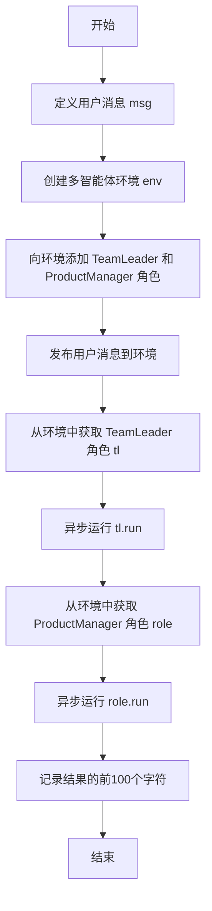
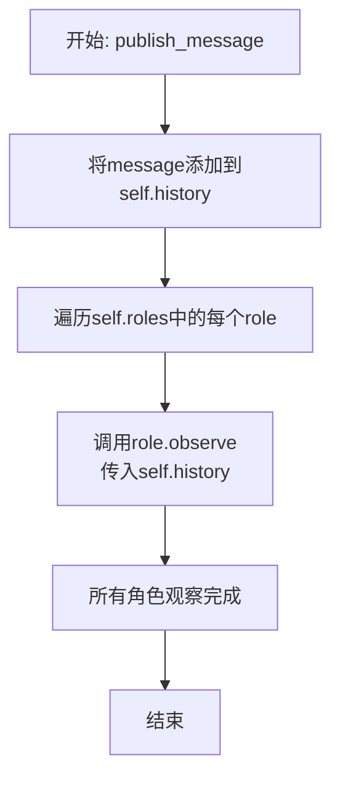
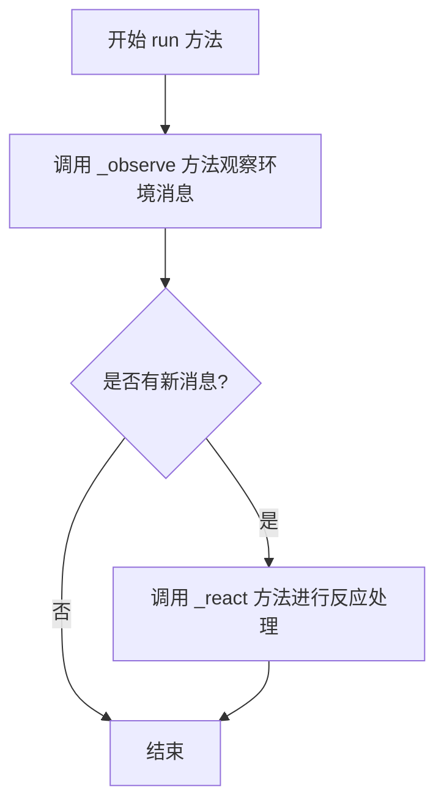

# `.\MetaGPT\examples\use_off_the_shelf_agent.py` 详细设计文档

该代码是一个使用MetaGPT框架的示例，核心功能是演示如何利用预构建的智能体（Agent）角色（如团队领导、产品经理）在模拟环境中协作，以响应用户需求（例如“为贪吃蛇游戏撰写产品需求文档”），并展示其运行结果。

## 整体流程

```mermaid
graph TD
    A[开始: 异步主函数 main] --> B[创建消息对象 Message]
    B --> C[创建MGXEnv环境实例]
    C --> D[向环境中添加TeamLeader和ProductManager角色]
    D --> E[向环境发布用户消息]
    E --> F[从环境中获取TeamLeader角色]
    F --> G[异步执行TeamLeader.run()]
    G --> H[从环境中获取ProductManager角色]
    H --> I[异步执行ProductManager.run(msg)]
    I --> J[记录并输出结果的前100个字符]
    J --> K[结束]
```

## 类结构

```
MetaGPT 示例脚本
├── 全局函数: main (异步)
├── 导入的类:
│   ├── MGXEnv (来自 metagpt.environment.mgx.mgx_env)
│   ├── TeamLeader (来自 metagpt.roles.di.team_leader)
│   ├── ProductManager (来自 metagpt.roles.product_manager)
│   └── Message (来自 metagpt.schema)
└── 导入的模块/函数:
    ├── asyncio (标准库)
    ├── logger (来自 metagpt.logs)
    └── ...
```

## 全局变量及字段


### `msg`
    
用户输入的初始需求消息，用于启动整个工作流程

类型：`str`
    


### `env`
    
多智能体协作环境，负责管理角色、消息路由和协调工作流

类型：`MGXEnv`
    


### `tl`
    
从环境中获取的团队领导角色实例，负责协调团队任务

类型：`TeamLeader`
    


### `role`
    
从环境中获取的产品经理角色实例，负责生成产品需求文档

类型：`ProductManager`
    


### `result`
    
产品经理角色执行后返回的消息对象，包含生成的PRD内容

类型：`Message`
    


### `Message.content`
    
消息的实际内容，例如用户需求或智能体的输出

类型：`str`
    


### `Message.role`
    
消息的发送者标识，例如'user'或智能体名称

类型：`str`
    
    

## 全局函数及方法

### `main`

该函数是示例脚本的入口点，用于演示如何使用MetaGPT框架中的现成（off-the-shelf）智能体（Agent）来协作完成一个任务。具体流程是：创建一个多智能体环境（MGXEnv），向其中添加一个团队领导（TeamLeader）和一个产品经理（ProductManager）角色，然后发布一个用户消息（“Write a PRD for a snake game”），最后触发团队领导角色的运行流程，并获取产品经理角色的运行结果进行日志输出。

参数：
- 无

返回值：`None`，该函数没有返回值。

#### 流程图



#### 带注释源码

```python
async def main():
    # 1. 定义初始任务消息：要求为“贪吃蛇”游戏编写一份产品需求文档（PRD）
    msg = "Write a PRD for a snake game"
    
    # 2. 创建一个多智能体协作环境（MGXEnv实例）
    env = MGXEnv()
    
    # 3. 向环境中添加两个预定义的智能体角色：团队领导（TeamLeader）和产品经理（ProductManager）
    env.add_roles([TeamLeader(), ProductManager()])
    
    # 4. 将用户消息封装成Message对象，并发布到环境中，作为任务的起点
    env.publish_message(Message(content=msg, role="user"))
    
    # 5. 从环境中获取名为“Mike”的角色（根据代码上下文，应为之前添加的TeamLeader实例）
    tl = env.get_role("Mike")
    # 6. 异步执行团队领导角色的主运行逻辑，这通常会触发团队内的协作流程
    await tl.run()

    # 7. 从环境中获取名为“Alice”的角色（根据代码上下文，应为之前添加的ProductManager实例）
    role = env.get_role("Alice")
    # 8. 异步执行产品经理角色的主运行逻辑，并传入初始消息。此操作预期会生成PRD内容。
    result = await role.run(msg)
    
    # 9. 将产品经理生成的结果内容的前100个字符记录到日志中
    logger.info(result.content[:100])
```

### `MGXEnv.add_roles`

该方法用于向`MGXEnv`环境实例中添加一个或多个角色（`Role`）对象。它会遍历传入的角色列表，将每个角色注册到环境中，并建立角色与环境之间的双向关联。

参数：
- `roles`：`list[Role]`，一个包含要添加到环境中的`Role`实例的列表。

返回值：`None`，此方法不返回任何值。

#### 流程图

```mermaid
flowchart TD
    A[开始: add_roles(roles)] --> B{遍历 roles 列表};
    B --> C[获取当前角色 r];
    C --> D[将角色 r 注册到环境<br>self._register_role(r)];
    D --> E[建立角色与环境的关联<br>r.set_env(self)];
    E --> F{列表中还有下一个角色吗?};
    F -- 是 --> C;
    F -- 否 --> G[结束];
```

#### 带注释源码

```python
def add_roles(self, roles: list[Role]):
    """
    向环境中添加角色。
    遍历角色列表，为每个角色调用 _register_role 方法进行注册，
    并设置角色的环境为当前环境实例。
    
    Args:
        roles (list[Role]): 要添加到环境中的角色对象列表。
    """
    # 遍历传入的角色列表
    for role in roles:
        # 将当前角色注册到当前环境实例中
        # 此方法内部应处理角色的存储或索引逻辑
        self._register_role(role)
        # 设置当前角色的环境属性为 self（即这个 MGXEnv 实例）
        # 这使得角色能够感知并与其所在的环境进行交互
        role.set_env(self)
```

### `MGXEnv.publish_message`

该方法用于在MGXEnv环境中发布一条消息，将消息添加到环境的消息历史中，并触发环境中所有角色的观察动作，使它们能够感知到新消息。

参数：

- `message`：`Message`，要发布的消息对象，包含消息内容、发送者等信息。

返回值：`None`，无返回值。

#### 流程图



#### 带注释源码

```python
def publish_message(self, message: Message):
    """
    发布消息到环境，并让所有角色观察。
    
    参数:
        message (Message): 要发布的消息对象。
    """
    # 将新消息添加到环境的历史消息记录中
    self.history.add_message(message)
    # 遍历环境中的所有角色
    for role in self.roles:
        # 让每个角色观察当前环境中的全部历史消息
        role.observe(self.history)
```

### `MGXEnv.get_role`

该方法用于从环境中根据角色名称获取对应的角色实例。

参数：

- `name`：`str`，要查找的角色名称

返回值：`Role`，返回与名称匹配的角色实例，如果未找到则返回 `None`

#### 流程图

```mermaid
flowchart TD
    A[开始] --> B{name 是否在 self.roles 中?}
    B -- 是 --> C[返回 self.roles[name]]
    B -- 否 --> D[返回 None]
    C --> E[结束]
    D --> E
```

#### 带注释源码

```python
def get_role(self, name: str) -> Role:
    """
    根据角色名称获取角色实例。

    Args:
        name (str): 要查找的角色名称。

    Returns:
        Role: 与名称匹配的角色实例，如果未找到则返回 None。
    """
    return self.roles.get(name)  # 从字典中获取对应名称的角色，不存在则返回 None
```

### `TeamLeader.run`

该方法用于启动团队领导者的工作流程，使其在环境中执行其角色职责，包括处理消息、协调团队成员、生成输出等。

参数：
- 无显式参数（实例方法，通过 `self` 访问实例属性）

返回值：`None`，无返回值

#### 流程图



#### 带注释源码

```python
async def run(self, *args, **kwargs) -> Message | None:
    """
    运行团队领导者的主要工作流程。
    该方法会观察环境中的消息，如果有新消息则触发反应处理。
    
    Args:
        *args: 可变位置参数，用于传递额外的运行参数。
        **kwargs: 可变关键字参数，用于传递额外的运行参数。
    
    Returns:
        Message | None: 返回处理后的消息对象，如果没有消息则返回 None。
    """
    # 观察环境中的消息
    await self._observe()
    # 如果有新消息，则进行反应处理
    if self._rc.news:
        # 调用 _react 方法处理消息
        return await self._react()
    # 如果没有新消息，则返回 None
    return None
```

### `ProductManager.run`

该方法用于执行产品经理角色的核心工作流程。它接收一个用户需求消息，触发产品经理的思考、行动和观察循环，最终生成并返回一个产品需求文档（PRD）消息。

参数：

- `message`：`str`，用户的需求描述，例如 "Write a PRD for a snake game"

返回值：`Message`，返回一个包含生成的产品需求文档（PRD）内容的 `Message` 对象。

#### 流程图

```mermaid
flowchart TD
    A[开始: run(message)] --> B[调用 _observe 方法<br/>接收并处理消息]
    B --> C{是否有新消息?}
    C -- 是 --> D[调用 _think 方法<br/>分析需求并制定计划]
    D --> E[调用 _act 方法<br/>执行计划，生成PRD]
    E --> F[返回生成的PRD消息]
    C -- 否 --> G[返回空消息]
    F --> H[结束]
    G --> H
```

#### 带注释源码

```python
async def run(self, message: str) -> Message:
    """
    产品经理角色的主要运行方法。
    它处理传入的消息，通过思考、行动和观察的循环来生成产品需求文档（PRD）。
    
    参数:
        message (str): 用户的需求描述。
        
    返回:
        Message: 包含生成的PRD内容的Message对象。
    """
    # 1. 观察：接收并处理外部消息
    await self._observe()
    
    # 2. 思考：如果有新消息，则分析需求并制定行动计划
    if self._rc.news:
        self._rc.news = []  # 清空新消息列表
        await self._think()
        
        # 3. 行动：执行思考阶段制定的计划，生成PRD
        await self._act()
        
        # 返回行动结果（生成的PRD消息）
        return self._rc.memory.get_by_action(self._act_prefix)[-1]
    
    # 如果没有新消息，则返回一个空的Message对象
    return Message(content="No new message to process.", role=self.profile)
```

## 关键组件


### MGXEnv

一个用于管理和协调多个智能体角色的环境类，提供角色注册、消息发布和角色检索等功能。

### TeamLeader

一个智能体角色，负责在团队中担任领导职责，可能涉及任务分配、协调和决策。

### ProductManager

一个智能体角色，负责产品管理相关任务，例如根据需求编写产品需求文档（PRD）。

### Message

一个消息类，用于在智能体之间传递信息，包含内容、发送者角色等属性。

### asyncio

Python的异步I/O框架，用于支持并发执行异步任务，在本代码中用于运行异步的main函数。


## 问题及建议


### 已知问题

-   **角色名称硬编码**：代码中通过字符串 `"Mike"` 和 `"Alice"` 来获取特定角色。这种硬编码方式使得代码与具体的角色名称强耦合，降低了灵活性和可维护性。如果角色名称发生变化，或者需要动态创建不同名称的角色，此段代码将无法正常工作。
-   **角色职责不明确**：代码中创建了 `TeamLeader` 和 `ProductManager` 两个角色，但最终只让 `TeamLeader` (`Mike`) 和 `ProductManager` (`Alice`) 分别运行。`TeamLeader` 的运行没有传递初始消息，而 `ProductManager` 的运行则直接使用了原始消息。这种调用方式可能不符合角色间的协作设计初衷，导致流程逻辑不清晰。
-   **消息传递流程不清晰**：代码首先通过 `env.publish_message` 发布了一条消息，但随后直接调用 `tl.run()` 而没有显式地将该消息传递给 `TeamLeader`。接着又直接调用 `role.run(msg)` 将原始消息传递给 `ProductManager`。这种混合的消息传递方式（通过环境发布和直接参数传递）使得数据流难以追踪和理解。
-   **结果处理过于简单**：仅对 `ProductManager` 的运行结果进行了简单的日志记录（截取前100个字符）。对于生产环境或复杂任务，这种处理方式可能不足以捕获完整的输出、中间状态或潜在的错误信息。
-   **缺乏错误处理**：代码中没有包含任何 `try-except` 块来处理异步操作或角色运行过程中可能抛出的异常，这可能导致程序在遇到错误时意外崩溃。

### 优化建议

-   **解耦角色获取逻辑**：建议通过角色类型（如 `TeamLeader`）或角色在环境中的索引/标识符来获取角色，而不是硬编码名称。例如，可以在添加角色时保存其引用，或通过遍历 `env.roles` 列表来查找特定类型的角色。
-   **明确角色协作流程**：重新审视并设计角色间的交互流程。确保消息通过环境（`MGXEnv`）进行传递和路由，以符合多智能体环境的协作模式。例如，让 `TeamLeader` 接收初始消息，处理后生成新的消息发布到环境，再由 `ProductManager` 响应。
-   **统一消息传递方式**：明确使用环境作为消息交换的中心枢纽。所有角色都应通过监听环境中的消息来触发其行为，而不是直接从外部接收参数。这有助于建立清晰、可扩展的通信机制。
-   **增强结果处理与日志**：对关键步骤和最终结果进行更详细的日志记录。考虑结构化输出结果，并处理可能的多轮对话或复杂输出。可以增加日志级别控制，以便在不同环境中调整日志详细程度。
-   **增加健壮性处理**：
    -   在 `main` 函数中添加异常处理，捕获并记录 `asyncio.run` 以及角色 `run` 方法中可能发生的异常。
    -   考虑为异步操作添加超时控制，防止某些角色任务长时间挂起。
    -   验证环境初始化、角色添加等操作是否成功。
-   **提高代码可配置性**：将初始消息、角色配置（如名称、数量）等提取为配置文件或命令行参数，使示例代码更容易被复用和测试。
-   **补充文档与注释**：在关键步骤（如环境初始化、消息发布、角色运行）添加注释，说明其设计意图和在整体流程中的作用，以提升代码的可读性。


## 其它


### 设计目标与约束

本代码示例旨在展示如何使用MetaGPT框架的现成（off-the-shelf）智能体（Agent）来协作完成一个简单的任务。其核心设计目标是**演示性**和**易用性**，而非构建一个生产级的复杂系统。主要约束包括：1) 使用框架预定义的`TeamLeader`和`ProductManager`角色；2) 使用`MGXEnv`作为轻量级协作环境；3) 任务流程被简化为顺序触发，以清晰展示从用户输入到角色执行的链路。

### 错误处理与异常设计

当前代码示例中错误处理较为简单。主要依赖Python的默认异常机制和`asyncio.run()`的顶层捕获。潜在的异常点包括：1) `env.add_roles`时角色名冲突；2) `env.get_role`时角色不存在；3) `role.run()`执行过程中角色内部逻辑出错。示例代码未显式处理这些异常，在实际应用中需要根据框架提供的错误类型（如`RoleNotFoundError`）进行捕获和处理，并添加适当的日志记录。

### 数据流与状态机

1.  **数据流**：
    *   **输入**：用户消息`"Write a PRD for a snake game"`作为初始`Message`对象。
    *   **处理**：消息被发布到`MGXEnv`。环境驱动`TeamLeader`角色运行，其内部可能触发与`ProductManager`的交互（虽然示例中未直接展示交互细节，但根据角色设计，TL可能会分配任务）。随后，代码显式获取`ProductManager`角色并运行。
    *   **输出**：`ProductManager`角色的运行结果（PRD内容的前100个字符）被记录到日志。
2.  **状态机**：
    *   环境(`MGXEnv`)维护着角色列表和消息队列。
    *   每个角色（如`TeamLeader`, `ProductManager`）是一个独立的状态机，其`run`方法触发其内部行为（如思考、行动、观察）。在本示例的线性调用中，角色状态机的转换是顺序且独立的。

### 外部依赖与接口契约

1.  **外部依赖**：
    *   **MetaGPT框架**：核心依赖，提供了`MGXEnv`、`Role`基类（`TeamLeader`, `ProductManager`是其子类）、`Message`数据类以及`logger`。
    *   **asyncio**：Python标准库，用于支持异步执行。
2.  **接口契约**：
    *   `MGXEnv.add_roles(roles)`: 接受一个角色列表，将其加入环境。
    *   `MGXEnv.publish_message(message)`: 接受一个`Message`对象，将其发布到环境的消息系统。
    *   `MGXEnv.get_role(name)`: 根据角色名称返回对应的角色实例。
    *   `Role.run([message])`: 角色的主要行为接口。示例中`TeamLeader.run()`无参数，`ProductManager.run(msg)`接受一个消息字符串。具体的参数契约由各角色子类定义。
    *   `Message(content, role)`: 构建消息对象的契约，需要内容和发送者角色信息。

### 并发与异步模型

代码明确采用了**异步编程模型**。主函数`main`被定义为`async`，并使用`asyncio.run()`启动。角色（`tl`, `role`）的`run`方法也通过`await`进行调用。这表明MetaGPT框架内部可能利用异步来处理潜在的I/O操作（如LLM调用）、角色间的并发执行或事件循环。然而，在此特定示例中，`tl.run()`和`role.run()`是顺序`await`的，并未展示真正的并发执行。

### 配置与初始化

示例中的配置是**硬编码**和**最小化的**：
1.  环境初始化：`env = MGXEnv()`使用默认配置。
2.  角色初始化：`TeamLeader()`和`ProductManager()`使用默认参数实例化。在实际场景中，这些角色可能需要配置特定的LLM模型、系统提示词或其他参数。
3.  消息初始化：`Message(content=msg, role="user")`直接构造。
代码未展示从配置文件、环境变量或命令行参数读取配置的能力，这在实际项目中通常是必要的。

### 可观测性与日志

1.  **日志记录**：通过`metagpt.logs.logger`进行。示例中仅记录了最终结果的前100个字符(`logger.info(result.content[:100])`)。框架内部和角色行为可能在不同级别（DEBUG, INFO, WARNING, ERROR）产生更详细的日志，但示例未启用。
2.  **监控与追踪**：示例代码未涉及。在复杂的多智能体系统中，可能需要追踪消息的传递路径、角色的决策过程、任务执行状态和性能指标，这需要额外的埋点或与可观测性框架集成。

    