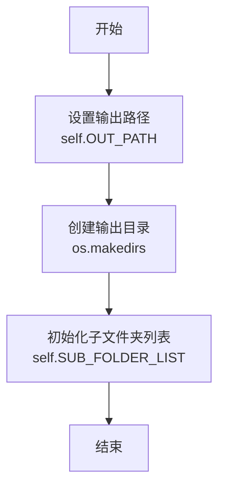
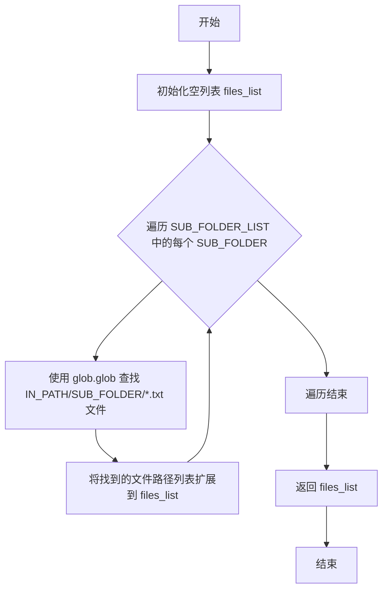
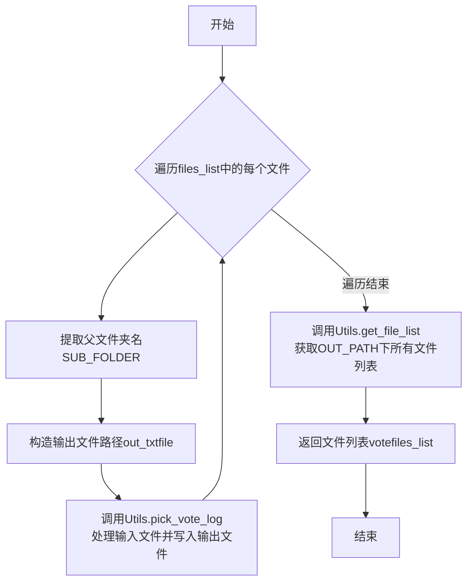
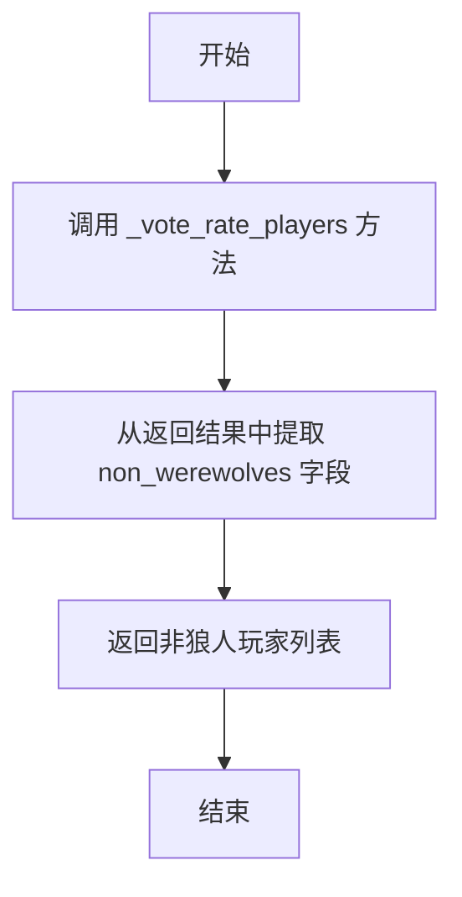
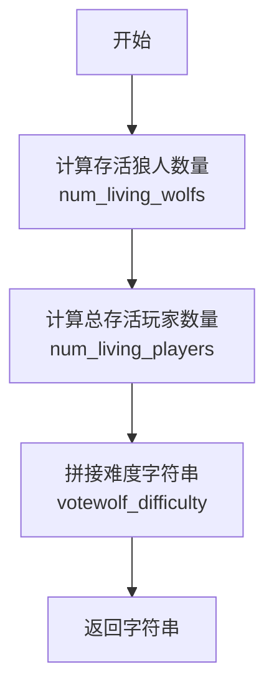
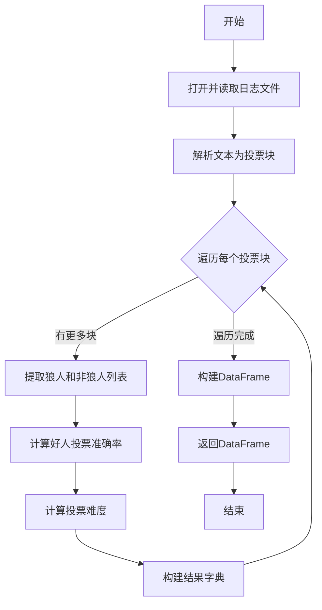
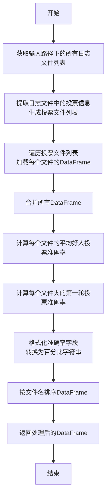
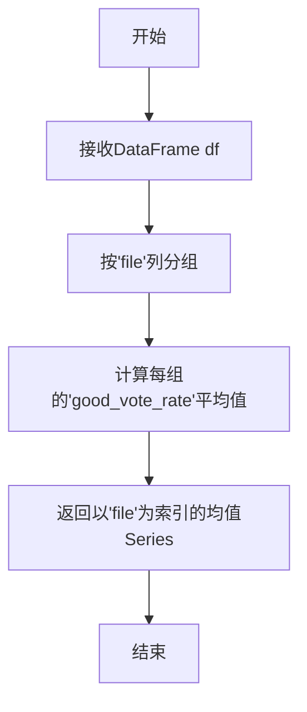
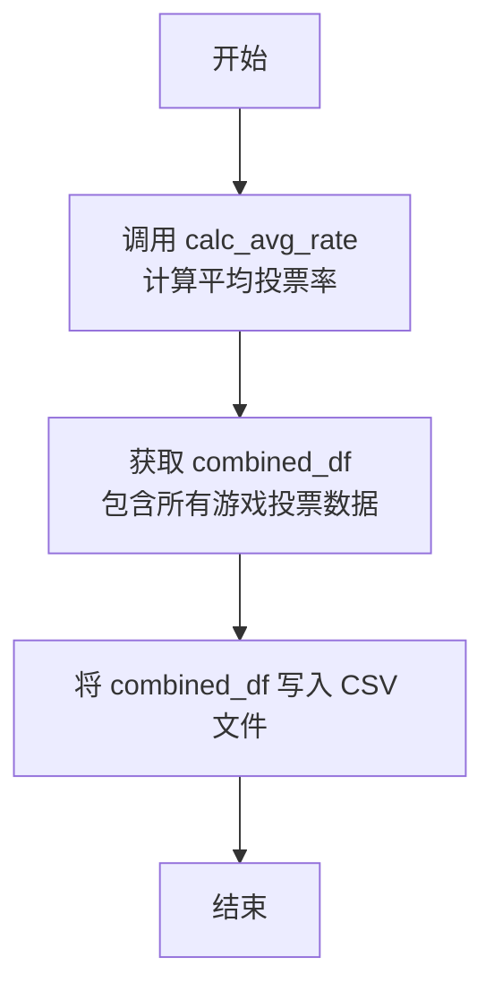

# `.\MetaGPT\examples\werewolf_game\evals\eval.py` 详细设计文档

该代码是一个用于评估狼人杀游戏中非狼人玩家（好人阵营）投票准确率的分析工具。它从游戏日志文件中提取投票记录，解析每个投票轮次中玩家的角色和投票目标，计算好人阵营正确投票给狼人的比例（good_vote_rate），并最终生成包含每局游戏、每个投票轮次详细统计结果的CSV报告。

## 整体流程

```mermaid
graph TD
    A[开始] --> B[初始化Vote类]
    B --> C[调用get_eval_csv]
    C --> D[调用calc_avg_rate]
    D --> E[调用_get_log_fileslist获取日志文件列表]
    E --> F[调用extract_votes_from_logs提取投票日志]
    F --> G[对每个日志文件调用get_result_df]
    G --> H[读取文件内容]
    H --> I[调用parse_vote_text2chunks分割投票轮次]
    I --> J[对每个投票轮次chunk]
    J --> K[调用_vote_rate_players分析投票]
    K --> L[计算good_vote_rate, 识别狼人/非狼人]
    L --> M[构建结果字典]
    M --> N[合并所有结果到DataFrame]
    N --> O[计算每局游戏平均投票率(avg_rate)]
    O --> P[计算首轮投票率(vote1_rate)]
    P --> Q[格式化比率数据]
    Q --> R[保存最终结果到CSV文件]
    R --> S[结束]
```

## 类结构

```
Vote (投票评估主类)
├── __init__ (初始化输出路径和子文件夹列表)
├── _get_log_fileslist (获取日志文件列表)
├── extract_votes_from_logs (从日志中提取投票记录)
├── parse_vote_text2chunks (静态方法，解析投票文本为轮次块)
├── _vote_rate_players (核心分析：计算好人投票率，识别角色)
├── get_goodteam_vote_rate (获取好人投票率)
├── get_werewolves (获取狼人列表)
├── get_non_werewolves (获取非狼人列表)
├── get_votewolf_difficulty (计算投票难度)
├── get_result_df (生成单个文件的投票结果DataFrame)
├── calc_avg_rate (计算平均投票率并整合所有数据)
├── _calc_vote1_rates (计算首轮投票率)
├── _load_df_from_file (加载单个文件的DataFrame)
├── _calculate_mean_rates (计算每局游戏的平均投票率)
├── _format_rates (格式化比率为百分比字符串)
└── get_eval_csv (主入口：执行完整评估流程并输出CSV)
```

## 全局变量及字段


### `IN_PATH`
    
输入日志文件的根目录路径，包含多个子文件夹（如'01-10'）用于评估。

类型：`pathlib.Path`
    


### `EVAL_RESULT`
    
最终评估结果CSV文件的输出路径。

类型：`pathlib.Path`
    


### `Vote.OUT_PATH`
    
类内部使用的输出目录路径，用于存储中间处理结果（如提取的投票文本文件）。

类型：`pathlib.Path`
    


### `Vote.SUB_FOLDER_LIST`
    
预定义的子文件夹名称列表，用于组织输入日志文件（例如按游戏轮次分组）。

类型：`list[str]`
    
    

## 全局函数及方法

### `Vote.__init__`

该方法用于初始化 `Vote` 类的实例，主要功能是设置输出目录路径并确保该目录存在，同时初始化子文件夹列表。

参数：

- 无显式参数（`self` 为实例自身引用）

返回值：`None`，无返回值

#### 流程图



#### 带注释源码

```python
def __init__(self):
    # 设置输出目录路径，使用默认工作空间根目录下的 "outputs" 文件夹
    self.OUT_PATH = DEFAULT_WORKSPACE_ROOT / "outputs"
    # 确保输出目录存在，如果不存在则创建
    os.makedirs(self.OUT_PATH, exist_ok=True)
    # 初始化子文件夹列表，用于后续日志文件的分类处理
    self.SUB_FOLDER_LIST = ["01-10", "11-20", "21-30"]
```

### `Vote._get_log_fileslist`

该方法用于根据给定的输入路径和预定义的子文件夹列表，获取所有符合条件的日志文件列表。

参数：

- `IN_PATH`：`Path`，输入路径，指向包含子文件夹的父目录。

返回值：`list[str]`，返回一个字符串列表，每个字符串是一个符合条件（位于指定子文件夹下且扩展名为.txt）的日志文件的完整路径。

#### 流程图



#### 带注释源码

```python
def _get_log_fileslist(self, IN_PATH) -> list[str]:
    # 初始化一个空列表，用于存储找到的文件路径
    files_list = []
    # 遍历类中预定义的子文件夹列表（例如 ["01-10", "11-20", "21-30"]）
    for SUB_FOLDER in self.SUB_FOLDER_LIST:
        # 使用 glob.glob 查找指定子文件夹下所有 .txt 文件
        # 将 IN_PATH 与 SUB_FOLDER 拼接，并转换为字符串供 glob 使用
        # 将找到的文件路径列表扩展到 files_list 中
        files_list.extend(glob.glob(str(IN_PATH / SUB_FOLDER / "*.txt")))
    # 返回包含所有找到的 .txt 文件路径的列表
    return files_list
```

### `Vote.extract_votes_from_logs`

该方法用于处理狼人杀游戏日志文件列表。它遍历每个日志文件，调用`Utils.pick_vote_log`方法从原始日志中提取投票相关的文本片段，并将这些片段保存到新的文本文件中。最终，它返回一个包含所有生成的投票文件路径的列表。

参数：
- `files_list`：`list`，一个包含输入日志文件路径的列表。

返回值：`list`，一个包含所有生成的投票文件路径的列表。

#### 流程图



#### 带注释源码

```python
def extract_votes_from_logs(self, files_list: list):
    # 使用tqdm包装迭代过程，显示进度条
    for in_logfile in tqdm(files_list):
        # 获取输入日志文件所在的父文件夹名称（例如 "01-10"）
        SUB_FOLDER = (Path(in_logfile).parent).stem
        # 构造输出文件的路径，格式为: OUT_PATH/# {SUB_FOLDER}_{原文件名}.txt
        out_txtfile = self.OUT_PATH / "# {0}_{1}.txt".format(SUB_FOLDER, Path(in_logfile).stem)
        # 调用Utils类的pick_vote_log方法，从原始日志in_logfile中提取投票日志，并写入out_txtfile
        Utils().pick_vote_log(in_logfile, out_txtfile)
    # 处理完所有文件后，获取输出目录OUT_PATH下的所有文件列表
    votefiles_list = Utils().get_file_list(self.OUT_PATH)
    # 返回生成的投票文件路径列表
    return votefiles_list
```

### `Vote.parse_vote_text2chunks`

该方法用于解析狼人杀游戏投票日志文本，将其分割成独立的投票轮次文本块。它通过正则表达式匹配投票轮次的起始标记，将连续的日志文本按轮次切分，并返回一个字典，其中键为投票轮次标识（如 `vote_0`），值为对应轮次的完整投票文本。

参数：

- `text`：`str`，包含多轮投票记录的原始日志文本。

返回值：`dict`，一个字典，键为投票轮次标识（例如 `vote_0`），值为对应轮次的投票文本块。

#### 流程图

```mermaid
flowchart TD
    A[开始: 输入文本 text] --> B[初始化: chunks={}, chunk_id=0, last_end=0]
    B --> C[使用正则模式查找所有<br>投票轮次起始标记]
    C --> D{是否找到匹配?}
    D -- 是 --> E[提取从last_end到<br>当前匹配起始处的文本作为块]
    E --> F[将块存入chunks<br>键为'vote_{chunk_id}']
    F --> G[更新last_end为当前匹配结束位置<br>chunk_id加1]
    G --> C
    D -- 否 --> H[提取last_end到文本末尾的<br>剩余文本作为最终块]
    H --> I{最终块是否非空?}
    I -- 是 --> J[将最终块存入chunks<br>键为'vote_{chunk_id}']
    I -- 否 --> K[结束]
    J --> K
    K --> L[返回chunks字典]
```

#### 带注释源码

```python
    @staticmethod
    def parse_vote_text2chunks(text: str):
        """
        parse each game vote log into text chunks

        one chunk example:
        ['Player1', 'Player2', 'Player3', 'Player5', 'Player6']. Say ONLY: I vote to eliminate ...
        Player1(Witch): 49 | I vote to eliminate Player5
        Player2(Villager): 49 | I vote to eliminate Player5
        Player3(Villager): 49 | I vote to eliminate Player5
        Player5(Werewolf): 49 | I vote to eliminate Player6
        Player6(Seer): 49 | I vote to eliminate Player5
        """
        # 定义正则表达式模式，用于匹配投票轮次的起始行。
        # 该行格式为：['Player1', ...]. Say ONLY: I vote to eliminate ...
        pattern = re.compile(r"""\[([^\]]+)\]. Say ONLY: I vote to eliminate ...""")
        # 初始化字典，用于存储分割后的文本块。
        chunks = {}
        # 初始化块ID计数器。
        chunk_id = 0
        # 记录上一个匹配结束的位置，用于文本切片。
        last_end = 0
        # 遍历文本中所有匹配到的投票轮次起始标记。
        for match in pattern.finditer(text):
            # 当前匹配的起始位置。
            start = match.start()
            # 提取从上一次匹配结束到当前匹配开始之间的文本作为一个完整的投票轮次块。
            chunk = text[last_end:start]
            # 将块存入字典，键名为'vote_{chunk_id}'，并去除首尾空白字符。
            chunks[f"vote_{chunk_id}"] = chunk.strip()
            # 更新last_end为当前匹配的结束位置，为下一次切片做准备。
            last_end = match.end()
            # 块ID自增，准备处理下一个块。
            chunk_id += 1
        # 处理文本末尾最后一段（在最后一个匹配之后）的文本。
        final_chunk = text[last_end:].strip()
        # 如果末尾文本非空，则将其作为最后一个块存入字典。
        if final_chunk:
            chunks[f"vote_{chunk_id}"] = final_chunk
        # 返回包含所有投票轮次文本块的字典。
        return chunks
```

### `Vote._vote_rate_players`

该方法用于分析狼人杀游戏投票日志文本，计算非狼人玩家（好人阵营）投票给狼人玩家的准确率，并识别出文本中所有的狼人和非狼人玩家。

参数：
- `text`：`str`，包含一轮投票详细信息的日志文本块。

返回值：`dict`，包含三个键值对的字典：
  - `"good_vote_rate"`：`float`，非狼人玩家投票给狼人玩家的准确率（保留两位小数）。
  - `"werewolves"`：`list[str]`，本轮投票中所有狼人玩家的列表。
  - `"non_werewolves"`：`list[str]`，本轮投票中所有非狼人（好人阵营）玩家的列表。

#### 流程图

```mermaid
flowchart TD
    A[开始: 输入投票文本 text] --> B[使用正则表达式提取所有投票记录]
    B --> C[遍历所有匹配项<br>识别角色为狼人的玩家]
    C --> D[得到狼人列表 werewolves]
    B --> E[遍历所有匹配项<br>识别角色非狼人的玩家]
    E --> F[得到非狼人列表 non_werewolves]
    B --> G[遍历所有匹配项<br>统计非狼人玩家<br>投票给狼人的次数]
    G --> H[得到正确投票数 correct_votes]
    F --> I[计算准确率<br>rate = correct_votes / len(non_werewolves)]
    I --> J[将准确率四舍五入到两位小数]
    D --> K[组装结果字典]
    F --> K
    J --> K
    K[返回结果字典] --> L[结束]
```

#### 带注释源码

```python
def _vote_rate_players(self, text: str):
    """
    # calculate the rate of goodteam vote werewolves
    :example:

    input:
    ['Player1', 'Player2', 'Player3', 'Player5', 'Player6']. Say ONLY: I vote to eliminate ...
    Player1(Witch): 49 | I vote to eliminate Player5
    Player2(Villager): 49 | I vote to eliminate Player5
    Player3(Villager): 49 | I vote to eliminate Player5
    Player5(Werewolf): 49 | I vote to eliminate Player6
    Player6(Seer): 49 | I vote to eliminate Player5

    output:
    werewolves:  ['Player5']
    non_werewolves: ['Player1', 'Player2', 'Player3', 'Player6']
    as you can see :Player2(Villager) and   Player3(Villager) vote to eliminate Player5(Werewolf)
    :return goodteam vote rateability: 100.00%
    """
    # 定义正则表达式，用于匹配投票行，捕获：玩家名、角色、被投票玩家名
    pattern = re.compile(r"(\w+)\(([^\)]+)\): \d+ \| I vote to eliminate (\w+)")
    
    # 步骤1: 找出所有狼人玩家
    werewolves = []
    for match in pattern.finditer(text):
        # 如果角色字段等于“WEREWOLF”的枚举值，则将该玩家加入狼人列表
        if match.group(2) == RoleType.WEREWOLF.value:
            werewolves.append(match.group(1))

    # 步骤2: 找出所有非狼人玩家（好人阵营）
    non_werewolves = []
    for match in pattern.finditer(text):
        # 如果角色字段不等于“WEREWOLF”的枚举值，则将该玩家加入非狼人列表
        if match.group(2) != RoleType.WEREWOLF.value:
            non_werewolves.append(match.group(1))
    # 计算非狼人玩家总数
    num_non_werewolves = len(non_werewolves)

    # 步骤3: 统计非狼人玩家做出的正确投票（即投票给狼人玩家）的次数
    correct_votes = 0
    for match in pattern.finditer(text):
        # 条件：投票者角色非狼人，且被投票者在狼人列表中
        if match.group(2) != RoleType.WEREWOLF.value and match.group(3) in werewolves:
            correct_votes += 1

    # 步骤4: 计算好人阵营投票准确率
    rate = correct_votes / num_non_werewolves
    # 将准确率四舍五入到两位小数
    good_vote_rate = round(rate, 2)
    
    # 步骤5: 返回包含计算结果和玩家分类的字典
    return {"good_vote_rate": good_vote_rate, "werewolves": werewolves, "non_werewolves": non_werewolves}
```

### `Vote.get_goodteam_vote_rate`

该方法用于计算并返回好人阵营（非狼人玩家）在单次投票中成功投票给狼人玩家的准确率。

参数：

- `text`：`str`，包含单次投票轮次详细信息的文本块。文本格式需符合 `_vote_rate_players` 方法中定义的正则表达式模式，即包含玩家角色、投票目标等信息。

返回值：`float`，返回一个浮点数，表示好人阵营投票给狼人的准确率。该值范围在 0.0 到 1.0 之间，已通过 `round(rate, 2)` 四舍五入保留两位小数。

#### 流程图

```mermaid
flowchart TD
    A[开始] --> B[调用 _vote_rate_players(text)]
    B --> C[从返回字典中提取 'good_vote_rate' 键的值]
    C --> D[返回该浮点数值]
    D --> E[结束]
```

#### 带注释源码

```python
def get_goodteam_vote_rate(self, text: str) -> float:
    # 调用内部方法 _vote_rate_players 处理文本，并提取其返回字典中的 'good_vote_rate' 值
    goodteam_vote_rate = self._vote_rate_players(text)["good_vote_rate"]
    # 返回计算得到的好人阵营投票准确率
    return goodteam_vote_rate
```

### `Vote.get_werewolves`

该方法用于从给定的投票日志文本中提取出所有狼人角色的玩家名称。

参数：

-  `text`：`str`，包含投票信息的文本块，格式为多行文本，每行代表一个玩家的投票信息，例如 `Player1(Witch): 49 | I vote to eliminate Player5`。

返回值：`list`，一个字符串列表，包含了所有狼人角色的玩家名称。

#### 流程图

```mermaid
graph TD
    A[开始] --> B[调用 _vote_rate_players 方法]；
    B --> C[从返回的字典中获取 'werewolves' 键对应的值]；
    C --> D[返回狼人列表]；
    D --> E[结束]；
```

#### 带注释源码

```python
def get_werewolves(self, text: str) -> list:
    # 调用内部方法 _vote_rate_players 分析文本，获取包含投票率、狼人列表和非狼人列表的字典
    werewolves_list = self._vote_rate_players(text)["werewolves"]
    # 从字典中提取并返回狼人列表
    return werewolves_list
```

### `Vote.get_non_werewolves`

该方法用于从给定的投票日志文本中提取所有非狼人玩家的列表。

参数：

- `text`：`str`，包含投票日志的文本字符串，其中记录了玩家投票信息。

返回值：`list`，返回一个字符串列表，包含所有非狼人玩家的名称。

#### 流程图



#### 带注释源码

```python
def get_non_werewolves(self, text: str) -> list:
    # 调用 _vote_rate_players 方法解析文本，获取包含非狼人玩家列表的字典
    non_werewolves_list = self._vote_rate_players(text)["non_werewolves"]
    # 返回非狼人玩家列表
    return non_werewolves_list
```

### `Vote.get_votewolf_difficulty`

该方法用于计算狼人杀游戏中“票狼难度”的字符串表示。其核心逻辑是基于当前存活的狼人数量和总存活玩家数量，计算一个表示投票淘汰狼人难度的比例字符串。

参数：

- `werewolves`：`list`，当前存活的狼人玩家列表。
- `non_werewolves`：`list`，当前存活的非狼人玩家（好人阵营）列表。

返回值：`str`，一个格式为 `_{狼人存活数} / {总存活玩家数}` 的字符串，用于表示票狼难度。

#### 流程图



#### 带注释源码

```python
def get_votewolf_difficulty(self, werewolves: list, non_werewolves: list) -> str:
    # 计算当前存活的狼人数量
    num_living_wolfs = len(werewolves)
    # 计算当前存活的玩家总数（狼人 + 非狼人）
    num_living_players = len(werewolves) + len(non_werewolves)
    # 将难度格式化为字符串，例如：当有1个狼人和5个玩家时，返回 "_1 / 5"
    votewolf_difficulty = "_{0} / {1}".format(num_living_wolfs, num_living_players)
    return votewolf_difficulty
```

### `Vote.get_result_df`

该方法用于解析狼人杀游戏投票日志文件，提取每轮投票的详细信息，并构建一个包含投票统计数据的DataFrame。它从指定的文本文件中读取投票日志，解析出每一轮投票的文本块，然后计算每轮投票中好人阵营投票给狼人的准确率、投票难度等指标，并将这些信息组织成结构化的数据。

参数：

- `out_txtfile`：`str`，投票日志文件的路径，该文件包含了游戏中的投票记录。

返回值：`pd.DataFrame`，一个包含以下列的DataFrame：
  - `folder`：日志文件所在的子文件夹名称。
  - `file`：日志文件名。
  - `vote_round`：投票轮次标识（如"vote_1"）。
  - `good_vote_rate`：好人阵营投票给狼人的准确率。
  - `total_votes`：游戏中的总投票轮数。
  - `votewolf_difficulty`：投票难度，格式为"狼人数/总存活人数"。

#### 流程图



#### 带注释源码

```python
def get_result_df(self, out_txtfile: str) -> pd.DataFrame:
    """
    解析投票日志文件，生成包含每轮投票统计信息的DataFrame。
    
    参数:
        out_txtfile (str): 投票日志文件的路径。
    
    返回:
        pd.DataFrame: 包含投票统计数据的DataFrame。
    """
    # 打开并读取日志文件内容
    with open(out_txtfile, "r") as out_file:
        text = out_file.read()
        # 将文本解析为多个投票块（每轮投票一个块）
        chunks = self.parse_vote_text2chunks(text)
        res = []  # 用于存储每轮投票的结果
        # 遍历每个投票块
        for k, v in chunks.items():
            if v != "":  # 跳过空块
                # 获取所有投票块的键列表，计算总投票轮数
                chunks_list = list(chunks.keys())
                total_votes = len(chunks_list) - 1
                # 提取当前投票块中的狼人和非狼人列表
                werewolves = self.get_werewolves(v)
                non_werewolves = self.get_non_werewolves(v)
                # 计算好人阵营投票给狼人的准确率
                good_vote_rate = self.get_goodteam_vote_rate(v)
                # 计算投票难度（狼人数/总存活人数）
                votewolf_difficulty = self.get_votewolf_difficulty(werewolves, non_werewolves)
                # 获取日志文件所在的文件夹名称
                folder = Utils().filename_to_foldername(out_txtfile)
                # 构建当前投票轮次的结果字典
                result = {
                    "folder": folder,
                    "file": Path(out_txtfile).stem + ".txt",
                    "vote_round": k,
                    "good_vote_rate": good_vote_rate,
                    "total_votes": total_votes,
                    "votewolf_difficulty": votewolf_difficulty,
                }
                res.append(result)
    # 将所有结果转换为DataFrame并返回
    df = pd.DataFrame(res)
    return df
```

### `Vote.calc_avg_rate`

该方法用于计算狼人杀游戏中非狼人阵营（好人阵营）在每一轮投票中的平均投票准确率，并生成包含详细统计信息的DataFrame。它首先从指定路径读取游戏日志文件，提取投票信息，然后计算每个游戏文件中所有投票轮次的平均好人投票准确率，以及第一轮投票的准确率，最后格式化并整合所有数据。

参数：

- `IN_PATH`：`Path`，输入路径，指向包含游戏日志子文件夹（如"01-10"、"11-20"、"21-30"）的父目录。

返回值：`pd.DataFrame`，返回一个Pandas DataFrame，包含以下列：`folder`（子文件夹名）、`file`（游戏文件名）、`vote_round`（投票轮次）、`good_vote_rate`（该轮好人投票准确率）、`total_votes`（游戏总投票轮次）、`votewolf_difficulty`（投票难度，格式为“存活狼人数/存活总人数”）、`avg_rate`（该游戏的平均好人投票准确率）、`vote1_rate`（该游戏第一轮投票的准确率，仅在第一轮显示）。

#### 流程图



#### 带注释源码

```python
def calc_avg_rate(self, IN_PATH) -> pd.DataFrame:
    """
    get avg_rate for each game
    avg_rate : the good_rate/total number of votes in the game
    vote1_rate: First Round Voting Accuracy Rate
    """
    # 1. 获取输入路径下所有子文件夹中的日志文件列表
    infiles_list = self._get_log_fileslist(IN_PATH)
    # 2. 从日志文件中提取投票信息，生成投票文件列表
    votefiles_list = self.extract_votes_from_logs(infiles_list)
    # 3. 加载每个投票文件的数据为DataFrame，并合并成一个大的DataFrame
    df_list = [self._load_df_from_file(file) for file in votefiles_list]
    combined_df = pd.concat(df_list, ignore_index=True)
    # 4. 计算每个游戏文件（file）在所有投票轮次中的平均好人投票准确率
    mean_rates = self._calculate_mean_rates(combined_df)
    # 5. 将计算出的平均准确率映射到原始DataFrame中，新增`avg_rate`列
    combined_df["avg_rate"] = combined_df["file"].map(mean_rates)
    # 6. 计算每个文件夹（folder）下所有游戏第一轮投票的平均准确率
    vote1_rates = self._calc_vote1_rates(combined_df)
    # 7. 将第一轮投票准确率映射到DataFrame中，新增`vote1_rate`列
    combined_df["vote1_rate"] = combined_df["folder"].map(vote1_rates.set_index("folder")["good_vote_rate"])
    # 8. 仅保留第一轮投票行的`vote1_rate`值，其他行设为NaN
    combined_df.loc[combined_df["vote_round"] != "vote_1", "vote1_rate"] = np.nan
    # 9. 格式化`vote1_rate`、`good_vote_rate`和`avg_rate`列为百分比字符串
    combined_df["vote1_rate"] = combined_df["vote1_rate"].apply(self._format_rates)
    combined_df["good_vote_rate"] = combined_df["good_vote_rate"].apply(self._format_rates)
    combined_df["avg_rate"] = combined_df["avg_rate"].apply(self._format_rates)
    # 10. 按文件名升序排序DataFrame
    combined_df.sort_values(["file"], ascending=True, inplace=True)
    # 11. 返回处理完成的DataFrame
    return combined_df
```

### `Vote._calc_vote1_rates`

该方法用于计算每个文件夹（`folder`）下，所有游戏日志中第一轮投票（`vote_round` 为 `"vote_1"`）的平均好人投票准确率（`good_vote_rate`）。

参数：
- `df`：`pandas.DataFrame`，包含所有投票轮次数据的DataFrame，其中必须包含 `vote_round`、`folder` 和 `good_vote_rate` 列。

返回值：`pandas.DataFrame`，一个包含两列的DataFrame：`folder`（文件夹名称）和 `good_vote_rate`（该文件夹下所有第一轮投票的平均准确率）。

#### 流程图

```mermaid
flowchart TD
    A[开始] --> B[筛选第一轮投票数据<br>df_vote1 = df[df['vote_round'] == 'vote_1']]
    B --> C[按文件夹分组并计算平均准确率<br>vote1_rates = df_vote1.groupby('folder')['good_vote_rate'].mean().reset_index()]
    C --> D[返回结果DataFrame<br>return vote1_rates]
    D --> E[结束]
```

#### 带注释源码

```python
def _calc_vote1_rates(self, df):
    # 从传入的DataFrame中筛选出所有第一轮投票的数据行
    df_vote1 = df[df["vote_round"] == "vote_1"]
    # 按 `folder` 列进行分组，并计算每个分组内 `good_vote_rate` 列的平均值
    # .reset_index() 将分组键（folder）恢复为DataFrame的列
    vote1_rates = df_vote1.groupby("folder")["good_vote_rate"].mean().reset_index()
    # 返回包含文件夹名和对应第一轮平均投票准确率的DataFrame
    return vote1_rates
```

### `Vote._load_df_from_file`

该方法是一个简单的包装器，它调用 `Vote.get_result_df` 方法来处理单个投票日志文件，并返回一个包含该文件投票分析结果的 `DataFrame`。

参数：

-  `file`：`str`，投票日志文件的路径。

返回值：`pandas.DataFrame`，一个包含从指定文件解析出的投票轮次、好人投票准确率、总投票数、投票难度等信息的 `DataFrame`。

#### 流程图

```mermaid
flowchart TD
    A[开始] --> B[调用 get_result_df(file)]
    B --> C[返回 DataFrame]
    C --> D[结束]
```

#### 带注释源码

```python
def _load_df_from_file(self, file):
    # 调用 get_result_df 方法，传入文件路径
    # get_result_df 负责读取文件、解析投票文本、计算各项指标并生成 DataFrame
    return self.get_result_df(file)
```

### `Vote._calculate_mean_rates`

该方法用于计算每个游戏文件中“好人投票率”的平均值。它接收一个包含所有投票轮次数据的DataFrame，按文件（即游戏）分组，并计算每个文件中所有投票轮次的`good_vote_rate`字段的平均值。

参数：

- `df`：`pandas.DataFrame`，包含所有投票轮次数据的DataFrame，其中必须包含`file`和`good_vote_rate`列。

返回值：`pandas.Series`，一个以`file`为索引、`good_vote_rate`平均值为值的Series，表示每个游戏文件的平均好人投票率。

#### 流程图



#### 带注释源码

```python
def _calculate_mean_rates(self, df):
    # 按'file'列对DataFrame进行分组
    # 对每个分组，计算'good_vote_rate'列的平均值
    # 返回一个以'file'为索引、平均值为值的Series
    return df.groupby("file")["good_vote_rate"].mean()
```

### `Vote._format_rates`

该方法是一个静态方法，用于将浮点数格式化为百分比字符串。它接收一个浮点数作为输入，调用`Utils.float_to_percent`方法将其转换为百分比表示形式，并返回格式化后的字符串。

参数：
- `s`：`float`，需要格式化的浮点数，通常代表一个比率或百分比的小数形式。

返回值：`str`，格式化后的百分比字符串，例如“50.00%”。

#### 流程图

```mermaid
flowchart TD
    A[开始] --> B{输入浮点数 s}
    B --> C[调用 Utils.float_to_percent(s)]
    C --> D[返回格式化后的百分比字符串]
    D --> E[结束]
```

#### 带注释源码

```python
def _format_rates(self, s):
    # 调用 Utils 类的 float_to_percent 方法，将浮点数 s 转换为百分比字符串
    return Utils().float_to_percent(s)
```

### `Vote.get_eval_csv`

该方法用于评估狼人杀游戏中好人阵营（非狼人玩家）的投票准确率。它通过读取指定路径下的游戏日志文件，解析投票数据，计算每轮投票中好人投票给狼人的准确率，并最终将包含平均准确率、首轮投票准确率等指标的汇总结果保存为CSV文件。

参数：

- `IN_PATH`：`Path`，输入路径，指向包含多个子文件夹（如“01-10”、“11-20”、“21-30”）的父目录，这些子文件夹中存放着游戏日志文件。
- `EVAL_RESULT`：`Path`，输出路径，指定生成的评估结果CSV文件的保存位置。

返回值：`None`，该方法不返回任何值，其功能是将计算得到的评估结果直接写入到指定的CSV文件中。

#### 流程图



#### 带注释源码

```python
def get_eval_csv(self, IN_PATH, EVAL_RESULT):
    """
    IN_PATH : parent folder of ["01-10", "11-20", "21-30"]
    EVAL_RESULT : output csv file path
    """
    # 调用 calc_avg_rate 方法，传入输入路径 IN_PATH
    # 该方法会处理所有日志文件，计算每轮投票的好人投票准确率、平均准确率等，并返回一个整合后的 DataFrame
    combined_df = self.calc_avg_rate(IN_PATH)
    
    # 将整合后的 DataFrame (combined_df) 写入到 EVAL_RESULT 指定的 CSV 文件中
    # index=False 表示不将 DataFrame 的索引写入文件
    combined_df.to_csv(EVAL_RESULT, index=False)
```

## 关键组件


### 日志文件处理与投票信息提取

该类负责从狼人杀游戏日志文件中提取投票相关的文本信息。它通过遍历指定的子文件夹列表，使用`Utils`工具类从原始日志中筛选出投票记录，并保存为独立的文本文件，为后续的分析提供数据源。

### 投票文本解析与分块

该组件将包含多轮投票的完整日志文本，按照特定的模式（如`['Player1', ...]. Say ONLY: I vote to eliminate ...`）解析为独立的投票轮次文本块。每个文本块代表游戏中的一轮具体投票，便于后续逐轮分析投票行为和结果。

### 投票行为与角色分析

该组件是核心分析逻辑，负责解析单轮投票文本。它通过正则表达式识别所有玩家的角色（如狼人、女巫、村民等）及其投票目标，从而计算出：狼人列表、非狼人（好人阵营）列表，以及好人阵营投票给狼人的正确率（`good_vote_rate`）。

### 投票难度计算

该组件根据当前存活的狼人数量和总玩家数量，计算并格式化当前轮次的投票难度。难度以“存活狼人数/总存活人数”的字符串形式表示，用于量化好人阵营找出并投票淘汰狼人的困难程度。

### 数据聚合与统计计算

该组件负责将单轮投票的分析结果（正确率、难度等）汇总为每局游戏的数据行，并最终将所有游戏的数据合并为一个`DataFrame`。它计算每局游戏的平均投票正确率（`avg_rate`）和首轮投票正确率（`vote1_rate`），并进行格式化（如转换为百分比），最终输出为结构化的CSV评估报告。


## 问题及建议


### 已知问题

-   **硬编码的子文件夹列表**：`SUB_FOLDER_LIST = ["01-10", "11-20", "21-30"]` 是硬编码的。如果输入目录结构发生变化（例如，添加了新的子文件夹如“31-40”），代码将无法自动处理这些新数据，需要手动修改源代码。
-   **重复的正则表达式匹配**：在 `_vote_rate_players` 方法中，为了分别找出狼人和非狼人，代码对同一段文本进行了两次完全相同的正则表达式匹配（`pattern.finditer(text)`）。这导致了不必要的性能开销，尤其是在处理大量日志文件时。
-   **潜在的除零错误**：在 `_vote_rate_players` 方法中，计算 `rate = correct_votes / num_non_werewolves` 时，如果 `num_non_werewolves` 为0（例如，所有非狼人角色都已出局），将引发 `ZeroDivisionError`。
-   **结果数据框排序逻辑不明确**：在 `calc_avg_rate` 方法中，最后对 `combined_df` 按 `"file"` 列进行排序（`combined_df.sort_values(["file"], ascending=True, inplace=True)`）。由于 `"file"` 列是文件名，这种排序可能不符合业务逻辑的直观期望（例如按文件夹或游戏轮次排序），且未在文档中说明排序目的。
-   **`parse_vote_text2chunks` 方法可能丢失首个区块**：该方法使用正则匹配 `[...]. Say ONLY: ...` 作为区块的分隔符。如果文本不是以此模式开头，第一个匹配项之前的内容（即 `last_end=0` 到第一个 `match.start()` 之间的内容）将被忽略，不会被放入 `chunks` 字典中。
-   **`get_votewolf_difficulty` 返回值类型不一致**：该方法返回一个格式化的字符串（如 `"_2 / 6"`），而其他类似 `get_goodteam_vote_rate` 的方法返回的是数值类型（`float`）。这种不一致性可能给后续的数据处理或调用方带来困惑。

### 优化建议

-   **动态获取子文件夹**：修改 `_get_log_fileslist` 方法，使其扫描 `IN_PATH` 下的所有直接子目录（或符合特定模式的目录），而不是依赖硬编码列表。例如，使用 `os.listdir(IN_PATH)` 或 `glob.glob(str(IN_PATH / \"*/\"))` 来获取子文件夹路径。
-   **优化正则匹配过程**：在 `_vote_rate_players` 方法中，只进行一次 `pattern.finditer(text)` 循环。在循环内部，根据匹配到的角色类型（狼人或非狼人）分别填充 `werewolves` 和 `non_werewolves` 列表，并同时判断投票是否正确以累加 `correct_votes`。这样可以避免重复遍历文本。
-   **添加边界条件检查**：在 `_vote_rate_players` 方法中计算 `rate` 之前，检查 `num_non_werewolves` 是否大于0。如果等于0，可以返回一个特定的值（如 `0.0`、`np.nan`）或抛出一个有明确信息的异常，并在文档中说明此边界情况。
-   **明确排序逻辑或提供参数**：重新评估按 `"file"` 排序的必要性。如果确实需要，应在方法文档字符串中说明原因。更好的做法是提供一个 `sort_by` 参数，让调用者决定如何排序，或者不进行排序，由调用者根据需求自行处理。
-   **修正 `parse_vote_text2chunks` 的区块提取逻辑**：在方法开始时，可以将 `last_end` 初始化为0，并在循环开始前，检查文本开头是否就是分隔符。或者，调整逻辑确保第一个匹配项之前的内容（如果有）也能被正确捕获为一个区块（可能需要判断其是否为空）。
-   **统一 `get_votewolf_difficulty` 的返回值**：考虑让该方法返回一个更具结构化的数据，例如一个元组 `(num_living_wolfs, num_living_players)` 或一个字典。如果确实需要字符串格式，建议将格式化步骤（添加下划线和斜杠）移到更上层的展示或报告逻辑中，保持核心计算方法返回原始数据。
-   **增加缓存机制**：对于 `calc_avg_rate` 方法，如果输入路径 `IN_PATH` 不变，但其内部的日志文件可能频繁变化，可以考虑对中间结果（如 `votefiles_list`、各个文件的 `df`）进行缓存，以避免重复的文件读取和解析，提高性能。
-   **提升代码可测试性**：将一些内部方法（如 `_vote_rate_players`, `parse_vote_text2chunks`）的依赖（如 `Utils` 类、文件操作）通过依赖注入或设为可配置，以便于编写单元测试。
-   **完善异常处理**：在文件读取（`open`）、路径操作等可能失败的地方添加更细致的异常处理（`try-except`），并提供更有意义的错误信息，便于调试。


## 其它


### 设计目标与约束

本模块的核心设计目标是评估狼人杀游戏中非狼人阵营（好人阵营）的投票准确率。它通过解析游戏日志，提取每一轮投票信息，计算好人阵营正确投票给狼人的比例，并最终生成结构化的评估报告（CSV格式）。主要约束包括：输入日志文件需遵循特定的目录结构和命名约定（存储在`IN_PATH`下的`01-10`、`11-20`、`21-30`子文件夹中）；日志内容需包含符合特定格式的投票文本块；输出结果需包含每轮投票的准确率、游戏平均准确率、首轮投票准确率以及投票难度指标。

### 错误处理与异常设计

当前代码对错误处理考虑不足，存在潜在的运行时异常风险。例如：`_get_log_fileslist`方法假设`SUB_FOLDER_LIST`中的子目录一定存在，若不存在会导致`glob.glob`返回空列表，但后续处理可能引发问题。`extract_votes_from_logs`方法调用`Utils().pick_vote_log`时未处理可能出现的文件读取或写入异常。`parse_vote_text2chunks`和`_vote_rate_players`方法严重依赖正则表达式匹配特定格式，若日志格式不符（如角色名包含括号、换行符不一致），可能导致解析失败或结果错误，但代码未捕获这些情况。`get_result_df`方法在打开文件时使用了简单的`open`，未处理文件不存在或权限错误。整体缺乏`try-except`块来优雅地处理这些异常，可能导致程序意外终止。

### 数据流与状态机

本模块的数据流是线性的批处理流程，不涉及复杂的状态机。
1.  **输入**：原始游戏日志文件（`.txt`），存储在`IN_PATH`指定的目录及其子文件夹下。
2.  **预处理**：`extract_votes_from_logs`方法调用`Utils().pick_vote_log`从原始日志中筛选出仅包含投票信息的文本文件，输出到`OUT_PATH`。
3.  **解析与计算**：对每个预处理后的投票文件，`get_result_df`方法执行核心流程：
    a. 读取文件内容。
    b. `parse_vote_text2chunks`将内容按投票轮次拆分成多个文本块。
    c. 对每个文本块，调用`_vote_rate_players`解析参与者角色和投票目标，计算该轮好人投票准确率(`good_vote_rate`)，并识别狼人(`werewolves`)和非狼人(`non_werewolves`)列表。
    d. `get_votewolf_difficulty`根据存活狼人和总玩家数计算投票难度。
    e. 将每轮结果组装成字典，最终汇总为`DataFrame`。
4.  **聚合与输出**：`calc_avg_rate`方法汇总所有文件的`DataFrame`，计算每个游戏文件的平均准确率(`avg_rate`)和首轮投票准确率(`vote1_rate`)，格式化百分比，最后通过`get_eval_csv`将完整的`DataFrame`输出为CSV文件。

### 外部依赖与接口契约

*   **内部依赖**：
    *   `metagpt.const.DEFAULT_WORKSPACE_ROOT`, `METAGPT_ROOT`：用于定义默认的工作空间和项目根路径。
    *   `metagpt.environment.werewolf.const.RoleType`：枚举，提供`WEREWOLF`等角色类型值，用于角色识别。
    *   `utils.Utils`：工具类，提供`pick_vote_log`（提取投票日志）、`get_file_list`（获取文件列表）、`filename_to_foldername`（文件名转文件夹名）、`float_to_percent`（浮点数转百分比字符串）等方法。`Vote`类严重依赖此工具类的具体实现。
*   **外部库依赖**：
    *   `glob`, `os`, `pathlib.Path`：用于文件系统操作和路径处理。
    *   `re`：用于正则表达式匹配，解析日志文本。
    *   `numpy as np`：用于数值计算（此处主要用`np.nan`）。
    *   `pandas as pd`：核心数据处理库，用于构建和操作`DataFrame`。
    *   `tqdm`：用于在循环中显示进度条。
*   **接口契约**：
    *   **输入契约**：调用者需提供`IN_PATH`（包含特定子文件夹的日志根目录）和`EVAL_RESULT`（输出CSV文件路径）。
    *   **输出契约**：生成一个CSV文件，包含`folder`、`file`、`vote_round`、`good_vote_rate`、`total_votes`、`votewolf_difficulty`、`avg_rate`、`vote1_rate`等列。
    *   **工具类契约**：与`Utils`类的交互是隐式契约，假设其方法能正确执行并返回预期格式的数据。

    