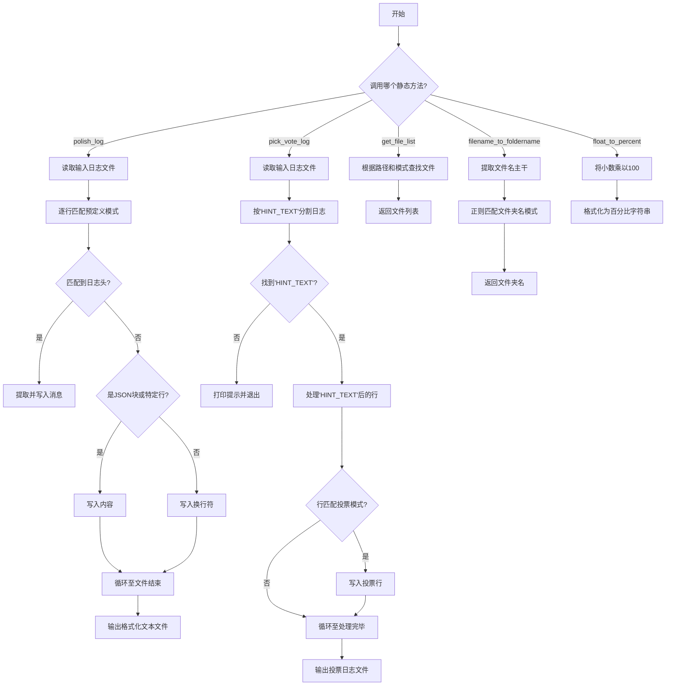
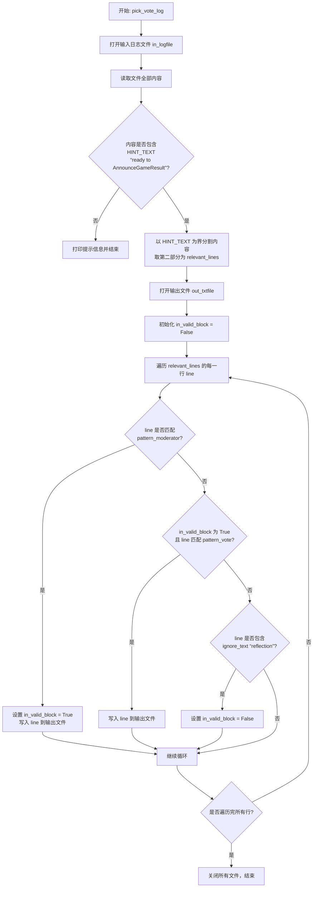
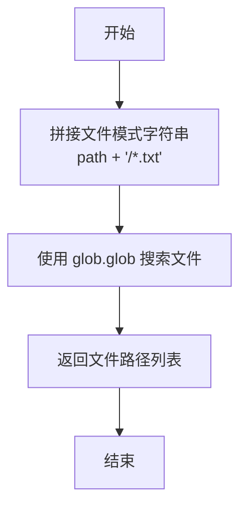

# `.\MetaGPT\examples\werewolf_game\evals\utils.py` 详细设计文档

该文件提供了一个名为 Utils 的工具类，专门用于处理和分析狼人杀游戏模拟过程中生成的日志文件。其核心功能包括：1) 对原始日志进行清洗和格式化，提取关键的游戏对话和事件信息；2) 从日志中筛选出投票环节的特定记录；3) 提供辅助功能，如获取文件列表、转换文件名以及格式化百分比。

## 整体流程



## 类结构

```
Utils (工具类)
├── polish_log (静态方法)
├── pick_vote_log (静态方法)
├── get_file_list (静态方法)
├── filename_to_foldername (静态方法)
└── float_to_percent (静态方法)
```

## 全局变量及字段


### `METAGPT_ROOT`
    
MetaGPT项目的根目录路径，用于定位项目内的文件和目录。

类型：`Path`
    


    

## 全局函数及方法

### `Utils.polish_log`

该方法用于清理和格式化游戏日志文件，提取关键信息，去除冗余内容，并将结果写入新的文本文件。它通过正则表达式匹配日志行，并根据不同的模式（如标准日志格式、JSON数据块、特定用户或步骤标记）来决定如何清洗和输出每一行。

参数：

- `in_logfile`：`str`，输入的原始日志文件路径。
- `out_txtfile`：`str`，输出的清洗后文本文件路径。

返回值：`None`，该方法不返回任何值，直接将处理结果写入指定文件。

#### 流程图

```mermaid
flowchart TD
    A[开始: 打开输入/输出文件] --> B[读取一行日志]
    B --> C{是否匹配标准日志格式?}
    C -- 是 --> D[提取消息内容]
    D --> E{是否为需过滤的特定消息?}
    E -- 是 --> F[写入空行]
    E -- 否 --> G[写入“- 消息”]
    G --> H[设置 pattern_start=True<br>json_start=False]
    C -- 否 --> I{pattern_start 为真且非标准格式?}
    I -- 是 --> J{是否包含“gpt-4 may update over time”?}
    J -- 是 --> K[清空该行]
    J -- 否 --> L[直接写入该行]
    I -- 否 --> M{行是否以“{”开头?}
    M -- 是 --> N[写入该行并设置 json_start=True]
    M -- 否 --> O{json_start 为真?}
    O -- 是 --> P{行是否以“}”结尾?}
    P -- 是 --> Q[写入该行并设置 json_start=False]
    P -- 否 --> R[写入该行（不换行）]
    O -- 否 --> S{是否为特定标记行<br>（如(User):, STEP:, PlayerX）?}
    S -- 是 --> T[直接写入该行]
    S -- 否 --> U[写入空行]
    U --> B
    T --> B
    R --> B
    Q --> B
    N --> B
    L --> B
    F --> H
    H --> B
    K --> B
    B --> V{是否已读取所有行?}
    V -- 否 --> B
    V -- 是 --> W[结束: 关闭文件]
```

#### 带注释源码

```python
@staticmethod
def polish_log(in_logfile, out_txtfile):
    """polish logs for evaluation"""
    # 定义正则表达式模式
    pattern_text = r"(\d{4}-\d{2}-\d{2} \d{2}:\d{2}:\d{2}\.\d{3}) \| (\w+) +\| ([\w\.]+:\w+:\d+) - (.*\S)"  # 匹配标准日志格式
    pattern_player = r"(Player(\d{1}): \w+)"  # 匹配玩家行
    pattern_start = False  # 标记是否已进入一个由标准日志行开始的块
    json_start = False  # 标记是否正在处理一个JSON数据块

    # 打开输入日志文件和输出文本文件
    with open(in_logfile, "r") as f, open(out_txtfile, "w") as out:
        # 逐行读取输入文件
        for line in f.readlines():
            # 尝试匹配标准日志格式
            matches = re.match(pattern_text, line)
            if matches:
                # 如果匹配成功，提取消息部分
                message = matches.group(4).strip()
                pattern_start = True  # 标记已进入一个日志块
                json_start = False    # 重置JSON块标记

                # 过滤掉特定的系统消息
                if (
                    "Moderator(Moderator) ready to InstructSpeak" not in message
                    and "Moderator(Moderator) ready to ParseSpeak" not in message
                    and "Total running cost:" not in message
                ):
                    # 写入格式化的消息行
                    out.write("- " + message + "\n")
                else:
                    # 对于过滤掉的消息，写入一个空行以保持段落结构
                    out.write("\n")

            # 如果已经在一个日志块中，但当前行不匹配标准格式
            elif pattern_start and not matches:
                # 过滤掉关于GPT-4更新的提示行
                if "gpt-4 may update over time" in line:
                    line = ""
                # 直接写入该行（通常是多行消息的后续部分）
                out.write(line)

            # 如果行以“{”开头，认为是JSON数据的开始
            elif line.strip().startswith("{"):
                out.write(line.strip())  # 写入JSON行，去除首尾空白
                json_start = True        # 标记进入JSON块

            # 如果正在处理JSON块且当前行不是以“}”结尾
            elif json_start and not line.strip().endswith("}"):
                out.write(line.strip())  # 写入JSON内容，不换行

            # 如果正在处理JSON块且当前行以“}”结尾
            elif json_start and line.strip().endswith("}"):
                out.write(line.strip())  # 写入JSON结束行
                json_start = False       # 标记JSON块结束

            # 如果行是特定的标记行（用户输入、步骤分隔符、玩家行）
            elif (
                line.startswith("(User):") or line.startswith("********** STEP:") or re.search(pattern_player, line)
            ):
                out.write(line)  # 直接写入这些关键行

            # 对于所有其他情况，写入一个空行（用于分隔不同的逻辑块）
            else:
                out.write("\n")
```

### `Utils.pick_vote_log`

从游戏日志文件中提取投票相关的日志记录。该方法会定位到游戏结束的提示文本 `ready to AnnounceGameResult`，然后从该提示之后的内容中，筛选出由主持人（Moderator）发起的投票环节以及玩家（Player）的投票声明，并将这些记录写入到指定的输出文件中。

参数：

- `in_logfile`：`str`，输入的原始日志文件路径。
- `out_txtfile`：`str`，用于存储提取出的投票日志的输出文件路径。

返回值：`None`，此方法不返回任何值，其功能是将筛选后的日志写入到输出文件中。

#### 流程图



#### 带注释源码

```python
@staticmethod
def pick_vote_log(in_logfile, out_txtfile):
    """
    pick the vote log from the log file.
    ready to AnnounceGameResult serves as the 'HINT_TEXT ' which indicates the end of the game.
    based on bservation and reflection, then discuss is not in vote session.
    """
    # 正则表达式，用于匹配玩家的投票行，例如: "Player1(Werewolf): 1 | I vote to eliminate Player2"
    pattern_vote = r"(Player\d+)\(([A-Za-z]+)\): (\d+) \| (I vote to eliminate Player\d+)"
    # 忽略文本，当行中包含此文本时，表示投票环节结束
    ignore_text = """reflection"""
    # 关键提示文本，用于定位游戏结束的位置，提取此文本之后的日志
    HINT_TEXT = r"ready to AnnounceGameResult"
    # 正则表达式，用于匹配主持人（Moderator）发起投票的指令行
    pattern_moderator = r"\[([^\]]+)\]\. Say ONLY: I vote to eliminate ..."
    # 标志位，表示当前是否处于有效的投票日志块中
    in_valid_block = False

    # 1. 打开输入日志文件
    with open(in_logfile, "r") as f:
        # 2. 读取整个文件内容
        lines = f.read()
        # 3. 使用 HINT_TEXT 将内容分割成两部分
        split_lines = lines.split(HINT_TEXT)

        # 4. 检查是否成功找到 HINT_TEXT
        if len(split_lines) < 2:
            print(f"Key text :{HINT_TEXT} not found in {in_logfile}")
            return

        # 5. 取 HINT_TEXT 之后的部分，并按行分割
        relevant_lines = split_lines[1].split("\n")
        # 6. 打开输出文件
        with open(out_txtfile, "w") as out:
            # 7. 遍历 HINT_TEXT 之后的每一行
            for line in relevant_lines:
                # 8. 如果行匹配主持人模式，则开始一个有效的投票块
                if re.search(pattern_moderator, line):
                    in_valid_block = True
                    out.write(line.lstrip() + "\n")

                # 9. 如果当前在有效投票块中，且行匹配玩家投票模式，则写入该行
                elif in_valid_block and re.search(pattern_vote, line):
                    out.write(line + "\n")
                # 10. 如果行中包含忽略文本（如“reflection”），则结束当前有效投票块
                elif ignore_text in line:
                    in_valid_block = False
                # 11. 其他情况（非投票相关行）不做处理，自动跳过
```


### `Utils.get_file_list`

该静态方法用于获取指定目录下所有 `.txt` 文件的完整路径列表。

参数：

-  `path`：`str`，需要搜索的目标目录路径。

返回值：`list`，一个包含所有匹配到的 `.txt` 文件完整路径的列表。

#### 流程图



#### 带注释源码

```python
    @staticmethod
    def get_file_list(path: str) -> list:
        # 步骤1：根据输入的目录路径，构造一个用于匹配所有.txt文件的模式字符串。
        # 例如，如果 path 是 '/home/user/logs'，则 file_pattern 为 '/home/user/logs/*.txt'
        file_pattern = os.path.join(path, "*.txt")
        
        # 步骤2：使用 glob.glob 函数，根据上一步构造的模式，在指定目录下进行文件搜索。
        # glob.glob 返回一个列表，其中包含了所有匹配该模式的文件和目录的路径。
        files_list = glob.glob(file_pattern)
        
        # 步骤3：将搜索到的文件路径列表返回给调用者。
        return files_list
```


### `Utils.filename_to_foldername`

该方法用于从给定的文本文件名中提取其父文件夹的名称。它通过解析文件名，匹配特定模式来获取文件夹名。

参数：
- `out_txtfile`：`str`，输入的文本文件完整路径。

返回值：`str`，提取出的文件夹名称。如果未匹配到模式，则返回 `None`。

#### 流程图

```mermaid
flowchart TD
    A[开始] --> B[获取文件名<br>（不含扩展名）]
    B --> C{正则匹配模式<br>r'([^_]*)_'}
    C -->|匹配成功| D[提取组1作为文件夹名]
    D --> E[返回文件夹名]
    C -->|匹配失败| F[返回 None]
    E --> G[结束]
    F --> G
```

#### 带注释源码

```python
@staticmethod
def filename_to_foldername(out_txtfile: str):
    """
    convert filename into its parent folder name
    input:"....../# 01-10_10132100.txt"
    output:# 01-10
    """
    # 使用 Path 对象获取文件名（不含路径和扩展名）
    s = Path(out_txtfile).stem
    # 定义正则表达式模式，匹配第一个下划线之前的所有字符
    pattern_folder = r"([^_]*)_"
    # 尝试从文件名开头匹配该模式
    match = re.match(pattern_folder, s)
    if match:
        # 如果匹配成功，提取第一个捕获组（即文件夹名）
        folder = match.group(1)
        return folder
    # 如果未匹配到模式，函数将隐式返回 None
```


### `Utils.float_to_percent`

将输入的浮点数转换为保留两位小数的百分比字符串。

参数：

-  `decimal`：`float`，需要转换的十进制小数，例如 1.00 代表 100%

返回值：`str`，转换后的百分比字符串，格式为 `"100.00%"`

#### 流程图

```mermaid
flowchart TD
    A[开始: 输入浮点数 decimal] --> B[计算百分比: percent = decimal * 100]
    B --> C[格式化字符串: f"{percent:.2f}%"]
    C --> D[结束: 返回格式化后的字符串]
```

#### 带注释源码

```python
    @staticmethod
    def float_to_percent(decimal: float) -> str:
        """
        input:  1.00
        output: 100.00%
        """
        # 将小数乘以100，转换为百分比数值
        percent = decimal * 100
        # 将百分比数值格式化为保留两位小数的字符串，并添加百分号
        return f"{percent:.2f}%"
```


## 关键组件


### 日志处理与清洗组件

提供静态方法对游戏日志文件进行清洗和格式化，提取关键信息，去除无关内容，便于后续分析和评估。

### 投票日志提取组件

专门用于从狼人游戏日志中提取投票环节的特定日志记录，基于关键提示文本定位投票会话，并过滤掉非投票相关的讨论内容。

### 文件路径操作组件

提供静态方法用于获取指定目录下的文件列表，以及将文件名转换为其父文件夹名称，辅助进行批量文件处理和结果组织。

### 数据格式转换组件

提供静态方法将浮点数格式化为百分比字符串，用于在评估报告中展示比率数据。


## 问题及建议


### 已知问题

-   **硬编码的路径和模式**：`polish_log` 和 `pick_vote_log` 方法中包含了大量硬编码的字符串模式（如 `"Moderator(Moderator) ready to InstructSpeak"`、`"ready to AnnounceGameResult"`），这些模式与特定的日志格式紧密耦合。如果日志格式发生变化，这些方法将失效，需要修改源代码。
-   **脆弱的正则表达式**：`polish_log` 方法中用于匹配日志行的正则表达式 `pattern_text` 假设了特定的日志格式（如时间戳、级别、位置、消息）。任何对该格式的偏离都可能导致解析失败或数据提取错误。
-   **复杂的逻辑控制流**：`polish_log` 方法使用了多个布尔标志（`pattern_start`, `json_start`）和大量的 `if-elif` 分支来处理不同的行类型，逻辑较为复杂，可读性和可维护性较差。新增一种日志行类型可能需要修改多个条件分支。
-   **潜在的资源泄漏**：虽然使用了 `with open(...) as f` 确保了文件句柄的关闭，但在 `pick_vote_log` 方法中，先读取整个文件内容（`f.read()`），再分割处理。对于非常大的日志文件，这可能消耗大量内存。
-   **错误处理不足**：`pick_vote_log` 方法在未找到 `HINT_TEXT` 时仅打印一条消息并返回，没有向调用者抛出异常或返回明确的错误状态，可能导致上层逻辑在静默失败后继续执行。
-   **静态方法滥用**：`Utils` 类中的所有方法都是静态方法，这本质上等同于一组全局函数。使用类并没有带来封装或状态管理的优势，更像是一种命名空间组织方式，但可能让使用者困惑是否应该实例化此类。

### 优化建议

-   **将配置外部化**：将硬编码的日志模式、关键词（如 `HINT_TEXT`、`ignore_text`）提取到配置文件（如 YAML、JSON）或作为类常量/方法参数。这样可以在不修改代码的情况下适应日志格式的变化。
-   **重构正则表达式和解析逻辑**：
    -   考虑将 `pattern_text` 分解为更小的、可组合的正则表达式，或者使用命名捕获组来提高可读性。
    -   对于 `polish_log`，可以设计一个基于有限状态机（FSM）或策略模式的解析器，将不同行类型的处理逻辑封装到独立的函数或类中，从而简化主循环的逻辑。
-   **优化文件处理**：对于 `pick_vote_log`，可以改为流式读取文件，逐行查找 `HINT_TEXT` 并处理后续行，避免一次性将大文件加载到内存中。
-   **增强错误处理**：`pick_vote_log` 在未找到关键文本时，应考虑抛出自定义异常（如 `HintTextNotFoundError`），或者至少返回一个标志（如 `None` 或 `False`），让调用者能够明确知晓处理失败。
-   **考虑使用函数替代类**：既然 `Utils` 类不维护任何状态，可以将其重构为一个模块，其中包含一系列函数。这样更符合 Python 的习惯，代码也更清晰。或者，如果未来需要共享配置或状态，再考虑将其设计为可实例化的类。
-   **提高代码可测试性**：将文件 I/O 操作与核心逻辑分离。例如，`polish_log` 和 `pick_vote_log` 的核心逻辑可以接受字符串列表（行）作为输入，并返回处理后的字符串列表。这样便于编写单元测试，而无需依赖实际文件。
-   **添加类型注解和文档**：为所有函数和方法添加完整的类型注解（Type Hints），并补充更详细的文档字符串（Docstrings），说明每个参数、返回值的含义以及方法的主要职责。
-   **统一命名风格**：方法名 `filename_to_foldername` 和 `float_to_percent` 是动词短语，而 `polish_log` 和 `pick_vote_log` 也是动词短语，但 `get_file_list` 是名词短语。建议统一为动词短语（如 `list_files`）以保持一致性。


## 其它


### 设计目标与约束

该模块旨在为狼人杀游戏评估提供日志处理工具。核心设计目标包括：1) 从原始日志中提取并格式化与游戏进程相关的关键信息，用于后续分析；2) 专门提取投票环节的日志，以支持对玩家投票行为的评估。主要约束包括：1) 输入日志格式相对固定，依赖于特定的日志模式字符串；2) 处理逻辑基于正则表达式匹配，对日志格式的微小变化可能敏感；3) 作为工具类，需保持静态方法设计，无状态，便于调用。

### 错误处理与异常设计

当前代码的错误处理较为基础。在`pick_vote_log`方法中，当关键提示文本`HINT_TEXT`未在日志中找到时，会打印一条信息并直接返回，但未向上层调用者抛出异常或返回明确的错误状态。在`filename_to_foldername`方法中，如果正则表达式匹配失败，则返回`None`。整体上，模块缺乏对文件不存在、读取权限不足、正则表达式编译失败等常见I/O或处理错误的显式捕获和处理机制，依赖调用方确保输入的有效性。

### 数据流与状态机

模块的数据流主要是线性的文件读取、正则匹配、条件判断和文件写入过程。`polish_log`方法实现了一个简单的状态机，通过`pattern_start`和`json_start`两个布尔标志来追踪当前行是否处于有效的日志消息块或JSON数据块中，以决定如何清洗和输出内容。`pick_vote_log`方法则通过`in_valid_block`标志来追踪是否进入了包含投票信息的有效日志块。输入为原始日志文件路径，输出为处理后的文本文件路径。

### 外部依赖与接口契约

1.  **内部依赖**：依赖于`metagpt.const`模块中的`METAGPT_ROOT`常量（仅在`__main__`中使用），用于构建默认的日志文件路径。
2.  **标准库依赖**：`glob`（用于文件列表获取）、`os`（路径操作）、`re`（正则表达式匹配）、`pathlib.Path`（路径解析）。
3.  **接口契约**：
    *   `polish_log(in_logfile, out_txtfile)`: 期望`in_logfile`为符合特定格式的文本日志文件。输出文件`out_txtfile`将包含清洗后的、更易读的日志文本。
    *   `pick_vote_log(in_logfile, out_txtfile)`: 期望`in_logfile`为包含狼人杀游戏完整日志的文件，且其中必须包含`"ready to AnnounceGameResult"`文本作为投票环节开始的标记。输出文件`out_txtfile`将仅包含投票相关的日志行。
    *   `get_file_list(path)`: 输入一个目录路径字符串，返回该目录下所有`.txt`文件的路径列表。
    *   `filename_to_foldername(out_txtfile)`: 输入一个文件路径字符串，期望其文件名符合`"前缀_时间戳.txt"`的格式，返回提取出的“前缀”部分。
    *   `float_to_percent(decimal)`: 输入一个浮点数，返回格式化为百分比字符串（如`"100.00%"`）的结果。

    