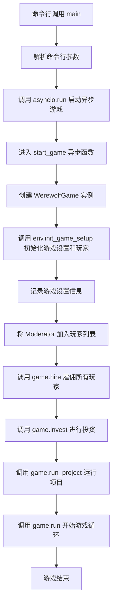
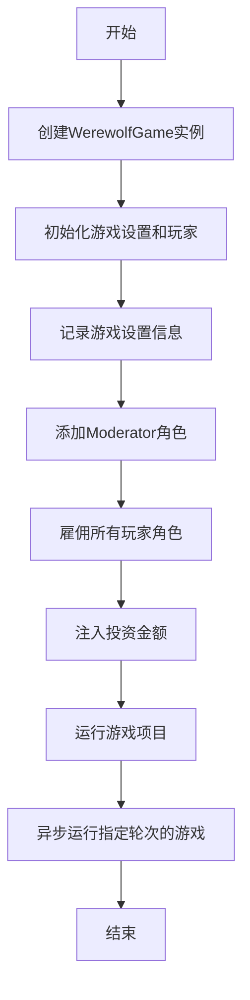
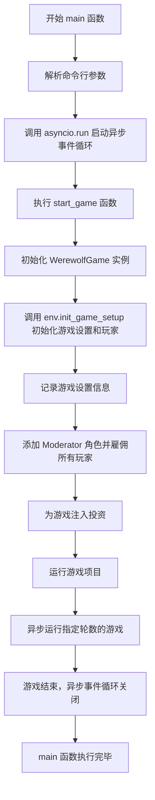
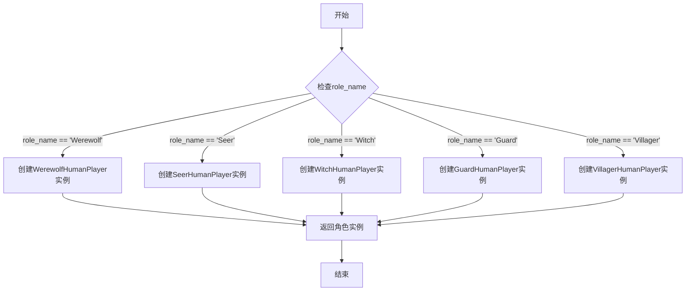
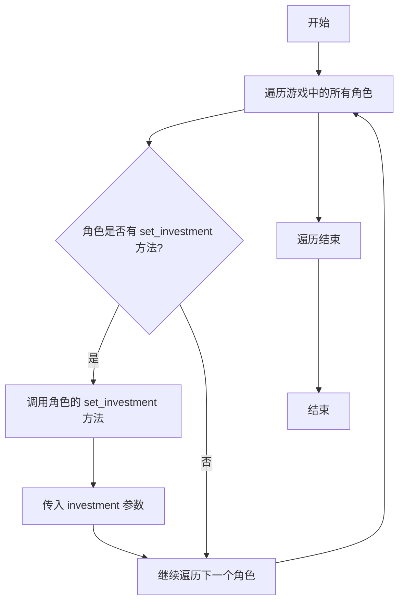
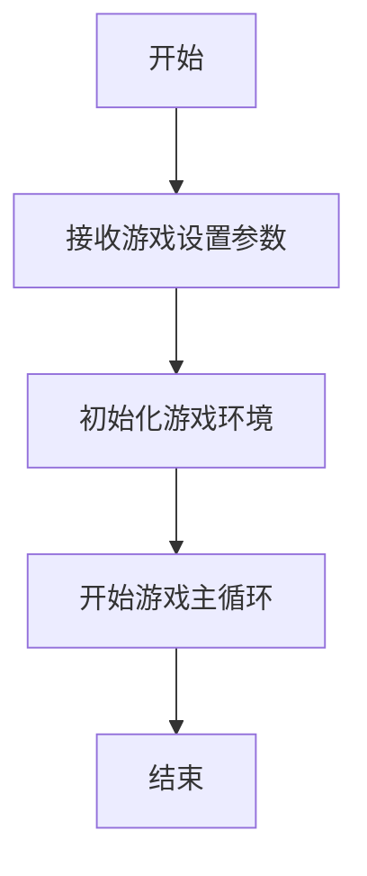
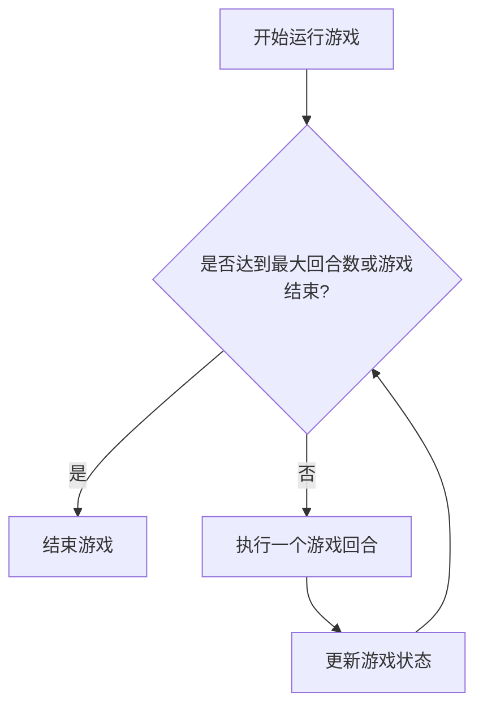

# `.\MetaGPT\examples\werewolf_game\start_game.py` 详细设计文档

该代码是一个狼人杀游戏的启动器，它通过命令行接口配置游戏参数，初始化游戏环境，设置游戏角色（包括村民、狼人、守卫、预言家、女巫和主持人），并启动异步游戏流程。核心功能是提供一个可配置的入口点来运行基于MetaGPT框架的狼人杀模拟游戏。

## 整体流程



## 类结构

```
WerewolfGame (游戏主类)
├── env (游戏环境实例)
│   └── init_game_setup (方法)
├── hire (方法)
├── invest (方法)
├── run_project (方法)
└── run (方法)
Role Classes (游戏角色类)
├── Moderator
├── Villager
├── Werewolf
├── Guard
├── Seer
└── Witch
Human Player Module
└── prepare_human_player (函数)
```

## 全局变量及字段


### `logger`
    
用于记录游戏运行日志的日志记录器实例

类型：`Logger`
    


### `WerewolfGame.env`
    
狼人杀游戏的环境管理器，负责游戏初始化和状态管理

类型：`GameEnvironment`
    
    

## 全局函数及方法

### `start_game`

`start_game` 函数是狼人杀游戏的异步启动入口。它负责初始化游戏环境、配置游戏角色、设置游戏参数，并启动游戏的主循环。该函数通过一系列步骤创建游戏实例、准备玩家角色、注入投资，并运行指定轮次的游戏。

参数：

- `investment`：`float`，游戏的投资金额，默认为3.0
- `n_round`：`int`，游戏运行的轮次，默认为5
- `shuffle`：`bool`，是否在游戏开始时随机分配角色，默认为True
- `add_human`：`bool`，是否添加人类玩家，默认为False
- `use_reflection`：`bool`，是否使用反思机制，默认为True
- `use_experience`：`bool`，是否使用经验机制，默认为False
- `use_memory_selection`：`bool`，是否使用记忆选择机制，默认为False
- `new_experience_version`：`str`，新经验版本的标识符，默认为空字符串

返回值：`None`，该函数没有返回值，它异步运行游戏直到结束。

#### 流程图



#### 带注释源码

```python
async def start_game(
    investment: float = 3.0,  # 游戏投资金额，默认3.0
    n_round: int = 5,  # 游戏运行轮次，默认5轮
    shuffle: bool = True,  # 是否随机分配角色，默认是
    add_human: bool = False,  # 是否添加人类玩家，默认否
    use_reflection: bool = True,  # 是否使用反思机制，默认是
    use_experience: bool = False,  # 是否使用经验机制，默认否
    use_memory_selection: bool = False,  # 是否使用记忆选择机制，默认否
    new_experience_version: str = "",  # 新经验版本标识，默认空字符串
):
    # 创建狼人杀游戏实例
    game = WerewolfGame()
    
    # 初始化游戏设置和玩家角色
    game_setup, players = game.env.init_game_setup(
        role_uniq_objs=[Villager, Werewolf, Guard, Seer, Witch],  # 可用的角色类型
        num_werewolf=2,  # 狼人数量
        num_villager=2,  # 村民数量
        shuffle=shuffle,  # 是否随机分配角色
        add_human=add_human,  # 是否添加人类玩家
        use_reflection=use_reflection,  # 是否使用反思机制
        use_experience=use_experience,  # 是否使用经验机制
        use_memory_selection=use_memory_selection,  # 是否使用记忆选择机制
        new_experience_version=new_experience_version,  # 新经验版本标识
        prepare_human_player=prepare_human_player,  # 人类玩家准备函数
    )
    
    # 记录游戏设置信息
    logger.info(f"{game_setup}")
    
    # 添加主持人角色到玩家列表开头
    players = [Moderator()] + players
    
    # 雇佣所有玩家角色
    game.hire(players)
    
    # 注入投资金额
    game.invest(investment)
    
    # 运行游戏项目
    game.run_project(game_setup)
    
    # 异步运行指定轮次的游戏
    await game.run(n_round=n_round)
```

### `main`

`main` 函数是狼人杀模拟游戏的命令行入口点。它负责解析命令行参数，并调用异步的 `start_game` 函数来启动和运行游戏。

参数：

- `investment`：`float`，默认值为 20.0。表示对游戏的投资金额，可能影响游戏内的资源或配置。
- `n_round`：`int`，默认值为 100。指定游戏运行的轮数。
- `shuffle`：`bool`，默认值为 True。指示是否在游戏开始前随机分配玩家角色。
- `add_human`：`bool`，默认值为 False。决定是否在游戏中加入人类玩家。
- `use_reflection`：`bool`，默认值为 True。控制是否在游戏中使用反思机制。
- `use_experience`：`bool`，默认值为 False。控制是否在游戏中使用经验机制。
- `use_memory_selection`：`bool`，默认值为 False。控制是否在游戏中使用记忆选择机制。
- `new_experience_version`：`str`，默认值为空字符串。指定新经验机制的版本标识。

返回值：`None`，该函数不返回任何值，其主要作用是启动并运行游戏。

#### 流程图



#### 带注释源码

```python
def main(
    investment: float = 20.0,  # 游戏投资金额，影响游戏资源
    n_round: int = 100,        # 游戏运行的轮数
    shuffle: bool = True,      # 是否随机分配角色
    add_human: bool = False,   # 是否加入人类玩家
    use_reflection: bool = True, # 是否启用反思机制
    use_experience: bool = False, # 是否启用经验机制
    use_memory_selection: bool = False, # 是否启用记忆选择机制
    new_experience_version: str = "", # 新经验机制的版本标识
):
    # 使用 asyncio.run 来运行异步的 start_game 函数，传递所有参数
    asyncio.run(
        start_game(
            investment,
            n_round,
            shuffle,
            add_human,
            use_reflection,
            use_experience,
            use_memory_selection,
            new_experience_version,
        )
    )
```

### `prepare_human_player`

该函数用于准备人类玩家角色，根据提供的角色名称和游戏设置，创建并返回一个对应的人类玩家角色实例。

参数：

-  `role_name`：`str`，角色名称，用于指定要创建的人类玩家角色类型
-  `game_setup`：`GameSetup`，游戏设置对象，包含游戏配置信息

返回值：`Role`，返回创建的人类玩家角色实例

#### 流程图



#### 带注释源码

```python
def prepare_human_player(role_name: str, game_setup: GameSetup) -> Role:
    """
    根据角色名称创建对应的人类玩家角色实例
    
    Args:
        role_name: 角色名称字符串，用于确定要创建的角色类型
        game_setup: 游戏设置对象，包含游戏配置信息
        
    Returns:
        对应的人类玩家角色实例
        
    Raises:
        ValueError: 当role_name不是有效的角色名称时抛出异常
    """
    # 根据角色名称创建对应的人类玩家角色
    if role_name == "Werewolf":
        return WerewolfHumanPlayer(game_setup=game_setup)
    elif role_name == "Seer":
        return SeerHumanPlayer(game_setup=game_setup)
    elif role_name == "Witch":
        return WitchHumanPlayer(game_setup=game_setup)
    elif role_name == "Guard":
        return GuardHumanPlayer(game_setup=game_setup)
    elif role_name == "Villager":
        return VillagerHumanPlayer(game_setup=game_setup)
    else:
        # 如果角色名称无效，抛出异常
        raise ValueError(f"Invalid role name: {role_name}")
```

### `WerewolfGame.hire`

该方法用于将一组玩家角色（`Role`对象）雇佣到狼人杀游戏中，为每个玩家设置游戏环境上下文，并建立玩家与游戏之间的双向关联。

参数：

-  `players`：`list[Role]`，一个包含所有玩家角色实例的列表，这些角色将被添加到游戏中。

返回值：`None`，该方法不返回任何值。

#### 流程图

```mermaid
flowchart TD
    A[开始] --> B{输入: players 列表}
    B --> C[遍历 players 列表]
    C --> D[为当前 player 设置环境<br>player.set_env(self.env)]
    D --> E[将当前 player 添加到<br>self.roles 列表中]
    E --> F{是否遍历完所有 players?}
    F -- 否 --> C
    F -- 是 --> G[结束]
```

#### 带注释源码

```python
def hire(self, players: list[Role]):
    """
    将一组玩家角色雇佣到游戏中。
    为每个玩家设置游戏环境，并将他们添加到游戏的角色列表中。

    Args:
        players (list[Role]): 要雇佣的玩家角色列表。
    """
    # 遍历传入的玩家列表
    for player in players:
        # 为当前玩家设置游戏环境，使其能够访问游戏状态和规则
        player.set_env(self.env)
        # 将当前玩家添加到游戏的角色管理列表中
        self.roles.append(player)
```

### `WerewolfGame.invest`

该方法用于为游戏中的每个角色分配初始投资金额，以设置他们的初始资金状态。

参数：

- `investment`：`float`，每个角色获得的初始投资金额

返回值：`None`，无返回值

#### 流程图



#### 带注释源码

```python
def invest(self, investment: float):
    """
    为游戏中的每个角色分配初始投资金额。

    该方法遍历游戏中的所有角色，并为每个角色调用其 `set_investment` 方法（如果存在），
    以设置该角色的初始资金状态。

    Args:
        investment (float): 每个角色获得的初始投资金额。
    """
    # 遍历游戏中的所有角色
    for role in self.roles:
        # 检查角色是否有 set_investment 方法
        if hasattr(role, "set_investment"):
            # 调用角色的 set_investment 方法，传入投资金额
            role.set_investment(investment)
```

### `WerewolfGame.run_project`

该方法用于启动并运行狼人杀游戏项目，根据游戏设置初始化游戏环境，并开始游戏的主循环。

参数：

- `game_setup`：`dict`，包含游戏初始设置信息的字典，如角色分配、游戏规则等。

返回值：`None`，无返回值。

#### 流程图



#### 带注释源码

```python
def run_project(self, game_setup: dict):
    """
    启动并运行狼人杀游戏项目。
    
    参数:
        game_setup (dict): 包含游戏初始设置信息的字典，如角色分配、游戏规则等。
    """
    # 根据游戏设置初始化游戏环境
    self.env.setup(game_setup)
    # 开始游戏的主循环
    self.env.start()
```

### `WerewolfGame.run`

该方法是一个异步方法，用于运行狼人杀游戏的主循环。它根据指定的回合数（`n_round`）控制游戏流程，在每一回合中，它会依次执行游戏的不同阶段（如夜晚、白天、投票等），并处理游戏状态的更新和角色的行动。该方法会持续运行，直到游戏达到结束条件（例如，所有狼人或所有村民被淘汰）或达到指定的最大回合数。

参数：

-  `n_round`：`int`，指定游戏运行的最大回合数。

返回值：`None`，此方法不返回任何值，它通过异步操作控制游戏流程。

#### 流程图



#### 带注释源码

```python
async def run(self, n_round: int = 5):
    """
    运行狼人杀游戏的主循环。
    
    参数:
        n_round (int): 游戏运行的最大回合数。
    """
    # 初始化当前回合计数器
    self._current_round = 0
    
    # 主循环：持续运行直到达到最大回合数或游戏结束
    while self._current_round < n_round and not self.is_done():
        # 增加回合计数
        self._current_round += 1
        
        # 记录当前回合信息
        logger.info(f"--- Round {self._current_round} ---")
        
        # 执行一个完整的游戏回合
        await self._run_round()
        
        # 更新游戏状态（例如，检查是否有角色被淘汰，更新游戏阶段等）
        self._update_game_state()
        
        # 记录游戏当前状态
        logger.info(f"Game state after round {self._current_round}: {self.env.get_game_state()}")
    
    # 游戏结束，记录最终结果
    logger.info("Game Over")
    if self.is_done():
        logger.info(f"Game ended after {self._current_round} rounds.")
    else:
        logger.info(f"Game stopped after reaching the maximum round limit: {n_round}.")
```

## 关键组件


### WerewolfGame

游戏主控类，负责初始化游戏环境、管理玩家角色、分配投资、运行游戏项目以及执行游戏回合。

### Moderator

游戏主持人角色，负责引导游戏流程、宣布阶段、收集玩家行动并裁决结果。

### Villager

村民角色，属于好人阵营，在白天通过讨论和投票尝试找出并放逐狼人。

### Werewolf

狼人角色，属于狼人阵营，在夜晚共同商议并选择一名玩家击杀。

### Guard

守卫角色，属于好人阵营，在夜晚可以选择保护一名玩家免受狼人击杀。

### Seer

预言家角色，属于好人阵营，在夜晚可以查验一名玩家的真实身份。

### Witch

女巫角色，属于好人阵营，拥有一瓶解药和一瓶毒药，可以在夜晚选择使用。

### prepare_human_player

准备人类玩家的函数，用于在游戏中加入真人玩家，提供交互式游戏体验。

### WerewolfGame.env

游戏环境对象，负责初始化游戏设置，包括角色分配、玩家列表生成以及游戏规则的配置。

### 游戏设置 (game_setup)

包含游戏初始配置信息的对象，如角色分配、玩家列表等，用于启动和运行游戏。

### 玩家列表 (players)

包含所有游戏角色实例的列表，包括主持人、狼人、村民及各种神职角色。

### 投资 (investment)

分配给游戏项目的初始资源（如资金），影响游戏运行的质量或能力。

### 游戏回合 (n_round)

游戏运行的轮次数，决定游戏的总时长和进程。

### 角色洗牌 (shuffle)

布尔标志，决定是否在游戏开始前随机分配玩家角色。

### 添加人类玩家 (add_human)

布尔标志，决定是否在游戏中加入真人玩家。

### 使用反思 (use_reflection)

布尔标志，决定AI角色是否在行动后进行反思以改进策略。

### 使用经验 (use_experience)

布尔标志，决定是否利用历史经验数据来指导AI角色的决策。

### 记忆选择 (use_memory_selection)

布尔标志，决定AI角色是否从记忆库中选择性地回忆相关信息。

### 新经验版本 (new_experience_version)

字符串标识符，指定使用哪一版本的经验数据或模型。


## 问题及建议


### 已知问题

-   **硬编码的角色配置**：`start_game`函数中，`role_uniq_objs`参数被硬编码为`[Villager, Werewolf, Guard, Seer, Witch]`。这使得游戏的角色配置缺乏灵活性，无法通过命令行参数或配置文件轻松调整，限制了游戏的扩展性和可定制性。
-   **参数传递冗余**：`main`函数接收所有参数，然后原封不动地传递给`start_game`函数。这种设计增加了代码的维护成本，当需要新增或修改参数时，需要在两个地方进行同步更改，容易出错。
-   **缺乏配置验证**：代码中没有对输入参数（如`investment`、`n_round`、`num_werewolf`、`num_villager`等）进行有效性验证。例如，`investment`可能为负数，`n_round`可能为0，或者角色数量配置可能导致游戏无法正常进行（如狼人数量为0）。这可能导致运行时错误或逻辑异常。
-   **异步与同步接口混合**：`main`函数是同步的，它通过`asyncio.run`调用异步的`start_game`函数。虽然这在技术上是可行的，但混合使用可能在某些复杂的集成或测试场景中带来不便。`start_game`函数本身是异步的，但其内部调用的`game.run`方法是否为异步，以及整个异步上下文的管理是否清晰，需要进一步审查。
-   **日志信息不完整**：代码中仅使用`logger.info`打印了`game_setup`信息。对于游戏运行过程中的关键事件（如角色行动、投票结果、游戏阶段转换等）缺乏详细的日志记录，不利于调试和游戏过程复盘。

### 优化建议

-   **将角色配置参数化**：建议将`role_uniq_objs`作为`main`和`start_game`函数的可选参数，并提供一个默认值。这样，用户可以通过命令行或配置文件指定要使用的角色类，极大地提高了游戏的灵活性。例如：`def start_game(..., role_classes: List[Type[Role]] = DEFAULT_ROLES, ...)`。
-   **使用配置对象或字典**：考虑将多个相关的游戏配置参数（如`investment`、`n_round`、角色数量配置、各种功能开关`use_*`）封装到一个配置类（如`GameConfig`）或字典中。这可以简化函数签名，提高代码的可读性和可维护性，并便于进行统一的配置验证和序列化/反序列化。
-   **添加参数验证逻辑**：在`start_game`函数或`WerewolfGame.env.init_game_setup`方法开始时，添加对输入参数的验证。确保数值参数在有效范围内（如`investment > 0`, `n_round > 0`），角色数量配置合理（如总玩家数至少为`num_werewolf + num_villager + 1`（至少一个神职）等）。验证失败时应抛出清晰的异常。
-   **明确异步边界与错误处理**：审视`game.run`方法，如果它内部包含异步操作，确保其被正确等待。考虑在`start_game`函数中添加更完善的错误处理（`try...except`），捕获游戏运行过程中可能出现的异常，并进行适当的日志记录或用户提示，避免因未处理异常导致程序崩溃。
-   **增强游戏过程日志**：在`WerewolfGame`和各个`Role`类的关键方法中增加不同级别的日志输出（如`DEBUG`、`INFO`）。可以设计一个结构化的日志格式，以便于后续分析。例如，记录每个回合的开始/结束、每个玩家的行动选择及原因、投票详情等。
-   **考虑性能与资源管理**：如果游戏回合数`n_round`很大（如示例中的100），且使用了记忆、经验等特性，需要注意内存使用情况。建议评估是否有内存泄漏的风险，并考虑在长期运行的游戏中实现定期的资源清理或检查点机制。


## 其它


### 设计目标与约束

本代码旨在实现一个基于异步编程的狼人杀游戏模拟器，其核心设计目标包括：
1.  **角色扮演模拟**：通过定义不同的角色类（如狼人、村民、预言家等）来模拟游戏中的各种角色行为。
2.  **游戏流程自动化**：通过 `WerewolfGame` 类及其环境 (`env`) 来管理游戏设置、角色分配、回合推进和游戏逻辑。
3.  **可配置性与扩展性**：通过命令行参数（如 `investment`, `n_round`, `add_human` 等）允许用户自定义游戏参数，并支持通过添加新角色类来扩展游戏。
4.  **人类玩家集成**：提供 `add_human` 选项，允许真实玩家通过 `prepare_human_player` 函数参与到模拟游戏中。
5.  **高级AI特性**：支持反思 (`use_reflection`)、经验利用 (`use_experience`)、记忆选择 (`use_memory_selection`) 等可选的高级AI行为模式，以增强角色扮演的智能性。

主要约束包括：
*   **异步执行**：游戏主循环 (`game.run`) 必须在一个异步环境中运行。
*   **外部依赖**：代码依赖于 `metagpt` 框架提供的角色基类、游戏环境类和日志系统。
*   **命令行接口**：使用 `fire` 库将 `main` 函数自动转换为命令行工具，参数传递需符合其规范。

### 错误处理与异常设计

当前代码中显式的错误处理较为有限，主要依赖于Python和底层框架的默认异常传播机制：
1.  **参数验证**：`start_game` 和 `main` 函数的参数没有进行有效性检查（例如，`investment` 应为正数，`n_round` 应为正整数）。无效参数可能导致运行时错误或逻辑异常。
2.  **游戏初始化**：`game.env.init_game_setup` 方法可能因角色数量配置不当（如 `num_werewolf` + `num_villager` 超过可用玩家槽位）而失败，但代码未捕获可能抛出的异常。
3.  **异步任务管理**：`asyncio.run(start_game(...))` 会启动一个顶级事件循环。如果 `start_game` 或内部的 `game.run` 协程中发生未处理的异常，事件循环将停止，程序崩溃。
4.  **人类玩家输入**：当 `add_human=True` 时，`prepare_human_player` 函数负责处理人类输入。该函数内部应有相应的输入验证和错误处理机制，但外层代码未体现。
5.  **日志记录**：使用 `logger.info` 记录游戏设置信息，但未对错误或警告级别的事件进行结构化记录。

**建议的异常处理策略**：在 `main` 和 `start_game` 函数中增加 `try-except` 块，捕获 `ValueError`、`RuntimeError` 等可能异常，并记录清晰的错误日志后优雅退出或进行恢复。

### 数据流与状态机

1.  **初始化数据流**：
    *   **输入**：命令行参数（投资额、回合数、是否洗牌、是否加入人类玩家等）。
    *   **处理**：`main` 函数接收参数 -> 调用 `asyncio.run(start_game(...))` -> `start_game` 创建 `WerewolfGame` 实例 -> 调用 `game.env.init_game_setup` 根据参数生成 `game_setup`（游戏配置）和 `players`（角色实例列表）。
    *   **输出**：初始化的游戏环境 (`game`) 和玩家列表。

2.  **游戏运行数据流**：
    *   **状态载体**：`WerewolfGame` 实例 (`game`) 是核心状态机，其内部状态（如当前回合、存活玩家、游戏阶段等）由 `env` 属性和各个 `Role` 实例的状态共同维护。
    *   **驱动循环**：`game.run(n_round)` 是主状态推进器。它可能内部包含一个循环，每轮 (`round`) 驱动不同的游戏阶段（夜晚、白天讨论、投票等）。
    *   **角色间通信**：玩家 (`players`) 之间的互动（如投票、技能使用）通过 `game` 环境进行协调，环境负责验证行动合法性、更新全局状态并广播结果。
    *   **信息流**：`Moderator` 角色可能负责宣布阶段、收集投票、宣布结果，其行动会触发其他角色的反应和状态更新。

3.  **状态转移**：虽然没有明确的 `if-elif-else` 状态机代码块，但 `WerewolfGame.run` 方法逻辑定义了一个隐式状态机，状态包括“游戏准备”、“夜晚行动”、“白天讨论”、“投票放逐”、“游戏结束”等。状态的转移由回合数、玩家存活情况和特定游戏规则决定。

### 外部依赖与接口契约

1.  **外部库依赖**：
    *   `asyncio`: Python标准库，用于支持异步游戏循环。
    *   `fire`: Google开源库，用于自动生成命令行接口。
    *   `metagpt`: 主框架，提供了：
        *   `metagpt.ext.werewolf.roles`: 定义了所有游戏角色的基类和具体实现（`Guard`, `Moderator`, `Seer`, `Villager`, `Werewolf`, `Witch`）。
        *   `metagpt.ext.werewolf.roles.human_player`: 提供了 `prepare_human_player` 函数，用于集成人类玩家。
        *   `metagpt.ext.werewolf.werewolf_game`: 提供了 `WerewolfGame` 类，作为游戏的主控制器和环境。
        *   `metagpt.logs`: 提供了 `logger` 对象，用于日志记录。

2.  **接口契约**：
    *   `WerewolfGame` 类契约：预期提供 `hire(players)`, `invest(investment)`, `run_project(setup)`, `run(n_round)` 等方法。`env` 属性应提供 `init_game_setup(...)` 方法。
    *   `Role` 类契约：所有角色类（包括 `Moderator`）应实现特定的接口或继承自某个基类，以确保它们可以被 `game.hire` 雇佣，并能响应游戏环境发出的动作请求（如 `act`, `vote` 等）。
    *   `prepare_human_player` 函数契约：当 `add_human=True` 时被调用，应返回一个符合 `Role` 契约的、能够处理人类输入的角色实例。
    *   **命令行接口契约**：`main` 函数的所有参数及其默认值定义了命令行工具的接口。用户可以通过 `--investment 5.0 --n_round 50 --add_human=True` 等形式进行配置。

3.  **隐式依赖**：代码的成功运行还依赖于 `metagpt` 框架正确的内部实现，包括角色间的消息传递机制、环境的状态管理方式等，这些构成了更深层次的接口契约。

    