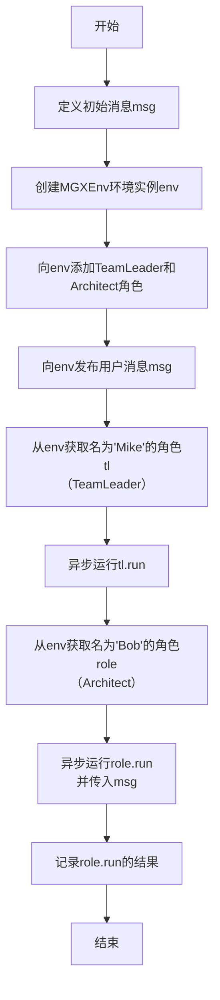
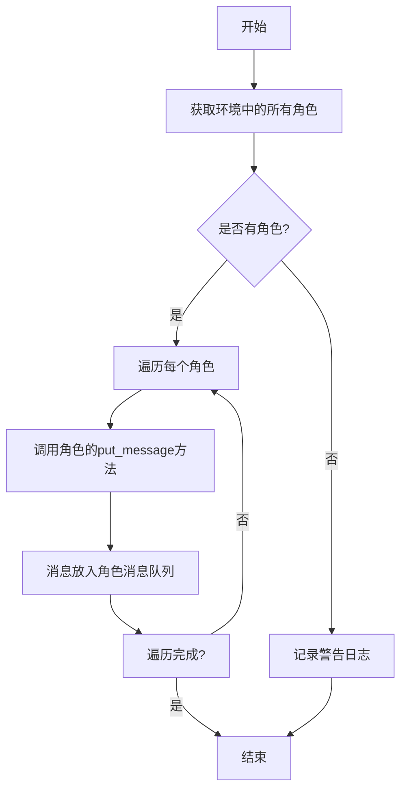
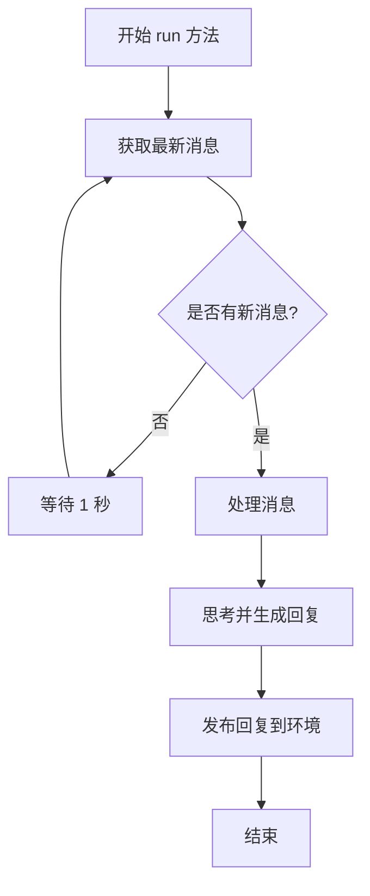
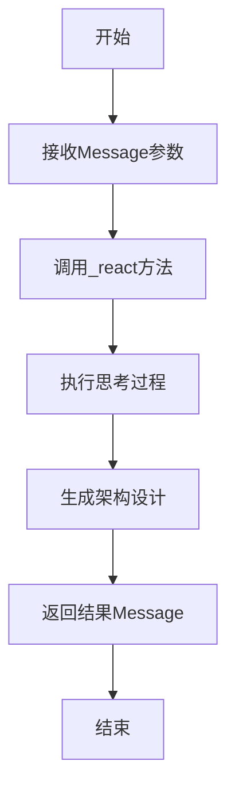

# `.\MetaGPT\examples\write_design.py` 详细设计文档

该代码是一个基于MetaGPT框架的异步程序入口，核心功能是初始化一个多智能体协作环境（MGXEnv），创建并配置团队领导（TeamLeader）和架构师（Architect）两个角色，然后通过向环境发布一个用户消息（"Write a TRD for a snake game"）来触发团队领导的工作流程，最终获取并记录架构师角色处理该消息后的输出结果。

## 整体流程

```mermaid
graph TD
    A[开始: asyncio.run(main)] --> B[初始化MGXEnv环境]
    B --> C[向环境添加TeamLeader和Architect角色]
    C --> D[发布用户消息: 'Write a TRD for a snake game']
    D --> E[从环境中获取名为'Mike'的角色(TeamLeader)]
    E --> F[异步执行TeamLeader.run()]
    F --> G[从环境中获取名为'Bob'的角色(Architect)]
    G --> H[异步执行Architect.run(msg)]
    H --> I[记录Architect返回的结果]
    I --> J[结束]
```

## 类结构

```
外部依赖 (Imports)
├── asyncio (Python标准库)
├── metagpt.environment.mgx.mgx_env.MGXEnv
├── metagpt.logs.logger
├── metagpt.roles.architect.Architect
├── metagpt.roles.di.team_leader.TeamLeader
└── metagpt.schema.Message
全局函数 (Global Functions)
└── main (异步入口函数)
类层次结构 (Class Hierarchy - 基于导入推断)
├── MGXEnv (环境类)
├── TeamLeader (角色类)
├── Architect (角色类)
└── Message (消息类)
```

## 全局变量及字段


### `msg`
    
存储用户输入的原始需求字符串，用于初始化任务

类型：`str`
    


### `env`
    
主环境对象，用于管理角色和消息传递

类型：`MGXEnv`
    


### `tl`
    
从环境中获取的团队领导者角色实例

类型：`TeamLeader`
    


### `role`
    
从环境中获取的架构师角色实例

类型：`Architect`
    


### `result`
    
存储架构师角色执行任务后的最终输出结果

类型：`str`
    


### `Message.content`
    
消息的内容主体，承载具体的任务或信息

类型：`str`
    


### `Message.role`
    
消息的发送者标识，用于区分消息来源

类型：`str`
    
    

## 全局函数及方法

### `main`

该函数是程序的异步入口点，负责初始化一个多智能体环境（MGXEnv），配置角色（TeamLeader和Architect），发布一个初始用户消息（要求编写贪吃蛇游戏的技术需求文档），然后依次运行TeamLeader和Architect角色来处理该消息，并最终记录Architect的处理结果。

参数：
- 无

返回值：`None`，该函数没有显式返回值。

#### 流程图



#### 带注释源码

```python
async def main():
    # 定义初始的用户请求消息，内容是要求编写一个贪吃蛇游戏的技术需求文档（TRD）
    msg = "Write a TRD for a snake game"
    
    # 创建一个多智能体交互环境（MGXEnv）的实例
    env = MGXEnv()
    
    # 向环境中添加两个预定义的角色：TeamLeader（团队领导）和Architect（架构师）
    env.add_roles([TeamLeader(), Architect()])
    
    # 将初始的用户消息发布到环境中，触发角色间的通信和协作流程
    env.publish_message(Message(content=msg, role="user"))
    
    # 从环境中获取名为"Mike"的角色，根据上下文推测，这通常是TeamLeader角色
    tl = env.get_role("Mike")
    # 异步运行TeamLeader角色的主逻辑，处理接收到的消息并可能与其他角色交互
    await tl.run()

    # 从环境中获取名为"Bob"的角色，根据上下文推测，这通常是Architect角色
    role = env.get_role("Bob")
    # 异步运行Architect角色的主逻辑，并直接传入初始消息msg进行处理
    result = await role.run(msg)
    # 使用日志记录器打印Architect角色处理后的最终结果
    logger.info(result)
```

### `MGXEnv.add_roles`

该方法用于向`MGXEnv`环境实例中添加一个或多个角色对象。它会遍历传入的角色列表，将每个角色注册到环境的内部角色字典中，并为每个角色设置其所属的环境上下文。

参数：
- `roles`：`list[Role]`，一个包含要添加到环境中的`Role`对象（或其子类对象，如`TeamLeader`、`Architect`）的列表。

返回值：`None`，此方法不返回任何值。

#### 流程图

```mermaid
flowchart TD
    A[开始：调用 add_roles(roles)] --> B{检查 roles 是否为列表？}
    B -- 是 --> C[遍历 roles 列表]
    B -- 否 --> D[记录错误日志<br>“roles must be a list”]
    D --> E[结束]
    C --> F[对于列表中的每个 role]
    F --> G[将 role 添加到 self._roles 字典<br>键：role.profile， 值：role]
    G --> H[调用 role.set_env(self)<br>设置角色的环境上下文]
    H --> I{是否遍历完所有角色？}
    I -- 否 --> F
    I -- 是 --> J[结束]
```

#### 带注释源码

```python
def add_roles(self, roles: list[Role]):
    """
    向环境中添加角色。

    该方法接收一个角色列表，将每个角色添加到内部角色字典中，
    并设置每个角色的环境上下文为当前环境实例。

    Args:
        roles (list[Role]): 要添加到环境中的角色对象列表。
    """
    # 参数类型检查：确保传入的roles是一个列表
    if not isinstance(roles, list):
        logger.error("roles must be a list")
        return

    # 遍历角色列表
    for role in roles:
        # 将角色对象以它的profile属性（通常为角色名）为键，存储到环境的_role字典中
        self._roles[role.profile] = role
        # 调用角色的set_env方法，将当前环境实例（self）设置为该角色的运行环境
        # 这使得角色可以访问和与环境进行交互
        role.set_env(self)
```

### `MGXEnv.publish_message`

该方法用于向MGXEnv环境中的所有角色发布一条消息，触发它们对消息的处理。

参数：
- `message`：`Message`，要发布的消息对象，包含消息内容和发送者角色等信息。

返回值：`None`，该方法没有返回值。

#### 流程图



#### 带注释源码

```python
def publish_message(self, message: Message):
    """
    向环境中所有角色发布消息。

    该方法会遍历环境中注册的所有角色，并将给定的消息放入每个角色的消息队列中，
    以便角色后续进行处理。如果环境中没有注册任何角色，则会记录一条警告日志。

    Args:
        message (Message): 要发布的消息对象。
    """
    # 检查环境中是否有角色
    if not self.roles:
        # 如果没有角色，记录警告日志
        logger.warning(f"No roles in the environment, cannot publish message: {message}")
        return

    # 遍历环境中所有的角色
    for role in self.roles.values():
        # 将消息放入每个角色的消息队列中
        role.put_message(message)
```

### `MGXEnv.get_role`

该方法用于根据角色名称从环境中检索并返回对应的角色实例。

参数：
- `name`：`str`，要检索的角色名称

返回值：`Optional[Role]`，如果找到则返回对应的角色实例，否则返回`None`

#### 流程图

```mermaid
flowchart TD
    A[开始: get_role(name)] --> B{name 是否在 self.roles 中?}
    B -- 是 --> C[返回 self.roles[name]]
    B -- 否 --> D[返回 None]
    C --> E[结束]
    D --> E
```

#### 带注释源码

```python
def get_role(self, name: str) -> Optional[Role]:
    """
    根据角色名称获取角色实例。

    Args:
        name (str): 要检索的角色名称

    Returns:
        Optional[Role]: 如果找到则返回对应的角色实例，否则返回None
    """
    # 从self.roles字典中根据name键查找对应的角色实例
    # 如果不存在则返回None
    return self.roles.get(name)
```

### `TeamLeader.run`

该方法是一个异步方法，是`TeamLeader`角色的核心执行逻辑。它负责从环境中获取分配给该角色的消息，处理这些消息，并根据处理结果决定下一步行动，例如将任务分配给其他角色或完成当前任务。

参数：
- `self`：`TeamLeader`，`TeamLeader`类的实例，代表团队领导者角色。
- `*args`：`tuple`，可变位置参数，用于接收可能传入的额外参数，但在此方法中未使用。
- `**kwargs`：`dict`，可变关键字参数，用于接收可能传入的额外关键字参数，但在此方法中未使用。

返回值：`None`，此方法不返回任何值，其主要作用是通过异步操作执行任务流程。

#### 流程图



#### 带注释源码

```python
async def run(self, *args, **kwargs) -> None:
    """
    团队领导者角色的主要运行循环。
    持续从环境中获取消息，处理消息，并发布回复。
    """
    while True:
        # 从环境中获取最新的消息
        self._observe()
        if not self._rc.news:
            # 如果没有新消息，等待一段时间后继续检查
            await asyncio.sleep(1)
            continue

        # 处理获取到的消息
        msg = self._rc.news[0]
        # 思考并生成对消息的回复
        reply = await self._think(msg)
        if reply:
            # 将回复发布到环境中
            await self._publish_message(reply)
        # 处理完消息后，清空消息列表，准备接收新消息
        self._rc.news = []
```

### `Architect.run`

该方法用于执行架构师角色的主要工作流程。它接收一个消息作为输入，处理该消息以生成架构设计，并返回处理结果。

参数：

- `message`：`Message`，包含用户请求或任务描述的消息对象

返回值：`Message`，包含架构设计结果的消息对象

#### 流程图



#### 带注释源码

```python
async def run(self, message: Message) -> Message:
    """
    执行架构师角色的主要工作流程
    
    Args:
        message: 包含用户请求或任务描述的消息对象
        
    Returns:
        包含架构设计结果的消息对象
    """
    # 调用父类的_react方法处理消息
    # 该方法会触发架构师的思考过程并生成相应的设计
    return await self._react(message)
```

## 关键组件


### MGXEnv

一个用于管理和协调多个角色（Role）交互的环境类，提供角色注册、消息发布和角色检索等功能。

### TeamLeader

一个具体的角色类，负责在环境中协调团队工作，可能涉及任务分配和进度管理。

### Architect

一个具体的角色类，负责系统或软件架构设计工作。

### Message

一个用于在环境中的不同角色之间传递信息的消息数据结构，包含内容、发送者角色等属性。

### asyncio

Python的异步I/O框架，用于支持代码中的并发执行，特别是`main`函数的异步运行和角色间的异步交互。


## 问题及建议


### 已知问题

-   **硬编码的角色名称**：代码中通过字符串 `"Mike"` 和 `"Bob"` 来获取角色。这存在两个问题：1) 如果环境中不存在对应名称的角色，`env.get_role` 方法可能返回 `None`，导致后续调用 `run` 方法时出现 `AttributeError`。2) 这使得代码与具体的角色名称强耦合，降低了灵活性和可维护性。
-   **潜在的异步任务管理问题**：代码依次执行 `tl.run()` 和 `role.run(msg)`，但未明确处理这两个异步任务之间的依赖关系或并发执行可能带来的竞态条件。如果 `TeamLeader` 和 `Architect` 角色需要协作或共享环境状态，当前的顺序执行方式可能无法满足复杂的交互逻辑。
-   **消息传递逻辑不清晰**：代码首先通过 `env.publish_message` 发布了一条消息，但随后又直接将 `msg` 作为参数传递给 `role.run(msg)`。这可能导致消息被重复处理，或者环境中的消息与直接参数传递的消息产生混淆，使得数据流难以追踪。
-   **缺乏错误处理与日志记录**：代码中没有对可能出现的异常（如角色未找到、异步任务失败等）进行捕获和处理。同时，除了最终的结果，中间过程的日志记录不足，不利于调试和监控。

### 优化建议

-   **使用配置或依赖注入管理角色**：建议将角色名称或角色实例通过配置、命令行参数或依赖注入的方式传入，避免在代码中硬编码。例如，可以定义一个角色配置列表，然后根据配置来获取和运行角色。
-   **明确任务编排与依赖**：如果 `TeamLeader` 和 `Architect` 角色需要协作，应使用 `asyncio.gather`、`asyncio.create_task` 配合 `await` 或更高级的工作流引擎来明确任务间的执行顺序、依赖关系和并发模式。确保数据在角色间正确、有序地流动。
-   **统一消息传递入口**：建议明确消息传递的路径。通常，所有消息都应通过环境（`MGXEnv`）来发布和路由。`role.run` 方法应主要从环境中拉取分配给自己的消息，而不是直接接受参数。这样可以更好地利用环境的角色间通信机制。
-   **增强健壮性与可观测性**：
    -   在调用 `env.get_role` 后，检查返回值是否为 `None`，并进行妥善处理（如抛出清晰的异常或记录错误日志）。
    -   使用 `try...except` 块包裹 `await tl.run()` 和 `await role.run(...)` 等异步调用，捕获并记录异常。
    -   在关键步骤（如角色开始运行、收到消息、产生结果）添加更详细的日志输出，便于跟踪执行流程。
-   **考虑代码结构优化**：将 `main` 函数中的逻辑进一步模块化，例如分离环境初始化、角色配置、任务执行等部分，使主函数更清晰，并提高代码的可测试性。


## 其它


### 设计目标与约束

本代码是一个基于MetaGPT框架的异步任务执行示例，其核心设计目标是展示如何利用MGXEnv环境、预定义角色（TeamLeader, Architect）以及异步消息机制，来模拟一个简单的多角色协作流程，以响应用户请求（例如“编写贪吃蛇游戏的技术需求文档”）。主要约束包括：1) 依赖MetaGPT框架的特定类和环境；2) 使用异步编程模型（asyncio）；3) 示例性质，角色交互和消息处理流程相对固定和简化。

### 错误处理与异常设计

当前代码示例中未显式包含错误处理逻辑。潜在的异常点包括：1) `env.get_role` 可能因角色名称不存在而返回`None`或引发异常；2) `await tl.run()` 和 `await role.run(msg)` 在执行异步任务时可能因内部逻辑（如网络、资源问题）抛出异常；3) `asyncio.run(main())` 可能因事件循环问题失败。建议在生产代码中增加`try...except`块来捕获`KeyError`、`AttributeError`、`RuntimeError`等异常，并进行适当的日志记录或用户反馈。

### 数据流与状态机

数据流始于用户输入消息（`msg`），该消息被包装成`Message`对象并发布到`MGXEnv`环境中。环境将消息分发给其管理的角色（此处为TeamLeader和Architect）。代码随后显式获取名为“Mike”的TeamLeader角色并执行其`run`方法，这可能会触发角色间的内部消息传递或状态变更。接着，获取名为“Bob”的Architect角色并直接向其`run`方法传入原始消息，执行其逻辑。最终，Architect角色的运行结果被记录到日志。状态机相对简单：环境初始化 -> 角色添加 -> 消息发布 -> 角色执行（可能涉及内部状态转换） -> 结果输出。

### 外部依赖与接口契约

1.  **外部依赖库**：
    *   `asyncio`: Python标准库，用于异步任务调度。
    *   `metagpt`: 核心框架，提供了`MGXEnv`、`Architect`、`TeamLeader`、`Message`、`logger`等关键类和工具。
2.  **接口契约**：
    *   `MGXEnv.add_roles(roles)`: 接受一个角色列表，将其添加到环境中。
    *   `MGXEnv.publish_message(message)`: 接受一个`Message`对象，将其发布到环境的消息系统中。
    *   `MGXEnv.get_role(name)`: 根据角色名称返回对应的角色实例。
    *   `Role.run([message])`: 角色的主要执行方法。`TeamLeader.run()`在示例中无参数，而`Architect.run(msg)`接受一个消息字符串。具体行为由角色子类定义。
    *   `Message(content, role)`: 消息对象的构造函数，需要内容和发送者角色标识。

### 配置与初始化

代码的配置是硬编码的：1) 用户请求消息内容固定为“Write a TRD for a snake game”；2) 环境实例化使用默认参数；3) 添加到环境的角色是`TeamLeader()`和`Architect()`的默认实例；4) 通过`env.get_role`查找的角色名称（“Mike”, “Bob”）是预设的，依赖于这些默认角色实例的内部命名。在实际应用中，这些配置（如消息内容、角色类型、角色名称）应通过配置文件、环境变量或命令行参数进行外部化和管理。

### 日志与监控

代码通过`metagpt.logs.logger`在最后记录Architect角色的运行结果（`logger.info(result)`）。MetaGPT框架内部可能在其他地方（如角色执行过程中）也使用了该日志器进行记录。为了更好的可观测性，可以：1) 增加更细粒度的日志点（如环境初始化、消息发布、角色获取）；2) 配置日志级别和输出格式；3) 考虑集成更强大的监控系统，用于跟踪消息流、角色执行时间和异常情况。

    