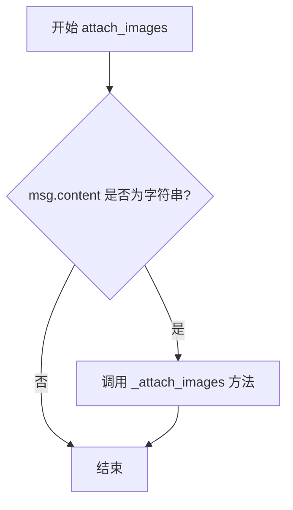
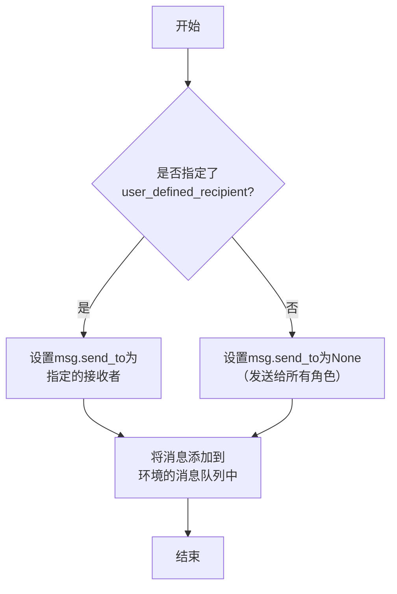
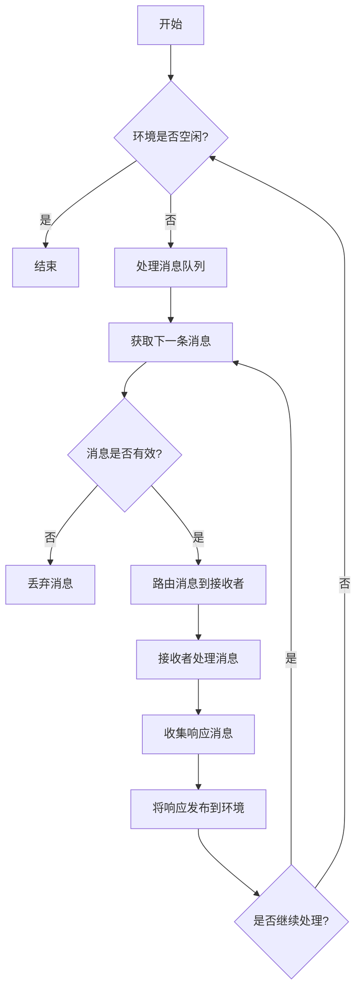
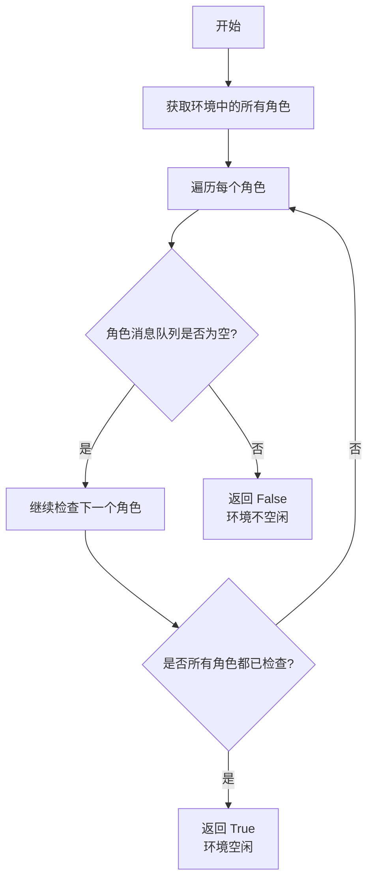

# `.\MetaGPT\examples\write_game_code.py` 详细设计文档

该代码是一个基于MetaGPT框架的异步任务执行入口，它通过创建一个多智能体环境（MGXEnv），在其中部署团队领导（TeamLeader）和工程师（Engineer2）角色，接收一个任务需求（如“编写2048游戏代码”），并将该需求作为消息发布到环境中，驱动智能体进行协作与响应，直到环境空闲或达到设定的超时时间。

## 整体流程

```mermaid
graph TD
    A[开始: 解析命令行/默认参数] --> B[创建MGXEnv环境实例]
    B --> C[向环境中添加TeamLeader和Engineer2角色]
    C --> D[根据需求创建Message对象]
    D --> E{用户是否指定了消息接收者?}
    E -- 是 --> F[设置msg.send_to并调用publish_message(指定接收者)]
    E -- 否 --> G[调用publish_message(广播)]
    F --> H[进入主循环]
    G --> H
    H --> I{环境是否空闲?}
    I -- 否 --> J[执行env.run()]
    J --> K[重置计时器]
    K --> I
    I -- 是 --> L{是否超时?}
    L -- 否 --> I
    L -- 是 --> M[结束]
```

## 类结构

```
外部依赖/导入模块
├── asyncio (Python标准库)
├── time (Python标准库)
├── metagpt.environment.mgx.mgx_env.MGXEnv (MetaGPT框架)
├── metagpt.roles.di.engineer2.Engineer2 (MetaGPT框架)
├── metagpt.roles.di.team_leader.TeamLeader (MetaGPT框架)
└── metagpt.schema.Message (MetaGPT框架)
 
全局函数
└── main (异步入口函数)
 
脚本执行入口
└── __name__ == '__main__' 代码块
```

## 全局变量及字段


### `requirement`
    
用户需求描述，作为任务输入传递给系统

类型：`str`
    


### `user_defined_recipient`
    
用户指定的消息接收者，用于定向发送消息

类型：`str`
    


### `Message.content`
    
消息的主要内容，通常包含任务需求或指令

类型：`str`
    


### `Message.send_to`
    
消息的目标接收者集合，用于指定消息的发送对象

类型：`set[str]`
    
    

## 全局函数及方法

### `main`

该函数是一个异步入口函数，用于启动一个基于MetaGPT框架的协作式AI代理环境。它接收一个需求描述，将其发布到环境中，并驱动环境中的角色（如团队领导和工程师）进行协作处理，直到任务完成或达到设定的空闲超时时间。

参数：
- `requirement`：`str`，需要处理的任务或需求的文本描述。
- `user_defined_recipient`：`str`，可选参数，指定消息的特定接收者。如果为空，则消息广播给所有角色。
- `enable_human_input`：`bool`，标志位，指示是否允许在流程中等待人工输入。如果为`False`，则空闲等待时间被设置为1秒。
- `allow_idle_time`：`int`，当`enable_human_input`为`True`时，允许环境处于空闲状态的最大秒数。

返回值：`None`，该函数不返回任何值。

#### 流程图

```mermaid
flowchart TD
    A[开始: main] --> B[创建MGXEnv环境实例]
    B --> C[向环境中添加TeamLeader和Engineer2角色]
    C --> D[用requirement创建Message]
    D --> E[为Message附加可能的图像内容]
    E --> F{user_defined_recipient<br>是否为空?}
    F -- 是 --> G[向环境广播发布消息]
    F -- 否 --> H[设置消息接收者并定向发布]
    G --> I[计算允许的空闲时间<br>allow_idle_time]
    H --> I
    I --> J[记录开始时间start_time]
    J --> K{当前时间 - start_time<br>是否小于允许的空闲时间?}
    K -- 是 --> L{环境是否空闲?<br>env.is_idle}
    L -- 否 --> M[运行环境一步: await env.run()]
    M --> N[重置开始时间start_time]
    N --> K
    L -- 是 --> K
    K -- 否 --> O[结束]
```

#### 带注释源码

```python
async def main(requirement="", user_defined_recipient="", enable_human_input=False, allow_idle_time=30):
    # 1. 初始化环境
    env = MGXEnv()
    # 2. 向环境中添加预定义的角色
    env.add_roles([TeamLeader(), Engineer2()])

    # 3. 根据传入的需求创建消息对象
    msg = Message(content=requirement)
    # 4. 如果消息内容包含图像引用，则附加图像数据
    env.attach_images(msg)  # attach image content if applicable

    # 5. 根据是否指定了接收者，选择不同的消息发布方式
    if user_defined_recipient:
        # 5a. 如果指定了接收者，将消息定向发送给该接收者
        msg.send_to = {user_defined_recipient}
        env.publish_message(msg, user_defined_recipient=user_defined_recipient)
    else:
        # 5b. 如果未指定接收者，将消息广播给环境中的所有角色
        env.publish_message(msg)

    # 6. 根据是否启用人工输入，确定允许的最大空闲等待时间
    #    如果启用了人工输入，使用传入的allow_idle_time；否则，设置为1秒以快速轮询。
    allow_idle_time = allow_idle_time if enable_human_input else 1
    # 7. 记录循环开始的时间
    start_time = time.time()
    # 8. 主循环：在允许的空闲时间内，持续运行环境
    while time.time() - start_time < allow_idle_time:
        # 8a. 检查环境当前是否处于空闲状态（即没有角色在处理消息）
        if not env.is_idle:
            # 8b. 如果环境不空闲，运行环境一步（驱动角色处理消息）
            await env.run()
            # 8c. 重置开始时间，因为环境有活动，空闲计时重新开始
            start_time = time.time()  # reset start time
    # 9. 当超过允许的空闲时间后，函数结束。如果enable_human_input为True且无人干预，或任务已完成，循环将退出。
```

### `MGXEnv.add_roles`

该方法用于向`MGXEnv`环境实例中添加一个或多个角色（`Role`）对象。这些角色将被注册到环境中，以便后续参与消息处理和工作流执行。

参数：
- `roles`：`List[Role]`，一个包含要添加到环境中的`Role`实例的列表。

返回值：`None`，该方法不返回任何值。

#### 流程图

```mermaid
flowchart TD
    A[开始: add_roles(roles)] --> B{检查roles是否为列表?}
    B -- 是 --> C[遍历roles列表]
    B -- 否 --> D[将单个角色包装为列表]
    D --> C
    C --> E[对于列表中的每个角色r]
    E --> F[调用self._add_role(r)]
    F --> G[将角色r添加到self.roles字典]
    G --> H[结束遍历]
    H --> I[结束]
```

#### 带注释源码

```python
def add_roles(self, roles: List[Role]):
    """
    向环境中添加一个或多个角色。
    
    参数:
        roles: 要添加的角色列表。如果传入单个角色，也会被自动处理。
    """
    # 如果传入的不是列表（例如单个角色），则将其包装成列表，确保后续处理的一致性。
    if not isinstance(roles, list):
        roles = [roles]
    
    # 遍历处理后的角色列表
    for role in roles:
        # 调用内部方法_add_role，将角色注册到环境中。
        # 这通常涉及将角色添加到内部数据结构（如字典）并设置必要的环境上下文。
        self._add_role(role)
```

### `MGXEnv.attach_images`

该方法用于检查传入的`Message`对象是否包含图像内容，如果包含，则将这些图像内容附加到消息中。

参数：

- `msg`：`Message`，需要检查并可能附加图像内容的消息对象

返回值：`None`，无返回值

#### 流程图



#### 带注释源码

```python
def attach_images(self, msg: Message):
    """
    检查消息内容是否包含图像，如果包含则附加图像内容。
    
    参数:
        msg (Message): 需要处理的消息对象
    """
    # 检查消息内容是否为字符串类型
    if isinstance(msg.content, str):
        # 调用内部方法处理图像附件
        self._attach_images(msg)
```


### `MGXEnv.publish_message`

该方法用于在MGXEnv环境中发布消息。它负责将消息添加到环境的消息队列中，并根据需要设置消息的接收者。如果指定了用户定义的接收者，则消息将仅发送给该接收者；否则，消息将发送给所有角色。

参数：

- `msg`：`Message`，要发布的消息对象，包含消息内容和元数据。
- `user_defined_recipient`：`str`，可选参数，指定消息的接收者。如果提供，消息将仅发送给该接收者；否则，消息将发送给所有角色。

返回值：`None`，无返回值。

#### 流程图



#### 带注释源码

```python
def publish_message(self, msg: Message, user_defined_recipient: str = ""):
    """
    发布消息到环境中。

    如果指定了user_defined_recipient，则消息仅发送给该接收者；
    否则，消息将发送给所有角色。

    Args:
        msg (Message): 要发布的消息对象。
        user_defined_recipient (str): 可选参数，指定消息的接收者。
    """
    if user_defined_recipient:
        # 如果指定了接收者，设置消息的send_to属性为该接收者
        msg.send_to = {user_defined_recipient}
    # 将消息添加到环境的消息队列中
    self.message_queue.put(msg)
```


### `MGXEnv.run`

该方法用于运行MGXEnv环境，处理环境中的消息队列，驱动角色间的交互，直到环境空闲或达到停止条件。

参数：

- 无显式参数（实例方法，通过`self`访问实例状态）

返回值：`None`，无返回值

#### 流程图



#### 带注释源码

```python
async def run(self):
    """
    运行环境的主循环。
    
    该方法会持续处理环境中的消息，直到环境变为空闲状态。
    每次循环会从消息队列中获取消息，路由到相应的接收者进行处理，
    并将处理结果作为新消息发布回环境中。
    """
    while not self.is_idle:  # 当环境不空闲时继续运行
        # 从消息队列中获取下一条消息
        msg = self.message_queue.get()
        
        if msg is None:  # 如果消息为空，跳过处理
            continue
            
        # 获取消息的接收者列表
        receivers = self.get_receivers(msg)
        
        # 如果没有接收者，跳过处理
        if not receivers:
            continue
            
        # 为每个接收者处理消息
        for receiver in receivers:
            # 调用接收者的处理方法来处理消息
            response = await receiver.handle(msg)
            
            # 如果接收者有响应，将响应发布到环境中
            if response:
                self.publish_message(response)
```

### `MGXEnv.is_idle`

`MGXEnv.is_idle` 是 `MGXEnv` 类的一个属性，用于判断当前环境是否处于空闲状态。它通过检查环境中所有角色的消息队列是否为空来实现。如果所有角色的消息队列都为空，则环境被认为是空闲的；否则，环境被认为是活跃的。

参数：
- 无

返回值：`bool`，如果环境中所有角色的消息队列都为空，则返回 `True`，表示环境空闲；否则返回 `False`，表示环境活跃。

#### 流程图



#### 带注释源码

```python
@property
def is_idle(self):
    """
    判断环境是否空闲。
    通过检查所有角色的消息队列是否为空来实现。
    如果所有角色的消息队列都为空，则环境空闲；否则，环境活跃。
    """
    # 遍历环境中的所有角色
    for role in self.roles:
        # 如果某个角色的消息队列不为空，则环境不空闲
        if not role.rc.msg_buffer.empty():
            return False
    # 所有角色的消息队列都为空，环境空闲
    return True
```

## 关键组件


### MGXEnv

MGXEnv 是 MetaGPT 框架中的多智能体协作环境，负责管理角色（Role）的注册、消息的发布与路由，并驱动整个异步协作流程的运行。

### TeamLeader

TeamLeader 是一个具体的智能体角色，在团队协作中扮演领导者，负责接收需求、分解任务、协调其他角色（如工程师）并管理项目进度。

### Engineer2

Engineer2 是一个具体的智能体角色，在团队协作中扮演工程师，负责接收来自 TeamLeader 或其他角色的具体任务（如编写代码）并执行。

### Message

Message 是 MetaGPT 框架中用于在智能体之间传递信息的基本数据结构，包含消息内容、发送者、接收者等元数据，是驱动智能体间协作的核心载体。

### 异步事件循环与运行控制

代码通过 `asyncio.run` 和 `env.run()` 实现了异步的事件驱动运行模式，并通过 `allow_idle_time` 和 `is_idle` 状态检查来控制环境的运行时长和空闲退出逻辑。


## 问题及建议


### 已知问题

-   **硬编码的角色依赖**：`main` 函数中直接实例化了 `TeamLeader` 和 `Engineer2` 角色，这使得代码的灵活性和可配置性降低。如果需要更换角色或动态添加/移除角色，必须修改源代码。
-   **缺乏输入验证**：函数参数（如 `requirement`, `user_defined_recipient`）没有进行有效性或安全性验证，可能导致运行时错误或非预期行为。
-   **循环逻辑可能过于简单**：`while` 循环仅根据 `allow_idle_time` 和 `env.is_idle` 状态来判断是否继续运行。当环境长时间处于非空闲状态（例如，角色间持续通信）时，即使超过了 `allow_idle_time`，循环也不会退出，这可能与 `allow_idle_time` 参数的设计初衷相悖。
-   **时间重置逻辑可能不精确**：在 `while` 循环中，一旦 `env.is_idle` 为 `False`，就会执行 `await env.run()` 并重置 `start_time`。如果 `env.run()` 执行时间较长，这段时间没有被计入空闲时间，可能导致程序实际运行时间远超 `allow_idle_time` 的设定。
-   **同步与异步混合使用**：代码中混用了同步的 `time.time()` 和异步的 `await env.run()`，虽然在此处可能没有问题，但在更复杂的异步上下文中，这种模式可能导致性能问题或难以调试的竞态条件。

### 优化建议

-   **参数化角色配置**：建议将角色列表作为 `main` 函数的参数传入，或者通过配置文件、环境变量等方式动态加载，以提高代码的灵活性和可测试性。
-   **添加参数验证**：在函数入口处对关键参数进行验证，例如检查 `requirement` 是否为空字符串，`user_defined_recipient` 是否符合预期的格式（如果存在格式要求），并抛出清晰的异常。
-   **重构循环退出条件**：重新审视 `allow_idle_time` 参数的含义。如果它旨在控制整个任务的**最大运行时间**，则应使用一个总的时间戳进行判断，而不是在每次 `env.run()` 后重置。如果它旨在控制**最大空闲等待时间**，则当前逻辑基本正确，但需要更明确的注释和更健壮的空闲状态判断。
-   **使用异步友好的时间处理**：考虑使用 `asyncio.sleep` 结合事件循环的时间，或者使用 `asyncio.timeout` 上下文管理器来更精确地控制异步操作的超时，避免阻塞事件循环。
-   **增强错误处理与日志记录**：当前代码缺乏对 `env.run()` 或消息发布过程中可能抛出的异常的处理。建议添加 `try-except` 块来捕获异常，并记录详细的日志，以便于问题排查。
-   **考虑将主逻辑封装为类**：如果 `main` 函数的逻辑变得更加复杂，或者需要在不同上下文中复用，可以考虑将其封装为一个专门的类（例如 `TaskRunner` 或 `Orchestrator`），将环境初始化、角色管理、消息传递和运行循环等职责分离，使代码结构更清晰。
-   **提供更丰富的配置选项**：除了 `enable_human_input` 和 `allow_idle_time`，可以考虑暴露更多环境或角色的运行时配置参数，例如日志级别、通信协议、持久化设置等。


## 其它


### 设计目标与约束

本代码模块的设计目标是构建一个基于异步事件驱动的多智能体协作系统，用于处理用户需求（如生成代码）。其核心约束包括：1) 必须支持异步操作以处理潜在的I/O密集型任务；2) 需集成一个环境（`MGXEnv`）来管理角色（`Role`）间的通信与协作；3) 需支持可配置的运行参数，如是否允许人工输入、空闲超时时间等；4) 作为演示或入口点，代码结构需简洁明了。

### 错误处理与异常设计

当前代码中的错误处理较为基础。主要依赖Python的默认异常传播机制。潜在的风险点包括：1) `asyncio.run()` 调用可能因事件循环问题失败；2) `env.publish_message` 或 `env.run()` 内部可能抛出未捕获的异常，导致主循环意外终止；3) 对 `user_defined_recipient` 等输入参数缺乏有效性验证。建议增加 `try...except` 块来捕获关键步骤的异常，并记录日志或给出用户友好的错误提示。

### 数据流与状态机

系统数据流始于用户需求（`requirement`），被封装为 `Message` 对象。该消息通过 `env.publish_message` 发布到环境中。环境 `MGXEnv` 作为中央调度器，根据消息的 `send_to` 字段（或默认规则）将消息路由给相应的角色（如 `TeamLeader` 或 `Engineer2`）。角色处理消息后，可能生成新的消息并发布回环境，形成协作循环。系统状态由环境的 `is_idle` 属性表示：当所有角色都处于空闲状态时，`is_idle` 为 `True`，主循环将根据 `allow_idle_time` 决定是否继续运行或退出。

### 外部依赖与接口契约

1.  **外部库依赖**：`asyncio` (Python标准库，用于异步运行时)、`time` (Python标准库，用于计时)。第三方依赖 `metagpt` 框架，具体引入了 `MGXEnv`、`Engineer2`、`TeamLeader`、`Message` 等核心类。
2.  **接口契约**：
    *   `MGXEnv.add_roles()`: 接受一个角色列表，将其注册到环境中。
    *   `MGXEnv.publish_message()`: 接受一个 `Message` 对象和一个可选的 `user_defined_recipient` 字符串，负责消息的路由与分发。
    *   `MGXEnv.run()`: 异步方法，驱动环境中所有注册的角色执行一步动作。
    *   `MGXEnv.is_idle`: 属性，指示环境当前是否处于空闲状态。
    *   `Message` 类：需包含 `content` 和 `send_to` 等字段，作为角色间通信的基本单元。
3.  **隐式契约**：`Engineer2` 和 `TeamLeader` 角色类必须实现 `metagpt` 框架中 `Role` 基类定义的接口（如 `_act` 方法），以便能被环境正确调度。

### 配置管理与环境变量

当前代码的配置主要通过 `main` 函数的参数进行硬编码或传递，缺乏灵活性。例如，`requirement`、`enable_human_input`、`allow_idle_time` 等关键参数在 `if __name__ == "__main__":` 块中直接指定。建议引入配置文件（如YAML、JSON）或环境变量来管理这些参数，以提高代码的可配置性和部署便利性。例如，可以将默认需求、超时时间等抽取到配置文件中。

### 安全考虑

1.  **输入验证**：`requirement` 和 `user_defined_recipient` 参数直接传入系统，未进行任何清理或验证。如果这些值来源于不可信的用户输入，可能存在注入风险（尽管在本代码上下文中风险较低，主要影响内部消息路由）。建议对输入进行基本的验证和清理。
2.  **资源管理**：主循环 `while` 在 `allow_idle_time` 内持续运行。如果 `enable_human_input` 为 `True` 且 `allow_idle_time` 设置过长，可能导致进程长时间占用资源。应考虑增加更细粒度的控制或看门狗机制。
3.  **依赖安全**：依赖的 `metagpt` 第三方库应保持更新，以避免已知的安全漏洞。

### 部署与运行说明

1.  **运行方式**：本模块是一个独立的Python脚本，通过 `python <脚本名>.py` 直接运行。入口点为 `if __name__ == "__main__":` 块。
2.  **前置条件**：需要安装Python（建议3.7+）以及 `metagpt` 库及其所有依赖。
3.  **进程管理**：作为演示脚本，通常以前台进程方式运行。若需作为长期服务，需要借助外部进程管理工具（如systemd, supervisor, docker）来保证其稳定运行、日志收集和故障重启。
4.  **日志**：当前代码未显式配置日志。在实际部署中，应集成日志库（如Python `logging`），在关键步骤（如消息发布、角色动作、错误发生）记录不同级别的日志，便于监控和调试。

    