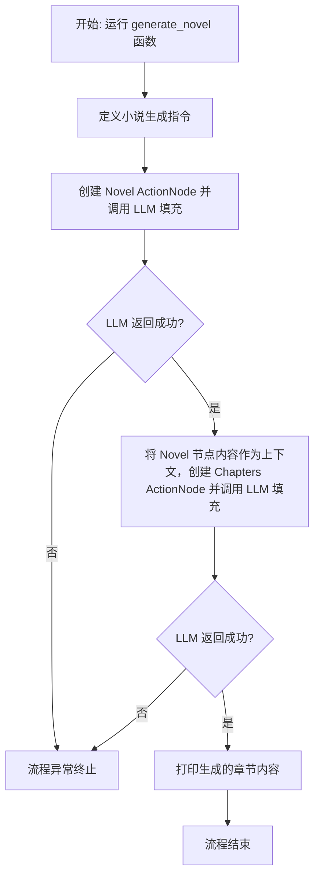
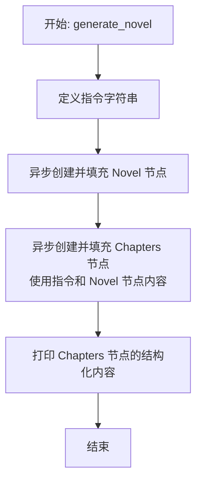

# `.\MetaGPT\examples\write_novel.py` 详细设计文档

该代码是一个基于MetaGPT框架的异步小说生成脚本。它通过定义结构化的数据模型（如小说大纲、章节内容），利用大语言模型（LLM）和ActionNode机制，将用户的高层指令（如“写一本名为‘重生在天际’的小说”）逐步细化和填充，最终生成包含多个章节的完整小说内容。

## 整体流程



## 类结构

```
BaseModel (Pydantic 基类)
├── Chapter (章节模型)
├── Chapters (章节列表模型)
└── Novel (小说元数据模型)
```

## 全局变量及字段


### `Chapter.name`
    
章节的名称。

类型：`str`
    


### `Chapter.content`
    
章节的内容，不超过1000字。

类型：`str`
    


### `Chapters.chapters`
    
小说的章节列表。

类型：`List[Chapter]`
    


### `Novel.name`
    
小说的名称。

类型：`str`
    


### `Novel.user_group`
    
小说的目标读者群体。

类型：`str`
    


### `Novel.outlines`
    
小说的章节大纲，不超过10章。

类型：`List[str]`
    


### `Novel.background`
    
小说的背景设定。

类型：`str`
    


### `Novel.character_names`
    
小说中的角色名称列表。

类型：`List[str]`
    


### `Novel.conflict`
    
角色之间的主要冲突。

类型：`str`
    


### `Novel.plot`
    
小说的主要情节。

类型：`str`
    


### `Novel.ending`
    
小说的结局。

类型：`str`
    
    

## 全局函数及方法


### `generate_novel`

该函数是一个异步函数，用于生成一部小说。它首先通过一个指令创建并填充一个`Novel`（小说）模型节点，该节点包含了小说的基本框架信息（如名称、用户群体、大纲、背景、角色、冲突、情节、结局）。然后，它利用这个已填充的小说节点信息，结合原始指令，进一步创建并填充一个`Chapters`（章节）模型节点，该节点包含了小说的具体章节内容。最终，函数将章节节点的结构化内容（`instruct_content`）打印到控制台。

参数：
-  `无`：该函数没有定义任何参数。

返回值：`None`，该函数没有显式返回值，其主要作用是执行生成和打印操作。

#### 流程图



#### 带注释源码

```python
async def generate_novel():
    # 定义生成小说的核心指令，包含小说名称和激励性提示
    instruction = (
        "Write a novel named 'Reborn in Skyrim'. "
        "Fill the empty nodes with your own ideas. Be creative! Use your own words!"
        "I will tip you $100,000 if you write a good novel."
    )
    # 步骤1: 使用 ActionNode 工具，基于 Pydantic 的 Novel 模型创建一个节点，
    # 并调用 LLM 根据指令填充该节点的所有字段（如name, outlines, plot等）
    novel_node = await ActionNode.from_pydantic(Novel).fill(req=instruction, llm=LLM())
    
    # 步骤2: 再次使用 ActionNode 工具，基于 Pydantic 的 Chapters 模型创建一个节点。
    # 这次将原始指令和上一步生成的小说节点内容合并作为新的请求，调用 LLM 来填充章节列表。
    chap_node = await ActionNode.from_pydantic(Chapters).fill(
        req=f"### instruction\n{instruction}\n### novel\n{novel_node.content}", llm=LLM()
    )
    
    # 步骤3: 打印最终生成的、包含具体章节名称和内容的 Chapters 节点的结构化数据。
    print(chap_node.instruct_content)
```


## 关键组件


### Pydantic 数据模型

定义了三个核心数据模型（`Chapter`, `Chapters`, `Novel`），用于结构化地表示小说的元数据、大纲和章节内容，为AI生成过程提供了清晰的数据契约和约束。

### ActionNode 与 LLM 交互

利用 `ActionNode` 类将 Pydantic 模型转换为可供大语言模型（LLM）理解和填充的结构化指令节点，并通过 `fill` 方法驱动 LLM 按指定格式生成内容，实现了从数据模型到AI生成内容的自动化流程。

### 异步任务编排

使用 `asyncio` 库和 `async/await` 语法来组织异步任务流（`generate_novel` 函数），确保在等待LLM响应时不会阻塞程序，提高了I/O密集型任务（如调用外部AI服务）的执行效率。


## 问题及建议


### 已知问题

-   **硬编码的LLM实例化**：代码中直接使用 `LLM()` 实例化大语言模型客户端，这通常意味着配置（如API密钥、模型选择、超时设置等）是全局或环境变量预设的。这种方式缺乏灵活性，难以在不同环境（开发、测试、生产）或针对不同任务（需要不同模型）中切换配置，也不利于进行单元测试时的Mock替换。
-   **同步打印与异步流程混合**：在异步函数 `generate_novel` 中直接使用同步的 `print` 函数输出结果。虽然在此简单示例中问题不大，但在更复杂的异步应用中，同步I/O操作可能会阻塞事件循环，影响整体性能和响应性。
-   **缺乏错误处理机制**：整个异步流程没有使用 `try...except` 块来捕获和处理可能发生的异常，例如网络请求失败、API调用超时、返回内容解析错误等。一旦出现异常，程序会直接崩溃，缺乏健壮性。
-   **指令字符串硬编码且结构模糊**：生成章节（`chap_node`）时使用的请求（`req`）字符串是通过拼接 `instruction` 和 `novel_node.content` 形成的，格式为 `### instruction\n...\n### novel\n...`。这种格式是临时的，缺乏明确的、可维护的模板定义，使得提示工程（Prompt Engineering）难以优化和复用。
-   **Pydantic模型默认值可能误导**：`Novel` 和 `Chapters` 等Pydantic模型中的字段（如 `name`, `outlines`, `chapters`）设置了具体的默认值（如 "The Lord of the Rings", ["Chapter 1: ..."]）。虽然这有助于理解结构，但在实际生成过程中，如果LLM未能有效覆盖这些字段，返回的对象可能包含这些无意义的占位符，而非生成的内容，这可能会在后续处理中引发混淆。
-   **单次运行，缺乏扩展性**：当前脚本是单次执行生成一部小说。代码结构没有为批量生成、集成到更大工作流（如Web服务、任务队列）或实现更复杂的交互式生成（如基于用户反馈迭代）提供清晰的入口点或模块化设计。

### 优化建议

-   **配置化LLM客户端**：将LLM客户端的配置（如模型名称、API基础URL、密钥、超时等）外部化，例如通过配置文件、环境变量或依赖注入的方式传入。可以创建一个 `LLMConfig` 类或使用现有配置管理方案，然后在需要时构造 `LLM` 实例。这提高了可测试性和环境适应性。
-   **使用异步日志或输出**：考虑使用 `asyncio` 友好的日志库（如 `logging` 模块配合异步处理器，或 `aiologger`）来记录信息，或者至少将最终的输出操作封装在一个不会阻塞事件循环的方式中。对于简单场景，也可以使用 `asyncio.to_thread` 来在单独线程中执行同步打印。
-   **添加全面的异常处理**：在 `generate_novel` 函数以及可能的 `ActionNode.fill` 调用周围添加 `try...except` 块，捕获 `asyncio.TimeoutError`、`httpx.RequestError`（如果底层使用httpx）、`pydantic.ValidationError`（解析LLM返回时）等异常。记录错误日志并提供有意义的错误信息或降级处理（如返回默认结构）。
-   **定义明确的提示模板**：将用于生成小说和章节的提示（Prompts）抽取为独立的模板字符串或模板文件（如Jinja2模板）。明确输入变量（如用户指令、已生成的小说梗概）和输出格式要求。这使提示的维护、版本控制和A/B测试变得更加容易。
-   **审查Pydantic模型默认值**：评估模型字段的默认值设置。对于期望LLM生成内容的字段，考虑将默认值设为 `None` 或空字符串/空列表，并在字段定义中通过 `...` (Ellipsis) 或 `Field(default_factory=list)` 等方式标记为必需或具有工厂函数。这样能更清晰地表示“此字段需由LLM填充”，避免残留的示例数据。
-   **重构为模块化、可组合的函数**：将核心生成逻辑拆分为更小的、职责单一的异步函数，例如：
    -   `async def generate_novel_outline(instruction: str, llm: LLM) -> Novel`
    -   `async def generate_chapters(novel: Novel, llm: LLM) -> Chapters`
    然后让 `generate_novel` 函数协调这些步骤。这样提高了代码的可读性、可测试性，并便于在其他上下文中复用这些功能。同时，考虑将脚本的入口点（`asyncio.run`）与核心业务逻辑分离。
-   **考虑添加进度指示或中间结果输出**：对于耗时的LLM调用，可以添加日志输出以指示当前进度（如“正在生成小说大纲...”、“正在生成章节内容...”）。这能改善用户体验，尤其是在交互式或长时间运行的任务中。


## 其它


### 设计目标与约束

本代码的设计目标是利用大语言模型（LLM）的生成能力，自动化地创作一部结构化的短篇小说。其核心约束包括：
1.  **结构化输出**：要求LLM严格按照预定义的Pydantic模型（`Novel`和`Chapters`）生成内容，确保输出格式的规范性和可解析性。
2.  **异步执行**：利用`asyncio`实现异步调用，以提高在需要与外部API（如LLM服务）交互时的效率。
3.  **模块化与可扩展性**：通过`ActionNode`抽象层封装与LLM的交互逻辑，将内容生成过程（`fill`）与具体的业务模型（`Novel`, `Chapters`）解耦，便于未来扩展新的内容类型或调整生成流程。
4.  **创意引导与约束平衡**：通过`instruction`提示词引导LLM进行创意写作，同时利用模型字段的`description`对内容长度、章节数量等进行软性约束。

### 错误处理与异常设计

当前代码在错误处理方面较为薄弱，主要依赖底层库（如`metagpt`、`pydantic`、`asyncio`）的默认异常抛出机制。潜在的异常点及改进方向包括：
1.  **LLM API调用失败**：网络错误、服务不可用、认证失败、配额超限等。当前未捕获`LLM().fill()`可能抛出的异常。应添加`try...except`块，并考虑重试、降级（如使用备用模型）或向用户返回友好错误信息。
2.  **内容解析失败**：LLM返回的内容可能无法被`ActionNode`成功解析为指定的Pydantic模型。`ActionNode.from_pydantic(...).fill()`可能抛出验证错误。需要捕获此类异常，并可能通过调整提示词或进行后处理来修复内容。
3.  **异步任务管理**：`asyncio.run()`是程序的单一入口，若内部任务出现未处理异常，将导致整个程序崩溃。应考虑更健壮的任务管理和异常日志记录。
4.  **输入验证缺失**：虽然Pydantic模型在解析时会进行类型验证，但传入`generate_novel`函数的`instruction`等参数缺乏业务逻辑层面的验证（如长度、敏感词检查）。

### 数据流与状态机

本程序的数据流是线性的、无状态的管道式处理：
1.  **初始化**：定义`instruction`提示词。
2.  **阶段一：生成小说元数据**：
    *   **输入**：`instruction`字符串。
    *   **处理**：`ActionNode.from_pydantic(Novel).fill(req=instruction, llm=LLM())`。LLM根据提示词生成内容，并填充`Novel`模型的各个字段。
    *   **输出**：一个包含完整`Novel`信息的`ActionNode`对象（`novel_node`）。
3.  **阶段二：生成章节内容**：
    *   **输入**：组合后的新提示词，包含原始`instruction`和第一阶段生成的`novel_node.content`（即结构化的`Novel`信息）。
    *   **处理**：`ActionNode.from_pydantic(Chapters).fill(req=新提示词, llm=LLM())`。LLM根据小说元数据，生成具体的章节列表。
    *   **输出**：一个包含`Chapters`列表的`ActionNode`对象（`chap_node`）。
4.  **最终输出**：打印`chap_node.instruct_content`，即结构化的章节内容。
**状态机**：程序没有复杂的状态切换，是一个简单的两阶段顺序执行流程：`初始` -> `生成Novel` -> `生成Chapters` -> `结束`。

### 外部依赖与接口契约

1.  **外部依赖库**：
    *   `metagpt`：核心框架，提供了`ActionNode`和`LLM`类。`ActionNode`负责与LLM交互的模板化、结构化封装；`LLM`是访问大语言模型服务的客户端。
    *   `pydantic`：用于数据验证和设置管理。定义了`Novel`、`Chapter`、`Chapters`这三个数据模型，确保了输入输出的数据结构化。
    *   `asyncio`：Python标准库，用于支持异步编程，允许在等待LLM响应时执行其他任务（尽管当前示例是顺序的）。
    *   `typing`：用于类型注解，提高代码可读性和可维护性。

2.  **接口契约**：
    *   **与LLM服务的契约**：通过`metagpt.llm.LLM`类抽象。调用方（`ActionNode.fill`）期望LLM返回符合特定格式（由Pydantic模型定义）的文本。该契约的具体实现（如调用OpenAI API还是本地模型）对上层代码透明。
    *   **`ActionNode.fill`方法契约**：接受`req`（请求/提示词）和`llm`（LLM实例）作为参数，返回一个填充了内容的`ActionNode`对象。它内部处理了提示词模板的组装、调用LLM、解析响应并验证为指定模型的过程。
    *   **数据模型契约**：`Novel`、`Chapters`等Pydantic模型定义了系统内部和与LLM交互的核心数据结构。任何生成或消费这些数据的组件都必须遵守其字段定义和类型约束。

### 配置管理与环境

当前代码将配置硬编码在代码中，缺乏灵活性：
1.  **硬编码配置**：`instruction`提示词、`Novel`和`Chapters`模型的默认值（如小说名称、角色名）直接写在代码里。
2.  **LLM配置缺失**：`LLM()`的初始化没有传入任何参数（如模型类型、API密钥、温度、最大令牌数等）。这通常依赖于`metagpt`的全局配置或环境变量，但代码中未体现，使得模型行为不可控。
3.  **改进建议**：
    *   将`instruction`、模型默认参数等抽取到配置文件（如YAML、JSON）或环境变量中。
    *   显式地配置`LLM`实例，例如：`LLM(model="gpt-4", api_key=os.getenv("OPENAI_API_KEY"), temperature=0.7)`，以提高可配置性和安全性。
    *   考虑为不同的生成任务（大纲、章节）配置不同的LLM参数（如不同的`temperature`以控制创意性）。

### 测试策略

为确保代码质量，应建立多层次的测试：
1.  **单元测试**：
    *   **数据模型测试**：验证`Novel`、`Chapter`、`Chapters`模型的实例化、序列化、反序列化及字段验证逻辑。
    *   **`generate_novel`函数测试**：通过模拟（Mock）`ActionNode.fill`方法和`LLM`类，测试函数是否正确组装了参数、调用了预期的方法，并处理了各种响应（成功、异常）。可以模拟LLM返回符合/不符合模型的数据，测试解析逻辑。
2.  **集成测试**：
    *   测试`ActionNode`与真实的`LLM`服务（或一个轻量级的测试用LLM模拟服务）的集成，确保整个“提示词->LLM->结构化输出”的流程能够正常工作。
    *   测试`asyncio`事件循环与异步任务的正确性。
3.  **端到端测试**：
    *   运行完整的脚本，使用一个固定的、简单的`instruction`，验证最终输出的`Chapters`结构是否基本正确，并符合长度等约束。这类测试可能成本较高且不稳定（依赖外部API），应谨慎使用。
4.  **提示词稳定性测试**：由于输出严重依赖LLM对提示词的理解，需要设计测试来评估不同版本提示词或不同LLM模型下，输出结构的稳定性和质量是否符合预期。

    