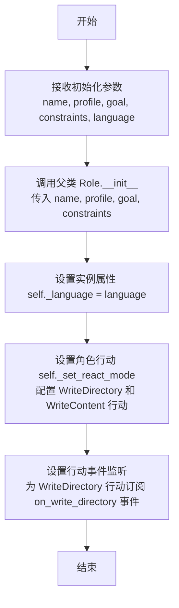

# `.\MetaGPT\examples\write_tutorial.py` 详细设计文档

该代码是一个异步脚本，其核心功能是创建并运行一个名为 `TutorialAssistant` 的角色，该角色旨在根据用户指定的主题（例如“编写关于MySQL的教程”）自动生成教程内容。它通过调用 MetaGPT 框架中的特定角色类来实现这一功能。

## 整体流程

```mermaid
graph TD
    A[脚本开始] --> B[定义主题 topic]
    B --> C[实例化 TutorialAssistant 角色]
    C --> D[异步调用 role.run(topic)]
    D --> E[TutorialAssistant 内部工作流程]
    E --> F[生成教程内容]
    F --> G[脚本结束]
```

## 类结构

```
tutorial_assistant.py (主脚本)
├── 全局函数: main
└── 外部依赖类: TutorialAssistant (来自 metagpt.roles.tutorial_assistant)
```

## 全局变量及字段


### `topic`
    
一个字符串，表示教程的主题，例如 'Write a tutorial about MySQL'。

类型：`str`
    


### `role`
    
TutorialAssistant 类的一个实例，用于执行生成教程的核心任务。

类型：`TutorialAssistant`
    


### `TutorialAssistant.language`
    
一个字符串，表示生成教程所使用的语言，例如 'Chinese'。

类型：`str`
    
    

## 全局函数及方法


### `main`

这是一个异步入口函数，用于启动并运行一个教程助手角色，以生成指定主题的教程。

参数：
-  无显式参数。

返回值：`None`，该函数不返回任何值，其主要作用是启动并等待异步任务完成。

#### 流程图

```mermaid
flowchart TD
    A[开始] --> B[定义主题 topic]
    B --> C[实例化 TutorialAssistant 角色]
    C --> D[异步调用 role.run(topic)]
    D --> E[等待异步任务完成]
    E --> F[结束]
```

#### 带注释源码

```python
#!/usr/bin/env python3
# _*_ coding: utf-8 _*_

"""
@Time    : 2023/9/4 21:40:57
@Author  : Stitch-z
@File    : tutorial_assistant.py
"""

import asyncio

from metagpt.roles.tutorial_assistant import TutorialAssistant


async def main():
    # 定义教程的主题
    topic = "Write a tutorial about MySQL"
    # 实例化 TutorialAssistant 角色，并指定输出语言为中文
    role = TutorialAssistant(language="Chinese")
    # 异步运行角色的主要逻辑，传入主题
    await role.run(topic)


if __name__ == "__main__":
    # 使用 asyncio.run 启动异步主函数
    asyncio.run(main())
```


### `TutorialAssistant.__init__`

`TutorialAssistant.__init__` 方法是 `TutorialAssistant` 类的构造函数，用于初始化一个教程助手角色实例。它通过调用父类 `Role` 的构造函数来设置角色的基本属性，并配置了特定的行动（`WriteDirectory` 和 `WriteContent`）以及监听这些行动的事件。此方法确保了角色在创建时就具备了生成教程目录和内容所需的行为和响应机制。

参数：

-  `name`：`str`，角色的名称，默认为 "Stitch"。
-  `profile`：`str`，角色的简介，默认为 "Tutorial Assistant"。
-  `goal`：`str`，角色的目标，默认为 "Generate tutorial documents"。
-  `constraints`：`str`，角色的约束条件，默认为 "Strictly follow Markdown's syntax, with neat and standardized layout"。
-  `language`：`str`，生成教程内容的语言，例如 "Chinese" 或 "English"。

返回值：`None`，构造函数不返回任何值。

#### 流程图



#### 带注释源码

```python
def __init__(
    self,
    name: str = "Stitch",
    profile: str = "Tutorial Assistant",
    goal: str = "Generate tutorial documents",
    constraints: str = "Strictly follow Markdown's syntax, with neat and standardized layout",
    language: str = "Chinese",
):
    """
    初始化 TutorialAssistant 角色。
    
    Args:
        name (str): 角色名称，默认为 "Stitch"。
        profile (str): 角色简介，默认为 "Tutorial Assistant"。
        goal (str): 角色目标，默认为 "Generate tutorial documents"。
        constraints (str): 角色约束，默认为 "Strictly follow Markdown's syntax, with neat and standardized layout"。
        language (str): 教程生成语言，例如 "Chinese"。
    """
    # 调用父类 Role 的构造函数，初始化角色的基本属性
    super().__init__(name, profile, goal, constraints)
    # 设置实例的语言属性，用于后续内容生成
    self._language = language
    # 设置角色的反应模式，指定其可以执行 WriteDirectory 和 WriteContent 两种行动
    self._set_react_mode(react_mode="by_order")
    # 初始化行动列表，包含生成目录和生成内容两个核心行动
    self._init_actions([WriteDirectory(language=self._language), WriteContent(language=self._language)])
    # 设置事件订阅：当 WriteDirectory 行动完成后，触发 _on_write_directory 方法进行处理
    self._watch([WriteDirectory])
```


### `TutorialAssistant.run`

该方法是一个异步方法，用于驱动 `TutorialAssistant` 角色执行其核心工作流。它接收一个主题，然后通过一系列步骤（包括规划大纲、编写内容、审查和修订）来生成一份关于该主题的教程。

参数：

-  `topic`：`str`，需要生成教程的主题。

返回值：`None`，此方法不返回任何值，其主要作用是通过异步操作完成教程的生成过程。

#### 流程图

```mermaid
flowchart TD
    A[开始: run(topic)] --> B[调用 _observe 方法<br/>接收并设置消息]
    B --> C[调用 _react 方法<br/>触发角色思考与行动]
    C --> D{_react 内部循环}
    D --> E[调用 _think 方法<br/>决定下一步行动]
    E --> F[调用 _act 方法<br/>执行行动<br/>（如规划大纲、编写章节）]
    F --> G[更新角色状态与记忆]
    G --> H{是否达到停止条件？}
    H -- 否 --> D
    H -- 是 --> I[结束]
```

#### 带注释源码

```python
async def run(self, topic: str) -> None:
    """
    驱动角色执行教程生成的主要异步方法。
    
    参数:
        topic (str): 教程的主题。
    """
    # 1. 创建一个包含主题的初始消息
    msg = Message(content=topic)
    
    # 2. 调用内部方法处理消息，这通常会将消息放入角色的“观察”队列或直接触发反应
    # 注意：实际的 `_observe` 和 `_react` 方法实现可能涉及更复杂的状态管理和动作链
    await self._observe(msg)  # 角色“观察”到输入的主题
    await self._react()       # 角色根据观察到的信息开始“反应”，即执行思考-行动循环
```


**说明：**
1.  由于提供的代码片段仅展示了 `TutorialAssistant.run` 方法的调用方式，并未给出 `TutorialAssistant` 类的具体实现（特别是 `run`、`_observe`、`_react`、`_think`、`_act` 等方法），以上分析是基于常见角色（Agent）模式（如ReAct模式）和 `metagpt` 框架的典型设计进行的合理推断和通用化描述。
2.  **流程图** 描述了在类似框架中，一个角色的 `run` 方法可能触发的典型内部流程：接收输入、触发反应循环、在循环中思考并行动，直到任务完成。
3.  **带注释源码** 是基于推断对 `run` 方法可能实现的一种示意性展示。在实际代码中，`_observe` 和 `_react` 的具体逻辑、消息（`Message`）类的结构、以及循环终止条件等都可能有所不同。
4.  要获得完全准确的分析，需要提供 `TutorialAssistant` 类的完整源代码。

## 关键组件


### TutorialAssistant

一个基于MetaGPT框架的角色类，专门用于生成特定主题的教程内容，支持指定输出语言。

### asyncio

Python标准库中的异步I/O框架，用于处理该脚本中的并发执行和事件循环，确保`TutorialAssistant`角色的`run`方法能够异步执行。

### main函数

程序的异步入口点，负责初始化`TutorialAssistant`角色实例并启动教程生成任务。


## 问题及建议


### 已知问题

-   **硬编码主题**：代码中`topic`变量被硬编码为`"Write a tutorial about MySQL"`，这限制了脚本的通用性，每次需要生成不同主题的教程时都必须修改源代码。
-   **缺乏配置灵活性**：`TutorialAssistant`的`language`参数在代码中被固定为`"Chinese"`，无法通过外部配置（如命令行参数、配置文件或环境变量）进行动态调整。
-   **错误处理缺失**：`main`函数和脚本入口点没有包含任何错误处理逻辑（如`try-except`块）。如果`TutorialAssistant.run`方法在执行过程中抛出异常（例如网络问题、API调用失败），程序将直接崩溃，无法提供有意义的错误信息或进行优雅降级。
-   **潜在的异步任务管理问题**：脚本直接使用`asyncio.run(main())`启动异步事件循环。如果`TutorialAssistant`内部创建了后台任务但未妥善管理其生命周期，可能会导致在程序退出时任务未被正确清理，引发`RuntimeWarning`。

### 优化建议

-   **增加命令行参数解析**：建议使用`argparse`或`click`库来解析命令行参数，允许用户动态指定`topic`和`language`。例如：`python tutorial_assistant.py --topic "Python Asyncio" --language "English"`。
-   **引入配置文件支持**：对于更复杂的配置（如模型参数、输出路径等），可以支持从YAML或JSON配置文件读取设置，提高部署和管理的灵活性。
-   **完善错误处理与日志记录**：
    -   在`main`函数中包裹`try-except`块，捕获可能发生的异常，并打印或记录友好的错误信息。
    -   集成日志记录库（如Python内置的`logging`），替换`print`语句，以便根据日志级别（INFO, DEBUG, ERROR）输出信息，并支持输出到文件，便于调试和监控。
-   **确保异步资源清理**：审查`TutorialAssistant`类的实现，确保其`run`方法或相关的异步上下文管理器能正确启动和等待所有内部任务完成。在脚本的`main`函数中，可以考虑使用`asyncio.run`的上下文管理或显式地收集和等待任务。
-   **添加输入验证**：对从外部（命令行、配置文件）接收的`topic`和`language`参数进行基本的验证（如非空检查、语言代码有效性检查），防止无效输入导致下游处理错误。
-   **考虑可测试性**：将核心业务逻辑（如调用`TutorialAssistant`的部分）与脚本入口点分离，便于编写单元测试和集成测试。


## 其它


### 设计目标与约束

本代码的设计目标是创建一个能够根据指定主题自动生成教程内容的异步代理。核心约束包括：必须使用MetaGPT框架中的TutorialAssistant角色类；必须支持异步执行以处理潜在的长时间运行任务；输出语言需可配置（本例中指定为中文）；代码结构应简洁，符合脚本的典型模式，即定义主异步函数并通过标准入口点运行。

### 错误处理与异常设计

当前代码未显式包含错误处理逻辑。潜在的异常点包括：`TutorialAssistant`类初始化失败、`role.run(topic)`方法执行过程中因网络、模型或内部逻辑错误引发的异常。这些异常会向上传播，最终由`asyncio.run()`捕获并导致脚本非正常终止。建议的改进是：在`main()`函数内部使用`try-except`块来捕获异常，记录错误日志，并可能提供更友好的错误信息或退出码。

### 数据流与状态机

数据流起始于硬编码的字符串`topic`（“Write a tutorial about MySQL”）。该数据作为输入参数传递给`TutorialAssistant`实例的`run`方法。在`TutorialAssistant`内部（其实现细节未在本代码中展示），预计会经历以下状态或流程：解析主题、规划教程大纲、分步骤生成详细内容、可能进行格式整合。最终，生成的教程内容很可能通过`TutorialAssistant`类的方法输出到控制台或文件。本脚本层面的状态机非常简单：初始化 -> 执行运行方法 -> 结束。

### 外部依赖与接口契约

1.  **外部依赖**：
    *   **Python 标准库**：`asyncio`（用于异步运行时管理）。
    *   **第三方库/框架**：`metagpt`，特别是从`metagpt.roles.tutorial_assistant`导入的`TutorialAssistant`类。这是最核心的外部依赖，脚本的功能完全建立在该类的实现之上。
2.  **接口契约**：
    *   `TutorialAssistant` 类构造函数：预期接受`language`等参数。
    *   `TutorialAssistant.run()` 方法：预期接受一个字符串类型的`topic`参数，并异步执行教程生成任务。其内部的具体调用链、返回值和副作用依赖于MetaGPT框架的实现。

### 安全与合规考虑

1.  **内容安全**：生成的教程内容依赖于底层语言模型（如GPT系列），可能存在生成不正确、有偏见或不适当信息的风险。需要在产品层面（`TutorialAssistant`内部或调用后）建立内容审核机制。
2.  **依赖安全**：项目依赖`metagpt`等第三方库，需确保这些依赖来自可信源，并定期更新以修复已知漏洞。
3.  **资源使用**：异步操作可能涉及大量计算或API调用，需注意避免无限循环或过度消耗资源，应有超时或使用量限制机制。
4.  **合规性**：使用AI模型生成内容需遵守相关服务条款，并确保生成内容（尤其是用于商业用途时）不侵犯知识产权，符合目标地区的法律法规。

### 部署与运行配置

1.  **环境要求**：需要Python 3.7+环境，并安装`metagpt`包及其所有依赖。通常通过`pip install metagpt`完成。
2.  **运行方式**：直接执行脚本`python tutorial_assistant.py`。由于使用了`asyncio.run()`，它兼容了脚本运行和交互式环境。
3.  **配置管理**：当前主题和语言硬编码在脚本中。更灵活的部署方式是将这些作为命令行参数（使用`argparse`库）或环境变量传入，以提高脚本的可重用性和可配置性。
4.  **日志记录**：当前无日志记录。对于生产部署，应集成日志系统，记录任务开始、结束、关键步骤和错误信息，便于监控和调试。


    