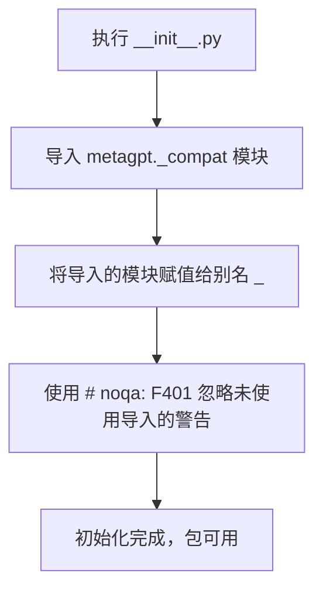

# `.\MetaGPT\metagpt\__init__.py` 详细设计文档

这是一个Python包的初始化文件，其主要功能是导入并激活`metagpt`包的兼容性模块（`_compat`），确保包在不同环境下的兼容性。它本身不包含具体的业务逻辑，而是作为包的入口点，执行必要的初始化操作。

## 整体流程



## 类结构

```
此文件不包含类定义，因此没有类层次结构。
它是一个模块级别的初始化脚本。
```

## 全局变量及字段


### `_`
    
导入的metagpt._compat模块的别名，用于确保兼容性，并避免未使用的导入警告。

类型：`module`
    


    

## 全局函数及方法


## 关键组件


### 模块导入与兼容性处理

通过 `_compat` 模块的导入，为代码库提供跨Python版本的兼容性支持，确保核心功能在不同环境下稳定运行。

### 包初始化与命名空间管理

作为 `__init__.py` 文件，它定义了当前Python包的公共接口和初始化逻辑，控制着哪些模块和符号对外部可见。


## 问题及建议


### 已知问题

-   **空文件问题**：当前 `__init__.py` 文件内容极其简单，仅包含一个导入语句。这通常意味着该模块（包）尚未定义任何公开的接口或功能，对于使用者而言，其用途和提供的功能不明确。
-   **导入副作用**：代码 `from metagpt import _compat as _` 执行了一个导入操作，并将其重命名为 `_`。虽然使用了 `# noqa: F401` 来忽略未使用的警告，但这种将重要模块重命名为单下划线的做法不符合常规命名约定，降低了代码的可读性，使其他开发者难以理解 `_` 代表什么。
-   **模块初始化缺失**：作为包的 `__init__.py` 文件，通常用于聚合子模块、定义包的公共API或执行必要的初始化。当前文件没有履行这些职责，可能导致包结构松散，使用不便。

### 优化建议

-   **明确包的功能与接口**：在 `__init__.py` 中，应通过 `__all__` 列表明确声明本包对外公开的模块、类、函数或变量。例如，如果 `metagpt` 包下有 `engine`, `actions`, `provider` 等子模块，可以在此处导入并暴露关键类，方便用户通过 `from metagpt import Engine` 等方式直接使用。
-   **移除或重构模糊的导入**：建议移除 `from metagpt import _compat as _` 这一行，除非它有明确的、必要的副作用（如注册适配器、修补标准库等）。如果 `_compat` 模块确实需要被导入以激活某些兼容性处理，应使用更清晰的命名（如 `import metagpt._compat` 或赋予一个描述性的别名），并添加注释说明其作用。
-   **添加包级别文档**：在文件顶部添加模块文档字符串（`""" ... """`），简要说明 `metagpt` 包的核心目的、主要组件和基本用法。这能极大提升代码的可维护性和新开发者的上手速度。
-   **考虑惰性导入**：如果包较大，为了优化启动性能，可以考虑在 `__init__.py` 中使用惰性导入（例如通过 `__getattr__` 和 `__dir__` 实现），仅在用户实际访问某个子模块或属性时才进行导入。


## 其它


### 设计目标与约束

该代码文件（`__init__.py`）的设计目标是为 `metagpt` 包提供一个统一的入口点，并确保与旧版本Python的兼容性。其主要约束是保持简洁，不引入额外的业务逻辑，仅通过导入 `_compat` 模块来触发兼容性处理，并遵循Python包的标准结构。

### 错误处理与异常设计

当前代码不包含显式的错误处理逻辑。其核心操作是导入 `metagpt._compat` 模块。如果此模块不存在或导入失败，Python解释器将抛出标准的 `ModuleNotFoundError` 或 `ImportError`。由于这是包初始化的一部分，此类错误通常表示包安装不完整或损坏，应由上层安装或部署流程处理。

### 数据流与状态机

此文件不涉及复杂的数据流或状态机。其执行流程是线性的：当 `metagpt` 包或其子模块被首次导入时，Python解释器执行此 `__init__.py` 文件。文件中的导入语句会触发 `metagpt/_compat/__init__.py` 模块的执行，该模块可能进行一些全局的兼容性设置或变量初始化。之后，控制权返回，不产生持续的状态变化。

### 外部依赖与接口契约

1.  **内部依赖**：强依赖于同一包下的 `_compat` 子模块。此依赖是硬编码的，是包内部结构的一部分。
2.  **外部依赖**：无直接的外部第三方库依赖。`_compat` 模块内部可能包含对特定Python版本或标准库模块的检查和处理。
3.  **接口契约**：作为包的 `__init__.py`，它定义了包（`metagpt`）的顶级命名空间。通过导入 `_compat` 并重命名为 `_`，它确保该兼容性模块的副作用（如果有）被加载，但避免其名称污染包的顶级命名空间（因为被重命名为不常用的 `_`）。它向使用者隐式承诺，导入 `metagpt` 包即已准备好兼容性环境。

### 安全考虑

当前代码本身不引入安全风险。它仅执行一个内部模块导入。安全性的考虑应集中在被导入的 `_compat` 模块以及整个 `metagpt` 包的代码实现上。需要确保 `_compat` 模块不会执行任何不安全的操作，例如从不可信源动态加载代码。

### 测试策略

对此文件的单元测试通常不是必需的，因为它的功能极其简单且直接依赖于Python自身的导入机制。测试重点应放在：
1.  验证 `metagpt` 包能够被成功导入。
2.  验证 `metagpt._compat` 模块的功能是否符合预期（例如，是否正确处理了不同Python版本间的差异）。
这些测试应作为集成测试或整个包测试的一部分来完成。

### 部署与运维

此文件是标准Python包的一部分，部署时随整个包一起打包（例如，打入 `wheel` 或 `sdist` 包中）。运维方面无特殊要求。如果未来 `_compat` 模块的功能发生变化，需要确保在部署新版本时，该初始化导入行为仍然正确且必要。

### 配置管理

此文件没有可配置的选项。所有的行为都由导入语句静态决定。任何配置（如启用或禁用某些兼容性特性）理论上应在 `_compat` 模块内部或通过环境变量等方式管理，而非在此入口文件中。


    