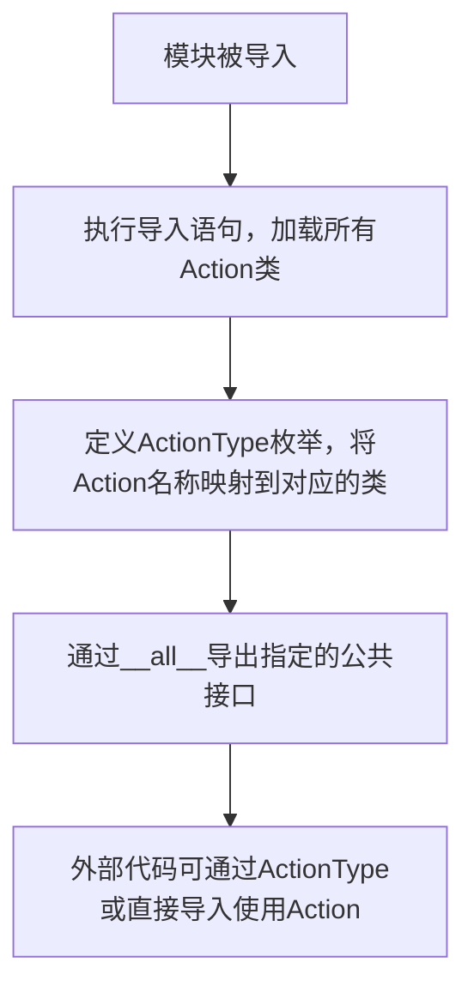

# `.\MetaGPT\metagpt\actions\__init__.py` 详细设计文档

该文件是MetaGPT项目中actions模块的初始化文件，主要功能是集中导入和导出所有Action类，并定义一个枚举ActionType来索引这些Action类型，为智能体系统提供统一的行为接口和类型映射。

## 整体流程



## 类结构

```
Action (基类)
├── UserRequirement
├── WritePRD
├── WritePRDReview
├── WriteDesign
├── DesignReview
├── WriteCode
├── WriteCodeReview
├── WriteTest
├── RunCode
├── DebugError
├── WriteTasks
├── SearchAndSummarize
├── CollectLinks
├── WebBrowseAndSummarize
├── ConductResearch
├── ExecuteNbCode
├── WriteAnalysisCode
└── WritePlan
```

## 全局变量及字段


### `__all__`
    
定义模块的公共接口，控制通过`from metagpt.actions import *`导入时暴露的符号。

类型：`List[str]`
    


### `ActionType.ADD_REQUIREMENT`
    
枚举成员，代表用户需求收集动作，映射到`UserRequirement`类。

类型：`ActionType`
    


### `ActionType.WRITE_PRD`
    
枚举成员，代表编写产品需求文档动作，映射到`WritePRD`类。

类型：`ActionType`
    


### `ActionType.WRITE_PRD_REVIEW`
    
枚举成员，代表评审产品需求文档动作，映射到`WritePRDReview`类。

类型：`ActionType`
    


### `ActionType.WRITE_DESIGN`
    
枚举成员，代表编写系统设计文档动作，映射到`WriteDesign`类。

类型：`ActionType`
    


### `ActionType.DESIGN_REVIEW`
    
枚举成员，代表评审系统设计文档动作，映射到`DesignReview`类。

类型：`ActionType`
    


### `ActionType.WRTIE_CODE`
    
枚举成员，代表编写代码动作，映射到`WriteCode`类。

类型：`ActionType`
    


### `ActionType.WRITE_CODE_REVIEW`
    
枚举成员，代表代码评审动作，映射到`WriteCodeReview`类。

类型：`ActionType`
    


### `ActionType.WRITE_TEST`
    
枚举成员，代表编写测试用例动作，映射到`WriteTest`类。

类型：`ActionType`
    


### `ActionType.RUN_CODE`
    
枚举成员，代表运行代码动作，映射到`RunCode`类。

类型：`ActionType`
    


### `ActionType.DEBUG_ERROR`
    
枚举成员，代表调试错误动作，映射到`DebugError`类。

类型：`ActionType`
    


### `ActionType.WRITE_TASKS`
    
枚举成员，代表编写项目管理任务动作，映射到`WriteTasks`类。

类型：`ActionType`
    


### `ActionType.SEARCH_AND_SUMMARIZE`
    
枚举成员，代表搜索并总结信息动作，映射到`SearchAndSummarize`类。

类型：`ActionType`
    


### `ActionType.COLLECT_LINKS`
    
枚举成员，代表收集链接动作，映射到`CollectLinks`类。

类型：`ActionType`
    


### `ActionType.WEB_BROWSE_AND_SUMMARIZE`
    
枚举成员，代表网页浏览并总结动作，映射到`WebBrowseAndSummarize`类。

类型：`ActionType`
    


### `ActionType.CONDUCT_RESEARCH`
    
枚举成员，代表执行研究动作，映射到`ConductResearch`类。

类型：`ActionType`
    


### `ActionType.EXECUTE_NB_CODE`
    
枚举成员，代表执行Notebook代码动作，映射到`ExecuteNbCode`类。

类型：`ActionType`
    


### `ActionType.WRITE_ANALYSIS_CODE`
    
枚举成员，代表编写分析代码动作，映射到`WriteAnalysisCode`类。

类型：`ActionType`
    


### `ActionType.WRITE_PLAN`
    
枚举成员，代表编写计划动作，映射到`WritePlan`类。

类型：`ActionType`
    
    

## 全局函数及方法


## 关键组件

### ActionType 枚举

用于索引和定义系统中所有可用的 Action 类型，将 Action 的枚举名称映射到其对应的具体实现类。

### Action 基类

所有具体 Action 的抽象基类，定义了 Action 执行的标准接口和通用行为。

### ActionOutput 类

用于封装 Action 执行后产生的结构化输出结果，便于在系统中传递和处理。

## 问题及建议


### 已知问题

-   **枚举类 `ActionType` 维护成本高**：`ActionType` 枚举类需要手动维护，每当新增或删除一个 `Action` 子类时，都需要同步更新此枚举。这增加了代码维护的复杂度和出错风险，容易导致枚举值与实际类不同步。
-   **潜在的循环导入风险**：`__init__.py` 文件导入了大量 `metagpt.actions` 子模块中的类，而这些子模块可能又通过 `from metagpt.actions import ...` 的方式导入本模块中的 `ActionType` 等。如果导入顺序或结构设计不当，容易引发循环导入错误。
-   **`__all__` 列表不完整**：当前 `__all__` 列表仅导出了 `ActionType`, `Action`, `ActionOutput` 三个对象。然而，文件中实际导入并可能希望对外暴露的类（如 `WritePRD`, `WriteCode` 等）并未包含在内。这可能导致使用 `from metagpt.actions import *` 时无法获取到所有预期的组件，影响模块的可用性和清晰度。

### 优化建议

-   **使用动态注册机制替代硬编码枚举**：建议实现一个 `Action` 类的注册机制（例如，使用类装饰器或元类）。每个 `Action` 子类在定义时自动向一个中央注册表注册，并可以附带一个唯一的类型标识符（字符串）。这样，`ActionType` 可以动态地从注册表中生成，无需手动维护，提高可扩展性和可维护性。
-   **重构导入结构以消除循环依赖**：审查 `metagpt.actions` 包内各模块间的导入关系。可以考虑将 `ActionType` 等共享的、基础的定义移到一个独立的、不依赖具体 `Action` 子类的底层模块中（例如 `metagpt.actions.base`），从而打破循环导入链。
-   **完善 `__all__` 列表**：根据模块的设计意图，将需要对外公开的所有类、函数和变量添加到 `__all__` 列表中。例如，可以将所有导入的 `Action` 子类都加入，以确保接口的明确性和完整性。或者，如果设计上只希望暴露少数核心类，则应清理未在 `__all__` 中列出的导入语句，避免不必要的命名空间污染。
-   **考虑使用 `typing.TYPE_CHECKING` 处理类型注解**：如果某些导入仅用于类型注解（例如在方法签名中），可以使用 `if TYPE_CHECKING:` 条件导入，这有助于解决运行时的循环导入问题，同时保持类型检查器的有效性。


## 其它


### 设计目标与约束

该模块的核心设计目标是提供一个统一、可扩展的“动作（Action）”抽象层，用于封装和管理MetaGPT框架中所有可执行的原子操作。其主要约束包括：
1.  **统一接口**：所有具体动作类必须继承自基类`Action`，遵循其定义的执行接口（如`run`方法），确保框架能以一致的方式调度和执行各种任务。
2.  **枚举索引**：通过`ActionType`枚举类，为每个具体的动作类提供一个唯一的、可读的标识符，便于在系统其他部分（如角色配置、工作流引擎）中引用和实例化动作，实现解耦。
3.  **模块化组织**：将不同领域的动作（如产品需求、设计、编码、测试、研究、数据分析）组织在同一个包下，并通过`__all__`控制对外暴露的公共接口，保持模块结构的清晰和依赖的可管理性。
4.  **可发现性与维护性**：作为动作类的集中注册和导出点，方便开发者查看、添加新的动作类型，并管理动作间的依赖关系。

### 错误处理与异常设计

当前模块主要作为动作类的定义和枚举容器，不直接包含业务逻辑，因此其错误处理主要体现在结构化和导入层面：
1.  **导入依赖**：模块成功运行的前提是所导入的所有子模块（如`metagpt.actions.write_code`）及其中的类必须存在且可访问。任何导入失败（如`ModuleNotFoundError`, `ImportError`）将导致整个模块初始化失败。
2.  **枚举值唯一性**：`ActionType`枚举确保了每个动作类型名称的唯一性。如果枚举定义中出现重复的键或值，Python解释器会抛出错误，这需要在开发阶段通过代码审查或静态检查来预防。
3.  **类型安全**：`ActionType`枚举的值被设计为对应的类对象本身（如`ActionType.WRITE_PRD = WritePRD`）。在使用时，调用方需确保从枚举获取的类对象被正确实例化和使用。框架的其他部分应负责处理具体动作执行过程中可能抛出的业务异常（如网络错误、API调用失败、代码执行错误等），这些异常处理策略定义在各个具体的`Action`子类中。

### 数据流与状态机

本模块定义了动作的类型，但不直接驱动数据流或状态转换。它是更高级别工作流或状态机的“零件库”：
1.  **数据流上下文**：每个`Action`子类在执行时，通常接收特定的输入数据（通过`run`方法的参数传入，如需求描述、设计文档、代码上下文等），并产生特定的输出数据（通常封装在`ActionOutput`或类似对象中）。本模块通过枚举将这些输入-输出契约与动作类型关联起来。
2.  **状态机角色**：在MetaGPT的典型工作流（如“需求 -> PRD -> 设计 -> 编码 -> 测试”）中，每个步骤对应一个或多个`ActionType`中定义的动作。一个角色（Role）或工作流引擎（Workflow）根据当前状态（例如“已完成PRD评审”）决定下一个要执行的动作类型（例如`ActionType.WRITE_DESIGN`），从而驱动状态演进。本模块提供了状态转换中可用的“动作”集合的定义。

### 外部依赖与接口契约

1.  **内部依赖**：
    *   **基类与输出**：强依赖于`metagpt.actions.action`模块中的`Action`基类和`metagpt.actions.action_output`模块中的`ActionOutput`类。这些定义了所有动作必须遵守的核心接口和输出格式。
    *   **具体动作实现**：依赖于`metagpt.actions`子包下的所有具体动作模块（如`write_prd`, `design_api`, `write_code`等）。这些模块提供了`ActionType`枚举中列出的各个类的具体实现。
2.  **外部接口契约**：
    *   **对框架其他部分的契约**：本模块通过`__all__`导出了`ActionType`, `Action`, `ActionOutput`。这是模块对外提供的主要服务契约。其他模块应通过导入这些符号来使用动作枚举和基类，而不是直接导入具体的动作类（除非有特殊需要），以降低耦合度。
    *   **动作执行契约**：任何使用`ActionType`来获取并执行动作的代码，都隐式地契约了必须按照`Action`基类定义的接口（尤其是`run`方法）来调用该动作。调用方需要准备符合具体动作要求的输入参数，并处理其返回的`ActionOutput`或可能抛出的异常。

    